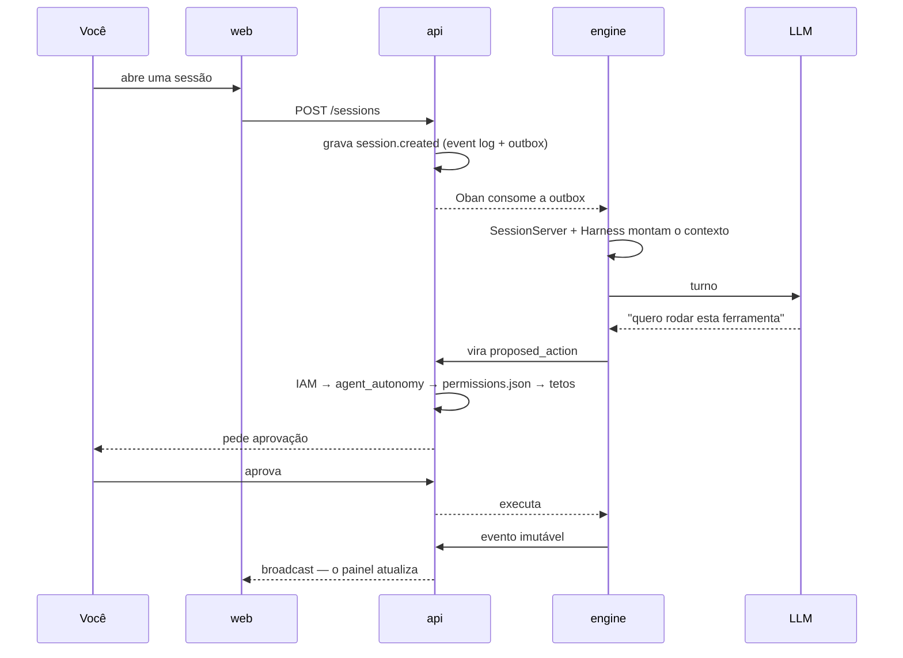

<div align="center">

# Brabo

**Um time de agentes de IA conduz sua aplicação do brief ao deploy.
A autoridade final continua sendo sua — por construção, não por convenção.**

[](https://github.com/daneiel/brabo/actions/workflows/ci.yml)
[](LICENSE)
[](CHANGELOG.md)
[](https://daneiel.github.io/brabo/)

</div>

---

## O que é

O Brabo orquestra agentes especializados — Criativo, PO, Arquiteto, devs por
módulo, Infra, QA, SecOps, Psicólogo e Anamnese — trabalhando sobre um
repositório git real, com Gitflow provisionado automaticamente.

O que o separa de um assistente de código:

**Nada com efeito externo acontece sozinho.** Comando de terminal, commit,
push, PR, merge, gasto de token — tudo nasce como `proposed_action`, passa pela
política do projeto (`deny` sempre vence `allow`) e só então executa. Dois casos
nem a política consegue liberar: **merge em branch protegida** e **mudança na
instrução de um agente**. São tetos aplicados depois de toda a política, não
defaults.

**O agente não é confiável por construção, e o sistema assume isso.** Teto de
iterações, teto de correções por task, orçamento que recusa a chamada, catálogo
fechado do que a Anamnese pode perfilar. Prompt não é garantia; código é.

**Tudo é registrado e imutável.** O event log é append-only com numeração densa
por sessão. É o que torna a evidência do Psicólogo rastreável, o custo auditável
e o backup verificável.

**O time melhora, com você no circuito.** O Psicólogo propõe hipóteses ancoradas
em eventos reais; a Anamnese deriva seu perfil de proficiência e propõe patches
de instrução versionados. Cada patch precisa do seu aval, e reverter cria versão
nova em vez de apagar histórico.

## Começar em três comandos

```bash
cp .env.example .env
pnpm install
pnpm dev
```

`pnpm dev` sobe o Docker Compose (Postgres 16 + pgvector, api, engine, web)
com hot reload. Na primeira subida a api e o engine aplicam as próprias
migrações. `pnpm --filter api seed` cria os usuários de demonstração.

| serviço | endereço | nota |
|---|---|---|
| Web | <http://localhost:5173> | login `owner@brabo.dev` / `brabo12345678` (do seed) |
| API | <http://localhost:3000> | `GET /health` |
| Engine | <http://localhost:4000> | `GET /health` |

`pnpm dev:down` derruba tudo. `pnpm dev:build` força rebuild.

> **`pnpm dev` e `make deploy-local` não coexistem.** Os dois publicam api e
> engine nas mesmas portas — de propósito (ADR 0025), para o smoke test valer
> nos dois. Com o cluster local de pé, a **5173 não
> abre**, e o web fica em <http://localhost:8088>. `pnpm dev:preflight` diz em
> qual modo você está; `make k8s-down` volta para este. Detalhes em
> [Primeiros passos](docs/getting-started.md#os-dois-modos-locais-não-coexistem).

> Os containers de `api` e `web` rodam como root em desenvolvimento e escrevem
> `node_modules` e `apps/api/dist` no bind mount. Para buildar no host depois,
> use `docker compose exec api sh` ou rode uma vez
> `sudo chown -R $USER apps/api/dist apps/*/node_modules`.

## Como funciona um turno



## Documentação

**📖 [daneiel.github.io/brabo](https://daneiel.github.io/brabo/)** — a mesma
documentação abaixo, navegável e com busca. O site lê de `docs/`, publica no
merge em `main`, e por isso fica um ciclo de promoção atrás do que está em
`dev`: para o estado mais recente, leia os arquivos aqui.

| documento | para |
|---|---|
| [Introdução](docs/intro.md) | o panorama |
| [Primeiros passos](docs/getting-started.md) | do clone ao primeiro turno de agente |
| [Arquitetura](docs/architecture.md) | code map, fronteiras, invariantes, dívida técnica |
| [Regras de negócio](docs/business-rules.md) | as 35 RNs, cada uma com `arquivo:linha` e o teste que a cobre |
| [Runbook](docs/runbook.md) | deploy, rollout, restore, rotação de chave, incidente de custo |
| [Glossário](docs/glossary.md) | harness, gate, handoff, DEK, outbox, ciclo K |
| [Observabilidade](docs/explanation/observability.md) | como se segue uma ação pelos três processos: trace, log e o caminho entre camadas |
| [Configuração](docs/reference/configuration.md) | todas as variáveis de ambiente |
| [Eventos](docs/reference/events.md) | os tipos do event log, broadcasts e spans |
| [Permissões](docs/reference/permissions.md) | o formato do `permissions.json` e a ordem da decisão |
| [Artefatos](docs/reference/artifacts.md) | os seis schemas e quem pode emitir cada um |
| [Providers de git](docs/reference/git-providers.md) | o contrato de dez operações e as capabilities |
| [API interna](docs/reference/internal-api.md) | o contrato api ↔ engine |
| [ADRs](docs/adr/index.md) | as 39 decisões e o porquê de cada uma |
| [Segurança](SECURITY.md) | como reportar uma vulnerabilidade |
| [Como contribuir](CONTRIBUTING.md) | fluxo, Definition of Done, o que é aceito |
| [Onde pedir ajuda](SUPPORT.md) | qual canal para cada tipo de assunto |
| [Código de conduta](CODE_OF_CONDUCT.md) | Contributor Covenant 2.1 |

## Stack

| camada | tecnologia |
|---|---|
| `apps/api` | NestJS 11 + Drizzle ORM + PostgreSQL 16 + pgvector |
| `apps/engine` | Elixir/OTP + Phoenix (canais) + Oban (filas no Postgres) |
| `apps/web` | React 19 + Vite + TanStack Query/Router |
| auth | first-party na api (argon2id + access JWT Ed25519 + refresh opaco com rotação); RBAC no domínio da api |
| deploy | Kubernetes via Kustomize; Docker Compose para desenvolvimento |

Sem Redis: as filas moram no Postgres via Oban, e o rate limit é uma janela
deslizante em SQL.

## Estrutura

```
apps/
  api/      NestJS + Drizzle          → schema "public"
  engine/   Elixir/OTP + Phoenix      → schema "engine"
  web/      React + Vite
packages/
  shared/   tipos TS compartilhados (import type only)
design/     design system — fonte de verdade de UI
docker/     compose de dev e prod, Dockerfiles, smoke.sh
deploy/k8s/ base + overlays local/staging/prod (Kustomize)
docs/       esta documentação, incluindo os ADRs
```

`apps/engine` fica fora do workspace pnpm (é um projeto Mix), com scripts na
raiz que delegam para o `mix`:

```bash
pnpm engine:setup    # deps.get + ecto.create + ecto.migrate
pnpm engine:dev      # phx.server fora do Docker
pnpm engine:test     # mix test
```

> **Elixir 1.17.3 / OTP 27.1.2** é a versão do projeto, a mesma nos Dockerfiles
> e no CI. O `mix format` de versões mais novas produz saída diferente e deixa o
> `--check-formatted` do CI vermelho. Se o seu host tiver outra versão, formate
> pelo container:
>
> ```bash
> docker run --rm -v "$PWD/apps/engine:/app" -w /app \
>   hexpm/elixir:1.17.3-erlang-27.1.2-alpine-3.20.3 mix format
> ```

## Banco de dados

Um Postgres, uma database (`brabo`), dois schemas para nunca colidir:

- **api (Drizzle)** — domínio em `public`; migrações em
  `apps/api/src/db/migrations/`, aplicadas com `pnpm db:migrate`
  (`pnpm db:generate` depois de mudar `apps/api/src/db/schema.ts`).
- **engine (Ecto/Oban)** — domínio e Oban em `engine`, via
  `migration_default_prefix`. Migrações em `apps/engine/priv/repo/migrations/`.

pgvector é habilitado por `docker/postgres/init.sql`, que roda uma vez na
criação do volume.

## Testes

```bash
pnpm --filter api test      # vitest
pnpm --filter web test      # vitest
pnpm engine:test            # ExUnit
```

Nenhuma feature entra sem teste do caminho feliz **e** de um caso de falha. Os
providers de git são validados por uma **suite de contrato única** rodada contra
os três (Local, GitHub, GitLab). Dois testes merecem menção porque protegem
propriedades e não implementações:

- `apps/api/test/interfaces/route-surface.spec.ts` enumera as rotas em runtime e
  confere contra [`docs/security-surface.md`](docs/security-surface.md) — **rota
  nova sem classificação quebra o teste**.
- `apps/engine/test/engine_web/route_surface_test.exs` faz uma requisição sem
  token a cada rota registrada e exige 401, salvo exceções nomeadas.

## Saúde e observabilidade

`GET /health` valida a conexão com o Postgres nos dois serviços. Em Kubernetes
as probes são **três**, porque as perguntas são diferentes (ADR 0025): `/live`
responde sem tocar o banco — um liveness ligado ao Postgres reiniciaria todas as
réplicas de uma vez num banco lento —, `/health` é o readiness da api, e
`/ready` no engine só libera tráfego depois que a reidratação de sessões
terminou.

Uma sessão é uma **trace raiz** atravessando api e engine, e o `trace_id` nasce
no browser — as três streams de log carregam o mesmo id. Isso vale **sem
coletor**: instrumentar e exportar são decisões separadas, então `pnpm dev` tem
correlação mesmo sem nada rodando em `monitoring`.

O log é uma linha de JSON por evento em produção e legível para gente em
desenvolvimento, onde cada requisição também rende uma linha com o **caminho
entre camadas** e a duração de cada passo:

```
POST /projects/…/sessions — 34.1ms trace=4bf92f35
  interfaces        SessionsController.create         0ms
    ↳ application     CreateSessionUseCase.execute    31.2ms
      ↳ infrastructure  DrizzleOutboxRepository.append  2.1ms
```

Métricas Prometheus cobrem tokens/min e custo/hora por projeto, fila do Oban,
sessões ativas e taxa de aprovação. Dashboards Grafana são provisionados como
código. O modelo inteiro está em
[observabilidade](docs/explanation/observability.md).

## Produção

Imagens multi-stage, **non-root**, rootfs read-only, sem bind mount:
`docker/<app>/Dockerfile.prod`. A api roda `node main.js` sobre o `dist`, o
engine roda um `mix release` (sem Mix, sem código-fonte) e o web sai por nginx.

```bash
docker compose -f docker/docker-compose.prod.yml up -d --build --wait
bash docker/smoke.sh
docker compose -f docker/docker-compose.prod.yml down -v
```

O `smoke.sh` confere que as três imagens rodam non-root, faz login, cria
workspace → projeto → sessão e checa os healths. É o mesmo script do CI.

**Dois volumes precisam ser idênticos em api e engine:**

| caminho | conteúdo |
|---|---|
| `/data/project-workspaces` | working tree por projeto, worktrees por agente, `permissions.json` |
| `/data/git-repos` | bare repos locais (destino do `git push` do dev agent) |

A api persiste o path absoluto do bare repo no banco e o engine o usa
literalmente; montar em lugares diferentes quebra o push com
`remote unpack failed`.

## Deploy em Kubernetes

Manifests em `deploy/k8s/` com **Kustomize** (base + overlays `local`, `staging`,
`prod`) — a escolha está no
[ADR 0025](docs/adr/0025-fase5-deploy-kubernetes-kustomize.md). Operadores de
terceiros (External Secrets, CloudNativePG, Prometheus, prometheus-adapter) vêm
por Helm, com versão pinada pelo bootstrap.

```bash
make deploy-local     # sobe cluster k3d, instala tudo e roda o smoke
make hpa-test         # enche a fila do Oban e prova que o HPA escala
make rollout-test     # prova que um rollout do engine não deixa sessão órfã
make test-restore     # dispara backup real, restaura e valida
make k8s-validate     # monta e valida os overlays (não precisa de cluster)
make k8s-down         # remove o cluster
```

O engine escala por **profundidade da fila do Oban**: `/metrics` expõe
`oban_queue_depth{queue,state}` e o HPA consome `state="available"`. O filtro por
estado não é detalhe — três workers se auto-reagendam, então `oban_jobs` nunca
está vazia e um HPA sem filtro escalaria ao máximo num sistema ocioso.

Passo a passo e diagnóstico no [runbook](docs/runbook.md#deploy-local).

## CI

`.github/workflows/ci.yml` roda em push para `feature/**` e em PR para `dev`:
lint em modo verificação, testes de api/web/engine, validação dos manifests
(`kustomize build` + `kubeconform` + shellcheck), build das três imagens com
cache, **Trivy** nas imagens, **gitleaks** no repositório, auditoria de
dependências com gate em crítica, e o teste de fumaça.

O gate de dependências foi verificado com uma vulnerabilidade crítica plantada:
o job reprovou, e voltou a passar depois do revert.

## Frontend

Login próprio (`/login`, `/registrar`, `/esqueci-senha`, `/definir-senha`):
o access token vive em memória e o refresh num cookie httpOnly, então a sessão
sobrevive ao reload sem passar por `localStorage`. As quatro seguem o mockup
aprovado do design system, com a marca acima do card e a versão do artefato no
rodapé ([ADR 0036](docs/adr/0036-telas-de-auth-fieis-ao-design-e-fontes-auto-hospedadas.md)).
Depois do login o app opera sobre o primeiro workspace do usuário:

- **Dashboard** (`/`) — grid de projetos e o wizard "Novo projeto"
- **Projeto** (`/projects/:id`) — Visão geral (time de agentes + feed de
  atividade), Sessões, Aprovações (fila + tabela do `permissions.json`),
  Configurações (modelos por agente, membros, credenciais)
- **Sessão** (`/projects/:id/sessions/:sid`) — chat com streaming, seletor de
  modelo, `TokenMeter` ao vivo e aprovação de ações inline

`/status` é a única rota **pública** fora de auth: consulta os `/health` da api
e do engine, que já são públicos porque é o kubelet que os chama.

O streaming do agente chega pelo canal Phoenix `session:<id>`
(`agent.delta`, `agent.status`, `agent.done`); listas e contadores usam
TanStack Query.

As três famílias do design system (Space Grotesk, Archivo, IBM Plex Mono) são
**auto-hospedadas** em `apps/web/public/fonts/`. Não é preferência: a CSP da
imagem de produção é `font-src 'self' data:`, e o `<link>` para o Google Fonts
que existia antes era bloqueado em silêncio — em produção a tipografia caía em
fonte de sistema, e título e corpo ficavam indistinguíveis.

## Convenções

- Trabalhe **sempre** em `feature/*` a partir de `dev`. Branches permanentes:
  `dev`, `qa`, `rc`, `main`.
- Conventional commits em **pt-BR**.
- Merge em branch protegida é **sempre** manual — não há opção de automatizar,
  e um teste garante isso.
- Commits de agente usam a identidade `<agente>[bot]` com o usuário como
  co-author.
- Todo evento de domínio é imutável: nunca `UPDATE` em tabela de evento.
- Decisões arquiteturais relevantes viram [ADR](docs/adr/index.md).

`CLAUDE.md` traz o detalhamento completo, e é o que os agentes leem.

## Estado

**Fases 1 a 5 concluídas**, versão **v0.1.0** ([CHANGELOG](CHANGELOG.md)).
Backup com restore testado, graceful shutdown sem sessão órfã, observabilidade
ponta a ponta e superfície HTTP auditada.

O que ainda não existe está dito onde importa: a
[dívida técnica conhecida](docs/architecture.md#divida-tecnica) é uma seção da
documentação, não uma omissão.

## Licença

[MIT](LICENSE) © 2026 Daniel Souza — texto oficial, sem cláusulas adicionais.

A imagem do engine embute ferramentas de terceiros de que os gates dependem
(gitleaks, hadolint, semgrep, yamllint), **algumas sob GPL**. Executá-las como
processo separado não contamina nada, mas **publicar a imagem** num registry
cria obrigação de disponibilizar fonte. Está tudo levantado, com versão e
licença de cada uma, em [THIRD_PARTY_NOTICES.md](THIRD_PARTY_NOTICES.md) —
leia antes do primeiro push para registry.

A imagem do web embute as três fontes do design system, todas **OFL 1.1** — uma
licença permissiva, mas que exige distribuir o aviso de copyright junto do
binário. Ele está em `apps/web/public/fonts/LICENSE.txt`, servido com o resto do
estático, e a obrigação está registrada no mesmo arquivo de avisos.
