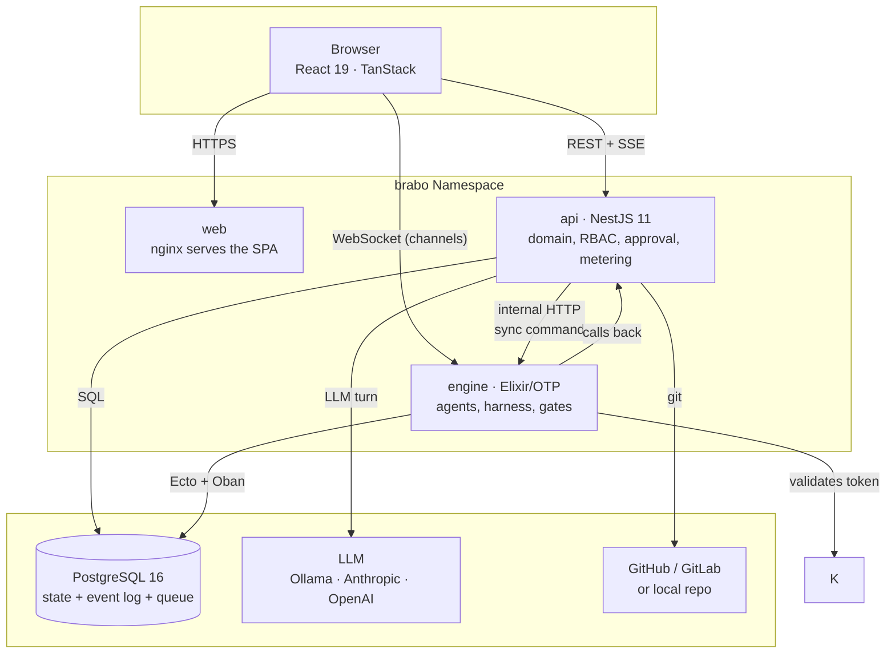
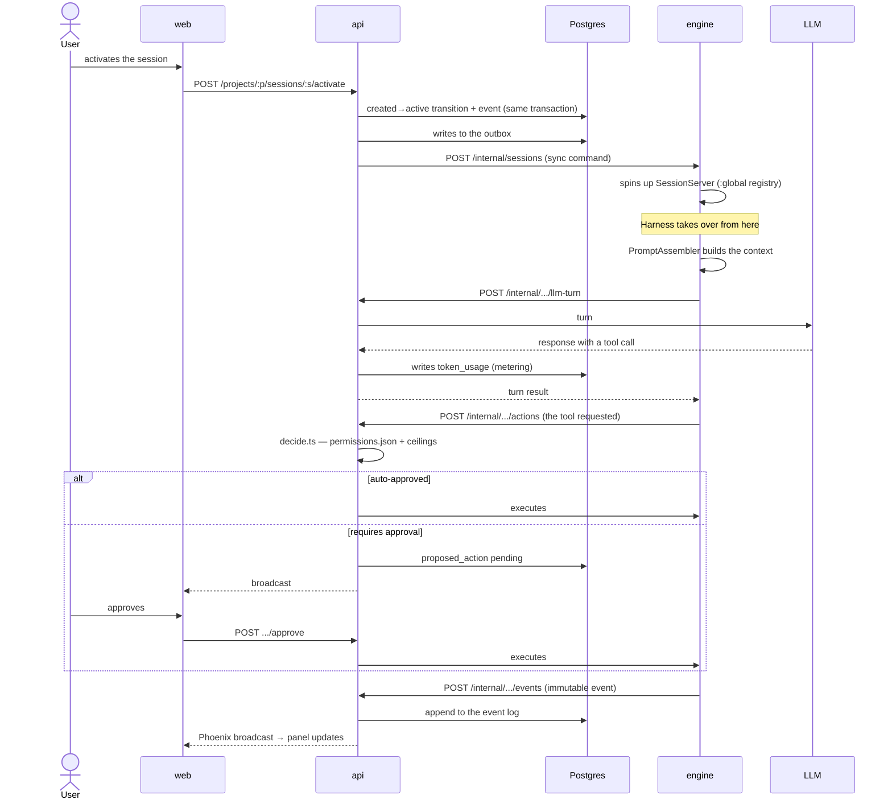
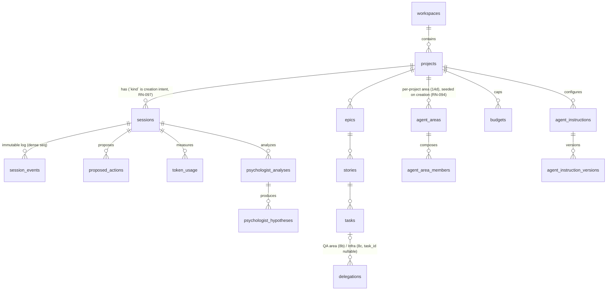

# Architecture

This document is the map for anyone who's going to **work** on the code. It
says where to start reading, what each boundary promises, and what's already
known to be crooked.

Decisions and their rationale live in the [ADRs](adr/index.md) — 121 of
them, several recording a real defect found in execution. Here we don't
repeat the argument: we point at it.

## The outside view

Brabo receives **a product intent** ("I want a system that does X") and
returns **a git repository with code, tests, and a history of decisions**,
produced by a team of AI agents. Between input and output, every action with
an effect on the world — running a command, committing, opening a PR,
spending tokens — goes through an approval request that the human decides
on.

Seen from outside it's a web application. What sets it apart is that the
work is done by long-running processes talking to language models, and that
the system is built so that **nothing happens without a trace and without
permission**.

## Containers

Two things in this design aren't obvious and explain a lot:

**The engine never talks to the LLM or to git directly.** It asks the api.
That's what guarantees metering, budget, and the approval pipeline have no
bypass — there's no path that escapes them.

**api→engine communication is dual.** An async event via a *transactional
outbox* in Postgres (consumed by Oban), and internal HTTP for a synchronous
command. The outbox exists because writing state and publishing the event
need to be the same transaction; the HTTP exists because some operations
need an immediate response.

The outbox drains two `aggregate_type`s: `session` (since Phase 5) and
`task` (Phase 12b — `task.gate_resolved`/`task.became_claimable`, the dev
agent's rescheduling after a gate resolves or a new task becomes claimable).
The reason it's an outbox, and not a synchronous HTTP call like the others:
an engine restart between the gate's verdict and the agent's reaction must
not lose the signal — the row survives the process that would read it, HTTP
would not survive the death of whoever was waiting for the response.
`dev_agent_states` gained `consecutive_blocked`/`max_consecutive_blocked`
(the circuit breaker, [RN-047](business-rules/custo.md#rn-047)); full decision in
[ADR 0045](adr/0045-reagendamento-por-evento-do-dev-agent.md).

The gate agents (`QaLeadServer`/`SecOpsAgentServer`) don't go through the
outbox on intermediate transitions (`correct`/`run_secops` remain a direct
in-memory call — the mechanical proof is in the comment of
`record-gate-verdict.use-case.ts`: only TERMINAL outcomes, `done`/`blocked`,
travel by outbox), so they got the SAME safety net the dev agents already
had: `gate_states`, plus a `GateRescuer` that scans stuck cycles and resumes
them on its own — no new table for the outbox path, because the problem
wasn't a missing outbox, it was missing durable state for what happens
BETWEEN two in-process calls. See
[RN-140](business-rules.md#rn-140), [ADR 0067](adr/0067-o-gate-sobrevive-ao-restart.md).

## Code map

### `apps/api` — NestJS, 444 files

Four layers, and the order matters:

| directory | what it is | start with | what it's **not** for |
|---|---|---|---|
| `src/domain/` (72) | pure business rule. No IO, no framework | `actions/decide.ts` — the heart of approval | doesn't know what HTTP, database, or NestJS are |
| `src/application/` (177) | use cases. Orchestrate domain and ports | `use-cases/sessions/` | holds no rule; if it has a business `if`, it's in the wrong place |
| `src/infrastructure/` (76) | port implementations: Drizzle, HTTP clients, crypto | `persistence/drizzle/` | decides nothing |
| `src/interfaces/http/` (105) | controllers, guards, DTOs | `auth/jwt-auth.guard.ts` | has no rule or query |

Symbols to grep for when you're lost: `decide(`, `assertTransition`,
`@RequireRole`, `PROTECTED_BRANCHES`, `EncryptionService`.

**Entrypoint:** `src/main.ts` — and the order of `imports` in it is
significant (`./tracing-boot` is deliberately first; OpenTelemetry
auto-instrumentation doesn't catch an already-loaded module, and a separate
module is what guarantees that: TypeScript hoists all `require`s to the
top, so a call written between imports would run too late).

### `apps/engine` — Elixir/OTP, 155 files

| module | what it is | start with |
|---|---|---|
| `harness/` (33) | context assembly, ToolLoop, compaction. **No LLM call happens outside here** | `harness/tool_loop/` |
| `dev/` (15) | dev agents, worktrees, monitor | `dev/dev_agent_server.ex` |
| `gates/` (20) | the QA area (Lead + Automation, Performance/Security and QA-strategy sub-specialties — the Lead's second moment, ADR 0090 — all with an LLM) and SecOps (deterministic) | `gates/qa_lead_server.ex` |
| `infra/` (9) | the Infra area (conversational, session-scoped Lead + Workflows sub-specialty via ToolLoop — two architectural families in the same area, see RN-037) | `infra/infra_lead_server.ex` |
| `sessions/` (9) | session lifecycle, `:global` registry | `sessions/session_server.ex` |
| `actions/` (9) | terminal and git executors, lint/scanner detectors | `actions/git_executor.ex` |
| `agents/` (16) | Creative, PO, Architect, Dev Lead, Staff (ADR 0088, dormant for automatic trigger) — each turn runs on a supervised Task (`TurnoAssincrono`, RN-122), no longer inside `handle_call`, so a `:cancel` can actually interrupt it | `agents/turno_assincrono.ex` |
| `psychologist/` (6) · `anamnese/` (6) | team analysis and improvement | — |

**Entrypoint:** `lib/engine/application.ex` — the whole supervision tree is
there, and it's the best file to understand what's running.

### `apps/web` — React 19, 70 files

`src/lib/api-types.ts` and `src/lib/activity.ts` are the two files worth
reading first: the first is the contract with the api, the second
classifies the log's 40 event types into something displayable — it's the
best source of truth about what each event means.

Three derivations of the same event log, answering different questions:

| file | answers |
|---|---|
| `lib/activity.ts` | "what happened" — the chronological feed |
| `lib/agent-status.ts` | "who exists and what state are they in" — the team cards |
| `lib/timeline-tree.ts` | "what each agent did, and what they're doing NOW" — the tree |

`lib/aprovacoes.ts` answers a fourth question, and it doesn't come from the
event log: "what happens if I approve". Each `proposed_action` type's verb
and sentence live there, and the three decision screens consume them — the
Approvals queue, the card inside the chat, and the Insights tab
([RN-096](business-rules.md#rn-096)).

**The `ActionType` union WAS a copy, and a copy aged — twice, in
production** (the three Gitflow bootstrap types; later
`parallelize`/`raise_max_parallel`), both times unnoticed by the compiler
because `apps/api` is not a dependency of `apps/web`. ADR 0116 closed the
class: `ActionType` is now generated by `openapi-typescript` from
`docs/reference/openapi.json` (`lib/api-types.generated.ts`, re-exported by
`lib/api-types.ts`) instead of hand-typed, and the compiler now enforces the
`Record<ActionType, ...>` maps in `lib/aprovacoes.ts` are exhaustive on every
edit. The rest of `api-types.ts` — ~1600 lines — stays hand-written; only
this one type, with a proven repeated cost, migrated. `lib/aprovacoes.test.ts`
stays too, but for a narrower job: it no longer needs to catch a MISSING
entry (the compiler does), only a bad one — sentence too short, no trailing
period, raw `snake_case` leaking into Portuguese prose. When in doubt, the UI
still degrades instead of crashing the React tree.

The tree inverts the feed's axis (agent first, time second) because in a
session with Creative, PO, Architect and N devs the chronological column
couldn't answer who was doing what. None of the three has its own state or
route — all derive from the same events, and an event that isn't in the log
shows up in none of them.

**Read scope: the project screen asks per session, the list screen asks per
workspace.** Inside a project the queries are per session and per project,
which is the natural cut of what's open. But the dashboard and the sidebar
show ALL projects, and there the per-project cut turns into N+1 — it was
seven polled queries per card, 3,824 req/min with 23 projects against a
limit of 300, and the screen was knocking itself over with 429s. Both read
from `GET /workspaces/:id/projects-summary` — a read model that cuts across
aggregates (git, budget, session, backlog, architecture) and whose number of
database round trips doesn't grow with project count
([RN-090](business-rules.md#rn-090)).

The bell's drawer follows the same cut, with one difference worth
recording: it needs each project's read cutoff, and that cutoff is a `seq`
kept in the browser of whoever is looking (`lib/read-state.ts`) — the
server doesn't have, and won't have, a "mark as read". So the client
**sends** the `project → afterSeq` map in the body of
`POST /workspaces/:id/unread-events`, which is a read despite the verb and
returns `200` ([RN-091](business-rules.md#rn-091)). The verb follows from
the body, not from a mutation: it's dozens of pairs, and a query string that
size breaks in a proxy on top of putting project ids in access logs.

That endpoint returns FACTS from the event log, never assembled
components: `lib/agents.ts` (who's lead, icon, color) and `rosterFromFacts`
(`lib/agent-status.ts`) remain the web's job, and the presence rule is the
same one the team panel uses. It's the same boundary as the three
derivations above — the api says what happened, the web decides what gets
drawn from it.

Two UI checks are automatic: contrast (`lib/contraste.ts`, a test over
`design/tokens.css`) and layout (`scripts/dev/validacao-visual.js`, run in
the browser). Explained in `design/README.md`.

**The Code tab (PHASE 26) is the same read pattern**, applied to code
instead of events: `getContainerState`/`getCodeTree`/`getCodeFile`/
`searchCode`/`getCodeDiff` in `lib/api-client.ts` mirror the api's read
routes (`container` plus the seven in `code.controller.ts`, FASE 26b), with
the types in `lib/api-types.ts` (`EstadoDoContainer`, `CodeTree`, `CodeFile`,
`CodeSearchResult`, `CodeDiff`) copied from the DTOs — the same convention
as the rest of the file, without importing `apps/api`. `routes/code/
highlight.ts` is a regex-based tokenizer OF ITS OWN for syntax highlighting,
zero new dependency. `ProjectCodeTab.tsx`'s gate (RN-107) asks for the
container's state BEFORE trying to read code, so it can appear as its own
message instead of as a 409's footnote.

**PHASE 26b added `getCodeBlame`/`getCodePullRequests`/`getCodeBranches` to
the same pattern**, with `CodeBlame`/`CodePullRequestList`/
`CodeBranchDetailList` in `lib/api-types.ts` — foundation for the Code
tab's three declared pending items (RN-110/111/112). All three now have a
consumer: `CodeEditor.tsx` (blame toggle), `code/PrListAndDiff.tsx` (PR
list + diff, consumed by both `CodeDiffPanel.tsx` and the standalone `prs`
tab) and `CodeBranchPicker.tsx` (the rich branch dropdown).

The container-image gate (RN-105) is a single funnel
(`ReadProjectCodeUseCase.alvo`) shared by all seven routes, so any of them
can 409 while the Architect hasn't decided the image — not just the tree.
`ProjectCodeTab.tsx` avoids that 409 with a pre-check (`RN-107`, above); the
`prs` tab has no tree/file read to pre-check against, so
`code/PrListAndDiff.tsx` instead reacts to the 409 from its own
`getCodePullRequests`/`getCodeDiff` calls. Both paths render the same
presentation, `ContainerImageGateNotice`
(`components/ContainerImageGate.tsx`), detected via `isContainerImageGateError`
(`lib/api-client.ts`, matches `ApiError.status === 409`) — a bug found by
use: before this, the `prs` tab surfaced that 409 as a generic transient
error with a "try again" button, which is the wrong affordance for a state
that only resolves when the Architect acts.

### Outside the applications

| directory | what it is |
|---|---|
| `packages/shared/` | the `GitProviderContract` — fifteen operations, **types and nothing else**: a value that survives `tsc` breaks the api's boot (locked by a test), so the constant lives in the consumer |
| `docker/` | dev and production images; `smoke.sh` |
| `deploy/k8s/` | Kustomize base + overlays (local, staging, prod) |
| `design/` | design system: tokens, typography, components |

## An agent turn's flow

The hot path, end to end. This is where most of the complexity lives.

The `Harness → tool call → approval → event` loop repeats until the agent
calls the finishing tool or hits a ceiling (iterations, tokens, budget).

## Boundaries and invariants

This is the part that matters most. Every item below is verifiable, and
several have a test that fails on violation.

**1. The domain is pure.** `apps/api/src/domain/` doesn't import
`infrastructure`, `application`, `@nestjs`, or any database driver —
verified: **zero** occurrences of the three. The direction is always
`interfaces → application → domain`, and 89 `application` files import
`domain`. If you need IO inside `domain/`, the design is wrong: create a
port under `application/ports/`.

**2. A domain event is immutable.** There's never an `UPDATE` on an event
table. `session_events` has `unique(session_id, seq)` and `seq` is dense per
session — the restore test verifies there's no gap. State that needs to
change (a hypothesis's lifecycle, a handoff's status) lives in its own
mutable table, alongside the events.

**3. No LLM call outside the Harness.** It's not a convention: the engine
has no LLM client. It asks the api, which does the metering.

**4. Every action with an external effect becomes a `proposed_action`.**
`deny` always beats `allow` in `permissions.json`, and two **ceilings** are
applied last, on top of the already-computed verdict: merging into a
protected branch and an instruction patch are **never** auto-approvable.
See [RN-006 and RN-007](business-rules.md).

**5. Merging into a protected branch is manual.** There's no option to
automate it. It's a ceiling in the domain (`decide.ts`), guaranteed by a
test.

**6. One session, one owner.** The `SessionServer` is registered under
`:global`, not a local `Registry` — without that, N replicas would host N
copies of the same session, and the copies without a heartbeat would kill
the live session ([ADR 0026](adr/0026-fase5-observabilidade-e-graceful-shutdown.md)).

**7. Agent failure records its ORIGIN** (`infra | model | code | policy`),
never a diagnosis by elimination. An expensive lesson from
[ADR 0020](adr/0020-destravar-gates-qa-secops.md): a provider outage was
recorded as "the model stopped without signaling", and the system blamed
the model for an infrastructure problem.

**8. A project's container is decided, never implicit.** The Code tab only
unlocks after the Architect emits `artifact.project_image` — while the
state is `sem_decisao` (no decision), reading code returns `409`
([RN-105](business-rules/autenticacao.md#rn-105)). And `git push`, opening a PR, and
deploy don't go through the terminal, even inside the project's scope:
`decide()` recognizes them by command prefix and returns `deny` BEFORE any
permissive stage — not `require_approval`, because "always allow" would
write the pattern into `allow` and reopen the door
([RN-106](business-rules/autenticacao.md#rn-106),
[ADR 0065](adr/0065-container-por-projeto-a-fronteira-deixa-de-ser-politica.md)).
The container's lifecycle (provision, recycle, clean up) doesn't exist yet
— a declared cut from PHASE 25, recorded in CLAUDE.md — so this invariant
coexists, for now, with the path-scope policy from
[ADR 0055](adr/0055-escopo-de-caminho-na-politica-de-terminal.md).

**9. An agent that WRITES must be able to READ and must be able to ASK.**
Both halves are the same lesson, and came from an agent that only had
write tools: the PO built context once, at kickoff, and acted from then on
over a stale snapshot — facing a gap, it chose between inventing and
stopping ([RN-164](business-rules/autenticacao.md#rn-164),
[RN-165](business-rules/autenticacao.md#rn-165)). Reading does **not** become a
`proposed_action` (invariant 4 is about EXTERNAL effect, and reading isn't
one), but it is contained in the sense of
[ADR 0060](adr/0060-superficie-de-leitura-de-codigo.md): scope closed by the
route's path, constant cost per call, and a line ceiling in the text
delivered to the model. And an agent's loop doesn't end silently — an
iteration ceiling emits `toolloop.limit_reached`, an unmet obligation emits
a durable outcome with an origin ([RN-166](business-rules/autenticacao.md#rn-166)).

## Cross-cutting concerns

**Cross-origin.** The web is served from its own origin and talks to
**two** others, so CORS is an architectural boundary, not a configuration
detail ([ADR 0037](adr/0037-cors-do-engine-e-a-porta-como-contrato.md)).
Four paths, and only three go through CORS:

| path | mechanism |
|---|---|
| web → api, HTTP | Nest's CORS, exact origin from `WEB_ORIGIN` + `credentials` |
| web → engine, HTTP (`/health`) | `EngineWeb.Plugs.Cors`, health routes only |
| web → engine, WebSocket | the Phoenix endpoint's `check_origin` — **WebSocket doesn't go through CORS** |
| api ↔ engine, HTTP | **CORS doesn't apply**: a server client, not a browser |

One single variable — `WEB_ORIGIN` — feeds the first three, in both
services. Reading it twice independently is how the engine's CORS ended up
with no origin at all while `check_origin` already had the right list; in
the engine it's now resolved once, in `runtime.exs`.

And the **port is part of the origin**: the web on `:5174` is a different
system in the browser's eyes. That's why `vite.config.ts` uses
`strictPort`.

**Authentication.** First-party, in the api's domain — there's no external
IdP. Passwords with argon2id, a 15-minute EdDSA access token, and an opaque
refresh token with mandatory rotation; the web's session lives in an
`httpOnly` cookie with CSRF via double-submit. `JwtAuthGuard` is global and
**reads** the user by the token's `sub` (which is `users.id`); an open
route requires explicit `@Public()`.

No RBAC decision reads a token claim: role comes from `request.user.id` and
rows in the database. That's why the permission matrix survived the issuer
swap without changing. Decisions in
[ADR 0031](adr/0031-auth-first-party-argon2id-e-rotacao-de-refresh.md) and
[ADR 0032](adr/0032-corte-do-keycloak-e-sessao-em-cookie.md).

Calls from the engine don't go through the JWT: `/internal/*` routes are
`@ServiceRoute()` and `EngineServiceGuard` compares a shared secret
(`BRABO_SERVICE_TOKEN`) in constant time. The whole surface is classified in
[`security-surface.md`](security-surface.md), and a table test fails a new
route with no classification.

**Authorization.** RBAC in the domain, with the effective role resolved
from the project (falling back to the workspace). `@RequireRole` on the
routes.

**Error.** Domain errors are typed classes
(`InvalidSessionTransitionError`, `StoryNotReadyError`) translated to HTTP
by global filters in `main.ts`. Git provider errors are normalized by a
single contract ([ADR 0002](adr/0002-git-error-normalization.md)) — the
caller doesn't know whether it talked to GitHub or GitLab.

**Logging.** **One-line** JSON per event in production across the three
apps, with a correlated `trace_id`; human-readable in development. The api
uses pino with mandatory redaction of `apiKey`, `access_token`,
`clientSecret`, and the api↔engine service token. Each line says which
class and method it came from, and one line per request shows the **path
across layers** with each step's duration — see
[observability](explanation/observability.md).

**Transaction.** The pattern is *unit of work*: write state and publish the
event in the **same** transaction, via the outbox. Publishing outside the
transaction would create an event for state that never persisted.

**Tracing.** End-to-end OpenTelemetry, and the `trace_id` is born in the
**web**: the browser generates the `traceparent`, the api adopts it as
parent, and the engine adopts the api's. A session is **one root trace** —
the `traceparent` is persisted in `sessions.trace_parent` and travels in
the outbox envelope, so async work triggered by an event stays in the
trace of whoever produced it.

Instrumenting and **exporting** are independent
([ADR 0035](adr/0035-observabilidade-legivel-e-trace-sem-coletor.md)): a
span is always created and the `trace_id` always goes into the log, even
with no collector; `OTEL_EXPORTER_OTLP_ENDPOINT` only decides whether it
leaves the process. That's what gives correlation in `pnpm dev`.

**Secrets.** Envelope encryption: a random DEK per record, wrapped by the
master key. Zero-downtime rotation via `CREDENTIALS_MASTER_KEY_PREVIOUS` —
see the [runbook](runbook.md).

**Agent hierarchy.** Since Phase 8b
([ADR 0038](adr/0038-hierarquia-de-agentes.md)), an area can have a LEAD and
sub-specialties — today "qa" (`qa-lead`, `qa-automacao`,
`qa-performance-seguranca`) and "infra" (`infra` as lead,
`infra-workflows` as subagent — Phase 8c, RN-037). The lead is the only
external point of contact: internal delegation never becomes a handoff, and
is never visible outside the area. The first instance proves the model's
central guarantee — `QaLeadServer` consolidates the two sub-specialties'
verdicts into a single `qa_verdict`, and the contract the api already had
(`RecordGateVerdictUseCase`, `nextGateStatus`) didn't change a line. The
second shows the model doesn't require the same internal implementation:
`InfraLeadServer` remains a conversational, session-scoped GenServer
(mirroring `ArquitetoServer`, external contact unchanged by explicit
request of CLAUDE.md 8c), and delegates to `WorkflowsAgent` — which, with
no user on the other side, runs as a bounded `ToolLoop`, just like the QA
subagents. The 8b's generic `delegations` needed ONE adjustment to serve
the second area: `task_id` became nullable, because Infra delegates over the
session, not over a backlog task.

Phase 8d closes the loop on the `apps/web` side, with no new route —
everything comes from the same `session_events` the panel already fetches
(`useSessionEvents`). `apps/web/src/lib/agents.ts` gained
`AREAS`/`areaFor`: the registry linking a subagent's `AgentKey`
(`qa-automacao`, `qa-performance-seguranca`, `infra-workflows`) to the
lead's area — it's this reverse lookup that groups the team panel (lead
with a "Lead" badge + collapsible sub-specialties), groups Insights by
area, and narrates `delegation.completed`/`failed`/`dispensed` in the feed
(`activity.ts`). `consolidated_verdict` (decision #4 of ADR 0038) never
became a real artifact — QA and Infra reuse `qa_verdict`/`open_infra_pr`,
see the [ADR's closing note](adr/0038-hierarquia-de-agentes.md#closure-phase-8d).

## Data

45 tables in total (the most recent, `session_socket_tickets`, is the
single-use ticket that authenticates the session's socket — RN-108; kept
off the diagram for the same reason as `refresh_tokens`/`account_tokens`:
an auth mechanism, not a domain relation). **The constraints are business
rules**: the event log's unique `(session_id, seq)`, the `check` requiring
exactly one scope in `budgets` (project **or** session, never both), the
partial indexes that guarantee analysis idempotency — and, since Phase 8b,
`delegations`'s three `check`s that lock which field is required per
`status` (`completed` → `parecerArtifactId`, `failed` → `failureOrigin`,
`dispensed` → `justification`; see
[RN-036](business-rules.md#rn-036)). `delegations.task_id` was born
`NOT NULL` and became nullable in Phase 8c — the Infra area delegates over
the session, with no backlog task behind an infra PR (see
[RN-037](business-rules.md#rn-037)).

`agent_areas` (PHASE 14d,
[ADR 0053](adr/0053-dev-lead-e-paralelismo-autorizado.md)) is what Phase 8
had cut. It came back because the **dev** area isn't enumerable in code:
`qa` and `infra` fit in a fixed list, but dev's members are one per
`module_map` module, decided by the Architect and different in each
project. The unique `(project_id, key)` is what makes seeding idempotent,
and `max_parallel` (default 2) is the ceiling the lead uses without asking
— above it, `proposed_action`
(see [RN-083](business-rules/custo.md#rn-083)). `budget_micros`/`spent_micros`
(ADR 0110) mirror `max_parallel` on the same row — a spend ceiling that is
ADDITIVE to `budgets` (project/session), never a cascade: it is checked
and incremented independently, by the same `CheckBudgetGateUseCase`/
`RecordLlmUsageUseCase` that already own project and session spend (see
[RN-443](business-rules.md#rn-443)). Do not confuse this with the model-
binding cascade of [ADR 0064](adr/0064-escopo-de-area-na-cascata-e-o-binding-de-agente-global.md)
(`session > agent > area > project > workspace`) — that one picks a single
winner; area budget never does.

**Migrations:** Drizzle in the api (`src/db/migrations/`, applied by a
one-shot Job — replicas do **not** migrate on boot, or they'd race for the
same migration) and Ecto in the engine, in its own schema (`engine`).
There's no cross-reference between the two schemas, so they run in
parallel.

## Known technical debt {#divida-tecnica}

Derived from history's hotspots and the ADRs that record open state.

| debt | evidence | impact |
|---|---|---|
| ~~`schema.ts` is the repo's most-changed file (23 changes) and concentrates 51 tables into a single file~~ | history → **closed by** [ADR 0121](adr/0121-schema-dividido-por-agregado-de-dominio.md) | the schema is now one file per domain aggregate under `apps/api/src/db/schema/`, mirroring `src/domain/*`, with the old path kept as a barrel of `export *` so all 144 consumers changed nothing. Two aggregates can now be edited at once without conflicting. What this does NOT touch: the migrations are byte-identical (the acceptance bar was a zero-diff `drizzle-kit generate`), and the api↔engine contract row below is a different, still-open debt |
| The api↔engine contract is spread across 4 hot files (`internal-sessions.controller.ts`, `api-to-engine-client.ts`, `engine_api_client.ex`, `router.ex`) with no single source | history | a change requires editing all four in sync; nothing guarantees they agree |
| The gates demo is **not a regression test** — it depends on a local 7B model's judgment | [ADR 0020](adr/0020-destravar-gates-qa-secops.md) | the gate's semantic path has no automated coverage |
| Phase 4a with an acceptance criterion marked **NOT CLOSED** | [ADR 0021](adr/0021-fechamento-4a-infra-e-painel.md) | there's admittedly incomplete work with no tracking issue |
| The Oban queue accumulates `AnamneseWorker` from previous runs; the guard only blocks **new** enqueues | [ADR 0020](adr/0020-destravar-gates-qa-secops.md) | turning off the guard isn't enough — the queue needs purging |
| `TerminalExecutor` runs the managed project's suite **inside** the engine's image | [ADR 0024](adr/0024-fase5-imagens-producao-ci.md) | doesn't scale to arbitrary stacks; the way out is per-project sandboxing |
| ~~Images aren't published to a registry; the production overlay points at `ghcr.io/OWNER/*`~~ | [ADR 0027](adr/0027-fase5-backup-hardening-release.md) → **closed by** [ADR 0119](adr/0119-imagens-publicadas-no-ghcr-por-digest.md) | the four images publish to GHCR on every final tag and the overlay pins by digest from `.release/images.json`. What remains is NOT this debt: nothing deploys automatically, and the images are neither signed nor attested |
| `SessionPage.tsx` is 169 KiB with 25 test files importing it | [ADR 0122](adr/0122-sessionpage-dividido-em-cinco-prs.md) — **IN PROGRESS, 1 of 5** | declares the whole 5-PR decomposition upfront; PR 1 extracted the pure timeline/turn helpers to `apps/web/src/lib/session-timeline.ts`. Four PRs remain (`StorySlide`, `StructuredQuestionCard`, backlog-tree helpers + `ContextAside`, a `useSessionReadiness` hook), each merged before the next starts because the file is under active feature churn. Explicitly OUT of scope: the turn-channel state cluster (coupled control flow, not a mechanical move) and `ProjectSettingsTab.tsx` (separate scope) |
