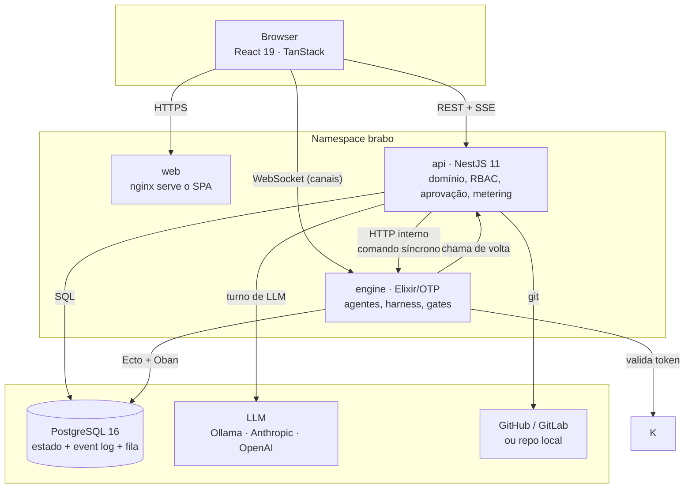
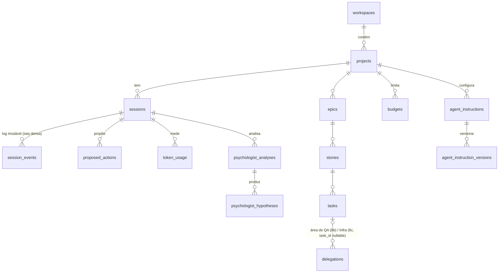

# Arquitetura

Este documento é o mapa para quem vai **mexer** no código. Ele diz por onde
começar a ler, o que cada fronteira promete, e o que já se sabe que está torto.

Decisões e o porquê delas ficam nos [ADRs](adr/index.md) — 52 deles, vários
registrando defeito real encontrado em execução. Aqui não repetimos a
argumentação: apontamos.

## Visão de fora

O Brabo recebe **uma intenção de produto** ("quero um sistema que faça X") e
devolve **um repositório git com código, testes e histórico de decisões**,
produzido por um time de agentes de IA. Entre a entrada e a saída, cada ação
com efeito no mundo — rodar comando, commitar, abrir PR, gastar token — passa
por um pedido de aprovação que o humano decide.

Visto de fora é uma aplicação web. O que o distingue é que o trabalho é feito
por processos de longa duração conversando com modelos de linguagem, e que o
sistema é construído para que **nada aconteça sem rastro e sem permissão**.

## Containers

Duas coisas nesse desenho não são óbvias e explicam muita coisa:

**O engine não fala com o LLM nem com o git diretamente.** Ele pede à api. É o
que garante que metering, orçamento e o pipeline de aprovação não tenham desvio
— não existe caminho que escape deles.

**A comunicação api→engine é dupla.** Evento assíncrono via *transactional
outbox* no Postgres (consumido pelo Oban), e HTTP interno para comando
síncrono. O outbox existe porque gravar o estado e publicar o evento precisam
ser a mesma transação; o HTTP existe porque algumas operações precisam de
resposta imediata.

O outbox drena dois `aggregate_type`: `session` (desde a Fase 5) e `task`
(Fase 12b — `task.gate_resolved`/`task.became_claimable`, o reagendamento
do dev agent após um gate resolver ou uma task nova ficar pegável). A
razão de ser outbox, e não uma chamada HTTP síncrona como as demais: um
restart do engine entre o veredito do gate e a reação do agente não pode
perder o sinal — a linha sobrevive ao processo que a leria, o HTTP não
sobreviveria à queda de quem esperava a resposta.
`dev_agent_states` ganhou `consecutive_blocked`/`max_consecutive_blocked`
(o circuit breaker, [RN-047](business-rules.md#rn-047)); decisão completa
no [ADR 0045](adr/0045-reagendamento-por-evento-do-dev-agent.md).

## Code map

### `apps/api` — NestJS, 444 arquivos

Quatro camadas, e a ordem importa:

| diretório | o que é | comece por | a que **não** serve |
|---|---|---|---|
| `src/domain/` (72) | regra de negócio pura. Sem IO, sem framework | `actions/decide.ts` — o coração da aprovação | não sabe o que é HTTP, banco ou NestJS |
| `src/application/` (177) | casos de uso. Orquestram domínio e portas | `use-cases/sessions/` | não contém regra; se tem `if` de negócio, está no lugar errado |
| `src/infrastructure/` (76) | implementações das portas: Drizzle, clientes HTTP, cripto | `persistence/drizzle/` | não decide nada |
| `src/interfaces/http/` (105) | controllers, guards, DTOs | `auth/jwt-auth.guard.ts` | não tem regra nem query |

Símbolos para grepar quando estiver perdido: `decide(`, `assertTransition`,
`@RequireRole`, `PROTECTED_BRANCHES`, `EncryptionService`.

**Entrypoint:** `src/main.ts` — e a ordem dos `imports` nele é significativa
(`./tracing-boot` é o primeiro de propósito; a auto-instrumentação do
OpenTelemetry não pega módulo já carregado, e um módulo separado é o que garante
isso: TypeScript eleva todos os `require` para o topo, então uma chamada escrita
entre imports rodaria tarde demais).

### `apps/engine` — Elixir/OTP, 155 arquivos

| módulo | o que é | comece por |
|---|---|---|
| `harness/` (33) | montagem de contexto, ToolLoop, compactação. **Nenhuma chamada de LLM acontece fora daqui** | `harness/tool_loop/` |
| `dev/` (15) | dev agents, worktrees, monitor | `dev/dev_agent_server.ex` |
| `gates/` (14) | área de QA (Lead + subespecialidades Automação e Performance/Segurança, todas com LLM) e SecOps (determinístico) | `gates/qa_lead_server.ex` |
| `infra/` (9) | área de Infra (Lead conversacional session-scoped + subespecialidade Workflows via ToolLoop — duas famílias arquiteturais na mesma área, ver RN-037) | `infra/infra_lead_server.ex` |
| `sessions/` (9) | ciclo de vida da sessão, registro `:global` | `sessions/session_server.ex` |
| `actions/` (9) | executores de terminal e git, detectors de lint/scanner | `actions/git_executor.ex` |
| `agents/` (7) | Criativo, PO, Arquiteto | — |
| `psychologist/` (6) · `anamnese/` (6) | análise e melhoria do time | — |

**Entrypoint:** `lib/engine/application.ex` — a árvore de supervisão inteira
está ali, e é o melhor arquivo para entender o que roda.

### `apps/web` — React 19, 70 arquivos

`src/lib/api-types.ts` e `src/lib/activity.ts` são os dois arquivos que valem
ler primeiro: o primeiro é o contrato com a api, o segundo classifica os 40
tipos de evento do log em algo exibível — é a melhor fonte de verdade sobre o
que cada evento significa.

Três derivações do mesmo event log, com perguntas diferentes:

| arquivo | responde |
|---|---|
| `lib/activity.ts` | "o que aconteceu" — o feed cronológico |
| `lib/agent-status.ts` | "quem existe e em que estado está" — os cards do time |
| `lib/timeline-tree.ts` | "o que cada agente fez, e o que está fazendo AGORA" — a árvore |

A árvore inverte o eixo do feed (agente primeiro, tempo depois) porque numa
sessão com Criativo, PO, Arquiteto e N devs a coluna cronológica não respondia
quem estava fazendo o quê. Nenhuma das três tem estado ou rota própria — todas
derivam dos mesmos eventos, e um evento que não está no log não aparece em
nenhuma.

Duas validações de UI são automáticas: contraste (`lib/contraste.ts`, teste
sobre `design/tokens.css`) e layout (`scripts/dev/validacao-visual.js`, rodado
no navegador). Estão explicadas em `design/README.md`.

### Fora das aplicações

| diretório | o que é |
|---|---|
| `packages/shared/` | o contrato `GitProviderContract` (tipos, sem runtime) |
| `docker/` | imagens de dev e de produção; `smoke.sh` |
| `deploy/k8s/` | Kustomize base + overlays (local, staging, prod) |
| `design/` | design system: tokens, tipografia, componentes |

## Fluxo de um turno de agente

O caminho quente, ponta a ponta. É onde mora a maior parte da complexidade.

O laço `Harness → tool call → aprovação → evento` repete até o agente chamar a
ferramenta de término ou bater num teto (iterações, tokens, orçamento).

## Fronteiras e invariantes

Esta é a parte que mais importa. Cada item abaixo é verificável, e vários têm
teste que reprova a violação.

**1. O domínio é puro.** `apps/api/src/domain/` não importa `infrastructure`,
`application`, `@nestjs` nem driver de banco — verificado: **zero** ocorrências
das três. A direção é sempre `interfaces → application → domain`, e 89 arquivos
de `application` importam `domain`. Se você precisar de IO dentro de `domain/`,
o desenho está errado: crie uma porta em `application/ports/`.

**2. Evento de domínio é imutável.** Nunca existe `UPDATE` em tabela de evento.
`session_events` tem `unique(session_id, seq)` e a `seq` é densa por sessão — o
teste de restore verifica que não há buraco. Estado que precisa mudar (ciclo de
vida de hipótese, status de handoff) mora em tabela própria, mutável, ao lado
dos eventos.

**3. Nenhuma chamada de LLM fora do Harness.** Não é convenção: o engine não
tem cliente de LLM. Ele pede à api, que faz o metering.

**4. Toda ação com efeito externo vira `proposed_action`.** `deny` sempre vence
`allow` em `permissions.json`, e dois **tetos** são aplicados por último, sobre
o veredito já calculado: merge em branch protegida e patch de instrução **nunca**
são auto-aprováveis. Ver [RN-006 e RN-007](business-rules.md).

**5. Merge em branch protegida é manual.** Não há opção de automatizar. É teto
no domínio (`decide.ts`), garantido por teste.

**6. Uma sessão, um dono.** O `SessionServer` é registrado em `:global`, não
num `Registry` local — sem isso, N réplicas hospedariam N cópias da mesma
sessão e as cópias sem heartbeat matariam a sessão viva ([ADR 0026](adr/0026-fase5-observabilidade-e-graceful-shutdown.md)).

**7. Falha de agente registra a ORIGEM** (`infra | modelo | código | política`),
nunca diagnóstico por eliminação. Lição cara do
[ADR 0020](adr/0020-destravar-gates-qa-secops.md): uma queda de provider foi
registrada como "o modelo parou sem sinalizar", e o sistema culpou o modelo por
um problema de infraestrutura.

## Assuntos transversais

**Origem cruzada.** A web é servida de uma origem própria e fala com **duas**
outras, então CORS é fronteira arquitetural e não detalhe de configuração
([ADR 0037](adr/0037-cors-do-engine-e-a-porta-como-contrato.md)). Quatro caminhos,
e só três passam por CORS:

| caminho | mecanismo |
|---|---|
| web → api, HTTP | CORS do Nest, origem exata de `WEB_ORIGIN` + `credentials` |
| web → engine, HTTP (`/health`) | `EngineWeb.Plugs.Cors`, só as rotas de health |
| web → engine, WebSocket | `check_origin` do endpoint Phoenix — **WebSocket não passa por CORS** |
| api ↔ engine, HTTP | **CORS não se aplica**: cliente de servidor, não navegador |

Uma única variável — `WEB_ORIGIN` — alimenta os três primeiros, nos dois
serviços. A leitura duplicada dela foi como o CORS do engine ficou sem nenhuma
origem enquanto o `check_origin` já tinha a lista certa; no engine ela agora é
resolvida uma vez, em `runtime.exs`.

E a **porta faz parte da origem**: a web em `:5174` é outro sistema aos olhos do
navegador. É por isso que o `vite.config.ts` usa `strictPort`.

**Autenticação.** First-party, no domínio da api — não há IdP externo. Senhas
com argon2id, access token EdDSA de 15 min e refresh opaco com rotação
obrigatória; a sessão da web vive num cookie `httpOnly` com CSRF por
double-submit. O `JwtAuthGuard` é global e **lê** o usuário pelo `sub` do
token (que é o `users.id`); rota aberta exige `@Public()` explícito.

Nenhuma decisão de RBAC lê claim de token: papel vem de `request.user.id` e de
linhas no banco. É por isso que a matriz de permissões atravessou a troca de
emissor sem mudar. Decisões em
[ADR 0031](adr/0031-auth-first-party-argon2id-e-rotacao-de-refresh.md) e
[ADR 0032](adr/0032-corte-do-keycloak-e-sessao-em-cookie.md).

Chamadas do engine não passam pelo JWT: as rotas `/internal/*` são
`@ServiceRoute()` e o `EngineServiceGuard` compara um segredo compartilhado
(`BRABO_SERVICE_TOKEN`) em tempo constante. A superfície inteira está
classificada em [`security-surface.md`](security-surface.md), e um teste de
tabela reprova rota nova sem classificação.

**Autorização.** RBAC no domínio, com papel efetivo resolvido a partir do
projeto (com fallback para o workspace). `@RequireRole` nas rotas.

**Erro.** Erros de domínio são classes tipadas (`InvalidSessionTransitionError`,
`StoryNotReadyError`) traduzidas para HTTP por filtros globais em `main.ts`.
Erro de provider de git é normalizado por um contrato único
([ADR 0002](adr/0002-git-error-normalization.md)) — o chamador não sabe se
falou com GitHub ou GitLab.

**Log.** JSON de **uma linha** por evento em produção nos três apps, com
`trace_id` correlacionado; legível para gente em desenvolvimento. A api usa pino
com redaction obrigatória de `apiKey`, `access_token`, `clientSecret` e do token
de serviço api↔engine. Cada linha diz de qual classe e método saiu, e uma linha por
requisição mostra o **caminho entre camadas** com a duração de cada passo — ver
[observabilidade](explanation/observability.md).

**Transação.** O padrão é *unit of work*: gravar estado e publicar evento na
**mesma** transação, via outbox. Publicar fora da transação criaria evento para
estado que não persistiu.

**Rastreamento.** OpenTelemetry ponta a ponta, e o `trace_id` nasce na **web**:
o browser gera o `traceparent`, a api o adota como pai e o engine adota o da api.
Uma sessão é **uma trace raiz** — o `traceparent` é persistido em
`sessions.trace_parent` e viaja no envelope do outbox, então trabalho assíncrono
disparado por um evento continua na trace de quem o produziu.

Instrumentar e **exportar** são independentes
([ADR 0035](adr/0035-observabilidade-legivel-e-trace-sem-coletor.md)): span é
sempre criada e o `trace_id` sempre entra no log, inclusive sem coletor;
`OTEL_EXPORTER_OTLP_ENDPOINT` decide apenas se ela sai do processo. É o que dá
correlação em `pnpm dev`.

**Segredos.** Envelope encryption: DEK aleatório por registro, embrulhado pela
chave mestra. Rotação sem downtime via `CREDENTIALS_MASTER_KEY_PREVIOUS` — ver
o [runbook](runbook.md).

**Hierarquia de agentes.** Desde a Fase 8b ([ADR 0038](adr/0038-hierarquia-de-agentes.md)),
uma área pode ter um LEAD e subespecialidades — hoje "qa" (`qa-lead`,
`qa-automacao`, `qa-performance-seguranca`) e "infra" (`infra` como lead,
`infra-workflows` como subagente — Fase 8c, RN-037). O lead é o único ponto
de contato externo: delegação interna nunca vira handoff, e nunca é visível
fora da área. A primeira instância prova a garantia central do modelo —
`QaLeadServer` consolida os pareceres das duas subespecialidades num
`qa_verdict` só, e o contrato que a api já tinha (`RecordGateVerdictUseCase`,
`nextGateStatus`) não mudou uma linha. A segunda mostra que o modelo não
exige a mesma implementação interna: `InfraLeadServer` continua um GenServer
conversacional session-scoped (mirror do `ArquitetoServer`, contato externo
inalterado por pedido explícito do CLAUDE.md 8c), e delega ao `WorkflowsAgent`
— que, sem usuário do outro lado, roda como `ToolLoop` bounded, igual aos
subagentes de QA. O `delegations` genérico do 8b precisou de UM ajuste pra
servir a segunda área: `task_id` virou nullable, porque Infra delega sobre a
sessão, não sobre uma task de backlog.

A Fase 8d fecha o ciclo do lado da `apps/web`, sem rota nova — tudo vem do
mesmo `session_events` que o painel já busca (`useSessionEvents`).
`apps/web/src/lib/agents.ts` ganha `AREAS`/`areaFor`: o registro que liga
`AgentKey` de subagente (`qa-automacao`, `qa-performance-seguranca`,
`infra-workflows`) à área do lead — é essa busca reversa que agrupa o
painel do time (lead com badge "Lead" + subespecialidades recolhíveis),
agrupa Insights por área, e narra `delegation.completed`/`failed`/
`dispensed` no feed (`activity.ts`). `consolidated_verdict` (decisão #4 do
ADR 0038) não virou artefato de verdade — QA e Infra reusam `qa_verdict`/
`open_infra_pr`, ver o [fechamento do ADR](adr/0038-hierarquia-de-agentes.md#fechamento-fase-8d).

## Dados

36 tabelas no total. **As constraints são regra de negócio**: a unique
`(session_id, seq)` do event log, o `check` que exige exatamente um escopo em
`budgets` (projeto **ou** sessão, nunca os dois), os índices parciais que
garantem idempotência das análises — e, desde a Fase 8b, os três `check` de
`delegations` que travam qual campo é obrigatório por `status`
(`completed` → `parecerArtifactId`, `failed` → `failureOrigin`, `dispensed` →
`justification`; ver [RN-036](business-rules.md#rn-036)). `delegations.
task_id` nasceu `NOT NULL` e virou nullable na Fase 8c — a área de Infra
delega sobre a sessão, sem task de backlog por trás de uma PR de infra (ver
[RN-037](business-rules.md#rn-037)).

**Migrations:** Drizzle na api (`src/db/migrations/`, aplicadas por um Job
one-shot — réplicas **não** migram no boot, senão competem pela mesma
migration) e Ecto no engine, em schema próprio (`engine`). Não há referência
cruzada entre os dois schemas, então rodam em paralelo.

## Dívida técnica conhecida {#divida-tecnica}

Derivada dos hotspots do histórico e dos ADRs que registram estado aberto.

| dívida | evidência | impacto |
|---|---|---|
| `schema.ts` é o arquivo mais alterado do repo (23 mudanças) e concentra 35 tabelas num arquivo só | histórico | mudança de qualquer agregado toca o mesmo arquivo; conflito garantido com mais de uma pessoa |
| O contrato api↔engine está espalhado por 4 arquivos quentes (`internal-sessions.controller.ts`, `api-to-engine-client.ts`, `engine_api_client.ex`, `router.ex`) sem fonte única | histórico | mudança exige editar os quatro em sincronia; nada garante que estejam de acordo |
| O demo de gates **não é teste de regressão** — depende do julgamento de um modelo 7B local | [ADR 0020](adr/0020-destravar-gates-qa-secops.md) | o caminho semântico do gate não tem cobertura automatizada |
| Fase 4a com critério de aceite marcado **NÃO FECHADO** | [ADR 0021](adr/0021-fechamento-4a-infra-e-painel.md) | há trabalho reconhecidamente incompleto sem issue de rastreio |
| Fila do Oban acumula `AnamneseWorker` de execuções anteriores; o guard só barra **novos** enfileiramentos | [ADR 0020](adr/0020-destravar-gates-qa-secops.md) | desligar o guard não basta — a fila precisa ser purgada |
| `TerminalExecutor` roda a suite do projeto gerido **dentro** da imagem do engine | [ADR 0024](adr/0024-fase5-imagens-producao-ci.md) | não escala para stacks arbitrárias; a saída é sandbox por projeto |
| Imagens não são publicadas em registry; o overlay de produção aponta para `ghcr.io/OWNER/*` | [ADR 0027](adr/0027-fase5-backup-hardening-release.md) | o deploy de produção não é executável de ponta a ponta |
