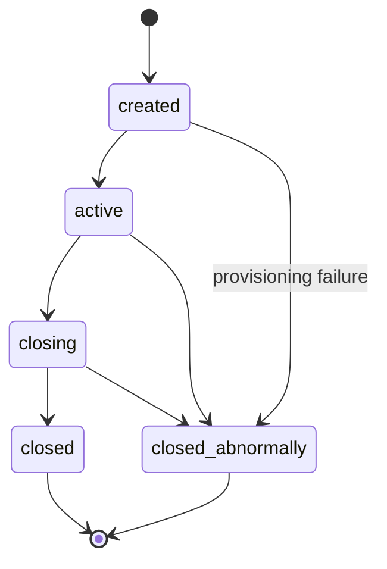
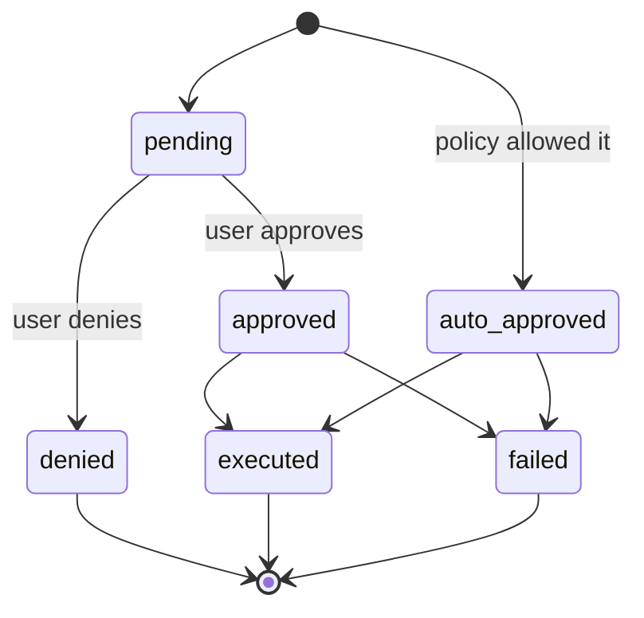
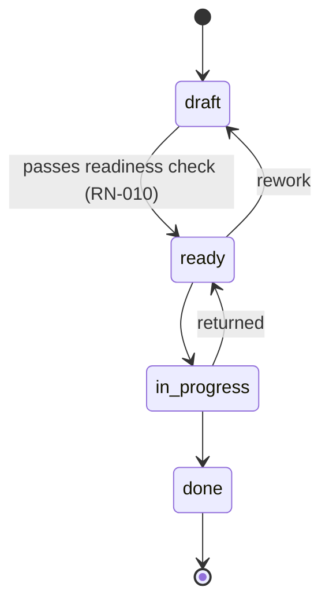
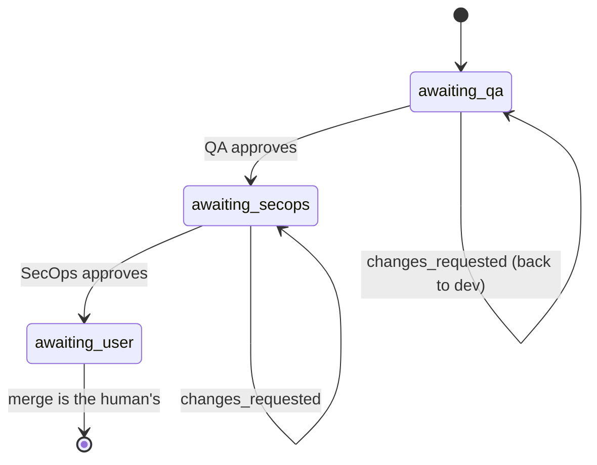

# Business rules

Each rule has a **statement**, **where it lives** (`file:line`), and **the
test that covers it**. If you change a rule, update the line here in the same
change — that's what
[`.docmap.yml`](https://github.com/daneiel/brabo/blob/dev/docs/.docmap.yml)
requires with `block` severity.

They all live in `apps/api/src/domain/`, which is **pure**: no IO, no
framework, no database. That's why each one has a fast, deterministic unit
test.

## Business context

Brabo executes engineering work through AI agents. Two forces shape virtually
every rule here:

**The agent is not trustworthy by construction.** It's a language model: it
can hallucinate, get stuck in a loop, or request something destructive. The
rules exist so the possible damage is bounded by structure, not by prompt
quality.

**Spend is real and continuous.** Every turn consumes a paid token. Budget,
ceiling, and metering aren't administrative conveniences — they're what
stops an agent loop from turning into a loss.

### Actors

| actor | who it is | authority |
|---|---|---|
| **User** | the person. Roles: `viewer`, `developer`, `maintainer`, `owner` | final decision on any action with external effect; merge is theirs exclusively |
| **Agent** | long-running process with a role (Creative, PO, Architect, Dev, Infra, QA, SecOps, Psychologist, Anamnesis) | proposes; never decides alone what policy doesn't allow |
| **System** | api and engine | enforces policy, records the event, measures cost |

The vocabulary is in the [glossary](glossary.md).

---

## Session

### RN-001 — The session has five states and closed transitions {#rn-001}

`created → active → closing → closed`, with `closed_abnormally` reachable
from any non-terminal state. **From `closing` there's never a way back to
`active`**, and terminal states have no exit.

- **Where:** `apps/api/src/domain/sessions/session-state-machine.ts:29`
- **Test:** `test/domain/sessions/session-state-machine.spec.ts`
- **Edge case:** `closing` is a **transient** state. A session stuck there
  means the drain started and didn't complete — there's an alert for that,
  see the [runbook](runbook.md).

### RN-002 — Every session event is immutable and `seq` is dense {#rn-002}

There's never an `UPDATE` on `session_events`. `seq` is unique per session
(`unique(session_id, seq)`) and has no gaps: it starts at 1 and is contiguous.

- **Where:** `apps/api/src/db/schema/sessions.ts` (table `session_events`)
- **Test:** verified on restore — `docker/backup/restore.sh` fails if
  `count(*) ≠ max(seq) − min(seq) + 1` or `min(seq) ≠ 1`
- **Why:** it's what makes the Psychologist's evidence traceable and the
  backup verifiable. State that needs to change lives in its own table,
  alongside.

### RN-097 — The session's kind is creation intent; execution stays an event {#rn-097}

The session is born `consultiva` (consultative) or `criativa` (creative),
chosen by **whoever opens it** and recorded in `sessions.kind`. `consultiva`
is just conversation; `criativa` is the one that produces — it opens ideation
with the Creative agent and is the **only** one that enters execution. The
kind **never changes**: there's no route that swaps it.

The risk in this rule isn't the field, it's the **second source of truth**.
The product already knew how to say whether a session is executing, and knew
it through another path: `findActiveExecutionSession` looks for the `active`
session that carries the `execution.activated` event (it's what makes
reactivation land on the session where the dev agents already are, finding
#11 of the first dogfooding). The two coexist under a rule that keeps them
from fighting:

- **`kind` classifies creation INTENT.** A `criativa` session that never
  activated execution **is not** the current execution session, and the
  event-based derivation keeps not looking at `kind` — if it started to, every
  open creative session would become a candidate to receive the dev agents.
- **The event classifies execution STATE**, as always.
- **`execution.activated` on a `consultiva` session is an ERROR** (409), never
  silent conversion. This is the point that decides which of the two sources
  wins: letting the event promote the kind would be exactly having them write
  over each other.

The guard lives in the **funnel** — `AppendSessionEventUseCase` — not in
`ActivateExecutionUseCase`, because both paths that write an event (the
user's route and the engine's `/internal/*`) go through it. The extra session
read is only paid when the event is the execution one. The refusal happens
**before** `incrementSeq`: a refused attempt can't consume `seq`, or
[RN-002](#rn-002) would break.

The column's DEFAULT is `consultiva` — the kind that can do **less**: a row
arriving through a path that doesn't go through the route (migration,
maintenance SQL) doesn't earn the right to execute. The migration's
**backfill** does the opposite and is deliberate, by the 0033 reasoning: at
the moment it runs, every session predates the distinction, and some are
sessions where dev agents are working — waking them up as `consultiva` would
make reactivating an in-progress project fail without anyone having decided
anything.

- **Where:** `apps/api/src/domain/sessions/session-kind.ts:50`
  (`podeAtivarExecucao`), `apps/api/src/db/schema/sessions.ts:68` (the column),
  `apps/api/src/application/use-cases/sessions/append-session-event.use-case.ts:53`
  (the guard)
- **Test:** `apps/api/test/application/use-cases/sessions/session-kind-e-nome.spec.ts`
- **Origin:** [ADR 0061](adr/0061-tipo-da-sessao-na-criacao.md)

### RN-098 — The session name adds to the hashtag, never replaces it {#rn-098}

The session can receive a friendly name (`sessions.name`, optional), at
creation or later, via `PATCH /projects/:projectId/sessions/:sessionId`. The
label shown on screen is **composite**: `<name> · #<first 8 characters of the
id>`. With no name, it degrades to the **hashtag alone**.

The hashtag never disappears, and the reason is operational: it's what gets
pasted into a URL, a command, or a conversation, and a name chosen by a
person **isn't unique** — two sessions named "Checkout" are normal. A blank
name (or whitespace only) counts as **absence**, both on creation and on
renaming: writing `''` would turn the label into `" · #a1b2c3d4"`, worse than
the hashtag alone. `null` in the `PATCH` body is the way to **undo**.

Renaming is **not** a session event. The event log is what the session lived
through, and the name is a navigation label, changed as many times as
desired — N renaming events would push exactly what matters out of the
200-event tail.

- **Where:** `apps/web/src/lib/session-label.ts:50` (`rotuloDaSessao`),
  `apps/api/src/application/ports/session-repository.port.ts:52` (`rename`).
  Reachable both from inside the session
  (`apps/web/src/routes/SessionPage.tsx:445`, `handleRename`) and from the
  project's list, without needing to open the session first
  (`apps/web/src/routes/ProjectSessionsTab.tsx:101`, `handleRenomear`) — both
  screens call the same `renameSession` and the same `rotuloDaSessao`.
- **Test:** `apps/web/src/lib/session-label.test.ts`,
  `apps/api/test/application/use-cases/sessions/session-kind-e-nome.spec.ts`,
  `apps/web/src/routes/ProjectSessionsTab.test.tsx`
- **Origin:** [ADR 0061](adr/0061-tipo-da-sessao-na-criacao.md)

### RN-104 — The tab derives from the recorded kind, and creates in that kind {#rn-104}

The project has **two** session tabs — **Creative** and **Chat** — and each
one is a `kind`: it lists the sessions whose `sessions.kind` is its own, and
its CTA creates in that `kind`, **without asking again**. There's no third
tab listing both together.

The kind was already immutable ([RN-097](#rn-097)), and that's what makes it
a legitimate navigation coordinate instead of a saved filter: a session never
switches tabs. The tab reads the **recorded** field — it doesn't derive the
kind from any event, for the same reason as RN-097: `execution.activated`
classifies execution STATE, and a tab that looked at it would move on its
own.

Two consequences the rule fixes, and which aren't screen detail:

- **The kind choice leaves the form.** It used to live in a radio-button
  `fieldset`, and now it happens the moment the person clicks the tab.
  Keeping both would offer the chance to create a session that contradicts
  the place you're standing in. What's left in the form is the **name**,
  which stays optional ([RN-098](#rn-098)).
- **One action, one place at a time.** "Start ideation" still exists — it's
  what brings the Creative agent into the session, and from there on the
  owner's key starts being spent ([RN-058](business-rules/custo.md#rn-058)); no one steps in alone.
  What changed is where it lives: **inside the invite** while the invite is
  on screen, and in the topbar when it isn't. The invite used to POINT to the
  topbar ("use Start ideation, at the top of the screen"), which is the
  literal version of the problem that originated [RN-097](#rn-097) — the
  action in one place and the explanation in another. The topbar can't
  simply lose the button: it's possible to type into a creative session
  without ever having called the Creative agent, and then the invite leaves
  the scene.

The three screens honor the three states of [RN-088](#rn-088), with **error
before empty**: the filtered list is empty in both cases, and saying "no
ideation yet" after a 429 would be lying about what happened.

The Chat's deep-link key stays `sessions`, not `chat`. That's what makes an
old bookmarked `?tab=sessions` link open the Chat **with the tab marked in
the tab bar** — resolving the old key as an alias only in the panel would
leave the tab bar with no selection at all, because `Tabs` compares `active`
to `key`, and whoever writes `active` receives the raw key from
`validateSearch`.

- **Where:** `apps/web/src/routes/project-tabs.ts:95` (both entries),
  `apps/web/src/routes/ProjectSessionsTab.tsx:114` (the filter by recorded
  `kind`) and `:98` (the CTA creating in the tab's `kind`),
  `apps/web/src/routes/SessionPage.tsx:553` (`conviteVisivel`, the one
  question the topbar and the invite share)
- **Test:** `apps/web/src/routes/ProjectSessionsTab.test.tsx`,
  `apps/web/src/routes/project-tabs.test.tsx`,
  `apps/web/src/routes/SessionPage.sessao.test.tsx`
- **Edge case:** a project with no session of that kind shows the empty
  state OF THAT KIND, even when it has sessions of the other kind — that's
  information, not an error.
- **Origin:** [ADR 0061](adr/0061-tipo-da-sessao-na-criacao.md)

### RN-123 — Creative session with no active Creative agent: the first message ALSO activates it {#rn-123}

In a `kind: 'criativa'` session ([RN-097](#rn-097)) with no `agent.activated`
yet, sending the first message through the composer activates the Creative
agent first (waiting for activation to finish) and only then delivers that
message to it through the real path (`sendAgentMessage` — history, system
prompt, `emit_artifact` tool). Before this rule, whoever typed without
clicking "Start ideation" fell into a generic SSE chat with no history and no
business rules: it was NOT the real Creative agent, and the conversation
recorded nothing in the domain.

The "Start ideation" click still exists ([RN-104](#rn-104)) — it's still
what triggers activation when the person prefers the explicit gesture, and
it's from it that the owner's key ([RN-058](business-rules/custo.md#rn-058)) starts being spent on
either of the two paths. What changed is that the FIRST MESSAGE now also
counts as that gesture: no one should need a separate click before talking
to whoever the screen already invited them to talk to.

- **Where:** `apps/web/src/routes/SessionPage.tsx:627` (`handleSend`)
- **Test:** `apps/web/src/routes/SessionPage.ideacao-automatica.test.tsx`
- **Edge case:** a `consultiva` session has no Creative agent — the rule
  doesn't apply, and the generic SSE path stays the right one for it.

### RN-119 — The session's ACTIVE agent is the one with the most recent `agent.activated` — never a fixed chain {#rn-119}

`SessionPage` decides two things from the SAME agent: who the composer's
message goes to, and which agent the topbar resolves the displayed model
from (the full cascade session→agent→area→project→workspace, the same one
`RunLlmTurnUseCase` uses to actually run the turn). The two questions used
to have DIFFERENT answers before this rule: routing used a fixed precedence
chain (architect > po > creative, based on historical EXISTENCE — "has
already activated once", which never "turned off"), and the displayed model
didn't even know who was active — the model-binding route received no agent
at all and always fell back to the Creative agent's fixed fallback
(`herdarModeloDeStart`), even after a handoff to the PO, Architect, or Dev
Lead.

The single definition: the ACTIVE agent is the one with the most RECENT
`agent.activated` (by `seq`), among the conversational agents of the chat
flow (Creative, PO, Architect, Dev Lead). **Infra Lead is left out**:
`agent_command_controller.ex` (engine) only has a `message` route for
po/dev-lead/arquiteto (plus Creative, as the last clause's implicit
fallback) — Infra never had `message` wired, only `start`. Sending a message
to "infra" today would silently fall through to the Creative agent; treating
it as the composer's active agent would reopen that trap instead of closing
one.

- **Where:** `apps/web/src/routes/SessionPage.tsx:273` (`activeAgent`),
  `apps/web/src/lib/api-client.ts:773` (`getSessionModelBinding`, the
  `agentId`), `apps/api/src/interfaces/http/llm/model-bindings.controller.ts:147`
  (`getSessionBinding`, `@Query('agentId')`)
- **Test:** `apps/web/src/routes/SessionPage.agente-mais-recente.test.tsx`,
  `apps/web/src/routes/SessionPage.modelo-do-agente-ativo.test.tsx`,
  `apps/api/test/application/use-cases/llm/resolve-model-binding.use-case.spec.ts`
- **Edge case:** Infra Lead doesn't participate in composer routing nor in
  the "active agent" definition — it's proactive (Phase 4), not
  conversational through the composer.

### RN-120 — The session's event poll pauses during an in-progress turn {#rn-120}

`useSessionEvents` fetched events every few seconds with NO awareness of an
in-progress turn. If the poll landed DURING a turn (common — turns usually
last longer than the interval), it brought already-persisted
`chat.message`/`agent.response`, which rendered ALONGSIDE the
optimistic/streaming state still on screen: the same message, twice.

The fix pauses only the TIMER (`refetchInterval`) while `streaming` is
`true` — the query stays `enabled`, so the explicit invalidation that
already fires at the end of the turn (`finalizarTurnoDoAgente`) keeps
fetching fresh data at the right time. `pausarPoll` is an OPTIONAL
parameter, default `false`: the hook's other consumers (Overview, Code,
Provisioning, AdoptionPlan) have no conversational turn in progress and
stay as they were.

- **Where:** `apps/web/src/lib/hooks.ts:135` (`useSessionEvents`),
  `apps/web/src/routes/SessionPage.tsx:208` (`eventsQuery`)
- **Test:** `apps/web/src/lib/hooks.pausar-poll.test.tsx`
- **Edge case:** pausing the timer isn't disabling the query — explicit
  invalidation keeps working, and the fix depends on it to never miss data.

### RN-122 — The "Stop" button cancels the turn FOR REAL, killing the task holding the LLM call {#rn-122}

Until now there was no cancellation anywhere. The root was structural:
`agent_command_controller.ex` handled the user's message with
`GenServer.call(pid, {:user_message, texto}, ...)` — SYNCHRONOUS — and the
entire turn (tool loop + SSE call to the LLM) ran INSIDE `handle_call`. The
agent's process stayed blocked until the turn finished and handled NO other
message in the meantime — not even a future cancel command.

The fix: the turn `handle_call`/`handle_cast` of the four conversational
agents (Creative, PO, Architect, Dev Lead) spawns a
`Task.Supervisor.async_nolink/2` (`Engine.Agents.TurnoAssincrono`, new,
shared by all four) with the heavy work and returns `{:noreply, state}` —
the reply to the original `GenServer.call` is DEFERRED until the task
finishes (`GenServer.reply/2`, fired when `{ref, resultado}` arrives at
`handle_info`). Since the agent process STOPS being blocked, a new
`handle_cast(:cancel, state)` arrives and is handled while the turn runs:
`Task.shutdown/2` in `:brutal_kill` mode kills the task, which drops the
HTTP (SSE) connection it holds with the api — that's what makes cancellation
actually save tokens, not just stop rendering on the client. The original
`from` receives `{:error, :cancelado}`, and a TERMINAL `agent.error` is
recorded with origin `"politica"` (policy — the same origin as
budget/credential/binding — cancelling is a user decision to stop spending
tokens, not a fifth value in ADR 0020's closed vocabulary) — without it,
`GetSessionPendingWorkUseCase` would see `agent.activated` with no
subsequent `agent.response`/`agent.error`, and the session would stay hung
on the pending-work signal.

Two competing messages to the same agent (the user sends again while a turn
is already running) never spawn a second task:
`TurnoAssincrono.iniciar/3` replies `{:error, :turno_em_andamento}`
(turn in progress) right away.

- **Where:** `apps/engine/lib/engine/agents/turno_assincrono.ex` (the
  mechanism), `apps/engine/lib/engine/agents/{criativo,po,arquiteto,dev_lead}_server.ex`
  (the four turn `handle_call`/`handle_cast`), `apps/engine/lib/engine_web/controllers/agent_command_controller.ex:170`
  (`cancel/2`), `apps/engine/lib/engine_web/router.ex` (`POST
  /internal/sessions/:sessionId/agent/cancel`),
  `apps/api/src/application/use-cases/agents/cancel-agent-turn.use-case.ts`,
  `apps/api/src/interfaces/http/agents/agents.controller.ts` (`POST
  /projects/:projectId/sessions/:sessionId/agents/:agent/cancel`),
  `apps/web/src/routes/SessionPage.tsx` (`handleCancel`, "Stop" button in
  the composer)
- **Test:** `apps/engine/test/engine/agents/turno_assincrono_test.exs` (the
  task dies FOR REAL — `Process.alive?/1` before and after — not just
  "stopped importing the result"), `apps/api/test/application/use-cases/agents/cancel-agent-turn.use-case.spec.ts`
- **Edge case:** cancelling with no turn in progress is an idempotent
  NO-OP — there's no task to kill nor pending `from` to reply to.
  Cancellation does NOT undo a side effect that already ran BEFORE the task
  died (e.g., a tool that had already been dispatched and recorded its
  event) — it only interrupts what hasn't happened yet.
- **Origin:** this session's investigation; no dedicated ADR (a concurrency
  pattern change INSIDE the harness, not a layer/database boundary).

### RN-142 — Confirming readiness with NO business rule at all is refused by the engine, not just hidden in the UI {#rn-142}

Before, clicking "I'm ready to produce" — or calling the route directly —
ALWAYS created the `product_brief` and offered the handoff to the PO, even
in a conversation where zero business rules had been captured.
`business_rule_refs(state)` already existed in `criativo_server.ex`, but
only to POPULATE the brief's `"rules"` field — never as a blocking
condition. In the UI, `SessionPage.tsx` disabled the button only during
`streaming`, without checking the rule count.

The real guarantee had to live on the server, not on the screen: whoever
calls the route directly (or a future client that isn't this frontend)
can't punch through the guardrail just because the button is drawn
disabled. `CriativoServer.handle_call(:confirm_readiness, ...)` now checks
`business_rule_refs(state)` BEFORE spawning the
`Engine.Agents.TurnoAssincrono` `Task` ([RN-122](#rn-122)) — empty, it
refuses right there, without running the consolidation turn, without a
`product_brief`, without a handoff.

The refusal doesn't turn into an HTTP 4xx:
`agent_command_controller.ex#readiness/2` IGNORES this `GenServer.call`'s
return and always answers 202, the same pattern `message/2` already uses
since RN-122 ("this response is just the acknowledgment" — the real
outcome lives in the event log). That's why the refusal is narrated as a
DURABLE `agent.error` (RN-059), with origin `"politica"` (policy — it's a
product decision, not an infra/model/turn failure) — and a message
explaining why; the session thread already knows how to render this event
type (`lerFalhaDeTurno`, the same red bubble as any other turn failure).

The complementary UX, in `SessionPage.tsx`: the button is born `disabled`
(with a `title` explaining why) while `events` has no
`artifact.business_rule` — the SAME source that already feeds the
"Business rules" panel (`ContextAside`), with no second read that could
diverge from the first.

- **Where:** `apps/engine/lib/engine/agents/criativo_server.ex`
  (`handle_call(:confirm_readiness, ...)`, `emit_falha_sem_regra/1`),
  `apps/web/src/routes/SessionPage.tsx` (`hasBusinessRule`, the "I'm ready
  to produce" button)
- **Test:**
  `apps/engine/test/engine/agents/criativo_server_test.exs` ("readiness:
  refuses when NO business rule was captured" — no turn, no brief, no
  handoff; the refusal narrated with origin `"politica"`),
  `apps/web/src/routes/SessionPage.readiness-exige-regra.test.tsx` (button
  disabled with no rule, enabled with 1+)
- **Edge case:** the session already had `readiness.confirmed` recorded by
  the api BEFORE signaling the engine (`ConfirmReadinessUseCase`) — that
  doesn't change: it's the record of the user's CLICK, a fact that happened
  independent of the engine accepting or refusing afterward.
- **Origin:** code investigation confirming a user report — no ADR (new
  guardrail on an already-existing flow, no layer/database boundary
  change).

---

## Action approval

The heart of the system. Every action with an external effect is born as a
`proposed_action`.

### RN-003 — The action has six states, and denied is terminal {#rn-003}

- **Where:** `apps/api/src/domain/actions/action-state-machine.ts:36`
- **Test:** `test/domain/actions/action-state-machine.spec.ts`
- **Edge case:** an approved action that executed becomes `executed`,
  **not** still `approved`. Counting approvals by `status = 'approved'`
  gives the wrong number — the correct criterion is `decided_by IS NOT
  NULL`.

### RN-004 — The decision is evaluated in three stages, and `deny` wins immediately {#rn-004}

Order: **(a) IAM → (b) `agent_autonomy` → (c) `permissions.json`**. Each
stage can only **raise** permissiveness; a silent stage never lowers the
previous one. `deny` at any stage returns immediately.

- **Where:** `apps/api/src/domain/actions/decide.ts:116`
- **Test:** `test/domain/actions/decide.spec.ts` (10 KB — the largest in
  the domain)

### RN-005 — Minimum role per action type {#rn-005}

Before any policy, IAM: each `ActionType` requires a minimum effective
role. Without it, `deny` with an explicit reason.

- **Where:** `apps/api/src/domain/actions/decide.ts:37` (`MIN_ROLE_FOR_ACTION_TYPE`)
- **Test:** `test/domain/actions/decide.spec.ts`

### RN-006 — Ceiling: merge into a protected branch is never auto-approvable {#rn-006}

`dev`, `qa`, `rc`, and `main` are protected. A `git_merge` targeting one of
them is downgraded from `auto_approve` to `require_approval` **after** all
the policy has run. Neither `agent_autonomy` nor `permissions.json` can
promote it.

`rc` stays on the list even after the step left the policy
([ADR 0030](adr/0030-politica-de-branches-mecanizada.md)) and the bootstrap
stopped creating it ([RN-029](#rn-029)). This list decides what the lock
**refuses**, and repositories bootstrapped by earlier versions still have
the branch: protecting one that doesn't exist costs nothing; unprotecting
one that exists costs dearly.

- **Where:** `apps/api/src/domain/actions/decide.ts:149` + `protected-branches.ts:4`
- **Test:** `test/domain/actions/decide.spec.ts`
- **Origin:** [ADR 0011](adr/0011-infra-dev-agents-worktrees-merge-lock.md) §1
- **Note:** the equivalent protection **on the platform** (GitHub/GitLab)
  diverges between providers and isn't the gate — see
  [ADR 0028](adr/0028-protecao-de-branch-divergencia-entre-providers.md).

### RN-007 — Ceiling: an instruction patch is never auto-approvable {#rn-007}

Changing an agent's instruction always requires a human decision. The
feature's value is in the human seeing the diff; auto-approving would be
the agent rewriting itself.

- **Where:** `apps/api/src/domain/actions/decide.ts:166`
- **Test:** `test/domain/actions/decide.spec.ts`
- **Origin:** [ADR 0016](adr/0016-anamnese-proficiencia-patches-instrucao.md) §8

### RN-008 — Command matching is by pattern, not substring {#rn-008}

`permissions.json` matches a terminal command by structured pattern, with
the command properly tokenized — not by `includes()`.

- **Where:** `apps/api/src/domain/actions/command-matcher.ts`
- **Test:** `test/domain/actions/command-matcher.spec.ts`

---

## Backlog

### RN-009 — The story has four states, and `done` is terminal {#rn-009}

`draft → ready → in_progress → done`. Rework is allowed: `ready → draft` and
`in_progress → ready`.

- **Where:** `apps/api/src/domain/backlog/story-state-machine.ts:27`
- **Test:** `test/domain/backlog/story-state-machine.spec.ts`

### RN-010 — `draft → ready` requires four things, validated in the domain {#rn-010}

For a story to become `ready` it needs, **all of them**:

1. `dod` not empty — Definition of Done
2. `dor` not empty — Definition of Ready
3. at least 1 functional requirement (`rf`)
4. at least 1 linked business rule (`businessRuleIds`)

The error names **exactly what's missing**, not a generic "invalid".

- **Where:** `apps/api/src/domain/backlog/story-readiness.ts:39`
- **Test:** `test/domain/backlog/story-readiness.spec.ts`
- **Origin:** [ADR 0009](adr/0009-agente-po-backlog-rastreabilidade.md) §3
- **Why:** it's what stops the PO from dumping a vague story into the dev
  queue.

### RN-011 — Business rule with no story is a finding, not an error {#rn-011}

Rule→story coverage is computed, and what has no story shows up as
**pending** — information, not a failure.

- **Where:** `apps/api/src/domain/backlog/coverage.ts`
- **Test:** `test/domain/backlog/coverage.spec.ts`

### RN-012 — A module removed from `module_map` demotes the story {#rn-012}

A story linked to a module that ceased to exist goes back to `draft`, with
a `backlog.story_demoted` event.

- **Where:** `apps/api/src/domain/architecture/module-resolution.ts`; the
  event is emitted in
  `application/use-cases/architecture/create-module-map.use-case.ts:73`
- **Test:** `test/domain/architecture/module-resolution.spec.ts`

### RN-013 — The module graph cannot have a cycle {#rn-013}

- **Where:** `apps/api/src/domain/architecture/module-graph.ts`
- **Test:** `test/domain/architecture/module-graph.spec.ts`

---

## PR Gates

### RN-014 — The gate order is immutable and `awaiting_user` is terminal {#rn-014}

`awaiting_qa → awaiting_secops → awaiting_user`. Approving QA **never**
skips straight to the user. `changes_requested` sends it back to the dev
**on the same branch**, with no new PR.

- **Where:** `apps/api/src/domain/execution/pr-gate-state-machine.ts:24`
- **Test:** `test/domain/execution/pr-gate-state-machine.spec.ts`
- **Origin:** [ADR 0013](adr/0013-gates-qa-secops-pr.md) §1
- **Edge case:** `awaiting_user` is terminal **by design** — the system
  never merges (RN-006).

### RN-015 — Cycle K: the correction ceiling is finite and inherited {#rn-015}

Every gate return consumes a lap. Once the ceiling is exhausted, the task
is **blocked** with a reason, instead of spinning forever. A subagent
created by parallelization **inherits** the base agent's ceiling.

Since Phase 8b the ceiling also applies to the QA AREA, with no code
change: `QaLeadServer` is the only caller of `record_gate_verdict`, so one
gate round — no matter how many specializations it consulted underneath —
still consumes exactly ONE lap. See
[RN-036](#rn-036).

- **Where:** `DEFAULT_MAX_GATE_CORRECTIONS = 3` in
  `apps/api/src/application/use-cases/execution/record-gate-verdict.use-case.ts:21`;
  applied in `activate-execution.use-case.ts:85` and, in the engine, in
  `qa_lead_server.ex:268` and `secops_agent_server.ex:142`
- **Test:** `apps/engine/test/engine/gates/qa_automacao_agent_test.exs`
  (the specialization returns `{:blocked, ...}` without calling the api)
  and `qa_lead_server_test.exs` (the Lead NEVER calls
  `record_gate_verdict` in that case — that's what stops the correction
  from being burned)
- **Origin:** [ADR 0017](adr/0017-lock-de-workspace-e-monitor-de-dev-agents.md) §4

### RN-016 — The gate's verdict prevails over the task's statement {#rn-016}

If the task description says one thing and the gate's verdict says
another, the verdict wins.

Since Phase 8b, "the verdict" can come from two specializations — the rule
doesn't change: each one prevails over the task WITHIN what it evaluates
(Automation over test coverage; Performance/Security over performance NFRs
and code findings). `QaLead.consolidar/1` doesn't arbitrate between them
and the task: any `changes_requested` from any of them already fails the
whole thing (see [RN-036](#rn-036)).

- **Where:** prompt for each specialization in
  `apps/engine/lib/engine/gates/qa_automacao_agent.ex` and
  `qa_performance_seguranca_agent.ex`
- **Origin:** [ADR 0020](adr/0020-destravar-gates-qa-secops.md) §9

### RN-036 — QA becomes an area: the Lead consolidates without changing the gate's contract {#rn-036}

The Automation specialization (Phase 4a's `QAAgent`) always delegates;
Performance/Security only when the story has a pertinent performance NFR
(`Engine.Gates.QaLead.rnf_de_performance?/1` — a keyword heuristic, not
NLP). The decision NOT to delegate is always recorded — a `dispensed`
delegation with a justification, never silence.

Consolidation: `approved` only if ALL delegations that ran approved; any
`changes_requested` fails the whole thing, with `itens` (items) from the
specialization(s) that requested changes, each item prefixed with the
label of whoever raised it (`"[QA de Automação] ..."`) — that's how the
origin is traced WITHOUT changing `itens` from `string[]` to another
shape. Delegation failure (any origin — `infra`, `modelo`, `codigo`,
`politica`) NEVER becomes `changes_requested`: the Lead blocks the task
with the real origin (RN-015).

The `qa_verdict` that reaches the api is the SAME artifact and goes
through the SAME route as always (`RecordGateVerdictUseCase`,
`nextGateStatus`) — neither of the two changed. What the api learns about
the area lives only in the `delegation.completed`/`delegation.failed`/
`delegation.dispensed` events, which the specialization and the Lead
record separately.

- **Where:** `apps/engine/lib/engine/gates/qa_lead.ex` (`consolidar/1`,
  `rnf_de_performance?/1`), `qa_lead_server.ex` (the wiring);
  `apps/api/src/application/use-cases/execution/record-delegation.use-case.ts`;
  `apps/api/src/db/schema/agents.ts` (table `delegations`, enum `failure_origin`)
- **Test:** `apps/engine/test/engine/gates/qa_lead_test.exs` (the pure
  decision tree), `qa_lead_server_test.exs` (the wiring: decision →
  delegation → recording → consolidation → the SAME call as always), and —
  the proof that the contract didn't change —
  `record-gate-verdict.use-case.spec.ts`, `pr-gate-state-machine.spec.ts`
  and `record-infra-gate-verdict.use-case.spec.ts` pass **with no change
  at all**
- **Origin:** [ADR 0038](adr/0038-hierarquia-de-agentes.md)

On the `apps/web` side (Phase 8d): the team panel groups `qa`/
`qa-automacao`/`qa-performance-seguranca` as lead + collapsible
specializations, the PR timeline expands the consolidated verdict into
its internals (`ProjectApprovalsTab.tsx`, `PrGateTimeline.tsx`), and the
feed narrates `delegation.*` — see `apps/web/src/lib/agents.ts`
(`AREAS`/`areaFor`).

---

### RN-054 — External handoff addresses the area's lead or an agent with no area — never a subagent {#rn-054}

Whoever talks to an area **from outside** talks to the lead. A handoff
addressed to a subagent (`qa-automacao`, `qa-performance-seguranca`,
`infra-workflows`) is refused with a typed error that **names the lead**
the caller should have addressed — refusing without saying the right path
would just trade a hierarchy breach for a stuck agent.

The refusal happens **before** the INSERT. Refusing afterward would leave
a ghost handoff in the table and a `handoff.offered` — an immutable
event — asserting an offer the policy doesn't allow.

Internal delegation (lead → subagent) does **not** go through here: it's
private to the area, has its own table (`delegations`) and its own path
(`RecordDelegationUseCase`). The rule is about the area's external
boundary, not about what happens inside it.

ADR 0038 called for this validation, naming the place —
`CreateHandoffUseCase` is the only one in the system that writes
`toAgent` — and it had never been implemented (finding #12 of the first
dogfooding). The engine's `offer_handoff` passed `to_agent` through as a
free string, so until now nothing stopped an agent from breaching the
hierarchy.

**Area, lead, and members have ONE source** since PHASE 18:
`apps/api/src/domain/agents/agent-areas.ts`. The list used to be
hand-written in three places (api, web, engine) and the test only
compared api against web — the engine silently diverged. Now
`apps/web/src/lib/agent-areas.generated.ts` and
`apps/engine/lib/engine/agents/areas.ex` are produced by
`pnpm --filter api gerar:areas`, and the test fails what's stale on disk.
The list is still the CATALOG; `agent_areas` is the per-project STATE
(RN-094), and the two answer different questions.

- **Where:** `apps/api/src/domain/agents/agent-areas.ts`
  (`assertHandoffTargetAllowed`, `HandoffToSubagentError`),
  `apps/api/src/application/use-cases/agents/create-handoff.use-case.ts`
- **Test:** `test/domain/agents/agent-areas.spec.ts` (the rule + the check
  that the derived copies don't diverge from the source),
  `test/application/use-cases/agents/create-handoff.use-case.spec.ts`
  (refusal with no row and no event)
- **Origin:** [ADR 0038](adr/0038-hierarquia-de-agentes.md), closed from
  finding #12 of the [first dogfooding](explanation/primeiro-dogfooding.md)

---

### RN-037 — Infra becomes an area: Workflows generates CI per provider, Lead consolidates into a single PR {#rn-037}

Second instance of the ADR 0038 model, after the QA area (RN-036) — with
one structural difference: the Infra area's two delegations ALWAYS run
(Dockerfiles/compose by the Lead itself — "delegates to itself"; CI
pipeline by the Workflows subagent), never is one dispensed. `Workflows`
decides the pipeline format from the context's `gitProvider`
(`GetInfraContextUseCase`, read from `project_repositories.provider` —
**not** from `GitProvider` `capabilities`, which are the SAME for GitHub
and GitLab): `"gitlab"` generates `.gitlab-ci.yml`; any other value
(`"github"`, `"local"`, or unknown) generates `.github/workflows/ci.yml`.
Each file goes through `validate_infra_file` before finishing — hadolint
for Dockerfile, `actionlint` for GitHub Actions workflow
([ADR 0039](adr/0039-actionlint-e-validacao-do-pipeline-de-ci-gerado.md);
`.gitlab-ci.yml` has no local validation, a documented gap, not a
half-solution).

Consolidation: the two delegates' files are merged by `path` (Workflows'
wins on collision) into a SINGLE PR — the mechanism to propose the PR
(`propose_infra_pr`) changes from "the tool calls the api directly" to
"the tool signals the Lead, which consolidates and calls once" — the
`open_infra_pr` the api receives is the SAME as always, byte for byte
(`ExecuteInfraPrUseCase` untouched). Failure of any delegate (origin
`infra`/`modelo`/`codigo`/`politica`) NEVER opens a partial PR — the same
rule as RN-036, one level up again.

Each delegate (even the Lead, on itself) is tracked as a `delegations`
row — reused exactly as RN-036 left it, with ONE correction: the
`task_id` column became NULLABLE (the Infra area delegates on the
SESSION, with no backlog task behind an infra PR), and the route
`POST /internal/sessions/:sessionId/delegations` stopped being nested
under `/tasks/:taskId` — `taskId` now goes in the body, optional. Cycle K
and budget have no dedicated column in the Infra area (the original
InfraAgent never had per-task budget, and this work didn't introduce
one).

- **Where:** `apps/engine/lib/engine/infra/infra_lead.ex` (`consolidar/2`),
  `infra_lead_server.ex` (the wiring), `workflows_agent.ex`,
  `tools/validate_infra_file.ex` (dispatch by extension),
  `apps/api/src/application/use-cases/execution/get-infra-context.use-case.ts`
  (`gitProvider`), `record-delegation.use-case.ts` (`taskId` optional)
- **Test:** `apps/engine/test/engine/infra/infra_lead_test.exs` (the merge
  and the block, pure), `infra_lead_server_test.exs` (the wiring: single
  PR with both file sets, two delegations, `gitProvider: "gitlab"` →
  `.gitlab-ci.yml`, Workflows failure → no PR), `workflows_agent_test.exs`
  — and the proof that the `ExecuteInfraPrUseCase`/`InfraGateRunner`
  contract didn't change: `execute-infra-pr.use-case.spec.ts` and
  `infra_gate_runner_test.exs` pass **with no change at all**
- **Origin:** [ADR 0038](adr/0038-hierarquia-de-agentes.md), [ADR 0039](adr/0039-actionlint-e-validacao-do-pipeline-de-ci-gerado.md)

On the `apps/web` side (Phase 8d): the team panel groups `infra`/
`infra-workflows` the same way as QA (RN-036), and the feed narrates the
area's delegations — the same `AREAS`/`areaFor` registry from
`apps/web/src/lib/agents.ts`, with no Infra-specific code in the UI.

---

### RN-140 — A gate cycle that dies mid-way resumes on its own, with no manual intervention {#rn-140}

`QaLeadServer`/`SecOpsAgentServer` are `restart: :temporary`, and the
gate's intermediate transitions (`DevAgentServer.correct/3`,
`Dispatcher.run_secops/2`) are direct in-memory calls — made AFTER
`record_gate_verdict` has already durably advanced `gate_status` on the
api. A crash between the two used to trap the PR forever in
`awaiting_qa`/`awaiting_secops`: nothing knew that step had been left
pending, and no engine restart fixed it — [ADR 0057](adr/0057-o-gate-espera-a-aprovacao.md)
itself already declared suspension in `{:awaiting, ...}` as a known
limit, and investigating again found that the window between a recorded
verdict and a dispatch call is, in practice, easier to hit.

`gate_states` (schema `engine`, key `{project_id, task_id, gate}`)
records the in-flight cycle at the SAME points where the transitions
already happened — `"in_progress"` before any subagent/scanner runs,
`"dispatch_pending"` right after `record_gate_verdict` returns
`correct`/`run_secops` and before the in-process call.
`Engine.Gates.GateRescuer` scans rows stuck for more than 15 minutes
(configurable, `GATE_RESCUE_STALE_AFTER_SECONDS`) — generous on purpose,
because a QA subagent's ToolLoop legitimately runs up to
`TOOL_LOOP_MAX_ITERATIONS_GATE` (60) iterations, and a short threshold
would rescue (and duplicate) a cycle that's merely slow — and resumes:
`"in_progress"` restarts the whole area (no surgical resumption of
`ctx`, which doesn't survive a restart, the same choice as the dev
agent); `"dispatch_pending"` resends exactly the lost call. Called on
boot and by an Oban tick self-rescheduled every 5 minutes
(`GATE_RESCUE_INTERVAL_SECONDS`),
`Engine.Workers.GateRescueSchedulerWorker` — the same idiom as
`ModelSyncSchedulerWorker`/`AnamneseSchedulerWorker`.

Two guards against duplicating work: a process alive ON THE SAME node
(`Registry.lookup`) is never disturbed, and the staleness threshold
covers what the local guard doesn't reach (remote replica — `Registry`
is local to the node, the same caveat as `Engine.Dev.Wake` since
[ADR 0045](adr/0045-reagendamento-por-evento-do-dev-agent.md)). The
worst outcome of a residual race is duplicated, cheap work — the api
rejects a second `record_gate_verdict` for a gate that no longer owns
`gate_status` (`nextGateStatus`), and `DevAgentServer.correct/3` is
already idempotent via a state guard since ADR 0052 — never
inconsistent data.

- **Where:** `apps/engine/lib/engine/gates/gate_state.ex`,
  `gate_rescuer.ex`, the write points in `qa_lead_server.ex`
  (`run_area/3`, `apply_gate_result/6`) and `secops_agent_server.ex`
  (`run_secops/3`, `apply_verdict/6`), and
  `apps/engine/lib/engine/workers/gate_rescue_scheduler_worker.ex`
- **Test:** `apps/engine/test/engine/gates/gate_rescuer_test.exs` — kills a
  real `QaLeadServer` with the cycle in flight
  (`DynamicSupervisor.terminate_child/2`, the durable row surviving the
  process) and proves `GateRescuer.run/0` reconnects the area on its own
  up to a real outcome; the scenario in the statement (lost
  `run_secops`) and the lost `correct` return, both with REAL process and
  dispatch, no `FakeGateDispatcher`; and the two guards (a live local
  process isn't disturbed; a recent row isn't touched)
- **Origin:** [ADR 0067](adr/0067-o-gate-sobrevive-ao-restart.md), which
  extends [ADR 0057](adr/0057-o-gate-espera-a-aprovacao.md)

---

## Cost

As RNs de orçamento, metering e teto de custo moram em
**[Regras de negócio — Custo](business-rules/custo.md)**.

Mesmo motivo da seção de Autenticação abaixo: tamanho, não assunto.
Âncoras `#rn-NNN` inalteradas.

## Painel de projetos

### RN-039 — Dot de status do projeto: risco sempre vence inatividade {#rn-039}

A sidebar do dashboard mostra um dot de saúde por projeto, derivado de três
sinais independentes: orçamento (mesmos limiares 70%/90% do RN-018), task
bloqueada (`tasks.blocked`) e atividade recente (7 dias). Cores: verde =
saudável e ativo; âmbar = orçamento ≥70%; vermelho = orçamento ≥90% **ou**
task bloqueada; cinza = sem atividade nos últimos 7 dias. Quando um sinal
de risco (âmbar/vermelho) e o de inatividade (cinza) se aplicam ao mesmo
tempo, o de risco vence — um projeto estourado e parado ainda é algo a
olhar, não algo a esconder atrás de "sem atividade".

- **Onde:** `apps/web/src/lib/project-status.ts` (`deriveProjectStatus`)
- **Teste:** `apps/web/src/lib/project-status.test.ts`
- **Origem:** fidelidade do dashboard de projetos ao design aprovado

### RN-088 — Falha de carregamento é dita na tela; 429 não se retenta {#rn-088}

Toda tela que carrega dado da api distingue três estados, e nunca dois:
**carregando** (esqueleto), **erro** (a mensagem que a api mandou, com o
`trace_id` e um botão de tentar de novo) e **vazio** (o texto de lista vazia).
`if (!dado) return null` colapsa os três, e o desfecho observado foi o pior
possível: com a api limitando por `429`, a área principal de `/projects/:id`
ficava **completamente em branco** — sem mensagem, sem erro, sem esqueleto — e
o motivo existia só no console. No dashboard era pior que branco: `!projects`
também era verdadeiro no erro, então a tela convidava a criar o **primeiro**
projeto de um workspace que podia ter vinte.

É a [RN-059](business-rules/custo.md#rn-059) do outro lado do fio: falha nunca vira resposta vazia.
Quem falha, diz.

A frase é a **da api**, extraída por `mensagemDaApi` — a mesma função que o
caminho de mutação já usava nos toasts. Um texto genérico nosso não sabe a
diferença entre "limite de requisições excedido, tente em instantes" (espere) e
"acesso negado" (não adianta esperar).

O outro lado da mesma regra é não responder ao limite com mais tráfego. **4xx
não se retenta**: `429` é literalmente o servidor mandando parar, e `401` já
foi renovado uma vez dentro de `request()`. E **poll para quando a query erra**
— volta no foco da janela, na remontagem ou no botão. Antes eram três
retentativas por falha somadas a ~25 polls de 3 a 5 segundos que não sabiam
parar: uma sessão real acumulou **1128 erros 429** contra um limite de 300
requisições por minuto por usuário (`RateLimitGuard`), e o laço impedia a
janela deslizante de se refazer. 5xx e falha de rede continuam com as três
tentativas, onde repetir é a reação certa.

- **Onde:** `apps/web/src/lib/query-policy.ts` (`deveRetentar`,
  `pollQueParaNoErro`), `apps/web/src/components/ErroDeCarregamento.tsx`,
  `apps/web/src/routes/ProjectPage.tsx`, `apps/web/src/routes/Dashboard.tsx`,
  `apps/web/src/routes/Shell.tsx`, `apps/web/src/main.tsx`
- **Teste:** `apps/web/src/lib/query-policy.test.ts`;
  `apps/web/src/routes/ProjectPage.test.tsx` (429 vira mensagem com a frase da
  api; 403 mostra o motivo do 403; carregando não é erro);
  `apps/web/src/routes/Dashboard.test.tsx` (erro na lista não vira "nenhum
  projeto ainda"); `apps/web/src/routes/Shell.test.tsx` (a sidebar diz em vez
  de ficar vazia)
- **Origem:** navegação real em `/projects/:id` com 1128 erros 429 no console

### RN-089 — Projeto de nome repetido se desempata na barra lateral {#rn-089}

Nome de projeto **não é único** — nada no domínio impede. Quando dois ou mais
projetos da lista têm o mesmo nome, cada um deles mostra na sidebar o id
abreviado e a data de criação (`#a1b2c3d4 · 07/08 14:32`), os dois já presentes
no payload do projeto. Quem tem nome único não mostra nada: a legenda em toda
linha seria ruído no lugar com menos espaço da tela.

Origem concreta: uma execução de validação criou vinte projetos chamados
`validacao-real`, e as vinte linhas da sidebar eram visualmente idênticas.

- **Onde:** `apps/web/src/lib/project-label.ts` (`nomesRepetidos`,
  `desempateDoProjeto`), `apps/web/src/routes/Shell.tsx`
- **Teste:** `apps/web/src/routes/Shell.test.tsx` (nome repetido ganha
  desempate, nome único não)
- **Origem:** navegação real com a sidebar cheia de projetos de validação

### RN-090 — O dashboard lê o workspace, não um projeto de cada vez {#rn-090}

A grade de cards e os dots da barra lateral se alimentam de **uma** requisição
por ciclo — `GET /workspaces/:workspaceId/projects-summary` —, e o número de
requisições **não cresce com a quantidade de projetos**.

O card mostra provedor de git, status de provisionamento, orçamento, chips de
agentes e última atividade; a sidebar mostra o dot de status e o contador de
não lidos. Tudo isso vinha de sete consultas em POLL por projeto, o que fazia
23 projetos custarem 3.824 requisições por minuto contra um limite de 300
(`RateLimitGuard`) — a tela derrubava a si mesma em 429 antes de terminar de
carregar. A [RN-088](#rn-088) fez a app parar de insistir quando isso acontece;
esta reduz o pedido.

Duas fronteiras que a regra fixa, e que não são detalhe de implementação:

- **A api responde fatos, não roster.** `roster` traz o que aconteceu no event
  log (execução ativada, módulos, gate já aberto, subagentes delegados, infra
  aceita). Quem é lead de área, que ícone cada agente tem e como os membros
  viram um chip continua sendo do web — e a regra de PRESENÇA é uma só
  (`rosterFromFacts`), compartilhada com o painel do time, para que um agente
  novo não apareça num lugar e falte no outro.
- **A gaveta do sino só busca quando aberta.** Ela era, até a
  [RN-091](#rn-091), a única leitura que continuava sendo uma requisição por
  projeto — o corte de "onde parei de ler" é `seq` guardado no navegador
  (`read-state`), que o servidor não conhece. Hoje o navegador **manda** esse
  corte, e a gaveta também é uma requisição só.

Efeito colateral aceito e desejado: `gatesEverOpened` e `delegatedSubagents`
passam a cobrir a sessão INTEIRA. O cliente derivava dos últimos 200 eventos e
perdia chips em sessão longa (ver
[ADR 0021](adr/0021-fechamento-4a-infra-e-painel.md)) — o texto de
`deriveAgentRoster` sempre disse "já abriu alguma vez".

- **Onde:**
  `apps/api/src/application/ports/projects-summary-repository.port.ts`,
  `apps/api/src/infrastructure/persistence/drizzle/projects-summary.repository.ts`,
  `apps/api/src/interfaces/http/iam/workspaces.controller.ts`
  (`getProjectsSummary`), `apps/web/src/lib/hooks.ts` (`useProjectsSummary`),
  `apps/web/src/lib/agent-status.ts` (`rosterFromFacts`),
  `apps/web/src/routes/Dashboard.tsx`, `apps/web/src/routes/Shell.tsx`
- **Teste:** `apps/web/src/routes/Dashboard.fanout.test.tsx` (30 projetos
  custam o mesmo que 3; nenhum endpoint por projeto é chamado);
  `apps/api/test/infrastructure/persistence/drizzle/projects-summary.repository.spec.ts`
  (o número de consultas ao banco não cresce com N);
  `apps/web/src/lib/agent-status.test.ts` (os fatos da api produzem os mesmos
  chips que o event log)
- **Origem:** dashboard de 23 projetos medido no navegador — 3.824 req/min
  antes, 12 depois

### RN-091 — O navegador manda onde parou de ler; o sino é uma requisição {#rn-091}

Com a gaveta de notificações **aberta**, o conteúdo dela sai de **uma**
requisição por ciclo — `POST /workspaces/:workspaceId/unread-events` — e o
número de requisições **não cresce com a quantidade de projetos**.

É a metade que faltava da [RN-090](#rn-090). Aquela derrubou o dashboard de
3.824 para 12 req/min, mas o sino continuou buscando um projeto de cada vez:
23 projetos com a gaveta aberta mediam **286 req/min** contra o limite de 300
(`RateLimitGuard`). Passava, e sumia com um projeto a mais.

**O obstáculo, e por que a saída é esta.** Não existe "marcar como lido" no
servidor, de propósito: o corte é um `seq` por projeto guardado no
`localStorage` de cada navegador (`read-state`). Havia duas saídas, e a
diferença entre elas é de PRODUTO:

- parar de repolar enquanto a gaveta está aberta muda a atualidade do que o
  usuário vê — **recusada**, ninguém pediu essa troca;
- o navegador **mandar** o mapa `projeto → afterSeq` devolve exatamente os
  mesmos dados na mesma cadência. **É batelamento puro: nada muda para quem
  olha a tela**, nem a frescura nem o conteúdo.

**É `POST` sem mutar nada**, e a api responde `200` (nunca `201`) para dizer
isso. O verbo foi escolhido por ser o único com CORPO: são dezenas de pares, e
em query string isso vira URL longa — que proxy trunca — além de pôr id de
projeto do usuário em log de acesso, contra a regra de não passar dado pessoal
por query string.

Três garantias de semântica que a rota fixa, porque batelar leituras com cortes
diferentes é onde o erro fácil mora:

- **mapa vazio devolve vazio**, e sem tocar no banco. "Não perguntei nada" não
  é "me dê tudo";
- **cada projeto respeita o SEU corte** — `seq` estritamente maior que o dele;
- **o teto de 50 eventos é por projeto**, o mesmo que `GET .../events` aplica
  sem `limit`. Um limite na resposta inteira deixaria o projeto barulhento
  comer a cota dos calados.

Cursor apontando para projeto de outro workspace é **ignorado**, não recusado:
ele vem do armazenamento local de quem chama e pode ser sobra de um workspace
antigo.

- **Onde:**
  `apps/api/src/application/ports/projects-summary-repository.port.ts`
  (`unreadEventsForWorkspace`),
  `apps/api/src/infrastructure/persistence/drizzle/projects-summary.repository.ts`,
  `apps/api/src/interfaces/http/iam/workspaces.controller.ts`
  (`getUnreadEvents`), `apps/api/src/interfaces/http/iam/dto/unread-events.dto.ts`,
  `apps/web/src/lib/notifications.ts` (`useNotificationGroups`),
  `apps/web/src/lib/api-client.ts` (`getUnreadEvents`)
- **Teste:** `apps/web/src/routes/Dashboard.fanout.test.tsx` (com a gaveta
  ABERTA: uma requisição, e 30 projetos custam o mesmo que 3);
  `apps/api/test/infrastructure/persistence/drizzle/projects-summary.repository.spec.ts`
  (o número de consultas ao banco não cresce com N; mapa vazio, corte por
  projeto, teto por projeto e isolamento de workspace)
- **Origem:** residual medido da [RN-090](#rn-090) — 286 req/min com a gaveta
  aberta num workspace de 23 projetos

### RN-099 — Atividades pagina o passado sem repolar o que não muda {#rn-099}

A coluna de **Atividade** da Visão geral mostra uma **janela** de 100 eventos
ancorada na **cauda** da sessão, e desce no passado de página em página. Cada
página usa o `afterSeq`/`nextCursor` que
`GET /projects/:p/sessions/:s/events` **já** devolve: nenhuma rota nova,
nenhum parâmetro novo.

**Duas perguntas, duas queries.** `useSessionEvents` responde "como está
agora" — os últimos 200 em poll — e alimenta o painel do time, a linha do
tempo em árvore, a seção de execução e a aba de Aprovações. Nenhuma delas
pagina. A de Atividades responde "o que aconteceu", e era a única que fazia
essa pergunta com a resposta da outra: 200 itens de uma vez, sem começo nem
fim, e ainda assim sem alcançar o início de uma sessão longa.

**A âncora é a cauda, não o começo da sessão.** O endpoint pagina para
FRENTE, e não existe `beforeSeq` — inventar um seria contrato novo. Mas abrir
o feed no evento nº 1 de uma sessão de milhares entrega a tela errada: quem
abre Atividades quer o que acabou de acontecer. Então a primeira página é a
mesma leitura `latest` que a tela já faz, com a **mesma `queryKey`** (o React
Query serve as duas com UMA busca), e cada clique desce uma janela fixa com
`afterSeq`.

**O que a paginação não pode custar.** Uma requisição por ciclo de poll — a
mesma de antes, e a economia da [RN-090](#rn-090)/[RN-091](#rn-091) não
regride. Três peças garantem isso:

- a cauda é a query que a tela já tinha, compartilhada por `queryKey`;
- o primeiro clique **não** vira requisição: a leitura `latest` traz 200 e a
  janela mostra 100, então revelar o que já se pagou vem antes de pedir de
  novo;
- página antiga é uma janela **fechada** de `seq` sobre eventos **imutáveis**
  (nunca há UPDATE em tabela de evento): `staleTime: Infinity` e
  **nenhum** `refetchInterval`. Um poll ali seria pagar N requisições para
  receber N respostas idênticas.

**A contagem é honesta sobre o que ela sabe.** Os filtros por agente e por
tipo rodam sobre a **página carregada**, não sobre a sessão — então a UI diz
`N de M carregados`, e não "N resultados". Levar o filtro ao servidor daria o
total verdadeiro e mexeria no repositório de eventos; não é desta fase, e
dizer o total errado seria pior que dizer menos.

Os três estados da [RN-088](#rn-088) valem aqui: **erro antes de vazio** — a
coluna dizia "nenhuma atividade" quando a api tinha recusado.

- **Onde:** `apps/web/src/lib/hooks.ts` (`useSessionEventHistory`,
  `EVENTOS_POR_PAGINA`), `apps/web/src/components/ActivityFeed.tsx`,
  `apps/web/src/routes/ProjectOverviewTab.tsx`,
  `apps/api/src/infrastructure/persistence/drizzle/session-event.repository.ts`
  (`listPaginated`, já existente)
- **Teste:** `apps/web/src/lib/session-history.test.tsx` (abre na cauda; o
  primeiro clique não custa requisição; o seguinte pagina com `afterSeq`
  contíguo; o laço termina no começo da sessão; montado junto com o estado
  atual a cauda é UMA busca; página antiga não repolla);
  `apps/web/src/components/ActivityFeed.test.tsx` (o "N de M carregados"
  acompanha o filtro; sem as props de paginação nada muda)
- **Origem:** pedido do usuário na primeira navegação real — "Atividades na
  aba Visão Geral deve ser paginada, para não ficar infinita"

### RN-100 — A ordem do sino é do SQL, não do front {#rn-100}

A gaveta de notificações mostra os eventos **do mais recente para o mais
antigo**, e quando um projeto tem mais não lidos que o teto de 50 os que
aparecem são os **mais NOVOS**.

**A ordenação é do banco por necessidade, não por gosto.** A consulta corta em
50 **por projeto** com uma função de janela
(`row_number() OVER (PARTITION BY session_id ORDER BY seq DESC)`), e é ela que
decide **quais** 50 eventos sobrevivem — não só em que ordem eles saem. Com
`ASC` sobreviviam os 50 mais **antigos**, e um `.sort()` no cliente ordenaria
por recência justamente a janela que a consulta já tinha escolhido errado:
num projeto com 300 não lidos, o 251º evento apareceria como "o mais recente".
É por isso que não há ordenação nenhuma no caminho do front, e o comentário no
componente diz que não pode haver.

**A consequência, e por que o corte de leitura não mudou.** O corte é um `seq`
por projeto no `localStorage`, e **não existe endpoint de marcar lido**, por
decisão registrada na [RN-091](#rn-091). Um corte por `seq` marca um
**prefixo**; a gaveta agora mostra um **sufixo**. Marcar como lidas "as 50
exibidas" é inexprimível sem um conjunto de lidos **por evento** — tabela nova,
fora de escopo. Os dois únicos cortes expressáveis continuam sendo "nada" e
"tudo até agora".

A saída não foi mudar a semântica (ela continua avançando para o último `seq`,
exatamente como antes), foi **parar de esconder o que esse avanço engole**:

- cada projeto mostra o **total** de não lidos, não o tamanho da janela, e
  declara quantos ficaram de fora (`+ N mais antigos`);
- o botão passa a dizer o que faz — `marcar as N como lidas` — quando há algo
  fora da janela;
- o número que falta sai de **subtração**, não de requisição: `latestSeq`
  menos o corte já vem no resumo do workspace ([RN-090](#rn-090)).

Como a semântica do corte não mudou, **não há ADR** nesta regra: o que mudou
foi qual janela a consulta escolhe e o que a gaveta declara sobre ela.

- **Onde:**
  `apps/api/src/infrastructure/persistence/drizzle/projects-summary.repository.ts`
  (`unreadEventsForWorkspace`),
  `apps/api/src/application/ports/projects-summary-repository.port.ts`,
  `apps/api/src/interfaces/http/iam/dto/iam.response.dto.ts`
  (`ProjectUnreadEventsResponseDto`),
  `apps/web/src/lib/notifications.ts` (`useNotificationGroups`),
  `apps/web/src/components/NotificationBell.tsx`
- **Teste:**
  `apps/api/test/infrastructure/persistence/drizzle/projects-summary.repository.spec.ts`
  ("com mais não lidos que o teto, voltam os MAIS RECENTES, do novo para o
  velho" — afirma o CONJUNTO antes da ordem);
  `apps/web/src/components/NotificationBell.test.tsx` (renderiza na ordem
  recebida, sem reordenar; o contador é o total; o botão diz quantas marca);
  `apps/web/src/lib/notifications.test.tsx` (o que ficou fora da janela sai
  por subtração, sem segunda requisição);
  `apps/web/src/routes/Dashboard.fanout.test.tsx` (a gaveta continua sendo
  UMA requisição)
- **Origem:** pedido do usuário na primeira navegação real — "Sino e
  notificações devem sempre ordenar para última data modificada em descendente
  para a mais antiga"

---

### RN-118 — A árvore do time expõe detalhe de execução por marco, e abre os "5 últimos" {#rn-118}

`AgentTimelineTree`/`timeline-tree.ts` (FASE 14b) já agrupava o event log por
agente, mas com três lacunas: o critério de abrir um ramo era só
ativo/parado (sem relação com quantos agentes existiam), o contador do
cabeçalho era o TOTAL de marcos (nunca "o que é novo"), e `tool.call`/
`tool.result`/`agent.response` viravam marco mostrando só o nome da
ferramenta — `args`, `result` e `iteration`, que o event log já grava,
nunca chegavam na tela.

**Abertura padrão** passa a ser "os 5 agentes de atividade mais recente
(maior `seq` do último marco)", com ativo mantendo prioridade sobre
recência — não se soma: como `montarArvore` já ordena ativos primeiro e,
dentro de cada grupo, do mais recente pro mais antigo, os dois critérios
colapsam numa fatia só (`ramosAbertosPorPadrao`, os primeiros
`max(nº de ativos, 5)` ramos). Mais de 5 ativos: todos abrem, sem corte.

**Contador de novidade** por agente usa o MESMO mecanismo do sino
(`read-state.ts`, `localStorage`), granular por `projectId:agentId` em vez
de só `projectId` — não existia "último visto" nessa granularidade antes.
Ramo colapsado com marco de `seq` maior que o último visto daquele agente
mostra a contagem de NOVIDADE no lugar do total; abrir o ramo (automático
ou manual) marca como visto até o `seq` mais recente.

**Detalhe expansível** é por MARCO, não por ramo — só `tool.call`,
`tool.result` e `agent.response` (`EVENTOS_EXPANSIVEIS`) viram botão
individual, porque só eles carregam payload que vale expandir. O
agrupamento visual por ITERAÇÃO usa `iteration` do payload de
`agent.response` quando existe (ToolLoop — `tool.call`/`tool.result`
herdam a iteração da resposta que os despachou, porque no ToolLoop eles
são emitidos DEPOIS dela); agentes fora do ToolLoop (PO, Criativo, sem
`iteration` no payload) ganham um contador PRÓPRIO por agente, incrementado
a cada resposta — inferência por proximidade de `seq`, não um campo novo no
event log.

- **Onde:** `apps/web/src/lib/timeline-tree.ts` (`Marco.iteracao`,
  `Marco.eventType`, `Marco.payload`, `ramosAbertosPorPadrao`,
  `marcoExpansivel`), `apps/web/src/components/AgentTimelineTree.tsx`,
  `apps/web/src/lib/read-state.ts` (`getAgentLastSeenSeq`/
  `setAgentLastSeenSeq`)
- **Teste:** `apps/web/src/lib/timeline-tree.test.ts` (agrupamento por
  iteração real e inferida, `ramosAbertosPorPadrao` com ativo/recência/sem
  corte), `apps/web/src/components/AgentTimelineTree.test.tsx` (abertura
  padrão, contador de novidade aparecendo/sumindo, marco expandindo com
  args/resultado/iteração)
- **Origem:** pedido do usuário — lacunas confirmadas por investigação no
  componente existente da FASE 14b; sem ADR, mesma semântica de "não visto"
  do sino, só granularidade nova

---

### RN-096 — Toda decisão diz em português o que acontece; o payload cru nasce colapsado {#rn-096}

Todo tipo de `proposed_action` tem uma **frase em português** que descreve o
efeito de aprovar, e ela é a primeira coisa visível no card — antes de qualquer
detalhe, nas três telas onde uma decisão é pedida (a fila de Aprovações, o card
dentro do chat da sessão e a aba Insights). O payload cru continua acessível,
**dentro de um colapso que nasce fechado**, e nunca é despejado na tela.

**O que existia era um despejo.** Todo tipo sem corpo visual próprio caía num
`Object.entries(payload).map(([k, v]) => k + ': ' + JSON.stringify(v))`, sempre
aberto. Quem abria a fila lia `worktree: /workspaces/dev-api`,
`coAuthor: Brabo User <user@brabo.dev>` e `proposto: 4` — e tinha de deduzir o
que ia acontecer se clicasse em Aprovar. Aprovação que exige dedução é
aprovação que se dá no automático, e o produto inteiro se apoia em o usuário
ser a autoridade final.

**A frase degrada, e é isso que a torna confiável.** Nenhuma delas assume que
uma chave do payload existe: com payload vazio a frase continua sendo uma frase
verdadeira, só menos específica ("Registra um commit no repositório do
projeto."). O payload vem do engine e de dez casos de uso diferentes, e nenhum
deles promete um formato — frase que só funciona com a fixture certa é frase
que quebra na primeira aprovação real.

**Tipo que o web ainda não conhece não é caso teórico.** A união `ActionType`
do web já ficou defasada duas vezes: primeiro com os três tipos do bootstrap de
Gitflow, e de novo com `parallelize`/`raise_max_parallel`, que entraram na FASE
14d. O compilador não pega: a lista canônica está em `apps/api`, que o web não
importa. Por isso duas coisas ao mesmo tempo — o card **degrada** (verbo neutro
+ "ver detalhes", com o payload colapsado, em vez do `undefined` no mapa de
ícones que derrubava a árvore inteira do React), e o **teste lê o `decide.ts`
do backend** e reprova quando um tipo entra sem frase.

**O default de aberto/fechado é derivado, não configurado.** A regra é uma só —
abre o que ainda espera decisão de quem está olhando: no chat, ação `pending`;
na fila, nunca (são N cards, e N detalhes abertos são a mesma parede de texto);
em Insights, hipótese `proposed`. E o payload CRU não abre em variante nenhuma.
A consequência de projeto é que `ApprovalCard` **não ganhou prop nova
obrigatória**: o default sai de `variant` e `status`, que já existiam.

**Verbo e frase saem de um módulo só**, consumido pelas três telas. A hipótese
do Psicólogo usa literalmente o verbo do `instruction_patch` em vez de um
vocabulário paralelo — e a frase dela diz o que o accept faz de verdade
(enfileira para a Anamnese, que **pode** propor o ajuste, que ainda vem para
aprovação), nunca "a instrução será alterada".

**`write_file` tinha frase, mas não corpo.** Ele nasceu de fora de
`COM_CORPO_PROPRIO`: a frase mostrava só o `path`, e o detalhe caía no mesmo
despejo de JSON cru colapsado que esta RN existe para evitar — então um write
que genuinamente pedia aprovação (fora do prefixo `dev-`, ou caminho fora do
escopo do agente) exigia um clique a mais para ver o `content`. Entrou em
`COM_CORPO_PROPRIO` com corpo próprio: `path` e um preview do `content` (até
25 linhas/4.000 caracteres, com aviso de truncamento — nunca o arquivo
inteiro, mesma regra do payload cru), aberto por padrão no chat enquanto
pendente, igual `terminal`.

**Payload vazio não é payload ausente.** `command` (terminal) ou
`path`/`content` (write_file) chegando como string vazia — tool-call
malformada do modelo, não bug de renderização — degradava para um prompt
`$ ` ou um preview em branco, que o usuário lia como defeito da tela. Os dois
corpos agora distinguem os dois casos e mostram "o modelo não produziu um
X válido para esta ação" em vez de um branco.

- **Onde:** `apps/web/src/lib/aprovacoes.ts` (`VERBO_DA_ACAO`, `fraseDaAcao`,
  `descreverAcao`, `descreverHipotese`), consumido por
  `apps/web/src/components/ApprovalCard.tsx` (Aprovações + chat da sessão,
  `COM_CORPO_PROPRIO`, `previewConteudo` para o `content` de `write_file`) e
  `apps/web/src/components/HypothesisCard.tsx` (Insights); colapso pelo
  `Disclosure` de `apps/web/src/components/ui/Disclosure.tsx`
- **Teste:** `apps/web/src/lib/aprovacoes.test.ts` (lê `ACTION_TYPES` de
  `apps/api/src/domain/actions/decide.ts` e exige verbo + frase para cada tipo,
  com payload vazio); `apps/web/src/components/ApprovalCard.test.tsx`
  (`frase e colapso` — payload colapsado nas duas variantes, JSON legível ao
  abrir, tipo desconhecido não derruba a tela, `write_file` com corpo próprio
  aberto por padrão e truncamento do preview, `command`/`path`/`content`
  vazios mostrando a mensagem de fallback);
  `apps/web/src/components/HypothesisCard.test.tsx` (`frase e colapso`)
- **Origem:** FASE 19 do programa 16–26, do pedido "hoje está muito difícil a
  leitura" na primeira navegação real depois do reset do banco

---

### RN-121 — Dev agent e QA são "executores": aba própria, fora do "Time de agentes" {#rn-121}

O grid "Time de agentes" e a "Linha do tempo do time" da Visão geral
misturavam Criativo/PO/Arquiteto/Infra com dev-`<módulo>` e QA (lead +
`qa-automacao`/`qa-performance-seguranca`) — sete, oito agentes na mesma
grade, sem distinguir quem CRIA/DECIDE de quem IMPLEMENTA/VERIFICA. A aba
**Executores** isola os dois últimos, com a MESMA renderização da Visão
geral (`AgentCard`, o grid de área — extraído para `AgentTeamGrid.tsx` — e
`AgentTimelineTree`), nunca um card reinventado.

**A regra de separação é uma função só**, `isExecutorGroup`/
`isExecutorAgentId` (`lib/agent-status.ts`): `dev-lead`/`dev-<qualquer
módulo>` e a área `qa` inteira (lead + subespecialidades) são executor;
o resto não é. As DUAS telas filtram o MESMO `groupRosterByArea` com essa
função — a Visão geral com `!isExecutorGroup`, Executores com
`isExecutorGroup` — então um agente não pode aparecer nos dois nem sumir
dos dois: é sempre exatamente um lado.

**A árvore não duplica**: cada aba filtra os EVENTOS antes de passar para
`AgentTimelineTree` (por `actor.id` pertencer ou não ao conjunto de
executores), então o ramo de um dev agent aparece só em Executores, nunca
também na Visão geral. A coluna de Atividade (`ActivityFeed`, RN-099/100)
NÃO foi filtrada — ela responde "o que aconteceu" na sessão inteira,
dev/QA inclusive, e o filtro por agente do próprio componente já lista
todo mundo que falou; só o grid e a árvore de "quem está fazendo o quê"
mudam de lugar.

- **Onde:** `apps/web/src/lib/agent-status.ts` (`isExecutorGroup`,
  `isExecutorAgentId`, `autonomyActionTypeFor` — movido de
  `ProjectOverviewTab.tsx`), `apps/web/src/components/AgentTeamGrid.tsx`
  (extraído do grid que já existia), `apps/web/src/routes/
  ProjectExecutorsTab.tsx`, `apps/web/src/routes/ProjectOverviewTab.tsx`,
  `apps/web/src/routes/project-tabs.ts` (`key: 'executores'`, `ordem: 12`
  — logo depois da Visão geral, antes de Criativo/Chat/Code)
- **Teste:** `apps/web/src/lib/agent-status.test.ts` (`isExecutorAgentId`/
  `isExecutorGroup` — dev-`<módulo>`, `dev-lead`, área `qa` inteira são
  executor; criativo/po/arquiteto/infra/secops não são);
  `apps/web/src/routes/ProjectExecutorsTab.test.tsx` (mostra só dev/QA,
  estado vazio sem os dois, contagem do cabeçalho);
  `apps/web/src/routes/ProjectOverviewTab.test.tsx` (dev-backend/QA somem
  do grid, o resto do time continua); `apps/web/src/routes/
  project-tabs.test.tsx` (a aba nova entra na varredura genérica do
  registro — régua, painel, deep-link, ordem única)
- **Borda:** SecOps NÃO é executor — ele entra na roster pelo MESMO
  `pr.gate_changed` que traz QA (Fase 4a, `rosterFactsFromEvents`), mas
  fica na Visão geral. `dev-lead` está na lista de executores por
  completude (RN-087 o descreve como conversacional), embora hoje nenhum
  caminho o instancie na roster da sessão (a delegação Dev Lead →
  `dev-<módulo>` segue fora de escopo, ADR 0053 item 5).
- **Origem:** pedido do usuário — "Executores" própria pra dev agent e QA,
  fora do grid misturado da Visão geral.

---

### RN-125 — O aceite de handoff é INLINE no fio, com CTA pro Dev Lead apontando pra Executores {#rn-125}

O divisor "X passou o bastão ao Y" que já existia na timeline (`handoff.offered`)
vira um **card acionável** — com o botão de aceitar embutido — sempre que
representa a oferta pendente **atual** (a mesma que `offeredHandoff` já
resolvia para o botão da topbar). O botão da topbar **saiu**: com o aceite
morando dentro do fio, no lugar exato onde a passagem aconteceu, manter os
dois puxaria dois botões com o texto IDÊNTICO visíveis ao mesmo tempo — o
mesmo problema que `ApprovalCard` já evita ao nunca duplicar a ação fora do
fio (RN-096).

**Qual evento vira o card é decidido por PAR, não por id.** O payload de
`handoff.offered` carrega só `toAgent`; o `fromAgent` é o `actor` do evento
(RN-054 já usava essa leitura para o texto do divisor). Sem o id do handoff
no evento, "esta é a oferta atual" é respondido achando o `handoff.offered`
mais RECENTE (maior `seq`) com o MESMO par `fromAgent`/`toAgent` de
`offeredHandoff` — o que impede reabrir um convite de aceite que uma oferta
mais antiga pro mesmo par já tenha resolvido (aceita, recusada ou superada
por uma oferta nova).

**O card pro Dev Lead ganha um segundo link**, "Acompanhe a execução em
Executores", pra aba que já existe (RN-121) — é o início da EXECUÇÃO, e quem
aceita precisa saber onde olhar depois. As outras ofertas (PO, Arquiteto…)
não ganham o link: a sessão delas segue sendo o próprio lugar de acompanhar,
não há "onde mais olhar".

- **Onde:** `apps/web/src/routes/SessionPage.tsx` (`timeline` — bloco
  `handoff.offered`, `offeredHandoffEventSeq`; `isActive` subiu para antes do
  `useMemo`), `apps/web/src/routes/SessionPage.module.css` (`.handoffCard`,
  `.timelineLink`)
- **Teste:** `apps/web/src/routes/SessionPage.handoff-inline-e-links.test.tsx`
  (card acionável só na oferta atual, oferta antiga do mesmo par fica muda,
  handoff já aceito não mostra botão nenhum, link de Executores só no
  `dev-lead`); `apps/web/src/routes/SessionPage.pista-e-status.test.tsx`
  atualizado para o botão inline (não mais na topbar)
- **Verificado por execução real:** aceitar um handoff pro PO numa sessão
  criativa contra um build isolado (stack Docker próprio, projeto/sessão
  reais) — o card vira divisor mudo e o log de eventos avança assim que o
  clique volta da api; o CTA pro Dev Lead navega pra `?tab=executores` de
  verdade.
- **Origem:** pedido do usuário — aceite de handoff também inline no fio,
  não só na topbar.

### RN-124 — O PO narra épico/história criados no fio, com link direto pro Backlog {#rn-124}

`backlog.epic_created`/`backlog.story_created` — que o PO já gravava no
event log (`CreateEpicUseCase`/`CreateStoryUseCase`) — não tinham
tratamento nenhum na timeline da sessão: criar história não deixava rastro
NENHUM no fio, só na aba Backlog, pra quem já soubesse ir olhar lá. Os dois
tipos ganham entrada na timeline, no MESMO corpo visual das outras
mensagens do agente (`.message`/`.bubble`) — nenhuma classe nova pro chip
em si, só o link.

O link ("Ver no Backlog") reusa o deep-link genérico da aba (`?tab=backlog`,
o mesmo mecanismo do CTA "Definir orçamento" do card do dashboard) — não
tenta realçar a história recém-criada dentro da aba, que é fora de escopo.

- **Onde:** `apps/web/src/routes/SessionPage.tsx` (`timeline` — bloco
  `backlog.epic_created`/`backlog.story_created`)
- **Teste:** `apps/web/src/routes/SessionPage.handoff-inline-e-links.test.tsx`
  (`item 2`)
- **Verificado por execução real:** épico e história inseridos no event log
  de uma sessão real aparecem como "Épico criado"/"História criada" com o
  título, e o link navega pra `?tab=backlog` de verdade.
- **Origem:** pedido do usuário — link do PO pras histórias criadas, direto
  pro Backlog.

### RN-126 — Promoção de história é decidível INLINE no fio, com o mesmo mecanismo da aba Backlog {#rn-126}

`backlog.story_promotion_proposed` (RN-048) ganha o mesmo tratamento que
RN-125 deu ao handoff: o evento vira **card acionável** na timeline da
sessão, com os botões "Promover" e "Devolver" chamando os MESMOS
`promoteStories`/`returnStory` que `PromotionQueue`
(`ProjectBacklogTab.tsx`) já usa — nenhum endpoint novo, nenhuma segunda
fonte de verdade. A decisão continua acontecendo em UM lugar (o backend), só
o gatilho ganhou um segundo caminho.

**Resolução por evento posterior, não por status derivado à parte.** O card
some sozinho (vira divisor mudo, sem botões) assim que um evento de seq
MAIOR decidir o destino da MESMA história —
`backlog.story_transitioned{storyId}` (promovida, emitido por
`PromoteStoriesUseCase` via `TransitionStoryUseCase`) ou
`backlog.story_promotion_returned{storyId}` (devolvida). Sem essa checagem,
promover ou devolver deixaria os mesmos dois botões plantados no fio,
oferecendo de novo uma decisão já tomada.

`backlog.story_promotion_returned` ganha narração simétrica no fio (motivo
incluído), reusando a mesma frase que `apps/web/src/lib/activity.ts` já
usava só no log colapsado da sidebar.

- **Onde:** `apps/web/src/routes/SessionPage.tsx` (`timeline` — blocos
  `backlog.story_promotion_proposed`/`backlog.story_promotion_returned`,
  `handlePromoteStory`/`handleReturnStory`, modal de motivo reusando
  `Modal`/`Textarea`)
- **Teste:** `apps/web/src/routes/SessionPage.promocao-inline-e-volta.test.tsx`
  (card com os botões, promover chama `promoteStories` com o `storyId` do
  payload, devolver exige motivo e chama `returnStory`, história resolvida
  por `story_transitioned` posterior vira divisor mudo, `story_promotion_returned`
  narra com o motivo)
- **Origem:** pedido do usuário — promoção de história inline no fio, opção
  barata reusando RN-048 em vez de gatear a criação da história.

### RN-131 — Três corridas confirmadas AO VIVO no fio da sessão: convite por cima do histórico, indicador ansioso e turno preso em `handleReadiness` {#rn-131}

Três defeitos achados navegando `SessionPage.tsx` de verdade no Chrome, não
por teste — e os três eram condição de corrida ou critério incompleto
disfarçado de decisão de produto.

**1. `conversaComecou` virou "existe QUALQUER evento", não "existe
`chat.message`/`agent.response`".** O critério anterior (achado G) nasceu
pra não confundir os cards do bootstrap do git com conversa, mas tinha o
efeito contrário: uma sessão criada pelo `git-bootstrap` (ações de
commit/branch já aprovadas, zero `chat.message`) mostrava o convite por
cima delas, e o mesmo acontecia — de forma bem mais grave — na sessão que a
ativação de execução usa, com dezenas de eventos reais (`tool.call`,
`tool.result`, eventos de task) e nenhum `chat.message`/`agent.response`: o
convite cobria o histórico de execução **inteiro**. Sessão nova é a única
sem nenhum evento — essa é a pergunta certa.

**2. `conviteVisivel` espera `useSessionEvents` terminar de carregar.** Em
cache frio (reload de página), `session` podia chegar enquanto `events`
ainda era `[]` — o default de `data?.items`, indistinguível de "sessão
vazia de verdade" até o primeiro fetch resolver. Sem o gate
`!eventsQuery.isPending`, o convite piscava por cima de sessões com
histórico grande.

**3. O indicador de "pensando" (bolha com os 3 pontinhos) só liga depois de
5s sem nenhum texto chegar.** Antes ele ligava no instante em que
`streaming`/`statusAgent` virava truthy — ruído visual na maioria dos
turnos, que respondem em menos de um segundo. Um `useEffect` arma um
`setTimeout(…, 5000)` quando o turno começa sem texto ainda, e o desarma (via
cleanup) assim que o primeiro delta chega ou o turno termina antes do prazo.
Texto de verdade (`streamingText`) continua aparecendo **na hora**, nunca
espera o timer — só o indicador vazio é que ganhou paciência.

**4. `handleReadiness` ganhou a mesma rede de segurança que `handleSend` já
tinha.** `confirmReadiness` é, como `sendAgentMessage`, um `GenServer.call`
síncrono no engine (até 120s) — e o canal Phoenix pode não ter terminado de
conectar (ticket + join, RN-108) quando o turno acaba, perdendo o broadcast
de `agent.done` pra sempre. `handleSend` já chamava
`finalizarTurnoDoAgente()` assim que a chamada síncrona resolvia,
independente do canal ter entregue o evento; `handleReadiness` tinha ficado
de fora dessa correção, e sem ela a bolha do agente ficava presa vazia
(`streaming: true`, sem texto) até a página recarregar.

- **Onde:** `apps/web/src/routes/SessionPage.tsx` (`conversaComecou`,
  `conviteVisivel`, o `useEffect` de `pensandoVisivel` logo abaixo de
  `agenteExibido`, e o bloco de sucesso de `handleReadiness`)
- **Teste:**
  `apps/web/src/routes/SessionPage.convite-so-em-sessao-vazia.test.tsx`
  (sessão vazia mostra o convite; sessão com eventos de git-bootstrap ou com
  dezenas de `tool.call`/`tool.result` esconde; `eventsQuery.isPending`
  segura o convite até o primeiro fetch resolver),
  `apps/web/src/routes/SessionPage.pista-e-status.test.tsx` (achado B —
  indicador não aparece antes de 5s, aparece depois, some no primeiro delta
  e nunca aparece quando o turno termina antes do prazo), e
  `apps/web/src/routes/SessionPage.readiness-turno-preso.test.tsx`
  (`confirmReadiness` resolvendo sem `onAgentDone` reconcilia o estado do
  mesmo jeito que `SessionPage.turno-preso.test.tsx` já prova pra
  `handleSend`)
- **Origem:** investigação AO VIVO do produto no Chrome — os três reproduzidos
  manualmente antes da correção.

### RN-136 — O card acionável de handoff no chat só considera quem CONVERSA nesta tela {#rn-136}

`OfferInfraHandoffUseCase` oferece o handoff pro Infra e, na MESMA
confirmação, oferece pro Dev Lead logo em seguida (FASE 14d) — duas chamadas
separadas, a de Infra primeiro. `handoffs` (o que `SessionPage.tsx` lê de
`useHandoffs`) vem ordenado por `createdAt` ASC
(`DrizzleHandoffRepository#findBySession`), e o `offeredHandoff` que decide
qual card vira "acionável" resolvia com um `.find()` puro — sempre o
`offered` mais **antigo**. Como o Infra Lead não é conversacional (não está
em `AGENTES_DE_CHAT`, e nunca é aceito por esta tela), o card do Dev Lead só
ficaria acionável depois de alguém aceitar o de Infra num lugar que esta
tela não mostra — na prática, nunca: o usuário só via "aceitar handoff de
Infra" e o convite pro Dev Lead ficava invisível atrás dele.

O filtro restringe `offeredHandoff` a handoffs endereçados a um agente de
`AGENTES_DE_CHAT`. O handoff pro Infra continua **narrado** no fio — o
`handoff.offered` dele vira divisor mudo, como qualquer oferta que não é "a
atual" — só o card com botão é que passa a ignorá-lo: Infra nunca teve (nem
precisa ter) um jeito de ser aceito por aqui.

- **Onde:** `apps/web/src/routes/SessionPage.tsx` (`offeredHandoff`)
- **Teste:**
  `apps/web/src/routes/SessionPage.handoff-devlead-e-colapso.test.tsx`,
  describe "problema 1" — Infra mais antigo + Dev Lead mais novo resolve pro
  card do Dev Lead, nunca pro de Infra; só Infra `offered` não mostra card
  nenhum
- **Origem:** investigação de código + teste ao vivo no Chrome — o handoff
  pro Dev Lead nunca ficava acionável depois da FASE 14d

### RN-137 — "Ativar execução" tem atalho inline no card do Dev Lead, sem baixar a exigência de papel {#rn-137}

O card de aceite do handoff pro Dev Lead ganhou um botão "Ativar execução"
ao lado do link "Acompanhe a execução em Executores" — atalho pra quem já
sabe o que quer, sem passar pela conversa. Chama a MESMA
`activateExecution` que a Visão Geral usa, agora com `sessionId` (a sessão
de chat aberta) como `originSessionId` — sem isto a sessão que trouxe o
Dev Lead ficava `active` para sempre, mesmo com a execução (numa sessão
SEPARADA) já tendo decolado por este atalho ([RN-135](business-rules/custo.md#rn-135)).

**A rota continua exigindo `maintainer`** — DELIBERADAMENTE não alinhada ao
`developer` que já basta pra aceitar o handoff no mesmo card. Quem ativa
vira `session.createdBy` da sessão de execução, e é esse papel que
`ProposeActionUseCase` resolve (`ResolveEffectiveRoleUseCase.forProject`)
como o EFETIVO de todo `git_commit`/`git_push`/`pr_open` que os dev agents
propuserem dali em diante — é o mesmo motivo que já justificava o
`maintainer` do botão da Visão Geral
(`ExecutionController#activate`). Baixar a exigência aqui inverteria essa
resolução em silêncio: toda PR que a execução abrisse passaria de
`auto_approve` para `require_approval` sempre que quem clicou fosse
`developer`, sem ninguém ter decidido isso. Quem não é `maintainer` recebe
a frase real da api ("Papel insuficiente para esta ação", via
`mensagemDaApi`) em vez de um erro genérico.

Sem gate de `module_map` client-side: quando este card existe, o Arquiteto
já o definiu — é o artefato que precede a oferta do handoff pro Dev Lead —,
então replicar o `disabled={!hasModuleMap}` da Visão Geral travaria o botão
à toa. O caso raro (sessão inconsistente) cai no mesmo catch que trata
403/outros erros.

- **Onde:** `apps/web/src/routes/SessionPage.tsx`
  (`handleActivateExecution`), `apps/web/src/lib/api-client.ts`
  (`activateExecution` ganhou `originSessionId`)
- **Teste:**
  `apps/web/src/routes/SessionPage.handoff-devlead-e-colapso.test.tsx`,
  describe "problema 2" — clique chama `activateExecution` com
  `sessionId`; 403 mostra a frase real da api; o botão convive com o de
  aceitar o handoff e com o link de Executores
- **Origem:** investigação de código + teste ao vivo no Chrome — pedido de
  atalho, com a divergência de papel confirmada e mantida por decisão
  (não corrigida por alinhamento automático)

### RN-138 — Mensagens de um agente colapsam depois que ele passa o bastão {#rn-138}

A timeline do chat mostrava tudo sempre expandido, sem agrupar por autor —
numa sessão longa com Criativo, PO e Arquiteto se revezando, o histórico de
quem já saiu de cena competia por espaço com quem está falando agora. Cada
entrada da timeline ganhou um `agentId` (o `actor.id` de quem a gerou,
quando é um agente — `agent.response`, `agent.error`, épico/história
criados pelo PO, card de aprovação); entradas de usuário e as que marcam
uma TRANSIÇÃO (handoff, promoção de história) ficam sem `agentId` de
propósito, porque são pontos de corte por natureza.

Uma sequência CONSECUTIVA do mesmo `agentId` vira cabeçalho colapsável
(`Disclosure` do design system, fechado por padrão — nome do agente +
contagem, reabre com um clique) quando as duas condições valem:

1. **o agente já passou o bastão** — existe um handoff dele (`fromAgent`)
   com `status: 'accepted'` (a mesma verdade que o `handoff.accepted` do
   event log grava, sem precisar reconstruir por junção de evento); e
2. **nenhuma ação dele está `pending`** — a checagem é por `actor.id` em
   TODAS as `actions` da sessão, não só nas da sequência corrente: uma
   corrida de aprovação em aberto não pode ficar escondida atrás de um
   clique em NENHUM ponto do fio.

Uma sequência de 1 entrada nunca colapsa — "Fulano · 1 mensagem" no lugar
da própria mensagem não ganha nada. Qualquer entrada sem `agentId`, ou de
um agente diferente, quebra a sequência corrente exatamente como uma troca
de agente quebra — só agrupa o que é realmente consecutivo.

- **Onde:** `apps/web/src/routes/SessionPage.tsx` (`TimelineEntry.agentId`,
  `timelineAgrupada`), `apps/web/src/routes/SessionPage.module.css`
  (`.agentGroup*`)
- **Teste:**
  `apps/web/src/routes/SessionPage.handoff-devlead-e-colapso.test.tsx`,
  describe "problema 3" — colapsa com bastão passado e sem ação pendente;
  não colapsa sem handoff aceito; não colapsa com ação pendente do mesmo
  agente; mensagem de outro autor no meio quebra o agrupamento
- **Origem:** investigação de código + teste ao vivo no Chrome — pedido de
  colapso, com `AgentTimelineTree`/`timeline-tree.ts` como referência de
  FORMA (agrupar por agente, nome + contagem, aberto/fechado), adaptada à
  timeline heterogênea intercalada do chat

---

## Psicólogo e Anamnese

### RN-021 — Hipótese sem evidência válida não é gravada {#rn-021}

Os `evidenceEventIds` precisam apontar para eventos **que existem e pertencem à
sessão analisada**. A validação é atômica por lote: um id inválido reprova o
lote inteiro.

- **Onde:** `apps/api/src/domain/psychologist/hypothesis-evidence.ts`
- **Teste:** `test/domain/psychologist/hypothesis-evidence.spec.ts`
- **Origem:** [ADR 0015](adr/0015-psicologo-real-toolloop-hipoteses-evidencia.md) §3

### RN-022 — O ciclo de vida da hipótese é compare-and-swap {#rn-022}

`proposed → accepted | dismissed`. Duas decisões concorrentes sobre a mesma
hipótese: uma vence, a outra recebe conflito — não 500, não silêncio.

- **Onde:** `apps/api/src/domain/psychologist/hypothesis-lifecycle.ts`
- **Teste:** `test/domain/psychologist/hypothesis-lifecycle.spec.ts`
- **Origem:** [ADR 0022](adr/0022-fechamento-4b-psicologo.md) §7

### RN-023 — A causa de término é classificação determinística {#rn-023}

Vem do **motivo** registrado, nunca de julgamento do LLM e nunca por
eliminação. Toda falha registra a origem: `infra | modelo | código | política`.

- **Onde:** `apps/engine/lib/engine/psychologist/termination_classifier.ex`
- **Origem:** [ADR 0022](adr/0022-fechamento-4b-psicologo.md) §5 e
  [ADR 0020](adr/0020-destravar-gates-qa-secops.md) §6

### RN-024 — A Anamnese só perfila competência do catálogo — guarda-corpo estrutural {#rn-024}

Competências de processo são **seis**, fechadas: `git`, `agile`, `arquitetura`,
`testes`, `seguranca`, `infra`. Mais as stacks técnicas derivadas do
`module_map`. Qualquer outra coisa — "ansiedade", "saúde mental" — **não tem
caminho de escrita**: é erro no domínio, não instrução de prompt.

- **Onde:** `apps/api/src/domain/anamnese/competency-catalog.ts:16`
- **Teste:** `test/domain/anamnese/competency-catalog.spec.ts`
- **Origem:** [ADR 0016](adr/0016-anamnese-proficiencia-patches-instrucao.md) §1
- **Por quê:** a Anamnese perfila **competência técnica**, não pessoa. O limite
  é estrutural porque uma instrução de prompt não é garantia.

### RN-025 — Apagar o perfil apaga de verdade, e o opt-out impede a re-derivação {#rn-025}

- **Onde:** `apps/api/src/domain/anamnese/proficiency-profile.entity.ts` +
  tabela `anamnese_opt_outs`
- **Origem:** [ADR 0016](adr/0016-anamnese-proficiencia-patches-instrucao.md) §2

### RN-026 — Patch de instrução negado não é reproposto {#rn-026}

A comparação é sobre o conteúdo **normalizado**, não sobre o texto literal:
reindentar o mesmo patch não o transforma em proposta nova. Não há tabela de
dedup — a fonte é o próprio histórico de `proposed_action` com `actionType =
instruction_patch` e `status = denied`.

- **Onde:** `apps/api/src/domain/instructions/patch-dedup.ts:22`
- **Teste:** `test/domain/instructions/patch-dedup.spec.ts`

### RN-027 — Rollback de instrução é operação **para frente** {#rn-027}

Reverter cria uma versão nova com o conteúdo antigo; não apaga histórico. A
tabela de versões é append-only.

- **Onde:** `apps/api/src/domain/instructions/`
- **Origem:** [ADR 0016](adr/0016-anamnese-proficiencia-patches-instrucao.md) §4

---

## Git

### RN-028 — Capability decide, não o nome do provider {#rn-028}

Operação não suportada (proteção de branch no provider local) é declarada em
`capabilities` e rejeitada com `GitNotSupportedError` — nunca falha silenciosa.

São **quatro** capabilities: `protectBranch` e `pullRequests` desde a Fase 2, e
`listTree` e `pullRequestDiff` desde a FASE 26 (aba Code, só leitura). A regra
não mudou com elas — mudou o alcance. E o critério de declarar continua sendo
prova: capability só é `true` quando a suite a exercita naquele provider; sem
prova, declara-se `false` e degrada (mesmo critério dos ADRs 0041/0042).

- **Onde:** `packages/shared/src/index.ts` (`GitProviderCapabilities`); os
  tetos das duas operações de leitura em
  `apps/api/src/domain/git/git-read-limits.ts`, fora do shared porque ele é
  100% tipo
- **Teste:** suite de contrato única, `test/contract/git-provider.contract.ts`,
  rodada contra os três providers
- **Origem:** [ADR 0001](adr/0001-git-provider-contract-shape.md)

### RN-029 — O bootstrap de Gitflow é idempotente e retomável {#rn-029}

Cinco passos; cada um verifica antes de agir e pode ser retomado do ponto que
falhou. `skip` é sucesso, não erro.

Eram seis. O sexto criava a branch `rc`, degrau que o
[ADR 0030](adr/0030-politica-de-branches-mecanizada.md) removeu da política —
o bootstrap continuou criando, protegendo e **documentando no repositório do
usuário** uma escada que o produto já tinha abandonado (achado #3 do primeiro
dogfooding). O valor `create_rc_branch` continua no enum `bootstrap_step`:
linhas antigas o referenciam, e passo que aconteceu de verdade não se apaga do
histórico.

- **Onde:** `apps/api/src/application/use-cases/git/bootstrap-steps.ts` +
  `domain/git/repo-bootstrap.entity.ts` (`RETIRED_BOOTSTRAP_STEPS`)
- **Teste:** `test/domain/git/repo-bootstrap-status.spec.ts`
- **Origem:** [ADR 0005](adr/0005-repo-bootstrap-idempotent-steps.md)

---

## Credenciais

Chave de LLM e token de git do usuário vivem na mesma tabela
(`user_credentials`), sob o mesmo envelope encryption. Esta seção vale para as
duas.

### RN-055 — Credencial é sempre cifrada e gravada; verificar é ação à parte, com três respostas {#rn-055}

O cadastro **não julga a credencial**: cifra e grava, mesmo que o provider
fosse recusá-la. Verificar é uma ação explícita sobre a credencial **já
gravada** — a api decifra, chama o provider e devolve só o veredito. O texto
plano nunca volta em resposta nenhuma, nem em pedaço, nem no motivo da recusa.

Era o contrário: o cadastro testava antes de persistir e recusava a gravação
([ADR 0004](adr/0004-git-credential-registration.md), estendido às chaves de
LLM na Fase 11a). O modo de falha real foi o oposto do previsto — como o campo
é write-only e a tela nunca reexibe o que foi digitado, uma recusa deixava o
usuário **sem credencial e sem o texto para corrigir**.

O veredito tem **três** valores, e o terceiro é obrigatório:

| | quando |
|---|---|
| `ok` | o provider aceitou |
| `recusado` | o provider rejeitou — carrega o motivo **dele** |
| `nao_suportado` | não há endpoint de teste verificado (`ollama`, `anthropic`, `openai`) |

Sem `nao_suportado`, um provider cujo tester é NO-OP voltaria `ok` e a tela
afirmaria uma verificação que nunca aconteceu. É a regra de capability do
[ADR 0041](adr/0041-base-openai-compativel-e-contrato-de-llm-providers.md)
aplicada aqui: só se declara o que foi provado. Por isso o port declara
`supports()` — o silêncio de `test()` sozinho é ambíguo.

Chave ruim **não é exceção HTTP**: o caso de uso captura
`LLMCredentialConnectionTestFailedError`/`GitCredentialConnectionTestFailedError`
e devolve resultado, com 200. A única exceção é não existir credencial para
(usuário, provider) — 404, porque aí não há o que testar.

- **Onde:**
  `apps/api/src/application/use-cases/credentials/test-stored-credential.use-case.ts`,
  `apps/api/src/application/use-cases/llm/upsert-user-credential.use-case.ts`,
  `apps/api/src/application/use-cases/git/register-git-credential.use-case.ts`,
  `apps/api/src/application/ports/llm-credential-connection-tester.port.ts`
  (`supports`)
- **Teste:**
  `test/application/use-cases/credentials/test-stored-credential.use-case.spec.ts`
  (os três resultados, o despacho git×LLM, o 404 e a ausência do segredo na
  resposta); `test/application/use-cases/llm/upsert-user-credential.use-case.spec.ts`
  e `test/application/use-cases/git/register-git-credential.use-case.spec.ts`
  (a gravação incondicional, que é a inversão)
- **Origem:** [ADR 0050](adr/0050-credencial-sempre-cifrada-verificacao-explicita.md)

---

## Autenticação

As RNs do auth first-party moram em
**[Regras de negócio — Autenticação](business-rules/autenticacao.md)**.

Saíram daqui por TAMANHO, não por assunto: junto com Custo elas eram
metade de uma página de 640 KB. O conteúdo não mudou, e as âncoras
`#rn-NNN` são as mesmas — o que mudou foi o arquivo que as hospeda.

## PROGRAMA 28 — Onda 4, frente G2: pipeline de indexação e busca híbrida do Chat RAG (RN-231..238, ADR 0080)

### RN-231 — `ChunkRepository` ganha DELETE e as duas metades da busca híbrida {#rn-231}

O port da Onda 3 (RN-226) só cobria escrita/leitura básica. A Onda 4
acrescentou `deleteByScope`/`deleteBySession` (para reindexação idempotente
por full rebuild — apagar e recriar, nunca UPDATE) e
`searchByVector`/`searchByLexicalQuery` (as duas metades da busca híbrida,
cada uma uma consulta independente, aproveitando o índice feito para ela —
HNSW ou GIN). `deleteByScope` é tipado `Exclude<ChunkScope, 'session'>`:
apagar `session` por projeto inteiro apagaria sessões que não estão sendo
reindexadas agora, então sessão só apaga por `deleteBySession`.

- **Onde:** `apps/api/src/application/ports/chunk-repository.port.ts`
  (linhas 105-146), `apps/api/src/infrastructure/persistence/drizzle/chunk.repository.ts`
- **Teste:** `apps/api/test/infrastructure/persistence/chunk.repository.spec.ts`
  — describes "Onda 4 (G2)" (delete por escopo/sessão, busca por
  vetor/léxico, caso feliz e vazio de cada um)
- **ADR:** [0080](adr/0080-busca-hibrida-pesos-limiar-e-citacao.md)

### RN-232 — Origem do texto indexado: `docs`/`adr` do repositório do PRÓPRIO projeto, `session` só de `chat.message`/`agent.response` {#rn-232}

`docs`/`adr` são indexados via `ReadProjectCodeUseCase` — a mesma superfície
da aba Code, com a mesma credencial do owner, o mesmo portão de container
(RN-105) e a mesma checagem de caminho (RN-095) — nunca a documentação do
Brabo enquanto produto. `session` indexa só dois tipos de evento
(`chat.message`, `agent.response`); o resto do event log (`tool.call`,
`agent.status`, `agent.error`...) é mecanismo/falha, não conhecimento
citável.

- **Onde:** `apps/api/src/application/use-cases/rag/index-project-docs.use-case.ts`
  (linhas 16-17, 64), `apps/api/src/application/use-cases/rag/index-session.use-case.ts`
  (linha 29, 45)
- **Teste:** `apps/api/test/application/use-cases/rag/index-project-docs.use-case.spec.ts`,
  `apps/api/test/application/use-cases/rag/index-session.use-case.spec.ts`
  (casos felizes + "projeto sem docs/" + "evento sem payload.text é
  ignorado")
- **ADR:** [0080](adr/0080-busca-hibrida-pesos-limiar-e-citacao.md)

### RN-233 — Provider de embedding indisponível: grava sem vetor e declara a lacuna, nunca finge indexação completa {#rn-233}

Quando `ollama`/`nomic-embed-text` não responde, `RagEmbeddingService.embedMany`
não lança — devolve `available: false` e `null` por entrada pedida. O
pipeline grava os chunks mesmo assim (`embedding: null`; `search_vector` é
`GENERATED ALWAYS AS` e não depende de provider nenhum), e o relatório de
indexação declara a lacuna (`embedding: { available, embedded, skipped,
reason }`). A mesma degradação vale na busca: `HybridSearchUseCase` roda só
com o sinal léxico e `vectorAvailable: false` avisa.

- **Onde:** `apps/api/src/application/use-cases/rag/rag-embedding.service.ts`
  (linhas 53-58)
- **Teste:** `apps/api/test/application/use-cases/rag/rag-embedding.service.spec.ts`
  — "CASO DE FALHA: provider sem a capability..." e "CASO DE FALHA: provider
  que lança no meio do lote..."; `index-project-docs.use-case.spec.ts`/
  `index-session.use-case.spec.ts` — "CASO DE FALHA: provider de embedding
  indisponível grava os chunks SEM vetor..."; `hybrid-search.use-case.spec.ts`
  — "quando o embedding está indisponível, degrada para busca só léxica"
- **ADR:** [0080](adr/0080-busca-hibrida-pesos-limiar-e-citacao.md)

### RN-234 — Busca híbrida: duas consultas independentes, fusão por peso (0.6/0.4), limiar 0.2, e o contrato de citação {#rn-234}

`searchByVector`/`searchByLexicalQuery` são consultas SEPARADAS (nunca um
JOIN), fundidas em `HybridSearchUseCase` por soma ponderada
(`RAG_SEARCH_WEIGHT_VECTOR = 0.6`, `RAG_SEARCH_WEIGHT_LEXICAL = 0.4` — as
escalas de cosseno e `ts_rank` normalizado não são comparáveis por
natureza) e cortadas em `RAG_SEARCH_SCORE_THRESHOLD = 0.2`. Nenhum dos
quatro números vem de calibração com dado real — são ponto de partida
documentado. A citação (`HybridSearchHit`) expõe
`chunkId`/`content`/scores separados (`null`, não zero, quando o sinal não
achou o chunk)/`origin` como união discriminada por `kind` (`file` com
`sourcePath`/`headingPath`, `session` com `sessionId`/`eventId`).

- **Onde:** `apps/api/src/application/use-cases/rag/hybrid-search.use-case.ts`
  (linhas 44-113), `apps/api/src/domain/rag/rag-search-limits.ts`
  (linhas 60-93), `apps/api/src/domain/rag/rag-citation.ts` (linhas 12-71)
- **Teste:** `apps/api/test/application/use-cases/rag/hybrid-search.use-case.spec.ts`
  (fusão/ordenação/limiar, query fora da faixa, degradação léxico-only,
  origin de sessão) e `apps/api/test/infrastructure/persistence/chunk.repository.spec.ts`
  (as consultas SQL de fato, contra pgvector/tsvector real)
- **ADR:** [0080](adr/0080-busca-hibrida-pesos-limiar-e-citacao.md)

### RN-235 — Chunking: 1200 caracteres, 150 de sobreposição, por parágrafo/heading {#rn-235}

`CHUNK_TARGET_CHARS = 1200` (~300 tokens em português),
`CHUNK_OVERLAP_CHARS = 150` (12,5%), com corte preferindo quebra de
parágrafo, depois de palavra, dentro de uma janela de 200 caracteres.
Markdown (`docs`/`adr`) é dividido por HEADING antes de ser recortado por
tamanho, preservando `headingPath`. Números documentados como ponto de
partida ajustável, não calibrados contra dado real de qualidade de
recuperação (não existe, ainda, um corpo de perguntas reais rodado contra
este índice).

- **Onde:** `apps/api/src/domain/rag/chunking.ts` (linhas 30-31, 53 em
  diante)
- **Teste:** `apps/api/test/domain/rag/chunking.spec.ts` (texto que
  cabe/não cabe, texto vazio, sobreposição real, texto patológico sem
  espaço, headings aninhados, markdown sem heading)
- **ADR:** [0080](adr/0080-busca-hibrida-pesos-limiar-e-citacao.md)

### RN-236 — Reindexação é sempre MANUAL, full rebuild idempotente {#rn-236}

Não há watcher por push nem por fechamento de sessão. `ReindexProjectUseCase`
roda `docs`/`adr` uma vez e uma `IndexSessionUseCase` por sessão do projeto,
cada indexação apagando o escopo/sessão antes de recriar — rodar duas vezes
seguidas não duplica. Disparado por `POST /projects/:projectId/rag/reindex`,
`role:maintainer`.

- **Onde:** `apps/api/src/application/use-cases/rag/reindex-project.use-case.ts`
  (linha 36)
- **Teste:** `apps/api/test/application/use-cases/rag/reindex-project.use-case.spec.ts`
  (agrega docs+sessões, embeddingAvailable falso quando qualquer rodada
  falha, projeto inexistente)
- **ADR:** [0080](adr/0080-busca-hibrida-pesos-limiar-e-citacao.md)

### RN-237 — Cobertura do índice é contagem REAL, nunca "há N minutos" inventado {#rn-237}

`GetRagCoverageUseCase` conta arquivos `.md` reais no repositório do
projeto contra quantos têm chunk, e sessões do projeto contra quantas têm
chunk. Não existe coluna de timestamp de indexação por escopo, e a
resposta não inclui nenhum "reindexado há Xmin" — um número chutado
mentiria (mesma régua do ADR 0042 para nota de modelo).

- **Onde:** `apps/api/src/application/use-cases/rag/get-rag-coverage.use-case.ts`
  (linha 47)
- **Teste:** `apps/api/test/application/use-cases/rag/get-rag-coverage.use-case.spec.ts`
- **ADR:** [0080](adr/0080-busca-hibrida-pesos-limiar-e-citacao.md)

### RN-238 — As três rotas HTTP do RAG dividem papel por quem MUDA o que o produto gasta {#rn-238}

`POST .../rag/search` e `GET .../rag/coverage` são `role:viewer` (leitura
pura); `POST .../rag/reindex` é `role:maintainer`, porque dispara N
chamadas ao repositório do projeto e ao provider de embedding — mesma
régua "muda o que o produto gasta sem perguntar" do teto de paralelismo de
área (RN-083).

- **Onde:** `apps/api/src/interfaces/http/rag/rag.controller.ts` (linhas
  50, 57, 81, 98), `docs/security-surface.md`
- **Teste:** `apps/api/test/interfaces/route-surface.spec.ts`
  (classificação de papel, tags fechadas, metadados OpenAPI das três
  rotas)
- **ADR:** [0080](adr/0080-busca-hibrida-pesos-limiar-e-citacao.md)

## PROGRAMA 28 — Onda 4, frente E2: virtualização de linha e minimapa na aba Code (RN-239..242)

### RN-239 — Virtualização de linha: só a janela visível vira nó de DOM {#rn-239}

`CodeEditor.tsx` renderiza só as linhas dentro da janela visível (mais
`OVERSCAN = 20` de margem) como `[data-line-row]`; o resto vira dois
espaçadores que reservam a altura sem existir como nó. A decisão de NÃO
usar `react-window`/`react-virtual`: a altura de linha é FIXA
(`ALTURA_LINHA = 21`, monoespaçado), o que reduz "qual linha está visível"
a uma divisão inteira sobre `scrollTop` — o problema que essas libs
resolvem de verdade é altura VARIÁVEL por item, que não é o caso da aba
Code.

- **Onde:** `apps/web/src/routes/code/CodeEditor.tsx` (linhas 38-96, 45,
  48)
- **Teste:** `apps/web/src/routes/code/CodeEditor.test.tsx` — describe
  "CodeEditor — virtualização", "caminho feliz: arquivo de 5.000 linhas
  renderiza uma janela pequena de nós, não o arquivo inteiro" (`< 150` nós
  `[data-line-row]`) e "rolar para o meio do arquivo troca a janela —
  linha 1 some, linhas do meio aparecem"

### RN-240 — Sem medição de altura, degrada para janela padrão generosa, nunca renderiza tudo {#rn-240}

Quando `containerHeight` ainda não foi medido (1º render, ou jsdom sem
`ResizeObserver` em teste), a janela cai para `LINHAS_SEM_MEDICAO = 40` —
generosa o bastante para não truncar os arquivos pequenos que os testes
usam, pequena o bastante para nunca virar "renderiza tudo" num arquivo
grande de verdade.

- **Onde:** `apps/web/src/routes/code/CodeEditor.tsx` (linha 57)
- **Teste:** `apps/web/src/routes/code/CodeEditor.test.tsx` — "falha/borda:
  sem medição de altura (jsdom sem ResizeObserver, clientHeight 0),
  degrada para uma janela padrão em vez de não renderizar nada"

### RN-241 — Minimapa reusa a MESMA tokenização da virtualização — zero segundo passe sobre o arquivo {#rn-241}

`minimap.ts` não tokeniza nada: ele resume a saída que `highlight.ts` já
produziu (`HighlightToken[][]` de `highlightFile`, chamada uma vez só) —
a MESMA que a virtualização usa para colorir as linhas visíveis.
Tokenizar de novo só para o minimapa pagaria o custo de leitura do
arquivo pela segunda vez, e por isso o minimapa só entra depois de a
virtualização estar de pé, nunca antes.

- **Onde:** `apps/web/src/routes/code/minimap.ts` (linhas 1-18, 39)
- **Teste:** `apps/web/src/routes/code/minimap.test.ts`

### RN-242 — Minimapa é CANVAS, um nó de DOM só, nunca um `
` por linha {#rn-242}

O desenho é em `<canvas>` (`desenharMinimapa`), não em elemento por
linha: um minimapa com um nó por linha dobraria de novo a contagem que a
virtualização (RN-239) acabou de cortar. Sem contexto de canvas 2D
disponível (jsdom sem o pacote `canvas`), o overlay clicável continua
funcionando — só o desenho é pulado, nunca a interação.

- **Onde:** `apps/web/src/routes/code/minimap.ts` (linhas 14-16, 91)
- **Teste:** `apps/web/src/routes/code/CodeEditor.test.tsx` — describe
  "CodeEditor — minimapa", "caminho feliz: clicar no minimapa rola o
  editor e troca a janela renderizada" e "falha: sem contexto de canvas
  2D (jsdom sem o pacote `canvas`), o overlay continua clicável e nada
  quebra"

### RN-243 — O ciclo de vida do container é TABELA, e nenhuma linha dela chama Docker {#rn-243}

`project_containers` (migração `0046`) grava o ESTADO mutável do container
de um projeto — distinto de `artifact.project_image` no event log (ADR
0065), que é a DECISÃO imutável do Arquiteto. Nem
`RegistrarTransicaoDeContainerUseCase` nem
`ObterCicloDeVidaDoContainerUseCase` chamam um daemon Docker: nenhum
serviço do produto monta `/var/run/docker.sock` nem roda `privileged`
hoje, e conceder isso é decisão de segurança fora do escopo desta regra.
Um orquestrador real, quando existir, CONSOME esta tabela depois de agir
de verdade — nunca o contrário.

- **Onde:** `apps/api/src/domain/containers/container-lifecycle.ts`,
  `apps/api/src/application/use-cases/containers/registrar-transicao-de-container.use-case.ts`
- **Teste:** `apps/api/test/application/use-cases/containers/ciclo-de-vida-do-container.use-case.spec.ts`
- **ADR:** [0081](adr/0081-ciclo-de-vida-do-container-tabela-sem-orquestrador.md)

### RN-244 — A máquina de estados do container: só `removed` sai reprovisionando {#rn-244}

`provisioning → running ⇄ stopped`, com `failed` alcançável de
`provisioning`/`running`/`stopped`, e `removed → provisioning` como a
ÚNICA saída de `removed` — nenhum estado é terminal de verdade, porque um
projeto pode reprovisionar com uma imagem revisada pelo Arquiteto.
Transição fora da tabela lança `InvalidContainerTransitionError`, que o
caso de uso traduz para 409 — mesmo formato de `session-state-machine.ts`
e `pr-gate-state-machine.ts`.

- **Onde:** `apps/api/src/domain/containers/container-lifecycle.ts`
  (`ALLOWED_TRANSITIONS`)
- **Teste:** `apps/api/test/domain/containers/container-lifecycle.spec.ts`
- **ADR:** [0081](adr/0081-ciclo-de-vida-do-container-tabela-sem-orquestrador.md)

### RN-245 — A primeira transição exige a imagem já decidida, e CONGELA versão e recursos {#rn-245}

Não existe linha até a primeira chamada com `to: 'provisioning'`, e ela só
é aceita se o Arquiteto já tiver decidido a imagem do projeto (RN-105) —
o mesmo portão que já protege a aba Code, aplicado na origem em vez de
duplicado. A versão de `artifact.project_image` e os recursos declarados
naquele instante são CONGELADOS na linha nova (`image_version`, `cpus`,
`memory_mb`, `pids_limit`): uma revisão posterior do artefato não muda
retroativamente o que uma instância já provisionada promete.

- **Onde:** `apps/api/src/application/use-cases/containers/registrar-transicao-de-container.use-case.ts`
- **Teste:** `apps/api/test/application/use-cases/containers/ciclo-de-vida-do-container.use-case.spec.ts`
  — "a primeira transição (provisioning) cria a linha…" e "sem decisão de
  imagem do Arquiteto, não há o que provisionar"
- **ADR:** [0081](adr/0081-ciclo-de-vida-do-container-tabela-sem-orquestrador.md)

### RN-246 — Projeto em modo `local` não tem ciclo de vida de container {#rn-246}

Um projeto com `workspace_mode: 'local'` (ADR 0072, RN-169) roda no
container do AGENTE de sempre — não sobe container próprio. Pedir
qualquer transição para um projeto `local` é recusado com 400 ANTES de
tocar a tabela, na origem, não filtrado depois na UI.

- **Onde:** `apps/api/src/application/use-cases/containers/registrar-transicao-de-container.use-case.ts`
- **Teste:** `apps/api/test/application/use-cases/containers/ciclo-de-vida-do-container.use-case.spec.ts`
  — "projeto em modo `local` não tem ciclo de vida de container (ADR 0072)"
- **ADR:** [0081](adr/0081-ciclo-de-vida-do-container-tabela-sem-orquestrador.md)

### RN-247 — Uma linha por projeto: `project_id` é único {#rn-247}

Só existe UM container vigente por projeto de cada vez — o mesmo desenho
de `dev_agent_states` no engine (ADR 0045). A constraint única mora no
BANCO (`project_containers_project_id_unique`), não só no caso de uso:
`create` chamado duas vezes para o mesmo projeto falha na escrita, nunca
produz uma segunda linha silenciosa.

- **Onde:** `apps/api/src/db/migrations/0046_chilly_forgotten_one.sql`
- **Teste:** `apps/api/test/infrastructure/persistence/drizzle/container.repository.spec.ts`
  — "só uma linha por projeto — create duplicado viola a constraint única"
- **ADR:** [0081](adr/0081-ciclo-de-vida-do-container-tabela-sem-orquestrador.md)

### RN-248 — Teto de recursos DECLARADO, não aplicado — o campo existe para quando houver orquestrador {#rn-248}

`cpus`/`memory_mb`/`pids_limit` gravam o que o artefato do Arquiteto
prometia no momento do provisionamento, mas nenhum processo hoje faz o
kernel respeitar esse teto — não há orquestrador chamando `docker run
--cpus … --memory … --pids-limit …`. O campo nasce mesmo assim porque
adiar a coluna para quando o orquestrador existir obrigaria uma migration
de correção no dia em que ele chegasse; declarar sem aplicar é honesto
enquanto a tabela não mentir sobre APLICAR (nenhuma tela ou resposta de
API hoje afirma "o container está limitado a X" — só "a intenção
registrada era X").

- **Onde:** `apps/api/src/db/schema/containers.ts` (`projectContainers`)
- **Teste:** `apps/api/test/infrastructure/persistence/drizzle/container.repository.spec.ts`
  — "create nasce em `provisioning`, com a versão e os recursos passados"
- **ADR:** [0081](adr/0081-ciclo-de-vida-do-container-tabela-sem-orquestrador.md)

## PROGRAMA 28 — Onda 4, frente H4: os colapsos ad-hoc restantes migram para o `Disclosure` (RN-249..251)

### RN-249 — Alvo de clique do marco com detalhe sobe de 20px para o piso de 24px do `Disclosure` {#rn-249}

O marco COM detalhe de `AgentTimelineTree` tinha `min-height: 20px` no
cabeçalho clicável — abaixo do WCAG 2.2 AA 2.5.8 (Target Size, mínimo
24px) que um comentário anterior já prometia sem cumprir. A migração
para o `Disclosure` compartilhado corrige isso de graça: o componente
genérico já nasce em 24px, e não é preciso lembrar de setar a régua em
cada novo consumidor.

- **Onde:** `apps/web/src/components/AgentTimelineTree.module.css`
  (linhas 135-155, `.marcoLinha`)
- **Teste:** `apps/web/src/components/AgentTimelineTree.test.tsx`
- **ADR:** nenhum — correção pontual de a11y, mesmo padrão do ADR 0036

### RN-250 — Faixa de arquivo do diff em `ApprovalCard` NÃO migra para o `Disclosure` — a animação própria é a razão {#rn-250}

A faixa de arquivo do diff em `ApprovalCard` gira o chevron por
`transform: rotate(90deg)` com transição própria
(`.chevron.open`/`ApprovalCard.module.css`); o `Disclosure` genérico
TROCA o ícone (seta direita → seta baixo) sem animação nenhuma. Forçar a
migração apagaria a micro-interação sem ganho — a exclusividade (só um
arquivo aberto por vez) já vem de fora (`expandedFile`), o mesmo que o
`Disclosure` controlado faria. O que faltava, e não era peculiaridade —
é o mesmo defeito que o `Disclosure` existe para fechar —, era
`aria-controls` apontando para uma região nomeada: corrigido diretamente,
sem trocar de componente.

- **Onde:** `apps/web/src/components/ApprovalCard.tsx` (linhas 511-539)
- **Teste:** `apps/web/src/components/ApprovalCard.test.tsx`

### RN-251 — Cinco call sites migram para o `Disclosure` compartilhado; o componente ganha `testId` como único hook novo {#rn-251}

`ModelCatalogSection` (a referência original que gerou o componente na
FASE 16), `AgentTimelineTree` (ramo + marco), `code/CodeExplorer.tsx`
(pasta da árvore) e `code/CodeShell.tsx` (painel inferior) passam a usar
o `Disclosure` compartilhado — nenhuma das seis implementações ad-hoc que
sobreviveram à FASE 16 fica de fora, exceto a exceção declarada da
RN-250. `testId` é o único prop novo que um consumidor precisou (`data-
testid` no cabeçalho, para os testes existentes continuarem
selecionando o botão certo sem reescrever a suíte inteira). A região
controlada existe no DOM mesmo fechada — só `hidden` e sem os filhos
montados —, porque `aria-controls` apontando para um id que não resolve
é pior que não ter o atributo (leitor de tela anunciaria controle de
algo inexistente); é essa mesma propriedade que permite colapsar listas
caras (o catálogo do OpenRouter tem 338 modelos) sem montar o que
ninguém está vendo.

- **Onde:** `apps/web/src/components/ui/Disclosure.tsx` (linhas 33-71),
  `apps/web/src/components/ModelCatalogSection.tsx`,
  `apps/web/src/components/AgentTimelineTree.tsx`,
  `apps/web/src/routes/code/CodeExplorer.tsx`,
  `apps/web/src/routes/code/CodeShell.tsx`
- **Teste:** `apps/web/src/components/ui/Disclosure.test.tsx`,
  `apps/web/src/routes/code/CodeExplorer.test.tsx`,
  `apps/web/src/routes/code/CodeShell.test.tsx`

## PROGRAMA 28 — Onda 5, frente G3: a tela do Chat RAG (RN-252..254, ADR 0082)

### RN-252 — A tela do Chat RAG mostra as duas degradações honestas que o backend já declara, nunca as esconde {#rn-252}

`HybridSearchUseCase` já devolve `vectorAvailable: false` quando o provider
de embedding não respondeu (RN-233) e `GetRagCoverageUseCase` já nunca
inclui timestamp de indexação (RN-237) — mas um contrato honesto no
backend não garante uma tela honesta se ela decidir não ler os dois
campos. `ProjectRagTab` mostra um aviso acima dos resultados quando
`vectorAvailable` é `false` (com `vectorUnavailableReason`, quando
existe), e `RagCoveragePanel` só renderiza contagem REAL (`filesIndexed`/
`filesInRepo`, `sessionsIndexed`/`sessionsInProject`) — nenhum texto do
tipo "reindexado há Xmin" nasce nesta tela, porque a resposta não carrega
esse dado e inventá-lo mentiria (mesma régua do ADR 0042 para nota de
modelo).

- **Onde:** `apps/web/src/routes/ProjectRagTab.tsx` (linhas 27-31, 176-182),
  `apps/web/src/components/rag/RagCoveragePanel.tsx` (linhas 27-34)
- **Teste:** `apps/web/src/routes/ProjectRagTab.test.tsx` — "CASO DE FALHA
  (degradação honesta): vectorAvailable false avisa..."; `apps/web/src/components/rag/RagCoveragePanel.test.tsx`
  — "CASO DE FALHA (degradação honesta): nunca escreve..."
- **ADR:** [0082](adr/0082-chat-rag-aba-de-busca-hibrida.md)

### RN-253 — Citação de origem `session` navega até o EVENTO exato, reusando o mecanismo do Psicólogo {#rn-253}

`RagCitationCard` não inventa um segundo caminho de navegação: origem
`{ kind: 'session', sessionId, eventId }` chama `useNavigate` para
`/projects/:projectId/sessions/:sessionId` com `search: { highlightEvent:
eventId }` — a MESMA rota e o MESMO parâmetro que os chips de evidência
do Psicólogo já usam (`HypothesisCard.tsx`, Fase 4b) para rolar o fio até
o evento e destacá-lo. Origem `{ kind: 'file' }` mostra caminho e
`headingPath` como texto, sem link: a aba Código não tem hoje deep-link
por caminho, e construir essa navegação está fora do escopo desta
frente.

- **Onde:** `apps/web/src/components/rag/RagCitationCard.tsx` (linhas
  32-38, 49-56)
- **Teste:** `apps/web/src/components/rag/RagCitationCard.test.tsx` —
  "caminho feliz: origem de sessão navega até o evento exato ao clicar"
- **ADR:** [0082](adr/0082-chat-rag-aba-de-busca-hibrida.md)

### RN-254 — O botão de reindexar é maintainer/owner na TELA, espelhando a régua da rota {#rn-254}

`POST .../rag/reindex` já exige `role:maintainer` (RN-238) — quem
garante é a api. `ProjectRagTab` espelha a régua no CLIENTE pelo mesmo
padrão que `ProjectSettingsTab`/`ProjectApprovalsTab` já usam para outros
gates de `maintainer` (`useCurrentWorkspaceWithRole`, já que não existe
hoje um papel de PROJETO no cliente, só o de workspace que a listagem
devolve): o botão "Reindexar agora" nem aparece para quem não é
`owner`/`maintainer`, em vez de aparecer desabilitado — reindexar dispara
N chamadas ao repositório do projeto e ao provider de embedding (mesma
régua "muda o que o produto gasta sem perguntar" do teto de paralelismo,
RN-083), e um botão visível mas sempre recusado só ensinaria a
ignorar o 403.

- **Onde:** `apps/web/src/routes/ProjectRagTab.tsx` (linhas 43-44, 109)
- **Teste:** `apps/web/src/routes/ProjectRagTab.test.tsx` — "botão de
  reindexar só aparece para maintainer/owner..."; "maintainer vê e pode
  disparar a reindexação"
- **ADR:** [0082](adr/0082-chat-rag-aba-de-busca-hibrida.md)

### RN-267 — `GET /projects/:projectId/container/lifecycle` é a primeira exposição HTTP do ciclo de vida do container {#rn-267}

O ADR 0081 criou `ObterCicloDeVidaDoContainerUseCase` sem rota, de propósito
("expor uma seria adivinhar contrato" antes de existir um consumidor real).
A Onda 5/F2 é esse consumidor (RN-268), e a rota nasce como espelho fiel do
caso de uso: `null` quando o projeto nunca foi provisionado — o resultado
esperado hoje, porque nenhum orquestrador real transiciona
`project_containers` em produção (`RegistrarTransicaoDeContainerUseCase` não
tem chamador nenhum fora de teste) — ou o estado registrado
(`status`/`imageVersion`/`resources`/`failureReason`/`statusChangedAt`), NUNCA
confirmado contra um daemon Docker, porque não existe cliente Docker no
produto (RN-243). Mesma permissão da rota irmã (`GET
/projects/:projectId/container`): `viewer`, GET, sem `@Post` — quem
transicionaria o ciclo de vida é um orquestrador que ainda não existe.

- **Onde:** `apps/api/src/interfaces/http/containers/containers.controller.ts`
  (`cicloDeVida`), `apps/api/src/interfaces/http/containers/dto/containers.response.dto.ts`
  (`CicloDeVidaDoContainerResponseDto`)
- **Teste:** `apps/api/test/interfaces/http/containers/containers.controller.spec.ts`
- **Borda:** `id`/`projectId`/`containerId` da linha interna NÃO vazam na
  resposta — o contrato HTTP não é a mesma forma que a linha do banco.
- **ADR:** [0083](adr/0083-terminal-mostra-estado-real-do-container.md)
  (revisa o [0081](adr/0081-ciclo-de-vida-do-container-tabela-sem-orquestrador.md))

### RN-268 — A aba Terminal mostra o estado REAL do container, nunca finge um terminal que não existe {#rn-268}

O plano original desta frente era o terminal interativo completo, mas a
investigação confirmou que a FASE 25b continua cortada: nenhum serviço monta
`/var/run/docker.sock`, e mesmo depois do ADR 0081 (Onda 4) nada transiciona
`project_containers` em produção. Implementar um terminal que finge executar
comandos — ou que roda no mesmo container do monorepo do Brabo, a dívida que
o ADR 0055 já descreve como política e não isolamento — seria inventar
capacidade, o mesmo erro que os ADRs 0041/0042 já recusam para provider de
LLM e modelo de catálogo.

O que a aba GANHA é honesto: sob o texto explicativo que já existia (FASE
26b), `CodeBottomPanel` busca `GET .../container/lifecycle` (RN-267) só
enquanto a aba Terminal está aberta (`enabled: aba === 'terminal'` — sem
polling em segundo plano, a mesma disciplina de tráfego da RN-107) e mostra
o status com um `Badge` (`provisioning`/`running`/`stopped`/`failed`/
`removed`, em pt-BR), há quanto tempo, e o `failureReason` quando o estado é
`failed`. Projeto nunca provisionado — o caso comum hoje — mostra a frase
"ainda não foi provisionado", nunca um badge inventado.

- **Onde:** `apps/web/src/routes/code/CodeBottomPanel.tsx`,
  `apps/web/src/routes/code/CodeBottomPanel.module.css`,
  `apps/web/src/lib/api-client.ts` (`getContainerLifecycle`),
  `apps/web/src/lib/api-types.ts` (`CicloDeVidaDoContainer`)
- **Teste:** `apps/web/src/routes/code/CodeBottomPanel.test.tsx`
  (describe "Terminal — o estado REAL do ciclo de vida do container")
- **Borda:** o terminal interativo em si NÃO nasce aqui — é FASE 25b, que
  segue cortada e depende da parede física do container (o worktree do
  agente vivendo lá dentro), não desta rota de leitura.
- **ADR:** [0083](adr/0083-terminal-mostra-estado-real-do-container.md)

### RN-272 — O callback do login social decide em ORDEM: identidade conhecida, depois vínculo por e-mail, depois conta nova {#rn-272}

`SocialLoginCallbackUseCase` resolve a identidade do provider em três
passos, nesta ordem, e nunca fora dela: `(provider, providerUserId)`
já vinculada → login direto; sem vínculo mas o e-mail bate com uma conta
existente → decide por [RN-274](#rn-274)/[RN-275](#rn-275); nenhuma das
duas → provisiona conta nova ([RN-278](#rn-278)). A chave de busca do
primeiro passo é sempre `providerUserId`, nunca e-mail — evita que trocar
o e-mail no provider "perca" o vínculo.

- **Onde:** `apps/api/src/application/use-cases/auth/social-login-callback.use-case.ts`
- **Teste:** `apps/api/test/application/use-cases/auth/social-login-callback.use-case.spec.ts`
  — os sete casos de `SocialLoginCallbackUseCase`
- **ADR:** [0084](adr/0084-login-social-github-e-gitlab.md)

### RN-273 — O `state` do login social tem propósito PRÓPRIO, mesmo assinado pela mesma chave do fluxo de conexão de git {#rn-273}

`domain/auth/social-oauth-state.ts` assina com `GIT_OAUTH_STATE_SECRET` —
a MESMA chave HMAC do `state` de "conectar git ao projeto X"
(`domain/git/oauth-state.ts`) — mas o payload carrega
`purpose: 'social_login'`, checado ANTES de qualquer outro campo. Um
`state` do fluxo de conexão de git, mesmo com assinatura válida, é
recusado aqui: sem o discriminante, aceitá-lo equivaleria a logar como o
`userId` de quem iniciou aquela conexão — escalação de privilégio.

- **Onde:** `apps/api/src/domain/auth/social-oauth-state.ts`
- **Teste:** `apps/api/test/domain/auth/social-oauth-state.spec.ts`
  — "RN-273: rejeita um state do fluxo de CONEXÃO de git, mesma chave"
- **ADR:** [0084](adr/0084-login-social-github-e-gitlab.md)

### RN-274 — Vincular identidade social a conta existente exige e-mail VERIFICADO pelo provider {#rn-274}

Quando o e-mail devolvido pelo provider bate com uma conta já cadastrada,
o vínculo só acontece se o provider marca aquele e-mail como verificado
(`emailVerified: true`) — GitHub via `GET /user/emails`, GitLab via
`confirmed_at`. Um e-mail digitado mas não verificado não é prova de
identidade: qualquer um pode registrar um e-mail alheio num provider
OAuth. Aceitar o vínculo sem essa checagem abriria account takeover —
quem já tem `alguem@empresa.com` na Brabo não pediu para um GitHub
alheio, com aquele endereço só DIGITADO, herdar a conta. A recusa é
`403`, e nenhum vínculo é gravado.

- **Onde:** `apps/api/src/application/use-cases/auth/social-login-callback.use-case.ts`
  (`vincularAContaExistente`)
- **Teste:** `apps/api/test/application/use-cases/auth/social-login-callback.use-case.spec.ts`
  — "RECUSA vincular quando o e-mail bate mas NÃO está verificado pelo provider"
- **ADR:** [0084](adr/0084-login-social-github-e-gitlab.md)

### RN-275 — Provisionar conta NOVA não exige e-mail verificado — só vincular a uma existente exige {#rn-275}

A verificação de e-mail da RN-274 protege uma conta que já existe; quando
não há conta correspondente, não há nada a proteger, só uma conta nova a
nascer. Exigir e-mail verificado nesse caso encareceria o caminho comum
(a maioria dos usuários de GitHub tem e-mail verificado, mas nem todos, e
recusar o login por isso seria atrito sem ganho de segurança
correspondente) sem reduzir risco nenhum — o pior caso é uma conta nova
com um e-mail não comprovado, o mesmo risco que o registro por senha já
aceita implicitamente até o clique no link de verificação.

- **Onde:** `apps/api/src/application/use-cases/auth/social-login-callback.use-case.ts`
  (`provisionarContaNova`)
- **Teste:** `apps/api/test/application/use-cases/auth/social-login-callback.use-case.spec.ts`
  — "provisiona conta nova mesmo com e-mail NÃO verificado"
- **ADR:** [0084](adr/0084-login-social-github-e-gitlab.md)

### RN-276 — `providerUserId`, nunca e-mail ou login, é a chave de identidade social {#rn-276}

`social_identities` tem índice único em `(provider, provider_user_id)` —
o id NUMÉRICO e estável do provider. E-mail e login (username) podem
mudar de dono ou de valor no provider sem aviso; usá-los como chave
faria uma troca de e-mail no GitHub "perder" o vínculo de quem já tinha
conta, ou pior, herdar silenciosamente o vínculo de outra pessoa que
reusou aquele endereço depois.

- **Onde:** `apps/api/src/db/migrations/0047_complete_hannibal_king.sql`,
  `apps/api/src/application/ports/social-identity-repository.port.ts`
- **Teste:** `apps/api/test/application/use-cases/auth/social-login-callback.use-case.spec.ts`
  — "identidade já conhecida: login direto, sem criar segunda linha"
- **ADR:** [0084](adr/0084-login-social-github-e-gitlab.md)

### RN-277 — Login social pede escopo MÍNIMO, nunca o de conexão de repositório {#rn-277}

`buildLoginAuthorizeUrl` pede `read:user user:email` (GitHub) e
`read_user` (GitLab) — nunca o `repo`/`api` que o fluxo de CONEXÃO de git
pede. Entrar na conta não deveria conceder acesso a repositório nenhum;
os dois fluxos reusam o MESMO app OAuth (RN-281) mas pedem autorizações
diferentes, decididas na hora da autorização, não na configuração do app.

- **Onde:** `apps/api/src/infrastructure/git/github-oauth-client.ts`,
  `apps/api/src/infrastructure/git/gitlab-oauth-client.ts`
  (`buildLoginAuthorizeUrl`)
- **Teste:** `apps/api/test/application/use-cases/auth/social-login-callback.use-case.spec.ts`
  — "StartSocialLoginUseCase › caminho feliz"
- **ADR:** [0084](adr/0084-login-social-github-e-gitlab.md)

### RN-278 — Conta provisionada por login social nasce SEM senha — mesmo estado "pendente" da migração do Keycloak {#rn-278}

Provisionar por login social grava uma linha em `users` e NENHUMA em
`auth_credentials` — o mesmo par que a migração do Keycloak já deixava
para "conta sem senha ainda" (ver RN-032 e `migracao-keycloak.spec.ts`).
`LoginUseCase` e `ResetPasswordUseCase` já tratam esse estado; não foi
necessário um segundo mecanismo de "senha pendente" para o login social.

- **Onde:** `apps/api/src/application/ports/auth-credential-repository.port.ts`
  (`criarUsuarioSemCredencial`),
  `apps/api/src/infrastructure/persistence/drizzle/auth-credential.repository.ts`
- **Teste:** `apps/api/test/application/use-cases/auth/social-login-callback.use-case.spec.ts`
  — "caminho feliz: provisiona um usuário NOVO, sem senha (RN-278)"
- **ADR:** [0084](adr/0084-login-social-github-e-gitlab.md)

### RN-279 — Vincular por e-mail verificado também verifica o e-mail da conta existente {#rn-279}

Quando uma conta registrada por senha (e nunca verificada) é vinculada a
uma identidade social cujo e-mail o provider marca como verificado, a
conta ganha `emailVerifiedAt` preenchido como efeito colateral. O
provider acabou de provar, por um caminho independente, exatamente o que
o clique no link de verificação provaria — não faz sentido a conta
continuar bloqueada do login por senha (RN-032) depois de provar posse
do e-mail por outro caminho igualmente forte.

- **Onde:** `apps/api/src/application/use-cases/auth/social-login-callback.use-case.ts`
  (`vincularAContaExistente`)
- **Teste:** `apps/api/test/application/use-cases/auth/social-login-callback.use-case.spec.ts`
  — "vincula a conta existente (…) e marca o e-mail dela como verificado (RN-274/279)"
- **ADR:** [0084](adr/0084-login-social-github-e-gitlab.md)

### RN-280 — Login social recusa conta DESABILITADA, mesma régua do login por senha {#rn-280}

Identidade social vinculada a uma conta com `auth_credentials.disabled_at`
preenchido é recusada com `403`, tanto no login direto (identidade já
conhecida) quanto na tentativa de vincular. Desabilitar uma conta não
pode ser contornado trocando de método de entrada.

- **Onde:** `apps/api/src/application/use-cases/auth/social-login-callback.use-case.ts`
  (`entrarComIdentidadeConhecida`, `vincularAContaExistente`)
- **Teste:** `apps/api/test/application/use-cases/auth/social-login-callback.use-case.spec.ts`
  — "recusa login de identidade vinculada a conta DESABILITADA"
- **ADR:** [0084](adr/0084-login-social-github-e-gitlab.md)

### RN-281 — O login social reusa o MESMO app OAuth da conexão de git — sem variável de ambiente nova {#rn-281}

`GITHUB_OAUTH_CLIENT_ID`/`_SECRET` e `GITLAB_OAUTH_CLIENT_ID`/`_SECRET`
continuam sendo os únicos client id/secret cadastrados. O que muda por
fluxo é o `redirect_uri` (`/auth/oauth/<provider>/callback` contra
`/git/oauth/<provider>/callback`) e o `scope` (RN-277) — os dois
decididos em tempo de requisição. Ação do OPERADOR continua necessária
(cadastrar o segundo callback URL no app de cada provider), documentada
em `.env.example` — é essa exigência, não uma env var nova, que justifica
o branch nascer `breaking/`.

- **Onde:** `.env.example`,
  `apps/api/src/application/use-cases/auth/start-social-login.use-case.ts`
- **Teste:** manual (cadastro no app OAuth) — não há como testar
  automaticamente uma configuração externa ao produto
- **ADR:** [0084](adr/0084-login-social-github-e-gitlab.md)

### RN-282 — O access token do login social nunca viaja na URL nem no corpo do callback {#rn-282}

`GET /auth/oauth/:provider/callback` grava os cookies de sessão
(`definirCookiesDeSessao`, a MESMA função do login por senha) e
redireciona para `WEB_ORIGIN/`. O boot da web (`restaurarSessao()`,
chamado em toda carga de página) troca o refresh recém-gravado por um
access token — nenhum código novo do lado do cliente além dos botões e o
alias de rota de erro.

- **Onde:** `apps/api/src/interfaces/http/auth/auth.controller.ts`
  (`oauthCallback`)
- **Teste:** `apps/api/test/interfaces/route-surface.spec.ts` — cobre a
  classificação pública e os metadados OpenAPI da rota; o fluxo completo
  de cookie→boot é E2E, fora do escopo de teste de unidade
- **ADR:** [0084](adr/0084-login-social-github-e-gitlab.md)

### RN-283 — Falha do callback de login social não vaza o motivo na URL {#rn-283}

Qualquer falha (`state` inválido, code rejeitado pelo provider, conta
desabilitada, e-mail não verificado) redireciona para
`WEB_ORIGIN/login?oauth_error=1` — um único sinal genérico, nunca o
motivo real. Mesmo padrão do callback de conexão de git
(`WEB_ORIGIN/git-error`).

- **Onde:** `apps/api/src/interfaces/http/auth/auth.controller.ts`
  (`oauthCallback`, bloco `catch`)
- **Teste:** `apps/api/test/application/use-cases/auth/social-login-callback.use-case.spec.ts`
  — cobre os desfechos de falha que o controller mapeia para o mesmo
  redirect genérico
- **ADR:** [0084](adr/0084-login-social-github-e-gitlab.md)

---

## Auditoria fluxo.yml × código — o plano do Dev Lead vira aprovação de verdade (RN-284, ADR 0086)

Não é fase planejada: é a correção de uma divergência que a auditoria de
`docs/fluxo.yml` × código encontrou (`docs/explanation/auditoria-fluxo-vs-codigo.md`,
achado A2) — o fluxo já declarava a saída `plano-de-paralelismo` do `dev-lead`
como `via: proposed_action`, e o código nunca foi ajustado para bater.

### RN-284 — O turno do agente conversacional pode SUSPENDER esperando aprovação humana {#rn-284}

Primeira vez que um agente conversacional (Criativo, PO, Arquiteto, Dev Lead —
todos rodam turno síncrono via `GenServer.call` de até 180s, mediado por
`Engine.Agents.TurnoAssincrono`) suspende esperando uma decisão humana. O
padrão já existia para o dev agent ([RN-073](business-rules/custo.md#rn-073), ADR 0052) e os gates de
QA/Infra (ADR 0057), mas os dois são disparados por `cast` e nunca esperavam
resposta síncrona — é exatamente esse ponto que este mecanismo resolve, e o
teto de paralelismo que fez o Dev Lead existir ([RN-083](business-rules/custo.md#rn-083)) é a razão
de a primeira aprovação suspensa ser a dele.

**O mecanismo, em quatro peças:**

1. `Engine.Agents.DevLeadTools.run/2`
   (`apps/engine/lib/engine/agents/dev_lead_tools.ex:81-107`) chama
   `EngineApiClient.propose_action/5` em vez de `append_event/3`, e devolve
   `{:ok, texto}` (status `executed`/`auto_approved`/`approved` — os três
   contam como sucesso, porque `propose_execution_plan` não tem execute-*
   pipeline própria e a aprovação manual fica em `"approved"` para sempre),
   `{:pending, action_id}` ou `{:error, texto}`.
2. `Engine.Agents.DevLeadServer.run_turn/2`
   (`apps/engine/lib/engine/agents/dev_lead_server.ex`, bloco de despacho de
   `tool_calls`) usa `Enum.reduce_while` para PARAR no primeiro `:pending`,
   sem processar as chamadas seguintes nem recursar — e devolve o `state` com
   a chave `:aguardando_aprovacao` setada
   (`%{action_id:, tool_call_id:, tool_name:, remaining:}`, o `remaining`
   já descontando a iteração suspensa contra o teto). A mensagem `role:
   "tool"` NÃO entra em `state.messages` nesse momento — gravar "pending" ali
   mentiria pro modelo que o comando já respondeu isso (mesmo raciocínio do
   dev agent, `Engine.Harness.Hooks.ActionPipeline`).
3. `Engine.Agents.TurnoAssincrono.tratar_resultado/2`
   (`apps/engine/lib/engine/agents/turno_assincrono.ex`) responde ao `from`
   do mesmo jeito e na mesma hora de sempre — é o que rompe o bloqueio
   síncrono no momento certo —, mas em vez de `finalizar/1` (que emite
   `agent.done` e `agent.status: idle`) chama `suspender/1`: só
   `agent.status: awaiting_approval`, sem `agent.done`, porque o turno não
   terminou. A checagem é pelo VALOR da chave (`Map.get/2`, truthy), nunca
   pela presença dela — o Dev Lead carrega `aguardando_aprovacao: nil` desde
   o `init/1`, então a chave em si está sempre presente.
4. `Engine.Sessions.LiveBroadcast.agent_status/4`
   (`apps/engine/lib/engine/sessions/live_broadcast.ex:38-39`) ampliou a
   guarda de `["working", "idle"]` para incluir `"awaiting_approval"` — sem
   isto o `agent.status` do passo 3 nem seria persistido.

**A retomada.** `Engine.Agents.DevLeadServer` assina
`Engine.Dev.Wake.subscribe(project_id, "dev-lead")` no `init/1` — o MESMO
módulo que `Engine.Gates.QaLeadServer` já reusa para os subagentes de QA,
apesar do nome ser "dev": a entrega de `{:action_settled, ...}` é por AGENTE,
roteada pelo `agentId` do payload (`apps/engine/lib/engine/workers/dev_agent_wake_worker.ex`),
não por tipo de agente. Quando a decisão chega, um `handle_info` monta a
mensagem `role: "tool"` com o resultado REAL (`texto_do_desfecho/1`, mesmo
vocabulário do dev agent e do `QaLeadServer`), zera `aguardando_aprovacao` e
retoma com `TurnoAssincrono.iniciar(state, nil, fn -> run_turn(state,
pendente.remaining) end)`.

**Enquanto suspenso, uma segunda `user_message` não inicia turno novo** — um
guard em `handle_call({:user_message, _text}, _from, %{aguardando_aprovacao:
%{}})`, testado ANTES da cláusula genérica, emite `agent.error` (origem
`politica`) explicando que há uma decisão pendente em Aprovações, sem subir
task nenhuma.

**Lacuna aceita, declarada — restart durante a espera.** Ao contrário do dev
agent (que reidrata `laco_pendente` via `handle_continue` no `init/1`, ADR
0052), o Dev Lead NÃO reidrata `aguardando_aprovacao` — é só em memória. Se o
engine reiniciar enquanto ele está suspenso, a decisão continua registrada e
visível em Aprovações (é durável na api), mas o Dev Lead não narra o desfecho
automaticamente: o processo que assinou o `Wake` morreu, e o próximo restart
sobe um Dev Lead novo, sem inscrição para aquela ação. Fechar isto exigiria o
mesmo mecanismo do ADR 0052 — fora do escopo desta mudança, que só faz o
comportamento bater com o que `docs/fluxo.yml` já declarava.

- **Onde:** `apps/engine/lib/engine/agents/dev_lead_tools.ex`,
  `dev_lead_server.ex`; `apps/engine/lib/engine/agents/turno_assincrono.ex`
  (compartilhado pelos quatro conversacionais); `apps/engine/lib/engine/sessions/live_broadcast.ex`;
  `apps/api/src/domain/actions/decide.ts` (`propose_execution_plan`)
- **Teste:** `apps/engine/test/engine/agents/dev_lead_tools_test.exs`,
  `dev_lead_server_test.exs` (describe "suspensão em aprovação"),
  `turno_assincrono_test.exs` (describe "resultado com :aguardando_aprovacao"),
  `live_broadcast_test.exs`, `wake_do_outbox_ao_dev_lead_test.exs` (a
  corrente INTEIRA — outbox → drain → worker → `Engine.Dev.Wake` → o
  processo do Dev Lead, mesmo padrão de `Engine.Dev.WakeDoOutboxAoAgenteTest`),
  `apps/api/test/domain/actions/decide.spec.ts` (describe "plano de
  execução do Dev Lead")
- **ADR:** [0086](adr/0086-dev-lead-plano-suspende-para-aprovacao.md)
  (revisa parte do [ADR 0053](adr/0053-dev-lead-e-paralelismo-autorizado.md);
  precedente direto: [ADR 0052](adr/0052-dev-agent-espera-aprovacao-no-meio-do-laco.md)
  e [ADR 0057](adr/0057-o-gate-espera-a-aprovacao.md))

---

## UX Designer — o quinto agente conversacional (RN-285..287, ADR 0087)

Não é gatilho de separação disparado (`docs/fluxo.yml` sempre declarou "quando
o projeto GERENCIADO tiver interface própria a desenhar" como critério) — é
decisão consciente do dono do produto de antecipar o papel. `teste-de-
usabilidade` (exige usuário humano real) fica fora de alcance; `metricas-de-
uso` segue lacuna, porque depende do papel `analytics`, que continua
`proposto`.

### RN-285 — O UX Designer é conversacional SOLO, sem área {#rn-285}

`Engine.Agents.UxDesignerServer` (`apps/engine/lib/engine/agents/ux_designer_server.ex:40`)
espelha `Engine.Agents.ArquitetoServer`/`DevLeadServer`: GenServer por sessão,
laço bounded de tool use próprio com teto 14 (mesmo calibre de Arquiteto/Dev
Lead — agente de raciocínio, não conversação leve como Criativo/PO). Ativado
por handoff `accepted` endereçado a "ux-designer" — mecanismo GENÉRICO já
existente (`ActivateAgentUseCase`/`canActivateAgent` na api não ganharam
linha nenhuma: qualquer agente com handoff aceito já é ativável).

O kickoff (`build_kickoff/1`, `ux_designer_server.ex:222`) lê a
`artifact.product_brief` mais recente da sessão — a MESMA "necessidade de
negócio" que o Criativo produz, sem artefato novo. O sistema de design
(`design/tokens.css`, `design/COMPONENTS.md`) é DESCRITO na identidade
(`Engine.Harness.Agents`, entrada `"ux-designer"`), texto estático, porque os
agentes conversacionais não têm ferramenta de leitura de arquivo do repo — é
a única camada do prompt presente em TODO turno, não só no kickoff.

Sem área, sem subagentes: `docs/fluxo.yml` já classificava o papel como
`camada_produto`, ao lado de Criativo e PO, nenhum dos quais tem área.

### RN-286 — `propose_prototype` grava artefato sem tabela e sem caso de uso dedicado, e oferece DOIS handoffs sobre o MESMO artefato {#rn-286}

`artifact.prototipo_navegavel` segue o desenho sem tabela de
`artifact.project_image`/`artifact.c4_diagram` ([RN-149](business-rules/autenticacao.md#rn-149)) — o event
log é o registro —, mas por um caminho DIFERENTE do que os dois usam.
`choose_project_image`/`create_c4_diagram` precisam de caso de uso NA API
(`DecidirImagemDoProjetoUseCase`/`CreateC4DiagramUseCase`) porque têm
conteúdo DERIVADO de outro artefato (o Container level vem do `module_map`
vigente) ou recusa de domínio compartilhada por mais de um consumidor (teto
de recursos da imagem). `propose_prototype`
(`Engine.Agents.UxDesignerTools.run/2`,
`apps/engine/lib/engine/agents/ux_designer_tools.ex:122`) não tem nenhum dos
dois motivos — é conteúdo AUTOCONTIDO que só o próprio UX Designer escreve e
só ele lê de volta —, então a validação de FORMA mora no engine
(`Engine.Harness.ArtifactSchemas`, tipo `"prototipo_navegavel"`,
`artifact_schemas.ex:49/135` — personas e jornadas não-vazias, ao menos uma
tela) e a gravação usa o caminho GENÉRICO que a api já expõe para qualquer
tipo de evento (`EngineApiClient.append_event_returning/3`), o mesmo
mecanismo do `artifact.product_brief` do Criativo. Nenhuma rota nova na api.

Depois de gravar, `gravar_e_ofertar_handoffs/2` (`ux_designer_tools.ex:149`)
oferece DOIS handoffs sobre o MESMO artefato — `create_handoff` para "po" e
para "dev-lead", os dois com o `artifactId` do protótipo. Nunca um segundo
artefato para "spec-visual" (`docs/fluxo.yml`): o PO lê `resumo`/`prototipo`
para desenhar o backlog, o Dev Lead lê as MESMAS `telas`/`anotacoes` como
referência visual de implementação — duplicar o conteúdo arriscaria as duas
cópias divergirem na revisão seguinte, o mesmo argumento por trás do C4 não
redigitar o `module_map`.

Falha ao ofertar UM dos dois handoffs não desfaz o artefato já gravado nem o
outro handoff (RN-116) — o motivo volta como texto do tool-result, entrada do
laço e não fim de linha (RN-163): o modelo lê e pode reportar ao usuário na
resposta seguinte.

Um `propose_prototype` BEM-SUCEDIDO encerra o turno
(`ux_designer_server.ex:120`, mesma guarda de `propose_execution_plan` no Dev
Lead) — sem isso o laço voltaria ao modelo, que poderia propor de novo e
produzir dois protótipos com o mesmo total. Só existe UMA ferramenta aqui
(não há um segundo tool call a encadear como no Arquiteto), então "para no
primeiro sucesso" não perde nada.

### RN-287 — `uxDesignerActive` no roster, nas DUAS fontes (RN-090) {#rn-287}

Mesmo critério de `infraActive`: handoff `accepted` endereçado a
"ux-designer" na sessão. `apps/web/src/lib/agent-status.ts`
(`rosterFactsFromEvents`/`rosterFromFacts`) ganhou o fato e o empurra
condicionalmente no roster como agente SOLO — sem `pushAreaMembers`
correspondente, porque ele não é área.

A RN-090 exige as DUAS fontes em sincronia (painel do time via event log; o
card do dashboard via `ProjectCardSummary.roster`, computado na api) para que
um agente novo não apareça num lugar e falte no outro. O fato entrou nas
duas: `apps/api/src/infrastructure/persistence/drizzle/projects-summary.repository.ts`
amplia a MESMA consulta de `infraActive` (um `inArray(handoffs.toAgent,
['infra', 'ux-designer'])` no lugar do `eq` único, partido em dois `Set` por
`toAgent`) — nenhuma consulta nova, a contagem de doze consultas constantes
que `projects-summary.repository.spec.ts` prova não cresce.

- **Onde:** `apps/engine/lib/engine/agents/ux_designer_server.ex`,
  `ux_designer_tools.ex`, `ux_designer_supervisor.ex`;
  `apps/engine/lib/engine/harness/agents.ex` (identidade),
  `artifact_schemas.ex` (tipo `prototipo_navegavel`);
  `apps/engine/lib/engine/application.ex`;
  `apps/engine/lib/engine_web/controllers/agent_command_controller.ex`;
  `apps/web/src/lib/agents.ts`, `agent-status.ts`;
  `apps/api/src/application/ports/projects-summary-repository.port.ts`,
  `apps/api/src/infrastructure/persistence/drizzle/projects-summary.repository.ts`
- **Teste:** `apps/engine/test/engine/agents/ux_designer_server_test.exs`,
  `ux_designer_tools_test.exs`; `apps/web/src/lib/agent-status.test.ts`;
  `apps/api/test/infrastructure/persistence/drizzle/projects-summary.repository.spec.ts`
  (describe com os dois `toAgent` na mesma sessão)
- **ADR:** [0087](adr/0087-ux-designer-agente.md)

---

## Staff: código pronto, dormente para disparo automático (RN-305/RN-306, ADR 0088)
Não é fase planejada: `docs/fluxo.yml` declara o Staff/Principal Engineer como
`status: planned` desde o ADR 0085 ("contrato pronto, ativação decidida,
aguarda gatilho"). O dono do produto decidiu antecipar o CÓDIGO mesmo sabendo
que o gatilho automático (a Anamnese notando um problema sistêmico
RECORRENTE) não vai disparar — a Anamnese está pausada
(`ANAMNESE_ENABLED=false`, decisão de produto de 2026-08-10). Ver a
pendência já documentada em RN-086: o mesmo sinal que faria a Anamnese
propor subir o teto de paralelismo é o que faria ela propor um handoff ao
Staff, e nenhum dos dois dispara enquanto ela estiver pausada.

### RN-305 — O Staff ativa pelo caminho GENÉRICO de handoff, sem `USER_STARTED_AGENTS`, e sem `kickoff/1`

`USER_STARTED_AGENTS` (`apps/api/src/domain/sessions/agent-activation.ts`) é
a exceção do Criativo (inicia SEM handoff, por comando do usuário) — o Staff
NÃO entra nela. Investigação confirmou que `canActivateAgent` já ativa
qualquer agente com handoff `accepted` endereçado a ele, o mesmo caminho que
já vale para `dev-lead`/`arquiteto`/`infra`; e `assertHandoffTargetAllowed`
(`apps/api/src/domain/agents/agent-areas.ts`) só recusa handoff endereçado a
SUBAGENTE de área — o Staff não tem área, então nenhuma mudança de domínio
na api foi necessária. "Acionável manualmente" significa que a MECÂNICA de
domínio permite (qualquer agente pode chamar
`EngineApiClient.create_handoff(..., "staff", ...)`, e um humano aceita pela
rota já existente), não que existe hoje uma tela dedicada para escolher
"endereçar handoff ao Staff" — a UI genérica de handoff a agente à escolha
segue no backlog (`docs/explanation/backlog.md`), como já estava antes desta
mudança.

`Engine.Agents.StaffServer` (`apps/engine/lib/engine/agents/staff_server.ex`)
é o quinto agente conversacional solo (junto de Criativo, PO, Arquiteto, Dev
Lead), espelhando o Arquiteto — `GenServer` por sessão, rehydration do event
log, laço bounded de tool use com teto 14 (`staff_server.ex:49`) — mas **sem
`kickoff/1`**: os outros leads sintetizam uma instrução de abertura a partir
de um artefato anterior no event log da sessão (product_brief, module_map,
backlog); o Staff não tem essa fonte, porque o problema sistêmico nasce de
fora da sessão. `StaffSupervisor.start_agent/2` sobe o processo (rehidrata o
histórico) e ele fica ocioso até a primeira `user_message`
(`staff_server.ex:60`) — que é como quem endereçou o handoff explica o
problema. `apps/engine/lib/engine_web/controllers/agent_command_controller.ex:60`
(cláusula `start/2` de `"staff"`) nunca chama `kickoff` (a função nem
existe), ao contrário de po/arquiteto/dev-lead/infra.

- **Onde:** `apps/api/src/domain/sessions/agent-activation.ts`
  (`canActivateAgent`, `USER_STARTED_AGENTS` — intocado),
  `apps/api/src/domain/agents/agent-areas.ts`
  (`assertHandoffTargetAllowed` — intocado),
  `apps/engine/lib/engine/agents/staff_server.ex`,
  `staff_supervisor.ex`,
  `apps/engine/lib/engine_web/controllers/agent_command_controller.ex`
  (cláusulas `start/2`/`message/2`/`via_for/2` de `"staff"`),
  `apps/engine/lib/engine/application.ex` (`Engine.Agents.StaffSupervisor`
  na árvore de supervisão)
- **Teste:** `apps/engine/test/engine/agents/staff_server_test.exs`
  (rehydration, ausência de kickoff automático — o turno só roda por
  `user_message`)
- **ADR:** [0088](adr/0088-staff-agente-dormente-para-disparo-automatico.md)

### RN-306 — `propose_rfc` grava o artefato DIRETO e devolve o handoff no MESMO tool call, sem `proposed_action`

`Engine.Agents.StaffTools.propose_rfc`
(`apps/engine/lib/engine/agents/staff_tools.ex:41`) é a única ferramenta do
Staff: problema, opções com trade-offs, recomendação e o escopo de uma PoC
DESCARTÁVEL (`descartavel: true` é FIXO — nunca escrito pelo modelo). `run/2`
(`staff_tools.ex:89`) grava `artifact.rfc_staff` via
`EngineApiClient.append_event_returning/3` — mesmo padrão SEM tabela e SEM
caso de uso dedicado de `Engine.Harness.Tools.EmitInsight` (o `emit_insight`
do Arquiteto), e não o de `artifact.c4_diagram` (ADR 0068), que tem caso de
uso próprio na api porque DERIVA o nível Container do `module_map` vigente —
o RFC não deriva nada do lado de lá, todo o payload vem do tool call.

Depois de gravar, o MESMO `run/2` chama
`EngineApiClient.create_handoff(..., "staff", "arquiteto", artifact_id)` —
sem confirmação humana no meio, mesmo padrão de
`CriativoServer.executar_confirm_readiness/1` emitindo o product_brief e
oferecendo o handoff ao PO na mesma resposta. `propose_rfc` NÃO é
`proposed_action`: registrar um documento de arquitetura não é efeito
externo (não é git, terminal, nem gasto de agente) — a decisão real
(adotar, adaptar, recusar a recomendação) é do Arquiteto, no handoff que a
ferramenta já devolve. Falha ao criar o handoff NÃO derruba o processo nem
perde o RFC já gravado (RN-116) — o motivo entra no tool-result, e o modelo
sabe que precisa tentar de novo só o handoff, não reescrever o RFC.

- **Onde:** `apps/engine/lib/engine/agents/staff_tools.ex`
- **Teste:** `apps/engine/test/engine/agents/staff_server_test.exs`
  ("propõe o RFC, grava o artefato e devolve o handoff ao arquiteto";
  "propose_rfc com opções vazias vira tool-result de erro"; "falha ao
  devolver o handoff ao arquiteto NÃO derruba o processo")
- **ADR:** [0088](adr/0088-staff-agente-dormente-para-disparo-automatico.md)

**Declarado, não escondido**: a roster do painel do time
(`apps/web/src/lib/agent-status.ts`, `staffActive`) e o card do dashboard
(`ProjectCardSummary.roster`, `apps/api/.../projects-summary.repository.ts`)
mostram o Staff quando ativo, mesmo critério de `infraActive` — evitando a
divergência que o comentário de `RosterFacts` já alertava. `SessionPage.tsx`
NÃO foi tocado: `staff` fica fora de `AGENTES_DE_CHAT`, o mesmo padrão já
aceito para `infra` (um lead REAL e ATIVO também fora dessa lista — o
handoff para ele "nunca é aceito por AQUI", conforme o comentário do próprio
arquivo). O caminho ponta a ponta de uso hoje é a rota interna
(`POST .../agent/message`, `agent: "staff"`), não a tela de Sessão.

---

## O gate `implementavel` ativa — QA-estratégia como segundo momento do qa-lead (RN-340/341, ADR 0090)

### RN-340 — O gate `implementavel` decide a story ANTES do dev agent escrever código {#rn-340}

`docs/gates.yml` declarava o gate `implementavel` (dono `dev-lead`) desde a
FASE 14d com `status: planned` — nunca ativado. O [ADR 0090](adr/0090-qa-estrategia-e-appsec-segundo-momento.md)
ativa: a ferramenta `assess_implementability` do Dev Lead propõe o **parecer
de implementabilidade** de uma story (`implementavel`/`inviavel` +
justificativa) como `proposed_action`, MESMO padrão de
`propose_execution_plan` ([RN-284](#rn-284)) — três desfechos
(`{:ok, texto} | {:pending, action_id} | {:error, texto}`), papel mínimo
`maintainer` em `decide.ts`, e DELIBERADAMENTE fora do bloco de tetos
absolutos (é decisão inicial, não ultrapassagem de teto).

**O parecer depende do plano de teste, que é um PRÉ-REQUISITO, não um
argumento.** `run_assessment/2` lê o `artifact.plano_de_teste` mais recente
da story no HISTÓRICO da própria sessão do Dev Lead (emitido pela
QA-estratégia, [RN-341](#rn-341)):

1. **Sem plano ainda** — dispara `Engine.Gates.Dispatcher.run_qa_estrategia/3`
   (mesma indireção trocável em teste que `run_qa/2`/`run_secops/2` já usam)
   e devolve `{:error, texto}` pedindo para tentar de novo em instantes. Erro
   de ferramenta é ENTRADA do laço, não fim de linha ([RN-163](business-rules/autenticacao.md#rn-163)): o
   Dev Lead tem teto de 14 iterações para tentar de novo. A janela de espera
   é aceita e declarada — a QA-estratégia roda em processo separado
   (`qa-lead`), e um `run/2` síncrono não pode bloquear esperando o
   resultado sem acoplar os dois processos.
2. **Com plano** — monta o parecer com o plano de teste EMBUTIDO no payload
   (síntese e critérios executáveis), para o usuário decidir sem precisar
   abrir dois eventos, e propõe a ação.

- **Onde:** `apps/engine/lib/engine/agents/dev_lead_tools.ex`
  (`run_assessment/2`, `spec_assess_implementability/0`),
  `dev_lead_server.ex` (`run_tool/3`); `apps/engine/lib/engine/gates/dispatcher.ex`
  (`run_qa_estrategia/3`); `apps/api/src/domain/actions/decide.ts`
  (`assess_implementability`); `docs/gates.yml` (`implementavel`,
  `status: active`)
- **Teste:** `apps/engine/test/engine/agents/dev_lead_tools_test.exs`
  (describe "assess_implementability"), `dev_lead_server_test.exs`
  (describe "suspensão em aprovação" — os dois testes novos),
  `apps/api/test/domain/actions/decide.spec.ts` (describe "parecer de
  implementabilidade do Dev Lead")
- **Origem:** [ADR 0090](adr/0090-qa-estrategia-e-appsec-segundo-momento.md)

### RN-341 — A QA-estratégia é o segundo MOMENTO do qa-lead, e nunca suspende {#rn-341}

`docs/fluxo.yml` declarava o papel `qa-estrategia` como `proposto`, com o
critério de separação escrito no próprio registro: "pode ser o próprio
qa-lead em segundo MOMENTO, não necessariamente agente novo — a separação é
de entregável". O [ADR 0090](adr/0090-qa-estrategia-e-appsec-segundo-momento.md)
constrói exatamente isso: `Engine.Gates.QaEstrategiaAgent` é módulo SEM
ESTADO (não é `GenServer`), acionado por `Engine.Gates.QaLeadServer.run_design/3`
— um ponto de entrada NOVO e ADITIVO no MESMO processo `qa-lead`, sem tocar
`run/2` (o caminho de sempre, revisão de PR, amarrado a
`DevAgentState.find_by_task_id`).

**O contexto é LEVE, e é aí que a separação de entregável aparece.**
`Engine.Gates.QaEstrategiaContext.fetch/3` busca SÓ story (de
`EngineApiClient.list_backlog/1`, a árvore que o PO já lê — [RN-164](business-rules/autenticacao.md#rn-164))
e `module_map` vigente (de `EngineApiClient.get_infra_context/2`, o MESMO
`GetInfraContextUseCase` que o Infra Lead consome, aqui só pelo campo
`moduleMap`) — SEM `dev_state`, SEM `worktree_path`: o gate `implementavel`
roda PRE-DEV, antes de existir dev agent, worktree ou `task_id`. Nenhuma
rota nova na api — as duas funções já existiam.

**Nunca suspende.** O registro de ferramentas (`ReadFile`, `SearchWorkspace`,
`EmitPlanoDeTeste`) não inclui `terminal` nem `write_file` — as DUAS únicas
tools que `Engine.Harness.Hooks.ActionPipeline` intercepta para criar
`proposed_action`. Sem chamada nenhuma passando pelo pipeline de ações, o
`ToolLoop` deste agente nunca produz `:pending`, e `run_design/3` roda
SÍNCRONO dentro do próprio `handle_cast` — sem mecanismo de
suspensão/retomada, ao contrário do resto da área de QA.

**O teto de iterações fica em 8 (conversacional), não 60 (gate) — de
propósito, não lacuna.** Este agente roda SEM `token_budget_micros` — não há
task nem budget de task ainda. O critério da [RN-085](business-rules/custo.md#rn-085) não é "quem
trabalha muito": é "o que segura o gasto além do teto de iterações". Sem
budget por baixo, subir o teto multiplicaria o pior caso sem nada para
conter — a MESMA razão pela qual `infra-workflows` fica em 8 mesmo usando
ferramenta. `"qa-estrategia"` NÃO ganhou cláusula própria em
`Engine.Harness.Iteracoes.tipo/1`: cair no default é a decisão certa.

O entregável — `emit_plano_de_teste` (síntese, critérios executáveis
verificáveis, estratégia de automação GENÉRICA e sem framework — decisão de
escopo desta frente, na `spec/0` que o modelo lê, não uma validação em
código) — vira o artefato `artifact.plano_de_teste`
(`ArtifactEmitter.emit/5`, schema validado, `criteriosExecutaveis` não pode
ser vazio), no event log da MESMA sessão que chamou `run_design/3` — é lá
que `assess_implementability` ([RN-340](#rn-340)) o lê depois. Falha
(limite de iterações, orçamento, modelo que para sem emitir) NUNCA é
silenciosa: `agent.error` durável com origem, mesma régua da
[RN-059](business-rules/custo.md#rn-059).

- **Onde:** `apps/engine/lib/engine/gates/qa_estrategia_agent.ex`,
  `qa_estrategia_context.ex`, `qa_lead_server.ex` (`run_design/3`),
  `tools/emit_plano_de_teste.ex`, `hooks/termination_plano_de_teste.ex`;
  `apps/engine/lib/engine/harness/artifact_schemas.ex` (`plano_de_teste`);
  `apps/engine/lib/engine/harness/iteracoes.ex` (SEM cláusula nova, ver
  acima); `docs/fluxo.yml` (`qa-estrategia`, `status: active`)
- **Teste:** `apps/engine/test/engine/gates/qa_estrategia_agent_test.exs`,
  `qa_estrategia_context_test.exs`, `qa_lead_server_test.exs` (describe
  "run_design"), `apps/engine/test/engine/harness/artifact_schemas_test.exs`
  (describe "plano_de_teste"), `iteracoes_test.exs` ("qa-estrategia é
  conversacional DE PROPÓSITO")
- **Origem:** [ADR 0090](adr/0090-qa-estrategia-e-appsec-segundo-momento.md)

---

## O appsec ganha o segundo momento do secops (RN-360/361, ADR 0090)

`docs/fluxo.yml` já declarava o `id: appsec` como `proposto`, com o critério
de separação escrito por antecipação: "mesmo padrão do QA: dois MOMENTOS, não
dois agentes por ora". Esta mudança constrói esse segundo momento — threat
model de DESIGN, ANTES de existir código/PR — decisão consciente do dono do
produto de antecipar a ativação, sem esperar o gate `implementavel` que o
próprio registro citava como gatilho.

### RN-360 — O threat model de DESIGN roda sobre story + module_map, sem worktree/task_id, no MESMO processo do secops {#rn-360}

Quem roda o appsec é o MESMO `Engine.Gates.SecOpsAgentServer` que já existe
para o veredito determinístico de PR — não um processo novo. `run_design/2`
(`apps/engine/lib/engine/gates/secops_agent_server.ex:76`) é um `GenServer.cast`
para a mesma chave de `Registry` (`{project_id, "secops"}`) que `run/2` já
usa; o `handle_cast({:run_design, story_id}, state)`
(`secops_agent_server.ex:93`) busca o contexto por
`Engine.Gates.AppSecContextBuilder.fetch/2`
(`apps/engine/lib/engine/gates/appsec_context_builder.ex:31`) — a story no
backlog do projeto (`EngineApiClient.list_backlog/1`, a MESMA leitura que a
RN-164 deu ao PO) e o `module_map` vigente da sessão que criou a story
(`EngineApiClient.get_infra_context/2`, a MESMA leitura sem task/story que a
área de Infra já faz) — e então chama `Engine.Gates.AppSecAgent.run/3`
(`apps/engine/lib/engine/gates/appsec_agent.ex:47`).

`AppSecAgent` é módulo SEM ESTADO (não é GenServer, mesma forma de
`QaPerformanceSegurancaAgent`), com registro de ferramentas SEM `Terminal` —
`[ReadFile, SearchWorkspace, EmitThreatModel]` — rodando um checklist
STRIDE-lite (Spoofing/Tampering/Repudiation/Information disclosure/Denial of
service/Elevation of privilege) via `Engine.Harness.ToolLoop.run/1`. A
diferença estrutural do "segundo momento sem Terminal, sem task_id" para o
padrão de gate anterior: nenhum `dev_state`/`worktree_path` entra no `ctx` —
`ReadFile`/`SearchWorkspace` degradam para o fallback de
`Engine.Actions.Workspace.workspace_dir/1` (o checkout COMPARTILHADO do
projeto, não um worktree de agente), e `session_id` vem de
`story["sessionId"]`, nunca de um `dev_state`. `EmitThreatModel`
(`apps/engine/lib/engine/gates/tools/emit_threat_model.ex`) não tem veredito
`approved`/`changes_requested` — o appsec sempre TERMINA registrando o
threat model, nunca aprovando/reprovando nada —, e por isso não reaproveita
`Engine.Gates.Hooks.Termination` (a forma extraída é outra): tem hook
PRÓPRIO, `Engine.Gates.Hooks.AppSecTermination`.

Terminado com sucesso, `run_appsec_design/3`
(`secops_agent_server.ex:234`) emite `artifact.threat_model`
(`storyId`/`threatModel`/`requisitosDeSeguranca`/`riscos`, schema em
`apps/engine/lib/engine/harness/artifact_schemas.ex:51` — `riscos` fica de
fora das chaves obrigatórias porque lista vazia é resposta válida). Falha
(teto de iterações, orçamento, ou o modelo parando sem chamar
`emit_threat_model`) vira `agent.error` durável com origem
(`modelo`/`politica`/`infra`), mesma régua da RN-059 — nunca resposta vazia
nem silêncio só em broadcast.

**Lacuna declarada, não bug**: `run_design/2` é ACIONÁVEL, mas nada aciona
sozinho ainda. O ponto de disparo natural é `assess_implementability` do Dev
Lead (frente `qa-estrategia`, gate `implementavel`, mesmo ADR 0090) — fora do
escopo desta entrega, que foi mantida autocontida (nenhum arquivo de outra
frente tocado: `decide.ts`, `docs/gates.yml` e `dev_lead_tools.ex`
intocados).

- **Onde:** `apps/engine/lib/engine/gates/secops_agent_server.ex` (`run_design/2`,
  `handle_cast/2`, `run_appsec_design/3`, `emit_threat_model/3`,
  `emit_bloqueio_appsec/3`); `apps/engine/lib/engine/gates/appsec_agent.ex`;
  `apps/engine/lib/engine/gates/appsec_context_builder.ex`;
  `apps/engine/lib/engine/gates/tools/emit_threat_model.ex`;
  `apps/engine/lib/engine/gates/hooks/appsec_termination.ex`;
  `apps/engine/lib/engine/harness/artifact_schemas.ex` (schema `threat_model`)
- **Teste:** `apps/engine/test/engine/gates/appsec_agent_test.exs`,
  `apps/engine/test/engine/gates/appsec_context_builder_test.exs`,
  `apps/engine/test/engine/gates/secops_agent_server_test.exs` (os três
  testes de `run_design`)
- **Origem:** [ADR 0090](adr/0090-qa-estrategia-e-appsec-segundo-momento.md)

### RN-361 — O threat model concluído cria TRÊS handoffs, sempre endereçando o LEAD {#rn-361}

`criar_handoffs_appsec/3` (`secops_agent_server.ex:266`) cria um handoff por
alvo declarado em `docs/fluxo.yml` (`saidas` do `appsec`): arquiteto,
dev-lead e infra — mesmo padrão de
`OfferInfraHandoffUseCase`/`ArquitetoServer.executar_offer_infra_handoff/1`
(chamadas SEPARADAS, uma por alvo, para uma falha de handoff não desfazer os
outros dois já criados). O id do fluxo é `area-infra`, mas o AGENTE
endereçável é `"infra"` (`apps/api/src/domain/agents/agent-areas.ts` —
`lead: 'infra'`), nunca `area-infra`: handoff externo endereça só o LEAD de
área (ADR 0038), e `CreateHandoffUseCase.assertHandoffTargetAllowed`
recusaria um `toAgent` que não resolve a um lead/agente-sem-área. Falha de UM
alvo vira `agent.error` narrado por alvo (RN-116) — os outros dois handoffs
já criados não são desfeitos.

- **Onde:** `apps/engine/lib/engine/gates/secops_agent_server.ex:55`
  (`@appsec_handoff_targets`), `:266` (`criar_handoffs_appsec/3`)
- **Teste:** `apps/engine/test/engine/gates/secops_agent_server_test.exs`
  ("run_design: threat model concluído emite artifact.threat_model e cria
  os TRÊS handoffs")
- **Origem:** [ADR 0090](adr/0090-qa-estrategia-e-appsec-segundo-momento.md)

---

## Analytics e delivery-metricas: os dois papéis viram RELATÓRIO (RN-320..322, ADR 0089)

Decisão consciente do dono do produto de ANTECIPAR a construção dos papéis
`analytics` e `delivery-metricas` (`docs/fluxo.yml`, `status: proposto`) sem
esperar o gatilho orgânico que cada um já declarava. Os dois viram um SCRIPT
só — `apps/api/scripts/analise-funil.ts` — no mesmo formato de
`medir-execucao.ts` (Fase 13b): `NestFactory.createApplicationContext`,
`--projeto <uuid>` obrigatório, leitura pura via Drizzle, sem escrita
nenhuma. A forma é a que o próprio fluxo já prescrevia: `analytics` é
"absorvido por `medicao`" e `delivery-metricas` "nunca vira agente" —
nenhum GenServer, nenhum agente de LLM.

### RN-320 — `analise-funil.ts` é script, nunca agente — mesmo esqueleto de `medir-execucao.ts` {#rn-320}

O comando é `pnpm --filter api analise:funil -- --projeto <uuid> [--json]`.
Só lê `proposed_actions` (filtrado por `actionType IN (git_commit, pr_open,
git_merge)`) e `projects`, nunca escreve. A guarda
`if (process.argv[1]?.endsWith('analise-funil.ts')) void main();` no fim do
arquivo é a mesma de `medir-execucao.ts`: sem ela, importar o módulo no
teste subiria o Nest inteiro e derrubaria o processo no `process.exit` do
parser de argumentos.

- **Onde:** `apps/api/scripts/analise-funil.ts:64-73` (`lerOpcoes`),
  `:256-319` (`main`), `:390` (guarda de execução)
- **Teste:** `apps/api/test/scripts/analise-funil.spec.ts` (só as funções
  puras — a parte que fala com o banco é exercitada por execução real,
  mesmo padrão de `medir-execucao.spec.ts`)
- **ADR:** [0089](adr/0089-analytics-e-delivery-metricas-como-relatorio.md)

### RN-321 — O funil conta SESSÃO por etapa, só ação `executed`, e o lead time usa `updated_at` da execução {#rn-321}

`calcularFunil` conta quantas sessões produziram pelo menos um `git_commit`,
`pr_open` e `git_merge` com `status: 'executed'` — uma sessão com três
commits entra uma vez só em cada etapa que alcançou, nunca três. A taxa de
conversão de uma etapa é `sessões-da-etapa / sessões-da-etapa-anterior`, e é
`null` (não `0`, não `Infinity`) quando o denominador é zero — não há
"conversão de" nada para medir. `calcularLeadTimes` usa `updated_at` da
linha de `proposed_actions`, não `created_at`: é o instante em que
`ExecuteGitActionUseCase#record` gravou o `execution_result` de verdade
(`updateExecutionResult` bumba `updatedAt`), não quando a ação foi
PROPOSTA — a mesma distinção que `token_usage`/preço congelado já fazem em
outro contexto (RN-042). Merge cujo `updated_at` precede o do commit (duas
levas na mesma sessão, ou dado incoerente) é descartado, nunca vira lead
time negativo.

- **Onde:** `apps/api/scripts/analise-funil.ts:115-160` (`calcularFunil`),
  `:170-193` (`calcularLeadTimes`)
- **Teste:** `apps/api/test/scripts/analise-funil.spec.ts` (describe
  "calcularFunil", "calcularLeadTimes")
- **ADR:** [0089](adr/0089-analytics-e-delivery-metricas-como-relatorio.md)

### RN-322 — Deployment frequency real filtra merge em branch PROTEGIDA; três métricas ficam DECLARADAS ausentes, nunca aproximadas {#rn-322}

`deploymentFrequencyPorDia` só conta `git_merge` `executed` cujo
`executionResult.targetBranch` está em `PROTECTED_BRANCHES`
(`apps/api/src/domain/actions/protected-branches.ts`) — merge numa branch de
feature não é deploy. Cruza por REFERÊNCIA com o gate `backmerge`
(`docs/gates.yml`): a evidência dele é CI, em `.release/gate.json`, fora do
alcance de um script que só lê o banco, então não há junção de dado, só o
mesmo recorte de branch que o gate observa.

Três métricas saem do relatório com uma seção "Não medido, de propósito" em
vez de um número aproximado:

1. **Funil de produto completo (ideação → commit).** `sessions` não tem
   `storyId` — [RN-230](business-rules/autenticacao.md#rn-230) já declara a lacuna na aba Criativo.
   Fechá-la exige schema novo, fora do escopo desta frente (nenhuma
   migration).
2. **Evidência de adoção por feature.** Não é dado que falta coletar: o
   Brabo não instrumenta os projetos que ele CONSTRÓI, e não há caminho
   nenhum para essa telemetria existir hoje.
3. **MTTR e change failure rate.** Exigem sinal de INCIDENTE de produção
   real — a mesma dependência que `docs/fluxo.yml` já registra para
   `secops-runtime`/`platform` (`status: proposto`/`planned`, ativação
   sincronizada com `DEPLOY_ENABLED`).

- **Onde:** `apps/api/scripts/analise-funil.ts:220-247`
  (`deploymentFrequencyPorDia`), `:372-386` (seção "Não medido" impressa)
- **Teste:** `apps/api/test/scripts/analise-funil.spec.ts` (describe
  "deploymentFrequencyPorDia")
- **ADR:** [0089](adr/0089-analytics-e-delivery-metricas-como-relatorio.md)

---

## `secops-runtime` — relatório de abuso sobre `rate_limit_hits` (RN-375..377, ADR 0091)

Decisão consciente do dono do produto de antecipar o papel `secops-runtime`
(`docs/fluxo.yml`, `camada_seguranca`), que nasceu `proposto` com o critério
de separação "produção com tráfego real (pós `DEPLOY_ENABLED` + `platform`
ativo)". Esse gatilho não disparou — não há tráfego de produção. O que existe
hoje é `rate_limit_hits` (`RateLimitGuard`, ADR 0027): uma linha por request
contado, gravada mesmo sob tráfego de dev/CI. `secops-runtime` entra como
SCRIPT (`pnpm --filter api relatorio:seguranca-runtime`), não agente LLM nem
`GenServer` — não há decisão a tomar, só dado a agregar.

### RN-375 — O relatório declara a janela, nunca finge um histórico maior {#rn-375}

`DomainGaugesCollector.pruneRateLimit`
(`apps/api/src/infrastructure/observability/domain-gauges.collector.ts:177-186`)
apaga hits mais velhos que `2 × RATE_LIMIT_WINDOW_MS` (240s com o default de
60s), a cada `METRICS_GAUGE_INTERVAL_MS` (15s por padrão) — a tabela nunca
guarda mais que uns poucos minutos. `relatorio-seguranca-runtime.ts` imprime
DUAS janelas, nunca uma só: a CONFIGURADA (o teto teórico da poda) e a
OBSERVADA (o que os dados efetivamente cobrem, do primeiro ao último
`occurred_at` lido). Quando as duas coincidem, o relatório diz explicitamente
que é sinal de poda — hits mais antigos podem ter existido e já foram
apagados — nunca "não houve mais hits que isso".

### RN-376 — O ranking trabalha só com o que `bucket_key` guarda: balde e quando {#rn-376}

`RateLimitGuard.registrarEContar`
(`apps/api/src/interfaces/http/shared/rate-limit.guard.ts:150-170`) grava só
`bucket_key` (`user:<uuid>` ou `ip:<endereço>`) e `occurred_at` — NÃO há
rota, método HTTP nem motivo do bloqueio. `rankingDeBaldes` e
`interpretarBalde` (`apps/api/scripts/relatorio-seguranca-runtime.ts`)
classificam por esses dois campos e só eles; um `bucket_key` fora do formato
`user:`/`ip:` cai em `desconhecido` em vez de estourar, para o script não
quebrar se um `RateLimitGuard` futuro gravar outro formato. Pedir "ranking de
IP por rota" seria inventar dimensão que a tabela nunca guardou.

### RN-377 — A seção "não medido" é permanente, e cita as três lacunas por nome {#rn-377}

`montarRelatorio` sempre inclui `naoMedido`: detecção automática de
incidente, resposta a incidente e postmortem de segurança. As três dependem
do mesmo gatilho que `docs/fluxo.yml` já declarava para `secops-runtime` —
tráfego de produção real — e nenhuma delas é simulada com incidente de
exemplo nem número inventado (mesmo princípio dos ADRs 0041/0042/0077: sem o
dado real, a lacuna fica visível em vez de fingida). A seção só sai da lista
quando o produto tiver tráfego real para medir contra ela — não é um TODO a
apagar na próxima limpeza.

- **Onde:** `apps/api/scripts/relatorio-seguranca-runtime.ts`,
  `apps/api/package.json` (`relatorio:seguranca-runtime`)
- **Teste:** `apps/api/test/scripts/relatorio-seguranca-runtime.spec.ts`
- **ADR:** [0091](adr/0091-secops-runtime-relatorio-de-abuso.md)

---

## `platform` ganha uma primeira entrega: relatório de telemetria sob demanda (RN-385/386, ADR 0092)

### RN-385 — O papel `platform` nasce como SCRIPT de leitura pontual, sobre as mesmas fontes do `DomainGaugesCollector` {#rn-385}

`docs/fluxo.yml` descreve `platform` (`camada_plataforma`) como "SRE / Platform
— dono do loop de retorno", `status: planned`, com ativação sincronizada a
`DEPLOY_ENABLED` — que não existe. O dono do produto decidiu antecipar a
metade que já tem dado real por trás: `pnpm --filter api relatorio:telemetria
[--projeto <uuid>] [--json]` lê, sob demanda, as MESMAS perguntas que o
`DomainGaugesCollector` já responde a cada `METRICS_GAUGE_INTERVAL_MS` para o
scrape do Prometheus — sessões ativas/closing por projeto, tasks bloqueadas
por projeto, estado do último backup (idade, status, tamanho, sempre GLOBAL,
nunca por projeto, porque o produto tem um backup só). Não é agente LLM nem
`GenServer`: é leitura avulsa, sem estado, que termina depois de imprimir.

As consultas SQL são REPLICADAS, não importadas do coletor — os métodos dele
(`collectSessions`/`collectBlockedTasks`/`collectBackup`) são privados e
terminam escrevendo num gauge Prometheus (`this.metrics.*.set(...)`); não há
uma metade pura de "só a query" para reusar sem acoplar um script avulso ao
ciclo de vida de um `@Injectable` do NestJS. O script também NÃO é um segundo
coletor: não registra métrica nenhuma, não roda em `setInterval`.

A saída sempre traz "onde ver mais" (os três dashboards versionados em
`deploy/k8s/observability/dashboards/*.json`, os alertas em
`deploy/k8s/observability/alerts/brabo-alerts.yaml`, `docs/runbook.md
#observabilidade` e `pnpm dev:obs` para observabilidade local) — o script
LINKA para o que já existe, nunca duplica.

- **Onde:** `apps/api/scripts/relatorio-telemetria.ts`; espelha
  `apps/api/src/infrastructure/observability/domain-gauges.collector.ts`
- **Teste:** `apps/api/test/scripts/relatorio-telemetria.spec.ts` (funções
  puras — `parseArgs`, `formatarIdade`, `formatarBytes` — mesmo recorte de
  `medir-execucao.spec.ts`: a parte que fala com o banco é exercitada rodando
  o script contra um banco real)
- **ADR:** [0092](adr/0092-platform-relatorio-de-telemetria-sob-demanda.md)

### RN-386 — O relatório de telemetria declara, sem inventar, o que NÃO mede {#rn-386}

O gatilho real do papel `platform` (`DEPLOY_ENABLED`) não existe: não há
ambiente de produção com tráfego real, não há SLO numérico definido em lugar
nenhum do produto, e não há postmortem possível sem incidente de verdade.
`relatorio-telemetria.ts` diz isso na PRÓPRIA saída, numa seção "não medido",
em vez de fingir cobertura que não tem — a mesma disciplina do ADR 0042 para
nota de modelo e do ADR 0077 para qualidade de código: sem o dado real, o
produto DECLARA a lacuna, nunca inventa o número.

Três lacunas, todas explícitas: **SLO numérico formal** (nenhum está
definido); **postmortem** (depende de incidente real que não aconteceu); e
**telemetria de volta ao produto em loop fechado** (o script é leitura
pontual sob demanda — observar, decidir e agir sozinho é o que tornaria
`platform` `active` em `docs/fluxo.yml`, e por isso o `gate_saida: { id:
operavel, status: planned }` do papel permanece `planned`, intocado por esta
mudança).

- **Onde:** `apps/api/scripts/relatorio-telemetria.ts` (função `imprimir`,
  seção "Não medido"); `docs/fluxo.yml` (`camada_plataforma › platform ›
  saidas_alvo`, artefato `telemetria-consolidada`, campo `nota`)
- **Teste:** cobertura indireta — a seção é texto fixo verificado por leitura
  do arquivo; não há verdade condicional a testar aqui (nada a errar entre
  "medido" e "não medido" além do texto em si)
- **ADR:** [0092](adr/0092-platform-relatorio-de-telemetria-sob-demanda.md)

---

## O papel `dbre` vira dois scripts mecânicos (RN-400..403, ADR 0093)

### RN-400 — O parecer de migração é análise ESTÁTICA de SQL, e ignora o padrão de risco quando ele só aparece em comentário {#rn-400}

`lintarConteudo` (o núcleo puro de `lint-migracao.ts`) varre cada `.sql` de
`apps/api/src/db/migrations/` linha a linha, sem depender de `--projeto`
nem de banco — o risco que ele acha é de SCHEMA, não de carga, e por isso
não depende de volume real de dados nenhum (o critério de separação que
`docs/fluxo.yml` já declarava para o papel). Cinco padrões, cada um com a
razão anexada ao achado: `DROP TABLE`/`TRUNCATE` (perda total,
irreversível), `DROP COLUMN` (perda da coluna, irreversível),
`ALTER COLUMN ... TYPE`/`SET DATA TYPE` (pode reescrever a tabela inteira)
e `ADD COLUMN ... NOT NULL` sem `DEFAULT` (falha contra tabela não-vazia —
o padrão que `0042_tough_captain_midlands.sql` evitou conscientemente,
com nullable-primeiro-depois-backfill-depois-`SET NOT NULL`).

Linha que começa com `--` (comentário) é ignorada de propósito: este
repositório explica em prosa, no próprio SQL, por que um padrão foi
EVITADO — analisar o texto do comentário acharia o padrão exatamente na
frase que descreve por que ele não foi usado.

- **Onde:** `apps/api/scripts/lint-migracao.ts` (`REGRAS`, linha 75;
  `lintarConteudo`, linha 126)
- **Teste:** `apps/api/test/scripts/lint-migracao.spec.ts` — cada padrão
  individualmente, combinação de vários na mesma migration, e "ignora o
  padrão de risco quando ele aparece só em COMENTÁRIO"
- **ADR:** [0093](adr/0093-dbre-linter-de-migracao-e-relatorio-de-backup.md)

### RN-401 — O linter não é gate de CI: varre o repositório inteiro, não o diff da PR {#rn-401}

Rodar `pnpm --filter api lint:migracao` contra as migrations reais do
repositório ACHA três ocorrências em migrations já mergeadas e aceitas
(`0006_whole_princess_powerful.sql:22` e `0034_quick_saracen.sql:33` —
`DROP COLUMN`; `0007_groovy_bullseye.sql:2` — `ALTER COLUMN ... SET DATA
TYPE`). Isso não é defeito a corrigir de passagem (mesma regra do
CLAUDE.md que protege os achados Z/AD/AE): são migrations já aceitas, e
apagá-las apagaria a evidência de por que a decisão foi tomada. É também
por isso que o script sai `!= 0` mas **não** está wireado em
`.github/workflows/ci.yml` — um gate que reprova o repositório inteiro
reprovaria toda PR para sempre, por um achado que não é dela. Virar gate
de bloqueio de verdade exige escopar ao DIFF contra a base do PR (a mesma
técnica de `scripts/ci/pr-police.ts`), deixado para quando `dbre` precisar
BLOQUEAR merge — hoje ele é parecer manual, não veredito automático.

- **Onde:** `apps/api/scripts/lint-migracao.ts` (`principal`, exit code no
  fim do arquivo); decisão documentada no cabeçalho do arquivo e no ADR
- **Teste:** não aplicável a CI (não há step); a execução manual contra o
  repositório real está registrada no ADR 0093, seção Consequências
- **ADR:** [0093](adr/0093-dbre-linter-de-migracao-e-relatorio-de-backup.md)

### RN-402 — O relatório de backup relê exatamente a lógica de `collectBackup()`, nunca uma segunda forma de calcular {#rn-402}

`relatorio-backup.ts` não é um gauge Prometheus novo — é a MESMA leitura
de `backup_runs` que `DomainGaugesCollector.collectBackup()` já faz
(último SUCESSO, para idade e tamanho; a ÚLTIMA execução, para pegar o
caso de estar falhando há dias com um backup bom mais antigo), sob
demanda. `avaliarBackup` é pura — recebe as duas linhas e o instante
atual, devolve `status`
(`ok`|`atrasado`|`nunca_houve`|`falha_recente_com_sucesso_antigo`). O
limiar de "atrasado" (26h = `BACKUP_AGE_ATRASADO_SEGUNDOS`) é o MESMO do
alerta `brabo-backup-atrasado`
(`deploy/k8s/observability/alerts/brabo-alerts.yaml`), duplicado (não
importado — o YAML do Grafana não é lido pelo processo Node) e sujeito a
divergir se um lado mudar sem o outro.

- **Onde:** `apps/api/scripts/relatorio-backup.ts` (`avaliarBackup`, linha
  82; `BACKUP_AGE_ATRASADO_SEGUNDOS`, linha 54)
- **Teste:** `apps/api/test/scripts/relatorio-backup.spec.ts` — nunca
  houve backup, backup ok, atrasado, exatamente no limiar (não conta como
  atrasado), falha recente com sucesso antigo, atrasado tem prioridade
  sobre falha recente, idade nunca negativa
- **ADR:** [0093](adr/0093-dbre-linter-de-migracao-e-relatorio-de-backup.md)

### RN-403 — O relatório de backup NÃO reexecuta o restore; ele aponta para o procedimento já testado {#rn-403}

O procedimento de restaurar de verdade (`make test-restore` /
`deploy/k8s/test-restore.sh`) já foi executado e está documentado em
`docs/runbook.md#restore`, com RTO real (~40s contra um banco de ~108 KB)
registrado na seção "Última execução verificada" daquele documento.
`relatorio-backup.ts` responde uma pergunta mais estreita e mais
frequente — "o backup que esse restore usaria está saudável agora?" — e
cita o runbook para quem precisa de fato restaurar, em vez de duplicar o
procedimento ou reexecutá-lo.

- **Onde:** `apps/api/scripts/relatorio-backup.ts` (mensagem final de
  `imprimir`, citando `docs/runbook.md#restore`)
- **Teste:** não aplicável (é texto estático apontando para o runbook,
  não lógica); a existência do procedimento testado é RN de
  `docs/runbook.md#restore` em si
- **ADR:** [0093](adr/0093-dbre-linter-de-migracao-e-relatorio-de-backup.md)

---

## Auditoria fluxo.yml × código — Onda 2: RN-160 no backend e delegação Dev Lead → dev (RN-404/405, ADR 0094)

Fecha os dois últimos achados da auditoria (seção D,
`docs/explanation/auditoria-fluxo-vs-codigo.md`): B6 (RN-160 garantida só no
cliente) e B1 (a delegação Dev Lead → `dev-<modulo>` declarada pelo ADR 0053
item 5 e nunca implementada).

### RN-404 — "Confirmar arquitetura pronta" (RN-160) é revalidada no BACKEND, não só desabilitada na UI {#rn-404}

[RN-160](business-rules/autenticacao.md#rn-160) garantia a regra ("pelo menos 1 história promovida antes do
handoff duplo Arquiteto→Dev Lead/Infra") só desabilitando o botão em
`SessionPage.tsx` — uma chamada HTTP direta a
`POST /agents/arquiteto/handoff-infra`, sem passar pela UI, ignorava a regra
por completo. `OfferInfraHandoffUseCase.execute` agora consulta
`StoryRepository.findByProject(projectId)` e recusa com `BadRequestException`
quando NENHUMA história do projeto tem `status !== 'draft'` — a checagem vem
ANTES de gravar `architecture.readiness_confirmed` e ANTES de qualquer
chamada ao engine (`offerInfraHandoff`/`offerDevHandoff`): uma recusa não
pode deixar rastro de handoff meio-ofertado no event log, que é imutável.
`StoryRepository` foi escolhido (e não `ListBacklogUseCase`) por ser mais
leve — não precisa montar a árvore épico→história→tarefa para responder
"existe alguma não-draft?".

- **Onde:** `apps/api/src/application/use-cases/agents/offer-infra-handoff.use-case.ts`
  (linhas 27-34, a checagem; injeção de `StoryRepository` no construtor)
- **Teste:** `apps/api/test/application/use-cases/agents/offer-infra-handoff.use-case.spec.ts`
  — zero história promovida recusa com ZERO chamada ao engine e ZERO evento
  gravado; com ao menos uma `ready`/`in_progress`/`done`, segue o fluxo normal
- **ADR:** [0094](adr/0094-delegacao-dev-lead-vira-dado.md)

### RN-405 — A delegação Dev Lead → dev vira dado em `delegations`, com `parecerArtifactId` redefinido para "o que justificou a decisão" {#rn-405}

O ADR 0053 (FASE 14d) já previa a delegação Dev Lead → `dev-<modulo>` como
"o mesmo caminho de QA e Infra" (`delegations`, `area = 'dev'`), mas
declarou isso fora de escopo. `dev_lead_server.ex` nunca gravava a tabela —
só QA (`qa_lead_server.ex`) e Infra (`infra_lead_server.ex`) gravavam, e os
dois do lado ENGINE, porque é lá que o subagente produz um PARECER (veredito
de rodada única) que justifica `parecerArtifactId`.

O Dev Lead não tem esse padrão: a ativação de um `dev-<modulo>` acontece do
lado API, em `AcceptParallelizationUseCase.execute` — chamada tanto pelo
caminho direto (`RequestParallelizationUseCase`, abaixo do teto de sessão da
[RN-083](business-rules/custo.md#rn-083)) quanto pelo aprovado (`ExecuteParallelizationUseCase`,
depois que o usuário aprova a `proposed_action` tipo `parallelize`). A
gravação entrou DENTRO desse método — cobre os dois caminhos de graça,
porque os dois já convergem ali —, com `status: 'completed'` REDEFINIDO para
esta área: significa "a delegação foi EFETIVADA" (o agente subiu), não "o
subagente terminou e emitiu parecer" como em QA/Infra (decisão registrada no
[ADR 0094](adr/0094-delegacao-dev-lead-vira-dado.md)).

`parecerArtifactId` aponta para o `id` do evento `artifact.module_map` mais
recente e vigente do projeto — obtido de
`SessionEventRepository.listByTypeForProject(projectId, 'artifact.module_map')`
(método genérico já existente, usado por `computeCoverage` para
`artifact.business_rule`; nenhuma consulta nova foi escrita, só uma chamada a
mais dele — o último item da lista é o mais recente, porque a função ordena
por `createdAt` ASC) — o artefato que justificou a decisão de delegar.
`area: 'dev'`, `leadAgent: 'dev-lead'`, `subagent` é o id exato do agente
ativado (`extraDevAgentId(module)`, a MESMA função que constrói o id em todo
o resto do use case — nenhum formato novo). Sem `artifact.module_map` no
projeto (não deveria acontecer — é entrada obrigatória do Dev Lead em
`docs/fluxo.yml`), a delegação NÃO é gravada com um id inventado: só loga o
estado inesperado, pela mesma lição da RN-059 (nunca falha silenciosa, mas
também nunca finge uma justificativa que não existe). E falha de
`RecordDelegationUseCase.execute` (ex.: banco fora do ar) é capturada e
logada, nunca propagada — a ativação do dev agent já é sucesso quando a
tentativa de gravar a delegação acontece, e não pode ser derrubada por uma
gravação auxiliar.

- **Onde:** `apps/api/src/application/use-cases/execution/accept-parallelization.use-case.ts`
  (`recordDevDelegation`, chamado ao fim de `execute`)
- **Teste:** `apps/api/test/application/use-cases/execution/accept-parallelization.use-case.spec.ts`,
  describe "delegação Dev Lead → dev (área dev, ADR 0094)" — grava com
  `area: 'dev'` apontando pro module_map mais recente; sem module_map não
  grava (e não lança); `RecordDelegationUseCase` falhando não derruba a
  ativação
- **ADR:** [0094](adr/0094-delegacao-dev-lead-vira-dado.md)

---

## Auditoria fluxo.yml × código — Onda 6 (última): o gate `necessidade-validada` (RN-406, ADR 0095)

Fecha o último achado do plano da auditoria (seção D,
`docs/explanation/auditoria-fluxo-vs-codigo.md`) — B2. As outras cinco
ondas já tinham fechado (a 3, 4 e 5 antecipadas fora de ordem pelos ADRs
0089/0090; a 1 e a 2 nos PRs anteriores). `docs/fluxo.yml` (papel
`criativo`) declarava `gate_saida: { id: necessidade-validada, status:
proposto }` desde o ADR 0085 sem mecanismo nenhum atrás — e
`modelo-de-time.md` já registrava por que: o Criativo (o modelo) decidir
sozinho que a necessidade que ele mesmo produziu está validada seria
autovalidação, não gate de verdade.

### RN-406 — O gate `necessidade-validada` se fecha com um clique SEPARADO do usuário, nunca com o Criativo se autovalidando {#rn-406}

`SessionPage.tsx` ganha um terceiro botão de confirmação, no MESMO padrão
interacional de "Estou pronto para produzir" (RN-142) e "Confirmar
arquitetura pronta" ([RN-160](business-rules/autenticacao.md#rn-160)): "Confirmar necessidade validada"
(`handleValidateNecessity`) chama `POST
.../agents/criativo/validate-necessity`, que grava `necessity.validated`
com `payload.productBriefId` apontando para o `artifact.product_brief`
mais recente da sessão.

O botão só habilita DEPOIS que `confirm_readiness` já consolidou o
`product_brief` (`hasProductBrief`, `events.some(e => e.type ===
'artifact.product_brief')`) — não faz sentido "validar" um resumo
executivo que ainda não foi produzido, e é essa a leitura mais
consistente com `docs/fluxo.yml`: `necessidade-validada` é gate de SAÍDA
do Criativo, o momento em que o trabalho dele já entregou um artefato
concreto. `ValidateNecessityUseCase` revalida a mesma pré-condição no
BACKEND (`SessionEventRepository.listByTypeInSession(sessionId,
'artifact.product_brief')`, pega o último por `seq`) — a UI desabilitada
sozinha não bastaria, mesma lição da [RN-404](#rn-404).

Diferente de `OfferInfraHandoffUseCase` (RN-160), esta confirmação NÃO
sinaliza o engine: o handoff Criativo→PO já aconteceu dentro do próprio
`confirm_readiness`
(`CriativoServer.executar_confirm_readiness/1`), então não há agente
nenhum esperando por este evento — ele é só o registro de que um humano
validou o MÉRITO do que já foi entregue. `ValidateNecessityUseCase` não
recebe `ApiToEngineClient` no construtor.

`docs/gates.yml` ganha o gate `necessidade-validada`: `status: active`,
`aprovacao_humana: true` (é literalmente um clique humano),
`verificacao: script`, mas `severidade: warn` — nada no produto hoje
CONSULTA a passagem deste gate antes de deixar o PO seguir (diferente de
`story-promovida`/`plano-de-adocao`, que são `block` porque uma trava
real de código os impede de serem pulados). `docs/fluxo.yml` (papel
`criativo`) passa `status: proposto` → `status: ativo`.

- **Onde:** `apps/api/src/application/use-cases/agents/validate-necessity.use-case.ts`;
  `apps/api/src/interfaces/http/agents/agents.controller.ts`
  (`validateNecessityHandoff`); `apps/web/src/routes/SessionPage.tsx`
  (`hasProductBrief`, `necessidadeJaValidada`, `handleValidateNecessity`)
- **Teste:** `apps/api/test/application/use-cases/agents/validate-necessity.use-case.spec.ts`
  — sem `product_brief`, recusa ANTES de gravar qualquer evento; com um ou
  mais, grava referenciando o MAIS RECENTE;
  `apps/web/src/routes/SessionPage.validar-necessidade.test.tsx` — botão
  desabilitado sem `product_brief`, habilitado com ele, some depois de
  `necessity.validated`
- **ADR:** [0095](adr/0095-gate-necessidade-validada.md)

---

### RN-407 — O PO lê o funil de entrega e DORA parcial, terceira leitura escopada ao projeto {#rn-407}

O PO ganhou uma TERCEIRA ferramenta de leitura — `listar_metricas_de_produto`
(`:direct`, sem parâmetro nenhum) — servida por
`GET /internal/projects/:projectId/product-metrics`, mesmo desenho das duas
irmãs da [RN-164](business-rules/autenticacao.md#rn-164): escopo fechado no projeto, sem termo de busca,
sem paginação.

`docs/fluxo.yml` (papel `po`, entrada `metricas-de-produto`) declarava
`status: lacuna` desde o [ADR 0089](adr/0089-analytics-e-delivery-metricas-como-relatorio.md),
que já tinha entregue o DADO — o script `pnpm --filter api analise:funil`
mede o funil real sessão → commit → PR → merge, o lead time real e a
deployment frequency real a partir de `proposed_actions`. O que faltava era
só o MECANISMO: o PO nunca tinha como reler esse relatório dentro do turno.
Fecha o item B4 da auditoria `fluxo.yml` × código
([docs/explanation/auditoria-fluxo-vs-codigo.md](explanation/auditoria-fluxo-vs-codigo.md)) —
a ÚLTIMA pendência da tabela "Backlog do modelo de time"
(docs/explanation/backlog.md), que fica vazia depois desta.

O CÁLCULO é o MESMO do script, nunca duplicado: as funções puras
(`calcularFunil`/`calcularLeadTimes`/`leadTimeMedioMs`/
`deploymentFrequencyPorDia`) e a query que monta `AcaoGit[]`
(`buscarAcoesGitDoFunil`) foram extraídas de `apps/api/scripts/analise-funil.ts`
para `apps/api/src/application/services/funil-metrics.ts` — um caso de uso em
`src/` não pode importar de `scripts/`, e o script passou a REEXPORTAR dali
em vez de definir localmente, sem mudar assinatura nem comportamento (o
teste de regressão do script continua verde sem ser tocado).

O corpo JSON que a rota devolve **não tem campo nenhum** para as três
ausências permanentes que o script já declarava em texto ("Não medido, de
propósito": funil de produto completo ideação → commit, evidência de adoção
por feature, MTTR/change failure rate) — o shape do relatório nunca reservou
espaço para elas. A ferramenta do PO cita as três pelo NOME no TEXTO que
devolve ao modelo, sempre, e não só quando o número dá zero: sem essa
seção o PO leria só os números do funil e concluiria por omissão que não há
lacuna nenhuma.

- **Onde:** `apps/api/src/application/services/funil-metrics.ts`;
  `apps/api/scripts/analise-funil.ts` (reexporta);
  `apps/api/src/application/use-cases/backlog/list-product-metrics.use-case.ts`;
  `apps/api/src/interfaces/http/internal/internal-projects.controller.ts`;
  `apps/api/src/interfaces/http/internal/dto/product-metrics.response.dto.ts`;
  `apps/engine/lib/engine/harness/tools/listar_metricas_de_produto.ex`;
  `apps/engine/lib/engine/agents/po_server.ex`;
  `apps/engine/lib/engine/sessions/engine_api_client.ex`
- **Teste:** `apps/api/test/application/use-cases/backlog/list-product-metrics.use-case.spec.ts`;
  `apps/api/test/scripts/analise-funil.spec.ts` (regressão — continua
  importando de `scripts/analise-funil.ts`, sem alteração);
  `apps/engine/test/engine/harness/tools/listar_metricas_de_produto_test.exs`;
  `apps/engine/test/engine/agents/po_server_test.exs`
- **Origem:** mesmo padrão da [RN-164](business-rules/autenticacao.md#rn-164) (leitura de agente escopada
  ao projeto, sem efeito externo, sem `proposed_action`); o dado é do
  [ADR 0089](adr/0089-analytics-e-delivery-metricas-como-relatorio.md) — esta RN só
  fecha o mecanismo de leitura que faltava.

### RN-408 — `MAIL_TRANSPORT=smtp` deriva o boot pelo padrão da RN-114, sem o default público {#rn-408}

Fecha o item de backlog "SMTP real no MailSender" ([ADR 0096](adr/0096-smtp-real-no-mailsender.md)).
`resolverConfigSmtp()` valida `SMTP_HOST`/`SMTP_USER`/`SMTP_PASSWORD`/
`SMTP_FROM` no MESMO formato da [RN-114](business-rules/custo.md#rn-114) — em produção
(`NODE_ENV === 'production'`), cada um derruba o boot se estiver ausente, só
com espaços, ou (no caso de `SMTP_HOST`) igual ao literal de exemplo
publicado (comentado) em `.env.example`. `SMTP_FROM` tem uma checagem a
mais: precisa casar `"Nome <email@dominio>"` ou só `email@dominio`.
`SMTP_PORT` inválida (não numérica ou fora de 1–65535) também derruba o boot
em produção.

A diferença para a RN-114 original é estrutural, não de rigor: os quatro
segredos da RN-114 (`AUTH_JWT_SECRET` e companhia) TÊM um default de
desenvolvimento público, e é a existência desse default que torna "não
vazia" uma checagem insuficiente. Aqui não há default nenhum — `SMTP_HOST`
fica em branco se ninguém setar —, então a régua inteira só é aplicada
quando `NODE_ENV=production` E `MAIL_TRANSPORT=smtp`. Fora de produção, ou
com o transporte em `log` (o default, inclusive em produção), nenhuma das
cinco variáveis é exigida: enviar e-mail de verdade é opt-in do operador, e
sem esse opt-in explícito o comportamento continua sendo o log-only de
sempre — inclusive em produção, para quem já roda o produto hoje não
quebrar ao atualizar.

A validação roda dentro do construtor de `SmtpMailSender`, exercitado pelo
`useFactory` de `AuthUseCasesModule` na montagem do grafo de providers do
Nest (`NestFactory.create()`) — não por uma chamada eager em `main.ts`, como
os quatro segredos da RN-114 original. A diferença é deliberada: aqueles
quatro protegem caminho que QUALQUER requisição pode exercitar a qualquer
momento, então falhar antes de subir importa. `SmtpMailSender` só é
instanciado quando o operador optou por `smtp`, e `AuthUseCasesModule` é
importado incondicionalmente (via `AuthHttpModule`), então a validação
ainda acontece no boot — mesmo desenho que `CREDENTIALS_MASTER_KEY` já usa
(validada no construtor de `EnvelopeEncryptionService`, exercitado pela
mesma montagem de grafo).

- **Onde:** `apps/api/src/infrastructure/mail/smtp-config.ts`
  (`resolverConfigSmtp`, `resolverModoDeTransporte`),
  `apps/api/src/infrastructure/mail/smtp-mail-sender.ts` (`SmtpMailSender`,
  chama `resolverConfigSmtp()` no construtor),
  `apps/api/src/application/use-cases/auth/auth-use-cases.module.ts`
  (`useFactory` do `MailSender`)
- **Teste:** `apps/api/test/infrastructure/mail/smtp-config.spec.ts`
  (mesmo padrão de `auth-key-material.spec.ts`/`service-token.spec.ts`),
  `apps/api/test/infrastructure/mail/smtp-mail-sender.spec.ts`
- **Origem:** [ADR 0096](adr/0096-smtp-real-no-mailsender.md), estendendo o
  padrão da [RN-114](business-rules/custo.md#rn-114) (que por sua vez estende o
  [ADR 0059](adr/0059-segredo-do-state-de-oauth-sem-default.md))

---

## "N agentes online" no dashboard — status AO VIVO, nunca presença histórica (RN-409, ADR 0097)

Item do backlog anterior. Investigação prévia (`docs/explanation/backlog.md`)
confirmou que não existia agregado de liveness nenhum — nem por projeto, nem
por workspace: o que existia era só presença HISTÓRICA
(`RosterFacts` — "já apareceu na sessão alguma vez") e status ao vivo de
VERDADE só no cliente, derivado do event log, e só quando um projeto está
ABERTO (`deriveAgentRoster`). O card do dashboard hoje forçava
`() => 'ocioso'` porque não desenhava status nenhum — este é o hardcode que
a RN substitui.

### RN-409 — "N online" soma dois mecanismos pela MESMA régua: não ocioso, não travado {#rn-409}

`ProjectCardSummary.onlineAgentCount` (`GET /workspaces/:workspaceId/
projects-summary`) é a contagem de agentes ONLINE agora — trabalhando ou com
uma pendência esperando decisão —, nunca tamanho de equipe. Chamar de
"online" um número que na verdade é "já apareceu alguma vez" seria enganoso
(mesmo princípio dos [ADR 0041](adr/0041-base-openai-compativel-e-contrato-de-llm-providers.md)/
[0042](adr/0042-catalogo-vivo-ciclo-de-vida-do-modelo-e-preco-auditavel.md)/
[0077](adr/0077-ranking-de-modelos-por-capacidade-sem-nota-inventada.md) contra dado
fingido).

Duas FONTES, uma régua:

- **Dev agents** — `engine.dev_agent_states.status`, agregado em lote por
  `project_id` (`status NOT IN ('idle', 'idle_tripped')`). `working`,
  `awaiting_gate` e `awaiting_approval` contam (RN-047/ADR 0052 — os cinco
  estados da máquina do dev); `idle`/`idle_tripped` não. `dev-<modulo>` e
  `dev-<modulo>-2` são chaves DISTINTAS (`agent_id` na tabela), então contam
  separado sem esforço nenhum — é a própria chave primária que já separa.
- **Agentes conversacionais** (criativo/po/arquiteto/dev-lead/ux-designer/
  staff/infra) — último evento `agent.status` de cada `actor_id`, na sessão
  MAIS RECENTE do projeto (mesmo escopo de sessão que o resto de `RosterFacts`
  usa, RN-090). `agent.status` só tem três valores possíveis
  (`Engine.Sessions.LiveBroadcast.agent_status/4` recusa qualquer outro):
  `working`/`awaiting_approval` contam, `idle` não.

**QA/SecOps NUNCA contam** — não é filtro, é AUSÊNCIA de dado: nenhum dos
dois emite `agent.status` (rodam veredito único por invocação, sem noção de
"ocioso" entre chamadas — o status deles vem de `pr.gate_changed`/
`infra.gate_changed`, um mecanismo à parte que `deriveAgentRoster` já trata
separado). Não precisou de exclusão explícita: a consulta só soma o que tem
o tipo de evento certo.

A régua é a MESMA que `deriveAgentRoster` já aplicaria se o projeto estivesse
aberto (`'trabalhando'`/`'aguardando'` no cliente ≅ `working`/
`awaiting_gate`/`awaiting_approval` no backend) — os DOIS caminhos calculam
"online" a partir do mesmo eventual estado (event log/tabela de estado
persistida), só que por MECANISMOS diferentes (agregação SQL no backend,
dobra sobre eventos já buscados no cliente), no mesmo espírito de
`infraActive`/`uxDesignerActive`/`staffActive` (RN-090/RN-287: duas fontes,
uma régua). Não há função compartilhada entre `apps/api` e `apps/web` para
isto — os dois já divergem de linguagem/runtime para o resto de `RosterFacts`
também, e introduzir um pacote compartilhado só para uma contagem seria
peso maior que o problema.

**Consulta nova contra schema que a api não migra.** `engine.dev_agent_states`
é tabela do ENGINE (Ecto, schema Postgres `"engine"`), mesmo banco físico,
mesma conexão — não uma segunda fonte de dados, um segundo NAMESPACE no
mesmo Postgres. O precedente já existia: `apps/api/scripts/medir-execucao.ts`
já lê `engine.oban_peers` pelo mesmo caminho (raw SQL via Drizzle), só que
como SCRIPT manual, nunca testado. Esta RN eleva o padrão para código de
PRODUÇÃO testado — ver o [ADR 0097](adr/0097-leitura-direta-do-schema-do-engine-para-online-agent-count.md)
para a decisão de NÃO expor isto como rota HTTP interna no engine.

**Custo medido, não fingido grátis.** As duas consultas novas levam o total
do read model de DOZE para CATORZE (RN-090 continua valendo — catorze é
CONSTANTE, provado por `projects-summary.repository.spec.ts` contando idas
ao banco com 2 e com 20 projetos). Nenhuma tem `WHERE` por tempo — a de
`agent.status` escaneia os mesmos `session_events` das sessões mais recentes
que `lastEvents`/`marcos` já escaneiam ao lado dela, então o custo marginal é
o de mais um filtro de `type` sobre um plano de consulta que já ia acontecer,
não uma tabela nova sendo varrida do zero. Lacuna DECLARADA: não há execução
real recente (dogfooding) com volume de produção para medir `ms` de verdade
contra a régua da Fase 22 (525 mil linhas, `EXPLAIN ANALYZE`) — as duas
consultas novas ficam sem número medido, só o argumento estrutural acima.

- **Onde:** `apps/api/src/application/ports/projects-summary-repository.port.ts`,
  `apps/api/src/infrastructure/persistence/drizzle/projects-summary.repository.ts`,
  `apps/api/src/interfaces/http/iam/dto/iam.response.dto.ts`,
  `apps/web/src/lib/api-types.ts`, `apps/web/src/components/ProjectCard.tsx`,
  `apps/web/src/routes/Dashboard.tsx`
- **Teste:** `apps/api/test/infrastructure/persistence/drizzle/projects-summary.repository.spec.ts`
  (`describe('onlineAgentCount (RN-409)')` — dev agent working/idle/
  idle_tripped, awaiting_gate/awaiting_approval, duas instâncias do mesmo
  agente-base, agente conversacional working/idle/awaiting_approval, só o
  ÚLTIMO `agent.status` conta, QA/SecOps nunca contam, soma entre as duas
  fontes, isolamento entre projetos);
  `apps/api/test/support/global-setup.ts` (`ensureEngineFixture` — a tabela
  do engine criada como fixture MÍNIMA e declarada, só para o teste acima
  poder existir);
  `apps/web/src/components/ProjectCard.test.tsx` (badge "N online" some com
  `0`/`undefined`, aparece com `onlineAgentCount > 0`)
- **Origem:** `docs/explanation/backlog.md` (item herdado da FASE 13c/
  colheita do dogfooding); decisão de produto de que o número tinha de ser
  liveness de verdade, não presença histórica, registrada no prompt que
  encomendou esta correção

---

### RN-411 — O quarto sinal de trabalho pendente: dev agents falam `dev.*`, não `agent.status` {#rn-411}

Achado por USO real, não por teste: numa sessão de execução, cinco dev
agents subiram, ficaram `idle_tripped` (o circuit breaker da
[RN-047](business-rules/custo.md#rn-047), travados esperando o usuário desbloquear uma task
manualmente), e o heartbeat de 30 segundos
(`Engine.Sessions.SessionServer.handle_info(:heartbeat_timeout, state)`)
fechou a sessão por baixo enquanto o trabalho — e a espera por decisão
humana — continuava.

`GetSessionPendingWorkUseCase` já tinha um terceiro sinal
([RN-064](business-rules/custo.md#rn-064)) para o mesmo problema: agente ativado, sem `idle`
posterior, segura a sessão. Mas esse sinal só lê `agent.status`, o
vocabulário dos agentes CONVERSACIONAIS (Criativo/PO/Arquiteto/Dev
Lead/UX Designer/Staff/Infra). `Engine.Dev.DevAgentServer` (via
`Engine.Dev.AgentIo`) nunca emite `agent.status` — usa vocabulário
PRÓPRIO no event log da sessão: `dev.started`, `dev.working`,
`dev.awaiting_gate`, `dev.awaiting_approval`, `dev.idle`,
`dev.idle_tripped`, `dev.blocked`, `dev.error`. Uma sessão de execução
com dev agent trabalhando OU travado sempre devolvia `pending: false`
pelo terceiro sinal, porque nenhum `agent.status` existe para ele.

O QUARTO sinal busca o ÚLTIMO evento `dev.*` de cada `actor.id`
(`dev-<modulo>`/`dev-<modulo>-2`, a mesma chave da
[RN-195](business-rules/autenticacao.md#rn-195)) que já apareceu na sessão — igual ao terceiro sinal,
mas sobre múltiplos tipos de evento em vez de um só, porque o estado do
dev agent não é UM tipo com um `payload.status` variável, são tipos DE
evento distintos por transição. A régua: `pending: true` quando o
último for `dev.working`, `dev.blocked` ou `dev.idle_tripped` — os três
significam "tem trabalho rolando ou um humano precisa agir", e travado
esperando desbloqueio É trabalho pendente (é literalmente o que o
usuário estava fazendo quando a sessão fechou na execução real). Só
`dev.idle` (sem tarefa nenhuma pra pegar, drenado de verdade) não
conta.

`dev.awaiting_gate` e `dev.awaiting_approval`, como último evento, NÃO
disparavam este sinal originalmente — ficaram de fora da régua tal como
decidida à época. `awaiting_gate` era uma lacuna residual CONHECIDA; a
[RN-412](#rn-412) a fechou, junto com `awaiting_approval` (por um
argumento novo, não o original — ver RN-412).

- **Onde:** `apps/api/src/application/use-cases/sessions/get-session-pending-work.use-case.ts`
- **Teste:** `apps/api/test/application/use-cases/sessions/get-session-pending-work.use-case.spec.ts`
  (dev agent `dev.working`/`dev.blocked`/`dev.idle_tripped` como último
  evento → `pending: true`; `dev.idle` → `pending: false`; sessão sem
  evento `dev.*` preserva o comportamento anterior; só o ÚLTIMO evento de
  cada agente importa; `dev-<modulo>-2` também segura; isolamento entre
  sessões)
- **Origem:** achado por uso real — sessão de execução real com cinco dev
  agents em `idle_tripped` fechada pelo heartbeat enquanto o usuário
  ainda desbloqueava tarefas manualmente

---

### RN-412 — `dev.awaiting_gate`/`dev.awaiting_approval` seguram a sessão; a janela efetiva de compactação é coerente com o transporte {#rn-412}

Achado por USO real ("nas PRs sempre está estourando entity too
large"), com dois defeitos que se encadeiam. O gate de QA/SecOps
morria com `413 request entity too large` → o dev agent que esperava o
veredito ficava preso em `dev.awaiting_gate` indefinidamente → esse
estado NÃO era um dos três que a [RN-411](#rn-411) segurava → o
heartbeat de 30s fechava a sessão por baixo → a aba Executores exigia
sessão ativa (`findActiveExecutionSession`) e apagava o roster inteiro,
mesmo com trabalho real pendurado.

**A causa do 413 era da própria api do Brabo, nunca do provider de
LLM** — ver [ADR 0098](adr/0098-limites-de-transporte-e-janela-efetiva-de-compactacao.md).
Duas correções, as duas necessárias (uma sem a outra só adia o
estouro):

1. `apps/api/src/main.ts` nunca configurou limite de body do Express —
   valia o default de 100 KB, o gargalo mais estreito no sentido
   engine→api (o Phoenix aceita até 8 MB). `POST
   /internal/sessions/:sessionId/llm-turn` reenvia o histórico INTEIRO
   da conversa a cada iteração do `ToolLoop`, e 3-4 tool results de
   32 KiB (teto individual da RN-150) já somavam mais que 100 KB.
   `API_JSON_BODY_LIMIT` (default `10mb`) fecha essa ponta.
2. `Engine.Harness.ContextManager.Default` tinha dois defeitos que
   deixavam a compactação inalcançável antes do corpo estourar:
   `estimate/1` contava só `content`, então mensagens de `assistant`
   com `toolCalls` pesados custavam ~zero tokens na estimativa; e a
   janela de compactação usava só `context_window` (128.000 tokens nos
   agentes de gate — `qa_automacao_agent.ex`, `qa_performance_seguranca_agent.ex`,
   `qa_estrategia_agent.ex`, `appsec_agent.ex`, `dev_agent_server.ex`),
   dando ~350 KB antes de compactar (`threshold` 0.7 × janela). A
   janela EFETIVA agora é `min(context_window, teto_de_transporte)`
   (`transport_max_body_bytes`, config única, default 8 MiB), e o corte
   sempre acontece em FRONTEIRA DE ITERAÇÃO do `ToolLoop`
   (`group_by_iteration/1`) — nunca separando uma mensagem `assistant`
   com `toolCalls` dos `role: "tool"` que a respondem, que quebraria o
   protocolo de tool-use do provider.

**A régua de trabalho pendente** (`DEV_PENDING_TYPES`,
`get-session-pending-work.use-case.ts`) ganhou dois tipos:
`dev.awaiting_gate` (o argumento original — o gate agora não deveria
mais morrer, mas travar a sessão por causa dele nunca foi correto, é
defesa em profundidade) e `dev.awaiting_approval`, por um argumento
DIFERENTE do que a RN-411 tinha descartado: a decisão de
aprovação/negação grava `proposed_actions.status` de forma SÍNCRONA na
transação do `ApproveActionUseCase` (o segundo sinal já não vê mais
`pending` ali), mas a retomada do dev agent é ASSÍNCRONA — só depois de
`avisarQuemEsperava()` gravar `task.action_settled`/`task.pr_settled`
na outbox é que `Engine.Outbox.Drain` enfileira o job do Oban que
acorda `DevAgentServer`. Nessa janela, nada segurava a sessão: o mesmo
defeito da RN-411, um nível mais fundo.

**A aba Executores/Visão Geral** tinham o defeito irmão do lado web:
`executionActivated` era derivado de `events.some((e) => e.type ===
'execution.activated')` sobre a janela de só 200 eventos de
`useSessionEvents` (`{ limit: 200, latest: true }`) — `execution.activated`
é dos PRIMEIROS eventos de uma sessão de execução e saía da janela em
qualquer sessão real. O valor correto já existia, agregado sobre TODOS
os eventos (`bool_or(...)`, [RN-090](#rn-090)), no resumo do workspace
(`ProjectCardSummary.roster.executionActivated`) — `ProjectExecutorsTab.tsx`
e `ProjectOverviewTab.tsx` passaram a consumi-lo em vez de derivar da
janela. `gatesEverOpened` sofre da MESMA classe de defeito e ficou
DECLARADO como limitação conhecida, não corrigido aqui — corrigi-lo
exigiria mudar a assinatura de `deriveAgentRoster`/`rosterFactsFromEvents`,
fora do escopo desta correção.

- **Onde:** `apps/api/src/main.ts`, `apps/engine/lib/engine/harness/context_manager.ex`,
  `apps/engine/lib/engine/harness/tokenizer.ex`,
  `apps/api/src/application/use-cases/sessions/get-session-pending-work.use-case.ts`,
  `apps/web/src/routes/ProjectExecutorsTab.tsx`, `apps/web/src/routes/ProjectOverviewTab.tsx`
- **Teste:** `apps/api/test/main.spec.ts` (body de 1 MB aceito; acima do
  limite → 413); `apps/engine/test/engine/harness/context_manager_test.exs`
  (toolCalls pesados disparam compactação; `:pinned` sobrevive; teto de
  transporte força compactação mesmo com janela de modelo grande);
  `get-session-pending-work.use-case.spec.ts` (último evento
  `dev.awaiting_gate`/`dev.awaiting_approval` → `pending: true`);
  `ProjectExecutorsTab.test.tsx`/`ProjectOverviewTab.test.tsx` (sessão
  com >200 eventos ainda mostra o roster via resumo agregado)
- **Origem:** achado por uso real — "nas PRs sempre está estourando
  entity too large", investigado em conjunto com o dono do produto

---

### RN-413 — Templates de prompt vivem fora do código, versionados no grafo {#rn-413}

Todo prompt de agente era heredoc Elixir inline até esta entrega —
identidades (`Engine.Harness.Agents`), kickoffs de PO/Arquiteto/Dev
Lead/UX/Infra, o prompt de sumarização do `ContextManager`. Um template
de prompt agora pode viver como `(:PromptTemplate {name})-[:HAS_VERSION]->
(:PromptVersion {version, body, hash, active})` no Neo4j, gravado via
`POST /internal/graph/prompt-templates` e lido via `GET
/internal/graph/prompt-templates/:name`. Upsert é idempotente por hash —
gravar o MESMO conteúdo duas vezes não cria versão nova, só a versão com
hash igual já existente é devolvida.

Primeira leva extraída para `prompts/*.md` (front-matter `name`/`version`,
placeholders documentados numa seção "Variáveis" para trechos que no
`.ex` original eram interpolação): `ux-designer-identity`,
`psychologist-kickoff`, `anamnese-kickoff`, `context-manager-summarize`.
`scripts/dev/seed-prompts.ts` lê `prompts/*.md`, calcula hash sha256 do
corpo e envia ao endpoint acima. **Nenhum `.ex` foi editado nesta
entrega** — os quatro GenServers continuam com o texto inline; consumir
os templates do grafo (fonte `:graph` do `InstructionFiles`, precedência
`db > graph > dir > root`) é a Onda seguinte, declarada fora daqui.

- **Onde:** `apps/api/src/application/use-cases/graph/upsert-prompt-template.use-case.ts`,
  `get-prompt-template.use-case.ts`; `apps/api/src/interfaces/http/internal/internal-graph.controller.ts`;
  `prompts/*.md`, `prompts/README.md`; `scripts/dev/seed-prompts.ts`
- **Teste:** casos de uso com `GraphStore` mockado (upsert com mesmo hash
  não duplica) + teste de integração contra Neo4j real, pulando
  graciosamente quando indisponível; `scripts/dev/seed-prompts.spec.ts`
  (parsing de front-matter, hash determinístico, template malformado
  reprova com mensagem clara)
- **Origem:** decisão do dono do produto, inspirada no repositório
  [ErickWendel/neo4j-ai-experiments](https://github.com/ErickWendel/neo4j-ai-experiments)
  (ver [ADR 0099](adr/0099-neo4j-grafo-de-conhecimento-e-templates.md))

---

### RN-414 — `rag_search`: agentes ganham a ferramenta que o produto nunca tinha exposto {#rn-414}

`grep -rn "rag" apps/engine/lib` dava ZERO ocorrências antes desta
entrega — o RAG completo (pgvector, busca híbrida) só era consumido pela
aba web "Chat RAG". A tool nova `rag_search`
(`apps/engine/lib/engine/harness/tools/rag_search.ex`, categoria
`:direct`, leitura não é efeito externo) chama `POST /internal/rag/search`
— rota nova que REUSA `HybridSearchUseCase` sem duplicar a lógica de
busca — e devolve hits formatados com citação (`path` + trecho), sempre
com `degraded: true` visível no INÍCIO do texto quando o embedding não
estava disponível (nunca escondido pelo corte de teto).

Tetos próprios, no espírito da RN-150: `top_k` clampado a 10 dentro da
própria tool (não confia no que a api aceitaria), teto de 16 KiB no texto
formatado (menor que os 32 KiB de `search_workspace`/`read_file` — cada
hit de RAG já é chunk+excerpt inteiro). Falha de rede vira erro legível
ao modelo, nunca crash do `ToolLoop` (RN-163).

Registrada em `Engine.Harness.Tools` (PO/Arquiteto/conversacionais) e
`Engine.Dev.Tools` (dev agent); estendida também aos gates de leitura que
já citam ADR/convenção indexada (QA-automação, QA-estratégia, AppSec,
QA-performance/segurança) — não a `Infra.WorkflowsAgent` nem
Psicólogo/Anamnese, que raciocinam sobre event log, não sobre docs/código
do projeto.

- **Onde:** `apps/engine/lib/engine/harness/tools/rag_search.ex`;
  `apps/engine/lib/engine/sessions/engine_api_client.ex` (`rag_search/4`);
  `apps/api/src/interfaces/http/internal/internal-rag.controller.ts`
- **Teste:** `rag_search_test.exs` (hits formatados com citação;
  degradação visível; falha de rede sem crash; teto de bytes truncando
  com marca clara; clamp de `top_k`); `engine_api_client_rag_test.exs`
- **Origem:** ver [ADR 0100](adr/0100-rag-search-e-modelos-garantidos-no-boot.md)

---

### RN-415 — Modelos Ollama garantidos no boot, degradação do RAG declarada {#rn-415}

`nomic-embed-text` (`RAG_EMBEDDING_MODEL`) nunca era puxado
automaticamente — bug real, não só desta feature: o entrypoint do
serviço `ollama` só puxava `llama3.2:1b`, e o RAG degradava para
léxico-only em SILÊNCIO em qualquer ambiente limpo, sem nenhum sinal de
que isso estava acontecendo. Serviço novo `ollama-model-loader` (one-shot,
`docker-compose.yml` dev e prod), lendo `OLLAMA_REQUIRED_MODELS`
(default `gemma3:1b,yi-coder:1.5b,nomic-embed-text`), aditivo ao serviço
`ollama` existente — o entrypoint dele continua intocado.

A degradação deixou de ser silenciosa: `rag_search` (RN-414) e a busca
híbrida da api já devolviam `degraded: true` quando o embedding falhava
— o que faltava era um CONSUMIDOR que tornasse essa flag visível. Agora
que a tool existe, o próprio modelo vê o aviso no texto formatado, e o
model-loader reduz a chance de a degradação acontecer em primeiro lugar.

- **Onde:** `docker/docker-compose.yml`, `docker/docker-compose.prod.yml`,
  `docker/ollama/pull-models.sh`; `deploy/k8s/base/neo4j/`,
  `deploy/k8s/base/ollama/job-model-loader.yaml` (template, NÃO wireado
  em nenhuma kustomization — `deploy/k8s/` ainda não tem Service `ollama`
  pra apontar, ligar isso hoje faria CrashLoopBackOff em todo deploy real)
- **Teste:** `scripts/dev/verificar-modelos-ollama.sh`, executado de
  ponta a ponta com um modelo pequeno real (`all-minilm`) para não pagar
  o custo de vários GB da lista de produção numa máquina compartilhada
- **Origem:** achado durante a fundação do grafo de conhecimento — ver
  [ADR 0100](adr/0100-rag-search-e-modelos-garantidos-no-boot.md)

---

### RN-416 — O grafo é memória DERIVADA, reconstruível por projeção da outbox {#rn-416}

A alternativa de o engine escrever no Neo4j direto foi RECUSADA — abriria
um segundo caminho de escrita além do event log, quebrando a garantia de
fonte única de verdade. `GraphProjector` (api) drena uma SEGUNDA linha de
outbox, mesma transação de sempre, `aggregateType: 'graph_projection'`
— valor que o `Engine.Outbox.Drain` do lado engine nunca casa (o filtro
dele é `aggregate_type IN ('session', 'task')`), evitando a corrida que
existiria se reusasse `'session'` (o engine já drena e marca esse tipo em
~2s). Mesmo padrão de `deny-action.use-case.ts`, que já grava em dois
`aggregateType` na mesma transação.

Instrumentado em dois pontos: `AppendSessionEventUseCase` (para
`handoff.offered`, `psychologist.hypothesis_proposed`,
`anamnese.profile_updated` — payload só `{eventId}`, o projector RELÊ o
envelope completo do event log na hora de projetar, nunca confia numa
cópia potencialmente velha) e `TransitionSessionUseCase` (para
`session.closed`/`session.closed_abnormally`, que não passam por
`session_events`). `GraphProjector` é um poller (~2s, mesmo formato do
`DomainGaugesCollector`) que chama os casos de uso de gravação já
existentes da fundação anterior — a idempotência mora NELES (chave
natural por tipo: `Hipotese.id`, `Handoff(sessionId,seq)`,
`PerfilAnamnese(userId,dimensao)`, `Interacao.sessionId` com extensão de
faixa). `GraphUnavailableError` no meio de um lote PARA o ciclo inteiro
(o resto falharia pelo mesmo motivo) — a linha fica não-processada e
tenta de novo sozinha no próximo ciclo, sem intervenção.

- **Onde:** `apps/api/src/application/graph-projection/graph-projector.ts`;
  `apps/api/src/domain/graph/graph-projection-events.ts`;
  `apps/api/src/application/use-cases/sessions/append-session-event.use-case.ts`,
  `transition-session.use-case.ts`
- **Teste:** `graph-projector.spec.ts` (caminho feliz dos quatro tipos;
  resolução evidência→seq de hipótese; `GraphUnavailableError` deixa a
  linha sem marcar e para o ciclo; ciclo seguinte reprocessa com
  sucesso; reprocessar a MESMA linha duas vezes não duplica no grafo);
  testes novos em `append-session-event.use-case.spec.ts`/
  `transition-session.use-case.spec.ts` (tipo projetável grava a segunda
  linha; tipo não-projetável não grava nada extra)
- **Origem:** ver [ADR 0101](adr/0101-memoria-relacional-como-projecao-do-event-log.md)

---

### RN-417 — Psicólogo e Anamnese consultam por relevância, com degradação declarada para recência {#rn-417}

`Psychologist.ContextBuilder`/`Anamnese.ContextBuilder` continuam lendo o
que sempre leram (eventos recentes / janela temporal), e ganham uma
SEGUNDA fonte, `EngineApiClient.rag_search/4`, com uma query derivada do
GATILHO da análise — a causa de término já classificada, no Psicólogo;
competências do catálogo ainda sem `current_profile`, na Anamnese
(NUNCA texto livre de hipótese/racional, pela proibição já estabelecida
de a Anamnese jamais inferir saúde/personalidade/idade/gênero — a query
só contém nomes de competência/membro/projeto). Os hits entram no
orçamento EXISTENTE de `Triage` (`max_prompt_events`/`max_payload_chars`)
— descontam vagas da janela de recentes, nunca somam por fora dela.

A chamada ao RAG é estritamente ADITIVA: sem hit (RAG indisponível, erro,
ou simplesmente sem resultado), o comportamento é IDÊNTICO ao de antes
desta RN — nenhum teste pré-existente precisou mudar. `degraded: true`
(RAG caiu pra léxico-only por falta de embedding) aparece EXPLICITAMENTE
no contexto final, nos dois agentes — nunca escondido pelo corte de
teto.

Os kickoffs de Psicólogo (`psychologist-kickoff`) e Anamnese
(`anamnese-kickoff`) passam a resolver como TEMPLATE do grafo
(`EngineApiClient.get_prompt_template/2`) quando `graph_templates_enabled?`
está ligada (`GRAPH_TEMPLATES_ENABLED`, default `false`) — com fallback
obrigatório pro texto inline em qualquer falha (api fora, template não
semeado, flag desligada). `:pinned => true` continua igual nos dois
caminhos.

**Consumo do restante do grafo (`query_user_context` — hipóteses com
evidência e perfis lidos DIRETO do Neo4j) fica DECLARADO fora desta
entrega**: ainda sem rota HTTP exposta do lado api; Psicólogo/Anamnese
hoje só consultam o RAG (pgvector) via `rag_search`, não o grafo de
relações em si.

- **Onde:** `apps/engine/lib/engine/psychologist/context_builder.ex`,
  `apps/engine/lib/engine/workers/psychologist_worker.ex`;
  `apps/engine/lib/engine/anamnese/context_builder.ex`,
  `apps/engine/lib/engine/workers/anamnese_worker.ex`
- **Teste:** `context_builder_test.exs` dos dois agentes (hits presentes;
  falha do RAG degrada sem erro; `degraded: true` visível; clamp de
  `top_k`; query derivada do gatilho); `psychologist_worker_test.exs`/
  `anamnese_worker_test.exs` (template com sucesso e com fallback;
  `:pinned` idêntico nos dois caminhos; flag desligada nunca chama a api)
- **Origem:** ver [ADR 0101](adr/0101-memoria-relacional-como-projecao-do-event-log.md)

---

### RN-418 — Efeito externo git e comando privilegiado (sudo/doas) viram teto absoluto, nunca `deny` {#rn-418}

Revisa a [RN-106](business-rules/autenticacao.md#rn-106) por decisão GLOBAL e explícita do dono do
produto: `git push`, abertura de PR, deploy (a mesma detecção por
prefixo que a RN-106 já tinha) e `sudo`/`doas` (novo — casados por VERBO
em `comandoPrivilegiadoNoComando`, varrendo todos os segmentos do
comando) deixam de ser `deny` incondicional e viram TETO ABSOLUTO —
`require_approval` incondicional, no MESMO bloco final e MESMO padrão de
código dos outros tetos (merge protegida, `instruction_patch`,
`parallelize`/`raise_max_parallel`, escopo de caminho):
`current.policy === 'auto_approve'` → sobrescrito. Nunca auto-aprovável
por `agent_autonomy` (inclusive o curinga `"*"` do modo automático) nem
por `permissions.json`.

A condição que torna isto seguro — sem a qual o teto seria decorativo —
é a metade que fecha "sempre permitir" NA FONTE:
`ApproveAlwaysActionUseCase`/`patternForAction` recusam gravar padrão em
`allow` pra ação de terminal com efeito externo git ou comando
privilegiado. A instância específica ainda pode ser aprovada pelo fluxo
normal (`ApproveActionUseCase`); só o clique que gravaria um padrão pra
sempre é recusado, com mensagem clara. É o mesmo argumento que a RN-106
original usava pra justificar `deny` — resolvido na origem, não mais
bloqueando o sintoma.

Um aviso automático de segurança sinalizou esta mudança durante a
implementação (reescrever uma regra que o produto documentava como
`deny` absoluto merece escrutínio) — o dono do produto confirmou
explicitamente, depois de revisar, que a decisão era essa.

- **Onde:** `apps/api/src/domain/actions/decide.ts` (bloco de tetos
  absolutos), `apps/api/src/domain/actions/external-effect.ts`
  (`comandoPrivilegiadoNoComando`, `mensagemDeComandoPrivilegiado`),
  `apps/api/src/application/use-cases/actions/approve-always-action.use-case.ts`
- **Teste:** `decide.spec.ts` (`git push` com auto mode `"*"` E com
  `allow` casando no `permissions.json` resolvem pra `require_approval`;
  `sudo` idem; os tetos anteriores continuam intactos — regressão
  completa); `approve-always-action.use-case.spec.ts` ("sempre permitir"
  sobre git com efeito externo/sudo não grava padrão; comando comum
  continua gravando normalmente — regressão); `external-effect.spec.ts`
- **Origem:** ver [ADR 0102](adr/0102-revisao-do-adr-0065-teto-absoluto-substitui-deny.md)

---

### RN-419 — O runner local se autentica por ticket de uso único, escopado a projeto e papel {#rn-419}

**REVISADA pela [RN-421](#rn-421) (ADR 0104)**: a condição de recusa do
ticket citada abaixo (`workspaceMode !== 'local'`) virou `executionMode
!== 'runner'` — mesma régua, nome novo. O resto desta entrada continua
valendo tal como está.

O canal `terminal:<projectId>` (socket Phoenix novo, `/runner`) recebe
dois papéis distintos — `:runner` (o CLI na máquina do usuário, no
máximo UM por projeto, exclusividade garantida por
`:global.register_name/3`) e `:web` (a aba Terminal, múltiplos
simultâneos) — e os dois entram autenticados por TICKET DE USO ÚNICO,
mesmo padrão de segurança da RN-108 (ticket de socket de sessão), com uma
inversão de propriedade: o ticket é EMITIDO PELO ENGINE
(`runner_socket_tickets`, schema `"engine"`, migration Ecto própria — não
uma extensão da tabela de ticket de sessão, que é da api), e a API o pede
via rota HTTP interna nova (`POST /internal/projects/:projectId/runner-tickets`)
— o inverso do fluxo de ticket de sessão, onde a api grava direto na
própria tabela.

`POST /projects/:projectId/runner-ticket` (role `developer`+, recusa se
`workspaceMode !== 'local'`) e `POST /projects/:projectId/terminal-ticket`
(role `viewer`+, qualquer modo) são as duas rotas públicas que emitem o
ticket pro cliente certo — o runner pede a primeira, a web pede a
segunda. Ticket consumido (validação + `UPDATE` condicional de uso
único) no `join` do canal; ticket de OUTRO projeto ou reusado nunca abre
o tópico.

- **Onde:** `apps/engine/lib/engine/runners/socket_ticket.ex`,
  `apps/engine/lib/engine/runners/registry.ex`,
  `apps/engine/lib/engine_web/channels/{runner_socket,terminal_channel}.ex`;
  `apps/api/src/interfaces/http/runner/runner-tickets.controller.ts`,
  `apps/api/src/application/use-cases/runner/request-runner-ticket.use-case.ts`
- **Teste:** `runner_socket_test.exs`/`terminal_channel_test.exs` (join
  com ticket válido sucede; ticket reusado recusa; ticket de outro
  projeto não abre o tópico errado; segundo `:runner` no mesmo projeto é
  recusado; um segundo runner consegue conectar depois que o primeiro
  cai); `request-runner-ticket.use-case.spec.ts`/
  `runner-tickets.controller.spec.ts` (recusa pra projeto não-`local` no
  ticket de runner; ticket de terminal funciona pra qualquer modo)
- **Origem:** ver [ADR 0103](adr/0103-runner-local-execucao-na-maquina-do-usuario.md)

---

### RN-420 — Comando de agente roteado ao runner passa pelo MESMO pipeline de aprovação; PTY é ação do usuário, auditada {#rn-420}

**REVISADA pela [RN-423](#rn-423) (ADR 0104)**: a condição pra rotear deixou
de ser binária. `workspace_mode == "local"` virou `execution_mode ==
"runner"` **E** `workspace_verified_at` não-nulo **E** runner conectado —
faltando qualquer uma das TRÊS, o comando é RECUSADO explicitamente, nunca
cai no `System.cmd`/bind-mount de `mounted` (que não existe pra um projeto
`runner`, sem bind-mount nenhum). O resto desta entrada — o pipeline de
aprovação de sempre, PTY como ação do usuário — continua valendo tal como
está.

`Engine.Actions.TerminalExecutor` decide rotear um comando pro runner (em
vez do `System.cmd` de sempre, dentro do container) **DEPOIS** que o
pipeline normal (`decide()`/`proposed_action`) já aprovou — o roteamento
é só uma escolha de DESTINO pro mesmo comando já autorizado, nunca um
segundo caminho de execução que escapa da política (que continua com os
tetos absolutos da RN-418 valendo igual, sudo/git incluídos). Condição
pra rotear (histórico, ver revisão acima): `workspace_mode == "local"` E
runner conectado (`Engine.Runners.Registry.connected?/1`) — sem qualquer
uma das duas, o comportamento de sempre continua (`System.cmd` no
container via bind-mount, ADR 0072 vira FALLBACK, nunca removido).

PTY interativo é DIFERENTE: é ação do USUÁRIO autenticado digitando no
terminal da própria máquina, não do agente — por isso NÃO passa por
`proposed_action`. Mas precisa deixar rastro: `pty_open`/`pty_close`
vindos da web emitem `terminal.session.started`/`terminal.session.ended`
no event log (endereçados à sessão mais recente do projeto,
`ProjectSession.latest_id/1`, mesmo mecanismo que a Anamnese já usa pra
narrar algo project-scoped). Achado real na consolidação: sem runner
conectado, a web precisa de um `pty_error` EXPLÍCITO de volta — descartar
o pedido só com um log no servidor deixaria a aba presa em "carregando"
pra sempre, nunca alcançando o estado "sem runner" que a tela já sabia
mostrar.

- **Onde:** `apps/engine/lib/engine/actions/terminal_executor.ex`,
  `apps/engine/lib/engine/runners/runner_router.ex`,
  `apps/engine/lib/engine_web/channels/terminal_channel.ex`
- **Teste:** `terminal_executor_test.exs` (roteia pro runner com modo
  `local` + runner conectado; `cwd` passa adiante; cai no caminho atual
  sem runner conectado; nunca roteia em modo `container`);
  `terminal_channel_test.exs` (`pty_open` sem runner conectado devolve
  `pty_error` pra web, nunca fica sem resposta)
- **Origem:** ver [ADR 0103](adr/0103-runner-local-execucao-na-maquina-do-usuario.md)

## Workspace pessoal automático no cadastro (RN-410)

Achado navegando o produto depois de um reset de banco: o botão "Novo
projeto"/"+" do dashboard não fazia NADA, sem erro nenhum. A causa raiz
estava em duas camadas. A visível: `Dashboard.tsx` só abre o
`NewProjectWizard` quando `useCurrentWorkspace()` acha um workspace
(`list[0]?.workspace` de `GET /workspaces`); sem nenhum, o clique não tem
onde ir. A funda: `RegisterUseCase` criava usuário e credencial mas NUNCA
um workspace, e o mesmo valia para `SocialLoginCallbackUseCase` no ramo
que provisiona conta nova — TODO cadastro novo, por senha ou por login
social, caía nessa parede. Só não tinha aparecido antes porque
`db/seed.ts` sempre cria um workspace junto dos dados de demonstração, e
nenhuma tela do produto chama `createWorkspace` (a rota, o caso de uso e
o client HTTP existem — só não têm chamador nenhum na UI).

### RN-410 — Toda conta NOVA nasce com um workspace pessoal, na MESMA transação da conta {#rn-410}

`RegisterUseCase` (registro por e-mail/senha) e `SocialLoginCallbackUseCase`
(provisionamento de conta nova via login social) criam o workspace e
adicionam o usuário como `owner` — mesmo par `create`/`addMember` que
`CreateWorkspaceUseCase` já usa — dentro da MESMA transação que já cria
usuário e credencial. Não é uma segunda chamada ao use case: ele abre a
PRÓPRIA transação, e o ponto é nunca existir usuário sem workspace se algo
falhar no meio.

Nome e slug saem de UMA função pura,
`nomeESlugDoWorkspacePessoal(nome, email, userId)`
(`apps/api/src/domain/auth/personal-workspace.ts`), reusada pelos dois
pontos de criação — para a regra não divergir em dois arquivos, o mesmo
motivo por trás de `normalizarEmail`/`exigirSenhaValida` morarem no
domínio. O nome usa o `nome` informado (login social usa o login do
provider), com o local-part do e-mail como fallback quando não há nome —
nunca inventa nenhum dos dois. O slug é kebab-case do mesmo texto, SEMPRE
sufixado com `userId.slice(0, 8)` (mesmo padrão de
`extraDevAgentId`/`workspaceDirName`/rótulo de sessão): `workspaces.slug`
é `UNIQUE` no banco e nada no produto faz retry-on-conflict, então dois
cadastros com nome ou local-part iguais colidiriam sem o sufixo. Nome ou
e-mail sem NENHUM caractere alfanumérico degradam para o literal
`workspace-<8 chars>`, nunca para uma string vazia.

- **Onde:** `apps/api/src/domain/auth/personal-workspace.ts`
  (`nomeESlugDoWorkspacePessoal`),
  `apps/api/src/application/use-cases/auth/register.use-case.ts`,
  `apps/api/src/application/use-cases/auth/social-login-callback.use-case.ts`
  (método `provisionarContaNova`)
- **Teste:** `apps/api/test/domain/auth/personal-workspace.spec.ts` (nome
  com/sem `nome`, fallback para o local-part do e-mail, acento/maiúscula
  virando kebab-case ASCII, fallback `workspace-<id>` sem caractere
  alfanumérico nenhum, slug sempre único por conta do sufixo);
  `apps/api/test/application/use-cases/auth/register.use-case.spec.ts`
  (conta nova ganha workspace com o usuário como `owner`, e-mail duplicado
  não cria um segundo); `apps/api/test/application/use-cases/auth/
  social-login-callback.use-case.spec.ts` (mesma prova no ramo que
  provisiona conta nova via login social)
- **ADR:** nenhum — correção de um caminho que devia ter feito isso desde
  o início, não decisão estrutural nova
- **Origem:** achado por uso real, navegando o produto — não item de
  backlog planejado

## Onda 1 do ADR 0104 — `execution_mode` em três valores, workspace verificado pelo runner

O ADR 0072 (RN-169/RN-170) e o ADR 0103 (RN-419/RN-420) nunca se falaram: o
runner reusava a mesma flag `workspace_mode == 'local'` sem bind-mount
nenhum, então usar o runner de verdade continuava exigindo passar pela
validação de PASTA MONTADA. O ADR 0104 reconcilia os dois. Migração `0048`
recria o enum (`project_workspace_mode` → `project_execution_mode`,
`local` → `mounted`) numa transação só — `ALTER TYPE ... ADD VALUE` não
pode ser referenciado na mesma transação em que foi adicionado — e soma
`workspace_verified_at` (nullable).

### RN-421 — `execution_mode` tem TRÊS valores: `container`/`mounted`/`runner` {#rn-421}

`projects.workspace_mode` (dois valores) virou `projects.execution_mode`
(três): `container` (DEFAULT, inalterado), `mounted` (o antigo `local`,
RENOMEADO — mesmo comportamento, mesma validação de disco na criação) e
`runner` (NOVO: uma pasta do usuário sem bind-mount, confirmada pelo CLI
`brabo-runner`). O CHECK do banco passou a ser `(execution_mode <>
'container') = (workspace_path IS NOT NULL)` — cobre os dois modos não-
`container` com a MESMA condição, sem `OR` explícito por valor.

`projectScopeRoot`/`Project.workspace_dir_name` (api e engine) derivam a
raiz pela MESMA regra nos dois modos não-`container`: o caminho do usuário
é a raiz, distinguido do nome de pasta gerenciada pela barra inicial. O que
muda entre `mounted` e `runner` não é ONDE a raiz fica — é QUANDO/QUEM
confirma que ela existe de verdade ([RN-422](#rn-422)/[RN-423](#rn-423)).

- **Onde:** `apps/api/src/db/migrations/0048_quiet_iron_fist.sql`,
  `apps/api/src/db/schema/iam.ts` (`projectExecutionModeEnum`),
  `apps/api/src/domain/iam/project.entity.ts` (`PROJECT_EXECUTION_MODES`),
  `apps/api/src/infrastructure/filesystem/project-workspaces-root.ts`
  (`projectScopeRoot`), `apps/engine/lib/engine/projects/project.ex`
- **Teste:** `apps/api/test/infrastructure/filesystem/project-workspaces-root.spec.ts`
  (describe "projectScopeRoot nos modos mounted/runner"),
  `apps/engine/test/engine/projects/project_test.exs`
- **Decisão arquitetural:**
  [ADR 0104](adr/0104-execution-mode-tres-valores-e-workspace-verificado-pelo-runner.md)
- **Origem:** reconciliação pedida pelo dono do produto, entre os ADRs 0072
  e 0103

### RN-422 — A validação de criação DIVERGE por modo: `mounted` toca disco, `runner` só o léxico {#rn-422}

`CreateProjectUseCase.caminhoValidado` ganhou um terceiro ramo. `mounted`
continua exatamente como `local` era (RN-170, histórico): recusa com `400`
o caminho que não existe, não é pasta ou não é gravável dentro do
container, com a instrução de montagem. `runner` valida só o
LÉXICO — mesma lista de proibições (absoluto, sem `..`, fora de raiz/pasta
de sistema, sem sobreposição com o checkout do Brabo) — sem tocar disco:
só o runner, rodando no HOST de verdade, tem autoridade para confirmar que
a pasta existe. O projeto nasce com `workspace_verified_at: null`.

`caminhoDeWorkspaceLocalValido` (o predicado léxico) foi EXPORTADO de
`project-workspaces-root.ts` para ser reusado nos dois lados que precisam
dele sem tocar disco: a criação de projeto `runner` e a confirmação do
runner ([RN-423](#rn-423)) — a mesma função, nunca duas cópias que um dia
divergem.

- **Onde:** `apps/api/src/application/use-cases/iam/create-project.use-case.ts`
  (`caminhoValidado`), `apps/api/src/infrastructure/filesystem/project-workspaces-root.ts`
  (`caminhoDeWorkspaceLocalValido`, exportada), `apps/api/src/interfaces/http/iam/dto/create-project.dto.ts`
- **Teste:** `apps/api/test/application/use-cases/iam/create-project-modo-de-workspace.spec.ts`
  (bloco `runner`), `apps/api/test/interfaces/http/iam/project-dto-modo-de-workspace.spec.ts`,
  `apps/web/src/lib/wizard.test.ts` (`canAdvanceFromWorkspace` para `runner`)
- **Decisão arquitetural:**
  [ADR 0104](adr/0104-execution-mode-tres-valores-e-workspace-verificado-pelo-runner.md)
- **Origem:** reconciliação do ADR 0104

### RN-423 — O runner CONFIRMA o caminho; sem confirmação, o comando é recusado — nunca cai no container {#rn-423}

O runner é a **fonte da verdade** do caminho de um projeto `runner`, não o
que foi digitado no wizard. Logo depois do canal Phoenix conectar
(`terminal:<projectId>`, papel `:runner`), `apps/runner/src/index.ts`
empurra `workspace_confirm` com o `--dir` que recebeu na linha de comando.
O engine repassa (`Engine.Sessions.EngineApiClient.confirm_workspace/4`)
para `POST /internal/projects/:projectId/workspace-verification`
(`ConfirmProjectWorkspaceUseCase`), que:

1. Recusa com `400` se o projeto não estiver no modo `runner`;
2. Revalida o caminho pelo MESMO predicado léxico da criação
   ([RN-422](#rn-422)) — mesmo vindo do runner, raiz de sistema e
   sobreposição com o Brabo continuam proibidas;
3. **SOBRESCREVE** `workspacePath` com o caminho normalizado e grava
   `workspaceVerifiedAt = now()` — sem exigir igualdade com o que foi
   digitado na criação: o runner manda;
4. É IDEMPOTENTE — reconectar reportando o MESMO caminho não regrava nada
   (`changed: false`); um caminho DIFERENTE regrava, porque o runner
   continua sendo a fonte da verdade a cada reconexão;
5. Sem sessão no projeto ainda (`ProjectSession.latest_id/1` devolve
   `nil`): o `UPDATE` acontece do mesmo jeito, só o evento
   `project.workspace_verified` (e a evidência do gate
   `workspace-verificado`) fica ausente — a MESMA degradação que
   `pty_open`/`pty_close` já aceitam (RN-108/RN-420). Lacuna aceita e
   declarada, não silenciosa.

`Engine.Actions.TerminalExecutor.decisao_de_execucao/1` ganhou QUATRO
saídas, não duas: `runner` com `workspace_verified_at: nil` recusa
(`:recusar_nao_verificado`); `runner` verificado sem runner conectado
recusa (`:recusar_runner_desconectado`); `runner` verificado e conectado
roteia (`:rotear_runner`); qualquer outro modo segue o caminho de sempre
(`:caminho_de_sempre`). As duas recusas NUNCA caem no `System.cmd` — um
projeto `runner` não tem bind-mount, e "cair pro caminho de sempre" seria
executar às cegas numa pasta que o processo do engine não enxerga. A
mesma recusa vale na corrida (`Registry` dizia conectado no início de
`run/3`, mas o runner caiu antes do dispatch responder).

- **Onde:** `apps/api/src/application/use-cases/iam/confirm-project-workspace.use-case.ts`,
  `apps/api/src/interfaces/http/internal/internal-projects.controller.ts`
  (`POST :projectId/workspace-verification`),
  `apps/engine/lib/engine/actions/terminal_executor.ex`
  (`decisao_de_execucao/1`), `apps/engine/lib/engine_web/channels/terminal_channel.ex`
  (`handle_in("workspace_confirm", ...)`), `apps/engine/lib/engine/sessions/engine_api_client.ex`
  (`confirm_workspace/4`), `apps/runner/src/channel.ts`
  (`enviarWorkspaceConfirm`), `apps/runner/src/index.ts`
- **Teste:** `apps/api/test/application/use-cases/iam/confirm-project-workspace.use-case.spec.ts`,
  `apps/engine/test/engine/actions/terminal_executor_test.exs`
  (describe "roteamento pro runner local"),
  `apps/engine/test/engine_web/channels/terminal_channel_test.exs`
  (describe "workspace_confirm"), `apps/runner/src/channel.spec.ts`
  (`enviarWorkspaceConfirm` depois do join)
- **Borda:** o `docs/gates.yml` registra `workspace-verificado` como
  `severidade: warn` — quem trava de verdade é a recusa explícita do
  engine, o gate é só o registro/evidência.
- **Decisão arquitetural:**
  [ADR 0104](adr/0104-execution-mode-tres-valores-e-workspace-verificado-pelo-runner.md)
- **Origem:** reconciliação do ADR 0104, decisão confirmada com o dono do
  produto (o runner é a fonte da verdade; sem sessão, o UPDATE acontece
  mesmo assim; comando recusado explicitamente sem verificação/conexão)

---

### RN-424 — PAT autentica SÓ `runner-ticket`, por construção — nunca dual-auth com JWT nessa rota {#rn-424}

Um Personal Access Token (`brb_…`) nunca autoriza nenhuma rota além de
`POST /projects/:projectId/runner-ticket`. A garantia não é um `if` que
uma rota nova poderia esquecer de checar: é estrutural. `@RequirePatAuth()`
marca o handler com `IS_PAT_ROUTE_KEY`; `JwtAuthGuard` (o `APP_GUARD`
global) checa esse metadado ANTES de tentar `verify()` de JWT e devolve
`true` sem validar nada — o mesmo formato de bypass que `IS_PUBLIC_KEY` e
`IS_SERVICE_ROUTE_KEY` já usam. `PatAuthGuard`, aplicado só nesse handler
via `@UseGuards()`, é quem de fato autentica: extrai o bearer, recusa
(401) qualquer valor que não comece com `brb_` sem consultar o
repositório — nunca tenta validar como JWT nessa rota, e nenhuma outra
rota aceita `brb_…` como bearer.

Depois que o `PatAuthGuard` popula `request.user`, `RolesGuard`/
`ResolveEffectiveRoleUseCase` continuam rodando, inalterados — cinto e
suspensório: se o dono do PAT perder papel suficiente no projeto pela via
normal (`ProjectMember`/workspace), o token para de autorizar mesmo sem
ter sido revogado explicitamente.

A alternativa considerada e recusada: o `JwtAuthGuard` global reconhecer
o prefixo `brb_` e popular `request.user` direto, pra QUALQUER rota. Isso
autorizaria o PAT a tudo que o papel do usuário permite no resto da api —
o escopo "só pede ticket de runner" viraria decorativo.

- **Onde:** `apps/api/src/interfaces/http/auth/pat-route.decorator.ts`
  (`IS_PAT_ROUTE_KEY`/`@RequirePatAuth()`),
  `apps/api/src/interfaces/http/auth/jwt-auth.guard.ts` (o terceiro
  early-out), `apps/api/src/interfaces/http/auth/pat-auth.guard.ts`
  (`PatAuthGuard`), `apps/api/src/interfaces/http/runner/runner-tickets.controller.ts`
  (`runnerTicket`, o único handler marcado)
- **Teste:** `apps/api/test/interfaces/pat-auth.guard.spec.ts`,
  `apps/api/test/interfaces/jwt-auth.guard.spec.ts` (`@RequirePatAuth()`
  passa sem tentar `verify()`), `apps/api/test/interfaces/http/runner/runner-tickets.controller.spec.ts`
  (`runnerTicket` tem o decorator, `terminalTicket` não)
- **Decisão arquitetural:**
  [ADR 0105](adr/0105-personal-access-token-do-runner-escopado-por-construcao.md)

### RN-425 — Validação de PAT colapsa inexistente/revogado/expirado numa resposta só; escopo errado é 403; `last_used_at` nunca throttla {#rn-425}

`PersonalAccessTokenRepository.validarEUsar(hash)` é UMA query:
`UPDATE personal_access_tokens SET last_used_at = now() WHERE token_hash
= $1 AND revoked_at IS NULL AND (expires_at IS NULL OR expires_at >
now()) RETURNING id, user_id, project_id`. Zero linhas devolve `null`, e
o guard responde **401 pra "não existe", "revogado" e "expirado" com a
MESMA mensagem** — quem apresenta um token roubado ou expirado não
descobre qual dos três é o motivo (mesmo padrão de
`AccountTokenRepository.consumir()`).

Escopo de projeto incorreto é uma categoria DIFERENTE: se `project_id`
devolvido pela query não bate com `:projectId` da rota, é **403**, não
401 — o token autenticou de verdade, só não tem direito a ESTE projeto.

`last_used_at` é atualizado de forma INCONDICIONAL, na MESMA query de
validação — nunca com um throttle (ex.: "só se `last_used_at` for `NULL`
ou tiver mais de 5 minutos") no mesmo `WHERE`. Um throttle ali é um bug
real: um PAT reapresentado duas vezes em menos de 5 minutos cairia fora
do `WHERE` na segunda vez (porque `last_used_at` estaria "fresco
demais"), e a query devolveria zero linhas pra um token **válido** —
rejeitando com 401 uma reconexão legítima. O laço de retry do runner
reconecta em segundos, não minutos. O custo de não throttlar é um
`UPDATE` de uma linha por índice único a cada chamada — irrelevante no
pior caso real (até 10 tentativas seguidas, teto do runner).

- **Onde:** `apps/api/src/infrastructure/persistence/drizzle/personal-access-token.repository.ts`
  (`validarEUsar`), `apps/api/src/interfaces/http/auth/pat-auth.guard.ts`
- **Teste:** `apps/api/test/infrastructure/persistence/personal-access-token.repository.spec.ts`
  (inexistente/revogado/expirado → `null`; "toca `last_used_at` sempre
  que válido, sem throttle" — regressão do bug acima),
  `apps/api/test/interfaces/pat-auth.guard.spec.ts` (escopo errado → 403,
  não 401)
- **Decisão arquitetural:**
  [ADR 0105](adr/0105-personal-access-token-do-runner-escopado-por-construcao.md)

### RN-426 — Listar/revogar PAT é escopado ao PRÓPRIO usuário, no WHERE da query — sem admin cross-user nesta onda {#rn-426}

`ListPersonalAccessTokensUseCase`/`RevokePersonalAccessTokenUseCase`
filtram por `userId` dentro da consulta SQL (`WHERE user_id = $1 AND ...`),
nunca trazendo tudo e filtrando depois em memória. Cada usuário só
enxerga e só revoga os PRÓPRIOS tokens — inclusive dentro de um projeto
onde ele é `maintainer`.

`revogar(id, userId, motivo)` é IDEMPOTENTE: se o `UPDATE` (com o mesmo
`WHERE user_id = $1`) não acha linha porque já estava revogado, uma
segunda consulta de desempate devolve a linha (revogar de novo não é
erro); se não acha porque o token não existe OU não é do usuário
chamador, devolve `null` — a MESMA resposta (404 no controller) pros
dois casos, pra não vazar a existência de um token alheio pelo código de
status.

**Fechado pela RN-427**: um `maintainer` revogar o PAT de outro usuário —
o caso de resposta a incidente (dev desligado com token vazando) — que
esta seção declarava fora de escopo saiu do backlog e está implementado.
Esta régua (autorevogação, escopo por `userId`) não mudou em nada.

- **Onde:** `apps/api/src/application/use-cases/auth/list-personal-access-tokens.use-case.ts`
  (`ListPersonalAccessTokensUseCase`), `apps/api/src/application/use-cases/auth/revoke-personal-access-token.use-case.ts`,
  `apps/api/src/infrastructure/persistence/drizzle/personal-access-token.repository.ts`
  (`listarDoUsuarioNoProjeto`, `revogar`)
- **Teste:** `apps/api/test/application/use-cases/auth/list-personal-access-tokens.use-case.spec.ts`,
  `apps/api/test/application/use-cases/auth/revoke-personal-access-token.use-case.spec.ts`,
  `apps/api/test/infrastructure/persistence/personal-access-token.repository.spec.ts`
  (revogar token de outro usuário → `null`)
- **Decisão arquitetural:**
  [ADR 0105](adr/0105-personal-access-token-do-runner-escopado-por-construcao.md)

---

### RN-427 — `maintainer` revoga PAT de QUALQUER usuário do projeto, escopado por `project_id` — resposta a incidente {#rn-427}

Extensão do modelo da RN-426, não uma decisão de arquitetura nova: mesmo
padrão já usado para fechar a RN-407 (PO lendo métricas de produto) sobre
um modelo já decidido, sem ADR próprio. Fecha o corte que o ADR 0105
declarava "fora desta onda" — resposta a incidente real (dev desligado
com token vazando), onde esperar o próprio usuário revogar não é opção.

`ListPersonalAccessTokensAsMaintainerUseCase`/
`RevokePersonalAccessTokenAsMaintainerUseCase` são casos de uso NOVOS,
em rotas SEPARADAS (`GET .../personal-access-tokens/all`,
`DELETE .../personal-access-tokens/:tokenId/admin`, ambas
`@RequireRole('maintainer')`) — nunca um `if` dentro dos handlers de
self-service, mesmo princípio já usado no resto do produto para
autorização por nível (`OfferInfraHandoffUseCase`). A rota de
autorevogação (RN-426) não muda em nada.

`listarDoProjeto` traz TODOS os tokens do projeto — sem filtro de
`userId` — com um `innerJoin` em `users` pro e-mail do dono, mesmo padrão
que a listagem de membros do projeto já usa: sem o e-mail, um
`maintainer` vendo "revogar token de quem?" só teria um UUID cru, e o
próprio motivo do item (resposta a incidente) pede saber QUEM é o dono.

`revogarComoMaintainer(id, projectId, motivo)` é o mesmo desenho
idempotente de `revogar()` — `UPDATE` condicional seguido de `SELECT` de
desempate quando o `UPDATE` não acha linha —, mas o `WHERE` compara
`project_id`, nunca `user_id`: um `maintainer` revoga qualquer dono
DENTRO do projeto dele, nunca um token de outro projeto. Sem linha
nenhuma (token não existe OU é de outro projeto), devolve `null` — a
MESMA resposta (404) pros dois casos, mesma disciplina de não vazar
existência que a RN-426 já aplicava.

- **Onde:** `apps/api/src/application/use-cases/auth/list-personal-access-tokens-as-maintainer.use-case.ts`,
  `apps/api/src/application/use-cases/auth/revoke-personal-access-token-as-maintainer.use-case.ts`,
  `apps/api/src/infrastructure/persistence/drizzle/personal-access-token.repository.ts`
  (`listarDoProjeto`, `revogarComoMaintainer`),
  `apps/api/src/interfaces/http/runner/personal-access-tokens.controller.ts`
  (`listAllPats`, `revokePatAsMaintainer`),
  `apps/web/src/routes/settings/PersonalAccessTokensSection.tsx`
  (sub-lista visível só para `owner`/`maintainer`)
- **Teste:** `apps/api/test/application/use-cases/auth/list-personal-access-tokens-as-maintainer.use-case.spec.ts`,
  `apps/api/test/application/use-cases/auth/revoke-personal-access-token-as-maintainer.use-case.spec.ts`,
  `apps/api/test/infrastructure/persistence/personal-access-token.repository.spec.ts`
  (`listarDoProjeto`/`revogarComoMaintainer`),
  `apps/api/test/interfaces/http/runner/personal-access-tokens.controller.spec.ts`,
  `apps/web/src/routes/ProjectSettingsTab.test.tsx`
- **Decisão arquitetural:**
  [ADR 0105](adr/0105-personal-access-token-do-runner-escopado-por-construcao.md)
  (extensão do modelo existente, sem ADR novo)

---

### RN-428 — Carrossel de promoção de histórias sobrevive à janela de eventos {#rn-428}

`promocoesPendentes`/o carrossel de promoção do PO (RN-148) não depende mais
de scan sobre a janela dos últimos 200 eventos de `useSessionEvents`. A fonte
de conteúdo/contagem é `useBacklog` (`Story.proposedReady`, por sessão,
completa e sem janela) — numa sessão longa, `backlog.story_promotion_proposed`
sai da janela enquanto a história continua pendente de verdade, e antes disso
o carrossel encolhia (ou sumia) silenciosamente. Mesma classe de bug que a
RN-180 já corrigiu para `ContextAside`.

Quando a story não está no backlog carregado (query ainda não respondeu),
degrada story a story para o scan de janela de sempre. O ancoramento na
timeline continua vindo do evento dentro da janela quando ele existir; se o
evento que abriu a leva já saiu da janela, o carrossel ancora no TOPO do
trecho visível em vez de sumir — nunca esconder um estado real por causa de
corte de leitura.

- **Onde:** `apps/web/src/routes/SessionPage.tsx` (`useMemo` `timeline`)
- **Teste:** `apps/web/src/routes/SessionPage.carrossel-janela-estourada.test.tsx`
- **ADR:** nenhum — correção de bug, mesma classe já corrigida pela RN-180
- **Origem:** achado por uso real ("o chat falhou em mostrar o carrossel do PO")

---

### RN-429 — Navegação de pasta local é relay puro pelo Runner, nunca a api enumerando o container {#rn-429}

O canal `terminal:<projectId>` ganha dois eventos, no MESMO desenho de relay
do PTY: `fs_list_dir`/`fs_home_dir` (`:web` pede, engine faz relay DIRETO
pro pid do runner registrado, erro imediato quando não há runner conectado
— nunca fica esperando uma resposta que não vem) e
`fs_list_dir_reply`/`fs_home_dir_reply` (`:runner` responde, broadcast
filtrado só pra `:web`, correlacionado por `ref` gerado pelo cliente). A api
NÃO ganha rota nova nenhuma — ela continua sem enumerar filesystem, o
argumento que a ADR 0072 já tinha fixado contra um seletor de pasta continua
de pé. `apps/runner/src/guard.ts` (que restringe `cwd` de comando já
aprovado à raiz do projeto) de propósito NÃO se aplica à navegação — listar
diretório é leitura livre pela máquina do usuário, com os privilégios que
ele já tem, e uma entrada sem permissão é pulada, não aborta a listagem
inteira.

Gap declarado: o ticket do canal é emitido POR PROJETO já existente — na
tela de criação de projeto (`NewProjectWizard.tsx`), o projeto só nasce na
confirmação, então `FolderBrowserModal` recebe `projectId: null` ali e
mostra o estado declarado em vez de tentar uma conexão impossível; o campo
de texto livre continua sendo o caminho manual, como antes.

- **Onde:** `apps/engine/lib/engine_web/channels/terminal_channel.ex`;
  `apps/runner/src/fs-browser.ts`, `apps/runner/src/channel.ts`,
  `apps/runner/src/index.ts`; `apps/web/src/lib/fs-browser-channel.ts`,
  `apps/web/src/components/FolderBrowserModal.tsx`,
  `apps/web/src/components/RunnerOnboardingPanel.tsx`,
  `apps/web/src/routes/NewProjectWizard.tsx`,
  `apps/web/src/routes/code/TerminalPanel.tsx`
- **Teste:** `terminal_channel_test.exs` (relay puro web↔runner, erro
  imediato sem runner, papel errado ignorado); `fs-browser.spec.ts`
  (ordenação, pasta vazia/inexistente/arquivo, permissão por entrada);
  `FolderBrowserModal.test.tsx` (projectId nulo, navegação, seleção, sem
  runner); `NewProjectWizard.test.tsx` (botão "Procurar pasta...")
- **ADR:** [0107](adr/0107-navegacao-de-pasta-local-via-o-runner.md), revisa
  a [0072](adr/0072-projeto-local-ou-container.md) sem editá-la
- **Origem:** pedido do dono do produto — "não consegui linkar com uma
  pasta do usuário"

---

### RN-430 — PRs são project-wide; a decisão usa o sessionId da própria ação, nunca a mais recente {#rn-430}

A aba `prs` resolve o defeito de `ProjectApprovalsTab.tsx`, que escopava a
seção "PRs em revisão" a `usePendingActions(projectId, latestSession?.id)`
— a revisão pendente de uma sessão anterior desaparecia assim que uma
sessão nova nascia. A listagem vem direto do provider (`GET
/projects/:id/code/pull-requests`, já project-wide por desenho); o
cruzamento com a `proposed_action` correspondente (ex.: `git_merge`) usa
`ProposedActionRepository.findPendingByProject(projectId, actionType?)`,
novo, ao lado do já existente escopado por sessão. A decisão
(aprovar/negar/sempre permitir) usa o `sessionId` que a própria
`ProposedAction` carrega, nunca `latestSession` — a ação pode ter nascido
numa sessão diferente da atual.

A aba PRs é a primeira produtora real de `git_merge` pela UI (`actor.kind:
'user'`); a trava de branch protegida em `decide.ts` (RN-154) segue
absoluta independente de quem propõe. `git_merge` ganhou corpo próprio no
card de aprovação em vez do despejo de JSON cru (mesmo defeito que a
RN-096 já corrigiu para outros tipos).

- **Onde:** `apps/api/src/application/ports/proposed-action-repository.port.ts`,
  `apps/api/src/infrastructure/persistence/drizzle/proposed-action.repository.ts`,
  `apps/api/src/application/use-cases/actions/list-project-pending-actions.use-case.ts`,
  `apps/api/src/interfaces/http/actions/project-actions.controller.ts`
  (`GET /projects/:projectId/actions?status=pending&actionType=`),
  `apps/web/src/routes/ProjectPrsTab.tsx`, `apps/web/src/components/ApprovalCard.tsx`
- **Teste:** `list-project-pending-actions.use-case.spec.ts` (ação pendente
  de sessão antiga encontrada project-wide; filtro por actionType; nunca
  devolve ação decidida); `propose-action.use-case.spec.ts` (git_merge com
  payload real da aba PRs segue pending mesmo com `GitMerge()` em allow, e
  com agent_autonomy curinga ligado); `ProjectPrsTab.test.tsx` (PRs de
  múltiplas sessões aparecem juntas; decisão usa o sessionId da ação, não o
  da sessão mais recente); `ApprovalCard.test.tsx` (corpo próprio de
  `git_merge`)
- **ADR:** nenhum — extensão de um caminho de leitura já existente, sem
  mudar o pipeline de decisão
- **Origem:** pedido do dono do produto — "não há maneiras de gerir PRs"

---

### RN-431 — O selo da aba Arquitetura conta pendência de validação, nunca "diagrama não gerado" {#rn-431}

`contagens.arquiteturaPendente` (régua de abas) vem de
`architecture.pendencies.length` (divergência de validação cruzada
história↔módulo), não de `c4Diagram.status === 'sem_diagrama'`. As outras
três contagens da régua (`promocoesPendentes`, `aprovacoesPendentes`,
`hipotesesPendentes`) significam todas "algo espera SUA decisão" — gerar o
diagrama é trabalho do Arquiteto, não fila de decisão do usuário, e
badigar por isso seria ruído.

- **Onde:** `apps/web/src/routes/ProjectPage.tsx`
- **Teste:** `ProjectPage.test.tsx`
- **ADR:** nenhum
- **Origem:** decisão de design tomada ao extrair a aba Arquitetura da
  Visão Geral

---

### RN-432 — Preferência de idioma vem no payload de login/refresh, nunca numa chamada extra {#rn-432}

Fundação de i18n da interface (Onda 6a de um programa maior — a extração em
massa das strings do resto do app é etapa separada, em paralelo). Coluna
`locale` em `users` (`'pt-BR' | 'en'`, default `'pt-BR'` — nunca flipa
silenciosamente quem já tem conta). `EmitirSessaoUseCase` é o ÚNICO ponto
que emite sessão (login, refresh, login social) — `locale` embutido no
corpo de `/auth/login`/`/auth/refresh` a partir dele, sem round-trip
adicional. `GET/PATCH /users/me/preferences` existe como via REDUNDANTE,
pra `AccountPage` reafirmar o valor sem esperar o próximo refresh.

`en` é o idioma DEFAULT do app a partir de agora (`react-i18next`, nova
dependência — mesma régua de "dependência nova precisa de justificativa"
que `mermaid`/`@xterm/xterm` já seguiram); `pt-BR` continua disponível.
`apps/web/src/lib/idioma.ts` (mesmo desenho de `tema.ts`): o SERVIDOR é a
fonte de verdade, `localStorage['brabo.locale']` é só cache pra evitar
flash de idioma errado no primeiro paint. Usuário sem conta ainda usa
`navigator.language` só como sugestão de EXIBIÇÃO, nunca persiste nada
antes de existir conta.

- **Onde:** `apps/api/src/application/use-cases/auth/emitir-sessao.use-case.ts`,
  `apps/api/src/interfaces/http/iam/user-preferences.controller.ts`,
  `apps/web/src/lib/idioma.ts`, `apps/web/src/lib/i18n.ts`,
  `apps/web/src/routes/AccountPage.tsx`
- **Teste:** `apps/web/src/lib/idioma.test.ts`,
  `apps/web/src/routes/AccountPage.test.tsx`,
  `apps/api/test/application/use-cases/auth/*.spec.ts`,
  `apps/api/test/interfaces/route-surface.spec.ts`
- **ADR:** nenhum — extensão aditiva de um choke point já existente, sem
  mudar o formato de sessão pra ninguém que não usa o campo novo
- **Origem:** pedido do dono do produto — interface e docs em inglês por
  padrão, com português preservado

---

## Terminal do runner local preso em "Abrindo terminal..." para sempre (RN-433)

Achado testando um projeto novo no modo `runner` (ADR 0103/0104) e abrindo
Code → Dev → Terminal: a tela nunca saía do skeleton de carregamento, e o
console mostrava `socket do terminal com erro`/`socket do terminal fechado`
em loop, com backoff crescente até estabilizar em ~5-6s — o padrão do
backoff PADRÃO do `phoenix.js`.

### RN-433 — O socket do terminal desiste depois de um timeout, o default de `ENGINE_PUBLIC_URL` é alcançável PELO BROWSER, e o endpoint não duplica path {#rn-433}

Três defeitos empilhados. Os dois primeiros foram achados investigando o
sintoma; o TERCEIRO só apareceu depois de corrigir os dois primeiros — sem
eles, o browser nunca alcançava o engine pra revelar o bug de path por
baixo. Corrigir só um deixa os outros de pé:

1. `ENGINE_PUBLIC_URL` (RN-419) nunca tinha default nenhum no
   `docker/docker-compose.yml` — só `ENGINE_URL` (`http://engine:4000`,
   hostname que SÓ resolve dentro da rede do Compose). O fallback do
   código (`process.env.ENGINE_PUBLIC_URL ?? process.env.ENGINE_URL ?? …`,
   `request-runner-ticket.use-case.ts`) caía silenciosamente no valor
   errado, e o browser tentava abrir um WebSocket contra um hostname que
   ele nunca resolve. `docker/docker-compose.yml` ganhou
   `ENGINE_PUBLIC_URL: ${ENGINE_PUBLIC_URL:-http://localhost:4000}` no
   serviço `api` — o MESMO default que `VITE_ENGINE_URL` já usa no
   serviço `web`, pelo mesmo motivo.
2. Mesmo com a URL certa, um transporte que NUNCA abre (engine fora do ar,
   firewall, reconfiguração futura errada) não tinha teto nenhum:
   `apps/web/src/lib/terminal-channel.ts` nunca passava `reconnectAfterMs`
   pro `Socket`, então o `phoenix.js` caía no backoff PADRÃO dele e ficava
   tentando reconectar sozinho pra sempre — o próprio docblock do módulo
   já declarava a intenção de "sem reconexão automática" (mesma régua de
   `session-channel.ts`/RN-108), mas nunca era cumprida na prática. Sem
   `onError`/`onClose` chamando `handlers.onErro`, `TerminalPanel` ficava
   preso em `'carregando'` (RN-088 — toda tela distingue carregando/erro/
   vazio — violada em silêncio). Corrigido com `reconnectAfterMs` devolvendo
   um valor que praticamente nunca dispara (24h, mesmo padrão de
   `session-channel.ts`) e um timeout PRÓPRIO de 8s
   (`TIMEOUT_CONEXAO_MS`): se `onOpen` não disparar antes disso, o módulo
   chama `handlers.onErro` com mensagem acionável e desconecta.
3. **O defeito que de fato impedia a conexão, mascarado pelos dois
   acima**: `terminal-channel.ts` concatenava `'/runner/websocket'` a um
   `engineWsUrl` que a api já devolve PRONTO — `ws://host:porta/runner`
   (`engineWsUrlPublico()`) —, e o PRÓPRIO `Socket` do `phoenix.js` ainda
   acrescenta `/websocket` sozinho no construtor
   (`this.endPoint = ${endPoint}/websocket`). O resultado batia no engine
   como `GET /runner/runner/websocket/websocket`, que
   `Phoenix.Router.NoRouteError` recusa — confirmado no log do engine
   (`docker logs brabo-engine-1`) durante a verificação end-to-end desta
   correção. `apps/runner/src/channel.ts` (o lado do CLI) já fazia
   certo — passa `engineWsUrl` direto pro `Socket`, sem tocar — e o teste
   de `terminal-channel.ts` nunca pegou porque o mock de
   `getTerminalTicket` usava um `engineWsUrl` (`http://engine.local`, sem
   `/runner`) que não reflete o contrato real da api; corrigido junto.
   Fix: `terminal-channel.ts` passa a usar `engineWsUrl` (só com o
   `.replace(/^http/, 'ws')` defensivo) direto, sem concatenar path
   nenhum.

Verificado END TO END contra `exp001` (modo `runner`, sem `brabo-runner`
real conectado): antes da correção, a aba girava pra sempre; depois, o
log do engine mostra `CONNECTED TO EngineWeb.RunnerSocket` →
`JOINED terminal:<projectId>` → `pty_resize descartado — sem runner
conectado`, e a tela mostra `RunnerOnboardingPanel` com o comando
`brabo-runner` em menos de 1s — nunca o timeout de 8s do item 2, que
segue como rede de segurança pro caso do engine estar genuinamente fora
do ar.

- **Onde:** `docker/docker-compose.yml`, `.env.example`,
  `apps/web/src/lib/terminal-channel.ts`
- **Teste:** `apps/web/src/lib/terminal-channel.test.ts` (socket que nunca
  abre chama `onErro` dentro do timeout, sem reconexão automática do
  phoenix; `engineWsUrl` do mock corrigido pra refletir o contrato real —
  já com `/runner`, sem `/websocket` — e a asserção do caminho feliz
  passa a exigir a URL usada no `Socket` IGUAL ao `engineWsUrl` do
  ticket, sem concatenação)
- **ADR:** nenhum — correção de bug restaurando o comportamento que o ADR
  0103/0104 e o próprio docblock do módulo já declaravam como intenção
- **Origem:** achado testando manualmente um projeto novo no modo
  `runner`; o item 3 só apareceu ao verificar a correção dos itens 1/2
  ponta a ponta no browser contra o engine real

---

### RN-434 — No Linux, `--dir` do runner local só é aceito dentro do `$HOME` do usuário {#rn-434}

O CLI `brabo-runner` (modo `runner`, ADR 0103/0104) validava só que
`--dir` existe e é uma pasta — sem restrição nenhuma de ONDE essa pasta
podia estar no sistema de arquivos. `lerArgumentos()`
(`apps/runner/src/index.ts`) passou a chamar
`validarDirDentroDoHomeNoLinux(dir, process.platform, homedir())`
(`apps/runner/src/guard.ts`) logo depois da checagem de existência: no
Linux (`process.platform === 'linux'`), `--dir` só é aceito dentro de
`os.homedir()` — o próprio `$HOME` ou qualquer subpasta dele; um caminho
fora dessa árvore (`/etc`, `/root`, `/`, ou até outra conta em `/home`)
é recusado com `process.exit(2)` e mensagem explicando o motivo e
mostrando o home esperado. Fora do Linux (macOS, Windows) o
comportamento não muda — a restrição é só para Linux.

A checagem reusa `dentroDoEscopo`/`semBarraFinal`, os mesmos primitivos
de comparação de caminho que `validarCwdDentroDaRaiz` já usa no mesmo
módulo, mas é deliberadamente mais simples que ela: sem `realpath` nem
proteção a TOCTOU/symlink, porque não protege contra um SERVIDOR
malicioso (aquele é o papel de `validarCwdDentroDaRaiz`, exercido a cada
`exec`) — é uma checagem de STARTUP do próprio CLI local, orientando o
usuário que digitou um caminho errado ao subir o runner.

- **Onde:** `apps/runner/src/guard.ts`
  (`DirForaDoHomeError`/`validarDirDentroDoHomeNoLinux`),
  `apps/runner/src/index.ts` (`lerArgumentos`)
- **Teste:** `apps/runner/src/guard.spec.ts`
  (`describe('validarDirDentroDoHomeNoLinux', …)` — aceita o próprio
  home e subpasta dele no Linux, recusa caminho fora do home e outra
  conta dentro de `/home` no Linux, e confirma que a restrição NÃO se
  aplica fora do Linux)
- **ADR:** [0104](adr/0104-execution-mode-tres-valores-e-workspace-verificado-pelo-runner.md)
  (extensão aditiva — o runner já era declarado "fonte da verdade do
  caminho"; esta regra só estreita o que ele aceita como `--dir` no
  Linux)
- **Origem:** pedido explícito do dono do produto, durante um teste real
  de criação de projeto (tentativa de apontar `--dir` para um caminho
  fora do home, `/home/dev/exp001`, que não existia na máquina — levou
  à decisão de travar caminhos fora do `$HOME` no Linux)

---

### RN-435 — `--dir` do runner local inexistente é criado, não recusado {#rn-435}

O CLI `brabo-runner` (modo `runner`, ADR 0103/0104) recusava com
`process.exit(2)` qualquer `--dir` que ainda não existisse no disco — a
pasta do projeto tinha de ser criada manualmente antes de subir o CLI.
`garantirDiretorio()` (`apps/runner/src/guard.ts`) passou a criar a pasta
automaticamente (`mkdirSync(dir, { recursive: true })`) quando ela não
existe, e `lerArgumentos()` (`apps/runner/src/index.ts`) chama essa função
LOGO DEPOIS de `validarDirDentroDoHomeNoLinux` (RN-434) — a ORDEM é a
regra: a checagem do `$HOME` funciona em caminho que ainda não existe (só
`resolve()`, sem tocar disco), então roda primeiro e continua recusando
`--dir` fora do home no Linux mesmo quando ele ainda não existe, ANTES de
qualquer tentativa de criação — criar primeiro reabriria a brecha que a
RN-434 tinha acabado de fechar. `--dir` apontando para um ARQUIVO já
existente continua erro real (`DirNaoEUmaPastaError`, `process.exit(2)`,
sem tentar criar nada) — este CLI nunca sobrescreve um arquivo
silenciosamente. Falha na criação em si (permissão negada, disco cheio,
etc.) também recusa (`NaoConsegiuCriarDiretorioError`), com a mensagem do
erro original embutida.

- **Onde:** `apps/runner/src/guard.ts`
  (`garantirDiretorio`/`DirNaoEUmaPastaError`/`NaoConsegiuCriarDiretorioError`),
  `apps/runner/src/index.ts` (`lerArgumentos`)
- **Teste:** `apps/runner/src/guard.spec.ts`
  (`describe('garantirDiretorio', …)` — não faz nada quando a pasta já
  existe, cria recursivamente quando não existe, recusa sem criar quando o
  caminho já existe e é um arquivo, e embrulha falha de `mkdir` em
  `NaoConsegiuCriarDiretorioError`; e um caso a mais em
  `describe('validarDirDentroDoHomeNoLinux', …)` provando que um `--dir`
  fora do home e AINDA INEXISTENTE continua recusado, confirmando que a
  ordem das duas checagens não abre brecha)
- **ADR:** [0104](adr/0104-execution-mode-tres-valores-e-workspace-verificado-pelo-runner.md)
  (extensão aditiva — não muda o desenho do runner como fonte da verdade
  do caminho, só reduz o atrito de subir um projeto novo)
- **Origem:** pedido do dono do produto, ao notar que a pasta de um
  projeto novo no modo `runner` não existia na máquina e precisava ser
  criada manualmente antes de rodar o CLI — o mesmo cenário que motivou a
  RN-434 (`/home/dev/exp001` inexistente), agora resolvido criando a
  pasta em vez de só recusar

---

### RN-453 — `--dir` relativo do runner local resolve contra `INIT_CWD`, não contra o cwd rebaseado do pnpm {#rn-453}

`resolve(dirBruto)` em `lerArgumentos()` resolvia `--dir` relativo contra
`process.cwd()` — correto quando o CLI roda direto (binário standalone,
`npm install -g @brabo/runner`), mas ERRADO no único caminho de invocação
que existe hoje sem publicação real no npm (achado real, ADR 0106/backlog):
`pnpm --filter runner start` REBASEIA `process.cwd()` para a pasta do
PACOTE (`apps/runner`), não a pasta de onde o usuário digitou o comando.
`pnpm --filter runner start -- --dir ../exp001`, rodado de `~/dev/brabo`,
criava `~/dev/brabo/apps/exp001` em vez de `~/dev/exp001` — silenciosamente,
sem erro, porque RN-435 já faz `--dir` inexistente ser criado em vez de
recusado.

`resolverDir()` (`apps/runner/src/guard.ts`) resolve contra `INIT_CWD`
quando presente — a variável que npm/pnpm SEMPRE define com a pasta
original de invocação, existente só quando o processo nasce de um script
do `package.json` — e cai em `process.cwd()` quando ausente (binário
direto, onde já é a pasta certa). `resolve()` do Node já ignora a base
quando `dirBruto` é absoluto, então caminho absoluto (o caso documentado no
README) não muda de comportamento.

- **Onde:** `apps/runner/src/guard.ts` (`resolverDir`), `apps/runner/src/index.ts` (`lerArgumentos`)
- **Teste:** `apps/runner/src/guard.spec.ts` (`describe('resolverDir', …)`
  — relativo contra `INIT_CWD` quando presente, cai no cwd do processo
  quando ausente, absoluto ignora as duas bases)
- **ADR:** [0104](adr/0104-execution-mode-tres-valores-e-workspace-verificado-pelo-runner.md)
  (extensão aditiva, mesma categoria de RN-435 — reduz atrito de invocação,
  não muda o runner como fonte da verdade do caminho)
- **Origem:** achado em uso real, rodando `pnpm --filter runner start --
  dir ../exp001` de dentro do checkout do monorepo — o único caminho de
  invocação disponível hoje, porque `@brabo/runner` ainda não foi publicado
  de verdade no npm (`NPM_TOKEN` pendente, ver backlog do ADR 0106)

---

## O explorador de pasta do Runner vira três colunas, e a criação de um projeto `runner` deixa de esperar o passo final (RN-436/436)

Duas mudanças pedidas pelo dono do produto depois de testar a criação de um
projeto real: (1) o navegador de pasta existente
(`FolderBrowserModal`) era uma lista simples com breadcrumb, quando a
referência visual que ele mandou (um picker estilo GNOME Files/GTK, de três
colunas) já existia como handoff de design pronto pra adaptar; (2) "Procurar
pasta..." não funcionava na TELA DE CRIAÇÃO do projeto — só depois de
criado — porque o ticket do canal do Runner (ADR 0107) é ancorado a um
`projectId` que, até esta correção, só nascia na confirmação.

### RN-436 — `FolderBrowserModal` vira um explorador de três colunas: atalhos, lista com um clique seleciona/duplo clique entra, e um painel de detalhes {#rn-436}

O layout de lista única virou três colunas dentro do `Modal size="full"`:
atalhos (Pasta pessoal, que chama `diretorioInicial()`; Raiz, `/`), a lista
central com breadcrumb, e um painel de detalhes à direita. O protocolo
(`FsEntrada`, em `apps/web/src/lib/fs-browser-channel.ts`) só tem
`{ nome, isDir }` — sem tamanho nem data de modificação — e não foi
estendido (mexeria em `apps/engine`/`apps/runner`, fora do escopo desta
entrega); o painel de detalhes só mostra o que dá pra derivar client-side:
nome, tipo, e a contagem de itens quando o item exibido é a pasta JÁ ABERTA
(nunca de uma pasta só selecionada, que exigiria uma chamada extra ao
runner).

Os DOIS gestos que antes estavam fundidos num único clique (que já navegava
pra dentro da pasta) foram separados: um clique agora só SELECIONA (destaca
o item e atualiza o painel de detalhes) e um duplo clique ENTRA. O botão
final ("Usar esta pasta", renomeado de "Selecionar esta pasta" — a chave
`folderBrowserModal.select` de `pt-BR`/`en` mudou junto) usa o item
selecionado quando houver um (`selected.kind === 'dir' ? join(path,
selected.name) : path`) ou a pasta aberta no momento quando não houver
nenhum. A lista deixou de filtrar arquivos — a listagem inteira aparece
agora, com arquivos renderizados como `
` em vez de
`<button>`: visualmente apagados e sem gesto nenhum, porque só pasta
continua navegável/selecionável.

- **Onde:** `apps/web/src/components/FolderBrowserModal.tsx`,
  `FolderBrowserModal.module.css`,
  `apps/web/src/locales/{pt-BR,en}/terminal.json`
- **Teste:** `apps/web/src/components/FolderBrowserModal.test.tsx` — clique
  único seleciona sem chamar `listarDiretorio` de novo; duplo clique navega;
  arquivo aparece na lista mas não é alcançável por `getByRole('button')`;
  atalhos "Pasta pessoal"/"Raiz"; e "Usar esta pasta" usa o selecionado
  quando houver, senão a pasta aberta
- **ADR:** nenhum — redesenho de UI sobre um componente que já existia, sem
  mudança de protocolo nem de fronteira de dado (o ADR 0107 continua
  descrevendo o mecanismo por trás)
- **Origem:** pedido do dono do produto, depois de testar a criação de um
  projeto real e achar o navegador de pasta pouco parecido com um
  explorador de arquivos de verdade — referência visual enviada por ele
  (picker de três colunas, estilo GNOME Files/GTK)

### RN-437 — No modo `runner`, "Procurar pasta..." cria o projeto ANTECIPADAMENTE, e a confirmação final reusa por SNAPSHOT de identidade {#rn-437}

O ADR 0107 já tinha declarado esta lacuna na própria seção de Consequências:
sem projeto ainda, o ticket do canal (RN-429) não tem a quem se ancorar, e
"Procurar pasta..." caía sempre no estado "disponível depois que o projeto
existir" — mesmo no modo `runner`, onde a criação NÃO depende de validar
disco (ADR 0104, item 2). Fechado pelo [ADR 0108](adr/0108-projeto-runner-nasce-ao-navegar-pasta-no-wizard.md):
`NewProjectWizard.tsx` (`handleProcurarPasta`) chama `createProject` ao
clicar "Procurar pasta..." quando `modoDeWorkspace === 'runner'` — usando o
caminho já digitado, ou um placeholder lexicalmente válido e claramente
provisório (`/workspace-a-confirmar`) quando o campo ainda está vazio, nunca
bloqueando o clique. O modo `mounted` **não muda**: continua com
`projectId={null}` até a confirmação, porque ali a validação de disco roda
na criação e criar cedo com caminho vazio devolveria a recusa da RN-422 num
momento em que o usuário nem pensou em caminho ainda.

Um SNAPSHOT de identidade (`{ name, externalId, adotando }` — nunca
`caminhoLocal`, cujo refino é o PROPÓSITO de navegar) decide quando reusar:
clicar "Procurar pasta..." de novo com a identidade intacta reabre o modal
com o MESMO projeto, sem criar outro; mudar o nome (ou voltar e trocar o
repositório a adotar) invalida o snapshot, e a próxima navegada cria um
projeto novo. `handleConfirm` aplica a mesma régua — reusa o projeto
já criado ao navegar quando o snapshot ainda bate, e só chama `createProject`
quando não há nada pra reusar. `montarPayloadDeCriacao`, função pura extraída
do que antes vivia só dentro de `handleConfirm`, é reaproveitada pelos dois
caminhos.

- **Onde:** `apps/web/src/routes/NewProjectWizard.tsx`
  (`handleProcurarPasta`, `handleConfirm`, `montarPayloadDeCriacao`,
  `snapshotDeIdentidade`/`mesmaIdentidade`)
- **Teste:** `apps/web/src/routes/NewProjectWizard.test.tsx`, describe
  `navegação de pasta antecipada no modo Runner` — cria o projeto e abre o
  modal com o id real; usa o placeholder quando o campo está vazio; clicar
  de novo sem mudar nada não cria outro; mudar o nome invalida o snapshot e
  cria um projeto diferente; `handleConfirm` reusa em vez de duplicar. O
  teste preexistente "'Procurar pasta...' mostra o estado declarado" (modo
  `mounted`) continua verde, sem alteração — prova que o escopo não vazou
- **ADR:** [0108](adr/0108-projeto-runner-nasce-ao-navegar-pasta-no-wizard.md)
  — mudança estrutural (QUANDO um projeto passa a existir no fluxo de
  criação), com o efeito colateral aceito de projeto "não provisionado"
  órfão quando o wizard é fechado sem terminar (o MESMO estado que qualquer
  criação interrompida hoje já produz, não uma regressão nova)
- **Origem:** pedido do dono do produto, depois de testar a criação de um
  projeto real no modo Runner e não conseguir navegar pastas antes de
  confirmar — a lacuna que o ADR 0107 já tinha declarado e adiado

### RN-438 — `fs-browser-channel.ts` tinha o MESMO bug de path duplicado que a RN-433 já tinha corrigido no `terminal-channel.ts` irmão {#rn-438}

Achado ao verificar a RN-437 ponta a ponta no Chrome, contra o engine real:
o modal abria com o `projectId` certo, mas a conexão caía na hora com "A
conexão com o runner caiu — feche e reabra para tentar de novo." em vez de
mostrar `RunnerOnboardingPanel`. `apps/web/src/lib/fs-browser-channel.ts`
concatenava `'/runner/websocket'` a um `engineWsUrl` que a api já devolve
PRONTO (`ws://host:porta/runner`, de `engineWsUrlPublico()`) — o mesmo
`Socket` do `phoenix.js` ainda acrescenta `/websocket` sozinho no
construtor, e o resultado batia no engine como `GET
/runner/runner/websocket/websocket`, que `Phoenix.Router.NoRouteError`
recusa. É EXATAMENTE o item 3 da RN-433, só que no módulo IRMÃO — a
correção de lá nunca tinha sido replicada aqui, e nenhuma suite pegava
porque este módulo não tinha teste nenhum até agora (o próprio docblock
dizia, incorretamente, que `terminal-channel.test.ts` cobria "indiretamente").
Fix: mesma linha da RN-433 — `engineWsUrl.replace(/^http/, 'ws')`, sem
concatenar path nenhum.

Verificado END TO END contra um projeto `runner` real (owner logado,
`teste-navegacao`, criado pela RN-437): antes da correção, o modal caía
direto no erro de conexão; depois, mostra `RunnerOnboardingPanel` com o
comando `brabo-runner --project <id-real> --dir <pasta>` em menos de 2s —
o resultado esperado sem um runner de verdade conectado.

- **Onde:** `apps/web/src/lib/fs-browser-channel.ts`
- **Teste:** `apps/web/src/lib/fs-browser-channel.test.ts` (novo — o
  módulo não tinha teste próprio nenhum até esta correção). Caminho feliz
  confirma `socket.url === engineWsUrl` sem concatenação; mais
  `diretorioInicial`/`listarDiretorio` roundtrip, falha ao buscar ticket, e
  `fechar()` idempotente
- **ADR:** nenhum — restaura o comportamento que o ADR 0103/0107 e a RN-433
  já declaravam como intenção, só que num módulo que a correção anterior não
  alcançou
- **Origem:** achado testando manualmente a RN-437 (criação antecipada de
  projeto `runner`) contra o Chrome e o engine real — a primeira vez que
  `FolderBrowserModal` foi exercitado ponta a ponta contra uma conexão de
  verdade, porque antes desta entrega "Procurar pasta..." nunca alcançava
  um projeto real antes da confirmação

### RN-439 — `POST .../runner-ticket` autentica E autoriza no MESMO guard; `RolesGuard` (global) se abstém em rota `@RequirePatAuth()` {#rn-439}

`POST /projects/:projectId/runner-ticket` respondia `403 "Não autenticado"`
para TODO PAT, mesmo válido, recém-emitido, escopado ao projeto certo —
achado numa verificação AO VIVO do `brabo-runner` conectando a um projeto
real, nunca por teste automatizado. Causa raiz: `JwtAuthGuard` e
`RolesGuard` são os dois `APP_GUARD` — GLOBAIS — e um guard global SEMPRE
roda ANTES de um guard LOCAL de rota (`@UseGuards`), não importa a ordem dos
decorators no controller. `JwtAuthGuard` já sabia se abster nesta rota (o
desvio de `IS_PAT_ROUTE_KEY` já existia, sem popular `request.user`,
contando com `PatAuthGuard` pra autenticar depois); `RolesGuard` não sabia,
e recusava toda chamada com `request.user` ainda vazio — `PatAuthGuard`
nunca chegava a rodar. O comentário do controller descrevia a ordem ao
contrário ("`RolesGuard` roda DEPOIS do `PatAuthGuard`"), e nunca foi assim.

A correção seguiu o MESMO padrão que `JwtAuthGuard` já usava para este
problema: `RolesGuard` ganhou o desvio gêmeo (`IS_PAT_ROUTE_KEY` →
retorna `true` sem checar `request.user`), delegando a autorização inteira
para quem passa a ser o ÚNICO guard rodando depois de `request.user`
populado nesta rota — o próprio `PatAuthGuard`, que agora também lê
`@RequireRole` (via `Reflector`) e resolve o papel efetivo
(`ResolveEffectiveRoleUseCase.forProject`), recusando com a MESMA mensagem
que `RolesGuard` usaria ("Papel insuficiente para esta ação"). A lógica é
duplicada entre os dois guards de PROPÓSITO — `RolesGuard` mora em `iam`,
`PatAuthGuard` mora em `auth`, e uma dependência cruzada só para reusar
~10 linhas não valeria a pena.

Um SEGUNDO defeito ficou escondido atrás do primeiro, e só apareceu quando
o teste de integração passou a exercitar os dois guards JUNTOS: `PatAuthGuard`
comparava o token BRUTO direto contra `personal_access_tokens.token_hash`
em `validarEUsar` — que sempre espera o HASH (`hashDeToken`, HMAC-SHA256+
pepper, o mesmo que `TokenFactory`/`IssuePersonalAccessTokenUseCase` usam
para gravar). Corrigido para `this.tokens.validarEUsar(hashDeToken(token))`.
Enquanto `RolesGuard` recusava tudo antes, este segundo bug nunca chegava a
se manifestar — corrigir só o primeiro teria trocado um 403 sempre por um
401 sempre, e o runner continuaria nunca conectando de verdade.

- **Onde:** `apps/api/src/interfaces/http/iam/roles.guard.ts` (desvio
  `IS_PAT_ROUTE_KEY`); `apps/api/src/interfaces/http/auth/pat-auth.guard.ts`
  (autorização por papel + hash do token); `apps/api/src/interfaces/http/runner/runner-http.module.ts`
  (`IamUseCasesModule` importado, pelo `ResolveEffectiveRoleUseCase` que
  `PatAuthGuard` passou a precisar); comentário corrigido em
  `apps/api/src/interfaces/http/runner/runner-tickets.controller.ts`
- **Teste:** `apps/api/test/interfaces/pat-auth.guard.spec.ts` (autorização
  por papel isolada + hash do token); `apps/api/test/interfaces/roles.guard.spec.ts`
  (desvio `IS_PAT_ROUTE_KEY`); `apps/api/test/interfaces/http/runner/runner-tickets.guards.integration.spec.ts`
  (NOVO — sobe `JwtAuthGuard`+`RolesGuard`+`PatAuthGuard` num Nest real, com
  `supertest`, na MESMA ordem relativa do `AppModule`: é o teste que
  faltava, porque cada guard só era exercitado isolado antes disto).
  Verificado também AO VIVO: `brabo-runner` conectou de verdade a um
  projeto `runner` real com um PAT emitido depois da correção
- **ADR:** [0105](adr/0105-personal-access-token-do-runner-escopado-por-construcao.md)
  — correção de bug na implementação da decisão já tomada lá (PAT
  autentica esta rota), não uma decisão nova
- **Origem:** achado rodando o `brabo-runner` de verdade contra um projeto
  real e isolando com `curl` direto — nunca por teste automatizado, porque
  nenhuma suíte exercitava `RolesGuard` e `PatAuthGuard` na mesma
  requisição

### RN-443 — Budget de área é ADITIVO ao de projeto/sessão, nunca cascata; só `maintainer` muda o teto {#rn-443}

Fecha o item "budget por área" do corte do ADR 0038, em aberto desde a
FASE 8. `agent_areas` ganha `budget_micros` (nullable — `null` é SEM
TETO, o default) e `spent_micros` (`NOT NULL DEFAULT 0`), espelhando
exatamente `max_parallel`: mesma linha, mesmo dono da decisão, mesmo
`AgentAreaRepository`. **Não é** a cascata de binding de modelo do ADR
0064 (`sessão > agente > área > projeto > workspace`, "o mais específico
vence") — os dois mecanismos usam a palavra "área" e não têm mais nada em
comum. Budget de área é um TERCEIRO teto independente ao lado dos de
projeto e sessão que já existiam: `CheckBudgetGateUseCase.execute` agora
resolve a área do `agentId` (via `areaDo`, função pura, sem tocar banco a
menos que ache correspondência) e checa os três em paralelo — qualquer um
bloqueado já recusa a chamada, sem hierarquia entre eles.

`RecordLlmUsageUseCase` incrementa `spent_micros` da área do ator SEMPRE
que ele pertence a uma (lead ou membro — `areaDo` devolve área pros dois),
com ou sem `budget_micros` configurado: o gasto real da área fica visível
antes mesmo de alguém configurar um teto. Ator sem área (usuário no chat,
agente fora de qualquer área) não grava nada — não é omissão silenciosa,
é o comportamento correto quando não há o que incrementar.

`SetAreaBudgetUseCase` exige `maintainer` (mesma régua de
`SetAreaMaxParallelUseCase` — mudar quanto o produto pode gastar sem
perguntar), converte dólar→micro-USD no controller (mesma convenção de
`BudgetsController`) e não emite evento de domínio (config de projeto, sem
sessão pra gravar — mesmo raciocínio já registrado em
`SetAreaMaxParallelUseCase`). `null` LIMPA o teto — campo obrigatório que
aceita `null` como valor válido (`ValidateIf`, não `IsOptional`), mesmo
padrão de `RenameSessionDto`.

- **Onde:** `apps/api/src/db/schema/agents.ts` (`agentAreas`, colunas
  `budgetMicros`/`spentMicros` e os dois CHECK); `apps/api/src/domain/llm/area-budget.ts`
  (`isAreaBudgetExceeded`); `apps/api/src/application/use-cases/llm/check-budget-gate.use-case.ts`;
  `apps/api/src/application/use-cases/llm/record-llm-usage.use-case.ts`;
  `apps/api/src/application/use-cases/execution/set-area-budget.use-case.ts`;
  `apps/api/src/infrastructure/persistence/drizzle/agent-area.repository.ts`
  (`setBudget`/`incrementSpent`); `apps/api/src/interfaces/http/execution/execution.controller.ts`
  (`PUT agent-areas/:key/budget`); `apps/web/src/routes/settings/BudgetSection.tsx`
- **Teste:** `apps/api/test/application/use-cases/llm/check-budget-gate.use-case.spec.ts`
  (describe `budget de área — aditivo, não cascata`: área excedida bloqueia
  com projeto/sessão OK e vice-versa, sem teto nunca bloqueia, agente sem
  área não é afetado); `apps/api/test/application/use-cases/llm/record-llm-usage.use-case.spec.ts`
  (describe `gasto por área`: incrementa pro membro e pro lead, não faz
  nada nocivo sem área, soma sem teto configurado);
  `apps/api/test/application/use-cases/execution/set-area-budget.use-case.spec.ts`
  (grava, limpa com `null`, recusa negativo/NaN/Infinity, zero é válido);
  `apps/api/test/infrastructure/persistence/drizzle/agent-area.repository.spec.ts`
  (`setBudget`/`incrementSpent`, atomicidade sob concorrência)
- **ADR:** [0110](adr/0110-budget-por-area-aditivo-nao-cascata.md)
- **Origem:** item de backlog aprovado pelo dono do produto numa sessão de
  planejamento explícita — `docs/explanation/backlog.md`, tabela "Older
  backlog"

---

### RN-440 — `addressableAgents()` é o catálogo FECHADO do handoff manual, mais estrito que `assertHandoffTargetAllowed` {#rn-440}

Handoff manual a agente à escolha (backlog, ADR 0109): `assertHandoffTargetAllowed`
(ADR 0038) só recusa um SUBAGENTE de área — um agente citando "abc" como
alvo passaria por ela sem erro, porque uma AGENTE só cita alvos que ele já
conhece pela própria instrução. Isso deixa de ser verdade quando quem
escolhe é um HUMANO, num `<select>` alimentado por um cliente que pode
divergir do backend. `addressableAgents()` (`apps/api/src/domain/agents/agent-areas.ts`)
é o catálogo FECHADO — leads de área (`AGENT_AREAS.map(a => a.lead)`) ∪
`SOLO_CONVERSATIONAL_AGENTS` (`criativo`, `po`, `arquiteto`, `ux-designer`,
`staff`) — e `RequestManualHandoffUseCase` recusa com 400 qualquer
`toAgent` fora dele, ANTES de chamar `CreateHandoffUseCase`.

`SOLO_CONVERSATIONAL_AGENTS` é uma lista PRÓPRIA, não derivada do roster
`apps/web/src/lib/agents.ts` (que também lista agentes de gate e o
Psicólogo/Anamnese, nenhum endereçável por handoff) nem do gerador
`gerar:areas` (Fase 18, que só cobre `AGENT_AREAS`). O mirror manual do
lado web (`apps/web/src/lib/agents.ts`, mesma constante) não é cruzado por
teste automático com o do lado api — divergir produz, no pior caso, uma
opção velha no seletor que o backend ainda recusa com 400, nunca uma
escrita indevida.

- **Onde:** `apps/api/src/domain/agents/agent-areas.ts` (`addressableAgents`,
  `SOLO_CONVERSATIONAL_AGENTS`); `apps/api/src/application/use-cases/agents/request-manual-handoff.use-case.ts`;
  `apps/web/src/lib/agents.ts` (mirror manual)
- **Teste:** `apps/api/test/domain/agents/agent-areas.spec.ts`
  (`describe('addressableAgents (ADR 0109)')`); `apps/api/test/application/use-cases/agents/request-manual-handoff.use-case.spec.ts`
  (recusa subagente E recusa agente desconhecido); `apps/web/src/lib/agents.test.ts`
- **ADR:** [0109](adr/0109-handoff-manual-a-agente-a-escolha.md)
- **Origem:** backlog do modelo de time — item aberto desde a FASE 13c,
  fechado pelo caso real do Staff (ADR 0088) e do UX Designer (ADR 0087),
  os dois com plumbing de engine pronto e nenhum caminho humano até eles

---

### RN-441 — `POST .../sessions/:sessionId/handoffs` exige `developer`; handoff manual nasce `offered`, sem estado novo {#rn-441}

O único caminho para gravar `toAgent` continua sendo `CreateHandoffUseCase`
(ADR 0038) — não um segundo mecanismo. `RequestManualHandoffUseCase`
resolve `fromAgent` sozinho (o `agent.activated` mais RECENTE da sessão,
via `SessionEventRepository.listByTypeInSession` — mesmo critério de
`activeAgent` em `SessionPage.tsx`, achado 9-fix; sessão sem nenhum agente
ativado ainda cai no sentinela `"usuario"`, nunca um nome adivinhado) e
chama `CreateHandoffUseCase.execute` passando `actor: {kind: 'user', id:
userId}` — `CreateHandoffInput` ganhou o campo opcional `actor?: Actor`
para isso, com default `{kind:'agent', id: fromAgent}` preservando o
comportamento de sempre para o chamador interno (o engine). O handoff
nasce `offered`, do MESMO jeito que um automático, e o card de aceite
já existente (`offeredHandoff`/`handleAcceptHandoff` em `SessionPage.tsx`)
o pega sozinho no próximo poll de `useHandoffs` — sem NENHUMA mudança no
caminho de aceite.

A rota (`POST projects/:projectId/sessions/:sessionId/handoffs`) exige
papel `developer`, o mesmo de `handoffs/:handoffId/accept` (RN-136: quem
CONVERSA nesta tela). `ux-designer` e `staff` entraram em `AGENTES_DE_CHAT`
(`SessionPage.tsx`) na mesma mudança — as duas cláusulas de `message/2` já
existiam em `agent_command_controller.ex` (ADR 0087/0088), verificado por
leitura ANTES de escrever qualquer linha de web, e nenhuma delas tinha
caminho humano até si.

- **Onde:** `apps/api/src/interfaces/http/agents/agents.controller.ts`
  (`requestManual`); `apps/api/src/interfaces/http/agents/dto/request-manual-handoff.dto.ts`;
  `apps/api/src/application/use-cases/agents/create-handoff.use-case.ts`
  (`actor?: Actor`); `apps/web/src/routes/SessionPage.tsx`
  (`AGENTES_DE_CHAT`, `.manualHandoffRow`, `handleRequestManualHandoff`);
  `apps/web/src/lib/api-client.ts` (`requestManualHandoff`)
- **Teste:** `apps/api/test/interfaces/http/agents/agents.controller.spec.ts`
  (papel exigido); `apps/api/test/application/use-cases/agents/request-manual-handoff.use-case.spec.ts`
  (`fromAgent` derivado, sentinela `"usuario"`, `actor: user`);
  `docs/security-surface.md` + `apps/api/test/interfaces/route-surface.spec.ts`
  (classificação `role:developer` em runtime)
- **ADR:** [0109](adr/0109-handoff-manual-a-agente-a-escolha.md)
- **Origem:** backlog do modelo de time (ver RN-440)

---

### RN-447 — Converter `execution_mode` de projeto EXISTENTE recusa (409) enquanto qualquer dev agent do projeto não está `idle` {#rn-447}

`ConvertProjectExecutionModeUseCase` (`PUT .../execution-mode`, papel
`maintainer`) lê `engine.dev_agent_states` DIRETO (cross-schema, mesmo
banco físico — mesmo caminho da RN-409) por `project_id`, em TODAS as
sessões do projeto, não só a mais recente. Qualquer status diferente de
`idle` (`working`/`blocked`/`idle_tripped`/`awaiting_gate`/
`awaiting_approval`) recusa a conversão: `Engine.Dev.DevAgentServer` NÃO
re-resolve o worktree sozinho — `workspace_root` é capturado UMA vez, na
criação do worktree, e trocar a coluna por baixo dele deixaria o agente
escrevendo num escopo que o `permissions.json` e a política de terminal
(ADR 0055) já abandonaram. A decisão é RECUSAR e explicar (mesmo padrão
"recusa e ensina" da RN-088/RN-422) — nunca drenar ou forçar a migração de
um agente vivo.

`idle_tripped` conta como ATIVO aqui, diferente da RN-409 (que o exclui de
`onlineAgentCount`): as duas perguntas são diferentes — "alguém está
olhando este agente trabalhar agora" (RN-409) contra "existe um ponteiro
de escopo que ficaria obsoleto" (aqui). Um agente com o circuit breaker
disparado ainda tem `workspace_root` capturado, esperando desbloqueio
humano — não é "ocioso" para efeito de conversão, mesmo não sendo
"online" para efeito de contagem.

Mesmo (modo, caminho) de hoje é NO-OP: a checagem de dev agent nem roda —
reenviar o formulário sem mudar nada não deveria custar uma varredura de
agentes ativos.

- **Onde:** `apps/api/src/application/use-cases/iam/convert-project-execution-mode.use-case.ts`;
  `apps/api/src/application/ports/dev-agent-activity.port.ts`;
  `apps/api/src/infrastructure/persistence/drizzle/dev-agent-activity.repository.ts`
- **Teste:** `apps/api/test/application/use-cases/iam/convert-project-execution-mode.use-case.spec.ts`
  (recusa com dev agent ativo, sem gravar nada; no-op não checa);
  `apps/api/test/infrastructure/persistence/drizzle/dev-agent-activity.repository.spec.ts`
  (`idle` não conta, todo o resto conta, isolamento entre projetos)
- **ADR:** [0111](adr/0111-conversao-de-execution-mode-de-projeto-existente.md)
- **Origem:** correção registrada em `docs/explanation/backlog.md` durante
  a implementação da Onda 1 do runner (ADR 0104), fechada nesta Onda 2

---

### RN-448 — `permissions.json` é RELOCALIZADO na conversão — o conteúdo nunca muda, só o caminho {#rn-448}

`PermissionsFileStore.move(from, to)` lê o arquivo na localização ANTIGA
(`projectScopeRoot(localAntiga)`), grava o MESMO conteúdo na localização
NOVA e apaga o antigo (best-effort — se já não existir, não há o que
apagar). O conteúdo (padrões `allow`/`deny`/`ask`) não carrega caminho nem
modo dentro de si, então não há nada para REESCREVER, só para mover.
`from === to` (nenhuma raiz efetiva mudou) é no-op.

Confirmado por leitura de `projectScopeRoot` (`project-workspaces-root.ts`):
para `mounted`/`runner` a raiz É o `workspacePath`, tratado como caminho
DENTRO DO CONTAINER DA API — em `runner`, isso já era verdade ANTES desta
entrega (sem bind-mount, o arquivo mora numa pasta que só coincide em
STRING com a pasta real do usuário, desconectada dela). A conversão não
muda essa propriedade existente, só a relocaliza de forma consistente —
sem caso especial para `runner` além de usar `move()` como qualquer outro
par.

- **Onde:** `apps/api/src/application/ports/permissions-file-store.port.ts`
  (`move`); `apps/api/src/infrastructure/filesystem/fs-permissions-file-store.ts`
- **Teste:** `apps/api/test/infrastructure/filesystem/fs-permissions-file-store.spec.ts`
  (conteúdo sobrevive e é apagado da origem; origem sem arquivo grava vazio
  sem lançar; `from === to` é no-op)
- **ADR:** [0111](adr/0111-conversao-de-execution-mode-de-projeto-existente.md)

---

### RN-449 — Saindo de `container`, o ciclo de vida do container é encerrado (`removed`) ANTES da coluna mudar {#rn-449}

`ConvertProjectExecutionModeUseCase` chama
`RegistrarTransicaoDeContainerUseCase` (ADR 0081) para levar a linha de
`project_containers` a `removed` — via `stopped` primeiro quando está
`running` (`container-lifecycle.ts` não tem aresta direta
`running -> removed`) — ANTES de gravar o novo `execution_mode`. A ordem é
obrigatória: `RegistrarTransicaoDeContainerUseCase` recusa (400) qualquer
transição num projeto que não esteja em `execution_mode = 'container'`
NO MOMENTO da chamada, então chamá-lo depois de trocar a coluna sempre
falharia. Sem linha de container (projeto que nunca provisionou), nenhuma
transição é disparada.

Entrar em `container` a partir de `mounted`/`runner` NÃO auto-provisiona
nada — o portão da imagem do Arquiteto (RN-105) e o ciclo de vida normal
valem a partir daí, como para qualquer projeto `container` — nunca um
atalho que pula o portão porque o projeto "já tinha código em algum
lugar".

- **Onde:** `apps/api/src/application/use-cases/iam/convert-project-execution-mode.use-case.ts`
  (`removerContainerSeExistir`)
- **Teste:** `apps/api/test/application/use-cases/iam/convert-project-execution-mode.use-case.spec.ts`
  (`running` passa por `stopped`; `provisioning` vai direto; sem linha,
  nenhuma transição; entrar em `container` nunca dispara transição)
- **ADR:** [0111](adr/0111-conversao-de-execution-mode-de-projeto-existente.md)

---

### RN-450 — `workspaceVerifiedAt` zera em TODA conversão real, mesmo voltando para `runner` com o "mesmo" caminho {#rn-450}

Só faz sentido em `execution_mode: 'runner'` (RN-423): um timestamp
provando que um runner CONECTADO confirmou o caminho no host real.
Qualquer conversão que muda de fato o par (modo, caminho) — incluindo uma
que pousa de novo em `runner` com um caminho de aparência igual — zera o
campo, forçando confirmação NOVA: o timestamp antigo atesta uma
verificação que aconteceu sob um par DIFERENTE, e carregá-lo adiante
afirmaria uma confirmação que nunca aconteceu para o estado novo. O
no-op (RN-447) é a única exceção — nada muda, então nada zera.

- **Onde:** `apps/api/src/application/use-cases/iam/convert-project-execution-mode.use-case.ts`
- **Teste:** `apps/api/test/application/use-cases/iam/convert-project-execution-mode.use-case.spec.ts`
  (`runner -> container` zera; no-op preserva)
- **ADR:** [0111](adr/0111-conversao-de-execution-mode-de-projeto-existente.md)

---

### RN-451 — Smoke do binário standalone roda o SUBPROCESSO real, nunca mock {#rn-451}

O mesmo padrão de disciplina que `smoke-dist.mjs` (ADR 0106) já aplica ao
`dist/index.cjs` publicado no npm passa a valer também para
`dist-bin/brabo-runner-<platform>-<arch>[.exe]` (ADR 0112): nenhuma suíte
prova que um artefato EMPACOTADO funciona lendo o código-fonte dele — só
executando o artefato de verdade, como subprocesso, e observando saída
real. `scripts/smoke-bin.mjs` roda o binário COMPILADO (nunca
`node src/index.ts` nem qualquer forma não-compilada) com `--self-test-pty`
— uma flag interna, não documentada em `uso()` — que resolve `node-pty`
exatamente como produção e spawna um PTY real via `GerenciadorDePty`,
escrevendo e lendo dele. Só a linha `node-pty carregado com sucesso` +
`SELF_TEST_PTY_OK:` no stdout do processo real conta como prova; nenhum
mock de `node-pty` nem de `child_process` é aceitável para este teste
específico, porque o que ele existe para provar é justamente que o `.node`
nativo embutido (`with { type: 'file' }`, `native-pty-embed.generated.ts`)
carrega e funciona DENTRO do binário — mockar qualquer peça do caminho
apagaria a única coisa que o teste precisa provar.

- **Onde:** `apps/runner/scripts/smoke-bin.mjs`; `apps/runner/src/index.ts`
  (`rodarAutoTestePty`, a implementação de `--self-test-pty`)
- **Teste:** o próprio `smoke-bin.mjs` — não há teste unitário que o
  substitua, de propósito (é o mesmo desenho de `smoke-dist.mjs`, que
  também não tem par unitário)
- **ADR:** [0112](adr/0112-binario-standalone-do-runner-via-bun-build-compile.md)
- **Origem:** requisito explícito do dono do produto para este item de
  backlog ("no mocking")

---

### RN-452 — `node-pty` resolvido por injeção, não import estático — e a lacuna que isso abriu no smoke do npm foi fechada no mesmo commit {#rn-452}

`pty.ts` deixou de fazer `import * as nodePty from 'node-pty'` estático no
topo do módulo — passou a receber o módulo já resolvido por injeção no
construtor de `GerenciadorDePty`, resolvido uma vez em `main()`
(`src/index.ts`) via `native-pty-loader.ts#carregarNodePty()`. A mudança
existe para o binário standalone (ADR 0112): o caminho compilado precisa
extrair os arquivos embutidos pra um diretório real ANTES de resolver
`node-pty`, o que exige uma chamada assíncrona — incompatível com um
`import` estático hoisted. Fora do binário compilado, o comportamento é
idêntico a antes (`await import('node-pty')`, resolvido do `node_modules`
de quem instalou o pacote).

**A lacuna que a mudança abriu, fechada no MESMO commit**: a ADR 0106 já
registrava que o `import` estático de `node-pty`, por ser hoisted antes de
qualquer parsing de argumento, fazia `smoke-dist.mjs` provar que o binding
nativo carregava só por IMPORTAR `dist/index.cjs` — mesmo no caminho de
`uso()` (zero argumentos), que nunca chega a `main()`. Mover a resolução
pra dentro de `main()` quebrou essa garantia em silêncio, porque
`smoke-dist.mjs` só exercitava o caminho de `uso()`. `smoke-dist.mjs`
ganhou uma terceira checagem — roda o CLI com argumentos válidos (mas sem
api/engine reais do outro lado) e espera a linha `node-pty carregado com
sucesso` no stdout antes de matar o processo — fechando a lacuna que a
própria mudança abriu, em vez de deixá-la como perda de cobertura
silenciosa.

- **Onde:** `apps/runner/src/pty.ts` (`GerenciadorDePty`, injeção de
  `NodePtyModule`); `apps/runner/src/native-pty-loader.ts`
  (`carregarNodePty`); `apps/runner/src/index.ts` (`main`, resolve uma vez);
  `apps/runner/scripts/smoke-dist.mjs` (terceira checagem,
  `verificarNodePtyCarrega`)
- **Teste:** `apps/runner/scripts/smoke-dist.mjs` (caminho npm/tsup) e
  `apps/runner/scripts/smoke-bin.mjs` (caminho binário, RN-451) — os dois
  únicos lugares que exercitam o artefato empacotado de verdade, nenhum
  teste unitário substitui
- **ADR:** [0112](adr/0112-binario-standalone-do-runner-via-bun-build-compile.md)
- **Origem:** necessidade técnica do binário standalone; a lacuna no smoke
  do npm foi achada por auditoria própria da mudança, não por execução real
  reportando falha

### RN-454 — A aba Insights sabe que o Psicólogo está pausado ANTES de o usuário esbarrar no 503 {#rn-454}

Achado por USO: a aba Insights, com zero hipóteses, mostrava "Sem hipóteses
ainda — o Psicólogo analisa cada sessão encerrada" mesmo com
`PSYCHOLOGIST_ENABLED=false` — a mesma frase que aparece quando o Psicólogo
está ATIVO e só ainda não rodou. As duas situações são indistinguíveis pelo
texto, o que é a mesma classe de defeito que a RN-088/RN-107 já fecharam
para outras telas: um estado que existe e o produto sabe, mas não mostra.

A [RN-117](business-rules/autenticacao.md#rn-117) já cobria a descoberta da pausa, mas só no CLIQUE de
"Reanalisar" (503 → `PsychologistDisabledError`) — e esse botão só existe
na faixa de análises, que só aparece quando `runs.length > 0`. Uma sessão
sem hipótese nenhuma nunca chega perto dele, então a pausa era invisível
justamente na tela vazia.

`GET /internal/psychologist/status` (engine, `PsychologistCommandController.status/2`)
é leitura pura de `PsychologistWorker.enabled?/0` — SEM efeito colateral,
diferente de `/reanalyze`, que cria um job quando ativado. A api expõe
`GET /projects/:projectId/psychologist/status` (`GetPsychologistStatusUseCase`,
`role:viewer`) por cima disso — projeto na URL só por consistência com as
rotas irmãs (`hypotheses`, `psychologist/analyses`); a flag em si é GLOBAL,
como a RN-117 já registra. `ProjectInsightsTab.tsx` consome essa leitura
(`usePsychologistStatus`) e escolhe a frase do estado vazio por ela: pausado
mostra "O Psicólogo está pausado — nenhuma sessão é analisada até ser
reativado" (`insights.projectInsightsTab.emptyPaused`); do contrário, mantém
a frase original, que É honesta quando a feature está de fato ativa. O
aviso persistente (`pausedNotice`) e os botões de "Reanalisar" também
passaram a refletir essa leitura proativa, e não só o `useState` descoberto
pelo 503 — que continua existindo, como reforço, para o caso raro de a
flag mudar EM VOO entre a leitura de status e o clique.

- **Onde:** `apps/engine/lib/engine_web/controllers/psychologist_command_controller.ex`
  (`status/2`), `apps/engine/lib/engine_web/router.ex`
  (`GET /internal/psychologist/status`),
  `apps/api/src/application/ports/api-to-engine-client.port.ts`
  (`getPsychologistStatus`),
  `apps/api/src/infrastructure/http-clients/api-to-engine-client.ts`,
  `apps/api/src/application/use-cases/execution/get-psychologist-status.use-case.ts`,
  `apps/api/src/interfaces/http/psychologist/psychologist.controller.ts`
  (`status`), `apps/web/src/lib/api-client.ts` (`getPsychologistStatus`),
  `apps/web/src/lib/hooks.ts` (`usePsychologistStatus`),
  `apps/web/src/routes/ProjectInsightsTab.tsx`
- **Teste:**
  `apps/engine/test/engine_web/controllers/psychologist_command_controller_test.exs`
  (`status/2`, `enabled: true`/`false`),
  `apps/api/test/infrastructure/http-clients/api-to-engine-client.spec.ts`
  (`getPsychologistStatus`),
  `apps/api/test/application/use-cases/execution/get-psychologist-status.use-case.spec.ts`,
  `apps/web/src/routes/ProjectInsightsTab.test.tsx`
- **Borda:** a flag continua GLOBAL (ver RN-117) — a rota da api aceita
  `projectId` na URL só para bater com o padrão das rotas irmãs do
  controller, e não porque a resposta varia por projeto.
- **Origem:** achado por USO real navegando a aba Insights com
  `PSYCHOLOGIST_ENABLED=false`, não roteiro. Sem ADR — extensão pontual do
  mecanismo de leitura já existente da RN-117, mesmo padrão da RN-088/
  RN-107 para o resto do produto.

---

## Pasta local anexada vira o quarto escopo do índice RAG, lido pelo NAVEGADOR (RN-455..457, ADR 0113)

Pedido do dono do produto: anexar uma pasta da PRÓPRIA máquina do usuário a
um projeto como referência de leitura para os agentes — sem exigir o CLI
`brabo-runner` (ADR 0103), diferente de `execution_mode: runner`
(ADR 0104), que precisa de um caminho de HOST real porque roteia comando
para lá. O navegador lê o CONTEÚDO dos arquivos (`File.text()`) e o caminho
RELATIVO dentro da pasta escolhida (`File.webkitRelativePath`) — nunca um
caminho absoluto de máquina, porque a API de `File` do navegador não expõe
um, para nenhum site. O que atravessa a rede é texto que o navegador já
tinha o direito de ler, o mesmo modelo de confiança de qualquer upload de
arquivo comum.

### RN-455 — `chunks.scope` ganha `'local'`, reusando o pipeline de RAG inteiro {#rn-455}

`ChunkScope` passa de `'docs' | 'adr' | 'session'` para incluir `'local'`
(migração `0052`, `ALTER TYPE ... ADD VALUE`) — aditivo, sem migração de
dado, sem CHECK novo: os dois CHECK de `chunks` (migração `0045`) já são
escritos como "é `session` ou não é", então `local` cai do mesmo lado de
`docs`/`adr` (tem `source_path`, não tem `session_id`) sem mudança
nenhuma além do valor do enum. `origemDoChunk` (`domain/rag/rag-citation.ts`)
não precisou de nenhum ramo novo: um chunk `local` carrega `sourcePath`
exatamente como `docs`/`adr`, então cai no `kind: 'file'` que a citação já
sabia renderizar.

- **Onde:** `apps/api/src/db/schema/rag.ts` (`chunkScopeEnum`),
  `apps/api/src/db/migrations/0052_chunks_local_scope.sql`,
  `apps/api/src/application/ports/chunk-repository.port.ts` (`ChunkScope`),
  `apps/api/src/application/use-cases/rag/index-local-folder.use-case.ts`
- **Teste:** `apps/api/test/application/use-cases/rag/index-local-folder.use-case.spec.ts`
  (caminho feliz e full rebuild), `apps/api/test/interfaces/http/rag/rag.controller.spec.ts`
- **ADR:** [0113](adr/0113-pasta-local-anexada-via-navegador-vira-chunks-scope-local.md)
- **Origem:** pedido do dono do produto

### RN-456 — Teto agregado REJEITA (400) o upload inteiro; arquivo individual grande/binário só é PULADO {#rn-456}

Diferente de `docs`/`adr` (uma varredura em background, sem ninguém
olhando), anexar uma pasta é um gesto ÚNICO com um seletor de pasta na
tela. `IndexLocalFolderUseCase` recusa (400) o lote inteiro quando a
quantidade de arquivos (`RAG_LOCAL_FILE_COUNT_LIMIT`, 500) ou os bytes
somados (`RAG_LOCAL_TOTAL_BYTES_LIMIT`, 8 MiB) estouram — nunca trunca em
silêncio, porque quem clicou "Anexar" pode escolher uma pasta menor. Um
arquivo individual grande demais (`RAG_LOCAL_FILE_BYTES_LIMIT`, 512 KiB) ou
de extensão não reconhecida (`RAG_LOCAL_ALLOWED_EXTENSIONS`, allowlist) é
só PULADO (`filesSkipped`), nunca derruba o lote — a mesma distinção que
`IndexProjectDocsUseCase` já faz implicitamente ao filtrar só `.md`.
Caminho com `..` ou barra inicial é RECUSADO (400), nunca aceito
silenciosamente, mesma disciplina de nunca confiar em caminho vindo do
cliente (RN-092/095) mesmo quando ele "não deveria" conter isso.
`apps/web/src/lib/rag-local-limits.ts` espelha os mesmos números no
cliente, só como conveniência de UX (resumo antes de enviar) — quem
garante de verdade é o servidor.

- **Onde:** `apps/api/src/domain/rag/rag-search-limits.ts` (`RAG_LOCAL_*`),
  `apps/api/src/application/use-cases/rag/index-local-folder.use-case.ts`
- **Teste:** `apps/api/test/application/use-cases/rag/index-local-folder.use-case.spec.ts`
  (tetos de quantidade e bytes somados rejeitam; arquivo grande/binário é
  pulado; caminho com `..`/barra inicial é recusado)
- **ADR:** [0113](adr/0113-pasta-local-anexada-via-navegador-vira-chunks-scope-local.md)
- **Origem:** pedido do dono do produto

### RN-457 — `maintainer`, e reanexar é o MECANISMO de resincronizar — nunca o "Reindexar agora" genérico {#rn-457}

`POST .../rag/local` exige `maintainer`, mesma régua de `POST .../rag/reindex`
(RN-238): as duas chamam o provider de embedding e substituem o que o
projeto já tinha indexado. `ReindexProjectUseCase` NÃO foi estendido para
cobrir `local` — ele reindexa lendo de uma fonte que o SERVIDOR consegue
revisitar (o repositório do projeto, o event log), e `local` não tem
fonte nenhuma para revisitar: o texto só existe no navegador de quem
anexou, e o servidor nunca guardou caminho de host nenhum (não há um).
Chamar `deleteByScope(projectId, 'local')` no botão genérico apagaria a
referência anexada sem ter como recriá-la — reanexar a pasta (novo
upload) É o mecanismo de resincronizar, e é um botão deliberadamente
separado. Os dois casos de uso carregam comentário cruzado explicando o
porquê, para uma "correção" futura não religar os dois e apagar
silenciosamente o material do usuário.

- **Onde:** `apps/api/src/interfaces/http/rag/rag.controller.ts`
  (`anexarPastaLocal`, `@RequireRole('maintainer')`),
  `apps/api/src/application/use-cases/rag/reindex-project.use-case.ts`
  (comentário "Por que `local` NÃO entra aqui")
- **Teste:** `apps/api/test/interfaces/http/rag/rag.controller.spec.ts`
- **ADR:** [0113](adr/0113-pasta-local-anexada-via-navegador-vira-chunks-scope-local.md)
- **Origem:** pedido do dono do produto

### RN-458 — Cobertura de `local` é forma PRÓPRIA, e `lastAttachedAt` é a ÚNICA exceção real ao "nunca Xmin" (RN-237) {#rn-458}

`RagCoverage.local` não reusa `RagFileCoverage` (RN-237, ADR 0080): não há
"total no repositório" pra comparar — uma pasta anexada não tem um total
que o servidor possa recontar. `RagLocalCoverage` mostra o que está
indexado AGORA (`filesIndexed`, `folderName`) e `lastAttachedAt`, um
`MAX(chunks.created_at)` REAL sobre o escopo — a única exceção declarada
à regra de nunca mostrar um "reindexado há Xmin" chutado, porque aqui o
valor real EXISTE e é barato de calcular (mesmo `todosOsChunks` que
`GetRagCoverageUseCase` já busca).

- **Onde:** `apps/api/src/application/use-cases/rag/get-rag-coverage.use-case.ts`
  (`RagLocalCoverage`), `apps/web/src/components/rag/RagCoveragePanel.tsx`
- **Teste:** `apps/api/test/application/use-cases/rag/get-rag-coverage.use-case.spec.ts`,
  `apps/web/src/components/rag/RagCoveragePanel.test.tsx`
- **ADR:** [0113](adr/0113-pasta-local-anexada-via-navegador-vira-chunks-scope-local.md)
- **Origem:** pedido do dono do produto

### RN-459 — Teto de iterações não termina mais calado em quatro dos seis agentes conversacionais {#rn-459}

Achado durante a investigação da faixa de atividade do turno (RN-460):
`arquiteto_server.ex`, `dev_lead_server.ex`, `ux_designer_server.ex` e
`staff_server.ex` terminavam CALADOS quando o teto de iterações estourava
(`defp run_turn(state, remaining) when remaining <= 0, do: state`, sem
evento nenhum) — contradizendo a regra permanente de que laço de agente
não termina calado. Só o PO já emitia `toolloop.limit_reached`
(RN-166); o Criativo diverge deliberadamente com `agent.error` (`reason:
"limite_de_iteracoes"`, decisão documentada no próprio código — reusar o
nome do `ToolLoop` mentiria sobre quem produziu o evento) e não foi
tocado. Os quatro corrigidos passam a emitir `toolloop.limit_reached`
(mesmo evento do PO, mesmo payload `iteration`/`max_iterations`) antes de
retornar — nenhuma mudança na estrutura de `dispatch_tool` de cada um.

- **Onde:** `apps/engine/lib/engine/agents/arquiteto_server.ex:193`,
  `dev_lead_server.ex:244`, `ux_designer_server.ex:121`,
  `staff_server.ex:113`
- **Teste:** `apps/engine/test/engine/agents/{arquiteto,dev_lead,
  ux_designer,staff}_server_test.exs` ("teto de iterações emite
  toolloop.limit_reached")
- **Origem:** achado por leitura completa dos seis servers, durante a
  implementação da RN-460; escopo estendido por decisão do dono do
  produto

### RN-460 — A faixa de atividade do turno narra em tempo real, e o fio só recebe a resposta no fim {#rn-460}

A tela de Sessão mostra, ACIMA do composer, uma faixa que narra em
linguagem humana o que um agente conversacional (Criativo, PO, Arquiteto,
Dev Lead, UX Designer, Staff) está fazendo DURANTE o turno — referência
visual: a linha de status do Claude Code. O fio só recebe a bolha de
resposta DEPOIS que o turno termina; a regra é do CHAT (canal Phoenix) e
vale só para os seis agentes conversacionais — o chat consultivo sem
agente ativo (SSE, `streamChatMessage`) continua com a bolha de streaming
de sempre, intocada.

**Mecanismo (engine)**: os seis servers já emitem `tool.call` DURÁVEL no
event log; passam a também fazer `broadcast(state, "tool.call", %{tool:
name, agent: @agent})` — EFÊMERO, sem `args` (nunca payload cru, mesma
régua da RN-096/RN-412) — logo depois, pro canal `session:<id>` entregar
em tempo real. Não há behaviour/macro compartilhado entre os seis
`dispatch_tool` (quatro formas estruturais distintas confirmadas por
leitura completa): a mudança é seis edições adaptadas à forma local de
cada um.

**Mecanismo (web)**: um reducer PURO
(`reduzirAtividadeDoTurno`/`lib/atividade-do-turno.ts`) acumula o texto do
`agent.delta` como "corrente"; ao chegar um `tool.call` do canal, arquiva
o corrente não-vazio como linha de NARRAÇÃO, zera, e SEMPRE adiciona uma
linha de FERRAMENTA com `fraseDaFerramenta(tool)` (dicionário das 19
ferramentas dos seis agentes, `lib/narracao-de-ferramentas.ts`, sem RN
própria — só existe pra servir esta regra) — duas chamadas consecutivas
sem delta entre elas viram duas linhas separadas, nunca uma. Fim de turno
reseta (`finalizarTurnoDoAgente`, ÚNICO ponto de reset). `turnoViaCanal`
é uma flag PRÓPRIA (nunca derivada de `statusAgent`/`streamingAgent`, que
passam por janelas legitimamente `null` no meio de um turno) que decide
se a faixa aparece OU a bolha antiga — nunca as duas.

**Regra de apresentação (histórico)**: `agruparNarracoesDoTurno`, nova
passada pura que roda DEPOIS de `afundarDesfechos` (RN-172) no mesmo
`useMemo` — dentro de um mesmo `turno`+`autor`, `agent.response`
consecutivas viram um `Disclosure` compacto ("Passos do turno · N"),
deixando só a última intacta e fora dele. `turno === 0` (o prólogo
sentinela de `turnoDoSeq`) fica de FORA do agrupamento, de propósito —
não é um turno de verdade, e fixtures antigas empilham `agent.response`
sem fronteira de turno pra testar outro mecanismo (RN-138/RN-177).
Função agnóstica a agente (só lê `turno`/`autor`), `afundarDesfechos` em
si não muda.

- **Onde:** `apps/engine/lib/engine/agents/{po,criativo,arquiteto,
  dev_lead,ux_designer,staff}_server.ex` (broadcast de `tool.call`);
  `apps/web/src/lib/atividade-do-turno.ts` (reducer);
  `apps/web/src/components/TurnActivityStrip.tsx` (componente);
  `apps/web/src/lib/session-channel.ts:50` (`onToolCall`);
  `apps/web/src/routes/SessionPage.tsx:281` (`agruparNarracoesDoTurno`),
  `SessionPage.tsx:854` (`turnoViaCanal`)
- **Teste:** `apps/web/src/lib/atividade-do-turno.test.ts`,
  `apps/web/src/components/TurnActivityStrip.test.tsx`,
  `apps/web/src/lib/session-channel.test.ts`,
  `apps/web/src/routes/SessionPage.ordenacao-e-avisos.test.tsx`
  (`agruparNarracoesDoTurno`), suite de `apps/engine/test/engine/agents/
  *_server_test.exs` (broadcast de `tool.call` sem args crus)
- **Origem:** pedido do dono do produto

## Ollama nativo no bootstrap dev e pull de modelo Hugging Face (RN-461..463, ADR 0114/0115)

### RN-461 — Ollama nativo: pergunta uma vez, a resposta persiste em `.env`, nunca pergunta de novo {#rn-461}

`scripts/dev/preflight.mjs` detecta um Ollama nativo já escutando em
`OLLAMA_PORT` (mesmo default, 11434, de uma instalação nativa) confirmando
por HTTP (`GET /api/tags`) que é mesmo um Ollama, não qualquer processo na
porta. Confirmado, PERGUNTA uma única vez se é para usar essa instância —
default "Sim" quando não há TTY (o `bootstrap.sh` roda o comando com stdin
de `/dev/null` de propósito, para não roubar as setas do usuário) — e
grava a resposta em `.env` (`OLLAMA_MODE=host|container`). A partir daí a
detecção nem roda de novo: com `OLLAMA_MODE` já presente, a função
retorna cedo. `ollama`/`ollama-model-loader` entram em `profiles:
["local-llm"]` no compose para não subirem quando o modo é `host`. A
ÚNICA forma de reabrir a pergunta é o item de menu dedicado "Docker ›
Reconfigurar Ollama", que apaga as chaves gravadas — nunca uma pergunta
espontânea de novo enquanto elas existirem.

- **Onde:** `scripts/dev/preflight.mjs:118` (`escreverEnv`),
  `scripts/dev/preflight.mjs:159` (`ehOllama`),
  `scripts/dev/preflight.mjs:198` (`perguntarUsoDoOllama`),
  `scripts/dev/preflight.mjs:234` (`detectarOllamaNativo`),
  `scripts/dev/reconfigurar-ollama.sh`, `scripts/dev/perfil-ollama.sh`,
  `docker/docker-compose.yml:82,119` (`profiles: ["local-llm"]`)
- **Teste:** `scripts/dev/bootstrap.spec.ts` (cobre a fiação do menu — o
  perfil condicional em Deploy › All/Create e o item dedicado
  "Reconfigurar Ollama"). A lógica de detecção/persistência em si
  (`detectarOllamaNativo`/`escreverEnv`) foi validada ponta a ponta
  manualmente contra um servidor HTTP fake e contra o Ollama real desta
  máquina (ver ADR 0114) — **lacuna declarada**: não existe suíte
  automatizada própria para `preflight.mjs` hoje.
- **ADR:** [0114](adr/0114-deteccao-de-ollama-nativo-no-bootstrap-dev.md)
- **Origem:** pedido do dono do produto, achado real durante a execução
  (colisão de porta com Ollama nativo)

### RN-462 — Pull de modelo Hugging Face exige confirmação explícita em duas etapas; nunca roda sozinho {#rn-462}

`POST .../huggingface/pull-requests` só CRIA o pedido, em
`pending_confirmation` — nenhum download começa. Somente uma chamada
SEPARADA, `POST .../pull-requests/:id/confirm`, move o pedido para
`confirmed` → `pulling` e de fato chama `OllamaProvider.pullModel`.
`ConfirmModelPullUseCase` RECUSA (409) confirmar um pedido que já não
esteja em `pending_confirmation` — a transição de estado É a segunda
confirmação, não uma flag à parte, e por isso não é reexecutável. Falha
do Ollama durante o pull marca o pedido `failed` com `failedReason`
prefixado pela origem (`infra`/`modelo`/`código`, vocabulário do ADR
0020) — nunca falha silenciosa, e nada é ativado no catálogo quando falha.

- **Onde:** `apps/api/src/application/use-cases/llm/huggingface/request-model-pull.use-case.ts:23`
  (`RequestModelPullUseCase`),
  `apps/api/src/application/use-cases/llm/huggingface/confirm-model-pull.use-case.ts:45`
  (`ConfirmModelPullUseCase`),
  `apps/api/src/interfaces/http/llm/huggingface-models.controller.ts:109-165`
  (as duas rotas, `role:maintainer`)
- **Teste:** `apps/api/test/application/use-cases/llm/huggingface/request-model-pull.use-case.spec.ts`
  (cria em `pending_confirmation`, nada além disso),
  `apps/api/test/application/use-cases/llm/huggingface/confirm-model-pull.use-case.spec.ts`
  (caminho feliz ativa no catálogo; falha do Ollama marca `failed` com a
  origem certa — `modelo`/`infra`; recusa reconfirmar um pedido que já
  saiu de `pending_confirmation`; 404 para pedido inexistente no
  workspace)
- **ADR:** [0115](adr/0115-pedido-de-pull-de-modelo-huggingface-tabela-propria.md)
- **Origem:** pedido do dono do produto

### RN-463 — Allowlist de publishers oficiais; comunidade exige opt-in explícito com aviso de segurança {#rn-463}

Busca no Hugging Face Hub filtra para publishers OFICIAIS por padrão —
`HUGGINGFACE_OFFICIAL_PUBLISHERS`, vocabulário FECHADO e curado à mão
(`meta-llama`, `google`, `mistralai`, `microsoft`, `Qwen`, `deepseek-ai`,
`openai`, `nvidia`), comparado por igualdade EXATA de caixa — um reupload
minúsculo (`qwen/...`) não herda o selo da org oficial (`Qwen/...`).
`includeCommunity=true` traz todo o resto, cada resultado marcado
`official: true|false`, nunca ocultando a distinção. Na tela, o toggle de
comunidade nasce DESLIGADO e, enquanto ligado, mostra um aviso de
segurança (`Alert tone="danger"`) — o opt-in e o aviso são o mesmo gesto,
nunca uma preferência que o usuário liga uma vez e esquece que está
ligada.

- **Onde:** `apps/api/src/domain/llm/huggingface-official-publishers.ts:17-41`
  (`HUGGINGFACE_OFFICIAL_PUBLISHERS`/`isOfficialPublisher`),
  `apps/api/src/application/use-cases/llm/huggingface/search-huggingface-models.use-case.ts:28-39`
  (filtro por padrão), `apps/web/src/components/HuggingFaceModelBrowser.tsx:190-203`
  (toggle + `Alert` de aviso)
- **Teste:** `apps/api/test/domain/huggingface/huggingface-official-publishers.spec.ts`
  (reconhece publisher do allowlist; recusa reupload de terceiro;
  sensível a caixa; `repoId` sem `/` nunca casa),
  `apps/api/test/application/use-cases/llm/huggingface/search-huggingface-models.use-case.spec.ts`
  (só oficiais por padrão; `includeCommunity` traz todos marcados),
  `apps/web/src/components/HuggingFaceModelBrowser.test.tsx`
  (toggle nasce desligado e só mostra o aviso quando ligado; busca respeita
  `includeCommunity`)
- **ADR:** [0115](adr/0115-pedido-de-pull-de-modelo-huggingface-tabela-propria.md)
- **Origem:** pedido do dono do produto

## Configuração do runner pelo navegador (RN-464..466, ADR 0118)

### RN-464 — Chave de dispositivo do runner: registro/revogação self-service; SEM visão de maintainer nesta rodada (corte declarado) {#rn-464}

`runner_device_keys` guarda só a chave PÚBLICA Ed25519 de um dispositivo do
runner — gerada no navegador, nunca a privada. `POST/DELETE
.../runner-device-keys` exigem papel mínimo `developer` e são autenticadas
pelo JWT DE SESSÃO normal (diferente de `runner-ticket`: quem chama aqui é o
navegador já logado registrando o próprio dispositivo, não o runner rodando
sem sessão). `RegisterRunnerDeviceKeyUseCase` valida só a FORMA mínima da
JWK (`kty:"OKP"`, `crv:"Ed25519"`, `x` presente) — a validação profunda (é
mesmo um ponto Ed25519 válido) fica pro `jose.importJWK` no momento de usar,
na RN-465. `RevokeRunnerDeviceKeyUseCase` é IDEMPOTENTE e escopado ao
`userId` chamador — mesmo desenho de `revogar()` da RN-426 — e devolve 404
tanto para chave inexistente quanto para chave de outro usuário, mesma
disciplina de não vazar existência.

**Assimetria declarada com o PAT**: ao contrário da RN-427 (`maintainer`
revoga o PAT de QUALQUER usuário do projeto, resposta a incidente), a chave
de dispositivo NÃO tem hoje uma rota equivalente de `maintainer` — só
autorevogação. O docblock de `RunnerDeviceKeysController` declara isto
explicitamente como corte desta rodada, não esquecimento: estender o mesmo
padrão da RN-427 para chaves de dispositivo é trabalho futuro direto, se
vier a ser pedido.

- **Onde:** `apps/api/src/db/schema/auth.ts:318` (`runnerDeviceKeys`),
  `apps/api/src/application/use-cases/auth/register-runner-device-key.use-case.ts`,
  `apps/api/src/application/use-cases/auth/revoke-runner-device-key.use-case.ts`,
  `apps/api/src/interfaces/http/runner/runner-device-keys.controller.ts`
- **Teste:** `apps/api/test/application/use-cases/auth/register-runner-device-key.use-case.spec.ts`,
  `apps/api/test/application/use-cases/auth/revoke-runner-device-key.use-case.spec.ts`
- **ADR:** [0118](adr/0118-configuracao-automatica-do-runner-pelo-navegador.md)
- **Origem:** pedido do dono do produto

### RN-465 — `POST .../runner-ticket` aceita PAT OU chave de dispositivo (Ed25519, TTL ≤60s) — segunda forma de credencial de DISPOSITIVO, nunca dual-auth com JWT de sessão (distinção da RN-439) {#rn-465}

`PatAuthGuard` ganhou um segundo caminho, ao lado do PAT (`brb_...`)
inalterado: um bearer no formato de JWT compacto (três segmentos) é tratado
como chave de dispositivo. O guard lê o `kid` do header (sem verificar
assinatura ainda), busca a chave pública ATIVA correspondente em
`runner_device_keys`, e só então verifica a assinatura EdDSA com
`jose.importJWK`/`jwtVerify`. TTL curto e OBRIGATÓRIO: `exp - iat` não pode
passar de 60s — checado contra a vida ASSINADA do token, não contra "agora",
fechando a janela de replay de um JWT vazado a partir do momento em que foi
assinado. `userId`/`projectId` usados para autorizar vêm sempre do REGISTRO
salvo no banco, nunca de claim do JWT — o token só precisa provar posse da
privada, nunca afirmar quem é o dono. `projectId` é conferido DUAS vezes
(claim do JWT contra a rota, e projeto registrado da chave contra a rota) —
mesma disciplina 401 vs 403 que o caminho PAT já usa: token/chave válida
para o projeto ERRADO é categoria diferente de token/chave inválida. O
runner assina esse JWT em `assinarTicketComChaveDeDispositivo`
(`apps/runner/src/auth.ts`), com a JWK privada já CARREGADA em memória —
nunca lendo arquivo ali, preservando a garantia "sem I/O de arquivo" de
`auth.ts` (quem lê o arquivo é o módulo separado da RN-466).

**Isto NÃO reabre a RN-439**: a RN-439 fechou a garantia de que
`runner-ticket` nunca aceita o JWT de LOGIN como credencial — ela continua
de pé. A chave de dispositivo é um JWT DIFERENTE, autoassinado pelo próprio
runner com uma chave que a api nunca viu a privada, sem `sub` de usuário
nenhum — só uma segunda forma de provar "sou o dispositivo de tal usuário
neste projeto", tão escopada quanto o PAT que ela complementa. Aceitar o JWT
de sessão aqui faria `RolesGuard`/`@RequireRole` autorizar esse usuário pra
tudo que o papel dele permite no resto da api, estourando o escopo
`runner:project:<id>` — exatamente o que a RN-439 impediu.

- **Onde:** `apps/api/src/interfaces/http/auth/pat-auth.guard.ts:104-216`
  (`autenticarChaveDeDispositivo`), `apps/runner/src/auth.ts:143-188`
  (`assinarTicketComChaveDeDispositivo`, `obterTicketDoRunnerComCredencial`)
- **Teste:** `apps/api/test/interfaces/pat-auth.guard.spec.ts` (describe
  "chave de dispositivo (JWT EdDSA autoassinado, ao lado do PAT)" — caminho
  feliz, assinatura inválida, chave revogada, `projectId` do claim não bate
  com a rota, chave registrada em outro projeto, TTL longo demais, `kid` sem
  chave correspondente), `apps/runner/src/auth.spec.ts` (describe
  "assinarTicketComChaveDeDispositivo"/"obterTicketDoRunnerComCredencial")
- **ADR:** [0118](adr/0118-configuracao-automatica-do-runner-pelo-navegador.md)
- **Origem:** pedido do dono do produto

### RN-466 — `brabo-runner` roda sem `--project`/`--dir`/`--token` quando a pasta tem config local gravada pelo navegador {#rn-466}

`apps/runner/src/device-key.ts` (módulo NOVO, separado de propósito de
`auth.ts`) lê — nunca escreve — `brabo-runner.config.json`
(`{projectId, apiUrl}`) e `brabo-runner-device-key.jwk.json` do `cwd()`
atual; ausência de qualquer um dos dois devolve `null`, nunca lança, porque
essa ausência é o caso NORMAL de quem ainda usa flags explícitas. Em
`lerArgumentos` (`apps/runner/src/index.ts`), a regra é a MESMA três vezes —
flag explícita sempre vence o arquivo local: `--project` vence
`configLocal.projectId`; `--dir` ausente cai para `.` (a própria pasta onde
o comando roda) quando havia config local, em vez do erro de uso de antes;
`--token`/`BRABO_ACCOUNT_TOKEN` vence a chave de dispositivo local quando
ambos existem. Sem NENHUMA credencial (nem token, nem chave local), o CLI
continua recusando com a mensagem de uso — nada aqui torna a autenticação
opcional, só qual das duas formas é usada.

- **Onde:** `apps/runner/src/device-key.ts` (`lerConfigLocal`,
  `lerChaveDeDispositivo`), `apps/runner/src/index.ts:95-206`
  (`lerArgumentos`)
- **Teste:** `apps/runner/src/device-key.spec.ts` (caminho feliz de cada
  leitura; `null` sem lançar para arquivo ausente/JSON inválido/campo
  faltando; respeita o `cwd` recebido; módulo não importa
  `writeFileSync`/`mkdirSync`)
- **ADR:** [0118](adr/0118-configuracao-automatica-do-runner-pelo-navegador.md)
- **Origem:** pedido do dono do produto

## Painel "precisa de você" (RN-467)

### RN-467 — O painel das cinco filas de decisão NUNCA soma e NUNCA executa: separa por fila e encaminha para a decisão {#rn-467}

O chip "Precisa de você", no topo do projeto, abre um painel com as CINCO
filas de decisão do projeto — aprovações de ação, merges de PR, promoções de
história, pendências de arquitetura e hipóteses do Psicólogo. Duas garantias
o definem, e nenhuma das duas é estética:

**Nunca soma.** Cada fila tem cabeçalho e contagem PRÓPRIA, e não existe
total do projeto em lugar nenhum: nem no painel, nem no chip que o abre — o
chip anuncia PRESENÇA (um ponto, `temAlgoEsperando`, booleano por assinatura)
e nunca quantidade. É a mesma decisão de produto que já mantém os cinco
contadores do trilho separados (ADR 0126): somar apaga QUAL fila está pedindo
atenção, que é justamente a pergunta de quem abre o painel. `montarFilas`
devolve as cinco na ordem de urgência declarada (`ORDEM_DAS_FILAS`) e não
exporta função de total — a ausência é o mecanismo, não um esquecimento.

A única dedupe que existe é por IDENTIDADE, nunca entre filas: a MESMA
`proposed_action` de `git_merge` chega pelos dois hooks (`usePendingActions` é
da sessão e não filtra por tipo; `useProjectPendingActions` é project-wide) e
apareceria duas vezes na mesma lista, sob dois títulos. Fica no grupo mais
específico (`prs`).

**Nunca executa.** As duas filas acionáveis no painel (`aprovacoes`, `prs`)
renderizam o MESMO `ApprovalCard` da aba de Aprovações, com `variant="queue"`,
e os botões chamam os mesmos endpoints de decisão — o painel é um ATALHO para
a decisão, nunca um substituto dela. Isso importa em especial para
`git_merge`: merge em branch protegida é rebaixado a `require_approval`
INCONDICIONALMENTE (`apps/api/src/domain/actions/decide.ts`), teto que nem
`agent_autonomy` nem `permissions.json` levantam, e nada no painel toca nesse
caminho. `onActivateAutoMode` é OMITIDO nos dois cards de propósito: ligar
"auto mode" (RN-153) é mudar POLÍTICA do agente, não decidir a ação que está
na frente — quem quer isso decide na aba de Aprovações, onde o papel de
workspace já é checado. As outras três filas não têm card de decisão fora do
contexto delas e por isso LEVAM à aba onde a decisão mora.

**A pendência de arquitetura não tem data própria** — nenhuma, em campo
nenhum (`ArchitecturePendency`): ela é visão DERIVADA do cruzamento entre
história e `module_map`, recalculada a cada leitura e nunca gravada. O painel
EMPRESTA a data da história relacionada e DIZ que emprestou ("história
atualizada há 18 min", `dataEmprestada`); sem a história no backlog carregado,
mostra "sem data" e ordena o item no FIM da fila. Em nenhum caso um instante
inventado: renderizar "agora" faria a linha mais urgente da tela ser a que
menos se sabe, sem nada denunciando a mentira. Acrescentar coluna e migração
na api resolveria de verdade e é decisão à parte, fora do escopo desta.

- **Onde:** `apps/web/src/lib/precisa-de-voce.ts:104` (`ORDEM_DAS_FILAS`),
  `:113` (`FILAS_ACIONAVEIS`), `:135` (`montarFilas` — a dedupe por
  identidade e o empréstimo de data), `:241` (`temAlgoEsperando`);
  `apps/web/src/components/PainelPrecisaDeVoce.tsx:246-248` (`role="dialog"`,
  `aria-modal`, rótulo) e `:279-284` (grupo por fila, com a contagem dela);
  `apps/web/src/routes/ProjectPage.tsx:116` (monta as filas a partir dos
  cinco hooks que os contadores do trilho já usam)
- **Teste:** `apps/web/src/lib/precisa-de-voce.test.ts` (as cinco filas
  separadas com os itens de cada uma; nada somado e nenhuma função de total;
  o `git_merge` duplicado aparece uma vez, na fila de PRs; ordem por espera
  mais longa; data emprestada marcada, ausente vira `null` e vai para o fim),
  `apps/web/src/components/PainelPrecisaDeVoce.test.tsx` (cinco cabeçalhos com
  a contagem de cada fila; o total não aparece em lugar nenhum; frase própria
  do vazio; `ApprovalCard` decide pela sessão da PRÓPRIA ação; "Modo
  automático" não é oferecido; linha de arquitetura sem data renderiza sem
  quebrar; `Esc`, clique-fora, foco e `aria-expanded`)
- **Origem:** revisão de design do dono do produto (item #3 do canvas de
  melhorias de UI)

## Estado de ambiente na tela (RN-468)

### RN-468 — Sinal de ambiente diz o que SABE: `workspaceVerifiedAt` é registro de confirmação, nunca garantia de que o runner está vivo {#rn-468}

O produto mostra estado de ambiente em dois lugares, e o recorte de cada um é
a regra: a tela de **login** mostra só o que é verdade SEM identidade, e a
**Visão geral do projeto** mostra o que só é verdade COM ela.

**Pré-login, o recorte é imposto pelo escopo do dado, não por escolha
estética.** Sobram os dois `/health` — públicos nos dois serviços de propósito
(`@Public()` na api; "Sem auth de propósito" no `router.ex`), os mesmos que
`StatusPage` já consome sem sessão. Presença de runner é chaveada por
`{user_id, project_id}` (`runner_device_keys`) e a lista de modelos é
`projects/:projectId/models` com papel `viewer`: antes do login não existe
nenhum dos dois sujeitos, então a tela **declara a ausência** ("Runner e
modelos locais dependem da sua conta e de um projeto") em vez de omiti-la —
omitir faria a plataforma parecer não ter o que ela tem. Os dois `/health`
mantêm os TRÊS estados separados (RN-088 aplicada a um sinal de ambiente):
`verificando…` não é `sem resposta`, e nenhum dos dois é `respondendo`. A
sonda tem TETO (6s): uma api que aceita a conexão e nunca responde deixaria a
linha em "verificando…" para sempre, o que é honesto por meio segundo e
mentira por omissão depois de dez.

**E o formulário nunca espera pela sonda.** O estado é local ao bloco, que é
IRMÃO do card — api fora do ar muda um texto e não atrasa nem esconde um pixel
do login. Isso importa exatamente no momento em que a api cai, que é quando
alguém mais precisa que a tela ao menos ABRA.

**Pós-login, a regra é sobre o que o dado NÃO afirma.** O sinal de runner sai
de `projects.workspace_verified_at` — o carimbo que `ConfirmProjectWorkspaceUseCase`
grava quando um runner conecta e confirma a pasta (RN-423), e o MESMO campo
que o engine usa como portão (`TerminalExecutor` recusa comando em projeto
`runner` com o campo nulo). Ele **não é batimento**, por duas razões
independentes: não há processo sendo observado, e **reconectar reportando o
mesmo caminho não regrava o carimbo** (decisão explícita do caso de uso), de
modo que nem a data é "a última vez que o runner apareceu". A tela diz "pasta
confirmada em `<data>`" com a ressalva do que isso não é, e **nunca** "de pé",
"online" nem bolinha verde — o tom é `neutro`, e verde ali leria como uma
garantia de liveness que o dado não sustenta. Quem sabe do AGORA é o socket
do terminal, na aba Código (`TerminalPanel`/`RunnerOnboardingPanel`), e a
ressalva aponta para lá. Mesma disciplina que a RN-467 usou ao tomar
emprestado o `updatedAt` da história.

A linha do runner só existe em projeto no modo `runner`: nos outros dois o
campo é nulo por definição (a conversão de modo o zera, RN-450) e uma linha
"nunca confirmada" ali seria uma ausência inventada.

- **Onde:** `apps/web/src/components/SinaisDoAmbiente.tsx:72` (`useSaude` — a
  sonda com teto e o `.catch` da rejeição de conexão), `:133`
  (`SinaisDoAmbiente`, o bloco pré-login);
  `apps/web/src/components/AmbienteDoProjeto.tsx:67` (`AmbienteDoProjeto`),
  `:102` (linha do runner, só no modo `runner`, com tom `neutro` e ressalva);
  `apps/web/src/routes/AuthLayout.tsx:46` (`colunaDeIdentidade` — nada focável
  ali, ou a primeira parada de `Tab` deixa de ser o campo de e-mail);
  `apps/api/src/application/use-cases/iam/confirm-project-workspace.use-case.ts:93`
  (o carimbo NÃO é regravado quando o caminho não muda — a razão de a data não
  ser recência)
- **Teste:** `apps/web/src/components/SinaisDoAmbiente.test.tsx` (os três
  estados distintos; rejeição de conexão vira "sem resposta" e não silêncio;
  resposta não-OK idem; teto da sonda pendurada; nenhum elemento focável; a
  ausência de runner/modelos é declarada),
  `apps/web/src/components/AmbienteDoProjeto.test.tsx` (sem linha de runner
  fora do modo `runner`; confirmado exige a ressalva e o bloco não contém
  `de pé|online|conectado agora`; nunca confirmado ensina o caminho; contagem
  de modelos locais no singular, no plural e no zero; chaves de consulta
  reusadas), `apps/web/src/routes/LoginPage.ambiente.test.tsx` (o formulário
  renderiza e submete com a sonda rejeitando E com a sonda pendurada; um `<h1>`
  só; a versão continua com uma fonte)
- **Origem:** revisão de design do dono do produto (item #6 do canvas de
  melhorias de UI)

### RN-469 — Salvar uma seção são N chamadas, e a tela nunca afirma o desfecho que não obteve {#rn-469}

Nas seções de Configurações cujas linhas são um ajuste ESCALAR por chave
(`Paralelismo por área` e `Teto de gasto por área`, as duas por `agent_areas`),
o botão de salvar é UM, da seção, e não um por linha. Salvar dispara **uma
chamada por linha suja** — `PUT .../areas/:key/max-parallel` e
`.../budget` são endpoints por ÁREA, não existe endpoint transacional para "grave
estes N tetos", e este produto **não inventou um**. A consequência é que o
desfecho de um clique pode ser parcial, e a regra é sobre o que a tela pode
dizer então.

**As chamadas são em SÉRIE, na ordem da tela, e uma falha não interrompe as
seguintes.** Em série porque o relatório de falha nomeia linhas e precisa sair
na ordem em que a pessoa as vê. Sem interromper porque quem clicou pediu as N:
abortar na primeira recusa deixaria linhas sem tentativa nenhuma, e a tela não
teria como distinguir "a api recusou" de "nem chegou a tentar".

**O desfecho é por LINHA, e é ele que a UI mostra.** Só o rascunho que a api
CONFIRMOU é descartado; o que falhou permanece no campo, com o que a pessoa
digitou, e a seção continua marcada como não salva por exatamente essas linhas
— clicar Salvar de novo tenta só elas. Os três desfechos são distintos e nenhum
se disfarça de outro: todas passaram → sucesso; **nenhuma** passou → a mensagem
que a API deu, nunca uma contagem; **algumas** passaram → aviso que diz quantas
de quantas e **nomeia** as que ficaram. "Salvo" e "não salvo" seriam as duas
mentira no terceiro caso, e é ele que esta RN existe para proteger.

**A seção declara QUANTAS linhas estão pendentes antes do clique.** Um botão
por seção diz "Salvar" igual com uma linha suja e com cinco; a contagem
("2 alterações não salvas nesta seção") é a contrapartida de ter trocado N
botões por um. Sujo é comparação por **valor interpretado**, não por texto:
`20` e `20.0` são o mesmo teto, e comparar string mandaria uma chamada que a
api trata como no-op. Rascunho inválido conta como sujo e **substitui** a
contagem pela mensagem que explica o bloqueio — dois números sobre o mesmo
conjunto seriam ruído, e quem tem valor inválido precisa do que trava o botão.

**Onde a regra NÃO vale, e por quê.** Seção cujo controle é escolha de valor
NOMEADO (`Promoção de história`, `Modelos por agente`, `Modelo por área`,
papel em `Membros`) salva no `onChange`, sem botão, e continua assim: a
confirmação existe para campo DIGITADO, onde salvar a cada tecla mandaria `1` a
caminho de `12`. O que essa frase mede é de quem é o valor: ela vale para o
controle que grava o PRÓPRIO valor, e não alcança um seletor cujo valor é o
ARGUMENTO de uma ação sobre outras linhas — ver
[RN-476](#rn-476), que é a exceção e diz por quê. E `Credenciais` mantém botão por linha apesar de também ter
`drafts` por chave: a credencial é write-only (ADR 0050) e nunca volta do
servidor, então não há valor com que comparar para decidir "sujo"; o botão da
linha alterna entre "Salvar" e "Trocar" conforme aquele provider já tenha
chave; e ele divide o card com "Testar" e "Remover", que são irredutivelmente
da linha.

- **Onde:** `apps/web/src/routes/settings/secao-salvavel.tsx:105`
  (`useSecaoSalvavel` — o laço em série, o desfecho por linha e os três toasts),
  `:130` (sujo por valor interpretado), `:241` (`MarcaDeNaoSalvo` — a contagem,
  e o inválido substituindo-a),
  `apps/web/src/routes/settings/ParallelismSection.tsx:31`,
  `apps/web/src/routes/settings/BudgetSection.tsx:37` (os dois consumidores),
  `apps/web/src/routes/settings/CredentialsSection.tsx:57` (por que esta seção
  ficou de fora)
- **Teste:** `apps/web/src/routes/settings/secao-salvavel.test.tsx` (a contagem
  de linhas sujas; voltar ao valor do servidor limpa a marca; inválido
  substitui a contagem e trava o botão; um clique persiste todas as linhas
  sujas; número e `null` na mesma leva; falha parcial diz quantas de quantas e
  nomeia a que ficou; a seção continua marcada pelas que falharam; o segundo
  clique tenta só elas; uma falha não interrompe as seguintes; nenhuma passando
  mostra a mensagem da API e não a contagem)
- **Origem:** revisão de design do dono do produto (item #7 do canvas de
  melhorias de UI — "salvar por seção em vez de por linha")

### RN-476 — Aplicar um modelo a TODOS os agentes: um valor, N chamadas, e um botão apesar do valor ser nomeado {#rn-476}

A tabela `Modelos por agente` tem uma linha por agente e um seletor em cada
uma. Escolher o mesmo modelo para os 17 era percorrer as 17 linhas, e o custo
disso não é o tempo: é que ninguém confere 17 dropdowns e a tela não tem como
dizer se sobrou um para trás. A seção ganha uma barra ACIMA da tabela — um
seletor e um botão — que aplica UM modelo a todos os agentes de uma vez.

**A ação grava no nível do AGENTE, nas 17 linhas — não no projeto.** As duas
leituras de "um modelo para todos" existem e produzem estados diferentes:
gravar no projeto e apagar os bindings de agente e de área faria os 17
HERDAREM, e é o idioma da própria cascata. Não foi o escolhido, por dois preços
concretos: `PUT projects/:id/model-binding` e os endpoints de área exigem
`maintainer`, enquanto o binding de agente exige `developer` — a mesma pessoa
que pode trocar linha a linha passaria a não poder fazê-lo de uma vez —, e o
binding de projeto é também o default da SESSÃO, que a
[RN-040](business-rules/custo.md#rn-040) deixa livre de propósito. A escolha
tem preço declarado: as 17 linhas passam a divergir, com origem `agent` na
coluna Origem, e voltar a herdar continua sendo linha a linha.

**Há botão, apesar de o valor ser NOMEADO.** A régua da
[RN-469](#rn-469) diz que escolha de valor nomeado salva no `onChange`, e ela
continua valendo para o seletor de CADA LINHA, que grava o próprio valor. O
seletor da barra não é configuração de nada: ele é o argumento da ação ao lado.
Aplicar no `onChange` faria um clique exploratório num dropdown reescrever 17
linhas que a pessoa não estava editando, e desfazer isso são 17 cliques. O
botão NOMEIA quantas linhas vai alcançar, porque esse número é a consequência.

**O desfecho segue a RN-469 inteira, e é a razão de a barra não inventar
nada.** Uma chamada por agente, em SÉRIE, na ordem da tela, sem abortar na
primeira recusa — abortar deixaria 16 linhas sem tentativa e a tela não
distinguiria "recusou" de "nem tentou". Os três desfechos não se disfarçam:
todas passaram → sucesso nomeando o modelo; **nenhuma** passou → a mensagem da
api, nunca uma contagem; **algumas** passaram → aviso com quantas de quantas,
nomeando as que ficaram pelo NOME do agente, que é o que a pessoa lê na
primeira coluna. Só as linhas que a api CONFIRMOU são relidas: invalidar as 17
apagaria da tela a diferença que o relatório parcial acabou de contar.

**O gate é o do ENDPOINT, e o endpoint é o mesmo dos controles de linha.**
`developer`, por `PUT projects/:projectId/agent-bindings/:agentSlug` — não o
`maintainer` da seção vizinha de área ([RN-102](business-rules/custo.md#rn-102)).
O botão fica inerte para quem não alcança, e o motivo é dito UMA vez, em TEXTO,
na legenda da seção, junto com as outras duas ações que ficam inertes: `title`
em elemento `disabled` não abre no Chromium (ADR 0064). O filtro "aptos para
agentes" do seletor abre MARCADO, como no picker de linha e pelo mesmo motivo
([RN-040](business-rules/custo.md#rn-040)) — com mais força aqui, porque um
modelo chat-only escolhido na barra não produziria um 422, e sim 17, e o
relatório parcial contaria a mesma recusa dezessete vezes.

- **Onde:** `apps/web/src/routes/settings/aplicar-a-todos.tsx:66`
  (`useAplicacaoEmLote` — o laço em série e os três desfechos),
  `apps/web/src/routes/settings/ModelsSection.tsx` (a barra, o estado local do
  modelo escolhido e a invalidação só das linhas confirmadas)
- **Teste:** `apps/web/src/routes/settings/aplicar-a-todos.test.tsx` (grava o
  mesmo modelo em todos os agentes, na ordem da tela; nenhuma passando mostra a
  mensagem da api e NÃO a contagem, e ainda assim tenta todas; falha parcial diz
  quantas de quantas e nomeia a que ficou; papel abaixo de `developer` deixa o
  botão inerte e o motivo continua em texto)
- **Origem:** pedido do dono do produto ao configurar um ambiente zerado com um
  provider só — todos os agentes precisavam do mesmo modelo

---

## A seção de Membros respeita o papel, e o papel é o EFETIVO do projeto (RN-471)

### RN-471 — Papel na seção de Membros: `maintainer`, e derivado da linha do projeto sobre a do workspace {#rn-471}

`MembersSection` não checava papel nenhum. As TRÊS ações da seção — convidar,
trocar o papel de alguém e remover — apareciam ativas para todo mundo, `viewer`
incluído, e a api recusava com 403. Duas delas nem chegavam a dizer isso:
`handleRoleChange` e `handleRemove` não tinham `try/catch` e eram chamadas de um
`onChange`/`onClick`, então toda recusa virava `unhandled promise rejection` —
silêncio na tela e ruído no console, a mesma classe de defeito que a
[RN-102](business-rules/custo.md#rn-102) fechou na tabela de modelos. Remover um
membro em silêncio é o pior dos três: é ação consequente e sem volta pela tela,
porque repor exige o UUID que a linha removida levava junto.

**O mínimo é `maintainer`, e é do ENDPOINT.** Os três caminhos pedem o mesmo
(`projects.controller.ts`), e `GET` pede `viewer` — por isso quem não edita
continua vendo a tabela inteira:

| ação | endpoint | papel |
|---|---|---|
| convidar | `POST :projectId/members` | `maintainer` |
| trocar papel | `POST :projectId/members` (upsert) | `maintainer` |
| remover | `DELETE :projectId/members/:userId` | `maintainer` |
| ver a tabela | `GET :projectId/members` | `viewer` |

Copiar o gate da seção de modelos (`developer`, e correto lá) ofereceria aqui os
três controles a quem a api recusa. É a SEGUNDA seção seguida cujo mínimo difere
da vizinha: a régua continua sendo o endpoint, nunca a tela ao lado.

**O papel é o EFETIVO do PROJETO — e isto FECHA a lacuna que a RN-102 declarou,
não a repete.** Lá a tela lê o papel de WORKSPACE enquanto quem autoriza é
`ResolveEffectiveRoleUseCase.forProject`, e fechar isso exigiria uma consulta de
papel por projeto que o web não tem. É a MESMA lacuna aqui, vista do outro lado:
esta seção JÁ faz essa consulta. `listProjectMembers` é `findMemberRole` para
todo mundo de uma vez, e `userIdDaSessao()` (o `sub` do access token) diz qual
linha é a de quem olha. A composição é literalmente a do caso de uso —
`projectRole ?? workspaceRole` —, não uma segunda fonte de papel inventada só
nesta tela. Enquanto a lista não chegou o papel é AUSENTE, não o de workspace:
sem ela não há como saber se existe linha própria, e errar para o lado de
desabilitar se conserta recarregando.

**A sobreposição vale nos DOIS sentidos, e QUATRO lugares diziam o contrário.**
`forProject` devolve a linha de `project_members` quando ela existe, sem comparar
com o workspace. Então definir `viewer` aqui rebaixa mesmo — até um `owner` de
workspace, que depois só é restaurado por quem tenha `maintainer`. O código nunca
fez o contrário, e o próprio `resolve-effective-role.use-case.spec.ts` fixa isso
("papel de projeto sobrepõe o de workspace"). Onde a promessa falsa estava:

| lugar | o que dizia | situação |
|---|---|---|
| descrição de `POST :projectId/members` | "the EFFECTIVE role is the higher of this one and what the person already has in the workspace"; "associating someone as `viewer` here doesn't downgrade a workspace `owner`" | **não corrigida** — é mudança de api |
| descrição de `AddMemberDto.role` | a mesma frase do "higher of" | **não corrigida** — é mudança de api |
| resumo de `GET :projectId/members` | "with their effective role"; "includes whoever inherits access from the workspace" | **não corrigida** — é mudança de api |
| `apps/web/src/lib/roles.ts:3` | "Papel efetivo nunca é rebaixado" | **corrigida aqui** |

As três da api ficam declaradas e não são tocadas de passagem: as descrições
propagam para `api-types.generated.ts`. A do web é PIOR que as outras três e por
isso foi corrigida junto — as da api ao menos moram numa descrição de OpenAPI,
enquanto essa estava no módulo que `roleAtLeast` e `ROLE_ORDER` exportam, ou
seja, no código que a próxima pessoa desta família de correções vai abrir e
editar, lendo a regra errada antes de qualquer outra coisa. A hierarquia linear
declarada na mesma linha continua válida — é a ordem que `roleAtLeast` compara, e
não mudou. A tela, por sua vez, DIZ o que vale, em vez de deixar o `Select` ser
lido como sugestão inofensiva.

**Some o CONTROLE, nunca a INFORMAÇÃO** (ADR 0064). Quem não tem `maintainer`
continua lendo o papel de cada membro no próprio `Select` apagado — é a
informação central da tabela, e trocá-la por texto esconderia o estado junto com
a ação. O motivo é dito UMA vez, em texto, na legenda: `title` em elemento
`disabled` não abre no Chromium, e uma linha por membro repetiria um fato sobre
QUEM OLHA em cima de cada pessoa da lista.

**A tabela é um RECORTE, e declara
([RN-180](business-rules/autenticacao.md#rn-180)).** `listMembers` é um
`innerJoin` em `project_members`: quem alcança o projeto só pelo workspace não
aparece em linha nenhuma, embora o resumo do `GET` prometa "includes whoever
inherits access from the workspace". Esse dado NÃO está ao alcance do cliente —
nenhuma consulta do web lista membros de workspace com papel —, então a legenda
diz que a lista omite, em vez de deixá-la ser lida como "todo mundo que tem
acesso". É a lacuna que sobra, e ela é declarada, não tratada.

**Nada disto é fronteira de segurança:** quem recusa continua sendo o
`RolesGuard`.

**Convidar mantém a dica fixa, e é decisão.** As outras duas ações usam
`mensagemDaApi` porque o `userId` delas veio da lista e existe — o que sobra é
403 e rede, e a frase da api é a informação mais útil que há. No convite o
`userId` é DIGITADO, e o erro alcançável é apontar para um usuário inexistente:
um UUID bem formado passa pelo `@IsUUID()`, estoura a FK
`project_members.user_id → users.id`, nenhum dos filtros globais trata isso e o
Nest responde o 500 padrão. `mensagemDaApi` devolveria "Internal server error",
pior que a dica — o `padrao` dela só vale para erro que não é `ApiError`.
Uniformizar a forma pioraria o conteúdo no caminho mais provável da caixa.

- **Onde:** `apps/api/src/interfaces/http/iam/projects.controller.ts:121`,
  `:135`, `:147` (os três papéis — estas linhas NÃO mudaram),
  `apps/api/src/application/use-cases/iam/resolve-effective-role.use-case.ts:14`
  (`projectRole ?? workspaceRole`, a sobreposição nos dois sentidos),
  `apps/api/src/infrastructure/persistence/drizzle/project.repository.ts:116`
  (`listMembers` — o `innerJoin` que faz a tabela ser recorte),
  `apps/web/src/routes/settings/MembersSection.tsx:62` (o papel efetivo e por
  que `maintainer`), `:109` (por que convidar não usa `mensagemDaApi`), `:142` e
  `:162` (os dois `try/catch` que faltavam),
  `apps/web/src/lib/roles.ts:49` (`roleAtLeast`), `:3` (o comentário de
  `ROLE_ORDER`, que afirmava "papel efetivo nunca é rebaixado" — o quarto lugar
  da tabela acima, e o único corrigido)
- **Teste:** `apps/web/src/routes/settings/papel-na-secao-de-membros.test.tsx`
  (`viewer` e `developer` não editam e o clique não chega na api; `maintainer` e
  `owner` editam e o POST/DELETE chegam; papel ausente é inerte; o papel da
  linha sobrevive ao controle apagado; o PAR que prova a sobreposição nos dois
  sentidos — `viewer` de workspace com linha `maintainer` EDITA, `owner` de
  workspace com linha `viewer` NÃO edita; as duas recusas viram toast com a
  frase da api; a tela não passa a exibir o papel que a api negou; e convidar
  mantendo a dica fixa contra um 500)
- **Origem:** revisão da #443 — a lacuna que ela declarou, vista da seção que
  tem os dados para fechá-la
- **Adendo (aditivo, o texto acima não mudou):** as três descrições de OpenAPI
  que a tabela marca como "não corrigida" FORAM corrigidas depois, pela
  [RN-472](#rn-472) / [ADR 0127](adr/0127-tetos-de-rebaixamento-em-project-members.md),
  na mesma mudança que pôs os dois tetos de rebaixamento na api. Não reabra
  essa linha da tabela.

---

## Os dois tetos de rebaixamento em `project_members` (RN-472)

### RN-472 — Ninguém rebaixa o `owner` do workspace, e ninguém rebaixa a si mesmo {#rn-472}

A [RN-471](#rn-471) registrou que `ResolveEffectiveRoleUseCase.forProject` é
`projectRole ?? workspaceRole` — a linha de projeto SOBREPÕE a de workspace, nos
dois sentidos. O que ela não guardou é a consequência:
`AddProjectMemberUseCase` era um passthrough de uma linha para o upsert, e
nenhum dos dois caminhos de escrita olhava para QUEM é o alvo. Qualquer
`maintainer` podia (a) rebaixar o **`owner` do workspace** a `viewer` num
projeto, tirando o dono do próprio projeto, e (b) **se rebaixar sem poder
desfazer**, porque desfazer é a mesma rota, que pede `maintainer`.

**A sobreposição FICA nos dois sentidos.** `forProject` não muda. Restringir
alguém num projeto sensível (workspace `developer` → `viewer` no projeto X) é
capacidade deliberada, e "o maior dos dois" a eliminaria — o
`resolve-effective-role.use-case.spec.ts` fixa a metade de subir desde a Fase 1.
O que entra são DOIS tetos, e só eles:

| teto | o que recusa | status |
|---|---|---|
| 1 | papel abaixo de `owner` para quem é `owner` do WORKSPACE | 403 |
| 2 | papel abaixo do que o CHAMADOR tem hoje, quando o alvo é ele mesmo | 403 |

**O `owner` é `workspace_members.role`, nunca `workspaces.created_by`.** Os dois
existem em `db/schema/iam.ts` e não são a mesma coisa: `created_by` é fato
histórico, e é o `role` que a autorização usa em todo o resto do sistema
(`forWorkspace` é `workspaces.findMemberRole`; `created_by` não aparece em
caminho de autorização nenhum). Ler `created_by` blindaria o criador que já
transferiu a propriedade e deixaria descoberto o `owner` corrente que não criou
nada — o buraco que o teto existe para fechar.

**O teto 2 é "a si mesmo", sem limiar** — não "abaixo de `maintainer`". A versão
com limiar copiaria um número do `@RequireRole` do controller para dentro do
domínio e envelheceria calada se a rota mudasse de mínimo. O preço, declarado: o
`owner` que quisesse se pôr como `maintainer` no próprio projeto (movimento
reversível) também é recusado, e passa a precisar de outro `maintainer`. **Subir**
o próprio papel não é rebaixamento e continua passando.

**Os tetos moram no CASO DE USO, com a regra no domínio — não no `RolesGuard`.**
O guard autoriza o CHAMADOR contra o `@RequireRole` da rota e não vê corpo
(`dto.role`) nem alvo (`dto.userId`); os dois tetos são sobre o ALVO e sobre a
relação ator↔alvo. A FORMA é a de `domain/actions/decide.ts` (RN-154/RN-418):
função pura, mensagem ao lado da condição, sem chave de configuração. O que não
se transporta é o desfecho — lá o teto vira `require_approval` sobre uma
`proposed_action` de agente, aqui a chamada já é humana e síncrona e não há fila
para onde mandá-la.

**403, não 409 nem 400:** é recusa de autorização — o chamador tem o papel da
rota e não tem autoridade para este movimento. Esperar não muda nada (não é
conflito de estado) e o corpo é válido (o mesmo corpo com outro alvo passaria).

**O que os tetos NÃO cobrem, e segue possível:** rebaixar outro `maintainer` que
não é `owner` de workspace; **auto-rebaixamento pela REMOÇÃO** —
`RemoveProjectMemberUseCase` não ganhou teto, e remover a própria linha derruba
o efetivo para o papel de workspace, que é benigno quando o workspace segura e
irreversível quando não segura (`maintainer` só pela linha de projeto, `viewer`
no workspace); auto-PROMOÇÃO, que já era possível antes; e rebaixar o `owner`
NO WORKSPACE (`POST workspaces/:workspaceId/members` segue sem teto). Os dois
casos da remoção estão FIXADOS em teste, inclusive o aberto.

**A tela fica para depois, e a recusa aparece.** `MembersSection` calcula o teto
2 sozinha, mas não o teto 1: `listProjectMembers` devolve o papel da LINHA DE
PROJETO, e o papel de workspace do alvo não está ao alcance do cliente. Meio
gate seria um `Select` honesto sobre uma recusa e calado sobre a outra — a
segunda fonte de papel contra a qual a RN-471 escreve. Enquanto isso,
`handleRoleChange` já mostra `mensagemDaApi(erro, …)` num toast (RN-471), e é a
frase da api que diz qual teto bateu.

- **Onde:** `apps/api/src/domain/iam/tetos-de-rebaixamento.ts`
  (`rebaixaOwnerDoWorkspace`, `ehAutoRebaixamento` e as duas mensagens),
  `apps/api/src/application/use-cases/iam/add-project-member.use-case.ts`
  (onde os dois são aplicados, antes do upsert),
  `apps/api/src/interfaces/http/iam/projects.controller.ts` (o `@CurrentUser()`
  que dá o ator, e as duas descrições corrigidas),
  `apps/api/src/interfaces/http/iam/dto/add-member.dto.ts` (a terceira),
  `apps/api/src/application/use-cases/iam/resolve-effective-role.use-case.ts`
  (INTOCADO — `projectRole ?? workspaceRole` segue como está),
  `apps/api/src/db/schema/iam.ts` (`workspaces.created_by` × `workspace_members.role`)
- **Teste:** `apps/api/test/application/use-cases/iam/tetos-de-rebaixamento.use-case.spec.ts`
  (os dois tetos recusando; `owner` de workspace recebendo `owner` de projeto
  passa; auto-rebaixamento também quando o papel do ator vem da linha de
  projeto; auto-promoção passa; as DUAS capacidades legítimas preservadas —
  rebaixar outra pessoa, e `viewer` de workspace virando `maintainer` no
  projeto; auto-remoção permitida; e a remoção que ainda rebaixa quem a chamou,
  fixada como lacuna declarada)
- **Origem:** [ADR 0127](adr/0127-tetos-de-rebaixamento-em-project-members.md),
  sobre o achado da revisão da #444 registrado na RN-471

---

## A pasta vem primeiro, e o binário não é bloqueio (RN-473/474)

### RN-473 — A configuração do runner pelo navegador começa pela PASTA, e a falha do binário nunca descarta o que já foi configurado {#rn-473}

O fluxo da [RN-464](#rn-464)..[466](#rn-466) rodava na ordem `chave → registro
→ binário → pasta` (`configurarPastaAutomaticamente`,
`apps/web/src/lib/runner-bootstrap.ts`). Os quatro passos não têm o mesmo risco:
o download do binário é o ÚNICO que depende de uma release publicada no GitHub
(`RunnerReleasesController`, proxy de `releases/latest`), e com a release
corrente sem asset para plataforma nenhuma ele devolve **502**. A exceção subia
antes de `showDirectoryPicker`, então **o seletor de pastas nunca chegava a
abrir** — o botão parecia inerte e a pasta ficava inalcançável, com a
configuração inteira perdida por causa do passo mais frágil.

A ordem passa a ser `pasta → config → chave → registro → chave privada →
binário`, e o último passo é **best-effort**:

| passo | falha derruba o fluxo? | por quê |
|---|---|---|
| 1. `showDirectoryPicker` | **sim** | sem pasta não há onde gravar nada. Cancelar (`AbortError`/`NotAllowedError`) NÃO é falha — volta ao estado inicial, sem alerta |
| 2. `brabo-runner.config.json` | **sim** | é metade do par que a [RN-466](#rn-466) lê |
| 3. par Ed25519 + `registerRunnerDeviceKey` + `…device-key.jwk.json` | **sim** | privada em disco sem contraparte no servidor não autentica; por isso o registro vem ANTES da gravação, e as duas são adjacentes |
| 4. binário | **não** | devolve `falhaDoBinario` preenchido; a instrução final vira `npm install -g @brabo/runner && brabo-runner` |

O caminho alternativo funciona **sem flag nenhuma** exatamente porque os passos
2 e 3 já rodaram: o CLI lê os dois arquivos do `cwd` (RN-466). É um dos TRÊS
caminhos de distribuição que o `CLAUDE.md` declara, e o único que não depende
nem da release nem de um checkout do monorepo. O `baixarKitManual` (fora do
Chromium) segue a mesma régua invertendo a ordem dos dois downloads: o **kit**
sai primeiro, o binário por último.

**O passo do terminal é humano, e a tela nunca finge o contrário.** Uma página
web não executa binário na máquina de ninguém, e a File System Access API não
preserva o bit de execução — daí o `chmod +x` continuar no comando. O que o
produto faz é encolher esse passo a UMA linha copiável em um clique; nenhum
texto de UI diz "instalação automática".

**E ele é anunciado ANTES do clique, não só depois.** A frase que explica o
passo existia desde o início, mas era renderizada apenas no estado de SUCESSO —
depois de a pessoa escolher a pasta, esperar o registro da chave e o download
do binário. Quem clica num botão chamado "Configurar pasta automaticamente" e
só então descobre que ainda precisa abrir um terminal foi surpreendido, mesmo
sem nenhuma frase ter mentido: anunciar no fim é o mais tarde possível para
ainda não ser fingimento. Agora há um aviso no estado inicial, ao lado do
botão, e o do fim CONTINUA — as duas dizem coisas diferentes (uma avisa que o
passo virá, a outra explica por que ele existe). O rótulo do botão **não**
mudou: ele fala da PASTA, que é de fato configurada automaticamente, e trocá-lo
descreveria pior o que ele faz.

**O comando final diz em que pasta rodar, quando dá para afirmar qual é.** A
instrução dizia "dentro da pasta escolhida, rode: …" sem nunca dizer onde essa
pasta fica — a File System Access API expõe só o basename (`dirHandle.name`),
nunca o caminho absoluto. O caminho existe do outro lado: é o
`projects.workspace_path` que a pessoa digitou ao criar o projeto. Quando o
basename dele bate com a pasta escolhida, a instrução ganha um prefixo
`cd <caminho> && `; quando NÃO bate, sai sem prefixo — nada obriga a pessoa a
escolher no seletor a mesma pasta que digitou, e um `cd` para o lugar errado
seria a tela afirmando o que não sabe. O basename é o máximo que se prova
daqui, e o caso raro em que ele coincide para pastas diferentes falha ALTO
(`cd` não acha o caminho, ou `./brabo-runner` não está lá), nunca em silêncio —
que é a régua que decide se uma heurística pode entrar. O kit manual (fallback
fora do Chromium) **não** recebe o prefixo, e não é esquecimento: lá os
arquivos caem na pasta de downloads, e `cd` mandaria para onde eles ainda não
estão.

**Lacuna declarada:** fechar a aba entre o passo 3 e o fim deixa uma chave de
dispositivo **órfã** no projeto. Ela é inerte — a privada correspondente só
existiu na memória daquela aba, e sem ela a chave não autentica nada — mas hoje
é invisível: `RunnerDeviceKeysController` tem `POST` e `DELETE`, e nenhuma rota
de LISTAGEM, então não há tela onde revogá-la. Refazer o fluxo registra uma
chave nova, que funciona. Uma listagem é trabalho direto sobre o `DELETE` que já
existe, quando for pedido.

- **Onde:** `apps/web/src/lib/runner-bootstrap.ts`
  (`configurarPastaAutomaticamente`, `baixarKitManual`, `COMANDO_VIA_NPM`),
  `apps/web/src/components/RunnerOnboardingPanel.tsx`
  (`ehCancelamentoDoSeletor`, o bloco de desfecho)
- **Teste:** `apps/web/src/lib/runner-bootstrap.test.ts` (a ordem dos quatro
  passos afirmada como lista; binário 502 e falha de GRAVAÇÃO do binário
  gravando os outros dois arquivos e devolvendo o comando alternativo;
  cancelamento do seletor sem registrar chave nem baixar nada; o kit saindo
  mesmo com o binário em 502),
  `apps/web/src/components/RunnerOnboardingPanel.test.tsx` (a pasta é anunciada
  com o motivo da falha ao lado; cancelar não vira alerta)
- **ADR:** [0118](adr/0118-configuracao-automatica-do-runner-pelo-navegador.md)
  — esta RN revisa a ORDEM do fluxo que ele estabeleceu, não o mecanismo
- **Origem:** pedido do dono do produto

### RN-474 — Depois da instrução, a tela ESPERA o runner: três estados, teto, e o caminho que vale é o que o runner reportou {#rn-474}

Configurar a pasta e mostrar o comando deixava a pessoa sem saber se tinha dado
certo. O quarto passo é uma espera que resolve sozinha
(`apps/web/src/components/EsperaDoRunner.tsx`), montada pelo
`RunnerOnboardingPanel` assim que a configuração termina — nos dois caminhos
(pasta gravada e kit baixado).

**O mecanismo é o que já existia.** O sinal é `project.workspaceVerifiedAt`, o
carimbo que `ConfirmProjectWorkspaceUseCase` grava quando o runner conecta
([RN-423](#rn-423)) e que o engine usa como PORTÃO (`terminal_executor.ex`
recusa executar em projeto `runner` com `workspace_verified_at` nulo) — a
definição do próprio produto de "este projeto tem runner". É o mesmo dado que
`AmbienteDoProjeto` já lê ([RN-468](#rn-468)), na mesma chave de cache
`['project', id]` que a página inteira mantém. A alternativa considerada foi
sondar `connectFsBrowserChannel` (cujo erro `'Nenhum runner conectado'` o
`FolderBrowserModal` detecta): ela sabe do AGORA, que é mais forte, mas o canal
grava `erroDeConexao` de forma permanente por instância, então cada sondagem
custaria ticket + socket NOVOS — dezenas ao longo da espera — e ela ainda não
responderia a segunda metade do que a tela deve dizer: QUAL caminho o runner
reportou.

**Confirmado é o carimbo MUDAR, nunca "existir".** A espera tira uma linha de
base no primeiro `GET` e compara contra ela. Sem isso, um projeto já confirmado
antes seria anunciado como recém-conectado no instante em que a tela abrisse.

**Os três estados não colapsam, e nenhum é eterno** ([RN-088](#rn-088),
[RN-468](#rn-468)):

| estado | o que a tela diz |
|---|---|
| `esperando` | "procurando o runner", com o teto DECLARADO ("paramos depois de 3 minutos") |
| `confirmado` | a data do carimbo E o `workspacePath` que o runner reportou, dizendo que ele substitui o que foi digitado — a tela não compete com quem roda no host de verdade |
| `semResposta` | o teto estourou, e a tela declara o que NÃO sabe: reconectar com uma pasta já confirmada não regrava o carimbo, então ausência aqui não é prova de ausência, e quem sabe do agora é a aba Código. Um botão recomeça a busca sem refazer a configuração |

- **Onde:** `apps/web/src/components/EsperaDoRunner.tsx` (`INTERVALO_MS`,
  `TETO_MS`, a linha de base em `base`),
  `apps/web/src/components/RunnerOnboardingPanel.tsx` (quem a monta)
- **Teste:** `apps/web/src/components/EsperaDoRunner.test.tsx` (os três
  estados, um a um, cada um afirmando que os outros dois NÃO estão na tela; o
  carimbo preexistente que não conta como conexão nova; o teto estourando com
  temporizador falso e o botão que recomeça)
- **ADR:** [0118](adr/0118-configuracao-automatica-do-runner-pelo-navegador.md)
- **Origem:** pedido do dono do produto

## O `kid` é o vínculo, e a recusa tem nome (RN-475)

### RN-475 — A JWK privada gravada pelo navegador carrega o `kid` do registro; e o CLI distingue "não há chave" de "há chave e ela não serve" {#rn-475}

O modo automático do [ADR 0118](adr/0118-configuracao-automatica-do-runner-pelo-navegador.md)
([RN-464](#rn-464)..[466](#rn-466)) **nunca autenticou nenhuma vez** desde que
nasceu. As duas metades desta RN são o defeito e o que o escondeu.

**O `kid` não é decoração — é o único vínculo entre os dois lados.** O `id` que
`POST projects/:projectId/runner-device-keys` devolve identifica o registro
`runner_device_keys` que guarda a chave PÚBLICA. Ele precisa chegar ao disco
DENTRO da JWK privada, no campo `kid` (RFC 7517), porque é assim que a cadeia
inteira o carrega: `lerChaveDeDispositivo` só REPASSA `jwk.kid` (nunca inventa
nem deriva um id),
`assinarTicketComChaveDeDispositivo` o põe no header protegido do JWT de
ticket, e o `PatAuthGuard` usa exatamente esse `kid` para achar a pública e
verificar a assinatura ([RN-465](#rn-465)).

O navegador **descartava o retorno** de `registerRunnerDeviceKey` nos DOIS
caminhos (`configurarPastaAutomaticamente` e `baixarKitManual`), e
`crypto.subtle.exportKey` exporta a JWK CRUA, sem `kid` nenhum. O produtor
gravava um arquivo que o consumidor recusa **sempre** — e o defeito era
invisível dos dois lados: cada função estava certa sozinha. A prova está no
banco: as chaves registradas pelo fluxo tinham `last_used_at` nulo, todas.

A correção é estrutural, não uma linha: o passo 3 da [RN-473](#rn-473) (exportar
a pública, registrar, exportar a privada) vira UMA função
(`registrarChaveEExportarPrivada`), com o `id` fluindo dentro dela. Descartá-lo
de novo passa a exigir apagar código, não esquecer uma atribuição. O `kid` vai
só na PRIVADA: a pública não o leva, porque é o registro dela que o produz.

**A recusa tem nome.** `lerChaveDeDispositivo` devolve `null` sem lançar — de
propósito, e isso não muda: a ausência dos arquivos é o caminho NORMAL de quem
roda com `--project`/`--dir`/`--token`. Mas `null` respondia a duas perguntas
diferentes, e o CLI imprimia o MESMO bloco de `uso()` — que fala de flags e não
menciona o arquivo — tanto para "você não configurou nada" quanto para "sua
pasta está configurada e a chave não serve". Uma pessoa com
`brabo-runner.config.json` perfeito era mandada investigar justamente o lado
que estava certo.

| estado | quem responde | saída do CLI |
|---|---|---|
| `ausente` | caminho normal | o bloco de `uso()`, inalterado |
| `json-invalido` | recusa | `explicacaoDaChaveRecusada` — nomeia o arquivo, o motivo, e as duas saídas (regravar a pasta pelo navegador, ou `--token` enquanto isso) |
| `sem-kid` | recusa | idem, nomeando o campo que falta e para que ele serve |
| `valida` | segue o fluxo | — |

`estadoDaChaveDeDispositivo` e `explicacaoDaChaveRecusada` vivem em
`device-key.ts` porque falam do ARQUIVO; o que FAZER com a recusa (sair, com
qual código, com ou sem o bloco de uso) continua sendo do `index.ts`, como o
docblock do módulo já dizia. O tipo de `explicacaoDaChaveRecusada` exclui
`ausente` e `valida`: não existe explicação para o caso normal nem para o
sucesso, e um texto vago cobrindo os quatro estados seria o mesmo defeito de
novo.

**O que deixou passar:** o teste do web afirmava que o arquivo tinha sido
ABERTO (`getFileHandle` chamado com o nome certo), nunca o que havia DENTRO
dele. Um teste que prova a criação de um arquivo sem provar seu conteúdo deixa
gravar qualquer coisa. O dublê passou a amarrar nome → conteúdo, e as duas
asserções antigas ganharam a metade que faltava.

- **Onde:** `apps/web/src/lib/runner-bootstrap.ts`
  (`registrarChaveEExportarPrivada`, `exportarJwkPrivada`),
  `apps/runner/src/device-key.ts` (`estadoDaChaveDeDispositivo`,
  `explicacaoDaChaveRecusada`, `EstadoDaChaveLocal`),
  `apps/runner/src/index.ts` (o ramo de credencial em `lerArgumentos`)
- **Teste:** `apps/web/src/lib/runner-bootstrap.test.ts` (o `kid` gravado É o
  `id` devolvido, provado com um id diferente do padrão; os dois caminhos —
  pasta e kit manual; a pública SEM `kid`; a chave útil sobrevivendo ao binário
  em 502), `apps/runner/src/device-key.spec.ts` (os quatro estados, um a um;
  ausente ≠ sem-kid enquanto `lerChaveDeDispositivo` colapsa os dois em `null`;
  as duas frases de recusa diferentes entre si),
  `apps/runner/src/index.spec.ts` (o CLI DE VERDADE, em processo separado: a
  pasta sem chave cai no bloco de uso, a pasta com chave sem `kid` cai na
  recusa nomeada, e as duas saídas não são iguais — o defeito era elas serem)
- **ADR:** [0118](adr/0118-configuracao-automatica-do-runner-pelo-navegador.md)
  — esta RN não revisa o mecanismo dele, fecha o contrato que ele deixou
  implícito entre as duas pontas
- **Origem:** uso real do fluxo contra o ambiente local pelo dono do produto

### RN-477 — Provisionamento que falha DIZ que falhou, e a espera por ele tem teto {#rn-477}

O provisionamento de repositório roda **inteiro dentro do POST** — não há
worker nem fila atrás dele (a descrição de OpenAPI que prometia "continues in
the background" estava errada e foi corrigida). Uma falha, portanto, já
aconteceu quando a resposta chega. Esta RN é sobre a tela nunca afirmar
"provisionando" sobre um trabalho que já terminou mal.

**Toda falha vira estado DURÁVEL, e há dois caminhos que não viravam.** O
primeiro é `step.check()`, que ficava fora de todo `try/catch` no
`BootstrapRunner` e faz IO de rede: um 401 de token expirado, um 403 ou um
timeout subiam sem tocar a linha, que continuava `pending` com
`lastError: NULL`. O segundo é a recusa em `createRepo`, que acontece **antes
de a linha existir** — `repo_bootstraps` só nasce depois de o provider
confirmar o repositório, então o projeto ficava com ZERO linha. Agora o
primeiro grava `status: 'failed'` + `lastError` num lugar só (o `catch` da
etapa) e emite `bootstrap.step_failed`; e o segundo é lido pelo endpoint de
status a partir da `proposed_action` de `git_repo_create` que falhou.

**A falha de criação NÃO inventa um passo.** `failedStep` fica `null`: o
repositório não chegou a existir, então nenhum dos seis passos do Gitflow foi
tentado, e nomear um para preencher a frase seria trocar um silêncio por uma
informação errada. A tela tem um título próprio para esse caso, sem `{{step}}`.

**A tela mostra o motivo e oferece saída.** O `.catch(() => {})` de corpo vazio
da `ProvisioningPage` — cujo comentário afirmava que "a falha aparece via
bootstrapQuery", o que era falso nos dois caminhos acima — passa a guardar a
mensagem da api e exibi-la. O botão "Tentar novamente" deixa de depender de
`status === 'provision_failed'`: ele aparece também quando o POST recusou,
que é justamente quando não há status de falha para depender.

**A espera tem TETO e três estados que não colapsam**, exatamente como a
[RN-474](#rn-474) e pelo mesmo motivo: o poll de 1s era infinito. Passados 3
minutos sem convergir, a tela diz que parou de acompanhar, **declara que isso
não prova fracasso** (o provisionamento roda dentro da requisição, e um
provider lento pode ainda estar trabalhando) e oferece "procurar de novo" —
que rearma a espera **sem** disparar um segundo POST, porque um segundo POST
criaria mais uma sessão de bootstrap.

**O card do dashboard sabe.** O read model consulta as ações `git_repo_create`
falhadas junto com as linhas de bootstrap, então um projeto que falhou antes de
existir cursor deixa de aparecer sem badge nenhum — e o clique volta a levar
para a tela de provisionamento, que só desviava em `provision_failed`.

- **Onde:** `apps/api/src/application/use-cases/git/bootstrap-runner.ts:181`
  (o `catch` da etapa, único lugar que declara o fracasso),
  `apps/api/src/domain/git/repo-bootstrap-status.ts:29` (o segundo argumento),
  `apps/api/src/application/use-cases/git/get-repo-bootstrap-status.use-case.ts:59`
  (a falha de criação lida da `proposed_action`),
  `apps/api/src/infrastructure/persistence/drizzle/projects-summary.repository.ts`
  (o badge do card), `apps/web/src/routes/ProvisioningPage.tsx` (motivo, retry
  e teto)
- **Teste:**
  `apps/api/test/application/use-cases/git/provision-repository.use-case.spec.ts`
  (falha no CHECK vira `failed` com motivo e evento; falha ao CRIAR não deixa
  linha mas o status reporta, com `failedStep` nulo),
  `apps/api/test/domain/git/repo-bootstrap-status.spec.ts` (sem linha com falha
  de criação; com linha a falha antiga é ignorada; `pending` puro),
  `apps/web/src/routes/ProvisioningPage.test.tsx` (o motivo aparece; o retry
  existe sem `provision_failed`; a espera para e diz o que não sabe; título sem
  passo não inventa um)
- **Origem:** uso real do dono do produto — o provisionamento ficou "Pendente"
  para sempre, e a causa (`permissão negada: /data/git-repos/exp001.git`, um
  volume Docker de desenvolvimento que nascia `root`) estava gravada só em
  `proposed_actions.execution_result`, que nenhuma tela lê

## Quando dá errado

| situação | o que o sistema faz |
|---|---|
| Transição de estado inválida | erro tipado (`InvalidSessionTransitionError` etc.), traduzido para 4xx — nunca grava estado inconsistente |
| Agente estoura o teto de iterações ou tokens | encerra e registra artefato de bloqueio com a origem da falha |
| Task esgota o ciclo K | bloqueada com motivo, não gira para sempre (RN-015) |
| Provider de LLM cai no meio | registrado como falha de **infra**, nunca "o modelo parou" (RN-023) |
| Duas decisões concorrentes na mesma hipótese | conflito explícito (RN-022) |
| Réplica do engine cai | sessão é adotada por outra ou encerra como `closed_abnormally / node_shutdown` — nunca fica órfã |
| `QaLeadServer`/`SecOpsAgentServer` cai no meio de um ciclo de gate | `Engine.Gates.GateRescuer` retoma sozinho — reinicia a área (nenhum veredito gravado) ou reenvia a chamada perdida (veredito já gravado) — sem intervenção manual (RN-140) |
| Rate limit indisponível | a requisição **passa**: o guard protege contra abuso, não contra acesso indevido |
| Rate limit **estourado** (429) | a tela diz o que a api respondeu e o poll para; a app nunca responde ao limite com mais tráfego (RN-088) |
| Credencial errada, conta inexistente ou conta bloqueada | **a mesma** resposta 401, com o mesmo custo de argon2 (RN-032) |
| Refresh já usado reapresentado | família revogada e evento de segurança; o usuário legítimo também é deslogado (RN-030) |
| Tráfego interno sem o segredo de serviço | 403 na api, 401 no engine — nunca alcança o controller (RN-035) |
| Provider recusa a chave durante o sync de catálogo | provider **pulado** com a origem da falha; nenhum modelo é marcado como sumido (RN-041) |
| Modelo do binding some do provider | a cascata cai para o nível de baixo e AVISA qual escopo pulou — nunca troca o modelo em silêncio (RN-041) |
| Preço do modelo muda | vale daqui em diante; o custo gravado e o preço que o produziu ficam intocados (RN-042) |
| Criar o handoff falha (Criativo→PO, Arquiteto→Infra/Dev Lead) | `agent.error` durável, o processo do agente CONTINUA vivo; o que já foi gravado antes (product_brief, regras) não se perde (RN-116) |
| Caminho de projeto **Local** não montado no container | a criação é **recusada** (400) com a linha de compose a acrescentar — o projeto não nasce para travar depois (RN-170) |
| Login social: e-mail do provider bate com conta existente mas NÃO verificado | recusado com 403, nenhum vínculo gravado — e-mail não verificado não é prova de identidade (RN-274) |
| Login social: `state` inválido/expirado, ou de outro PROPÓSITO (fluxo de conexão de git) | recusado, nenhuma chamada ao provider nem escrita no banco (RN-273) |
| Validar a necessidade sem `product_brief` nenhum na sessão | recusado (400) ANTES de gravar qualquer evento — não há o que validar ainda (RN-406) |
| Converter `execution_mode` com dev agent trabalhando ou travado | recusado (409) ANTES de mexer no permissions.json ou no ciclo de vida do container — nunca migra um agente vivo (RN-447) |
| Pasta local anexada estoura o teto de arquivos ou de bytes somados | recusado (400), o lote inteiro — nunca trunca em silêncio (RN-456) |
| Arquivo individual da pasta local é grande demais ou de extensão não reconhecida | só PULADO (`filesSkipped`), nunca derruba o upload inteiro (RN-456) |
| Confirmar um pedido de pull de modelo que já não está `pending_confirmation` | recusado (409) — a confirmação não é reexecutável (RN-462) |
| Pull de modelo Hugging Face falha no Ollama | pedido termina `failed` com a origem declarada (infra/modelo), nada é ativado no catálogo (RN-462) |
| Binário do runner indisponível (release sem asset, GitHub fora) durante a configuração pelo navegador | a pasta escolhida e os dois arquivos de configuração FICAM; a tela diz o motivo e troca a instrução pelo caminho `npm install -g @brabo/runner` (RN-473) |
| Runner não conecta dentro do teto da espera | a tela diz que não viu, declara que isso não é prova de ausência e aponta a aba Código — nunca "verificando" para sempre (RN-474) |
| Pasta do runner com chave de dispositivo presente e inválida (JSON quebrado, ou sem `kid`) | o CLI recusa NOMEANDO o arquivo e o motivo, e oferece as duas saídas — nunca o bloco de uso, que é a resposta de quem não configurou nada (RN-475) |
| Criar o repositório falha antes de existir linha de bootstrap | o endpoint de status reporta `provision_failed` com o motivo lido da `proposed_action`, e `failedStep` fica NULO — nenhum passo do Gitflow foi tentado, e nomear um seria inventar (RN-477) |
| `step.check` do bootstrap falha (token expirado, 403, timeout) | vira `status: 'failed'` + `lastError` na linha e `bootstrap.step_failed` no event log — antes subia sem tocar em nada e a tela pollava para sempre (RN-477) |
| Provisionamento não converge dentro do teto da tela | a espera PARA em 3 minutos, declara que isso não prova fracasso e oferece procurar de novo — sem disparar um segundo POST (RN-477) |
| Aplicar um modelo a todos os agentes e a api recusar PARTE deles | as linhas que passaram ficam gravadas e são relidas; o aviso diz quantas de quantas e NOMEIA as que ficaram — nunca "salvo" nem "não salvo", que seriam as duas mentira (RN-476) |

> **TODO(humano):** as RNs acima foram extraídas do código e dos testes. Falta
> confirmar se existe regra de negócio **não implementada** que deveria estar
> aqui — algo combinado e ainda não codificado não aparece nesta varredura.
