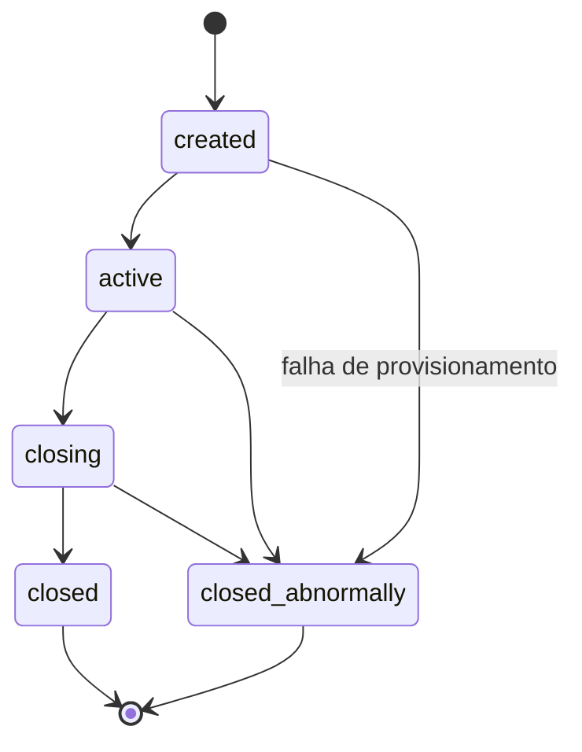
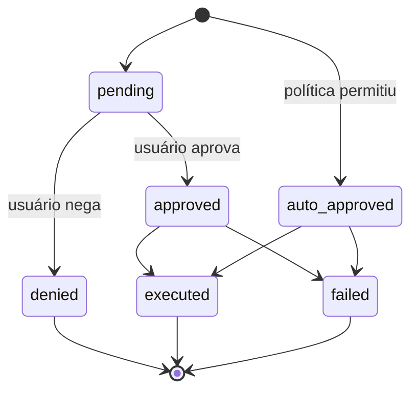
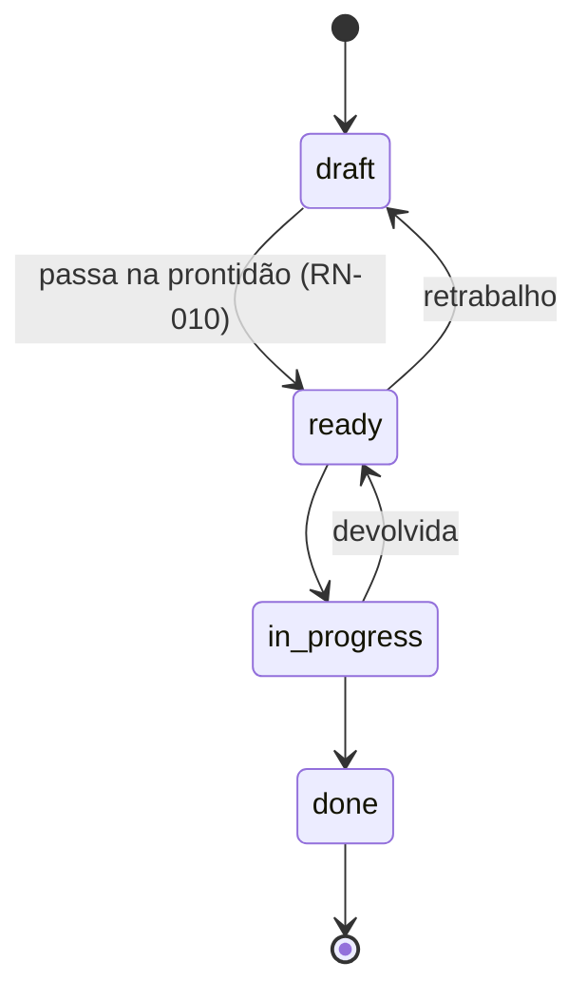
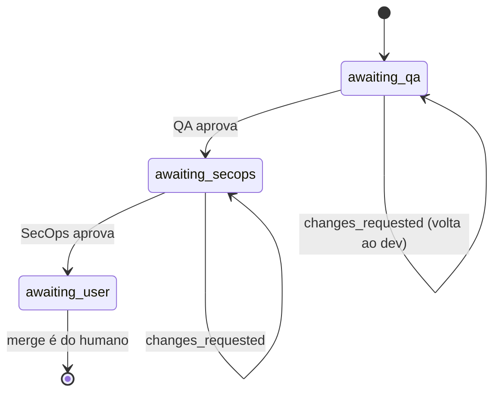

# Regras de negócio

Cada regra tem **enunciado**, **onde vive** (`arquivo:linha`) e **o teste que a
cobre**. Se você mudar uma regra, atualize a linha aqui na mesma mudança — é o
que o [`.docmap.yml`](https://github.com/daneiel/brabo/blob/dev/docs/.docmap.yml)
exige com severidade `block`.

Todas moram em `apps/api/src/domain/`, que é **puro**: sem IO, sem framework,
sem banco. É por isso que cada uma tem teste unitário rápido e determinístico.

## Contexto de negócio

O Brabo executa trabalho de engenharia através de agentes de IA. Duas forças
moldam praticamente toda regra aqui:

**O agente não é confiável por construção.** Ele é um modelo de linguagem: pode
alucinar, entrar em laço, ou pedir algo destrutivo. As regras existem para que
o dano possível seja limitado por estrutura, não por qualidade do prompt.

**O gasto é real e contínuo.** Cada turno consome token pago. Orçamento, teto e
metering não são recursos administrativos — são o que impede um laço de agente
de virar prejuízo.

### Atores

| ator | quem é | autoridade |
|---|---|---|
| **Usuário** | a pessoa. Papéis: `viewer`, `developer`, `maintainer`, `owner` | decisão final sobre toda ação com efeito externo; merge é exclusivamente dele |
| **Agente** | processo de longa duração com um papel (Criativo, PO, Arquiteto, Dev, Infra, QA, SecOps, Psicólogo, Anamnese) | propõe; nunca decide sozinho o que a política não permitir |
| **Sistema** | api e engine | aplica a política, registra o evento, mede o custo |

O vocabulário está no [glossário](glossary.md).

---

## Sessão

### RN-001 — A sessão tem cinco estados e transições fechadas {#rn-001}

`created → active → closing → closed`, com `closed_abnormally` alcançável de
qualquer estado não-terminal. **De `closing` nunca se volta para `active`**, e
estados terminais não têm saída.

- **Onde:** `apps/api/src/domain/sessions/session-state-machine.ts:29`
- **Teste:** `test/domain/sessions/session-state-machine.spec.ts`
- **Borda:** `closing` é estado de **passagem**. Sessão parada ali significa que
  o drain começou e não completou — há alerta para isso, ver o
  [runbook](runbook.md).

### RN-002 — Todo evento de sessão é imutável e a `seq` é densa {#rn-002}

Nunca há `UPDATE` em `session_events`. A `seq` é única por sessão
(`unique(session_id, seq)`) e não tem buraco: começa em 1 e é contínua.

- **Onde:** `apps/api/src/db/schema.ts` (tabela `session_events`)
- **Teste:** verificado no restore — `docker/backup/restore.sh` reprova se
  `count(*) ≠ max(seq) − min(seq) + 1` ou `min(seq) ≠ 1`
- **Por quê:** é o que torna a evidência do Psicólogo rastreável e o backup
  verificável. Estado que precisa mudar vive em tabela própria, ao lado.

---

## Aprovação de ações

O coração do sistema. Toda ação com efeito externo nasce como
`proposed_action`.

### RN-003 — A ação tem seis estados, e negada é terminal {#rn-003}

- **Onde:** `apps/api/src/domain/actions/action-state-machine.ts:36`
- **Teste:** `test/domain/actions/action-state-machine.spec.ts`
- **Borda:** uma ação aprovada que executou vira `executed`, **não** continua
  `approved`. Contar aprovações por `status = 'approved'` dá número errado — o
  critério correto é `decided_by IS NOT NULL`.

### RN-004 — A decisão avalia em três estágios, e `deny` vence na hora {#rn-004}

Ordem: **(a) IAM → (b) `agent_autonomy` → (c) `permissions.json`**. Cada estágio
só pode **subir** a permissividade; estágio silencioso nunca rebaixa o anterior.
`deny` em qualquer um retorna imediatamente.

- **Onde:** `apps/api/src/domain/actions/decide.ts:116`
- **Teste:** `test/domain/actions/decide.spec.ts` (10 KB — o maior do domínio)

### RN-005 — Papel mínimo por tipo de ação {#rn-005}

Antes de qualquer política, o IAM: cada `ActionType` exige um papel efetivo
mínimo. Sem ele, `deny` com motivo explícito.

- **Onde:** `apps/api/src/domain/actions/decide.ts:37` (`MIN_ROLE_FOR_ACTION_TYPE`)
- **Teste:** `test/domain/actions/decide.spec.ts`

### RN-006 — Teto: merge em branch protegida nunca é auto-aprovável {#rn-006}

`dev`, `qa`, `rc` e `main` são protegidas. Um `git_merge` com destino numa
delas é rebaixado de `auto_approve` para `require_approval` **depois** de toda
a política ter rodado. Nem `agent_autonomy` nem `permissions.json` conseguem
promovê-lo.

`rc` continua na lista mesmo depois de o degrau sair da política
([ADR 0030](adr/0030-politica-de-branches-mecanizada.md)) e de o bootstrap
parar de criá-la ([RN-029](#rn-029)). Esta lista decide o que a trava
**recusa**, e repositórios bootstrapados por versões anteriores ainda têm a
branch: proteger uma que não existe não custa nada; desproteger uma que existe
custa caro.

- **Onde:** `apps/api/src/domain/actions/decide.ts:149` + `protected-branches.ts:4`
- **Teste:** `test/domain/actions/decide.spec.ts`
- **Origem:** [ADR 0011](adr/0011-infra-dev-agents-worktrees-merge-lock.md) §1
- **Nota:** a proteção equivalente **na plataforma** (GitHub/GitLab) diverge
  entre providers e não é o portão — ver
  [ADR 0028](adr/0028-protecao-de-branch-divergencia-entre-providers.md).

### RN-007 — Teto: patch de instrução nunca é auto-aprovável {#rn-007}

Mudar a instrução de um agente exige decisão humana, sempre. O valor da
funcionalidade está no humano ver o diff; auto-aprovar seria o agente
reescrevendo a si mesmo.

- **Onde:** `apps/api/src/domain/actions/decide.ts:166`
- **Teste:** `test/domain/actions/decide.spec.ts`
- **Origem:** [ADR 0016](adr/0016-anamnese-proficiencia-patches-instrucao.md) §8

### RN-008 — Casamento de comando é por padrão, não por substring {#rn-008}

O `permissions.json` casa comando de terminal por padrão estruturado, com o
comando devidamente tokenizado — não por `includes()`.

- **Onde:** `apps/api/src/domain/actions/command-matcher.ts`
- **Teste:** `test/domain/actions/command-matcher.spec.ts`

---

## Backlog

### RN-009 — A história tem quatro estados, e `done` é terminal {#rn-009}

`draft → ready → in_progress → done`. Retrabalho é permitido: `ready → draft` e
`in_progress → ready`.

- **Onde:** `apps/api/src/domain/backlog/story-state-machine.ts:27`
- **Teste:** `test/domain/backlog/story-state-machine.spec.ts`

### RN-010 — `draft → ready` exige quatro coisas, validadas no domínio {#rn-010}

Para uma história virar `ready` ela precisa, **todas**:

1. `dod` não vazio — Definition of Done
2. `dor` não vazio — Definition of Ready
3. ao menos 1 requisito funcional (`rf`)
4. ao menos 1 regra de negócio vinculada (`businessRuleIds`)

O erro nomeia **exatamente o que falta**, não um "inválido" genérico.

- **Onde:** `apps/api/src/domain/backlog/story-readiness.ts:39`
- **Teste:** `test/domain/backlog/story-readiness.spec.ts`
- **Origem:** [ADR 0009](adr/0009-agente-po-backlog-rastreabilidade.md) §3
- **Por quê:** é o que impede o PO de despejar história vaga na fila do dev.

### RN-011 — Regra de negócio sem história é descoberta, não erro {#rn-011}

A cobertura regra→história é calculada e o que não tem história aparece como
**pendência** — informação, não falha.

- **Onde:** `apps/api/src/domain/backlog/coverage.ts`
- **Teste:** `test/domain/backlog/coverage.spec.ts`

### RN-012 — Módulo removido do `module_map` rebaixa a história {#rn-012}

História vinculada a módulo que deixou de existir volta para `draft`, com
evento `backlog.story_demoted`.

- **Onde:** `apps/api/src/domain/architecture/module-resolution.ts`; o evento é
  emitido em `application/use-cases/architecture/create-module-map.use-case.ts:73`
- **Teste:** `test/domain/architecture/module-resolution.spec.ts`

### RN-013 — O grafo de módulos não pode ter ciclo {#rn-013}

- **Onde:** `apps/api/src/domain/architecture/module-graph.ts`
- **Teste:** `test/domain/architecture/module-graph.spec.ts`

---

## Gates de PR

### RN-014 — A ordem dos gates é imutável e `awaiting_user` é terminal {#rn-014}

`awaiting_qa → awaiting_secops → awaiting_user`. Aprovar o QA **nunca** pula
direto para o usuário. `changes_requested` devolve para o dev **na mesma
branch**, sem PR nova.

- **Onde:** `apps/api/src/domain/execution/pr-gate-state-machine.ts:24`
- **Teste:** `test/domain/execution/pr-gate-state-machine.spec.ts`
- **Origem:** [ADR 0013](adr/0013-gates-qa-secops-pr.md) §1
- **Borda:** `awaiting_user` é terminal **de propósito** — o sistema nunca
  mergeia (RN-006).

### RN-015 — Ciclo K: o teto de correções é finito e herdado {#rn-015}

Cada devolução de gate consome uma volta. Esgotado o teto, a task é
**bloqueada** com motivo, em vez de girar para sempre. O subagente criado por
paralelização **herda** o teto do agente base.

Desde a Fase 8b o teto também vale para a ÁREA de QA, sem mudança de código:
o `QaLeadServer` é o único chamador de `record_gate_verdict`, então uma
rodada de gate — não importa quantas subespecialidades ele consultou por
baixo — ainda consome exatamente UMA volta. Ver
[RN-036](#rn-036).

- **Onde:** `DEFAULT_MAX_GATE_CORRECTIONS = 3` em
  `apps/api/src/application/use-cases/execution/record-gate-verdict.use-case.ts:21`;
  aplicado em `activate-execution.use-case.ts:85` e, no engine, em
  `qa_lead_server.ex:268` e `secops_agent_server.ex:142`
- **Teste:** `apps/engine/test/engine/gates/qa_automacao_agent_test.exs` (a
  subespecialidade devolve `{:blocked, ...}` sem chamar a api) e
  `qa_lead_server_test.exs` (o Lead NUNCA chama `record_gate_verdict` nesse
  caso — é o que impede a correção de ser queimada)
- **Origem:** [ADR 0017](adr/0017-lock-de-workspace-e-monitor-de-dev-agents.md) §4

### RN-016 — O parecer do gate prevalece sobre o enunciado da task {#rn-016}

Se a descrição da task mandar uma coisa e o parecer do gate apontar outra, o
parecer vence.

Desde a Fase 8b, "o parecer" pode vir de duas subespecialidades — a regra não
muda: cada uma prevalece sobre a task DENTRO do que avalia (Automação sobre
cobertura de teste; Performance/Segurança sobre RNF de performance e achado
de código). O `QaLead.consolidar/1` não arbitra entre elas e a task: qualquer
`changes_requested de qualquer uma` já reprova o todo (ver
[RN-036](#rn-036)).

- **Onde:** prompt de cada subespecialidade em
  `apps/engine/lib/engine/gates/qa_automacao_agent.ex` e
  `qa_performance_seguranca_agent.ex`
- **Origem:** [ADR 0020](adr/0020-destravar-gates-qa-secops.md) §9

### RN-036 — QA vira área: o Lead consolida sem mudar o contrato do gate {#rn-036}

A subespecialidade de Automação (o `QAAgent` da Fase 4a) sempre delega;
Performance/Segurança só quando a story tem RNF de performance pertinente
(`Engine.Gates.QaLead.rnf_de_performance?/1` — heurística por palavra-chave,
não NLP). A decisão de NÃO delegar é sempre registrada — uma delegação
`dispensed` com justificativa, nunca silêncio.

Consolidação: `approved` só se TODAS as delegações que rodaram tiverem
aprovado; qualquer `changes_requested` reprova o todo, com `itens` da(s)
subespecialidade(s) que pediu(ram) mudança, cada item prefixado com o rótulo
de quem o levantou (`"[QA de Automação] ..."`) — é assim que se rastreia a
origem SEM mudar `itens` de `string[]` pra outra forma. Falha de delegação
(qualquer origem — `infra`, `modelo`, `codigo`, `politica`) NUNCA vira
`changes_requested`: o Lead bloqueia a task com a origem real (RN-015).

O `qa_verdict` que chega à api é o MESMO artefato e passa pela MESMA rota de
sempre (`RecordGateVerdictUseCase`, `nextGateStatus`) — nenhum dos dois
mudou. O que a api aprende sobre a área fica só nos eventos
`delegation.completed`/`delegation.failed`/`delegation.dispensed`, que a
subespecialidade e o Lead gravam à parte.

- **Onde:** `apps/engine/lib/engine/gates/qa_lead.ex` (`consolidar/1`,
  `rnf_de_performance?/1`), `qa_lead_server.ex` (a fiação);
  `apps/api/src/application/use-cases/execution/record-delegation.use-case.ts`;
  `apps/api/src/db/schema.ts` (tabela `delegations`, enum `failure_origin`)
- **Teste:** `apps/engine/test/engine/gates/qa_lead_test.exs` (a árvore de
  decisão pura), `qa_lead_server_test.exs` (a fiação: decisão → delegação →
  registro → consolidação → a MESMA chamada de sempre), e — a prova de que o
  contrato não mudou — `record-gate-verdict.use-case.spec.ts`,
  `pr-gate-state-machine.spec.ts` e `record-infra-gate-verdict.use-case.spec.ts`
  passam **sem nenhuma alteração**
- **Origem:** [ADR 0038](adr/0038-hierarquia-de-agentes.md)

Do lado da `apps/web` (Fase 8d): o painel do time agrupa `qa`/
`qa-automacao`/`qa-performance-seguranca` como lead + subespecialidades
recolhíveis, a timeline de PR expande o parecer consolidado nos internos
(`ProjectApprovalsTab.tsx`, `PrGateTimeline.tsx`), e o feed narra
`delegation.*` — ver `apps/web/src/lib/agents.ts` (`AREAS`/`areaFor`).

---

### RN-054 — Handoff externo endereça lead de área ou agente sem área — nunca subagente {#rn-054}

Quem fala com uma área **de fora** fala com o lead. Um handoff endereçado a
subagente (`qa-automacao`, `qa-performance-seguranca`, `infra-workflows`) é
recusado com erro tipado que **nomeia o lead** a quem o chamador devia se
dirigir — recusar sem dizer o caminho certo só troca o furo de hierarquia por
um agente travado.

A recusa acontece **antes** do INSERT. Recusar depois deixaria um handoff
fantasma na tabela e um `handoff.offered` — evento imutável — afirmando uma
oferta que a política não permite.

Delegação interna (lead → subagente) **não** passa por aqui: é privada da área,
tem tabela própria (`delegations`) e caminho próprio
(`RecordDelegationUseCase`). A regra é sobre o contorno externo da área, não
sobre o que acontece dentro dela.

O ADR 0038 pediu esta validação nomeando o lugar — `CreateHandoffUseCase` é o
único do sistema que grava `toAgent` — e ela nunca tinha sido implementada
(achado #12 do primeiro dogfooding). A `offer_handoff` do engine repassa
`to_agent` como string livre, então até aqui nada impedia um agente de furar a
hierarquia.

**Área, lead e membros continuam hardcoded**, em três lugares (web, engine,
api): o aparato genérico do ADR 0038 (`agent_areas`/`agent_area_members`) é
corte de escopo registrado da Fase 8, e esta regra não o desfaz. O que a
impede de divergir em silêncio é teste, não tabela: a lista da api é comparada
com a do web, e acrescentar um subagente só de um lado reprova.

- **Onde:** `apps/api/src/domain/agents/agent-areas.ts`
  (`assertHandoffTargetAllowed`, `HandoffToSubagentError`),
  `apps/api/src/application/use-cases/agents/create-handoff.use-case.ts`
- **Teste:** `test/domain/agents/agent-areas.spec.ts` (a regra + a checagem de
  divergência contra o web),
  `test/application/use-cases/agents/create-handoff.use-case.spec.ts`
  (recusa sem linha e sem evento)
- **Origem:** [ADR 0038](adr/0038-hierarquia-de-agentes.md), fechado a partir
  do achado #12 do [primeiro dogfooding](explanation/primeiro-dogfooding.md)

---

### RN-037 — Infra vira área: Workflows gera CI conforme o provider, Lead consolida numa PR só {#rn-037}

Segunda instância do modelo do ADR 0038, depois da área de QA (RN-036) — com
uma diferença estrutural: as duas delegações da área de Infra SEMPRE rodam
(Dockerfiles/compose pelo próprio Lead — "delega pra si"; pipeline de CI pelo
subagente Workflows), nunca uma é dispensada. `Workflows` decide o formato do
pipeline pelo `gitProvider` do contexto (`GetInfraContextUseCase`, lido de
`project_repositories.provider` — **não** por `capabilities` do
`GitProvider`, que são as MESMAS pra GitHub e GitLab): `"gitlab"` gera
`.gitlab-ci.yml`; qualquer outro valor (`"github"`, `"local"`, ou
desconhecido) gera `.github/workflows/ci.yml`. Cada arquivo passa por
`validate_infra_file` antes de terminar — hadolint pra Dockerfile,
`actionlint` pra workflow do GitHub Actions ([ADR 0039](adr/0039-actionlint-e-validacao-do-pipeline-de-ci-gerado.md);
`.gitlab-ci.yml` fica sem validação local, gap documentado, não meia-solução).

Consolidação: os arquivos dos dois delegados se juntam por `path` (o do
Workflows vence em colisão) numa PR SÓ — o mecanismo de propor a PR
(`propose_infra_pr`) muda de "a tool chama a api direto" pra "a tool sinaliza
pro Lead, que consolida e chama uma vez" — o `open_infra_pr` que a api recebe
é o MESMO de sempre, byte a byte (`ExecuteInfraPrUseCase` intocado). Falha de
qualquer delegado (origem `infra`/`modelo`/`codigo`/`politica`) NUNCA abre PR
parcial — mesma regra do RN-036, um nível acima de novo.

Cada delegado (mesmo o Lead, sobre si mesmo) é rastreado como uma linha de
`delegations` — reaproveitada tal como o RN-036 deixou, com UMA correção: a
coluna `task_id` virou NULLABLE (a área de Infra delega sobre a SESSÃO, sem
task de backlog por trás de uma PR de infra), e a rota
`POST /internal/sessions/:sessionId/delegations` deixou de ser aninhada sob
`/tasks/:taskId` — `taskId` agora vai no corpo, opcional. Ciclo K e orçamento
não têm coluna própria na área de Infra (o InfraAgent original nunca teve
orçamento por task, e este trabalho não introduziu um).

- **Onde:** `apps/engine/lib/engine/infra/infra_lead.ex` (`consolidar/2`),
  `infra_lead_server.ex` (a fiação), `workflows_agent.ex`,
  `tools/validate_infra_file.ex` (dispatch por extensão),
  `apps/api/src/application/use-cases/execution/get-infra-context.use-case.ts`
  (`gitProvider`), `record-delegation.use-case.ts` (`taskId` opcional)
- **Teste:** `apps/engine/test/engine/infra/infra_lead_test.exs` (a mescla e
  o bloqueio, puros), `infra_lead_server_test.exs` (a fiação: PR única com
  os dois conjuntos de arquivo, duas delegações, `gitProvider: "gitlab"` →
  `.gitlab-ci.yml`, falha do Workflows → sem PR), `workflows_agent_test.exs`
  — e a prova de que o contrato de `ExecuteInfraPrUseCase`/`InfraGateRunner`
  não mudou: `execute-infra-pr.use-case.spec.ts` e
  `infra_gate_runner_test.exs` passam **sem nenhuma alteração**
- **Origem:** [ADR 0038](adr/0038-hierarquia-de-agentes.md), [ADR 0039](adr/0039-actionlint-e-validacao-do-pipeline-de-ci-gerado.md)

Do lado da `apps/web` (Fase 8d): o painel do time agrupa `infra`/
`infra-workflows` do mesmo jeito que QA (RN-036), e o feed narra as
delegações da área — mesmo registro `AREAS`/`areaFor` de
`apps/web/src/lib/agents.ts`, sem código específico de Infra na UI.

---

## Custo

### RN-017 — Orçamento tem escopo exclusivo: projeto **ou** sessão {#rn-017}

Um `budget` referencia um projeto ou uma sessão, nunca os dois — garantido por
`check` no banco, não só em código.

- **Onde:** `apps/api/src/db/schema.ts` (`budgets_scope_check`)
- **Teste:** a constraint é a garantia

### RN-018 — Notificação de orçamento em 70%, 90% e 100%, sem repetir {#rn-018}

Cada limiar dispara **uma vez**; o último notificado fica persistido em
`budgets.last_threshold_notified`.

- **Onde:** `apps/api/src/domain/llm/budget-threshold.ts:1`
- **Teste:** `test/domain/llm/budget-threshold.spec.ts`

### RN-019 — `policy = 'block'` recusa a chamada; `'allow'` só registra {#rn-019}

- **Onde:** `apps/api/src/domain/llm/budget-threshold.ts:4`
- **Borda:** projeto em `allow` **não para sozinho** no teto. É a causa mais
  comum de "o orçamento não segurou" — ver o [runbook](runbook.md).

### RN-020 — O modelo é resolvido em cascata, do mais específico ao mais geral {#rn-020}

`sessão > agente > projeto > workspace`. O primeiro que existir vence.

- **Onde:** `apps/api/src/domain/llm/binding-resolver.ts`
- **Teste:** `test/domain/llm/binding-resolver.spec.ts`

### RN-040 — Binding de agente exige tool calling nativo {#rn-040}

Vincular um modelo a um **agente** (`scope = 'agent'`) só é permitido se o
modelo tiver `supports_tool_calling`. Um agente só existe dentro do ToolLoop, e
o ToolLoop só funciona se o modelo souber **pedir** ferramentas; sem isso a
falha apareceria lá na frente como "o agente parou sem concluir", que é
exatamente o diagnóstico por eliminação que o [ADR 0020](adr/0020-destravar-gates-qa-secops.md)
proibiu. A recusa é 422 e a mensagem aponta o filtro **"aptos para agentes"** —
sem esse ponteiro a regra vira beco sem saída.

O `ToolCallRecovery` do engine recupera chamadas que o modelo escreveu em prosa,
mas é **resgate, não licença**: depende de o modelo acertar o formato por acaso.

Só `agent` valida. `workspace` e `project` são o fallback do chat humano e
`session` é conversa — nenhum roda ToolLoop, e travá-los proibiria modelo
chat-only no produto. O agente `context-manager` é coberto por construção: é um
slug **dentro** do escopo `agent`, não um escopo próprio.

- **Onde:** `apps/api/src/domain/llm/model-capabilities.ts:38`
- **Teste:** `test/domain/llm/model-capabilities.spec.ts`,
  `test/application/use-cases/llm/set-model-binding.use-case.spec.ts`
- **Origem:** [ADR 0041](adr/0041-base-openai-compativel-e-contrato-de-llm-providers.md)

### RN-041 — Contagem de token que o provider não deu é marcada como estimada {#rn-041}

Quando a resposta do provider não traz `usage`, a base OpenAI-compatível conta
localmente com o tokenizer e emite o chunk com `estimated: true`. O número
continua servindo para cobrar, mas a marca preserva a diferença entre **"o
provider disse zero"** e **"o provider não disse nada"** — e é ela que permite
à UI qualificar o custo em vez de exibir um valor sem procedência.

Os outros dois providers divergem, e a divergência é normalizada, não escondida:
o Ollama simplesmente não emite `usage` sem a linha `done`; o Anthropic não sabe
omitir contagem, porque `usage` é obrigatório no `message_start` do protocolo
dele. As três respostas estão em
[docs/reference/llm-providers.md](reference/llm-providers.md#divergências-normalizadas).

- **Onde:** `apps/api/src/infrastructure/llm/openai-compatible-provider.ts:150`
- **Teste:** `test/contract/llm-provider.contract.ts` (cenário `sem_usage`,
  rodado contra os três providers)
- **Origem:** [ADR 0041](adr/0041-base-openai-compativel-e-contrato-de-llm-providers.md)

### RN-042 — O metering registra quem SERVIU a chamada, não só por onde ela entrou {#rn-042}

Quando a chamada passa por um hub que informa o provedor real, `token_usage`
grava esse provedor em `upstream_provider` além do provider de entrada. Sem hub
— ou com hub que não informou — o campo fica **`null`**, nunca string vazia: a
consulta de custo por provedor precisa distinguir "não passou por hub" de
"passou e o hub não disse".

Nas métricas o rótulo `upstream_provider` repete o próprio provider quando não
há hub, para que `sum by (upstream_provider)` continue somando o custo inteiro.

- **Onde:** `apps/api/src/application/use-cases/llm/record-llm-usage.use-case.ts:58`
- **Teste:** `test/application/use-cases/llm/record-llm-usage.use-case.spec.ts`
- **Origem:** [ADR 0041](adr/0041-base-openai-compativel-e-contrato-de-llm-providers.md)

### RN-043 — Modelo descoberto entra desligado; modelo que some é marcado, nunca apagado {#rn-043}

O sync de catálogo tem três desfechos, e nenhum deles é destrutivo:

1. **Modelo novo** entra **sem linha de curadoria em workspace nenhum**, e
   ausência de linha É o desligado. Um catálogo de provider tem centenas de
   linhas — despejá-las ativas tornaria a escolha impossível e ligaria modelo
   caro sem ninguém decidir. Ativar é curadoria do owner, e vale só no
   workspace dele ([RN-052](#rn-052)).
2. **Modelo que sumiu do catálogo remoto** recebe `availability = 'unavailable'`
   e **permanece na tabela**: `model_bindings` e `token_usage` apontam para a
   linha, e apagá-la levaria junto o histórico de custo.
3. **Modelo que voltou** volta a `available` com a curadoria **intocada** — a
   escolha do owner sobrevive a uma ausência temporária do provider.

Os dois eixos são independentes de propósito: a curadoria é decisão de pessoa,
`availability` é observação do provider. Nenhum dos dois escreve no outro — e
desde o [ADR 0049](adr/0049-curadoria-de-modelo-por-workspace.md) eles nem
moram na mesma tabela, então o sync não tem campo de curadoria para atropelar
nem se quisesse.

Três consequências no resto do sistema:

- **binding NOVO** para modelo inativo ou indisponível é recusado no domínio
  (`ModelNotBindableError`, 422). Os bindings que já existem ficam de pé;
- **a cascata** de `resolveBinding` pula o candidato indisponível, registra o
  que pulou em `skipped`, e — quando o turno carrega ferramentas — revalida
  `supports_tool_calling` em TODO nível. Sem isso o fallback pousaria um agente
  num modelo chat-only e violaria a [RN-040](#rn-040) em silêncio;
- **provider que falhou não indisponibiliza nada**: um 401 é "não sei o que tem
  lá", não "não tem nada lá". O provider é pulado, com a ORIGEM da falha
  (`infra` | `modelo`) no relatório — nunca diagnóstico por eliminação.

- **Onde:** `apps/api/src/application/use-cases/llm/sync-model-catalog.use-case.ts:160`,
  `apps/api/src/domain/llm/binding-resolver.ts:63`,
  `apps/api/src/domain/llm/model-capabilities.ts:49`
- **Teste:** `test/application/use-cases/llm/sync-model-catalog.use-case.spec.ts`,
  `test/domain/llm/binding-resolver.spec.ts`,
  `test/application/use-cases/llm/set-model-binding.use-case.spec.ts`
- **Origem:** [ADR 0042](adr/0042-catalogo-vivo-ciclo-de-vida-do-modelo-e-preco-auditavel.md)

### RN-044 — Preço vale daqui em diante, e o custo antigo continua batendo {#rn-044}

Cada linha de `token_usage` grava o preço que produziu o `cost_micros` dela.
Trocar o preço de um modelo **não reprecifica consumo passado** — e mais que
isso: o custo antigo continua **reproduzível**, porque `tokens × preço gravado`
fecha com o custo gravado mesmo depois de três correções na tabela `models`.

Toda mudança de preço grava uma linha em `model_price_changes`, append-only,
com o par antes/depois e a origem (`manual` | `sync`). O par é gravado junto de
propósito: reconstruir o "antes" a partir da linha anterior dependeria de
nenhuma escrita ter escapado do caminho auditado, que é o que a auditoria
existe para provar. Preço igual ao vigente é no-op — uma linha "mudou de 10
para 10" transformaria o log em ruído.

A regra vale para **todo** caminho que troca preço, não só o da tela. Duas
escritas escapavam dela: o sync de catálogo (que trocava preço pelo `upsert`,
sem nunca produzir a origem `sync` que o domínio declarava desde a Fase 9c) e o
`seed.ts` (que roda sobre banco já semeado — `BRABO_FORCE_SEED=1` no
`bootstrap.sh` do k8s — e portanto corrigia preço em silêncio). Os dois passaram
a auditar, o seed reusando o próprio `UpdateModelPricingUseCase`.

- **Onde:** `apps/api/src/application/use-cases/llm/update-model-pricing.use-case.ts:44`,
  `apps/api/src/application/use-cases/llm/sync-model-catalog.use-case.ts:213`,
  `apps/api/src/db/seed.ts:376`
- **Teste:** `test/application/use-cases/llm/update-model-pricing.use-case.spec.ts`,
  `test/application/use-cases/llm/sync-model-catalog.use-case.spec.ts`
- **Origem:** [ADR 0042](adr/0042-catalogo-vivo-ciclo-de-vida-do-modelo-e-preco-auditavel.md)

### RN-045 — Repositório adotado só é alterado por plano aprovado {#rn-045}

Adotar um repositório existente **diagnostica sem agir**. A adoção valida o
acesso (`getRepo`), grava as linhas do projeto e produz um **plano**: a lista
serializada do que o bootstrap faria, obtida chamando o `check()` de cada passo
— o mesmo que dá idempotência desde a [RN-029](#rn-029) — sem nunca executar a
mutação correspondente.

Enquanto `repo_bootstraps.plan_decision` for **nulo**, nenhuma mutação roda. O
portão está **antes** do executor, não dentro dele: o runner do bootstrap é o
mesmo da Fase 2, sem filtro, e simplesmente não é chamado. Somado ao guard que
já pulava branch protegida, não existe caminho de código que proteja uma branch
fora de um plano aprovado.

As duas saídas:

- **aprovar** é tudo-ou-nada (aprovar passos soltos quebraria a cascata
  `dev←main, qa←dev`). O que executa é o plano **re-derivado** no
  momento da execução: igual ou menor que o exibido, **nunca maior** — uma
  branch que tenha virado protegida nesse meio-tempo é pulada;
- **adotar como está** dispensa o bootstrap, registra a decisão e **não
  adultera o cursor** para fingir convergência. O plano fica guardado como
  evidência do que deliberadamente não foi aplicado.

Decidir sobre um plano regerado é recusado (409): a decisão carrega o
`planGeneratedAt` que o usuário viu, e um "sim" dado sobre outra coisa não vale.

O provisionamento normal recusa (409) rodar num repositório adotado — sem essa
guarda, o caminho de retomada rodaria o bootstrap num repositório de terceiro
sem plano nenhum.

**Limite conhecido:** "proteção divergente" aqui é presença × ausência, porque
é só isso que o contrato expõe (`GitBranch.protected` é booleano, e o
[ADR 0028](adr/0028-protecao-de-branch-divergencia-entre-providers.md) adiou um
`ProtectionPolicy` normalizado). Uma branch com proteção PARCIAL conta como
"sem proteção" e pode ser sobrescrita — mas só dentro de um plano aprovado.

- **Onde:** `apps/api/src/application/use-cases/git/decide-bootstrap-plan.use-case.ts`,
  `apps/api/src/application/use-cases/git/bootstrap-plan.ts`,
  `apps/api/src/application/use-cases/git/bootstrap-steps.ts:112`
- **Teste:** `test/application/use-cases/git/decide-bootstrap-plan.use-case.spec.ts`,
  `test/application/use-cases/git/bootstrap-plan.spec.ts`
- **Origem:** [ADR 0044](adr/0044-adocao-de-repositorio-existente.md)

### RN-046 — Todo repositório de projeto declara sua origem {#rn-046}

`project_repositories.origin` e `repo_bootstraps.origin` dizem se o Brabo
**criou** o repositório (`created`) ou **adotou** um que já existia (`adopted`).
A origem é gravada explicitamente por quem escreve — não pelo default da coluna
— e não muda depois.

Ela não é decoração: é o que faz o produto tratar como caso legítimo o que a
Fase 10 precisou fazer à mão (inserir linhas em `project_repositories` e
`repo_bootstraps` para apontar um projeto a um fork). Um repositório `adopted`
tem política de branches própria, não passa pelo provisionamento, e só é
alterado conforme a [RN-045](#rn-045).

O backfill da migração `0031` marca tudo que existia como `created`, e pode ser
cego: adoção não existia antes dela, então não há linha adotada para
classificar errado.

- **Onde:** `apps/api/src/db/schema.ts`, `apps/api/src/db/migrations/0031_special_winter_soldier.sql`,
  `apps/api/src/domain/git/repo-bootstrap.entity.ts`
- **Teste:** `test/application/use-cases/git/adopt-repository.use-case.spec.ts`
- **Origem:** [ADR 0044](adr/0044-adocao-de-repositorio-existente.md)

### RN-047 — Circuit breaker do dev agent: N blocked seguidas param, sem gastar orçamento em loop {#rn-047}

Cada dev agent mantém um contador (`dev_agent_states.consecutive_blocked`)
de quantas tasks TERMINARAM `blocked` em sequência — local (no ToolLoop) ou
remotamente (teto de correções do gate estourado). Ao bater o teto por
projeto (`max_consecutive_blocked`, default 3), o agente para em
`idle_tripped` **sem tentar reivindicar a próxima task**. Um desfecho
terminal aprovado zera o contador; uma task blocked individual continua o
fluxo normal (devolvida com diagnóstico, disponível pra um humano
desbloquear) — o breaker é sobre a SEQUÊNCIA, não sobre a task.

A única saída de `idle_tripped` é o rearm explícito
(`POST .../agents/:agentId/rearm`, role `developer`): zera o contador e o
agente volta a tentar reivindicar. Não existe destrave automático — o
mesmo princípio de `MarkTaskBlockedUseCase`/`unblock`, aplicado à
sequência em vez de à task. Rearmar um agente que **não** está travado é
**409**, não sucesso silencioso: o evento `dev.rearmed` é imutável, e
gravá-lo para um rearm que não aconteceu seria mentira no event log.

Um bloqueio que vem de FORA do agente (o `QaLeadServer` falhando
internamente, por exemplo) também precisa acordá-lo — por isso a emissão
de `task.gate_resolved` fica em `MarkTaskBlockedUseCase`, o funil por
onde TODOS os bloqueios passam, e não no `RecordGateVerdictUseCase`, que
só vê parte deles. Sem isso o agente ficava em `awaiting_gate` para
sempre, com a task morta e o contador do breaker sem incrementar.

Reiniciar o engine com um agente em `working` **não** conta pro contador:
a task retida é bloqueada com diagnóstico do restart, mas esse bloqueio
não é o agente "queimando o teto" — é a infraestrutura caindo. O
contador só sobe quando o próprio ciclo dev↔gate produz um `blocked` de
verdade.

- **Onde:** `apps/engine/lib/engine/dev/dev_agent_server.ex` (`finish_task/2`,
  `resume_state/2`), `apps/api/src/application/use-cases/execution/rearm-dev-agent.use-case.ts`,
  `apps/api/src/db/schema.ts` (`projects.max_consecutive_blocked`)
- **Teste:** `apps/engine/test/engine/dev/dev_agent_server_test.exs`
  (describe `circuit breaker`), `apps/engine/test/engine/dev/dev_rehydrator_test.exs`
  (describe `os quatro estados reidratados`), `test/application/use-cases/execution/rearm-dev-agent.use-case.spec.ts`
- **Origem:** [ADR 0045](adr/0045-reagendamento-por-evento-do-dev-agent.md)

### RN-053 — Reativar a execução acorda quem está parado, dentro da sessão que já existe {#rn-053}

Ativar a execução de um projeto que **já está executando** é reativação, não
começo: cai na sessão de execução vigente e acorda os agentes que estavam
parados. Duas partes, uma de cada lado do sistema.

**A sessão é reusada.** A ativação usa a sessão `active` do projeto que já
carrega um `execution.activated`; só cria uma quando não há nenhuma. Não existe
coluna dizendo "esta sessão é de execução" — o que distingue uma é o evento que
ela guarda, e é por ele que se pergunta. Fechar a sessão continua sendo o jeito
de recomeçar do zero: a fechada não é candidata, e a próxima ativação abre uma
nova.

Antes o `create` era incondicional, e o engine **descarta** o `session_id` novo
quando o agente já está vivo. Cada clique em "ativar" deixava para trás uma
sessão ativa que recebia o `execution.activated` e mais nada — os eventos dos
agentes continuavam indo para a sessão da ativação anterior.

**O agente é acordado por wake, não por `work`.** Start fresco dispara o ciclo
(`:work` — emite `dev.started` e reivindica). Agente que já estava vivo recebe
`{:wake, :became_claimable}`, e quem decide é o guard de estado do server:

| estado do agente | o que a reativação faz |
|---|---|
| `idle` | reivindica a próxima task |
| `working`, `awaiting_gate`, `awaiting_approval` | nada — a task em curso não é abandonada |
| `idle_tripped` | nada — só o rearm explícito destrava ([RN-047](#rn-047)) |

Disparar `:work` para todos seria pior que o defeito: ele reivindica
incondicionalmente, e sobre um agente `awaiting_gate` significaria largar o
worktree que o gate está varrendo — além de contornar o circuit breaker com um
clique.

- **Onde:** `apps/api/src/application/use-cases/execution/activate-execution.use-case.ts`,
  `apps/api/src/infrastructure/persistence/drizzle/session.repository.ts`
  (`findActiveExecutionSession`),
  `apps/engine/lib/engine_web/controllers/execution_command_controller.ex`
  (`acordar/4`)
- **Teste:** `test/application/use-cases/execution/activate-execution.use-case.spec.ts`
  (describe `reativação não abre sessão órfã`),
  `test/infrastructure/persistence/session-execution.repository.spec.ts`,
  `apps/engine/test/engine_web/controllers/execution_command_controller_test.exs`
  (describe `reativação`)
- **Origem:** achado #11 do
  [primeiro dogfooding](explanation/primeiro-dogfooding.md)

### RN-048 — Promoção de história é do usuário por default; o modo muda quem dispara, nunca o que é validado {#rn-048}

`projects.story_promotion` escolhe QUEM promove uma história de `draft` para
`ready`:

- **`manual`** (default de projeto novo): o PO deixa a história completa e ela
  fica `draft` com `stories.proposed_ready = true`. **Nenhuma tarefa dela é
  pegável** — `claimNext` exige `story.status = 'ready'` —, e é o usuário que
  promove, individualmente ou em lote, pelo Backlog.
- **`auto`**: o PO promove sozinho ao terminar uma história completa. É o
  comportamento anterior à Fase 12c, preservado como opção explícita.

**O modo muda o gatilho, não o critério.** Os dois caminhos passam por
`assertPromotable` — prontidão (RF/DoD/DoR/regra) e módulos resolvidos contra o
`module_map` vigente —, e é isso que o teste de simetria em
`story-promotion.spec.ts` fixa: para toda história, `isPromotable` concorda com
o que `assertPromotable` levanta. Antes da fase a validação estava duplicada e
assimétrica (a criação chamava `canBecomeReady`, a transição chamava
`assertReady` + `assertModulesResolved`): duas portas para o mesmo estado, com
fechaduras diferentes. Tornar o gatilho configurável exigia unificá-las
primeiro, senão "promover pela UI" e "promover na criação" seriam regras
distintas com o mesmo nome.

Uma história **incompleta nunca é proposta**. `proposed_ready` só liga quando a
história já passaria na validação — propor o que o domínio recusaria empurraria
o trabalho do PO para o usuário sob o disfarce de uma decisão.

A **recusa** devolve a história ao PO: grava `returned_reason`/`returned_at`,
desliga `proposed_ready`, emite `backlog.story_promotion_returned` e injeta o
motivo como mensagem FIXADA na sessão do PO, com a mesma frase de precedência
da devolução de um gate ao dev (lição do ADR 0020). A recusa é gravada **antes**
de falar com o engine, e o engine falhando não a desfaz — é o inverso da ordem
do rearm da [RN-047](#rn-047), e por um motivo: lá o evento afirma algo SOBRE o
engine, aqui afirma algo sobre o usuário, que é verdade tenha ou não um PO de pé
para ouvir.

Promover **em lote não é all-or-nothing**: cada história é sua própria
transação, e uma que perdeu a prontidão entre a proposta e a decisão volta em
`failed` com o motivo, sem derrubar as outras que o usuário acabou de revisar.

O evento `backlog.story_transitioned` grava o **ator real** — `user` na promoção
manual, `agent/po` na automática. O event log é imutável e é o que a auditoria
lê: registrar o PO numa decisão do usuário apagaria exatamente o passo humano
que a regra existe para devolver.

A migração `0033` faz um backfill **dirigido**, não cego: a coluna nasce
`manual` e todos os projetos que já existiam são movidos para `auto`. O default
novo vale para quem vier depois; um projeto em andamento não pode parar de
produzir por causa de um deploy.

- **Onde:** `apps/api/src/domain/backlog/story-promotion.ts`,
  `apps/api/src/db/migrations/0033_absurd_domino.sql`,
  `apps/api/src/application/use-cases/backlog/promote-stories.use-case.ts`,
  `apps/api/src/application/use-cases/backlog/return-story.use-case.ts`,
  `apps/engine/lib/engine/agents/po_server.ex` (`revision_message/1`)
- **Teste:** `test/domain/backlog/story-promotion.spec.ts` (simetria),
  `test/db/story-promotion-migration.spec.ts` (backfill dirigido),
  `test/application/use-cases/backlog/promote-stories.use-case.spec.ts`,
  `test/application/use-cases/backlog/return-story.use-case.spec.ts`,
  `apps/engine/test/engine/agents/po_server_test.exs` (describe `revise/2`)
- **Origem:** [ADR 0046](adr/0046-promocao-de-story-com-autoridade-do-usuario.md)

### RN-049 — Toda decisão sobre uma ação proposta fica no event log, com quem decidiu {#rn-049}

`proposed_action.created`, `.approved` e `.denied` são eventos de domínio em
`session_events`, além das linhas de outbox que os transportam ao engine. O
outbox **não** é memória: é drenado, marcado com `processed_at` e podado.

O `actor` é quem realmente decidiu — o **usuário** em `.approved`/`.denied`, o
**agente** que propôs em `.created`. E `created.payload.status` diz como a ação
nasceu (`pending`, `auto_approved`, `denied`).

Disso sai a distinção que dá a métrica: **decisão humana = evento
`proposed_action.approved`**; política decidindo sozinha aparece só no
`.created` com `status: auto_approved` e ator agente, e nunca é confundida com
um clique. Era exatamente essa contagem — "cliques de aprovação" — que a Fase
10 quis medir e não conseguiu, porque a decisão não existia em lugar nenhum
consultável (achado #17). `approve_always` conta como aprovação porque delega
ao mesmo use-case, e emite `permission.granted` por cima.

Fica de fora, por decisão: o `proposed_action.created` que o bootstrap de
repositório emite direto no outbox. Aquelas mutações já são narradas por
`bootstrap.step_*` na mesma sessão, e duplicá-las contaria o mesmo fato duas
vezes numa métrica de aprovação.

- **Onde:** `apps/api/src/application/use-cases/actions/propose-action.use-case.ts`,
  `.../approve-action.use-case.ts`, `.../deny-action.use-case.ts`
- **Teste:** `test/application/use-cases/actions/approve-deny-action.use-case.spec.ts`
  (describe `a decisão no event log`)
- **Origem:** [ADR 0048](adr/0048-decisao-no-log-e-a-ordem-do-gate.md)

### RN-050 — Sem PR aberta não se abre gate {#rn-050}

O dev agent propõe commit, push e PR e **lê o desfecho de cada uma**. Só abre o
gate se as três executaram. Se alguma ficou `pending` — autonomia do agente em
`require_approval` —, ele entra em `awaiting_approval`, **retendo o worktree**,
e não abre gate nenhum.

Sem isso o gate abria de qualquer jeito, e o estrago era silencioso: o QA varre
o **worktree**, não a PR; encontrava os arquivos, aprovava; o SecOps aprovava; a
task fechava como concluída — **sem uma linha commitada e sem PR nenhuma**. Só
depois, ao aprovar o commit, o usuário via a ação falhar (com diagnóstico
vazio, porque `System.cmd` num diretório apagado devolve `{"", 2}`).

Quem solta o agente é `task.pr_settled`, emitido pela api quando o `pr_open`
tem desfecho terminal: `opened: true` abre o gate; `opened: false` (negado ou
falho) devolve a task com diagnóstico, em vez de deixar o agente esperando para
sempre por um gate que ninguém vai abrir.

Uma PR negada **não conta para o circuit breaker** da [RN-047](#rn-047): a
decisão foi do usuário, não o agente queimando o teto — mesmo princípio da
recuperação de restart.

Esta regra também elimina o D5 (worktree reciclado sob aprovação pendente) por
consequência: o worktree só é liberado em `gate_resolved`, o gate só abre depois
da PR, e a PR só abre depois de commit e push.

- **Onde:** `apps/engine/lib/engine/dev/agent_io.ex` (`propose/3`),
  `apps/engine/lib/engine/dev/dev_agent_server.ex` (`abrir_gate/1`,
  `aguardar_aprovacao/2`),
  `apps/api/src/application/use-cases/actions/execute-git-action.use-case.ts`
  (`settlePrOpen`)
- **Teste:** `apps/engine/test/engine/dev/dev_agent_server_test.exs`
  (describe `aprovação pendente não abre gate`)
- **Origem:** [ADR 0048](adr/0048-decisao-no-log-e-a-ordem-do-gate.md)

### RN-051 — Preço digitado à mão vence o catálogo do provider {#rn-051}

Linha de `models` com `manual_pricing = true` tem um número que alguém digitou
lendo a doc do provider. O sync de catálogo **não encosta nele** — nem quando o
catálogo remoto traz preço próprio. É o que o schema sempre disse ("quem
sincroniza preço NÃO pode sobrescrever uma linha marcada aqui sem decisão
explícita") e o que o código não fazia: o remoto vencia sempre que trouxesse
preço, e o sync seguinte desfazia a correção de quem tinha arrumado um número
errado.

A regra existe porque para vários providers o número digitado é o **único que
existe**: NVIDIA NIM e Bitdeer não publicam preço por token em doc alguma
([referência de providers](reference/llm-providers.md)), e o valor semeado é
aproximação de mercado. Deixar o catálogo remoto sobrescrever isso trocaria uma
aproximação conhecida por outra, sem ninguém decidir.

Modelo NOVO nasce com a marca vinda do catálogo, não de um default fixo:
descoberto **com** preço, `manual_pricing = false` (a origem é o sync, e é ele
quem mantém a linha em dia); descoberto **sem** preço, `true` — a linha está
esperando alguém digitar, e marcá-la já protege esse número do primeiro
catálogo que resolver informar preço.

- **Onde:** `apps/api/src/application/use-cases/llm/sync-model-catalog.use-case.ts`
  (`resolverPreco`), `apps/api/src/db/schema.ts:507`
- **Teste:** `test/application/use-cases/llm/sync-model-catalog.use-case.spec.ts`
  (`preço digitado à mão vence o catálogo que INFORMA preço`)
- **Origem:** [ADR 0042](adr/0042-catalogo-vivo-ciclo-de-vida-do-modelo-e-preco-auditavel.md)

### RN-052 — Curadoria de modelo vale só no workspace que decidiu {#rn-052}

Ligar ou desligar um modelo no seletor é decisão **daquele workspace**, e não
alcança o vizinho. O catálogo em si continua global — nome, preço, janela e
capabilities são fato do provider, iguais para todo mundo, e duplicá-los por
workspace criaria N verdades sobre o mesmo modelo além de partir
`token_usage.model_id` ao meio.

Antes disso `models.is_active` era uma coluna para a instalação inteira: quem
clicasse "ativar" decidia por todos os workspaces, e a tela não dava sinal
nenhum disso. O efeito prático era um workspace ligar um modelo caro no seletor
do outro — e o gasto aparecer no orçamento de quem não decidiu nada.

Três regras derivadas:

1. **Ausência de linha é o desligado.** Não existe estado "nunca decidido"
   separado; modelo que o sync descobriu não tem linha e não aparece no seletor
   ([RN-043](#rn-043)).
2. **Desligar é `UPDATE`, não `DELETE`.** Apagar a linha apagaria junto quem
   decidiu e quando. A leitura trata os dois casos como inativo; o registro
   existe para quem for auditar.
3. **Escopos `agent` e `session` não verificam curadoria.** Os dois não têm
   âncora de workspace — binding de agente é por slug global. A verificação
   recebe `null` e checa só a disponibilidade, deixando a lacuna explícita em
   vez de chutar um workspace.

- **Onde:** `apps/api/src/db/schema.ts` (`workspace_models`),
  `apps/api/src/application/use-cases/llm/set-models-active.use-case.ts`,
  `apps/api/src/application/use-cases/llm/set-model-binding.use-case.ts`
  (`workspaceDoEscopo`)
- **Teste:** `test/application/use-cases/llm/set-models-active.use-case.spec.ts`
  (`ativar num workspace NÃO liga o modelo no vizinho`)
- **Origem:** [ADR 0049](adr/0049-curadoria-de-modelo-por-workspace.md)

### RN-060 — O gasto das chaves é do owner, e só ele vê {#rn-060}

O relatório de consumo por credencial (`GET /workspaces/:id/credential-spend`)
exige **`owner`** no workspace. Não é `maintainer`: desde a
[RN-058](#rn-058) os agentes de todos os projetos gastam a credencial do dono,
e a fatura dele não é assunto de quem só opera um projeto.

O relatório agrupa por **provider**, porque é essa a unidade da credencial —
uma chave por provider, por pessoa. Um total único não bateria com fatura
nenhuma.

E separa **agente** de **pessoa**: as duas coisas saem da mesma chave desde a
RN-058, e "meus agentes estão caros?" é uma pergunta diferente de "eu uso muito
o chat?". Por isso este é o único agregado de custo do produto **sem** o filtro
`actor_kind = 'agent'` da [RN-038](#rn-038) — aqui a pergunta é quanto saiu da
chave, e o chat do próprio owner sai dela.

Gasto de credencial **já removida** continua no relatório, marcado: o consumo
aconteceu, e escondê-lo daria um total que não fecha com o extrato do provider.

Nenhum segredo atravessa: a resposta tem provider, tokens e custo — nunca a
chave, nem cifrada ([ADR 0050](adr/0050-credencial-sempre-cifrada-verificacao-explicita.md)).

- **Onde:**
  `apps/api/src/application/use-cases/llm/get-credential-spend.use-case.ts`,
  `apps/api/src/interfaces/http/llm/budgets.controller.ts`,
  `apps/web/src/components/CredentialSpendSection.tsx`
- **Teste:** `test/application/use-cases/llm/get-credential-spend.use-case.spec.ts`
  (agrupa por provider; separa agente de pessoa; chave removida fica marcada);
  `apps/web/src/components/CredentialSpendSection.test.tsx`
- **Origem:** decisão do usuário junto com a RN-058

### RN-059 — Falha de turno é evento durável com origem, e o agente fala {#rn-059}

Quando um turno de LLM falha, o agente grava **`agent.error`** no event log
com três campos: `origem` (vocabulário do ADR 0020), `mensagem` em português e
o `reason` bruto. E a mensagem aparece **no fio da conversa**, não só no log.

Era o contrário, e o desfecho era o pior possível: os quatro agentes
conversacionais gravavam `agent.response` com conteúdo **vazio** —
indistinguível de sucesso no log imutável — e mandavam o motivo por
`broadcast`, que é efêmero. Quem não estivesse com a aba aberta naquele
segundo nunca saberia que houve erro; quem estivesse, via um balão em branco.

Havia um segundo caminho, pior ainda: quando a api narrava a falha no PRÓPRIO
frame final (budget, credencial ausente, binding faltando), o turno não caía no
ramo de erro e **não emitia evento nenhum** — silêncio absoluto.

A origem NUNCA é adivinhada: cada padrão em `FalhaDeTurno.origem/1` tem um
motivo escrito, e o que não casa com nenhum sai como **`indeterminada`**, que é
mais honesto que chutar uma das quatro (ADR 0020).

Os eventos já gravados não se apagam — a tela os NOMEIA como resposta vazia
anterior a esta regra, em vez de mostrar branco.

- **Onde:** `apps/engine/lib/engine/agents/falha_de_turno.ex`,
  `criativo_server.ex`, `po_server.ex`, `arquiteto_server.ex`,
  `infra_lead_server.ex` (`emit_falha/2`),
  `apps/web/src/lib/session-falha.ts`
- **Teste:** `apps/engine/test/engine/agents/criativo_server_test.exs`
  (evento durável com origem; nunca grava resposta vazia; erro narrado no frame
  final também vira evento); `apps/web/src/lib/session-falha.test.ts`
- **Origem:** execução real da FASE 13b

### RN-058 — A chave que o AGENTE gasta é a do owner do workspace {#rn-058}

Credencial de LLM pertence a uma pessoa (`user_credentials.user_id`), e agente
não é pessoa. O turno de agente resolve a chave pelo **owner do workspace**
(`workspaces.created_by`), não por quem abriu a sessão nem por quem criou o
projeto: quem banca a conta banca os agentes, e isso não muda quando outra
pessoa da equipe começa a sessão.

`created_by` e não `workspace_members.role = 'owner'`: pode haver vários
owners, e "qualquer um deles" faria a chave usada variar sem ninguém decidir.

Antes disto o turno passava o **slug do agente** (`agentId ?? sessionId`) na
coluna de usuário. A consulta ia ao banco com `user_id = 'criativo'`, o
Postgres recusava o UUID inválido, e o erro virava **resposta vazia** no fio —
sem métrica, sem evento de falha, sem nada na tela. O efeito prático, que só
uma execução real revelou: **nenhum agente jamais usou um provider com
credencial**. Só `ollama` funcionava, porque para ele a busca é pulada — e foi
com modelo local que a Fase 4, o dogfooding da Fase 10 e todas as demos
rodaram.

O chat humano nunca teve o defeito: ele usa `actor.id`, que é o usuário de
verdade.

- **Onde:**
  `apps/api/src/application/use-cases/llm/resolve-credential-owner.use-case.ts`,
  `apps/api/src/application/use-cases/llm/stream-llm-turn.use-case.ts`,
  `apps/api/src/application/use-cases/llm/run-llm-turn.use-case.ts`
- **Teste:** `test/application/use-cases/llm/resolve-credential-owner.use-case.spec.ts`
  (o owner vence quem criou o projeto; a chave encontrada é a dele; projeto
  inexistente é 404 e não erro de banco)
- **Origem:** execução real da FASE 13b

### RN-056 — Faceta de capability vem do provider; silêncio preserva o que estava {#rn-056}

`supports_vision`, `supports_reasoning` e `generates_image` são **fato do
provider**, não opinião: saem do catálogo remoto no sync, com o mesmo fallback
de `supports_tool_calling` — remoto, depois local, depois `false`.

No OpenRouter (o único que publica isso hoje) as três saem de:
`architecture.input_modalities` contém `image`,
`supported_parameters` contém `reasoning`, e
`architecture.output_modalities` contém `image`. Aceitar imagem e **produzir**
imagem são eixos distintos: fundi-los mandaria o usuário para o modelo errado.

Antes, o sync lia `supportsVision` do que já estava GRAVADO e nunca consultava
o remoto — a coluna nascia `false` e não havia caminho para virar verdadeira.
Os 338 modelos do primeiro sync real ficaram todos `false`, incluindo 181 que o
provider declara como multimodais.

**Ausência de declaração não é declaração de ausência**
([ADR 0041](adr/0041-base-openai-compativel-e-contrato-de-llm-providers.md)): o
parser OMITE o campo quando o provider se cala, e `undefined` preserva o valor
local. Por isso a tela usa as facetas só como filtro POSITIVO e nunca escreve
"não lê imagem" — `false` aqui quer dizer "o provider não declarou".

- **Onde:** `apps/api/src/infrastructure/llm/openrouter-provider.ts`
  (`temModalidade`, `parseCatalogoOpenRouter`),
  `apps/api/src/application/use-cases/llm/sync-model-catalog.use-case.ts`,
  `apps/api/src/db/schema.ts` (`models`)
- **Teste:**
  `test/infrastructure/llm/openrouter-provider.contract.spec.ts`
  (`modalidade não declarada OMITE o campo em vez de afirmar false`);
  `test/application/use-cases/llm/sync-model-catalog.use-case.spec.ts`
  (`catálogo que se cala sobre modalidade preserva a faceta gravada`)
- **Origem:** [ADR 0051](adr/0051-facetas-de-capability-e-curadoria-por-uso.md)

### RN-057 — "Para que serve" é curadoria do workspace, e marcar uso não liga o modelo {#rn-057}

Nenhum catálogo de provider publica "bom para código". Isso é **opinião de quem
opera**, descoberta usando — então mora em `workspace_models.uses`, ao lado da
outra decisão do workspace ([RN-052](#rn-052)), e não em `models`.

Vocabulário FECHADO — `codigo`, `documentacao`, `analise`, `imagem`,
`conversa` —, com prova de exaustividade em tempo de compilação nos dois lados.
Texto livre daria `code`, `coding` e `código` no mesmo filtro em uma semana.

Duas regras que mantêm os eixos separados:

1. **Marcar uso não liga o modelo.** `workspace_models.is_active` tem DEFAULT
   `true`, então a linha criada por uma marcação de uso é inserida com
   `is_active = false` explícito. Sem isso, opinar sobre um modelo o autorizaria
   a gastar, contra a [RN-043](#rn-043).
2. **Trocar o uso não desliga o que estava ligado.** `is_active` fica fora do
   `SET` do `ON CONFLICT`.

A lista de usos **substitui** a anterior, não soma: lista vazia é como se
desmarca tudo, e é um estado legítimo — "ninguém opinou" não é "não serve".

- **Onde:** `apps/api/src/domain/llm/model-uses.ts`,
  `apps/api/src/db/schema.ts` (`workspace_models.uses`),
  `apps/api/src/infrastructure/persistence/drizzle/workspace-model.repository.ts`
  (`setUses`),
  `apps/api/src/application/use-cases/llm/set-model-uses.use-case.ts`
- **Teste:** `test/application/use-cases/llm/set-model-uses.use-case.spec.ts`
  (`marcar uso NÃO liga o modelo — a linha nova nasce inativa`,
  `trocar o uso não desliga o que já estava ligado`,
  `o uso vale só neste workspace`)
- **Origem:** [ADR 0051](adr/0051-facetas-de-capability-e-curadoria-por-uso.md)

### RN-038 — Agente contado no resumo do workspace = gastou tokens este mês {#rn-038}

O resumo do dashboard de projetos ("N projetos ativos · M agentes · gasto
este mês") conta como "agente" quem tem pelo menos uma linha em
`token_usage` com `actor_kind = 'agent'` no mês corrente, somando todos os
projetos do workspace. Sem o filtro de `actor_kind`, um `user` mandando
chat ou um `system` registrando uso inflaria a contagem — `token_usage`
grava para qualquer tipo de ator, não só agente. O corte por mês usa
`created_at >= date_trunc('month', now())`; um agente que trabalhou só no
mês anterior não conta, mesmo que ainda apareça no roster de alguma
sessão. A contagem naturalmente inclui as subespecialidades de área da
Fase 8 (`qa-automacao`, `qa-performance-seguranca`, `infra-workflows`):
cada uma tem seu próprio `actor_id` quando gasta tokens.

- **Onde:** `apps/api/src/infrastructure/persistence/drizzle/token-usage.repository.ts`
  (`summarizeForWorkspaceThisMonth`)
- **Teste:** `test/application/use-cases/iam/get-workspace-summary.use-case.spec.ts`

---

## Painel de projetos

### RN-039 — Dot de status do projeto: risco sempre vence inatividade {#rn-039}

A sidebar do dashboard mostra um dot de saúde por projeto, derivado de três
sinais independentes: orçamento (mesmos limiares 70%/90% do RN-018), task
bloqueada (`tasks.blocked`) e atividade recente (7 dias). Cores: verde =
saudável e ativo; âmbar = orçamento ≥70%; vermelho = orçamento ≥90% **ou**
task bloqueada; cinza = sem atividade nos últimos 7 dias. Quando um sinal
de risco (âmbar/vermelho) e o de inatividade (cinza) se aplicam ao mesmo
tempo, o de risco vence — um projeto estourado e parado ainda é algo a
olhar, não algo a esconder atrás de "sem atividade".

- **Onde:** `apps/web/src/lib/project-status.ts` (`deriveProjectStatus`)
- **Teste:** `apps/web/src/lib/project-status.test.ts`
- **Origem:** fidelidade do dashboard de projetos ao design aprovado

---

## Psicólogo e Anamnese

### RN-021 — Hipótese sem evidência válida não é gravada {#rn-021}

Os `evidenceEventIds` precisam apontar para eventos **que existem e pertencem à
sessão analisada**. A validação é atômica por lote: um id inválido reprova o
lote inteiro.

- **Onde:** `apps/api/src/domain/psychologist/hypothesis-evidence.ts`
- **Teste:** `test/domain/psychologist/hypothesis-evidence.spec.ts`
- **Origem:** [ADR 0015](adr/0015-psicologo-real-toolloop-hipoteses-evidencia.md) §3

### RN-022 — O ciclo de vida da hipótese é compare-and-swap {#rn-022}

`proposed → accepted | dismissed`. Duas decisões concorrentes sobre a mesma
hipótese: uma vence, a outra recebe conflito — não 500, não silêncio.

- **Onde:** `apps/api/src/domain/psychologist/hypothesis-lifecycle.ts`
- **Teste:** `test/domain/psychologist/hypothesis-lifecycle.spec.ts`
- **Origem:** [ADR 0022](adr/0022-fechamento-4b-psicologo.md) §7

### RN-023 — A causa de término é classificação determinística {#rn-023}

Vem do **motivo** registrado, nunca de julgamento do LLM e nunca por
eliminação. Toda falha registra a origem: `infra | modelo | código | política`.

- **Onde:** `apps/engine/lib/engine/psychologist/termination_classifier.ex`
- **Origem:** [ADR 0022](adr/0022-fechamento-4b-psicologo.md) §5 e
  [ADR 0020](adr/0020-destravar-gates-qa-secops.md) §6

### RN-024 — A Anamnese só perfila competência do catálogo — guarda-corpo estrutural {#rn-024}

Competências de processo são **seis**, fechadas: `git`, `agile`, `arquitetura`,
`testes`, `seguranca`, `infra`. Mais as stacks técnicas derivadas do
`module_map`. Qualquer outra coisa — "ansiedade", "saúde mental" — **não tem
caminho de escrita**: é erro no domínio, não instrução de prompt.

- **Onde:** `apps/api/src/domain/anamnese/competency-catalog.ts:16`
- **Teste:** `test/domain/anamnese/competency-catalog.spec.ts`
- **Origem:** [ADR 0016](adr/0016-anamnese-proficiencia-patches-instrucao.md) §1
- **Por quê:** a Anamnese perfila **competência técnica**, não pessoa. O limite
  é estrutural porque uma instrução de prompt não é garantia.

### RN-025 — Apagar o perfil apaga de verdade, e o opt-out impede a re-derivação {#rn-025}

- **Onde:** `apps/api/src/domain/anamnese/proficiency-profile.entity.ts` +
  tabela `anamnese_opt_outs`
- **Origem:** [ADR 0016](adr/0016-anamnese-proficiencia-patches-instrucao.md) §2

### RN-026 — Patch de instrução negado não é reproposto {#rn-026}

A comparação é sobre o conteúdo **normalizado**, não sobre o texto literal:
reindentar o mesmo patch não o transforma em proposta nova. Não há tabela de
dedup — a fonte é o próprio histórico de `proposed_action` com `actionType =
instruction_patch` e `status = denied`.

- **Onde:** `apps/api/src/domain/instructions/patch-dedup.ts:22`
- **Teste:** `test/domain/instructions/patch-dedup.spec.ts`

### RN-027 — Rollback de instrução é operação **para frente** {#rn-027}

Reverter cria uma versão nova com o conteúdo antigo; não apaga histórico. A
tabela de versões é append-only.

- **Onde:** `apps/api/src/domain/instructions/`
- **Origem:** [ADR 0016](adr/0016-anamnese-proficiencia-patches-instrucao.md) §4

---

## Git

### RN-028 — Capability decide, não o nome do provider {#rn-028}

Operação não suportada (proteção de branch no provider local) é declarada em
`capabilities` e rejeitada com `GitNotSupportedError` — nunca falha silenciosa.

- **Onde:** `packages/shared/src/index.ts` (`GitProviderCapabilities`)
- **Teste:** suite de contrato única, `test/contract/git-provider.contract.ts`,
  rodada contra os três providers
- **Origem:** [ADR 0001](adr/0001-git-provider-contract-shape.md)

### RN-029 — O bootstrap de Gitflow é idempotente e retomável {#rn-029}

Cinco passos; cada um verifica antes de agir e pode ser retomado do ponto que
falhou. `skip` é sucesso, não erro.

Eram seis. O sexto criava a branch `rc`, degrau que o
[ADR 0030](adr/0030-politica-de-branches-mecanizada.md) removeu da política —
o bootstrap continuou criando, protegendo e **documentando no repositório do
usuário** uma escada que o produto já tinha abandonado (achado #3 do primeiro
dogfooding). O valor `create_rc_branch` continua no enum `bootstrap_step`:
linhas antigas o referenciam, e passo que aconteceu de verdade não se apaga do
histórico.

- **Onde:** `apps/api/src/application/use-cases/git/bootstrap-steps.ts` +
  `domain/git/repo-bootstrap.entity.ts` (`RETIRED_BOOTSTRAP_STEPS`)
- **Teste:** `test/domain/git/repo-bootstrap-status.spec.ts`
- **Origem:** [ADR 0005](adr/0005-repo-bootstrap-idempotent-steps.md)

---

## Credenciais

Chave de LLM e token de git do usuário vivem na mesma tabela
(`user_credentials`), sob o mesmo envelope encryption. Esta seção vale para as
duas.

### RN-055 — Credencial é sempre cifrada e gravada; verificar é ação à parte, com três respostas {#rn-055}

O cadastro **não julga a credencial**: cifra e grava, mesmo que o provider
fosse recusá-la. Verificar é uma ação explícita sobre a credencial **já
gravada** — a api decifra, chama o provider e devolve só o veredito. O texto
plano nunca volta em resposta nenhuma, nem em pedaço, nem no motivo da recusa.

Era o contrário: o cadastro testava antes de persistir e recusava a gravação
([ADR 0004](adr/0004-git-credential-registration.md), estendido às chaves de
LLM na Fase 11a). O modo de falha real foi o oposto do previsto — como o campo
é write-only e a tela nunca reexibe o que foi digitado, uma recusa deixava o
usuário **sem credencial e sem o texto para corrigir**.

O veredito tem **três** valores, e o terceiro é obrigatório:

| | quando |
|---|---|
| `ok` | o provider aceitou |
| `recusado` | o provider rejeitou — carrega o motivo **dele** |
| `nao_suportado` | não há endpoint de teste verificado (`ollama`, `anthropic`, `openai`) |

Sem `nao_suportado`, um provider cujo tester é NO-OP voltaria `ok` e a tela
afirmaria uma verificação que nunca aconteceu. É a regra de capability do
[ADR 0041](adr/0041-base-openai-compativel-e-contrato-de-llm-providers.md)
aplicada aqui: só se declara o que foi provado. Por isso o port declara
`supports()` — o silêncio de `test()` sozinho é ambíguo.

Chave ruim **não é exceção HTTP**: o caso de uso captura
`LLMCredentialConnectionTestFailedError`/`GitCredentialConnectionTestFailedError`
e devolve resultado, com 200. A única exceção é não existir credencial para
(usuário, provider) — 404, porque aí não há o que testar.

- **Onde:**
  `apps/api/src/application/use-cases/credentials/test-stored-credential.use-case.ts`,
  `apps/api/src/application/use-cases/llm/upsert-user-credential.use-case.ts`,
  `apps/api/src/application/use-cases/git/register-git-credential.use-case.ts`,
  `apps/api/src/application/ports/llm-credential-connection-tester.port.ts`
  (`supports`)
- **Teste:**
  `test/application/use-cases/credentials/test-stored-credential.use-case.spec.ts`
  (os três resultados, o despacho git×LLM, o 404 e a ausência do segredo na
  resposta); `test/application/use-cases/llm/upsert-user-credential.use-case.spec.ts`
  e `test/application/use-cases/git/register-git-credential.use-case.spec.ts`
  (a gravação incondicional, que é a inversão)
- **Origem:** [ADR 0050](adr/0050-credencial-sempre-cifrada-verificacao-explicita.md)

---

## Autenticação

Regras do auth first-party. Todas valem no domínio da api, que desde a 7.2 é
também o **emissor** dos tokens de acesso — o Keycloak saiu num corte atômico,
sem período de coexistência.
Decisões em [ADR 0031](adr/0031-auth-first-party-argon2id-e-rotacao-de-refresh.md)
e [ADR 0032](adr/0032-corte-do-keycloak-e-sessao-em-cookie.md).

### RN-030 — Reapresentar um refresh já usado revoga a família inteira {#rn-030}

Cada refresh consome o token apresentado e emite um filho com o **mesmo**
`family_id` e o mesmo `family_started_at`. Apresentar um token que já foi
consumido é a assinatura de um roubo — alguém está usando uma cópia — e a
resposta é revogar todos os tokens vivos daquela família, com evento de
segurança.

O usuário legítimo é deslogado junto. Isso é o comportamento correto, não um
defeito: do lado do servidor, um duplo-submit do cliente e um replay de ladrão
são idênticos.

- **Onde:** `apps/api/src/domain/auth/refresh-token.ts:50` +
  `application/use-cases/auth/refresh.use-case.ts:98`
- **Teste:** `test/application/use-cases/auth/rotacao-e-reuso.spec.ts`
- **Borda:** quem apresenta um token de família **já revogada** é vítima a
  jusante, não novo roubo: registra `refresh_revoked` e **não** dispara segunda
  cascata. Sem essa distinção, cada aba do usuário legítimo geraria um alarme
  falso durante o incidente.
- **Origem:** [ADR 0031](adr/0031-auth-first-party-argon2id-e-rotacao-de-refresh.md)

### RN-031 — Falha de login é contada por e-mail e por IP, e o bloqueio escala {#rn-031}

Janela deslizante de 15 minutos no Postgres, sem Redis. Dois baldes por
tentativa e o mais restritivo vence: e-mail (5 falhas → 30s, 8 → 5min, 12 →
15min) e IP (20 → 30s, 30 → 2min). Um login bem-sucedido limpa o balde do
e-mail; o de IP drena só por tempo.

A chave do balde é o **e-mail normalizado**, nunca o id do usuário. Com id, o
balde só existiria depois de encontrar a conta, e o próprio lockout viraria
oráculo de existência.

- **Onde:** `apps/api/src/domain/auth/lockout-policy.ts:97` +
  `infrastructure/persistence/drizzle/drizzle-login-throttle.ts:74`
- **Teste:** `test/application/use-cases/auth/lockout.spec.ts`
- **Borda:** enquanto bloqueado, a tentativa **não** é registrada. Se fosse, um
  atacante manteria a conta da vítima travada para sempre só continuando a
  tentar — o lockout viraria negação de serviço contra quem ele protege.
- **Por quê:** o balde de IP não pode ser limpo no sucesso; quem tem uma conta
  válida zeraria a janela à vontade e pulverizaria palpites sem limite.
- **Origem:** [ADR 0031](adr/0031-auth-first-party-argon2id-e-rotacao-de-refresh.md)

### RN-032 — Nenhuma resposta distingue conta existente de inexistente {#rn-032}

Qualquer resposta diferente da falha uniforme só é alcançável **depois** de uma
verificação de senha bem-sucedida. No login, e-mail inexistente, senha errada e
conta bloqueada devolvem o mesmo 401 e gastam o mesmo tempo — o ramo sem conta
verifica contra um hash dummy gerado com **os mesmos parâmetros** do real. No
registro e no pedido de reset, endereço conhecido e desconhecido devolvem 202.

- **Onde:** `apps/api/src/application/use-cases/auth/login.use-case.ts:79` +
  `register.use-case.ts:74`
- **Teste:** `test/application/use-cases/auth/enumeracao.spec.ts`
- **Borda:** a checagem de bloqueio por e-mail roda **depois** do argon2, não
  antes. Sair mais cedo é a otimização que qualquer revisor sugeriria, e é
  exatamente o vazamento — o teste fica vermelho se alguém a introduzir.
- **Borda:** o usuário MIGRADO do Keycloak (existe em `users`, sem linha em
  `auth_credentials`) também recebe o 401 uniforme — e o link de "definir
  senha" é disparado em silêncio. Responder `password_pending` confirmaria que
  o endereço existe **e** que é conta legada. Por isso `findByEmail` é um LEFT
  JOIN numa consulta só: duas consultas encadeadas fariam esse ramo pagar uma
  ida a mais ao banco, e o relógio revelaria o que o corpo esconde.
- **Por quê:** o que se afirma é "nenhum ramo pula o trabalho caro e nenhum
  produz resposta distinguível", **não** tempo constante. Ver as consequências
  no ADR.
- **Origem:** [ADR 0031](adr/0031-auth-first-party-argon2id-e-rotacao-de-refresh.md),
  borda do migrado em
  [ADR 0032](adr/0032-corte-do-keycloak-e-sessao-em-cookie.md)

### RN-033 — Token de verificação e de reset vale uma vez só {#rn-033}

Consumo por UPDATE condicional com `returning`: o próprio UPDATE é a guarda.
Zero linhas cobre inexistente, de outro propósito, já consumido, invalidado e
expirado — todos com a mesma resposta. Pedir um link novo invalida o anterior.
Concluir um reset revoga **todas** as sessões do usuário e não emite tokens.

- **Onde:** `apps/api/src/infrastructure/persistence/drizzle/account-token.repository.ts:76`
- **Teste:** `test/application/use-cases/auth/tokens-de-conta.spec.ts`
- **Borda:** dois envios simultâneos não passam os dois. A corrida é o caso
  **normal**, não a exceção: scanner de e-mail corporativo abre todo link de
  toda mensagem, então o robô costuma consumir o token antes do humano clicar.
- **Por quê:** o reset não emite sessão de propósito — logar direto a partir de
  um link recebido por e-mail faria comprometer o e-mail equivaler a tomar a
  conta, sem segundo passo.
- **Origem:** [ADR 0031](adr/0031-auth-first-party-argon2id-e-rotacao-de-refresh.md)

### RN-034 — A sessão da web vive em cookie httpOnly, com CSRF {#rn-034}

O refresh token vai num cookie `brabo_refresh` (`httpOnly`, `SameSite=Strict`,
`Path=/auth`, `Secure` em produção) e **não** aparece no corpo de nenhuma
resposta. O access token, de 15 minutos, fica em memória no cliente e viaja no
`Authorization: Bearer`.

`/auth/refresh` e `/auth/logout` exigem `X-CSRF-Token` igual ao cookie
`brabo_csrf`, comparado em tempo constante.

- **Onde:** `apps/api/src/interfaces/http/auth/session-cookies.ts:53` +
  `interfaces/http/auth/auth.controller.ts`
- **Teste:** `test/interfaces/session-cookies.spec.ts`
- **Borda:** falha de CSRF é **403**, não 401. Com 401 o cliente tentaria
  renovar a sessão e entraria em laço — a credencial está boa, quem está errada
  é a requisição.
- **Por quê:** devolver o refresh também no corpo anularia o `httpOnly` —
  bastaria um XSS ler a resposta do login, e levaria a sessão longa em vez dos
  15 minutos do access.
- **Origem:** [ADR 0032](adr/0032-corte-do-keycloak-e-sessao-em-cookie.md)

### RN-035 — O tráfego interno engine ↔ api exige o segredo de serviço {#rn-035}

As 26 rotas `/internal/*` são `@ServiceRoute()`: ficam fora do JWT de usuário e
fora do rate limit. Quem autentica é o `EngineServiceGuard`, comparando
`X-Brabo-Service-Token` com `BRABO_SERVICE_TOKEN` em tempo constante. O mesmo
segredo vale nos dois sentidos, e `BRABO_SERVICE_TOKEN_PREVIOUS` é aceito só na
verificação, para a rotação não ter janela de indisponibilidade.

- **Onde:** `apps/api/src/interfaces/http/auth/engine-service.guard.ts:44` +
  `infrastructure/security/service-token.ts` +
  `apps/engine/lib/engine_web/plugs/verify_service_token.ex`
- **Teste:** `apps/engine/test/engine_web/plugs/verify_service_token_test.exs`
  e `test/interfaces/route-surface.spec.ts`
- **Borda:** a isenção de rate limit vem do METADADO da rota, não do guard. O
  `RateLimitGuard` é `APP_GUARD` e roda antes de qualquer guard de controller —
  quando ele decide, o `EngineServiceGuard` ainda não rodou.
- **Origem:** [ADR 0032](adr/0032-corte-do-keycloak-e-sessao-em-cookie.md)

---

## Quando dá errado

| situação | o que o sistema faz |
|---|---|
| Transição de estado inválida | erro tipado (`InvalidSessionTransitionError` etc.), traduzido para 4xx — nunca grava estado inconsistente |
| Agente estoura o teto de iterações ou tokens | encerra e registra artefato de bloqueio com a origem da falha |
| Task esgota o ciclo K | bloqueada com motivo, não gira para sempre (RN-015) |
| Provider de LLM cai no meio | registrado como falha de **infra**, nunca "o modelo parou" (RN-023) |
| Duas decisões concorrentes na mesma hipótese | conflito explícito (RN-022) |
| Réplica do engine cai | sessão é adotada por outra ou encerra como `closed_abnormally / node_shutdown` — nunca fica órfã |
| Rate limit indisponível | a requisição **passa**: o guard protege contra abuso, não contra acesso indevido |
| Credencial errada, conta inexistente ou conta bloqueada | **a mesma** resposta 401, com o mesmo custo de argon2 (RN-032) |
| Refresh já usado reapresentado | família revogada e evento de segurança; o usuário legítimo também é deslogado (RN-030) |
| Tráfego interno sem o segredo de serviço | 403 na api, 401 no engine — nunca alcança o controller (RN-035) |
| Provider recusa a chave durante o sync de catálogo | provider **pulado** com a origem da falha; nenhum modelo é marcado como sumido (RN-041) |
| Modelo do binding some do provider | a cascata cai para o nível de baixo e AVISA qual escopo pulou — nunca troca o modelo em silêncio (RN-041) |
| Preço do modelo muda | vale daqui em diante; o custo gravado e o preço que o produziu ficam intocados (RN-042) |

> **TODO(humano):** as RNs acima foram extraídas do código e dos testes. Falta
> confirmar se existe regra de negócio **não implementada** que deveria estar
> aqui — algo combinado e ainda não codificado não aparece nesta varredura.
