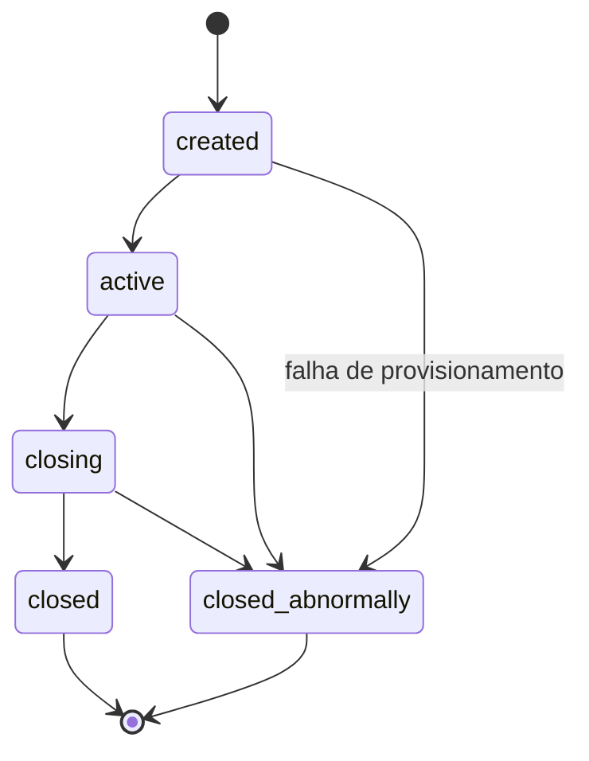
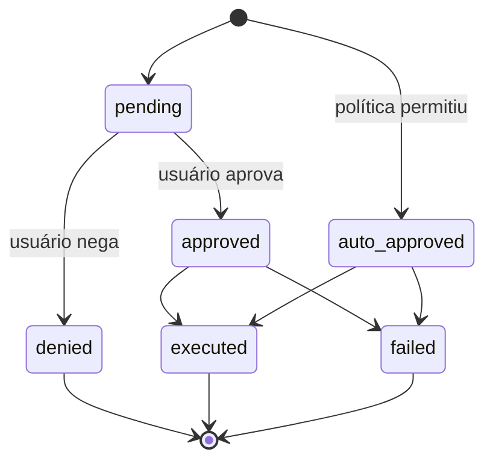
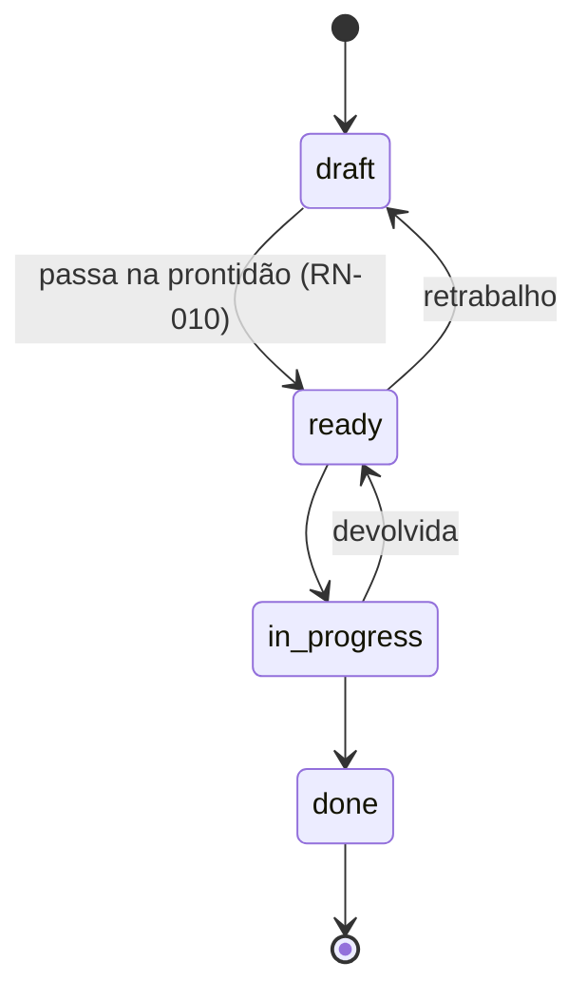
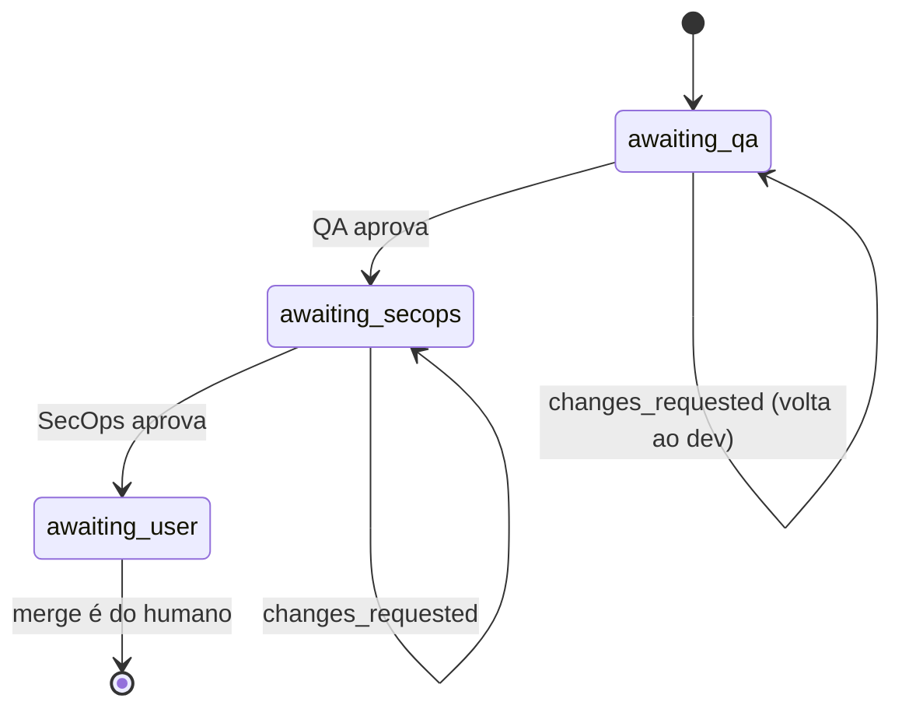

# Regras de negócio

Cada regra tem **enunciado**, **onde vive** (`arquivo:linha`) e **o teste que a
cobre**. Se você mudar uma regra, atualize a linha aqui na mesma mudança — é o
que o [`.docmap.yml`](https://github.com/daneiel/brabo/blob/dev/docs/.docmap.yml)
exige com severidade `block`.

Todas moram em `apps/api/src/domain/`, que é **puro**: sem IO, sem framework,
sem banco. É por isso que cada uma tem teste unitário rápido e determinístico.

## Contexto de negócio

O Brabo executa trabalho de engenharia através de agentes de IA. Duas forças
moldam praticamente toda regra aqui:

**O agente não é confiável por construção.** Ele é um modelo de linguagem: pode
alucinar, entrar em laço, ou pedir algo destrutivo. As regras existem para que
o dano possível seja limitado por estrutura, não por qualidade do prompt.

**O gasto é real e contínuo.** Cada turno consome token pago. Orçamento, teto e
metering não são recursos administrativos — são o que impede um laço de agente
de virar prejuízo.

### Atores

| ator | quem é | autoridade |
|---|---|---|
| **Usuário** | a pessoa. Papéis: `viewer`, `developer`, `maintainer`, `owner` | decisão final sobre toda ação com efeito externo; merge é exclusivamente dele |
| **Agente** | processo de longa duração com um papel (Criativo, PO, Arquiteto, Dev, Infra, QA, SecOps, Psicólogo, Anamnese) | propõe; nunca decide sozinho o que a política não permitir |
| **Sistema** | api e engine | aplica a política, registra o evento, mede o custo |

O vocabulário está no [glossário](glossary.md).

---

## Sessão

### RN-001 — A sessão tem cinco estados e transições fechadas {#rn-001}

`created → active → closing → closed`, com `closed_abnormally` alcançável de
qualquer estado não-terminal. **De `closing` nunca se volta para `active`**, e
estados terminais não têm saída.

- **Onde:** `apps/api/src/domain/sessions/session-state-machine.ts:29`
- **Teste:** `test/domain/sessions/session-state-machine.spec.ts`
- **Borda:** `closing` é estado de **passagem**. Sessão parada ali significa que
  o drain começou e não completou — há alerta para isso, ver o
  [runbook](runbook.md).

### RN-002 — Todo evento de sessão é imutável e a `seq` é densa {#rn-002}

Nunca há `UPDATE` em `session_events`. A `seq` é única por sessão
(`unique(session_id, seq)`) e não tem buraco: começa em 1 e é contínua.

- **Onde:** `apps/api/src/db/schema.ts` (tabela `session_events`)
- **Teste:** verificado no restore — `docker/backup/restore.sh` reprova se
  `count(*) ≠ max(seq) − min(seq) + 1` ou `min(seq) ≠ 1`
- **Por quê:** é o que torna a evidência do Psicólogo rastreável e o backup
  verificável. Estado que precisa mudar vive em tabela própria, ao lado.

---

## Aprovação de ações

O coração do sistema. Toda ação com efeito externo nasce como
`proposed_action`.

### RN-003 — A ação tem seis estados, e negada é terminal {#rn-003}

- **Onde:** `apps/api/src/domain/actions/action-state-machine.ts:36`
- **Teste:** `test/domain/actions/action-state-machine.spec.ts`
- **Borda:** uma ação aprovada que executou vira `executed`, **não** continua
  `approved`. Contar aprovações por `status = 'approved'` dá número errado — o
  critério correto é `decided_by IS NOT NULL`.

### RN-004 — A decisão avalia em três estágios, e `deny` vence na hora {#rn-004}

Ordem: **(a) IAM → (b) `agent_autonomy` → (c) `permissions.json`**. Cada estágio
só pode **subir** a permissividade; estágio silencioso nunca rebaixa o anterior.
`deny` em qualquer um retorna imediatamente.

- **Onde:** `apps/api/src/domain/actions/decide.ts:116`
- **Teste:** `test/domain/actions/decide.spec.ts` (10 KB — o maior do domínio)

### RN-005 — Papel mínimo por tipo de ação {#rn-005}

Antes de qualquer política, o IAM: cada `ActionType` exige um papel efetivo
mínimo. Sem ele, `deny` com motivo explícito.

- **Onde:** `apps/api/src/domain/actions/decide.ts:37` (`MIN_ROLE_FOR_ACTION_TYPE`)
- **Teste:** `test/domain/actions/decide.spec.ts`

### RN-006 — Teto: merge em branch protegida nunca é auto-aprovável {#rn-006}

`dev`, `qa`, `rc` e `main` são protegidas. Um `git_merge` com destino numa
delas é rebaixado de `auto_approve` para `require_approval` **depois** de toda
a política ter rodado. Nem `agent_autonomy` nem `permissions.json` conseguem
promovê-lo.

- **Onde:** `apps/api/src/domain/actions/decide.ts:149` + `protected-branches.ts:4`
- **Teste:** `test/domain/actions/decide.spec.ts`
- **Origem:** [ADR 0011](adr/0011-infra-dev-agents-worktrees-merge-lock.md) §1
- **Nota:** a proteção equivalente **na plataforma** (GitHub/GitLab) diverge
  entre providers e não é o portão — ver
  [ADR 0028](adr/0028-protecao-de-branch-divergencia-entre-providers.md).

### RN-007 — Teto: patch de instrução nunca é auto-aprovável {#rn-007}

Mudar a instrução de um agente exige decisão humana, sempre. O valor da
funcionalidade está no humano ver o diff; auto-aprovar seria o agente
reescrevendo a si mesmo.

- **Onde:** `apps/api/src/domain/actions/decide.ts:166`
- **Teste:** `test/domain/actions/decide.spec.ts`
- **Origem:** [ADR 0016](adr/0016-anamnese-proficiencia-patches-instrucao.md) §8

### RN-008 — Casamento de comando é por padrão, não por substring {#rn-008}

O `permissions.json` casa comando de terminal por padrão estruturado, com o
comando devidamente tokenizado — não por `includes()`.

- **Onde:** `apps/api/src/domain/actions/command-matcher.ts`
- **Teste:** `test/domain/actions/command-matcher.spec.ts`

---

## Backlog

### RN-009 — A história tem quatro estados, e `done` é terminal {#rn-009}

`draft → ready → in_progress → done`. Retrabalho é permitido: `ready → draft` e
`in_progress → ready`.

- **Onde:** `apps/api/src/domain/backlog/story-state-machine.ts:27`
- **Teste:** `test/domain/backlog/story-state-machine.spec.ts`

### RN-010 — `draft → ready` exige quatro coisas, validadas no domínio {#rn-010}

Para uma história virar `ready` ela precisa, **todas**:

1. `dod` não vazio — Definition of Done
2. `dor` não vazio — Definition of Ready
3. ao menos 1 requisito funcional (`rf`)
4. ao menos 1 regra de negócio vinculada (`businessRuleIds`)

O erro nomeia **exatamente o que falta**, não um "inválido" genérico.

- **Onde:** `apps/api/src/domain/backlog/story-readiness.ts:39`
- **Teste:** `test/domain/backlog/story-readiness.spec.ts`
- **Origem:** [ADR 0009](adr/0009-agente-po-backlog-rastreabilidade.md) §3
- **Por quê:** é o que impede o PO de despejar história vaga na fila do dev.

### RN-011 — Regra de negócio sem história é descoberta, não erro {#rn-011}

A cobertura regra→história é calculada e o que não tem história aparece como
**pendência** — informação, não falha.

- **Onde:** `apps/api/src/domain/backlog/coverage.ts`
- **Teste:** `test/domain/backlog/coverage.spec.ts`

### RN-012 — Módulo removido do `module_map` rebaixa a história {#rn-012}

História vinculada a módulo que deixou de existir volta para `draft`, com
evento `backlog.story_demoted`.

- **Onde:** `apps/api/src/domain/architecture/module-resolution.ts`; o evento é
  emitido em `application/use-cases/architecture/create-module-map.use-case.ts:73`
- **Teste:** `test/domain/architecture/module-resolution.spec.ts`

### RN-013 — O grafo de módulos não pode ter ciclo {#rn-013}

- **Onde:** `apps/api/src/domain/architecture/module-graph.ts`
- **Teste:** `test/domain/architecture/module-graph.spec.ts`

---

## Gates de PR

### RN-014 — A ordem dos gates é imutável e `awaiting_user` é terminal {#rn-014}

`awaiting_qa → awaiting_secops → awaiting_user`. Aprovar o QA **nunca** pula
direto para o usuário. `changes_requested` devolve para o dev **na mesma
branch**, sem PR nova.

- **Onde:** `apps/api/src/domain/execution/pr-gate-state-machine.ts:24`
- **Teste:** `test/domain/execution/pr-gate-state-machine.spec.ts`
- **Origem:** [ADR 0013](adr/0013-gates-qa-secops-pr.md) §1
- **Borda:** `awaiting_user` é terminal **de propósito** — o sistema nunca
  mergeia (RN-006).

### RN-015 — Ciclo K: o teto de correções é finito e herdado {#rn-015}

Cada devolução de gate consome uma volta. Esgotado o teto, a task é
**bloqueada** com motivo, em vez de girar para sempre. O subagente criado por
paralelização **herda** o teto do agente base.

- **Onde:** `DEFAULT_MAX_GATE_CORRECTIONS = 3` em
  `apps/api/src/application/use-cases/execution/record-gate-verdict.use-case.ts:21`;
  aplicado em `activate-execution.use-case.ts:85` e, no engine, em
  `qa_agent_server.ex:209` e `secops_agent_server.ex:132`
- **Teste:** `apps/engine/test/engine/gates/qa_agent_server_test.exs` (cobre o
  bloqueio **sem queimar correção**)
- **Origem:** [ADR 0017](adr/0017-lock-de-workspace-e-monitor-de-dev-agents.md) §4

### RN-016 — O parecer do gate prevalece sobre o enunciado da task {#rn-016}

Se a descrição da task mandar uma coisa e o parecer do gate apontar outra, o
parecer vence.

- **Onde:** prompt do gate em `apps/engine/lib/engine/gates/qa_agent_server.ex`
- **Origem:** [ADR 0020](adr/0020-destravar-gates-qa-secops.md) §9

---

## Custo

### RN-017 — Orçamento tem escopo exclusivo: projeto **ou** sessão {#rn-017}

Um `budget` referencia um projeto ou uma sessão, nunca os dois — garantido por
`check` no banco, não só em código.

- **Onde:** `apps/api/src/db/schema.ts` (`budgets_scope_check`)
- **Teste:** a constraint é a garantia

### RN-018 — Notificação de orçamento em 70%, 90% e 100%, sem repetir {#rn-018}

Cada limiar dispara **uma vez**; o último notificado fica persistido em
`budgets.last_threshold_notified`.

- **Onde:** `apps/api/src/domain/llm/budget-threshold.ts:1`
- **Teste:** `test/domain/llm/budget-threshold.spec.ts`

### RN-019 — `policy = 'block'` recusa a chamada; `'allow'` só registra {#rn-019}

- **Onde:** `apps/api/src/domain/llm/budget-threshold.ts:4`
- **Borda:** projeto em `allow` **não para sozinho** no teto. É a causa mais
  comum de "o orçamento não segurou" — ver o [runbook](runbook.md).

### RN-020 — O modelo é resolvido em cascata, do mais específico ao mais geral {#rn-020}

`sessão > agente > projeto > workspace`. O primeiro que existir vence.

- **Onde:** `apps/api/src/domain/llm/binding-resolver.ts`
- **Teste:** `test/domain/llm/binding-resolver.spec.ts`

---

## Psicólogo e Anamnese

### RN-021 — Hipótese sem evidência válida não é gravada {#rn-021}

Os `evidenceEventIds` precisam apontar para eventos **que existem e pertencem à
sessão analisada**. A validação é atômica por lote: um id inválido reprova o
lote inteiro.

- **Onde:** `apps/api/src/domain/psychologist/hypothesis-evidence.ts`
- **Teste:** `test/domain/psychologist/hypothesis-evidence.spec.ts`
- **Origem:** [ADR 0015](adr/0015-psicologo-real-toolloop-hipoteses-evidencia.md) §3

### RN-022 — O ciclo de vida da hipótese é compare-and-swap {#rn-022}

`proposed → accepted | dismissed`. Duas decisões concorrentes sobre a mesma
hipótese: uma vence, a outra recebe conflito — não 500, não silêncio.

- **Onde:** `apps/api/src/domain/psychologist/hypothesis-lifecycle.ts`
- **Teste:** `test/domain/psychologist/hypothesis-lifecycle.spec.ts`
- **Origem:** [ADR 0022](adr/0022-fechamento-4b-psicologo.md) §7

### RN-023 — A causa de término é classificação determinística {#rn-023}

Vem do **motivo** registrado, nunca de julgamento do LLM e nunca por
eliminação. Toda falha registra a origem: `infra | modelo | código | política`.

- **Onde:** `apps/engine/lib/engine/psychologist/termination_classifier.ex`
- **Origem:** [ADR 0022](adr/0022-fechamento-4b-psicologo.md) §5 e
  [ADR 0020](adr/0020-destravar-gates-qa-secops.md) §6

### RN-024 — A Anamnese só perfila competência do catálogo — guarda-corpo estrutural {#rn-024}

Competências de processo são **seis**, fechadas: `git`, `agile`, `arquitetura`,
`testes`, `seguranca`, `infra`. Mais as stacks técnicas derivadas do
`module_map`. Qualquer outra coisa — "ansiedade", "saúde mental" — **não tem
caminho de escrita**: é erro no domínio, não instrução de prompt.

- **Onde:** `apps/api/src/domain/anamnese/competency-catalog.ts:16`
- **Teste:** `test/domain/anamnese/competency-catalog.spec.ts`
- **Origem:** [ADR 0016](adr/0016-anamnese-proficiencia-patches-instrucao.md) §1
- **Por quê:** a Anamnese perfila **competência técnica**, não pessoa. O limite
  é estrutural porque uma instrução de prompt não é garantia.

### RN-025 — Apagar o perfil apaga de verdade, e o opt-out impede a re-derivação {#rn-025}

- **Onde:** `apps/api/src/domain/anamnese/proficiency-profile.entity.ts` +
  tabela `anamnese_opt_outs`
- **Origem:** [ADR 0016](adr/0016-anamnese-proficiencia-patches-instrucao.md) §2

### RN-026 — Patch de instrução negado não é reproposto {#rn-026}

A comparação é sobre o conteúdo **normalizado**, não sobre o texto literal:
reindentar o mesmo patch não o transforma em proposta nova. Não há tabela de
dedup — a fonte é o próprio histórico de `proposed_action` com `actionType =
instruction_patch` e `status = denied`.

- **Onde:** `apps/api/src/domain/instructions/patch-dedup.ts:22`
- **Teste:** `test/domain/instructions/patch-dedup.spec.ts`

### RN-027 — Rollback de instrução é operação **para frente** {#rn-027}

Reverter cria uma versão nova com o conteúdo antigo; não apaga histórico. A
tabela de versões é append-only.

- **Onde:** `apps/api/src/domain/instructions/`
- **Origem:** [ADR 0016](adr/0016-anamnese-proficiencia-patches-instrucao.md) §4

---

## Git

### RN-028 — Capability decide, não o nome do provider {#rn-028}

Operação não suportada (proteção de branch no provider local) é declarada em
`capabilities` e rejeitada com `GitNotSupportedError` — nunca falha silenciosa.

- **Onde:** `packages/shared/src/index.ts` (`GitProviderCapabilities`)
- **Teste:** suite de contrato única, `test/contract/git-provider.contract.ts`,
  rodada contra os três providers
- **Origem:** [ADR 0001](adr/0001-git-provider-contract-shape.md)

### RN-029 — O bootstrap de Gitflow é idempotente e retomável {#rn-029}

Seis passos; cada um verifica antes de agir e pode ser retomado do ponto que
falhou. `skip` é sucesso, não erro.

- **Onde:** `apps/api/src/application/use-cases/git/bootstrap-steps.ts` +
  `domain/git/repo-bootstrap.entity.ts`
- **Teste:** `test/domain/git/repo-bootstrap-status.spec.ts`
- **Origem:** [ADR 0005](adr/0005-repo-bootstrap-idempotent-steps.md)

---

## Autenticação

Regras do auth first-party (Fase 7a). Todas valem no domínio da api,
independentes do emissor de token — o Keycloak ainda emite os tokens de acesso
nesta fase, e nada aqui depende disso.
Decisões em [ADR 0031](adr/0031-auth-first-party-argon2id-e-rotacao-de-refresh.md).

### RN-030 — Reapresentar um refresh já usado revoga a família inteira {#rn-030}

Cada refresh consome o token apresentado e emite um filho com o **mesmo**
`family_id` e o mesmo `family_started_at`. Apresentar um token que já foi
consumido é a assinatura de um roubo — alguém está usando uma cópia — e a
resposta é revogar todos os tokens vivos daquela família, com evento de
segurança.

O usuário legítimo é deslogado junto. Isso é o comportamento correto, não um
defeito: do lado do servidor, um duplo-submit do cliente e um replay de ladrão
são idênticos.

- **Onde:** `apps/api/src/domain/auth/refresh-token.ts:50` +
  `application/use-cases/auth/refresh.use-case.ts:95`
- **Teste:** `test/application/use-cases/auth/rotacao-e-reuso.spec.ts`
- **Borda:** quem apresenta um token de família **já revogada** é vítima a
  jusante, não novo roubo: registra `refresh_revoked` e **não** dispara segunda
  cascata. Sem essa distinção, cada aba do usuário legítimo geraria um alarme
  falso durante o incidente.
- **Origem:** [ADR 0031](adr/0031-auth-first-party-argon2id-e-rotacao-de-refresh.md)

### RN-031 — Falha de login é contada por e-mail e por IP, e o bloqueio escala {#rn-031}

Janela deslizante de 15 minutos no Postgres, sem Redis. Dois baldes por
tentativa e o mais restritivo vence: e-mail (5 falhas → 30s, 8 → 5min, 12 →
15min) e IP (20 → 30s, 30 → 2min). Um login bem-sucedido limpa o balde do
e-mail; o de IP drena só por tempo.

A chave do balde é o **e-mail normalizado**, nunca o id do usuário. Com id, o
balde só existiria depois de encontrar a conta, e o próprio lockout viraria
oráculo de existência.

- **Onde:** `apps/api/src/domain/auth/lockout-policy.ts:97` +
  `infrastructure/persistence/drizzle/drizzle-login-throttle.ts:74`
- **Teste:** `test/application/use-cases/auth/lockout.spec.ts`
- **Borda:** enquanto bloqueado, a tentativa **não** é registrada. Se fosse, um
  atacante manteria a conta da vítima travada para sempre só continuando a
  tentar — o lockout viraria negação de serviço contra quem ele protege.
- **Por quê:** o balde de IP não pode ser limpo no sucesso; quem tem uma conta
  válida zeraria a janela à vontade e pulverizaria palpites sem limite.
- **Origem:** [ADR 0031](adr/0031-auth-first-party-argon2id-e-rotacao-de-refresh.md)

### RN-032 — Nenhuma resposta distingue conta existente de inexistente {#rn-032}

Qualquer resposta diferente da falha uniforme só é alcançável **depois** de uma
verificação de senha bem-sucedida. No login, e-mail inexistente, senha errada e
conta bloqueada devolvem o mesmo 401 e gastam o mesmo tempo — o ramo sem conta
verifica contra um hash dummy gerado com **os mesmos parâmetros** do real. No
registro e no pedido de reset, endereço conhecido e desconhecido devolvem 202.

- **Onde:** `apps/api/src/application/use-cases/auth/login.use-case.ts:78` +
  `register.use-case.ts:74`
- **Teste:** `test/application/use-cases/auth/enumeracao.spec.ts`
- **Borda:** a checagem de bloqueio por e-mail roda **depois** do argon2, não
  antes. Sair mais cedo é a otimização que qualquer revisor sugeriria, e é
  exatamente o vazamento — o teste fica vermelho se alguém a introduzir.
- **Por quê:** o que se afirma é "nenhum ramo pula o trabalho caro e nenhum
  produz resposta distinguível", **não** tempo constante. Ver as consequências
  no ADR.
- **Origem:** [ADR 0031](adr/0031-auth-first-party-argon2id-e-rotacao-de-refresh.md)

### RN-033 — Token de verificação e de reset vale uma vez só {#rn-033}

Consumo por UPDATE condicional com `returning`: o próprio UPDATE é a guarda.
Zero linhas cobre inexistente, de outro propósito, já consumido, invalidado e
expirado — todos com a mesma resposta. Pedir um link novo invalida o anterior.
Concluir um reset revoga **todas** as sessões do usuário e não emite tokens.

- **Onde:** `apps/api/src/infrastructure/persistence/drizzle/account-token.repository.ts:76`
- **Teste:** `test/application/use-cases/auth/tokens-de-conta.spec.ts`
- **Borda:** dois envios simultâneos não passam os dois. A corrida é o caso
  **normal**, não a exceção: scanner de e-mail corporativo abre todo link de
  toda mensagem, então o robô costuma consumir o token antes do humano clicar.
- **Por quê:** o reset não emite sessão de propósito — logar direto a partir de
  um link recebido por e-mail faria comprometer o e-mail equivaler a tomar a
  conta, sem segundo passo.
- **Origem:** [ADR 0031](adr/0031-auth-first-party-argon2id-e-rotacao-de-refresh.md)

---

## Quando dá errado

| situação | o que o sistema faz |
|---|---|
| Transição de estado inválida | erro tipado (`InvalidSessionTransitionError` etc.), traduzido para 4xx — nunca grava estado inconsistente |
| Agente estoura o teto de iterações ou tokens | encerra e registra artefato de bloqueio com a origem da falha |
| Task esgota o ciclo K | bloqueada com motivo, não gira para sempre (RN-015) |
| Provider de LLM cai no meio | registrado como falha de **infra**, nunca "o modelo parou" (RN-023) |
| Duas decisões concorrentes na mesma hipótese | conflito explícito (RN-022) |
| Réplica do engine cai | sessão é adotada por outra ou encerra como `closed_abnormally / node_shutdown` — nunca fica órfã |
| Rate limit indisponível | a requisição **passa**: o guard protege contra abuso, não contra acesso indevido |
| Credencial errada, conta inexistente ou conta bloqueada | **a mesma** resposta 401, com o mesmo custo de argon2 (RN-032) |
| Refresh já usado reapresentado | família revogada e evento de segurança; o usuário legítimo também é deslogado (RN-030) |

> **TODO(humano):** as RNs acima foram extraídas do código e dos testes. Falta
> confirmar se existe regra de negócio **não implementada** que deveria estar
> aqui — algo combinado e ainda não codificado não aparece nesta varredura.
