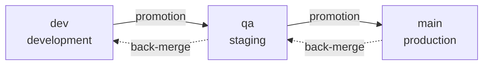

# Branch and versioning policy

This page is the **source** of the policy. The workflows that apply it
derive from here — if a mechanism diverges from what's written, the
mechanism is wrong.

## Why mechanize it

A branching policy agreed upon in a meeting survives until the first
Friday night. The rush isn't bad faith: it's that the rule lives in
people's heads, and a head under pressure optimizes for the short term.

So the policy here **doesn't ask for cooperation** — it's enforced by CI.
Not out of distrust, but because a rule that depends on individual
discipline doesn't survive an incident, and it's exactly during an
incident that it matters most.

Two consequences we accept on purpose:

- **The PR becomes more bureaucratic.** A wrong branch name fails the
  check. That's the cost.
- **The error message has to teach.** A check that only says "invalid"
  trains people to work around it. Every error cites the rule, what came
  in, and the correct example.

## The ladder

Three permanent branches, **one per environment**. Code climbs one step
at a time.



| branch | environment | what being here means |
|---|---|---|
| `dev` | development | integrated, tested by CI |
| `qa` | staging | under functional validation |
| `main` | production | what's live |

There used to be a fourth step, `rc` (pre-prod), between `qa` and `main`.
It was removed: with a single maintainer and a short cycle, the extra step
cost a whole promotion and an environment to separate "validated" from
"almost ready" — a distinction that wasn't paying for itself. `qa` becomes
the only gate before production.

The removal took a while to fully land. `pr-police` started operating
with three steps immediately, but the **Gitflow bootstrap** kept creating
`rc`, protecting `rc` and committing a `branching-policy.md` into the
user's repository that taught the four-step ladder — the product
documenting, for whoever used it, a policy it had itself already dropped.
It was finding #3 of the
[first dogfooding round](./primeiro-dogfooding.md), closed afterward
([RN-029](../business-rules.md#rn-029)).

Two loose ends were left standing on purpose, and for different reasons:
the value `create_rc_branch` remains in the database's `bootstrap_step`
enum (already-run bootstraps have rows with it), and `rc` remains in the
**protected-merge** list — see the note in
[permissions.md](../reference/permissions.md).

**No step can be skipped.** `dev → main` doesn't exist, not even in an
emergency — an emergency has its own path (`hotfix`, below), and it too
respects the ladder, just starting from the top.

## Taxonomy

Every branch is `function/descriptor`, validated by
`^.{0,30}/\S{0,32}$` — up to 30 characters for the function, up to 32 for
the descriptor, no spaces.

```
✅ feature/pr-police          ✅ bugfix/rate-limit-off-by-one
✅ hotfix/vaza-token          ✅ docs/politica-de-branches

❌ minha-branch               (no function)
❌ ci/build-paralelo          (`ci` isn't on the list; use `chore`)
❌ fix/algo                   (`fix` isn't on the list; use `bugfix`)
```

The regex alone isn't enough: the function needs to be on the **closed
list**.

### Who's born where

| function | born from | PR targets | for |
|---|---|---|---|
| `breaking` | `dev` | `dev` | incompatible change |
| `feature` | `dev` | `dev` | new functionality |
| `bugfix` | `dev` | `dev` | ordinary fix |
| `perf` | `dev` | `dev` | performance |
| `refactor` | `dev` | `dev` | restructuring without behavior change |
| `chore` | `dev` | `dev` | maintenance, tooling, CI |
| `docs` | `dev` | `dev` | documentation |
| `test` | `dev` | `dev` | coverage |
| `hotfix` | `main` | `main` | production incident |

A fix found in **staging** has no prefix of its own: it becomes a
`bugfix/` starting from `dev` and climbs the ladder. There used to be an
`rcfix/` for pre-prod, and it left along with the `rc` step — a prefix
with no origin branch is a trap.

The origin isn't a suggestion — it's **verified by merge-base**. A
`hotfix` born from `dev` carries along everything that's in `dev` and
hasn't been validated yet; rushing that into production during an
incident is how disaster happens.

### A fix born high goes back down

`hotfix` enters directly at the step where the problem showed up. That
leaves the steps below it **out of date** — the fix exists in `main` and
not in `dev`.

That's why every high-born fix generates a **back-merge**: `main → qa →
dev`, in a chain, in order. While it hasn't completed, the affected steps
stay locked — see [The back-merge gate](#the-back-merge-gate).

The full chain for a hotfix is **three PRs**: the hotfix plus the two
back-merges.

## PR families

Every PR gets a family label, applied automatically:

| family | when | example |
|---|---|---|
| `trabalho` (work) | a work function → `dev` | `feature/pr-police` → `dev` |
| `correcao-alta` (high fix) | `hotfix` → `main` | `hotfix/vaza-token` → `main` |
| `promocao` (promotion) | adjacent step, going up | `dev` → `qa` |
| `retropropagacao` (back-merge) | adjacent step, going down | `main` → `qa` |

The label isn't decoration: it's what lets you answer "how many hotfixes
did we have this quarter?" without git archaeology.

## Direct push is blocked

None of the three permanents accept direct push. Every change enters via
PR. It's the **single door** — and it has exactly three exceptions, all
bots, all written here because an undocumented exception becomes a
precedent:

| exception | who | why |
|---|---|---|
| `v*` tags | `brabo-release[bot]` | a version is born from a workflow, never by hand |
| `.release/gate.json` on `main` | `brabo-release[bot]` | the gate needs to write itself when it locks and unlocks |
| the `gh-pages` branch | `github-actions[bot]` | publishing documentation per step requires a mutable tree ([ADR 0034](../adr/0034-documentacao-publicada-por-degrau.md)) |

**The third is the easiest of the three to accept, and it's worth saying
why, so it doesn't set a precedent for the hard ones.** `gh-pages` **is
not a code branch**: nothing in it is source, everything is generated
from `docs/` and `website/`, and deleting it entirely loses nothing — the
next push rebuilds it. There's no possible reviewer for a generated site,
and a PR per publication would be ceremony with no reader. Its `git log`
is the record of every publication, with date and origin sha.

It's also **not permanent**, so it doesn't enter the rulesets — which is
why the `GITHUB_TOKEN` is enough, no bypass and no `BRABO_BOT_TOKEN`.

The second is the most uncomfortable of the three, so it's worth saying
why the gate exists instead of going through a PR: the gate locks the
branches, and a PR to open the lock would be blocked by the gate itself.
The alternative — storing the state outside the repository — would trade
a visible exception in the history for an invisible state in some
dashboard. The bot's commit stays in `git log`, with date and content.

`tag-release` recognizes that commit **by its content** (it only touches
`.release/`), never by author or message: who wrote it is verifiable,
who *claims* to have written it isn't.

The exact configuration is in [Rulesets](../reference/rulesets.md), and
applying it is a manual step — the repository versions the source, GitHub
receives the application.

## Merged branches get archived

Every branch whose PR merges gets moved out of the branch list —
mechanically, by `archive-merged-branch.yml`, on every `pull_request`
`closed` event where `merged == true`. "Archived" is literal, not a
euphemism for deleted: the branch moves from `refs/heads/<name>` to
`refs/archive/<name>`, a namespace GitHub's UI doesn't show as a branch.
The commit object and its history stay in the repository exactly as they
were — recoverable by anyone who knows the ref, with a single
`git push origin refs/archive/<name>:refs/heads/<name>` to bring it back.

Four names are never archived, and the reason is the same for all four:
none of them is disposable feature work.

| name | why it's excluded |
|---|---|
| `dev`, `qa`, `main` | the three permanents — they appear as the `head` of every merged promotion PR (`dev`→`qa`, `qa`→`main`), which is exactly the case this exclusion exists to catch |
| `gh-pages` | the documentation site's deploy branch (see "Direct push is blocked" above) — not a feature branch, and deleting `refs/heads/gh-pages` would take the live site down with it |

A fifth condition isn't a name, it's a boundary: a PR whose head branch
lives in a **fork** (`head.repo.full_name != base.repo.full_name`) is
never touched. The workflow's `GITHUB_TOKEN` is scoped to this
repository — it has no business rewriting refs in someone else's.

The decision itself — which four names are excluded, and the fork check —
is a tested pure function
([`scripts/ci/archive-branch.ts`](https://github.com/daneiel/brabo/blob/dev/scripts/ci/archive-branch.ts)),
not inline shell: it's the part of this mechanism that's actually worth
getting wrong tests for. The workflow step that follows just calls the
GitHub API twice — create the `refs/archive/` ref, then delete the
`refs/heads/` one — and only deletes after the create succeeds, so a
failure never drops a branch without leaving the archived copy behind.

## Bots skip the ladder

PRs opened by `dependabot[bot]` and `github-actions[bot]` are **exempt**
from name, origin and destination validation.

The reason is practical: Dependabot names branches like
`dependabot/npm_and_yarn/brace-expansion-5.0.8`, and there's no way to
teach it the taxonomy. Rejecting it would mean renaming branches by hand
on every security alert — friction on top of exactly the flow that needs
to be fast.

A pedagogical message doesn't teach a bot. The exemption is by
**author**, not by prefix, so no one uses it as a loophole by naming a
branch `dependabot/`.

## Who approves

The approval requirement has **two modes**, chosen by the repository
variable `APPROVAL_MODE`. Both are implemented and tested; switching from
one to the other is **just changing variables**, no code touched.

### `solo` mode — what applies today

The project has **one maintainer**. The full approver ladder assumes
teams that don't exist yet, and a rule that can't be fulfilled is a rule
that teaches people to cheat.

| situation | requirement |
|---|---|
| PR from a third party | **1 approval from the owner** |
| PR authored by the owner | passes the check **without review** |

The second line isn't a privilege, it's how GitHub works: **no one can
approve their own PR through the interface**. In a BDFL project, the
**owner's manual merge is the approval** — it's their deliberate act, at
the moment they choose to click the button. Requiring a review the
platform doesn't allow would only produce a permanently red check.

The requirement for **distinct people is suspended** in this mode, and
it's suspended on purpose: with a single maintainer, it's arithmetically
impossible.

### `community` mode — for when there are people

| target | requirement |
|---|---|
| `dev` | 1 × devs |
| `qa` | 2 × devs |
| `main` | 1 × PO **+** 1 × management |

For `main`, **distinct people** — the requirement applies again. For
`dev` and `qa` the distinction is automatic: the slots are the same role
and each person only gets one review.

The roles are **lists of handles** in repository variables, not GitHub
teams:

```
APROVADORES_DEVS    = ana,bruno,carla
APROVADORES_PO      = paula
APROVADORES_GESTAO  = gustavo
```

Teams would be the obvious path and **don't work here**: they only exist
inside an organization, this repository belongs to a user, and the
`GITHUB_TOKEN` can't read team membership even inside an org — that would
need a PAT with `read:org`. With lists, `community` mode is activatable
today and the switch really is just a variable.

The honest cost: keeping the lists up to date is manual work, and a
person who leaves the project keeps approving until someone edits the
variable. If the project becomes an org with real teams, changing the
source is a one-function change — the ladder and the distinct-people rule
don't change.

#### Why "distinct people" needs more than counting

For `main`, whoever is on **both lists** (`po` and `gestao`) could
satisfy both slots alone, if the check simply counted approvals per role.
The check treats this as an **assignment** problem instead: does there
exist a distribution of distinct approvers that fills every slot?

This also avoids the opposite error. If `paula` is the only one in `po`
but is also in `gestao`, giving the `gestao` slot to her would leave `po`
uncovered — even though another person could have filled it. The correct
assignment exists, and the check finds it.

### Rules common to both modes

- Only reviews **`APPROVED` on the last commit** count. An approval on an
  old commit doesn't count: what was approved isn't what's about to be
  merged.
- The check's summary shows **the active mode, who approved and what's
  missing**. A check that only says "approvals missing" forces you to
  guess.

### Migrating to `community` mode

Prerequisites, before flipping any variable:

1. **Every role with real people.** `main` requires PO **and**
   management; if both lists point to the same person, no PR to `main`
   ever passes — the distinct-people rule can't be satisfied. `qa`
   requires **two** distinct devs: a list with a single name blocks
   promotion.
2. **A criterion for who joins each list**, defined and written down —
   who joins, who leaves, and based on what.

Step by step for the switch:

```bash
gh variable set APROVADORES_DEVS   --body "ana,bruno,carla"
gh variable set APROVADORES_PO     --body "paula"
gh variable set APROVADORES_GESTAO --body "gustavo"

# last: with empty lists, community rejects everything
gh variable set APPROVAL_MODE --body community
```

The order matters. With `APPROVAL_MODE=community` and the lists still
empty, every PR turns red saying which variable is missing — correct, but
needlessly noisy. Fill them in first.

To go back: `gh variable set APPROVAL_MODE --body solo`.

**No deploy, no merge, no code change** — the switch is configuration
only, and there's a test that runs the same input through both modes
asserting different verdicts.

The criterion for who joins each list — who joins, who leaves, and based
on what — lives in `GOVERNANCE.md`, at the repository root. This section
remains the source of the MECHANISM (the ladder, the distinct-people
requirement, the switch's step by step); `GOVERNANCE.md` is the source of
the CRITERION for who fills each role.

## Promotion

Code climbs a step via a **promotion PR**, opened by the `promote`
workflow (`workflow_dispatch`, input: the pipeline pair).

The workflow **doesn't merge anything** — it computes and opens the PR.
The merge remains a manual act, like every entry into a permanent branch.

| step | what |
|---|---|
| 1 | **who triggers it** — under `APPROVAL_MODE=solo`, only
`OWNER_HANDLE`. Any other actor fails, naming who's allowed |
| 2 | **adjacent pair** — `dev→qa` and `qa→main`. `dev→main` is refused,
pointing to the staged path |
| 3 | **cycle version** — computed from the PRs merged since the last
final tag |
| 4 | **PR opened** — body listing each PR, its function, its impact and
the proposed version |

Step 4's body is a **markdown table**, and a PR's title is text no one
controls — so it's escaped before becoming a table cell
(`celulaDeTabela`, in `scripts/ci/promote.ts`). Escaping the `|` isn't
enough — the backslash has to be escaped **first**, otherwise a title
ending in `\` right before a `|` produces `\\|`, which GFM reads as an
escaped backslash followed by a column DELIMITER — the row gains an
extra cell and the table breaks. That's why the order of the two
substitutions is load-bearing, and the test in `promote.spec.ts` counts
the line's REAL delimiters instead of comparing the whole string.

### The promotion check

A promotion PR goes through a check of its own, separate from
`pr-police`. That one validates the **shape** (name, origin, destination);
this one validates the **state**:

| check | why |
|---|---|
| **clean range** | the PR's head is the tip of the origin branch. If
someone pushed something after the PR opened, what would be promoted
isn't what's there |
| **prior step stamped** | the commit has the stage-below's tag.
Promoting without it means promoting something that never went through
there |
| **merge commit possible** | promotion is `--no-ff`. A squash would
flatten the lower step's commits, and the stage's tag would end up
pointing to a commit that no longer exists |

A check that **couldn't be performed** counts as failed, never as
passed — a ref that fails to resolve is ignorance, not permission.

The first two checks are exercised by
`scripts/ci/promotion-check.spec.ts`, in the same spirit as
`pr-police`'s and `approval-ladder`'s specs. What it fixes isn't the
implementation but the rule: which stamp each destination requires, and
that the stamp has to be **that commit's** — a tag on another commit, on
another stage, or one that failed to resolve a sha don't count. Accepting
any of those would let `qa` receive code that never went through `dev`.

The exception is reading the **merge configuration**: the workflow's
token legitimately lacks permission to read it, and blocking every
promotion over that would be worse than the failure it's meant to
prevent. There, the impossibility becomes a **warning**, and the real
guarantee lives in `tag-release`: after the merge, it confirms the
commit has **two parents**. That doesn't depend on any permission, and it
looks at the fact on the ground rather than the declared intent.

## Versioning

Every tag is born from a workflow, in the format `vX.Y.Z-dev.N` /
`-qa.N` / final.

**The version lives in the TAG, not in files.** No one can commit
directly to a permanent branch to bump `package.json`, so requiring the
four version files to keep up would force a bump PR every cycle — the
ceremony automated calculation exists to eliminate.
`release.yml` checks the files as a **warning** and only fires on a final
tag.

### What the final tag produces

`release.yml` is the end of the pipeline, and what it delivers is
deliberately modest:

| delivery | what |
|---|---|
| GitHub Release | with notes generated from the CHANGELOG by
`scripts/changelog.mjs` |
| version check | the four versioned files, as a **warning** |
| the four production images | built to prove the tag is **buildable** |
| the version baked into two of them | baked in as an `ARG` in the api
and web — see below |

#### The version lives in the tag, and the release is what carries it to the artifact

The tag is the source of the version, but an image can't read its own
tag: the container doesn't know what name it was published under, and
the tag can be moved. So `release.yml` **passes the version into the
build** — and it's the only place in the repository that does this.

`VERSION` is a `docker-bake.hcl` variable, separate from `TAG`, with a
default of `dev`. The `api` target converts it into `BRABO_VERSION` and
the `web` target into `VITE_BRABO_VERSION`; each `Dockerfile.prod`
declares it as an `ARG` with the same default. From there it reaches the
api's spans' `service.version` and the auth screens' footer on the web
([ADR 0036](../adr/0036-telas-de-auth-fieis-ao-design-e-fontes-auto-hospedadas.md)).

Two consequences, and both are intentional:

- **Only a release stamps a version.** `ci.yml` uses the same bakefile
  with `TAG=prod` and doesn't set `VERSION`, so its images report `dev`.
  If the version came from `TAG`, every CI span would come out with
  `service.version=prod`, which isn't a version of anything.
- **Version isn't configuration.** It's a build `ARG`, not a ConfigMap
  key, because it's a property of the artifact:
  `brabo-web:1.1.2` shouldn't be able to report anything else. URLs stay
  runtime-configured, via `/config.js`, because those are a property of
  the environment (ADR 0024).

Touching this chain is touching policy: whoever changes `VERSION` in the
bakefile or in the `ARG`s needs to change both sides together, or the
version silently reverts to `dev` — with no error anywhere, because
`dev` is a valid value.

**The images aren't published** — `push: false`. Publishing to a
registry hasn't been decided yet (the production overlay points to
`ghcr.io/OWNER/*`, a placeholder), and the decision is recorded in
[ADR 0027](../adr/0027-fase5-backup-hardening-release.md). Building
without publishing isn't a half-measure: it's what prevents a tag from
existing for a commit that doesn't compile.

They're built from the same `docker-bake.hcl` that `ci.yml` uses, in
parallel. They used to be four sequential `docker build`s — same
verdict, ~160s more per release.

**There's no deploy step, here or anywhere.** The tag is the record of
what **would be** in each environment, and that holds even without an
environment. A step that never runs rots: no one tests it, no one
notices when it breaks, and on the day it's flipped on it'll be wrong.
When there's an environment, the deploy will be its **own** workflow,
triggered by the tag.

#### The Release depends on the PAT, and its absence has already cost six

`release.yml` fires on a final tag `push`. But **a tag pushed with the
`GITHUB_TOKEN` doesn't trigger a workflow** — it's GitHub's anti-recursion
rule. `tag-release` uses `secrets.BRABO_BOT_TOKEN || github.token`:
without the PAT, the tag is born and the Release doesn't go out.

The degradation is visible on purpose (there's a warning on every run),
but visible isn't the same as prevented: **`v0.2.0`, `v0.3.0`, `v0.3.1`,
`v1.0.0`, `v1.0.1` and `v1.1.0` exist with no Release** — six whole
cycles where the warning showed up and no one acted on it.

With the PAT configured, `v1.1.1` closed the pipeline on its own: tag
pushed by the token, `release.yml` triggered by it, Release published.
Before it, only `v0.1.0` had a Release, and by a manual push. **The PAT
doesn't recover the previous six** — it only applies to new tags.

This separates two problems that are easy to confuse:

| problem | fix |
|---|---|
| the Release doesn't go out **on its own** | configure the
`BRABO_BOT_TOKEN` |
| a Release that didn't go out **can't go out later** |
`release.yml`'s `workflow_dispatch` |

The second would remain open even with the PAT in place: any workflow
failure would leave the tag orphaned forever, because republishing would
require deleting and recreating the tag — rewriting the record to fix
its own effect. Whoever republishes is the release owner, the same
restriction as `promote`. The procedure is in
[Rulesets](../reference/rulesets.md#republishing-a-tag-that-was-orphaned).

### The CHANGELOG comes back via PR, and why not by push

Once the Release is published, `release.yml` opens a `chore/changelog-<tag>`
PR to **`dev`** with the version's cut in `CHANGELOG.md` — and, in the
same commit, with the version announced in prose in the **two** files
that write it: `README.md` and `docs/intro.md`, the published site's
first page. Whoever rewrites both is `scripts/ci/readme-version.ts`, and
it reads and swaps all of them before writing any one of them: a phrase
missing in either fails the whole release rather than leaving it half
written.

The three things move together on purpose. The version is **generatable**
(the release knows what it is), and `docs:check` confirms it matches the
CHANGELOG's most recent cut in each of the files; separating the two
ends would make every changelog PR born red, opened by the bot and
waiting for a human hand the policy doesn't provide for. A phrase not
found FAILS the step instead of sliding through — this script's regex and
`scripts/docs/generate.mjs`'s are the two sides of the same contract, and
a test guards the agreement.

By PR, and not by push, because none of the direct paths exist: `main`
only accepts a tag (release bot) and `.release/gate.json` (gate bot), and
committing to `qa` or `dev` before promotion would break the promotion
check's **clean range** — the PR's head would stop being the origin's
tip.

**Accepted consequence:** `main`'s `CHANGELOG.md` stays one cycle behind.
It's not information loss: the authoritative source of the notes is the
**GitHub Release**, published at the same moment as the tag, and the cut
lands in the next cycle like any other change.

> Before this, **nothing ever wrote to the file**. The generator was only
> ever called with `--stdout`, to build the Release's body, and
> `CHANGELOG.md` had accumulated twelve versions inside a single
> "Unreleased" — while six Releases went out with an empty body, because
> the "previous tag" included that same version's own pre-releases.

### The cycle's version

Comes from the **largest impact** among the PRs merged since the last
final tag:

| branch function | impact |
|---|---|
| `breaking/` | MAJOR |
| `feature/` | MINOR |
| everything else | PATCH |

A single `breaking` among ten `docs` makes the whole cycle MAJOR. And
it's the **branch's function** that decides, not the family label:
`breaking/x` and `docs/y` are both in the `trabalho` family.

#### `breaking/` requires the marker on the commit

`pr-police` rejects a `breaking/` PR whose commits don't mark the break
— `!` in the subject (`feat(api)!: …`) or `BREAKING CHANGE:` in the body
— and it also rejects the inverse: a marked commit on a branch that isn't
`breaking/`.

The rule exists because these are **two mechanisms for the same fact**,
and they used to live apart: the version comes from the branch's
FUNCTION (the table above), and the CHANGELOG detects a break by the
commit's MARKER. Nothing connected them.

The cost was measured. `breaking/fase-7-auth-e-openapi` removed
Keycloak, logged everyone out and correctly bumped MAJOR — and the
CHANGELOG records no breakage at all, in **none** of the twelve versions,
because no commit in the history had ever used the markers. Both halves
worked; the information just never crossed from one to the other.

Both directions matter, and the second is worse:

| situation | what used to happen |
|---|---|
| `breaking/` with no marker | the version jumps MAJOR and the
changelog doesn't say what broke |
| marker outside `breaking/` | the changelog announces a break and the
version comes out PATCH — whoever trusts the number breaks without
warning |

A check that couldn't be performed (shallow checkout, ref not fetched)
**doesn't fail**: the rule only runs when the `base..head` range is
readable, the same doctrine as the contamination check.

An **empty** cycle — no PR since the last final — fails with a message
instead of generating a tag. A new tag pointing at the same commit as the
previous one would make the version history lie.

#### Where the cycle's PRs come from

From the `git log` between the last final tag and `dev`, reading the PR
number from the commit's subject. The **two merge styles** need to be
understood, because the number lands in different places:

| style | subject |
|---|---|
| squash | `feat(ci): faz coisa (#53)` |
| merge commit | `Merge pull request #56 from daneiel/feature/x` |

Reading only the first was a real bug: the range's `--no-merges` was
hiding exactly the line that cites the number in a merge commit, and the
whole cycle looked empty — merging #56 into `dev` generated no tag at
all.

**Promotion and back-merge don't count.** They're born from a permanent
branch, and what they carry has already been counted or already
released. Without this exclusion, a solo hotfix back-merge would
generate a whole new cycle: a `-dev.N` tag on a version that changed
nothing.

Two pieces do this discovery and **have to agree**: `tag-release`, which
stamps at merge time, and `promote`, which computes the version for the
promotion PR. If they diverge, the promotion PR announces one version and
the tag comes out with another. Both use the same function — the logic's
duplication has already cost one promotion, rejected as "empty cycle"
right after `tag-release` had stamped `-dev.2`.

> **`promote` runs with the code from the DEFAULT branch.** It's
> `workflow_dispatch` (see the trigger table in
> [Rulesets](../reference/rulesets.md)), so fixing the calculation in
> `dev` does **not** fix the dispatch until the fix reaches `main`. Until
> then, the workaround is the one already documented: run
> `node scripts/ci/promote.ts` by hand, with the same script.

### The `N`

`N` is however many tags of that version already exist at that stage,
plus one.

There's no state stored anywhere: **the tags themselves are the
counter**. That's what makes "promoted, rejected, fixed, re-promoted"
become `-qa.2` with no one recording the rejection — and the number ends
up saying how many laps the cycle took before passing.

### The final tag's anchor

The final tag is only born if what's in `main` is **exactly** what
passed through `qa`. If it isn't, the workflow fails loudly instead of
publishing.

Since promotion is `--no-ff`, the merge **creates a new commit** —
`main`'s sha will never be `qa`'s sha. Comparing shas would be a check
impossible to pass. What gets compared are two things, and together
they're stronger:

| check | what it guarantees |
|---|---|
| the `-qa.N` is the **parent** of the commit on `main` | it was that
one that entered, not some ancestor |
| the **tree** is identical | the content is byte-for-byte what was
validated |

The second is the one that really matters. If the other side of the
merge brought in a file, the tree would change and the check would fail
— exactly the case the anchor exists to catch. Tree equality is stronger
than commit equality: it looks at content, not identity.

### `main`'s two paths

`main` receives merges in two ways, and they call for different
versions. The distinction comes from the merge commit's **second
parent** — the side that entered:

| second parent | path | version |
|---|---|---|
| the commit of a `-qa.N` | promotion | the cycle's, **with anchor** |
| anything else | hotfix | last final **+ PATCH**, no anchor |

The hotfix is born from `main` and never goes through `qa`. Requiring an
anchor from it would demand the impossible — and the PATCH tag has to be
born, because it's the one the back-merge PRs cite.

A `-dev.N` as second parent does **not** count as a promotion: a merge
straight from `dev` into `main` skips `qa`, and the final tag would end
up stamping code no one validated.

Cases that fail loudly instead of guessing:

| situation | why |
|---|---|
| a merge into `main` with a single parent | a squash erases the side
that entered; without it the path can't be determined |
| a hotfix with no final tag published yet | PATCH is an increment over
something already released |

And two cases that generate **no tag at all**, on purpose: the gate's
commit (touches only `.release/`) and the `main → qa`/`dev` back-merge,
which carries content already in `main`. Without this second escape
hatch, the back-merge would stamp a `-qa.N` on a commit that was never
promoted from `dev` — a tag saying "this passed through qa" on something
that didn't.

### There's no deploy

The workflows **end at the tag**. There's no environment, no GitHub
Environments, no deploy step — not even a disabled one. The tag is the
record of what *would be* at each stage, and stands on its own.

A deploy step that never runs is a step that rots: no one tests it, no
one notices when it breaks, and on the day it's turned on it'll be
wrong. When there's an environment, the deploy will be its own workflow,
triggered **by the tag**.

To look with your own eyes at what a tag stamped:

```bash
make deploy-local TAG=v0.2.0-qa.1
```

## The back-merge gate

`hotfix` solves the incident and creates a new problem: the fix is in
`main` and not in `qa` or `dev`. If someone promotes `dev → qa → main`
before the fix comes down, the release **undoes the hotfix** — no
conflict, no warning, months later, and no one will connect the bug back
to that merge.

The gate closes that hole by locking the lower steps until the fix comes
down.

### The state

The gate lives at `.release/gate.json`, on `main`:

```json
{
  "versao": 1,
  "locked": ["qa", "dev"],
  "awaiting": "v0.2.1",
  "order": ["qa", "dev"],
  "historico": [
    { "tag": "v0.2.1", "sha": "…", "em": "…", "prs": { "qa": 60, "dev": 61 } }
  ]
}
```

| field | what |
|---|---|
| `locked` | branches that accept no merge at all |
| `awaiting` | the most recent hotfix's tag — `null` when clean |
| `order` | the order the locks come off in: always top to bottom |
| `historico` | every hotfix in this round; resets when the chain closes |

It's read **always from `main`**, never from the PR's branch: the
back-merge PRs carry a copy of the file along, and reading that copy
would give the stale state precisely during the chain it changes at
every merge.

### What happens when a hotfix merges

All in the same workflow (`tag-release`), in this order — and the order
matters, because the PRs need to cite the tag:

1. the **PATCH** tag is born normally (`v0.2.0` + hotfix → `v0.2.1`);
2. the **two back-merge PRs** are opened: `main → qa` and `main → dev`;
3. `.release/gate.json` is written on `main`, locking `qa` and `dev`.

### Accumulation comes free

A second hotfix during an active gate **doesn't open a new PR and
doesn't create a parallel queue**. The `main → qa` and `main → dev` PRs
are already open and carry whatever `main` has — including the new
hotfix. The gate only appends the entry to `historico` and re-affirms the
lock. A branch already unlocked **locks again**, because now there's new
content that needs to come down.

### The check, on every PR

| situation | verdict |
|---|---|
| `locked` empty | ✓ passes |
| `main` → first still-locked step | ✓ it's that step's back-merge |
| `main` → step out of order | ✗ "unlock `qa` before `dev`" |
| any PR to a locked branch | ✗ with the link to the PR that resolves
it |
| `hotfix/` → `main` | ✓ `main` is never locked |

`bugfix/` to `dev` during an active gate is **blocked**. The temptation is
to think "it's a fix, so it should pass": it can't. It's born from `dev`,
doesn't carry the hotfix, doesn't resolve the lock, and just piles more
work on top of the hole.

### The order isn't bureaucracy

Unlocking `dev` before `qa` would leave the middle step without the fix
— exactly the hole the gate exists to close. The last unlock clears
`awaiting` and resets the history.

### The lock is checked, not just declared

`locked` is the **record of intent**; the truth is the containment.
Before evaluating, the check asks git whether the hotfix commit is
**already** in each locked branch, and lets fall whichever locks reality
has already satisfied.

This isn't fussiness: it's the fix for a real trap. The back-merge PRs
carry `gate.json` to `qa` and `dev`; months later, a `qa → main` promotion
could bring that stale copy back up. Without the check, a phantom lock
would reappear on `main` with no hotfix behind it — and nothing would
unlock it, because there's no pending back-merge. The repository would
stay stuck forever.

**Failing to verify keeps the lock.** Unknown isn't permission.

## What the policy doesn't solve

**It doesn't prevent bad code.** It guarantees the code went through the
steps, not that it's good. That's review, testing and the QA/SecOps gates'
job.

**It doesn't replace judgment during an incident.** It gives a fast, safe
path (`hotfix`) so no one has to choose between "follow the rule" and
"fix it now." If the policy is getting in the way during an incident, the
policy is the problem — open an issue afterward, don't cheat during.

## Roles

While `APPROVAL_MODE=solo`, the two roles below are held by the
**owner**. It's not concentration by neglect — it's the acknowledgment,
written down instead of left implicit, that a single-maintainer project
has no one to delegate to.

| role | who | what they do |
|---|---|---|
| **release owner** | owner | the only one authorized to trigger
`promote` |
| **hotfix on-call** | owner | approves the merge into `main` during an
incident |

Both assignments **reopen once migrating to `community`**. There, on-call
becomes a real question again: the ladder will require a PO + a manager
for `main`, and someone needs to be able to act at 3am when both of them
are asleep. That fallback will have to be a **documented exception in the
requirements map** — with who can exercise it and what gets recorded
afterward —, never an informal workaround.

---

> **TODO(humano):** this page was rebuilt from `CLAUDE.md`, not from the
> policy's original presentation. If the presentation says something
> that's not here — back-merge SLA, named roles, an obsolete branch
> policy —, check and complete it.

---

<sub>Pipeline exercised end to end on 2026-07-27: `v0.2.0-dev.1` → `-dev.2`
→ `-qa.1` → `-qa.2` → final, with a staged rejection between the two `qa`
stamps to prove that `N` counts on its own.</sub>
