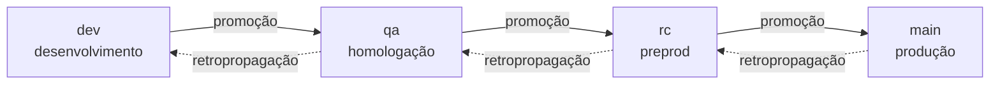

# Política de branches e versionamento

Esta página é a **fonte** da política. Os workflows que a aplicam saem daqui —
se um mecanismo divergir do que está escrito, o mecanismo está errado.

## Por que mecanizar

Política de branches combinada em reunião dura até a primeira sexta-feira à
noite. A pressa não é má-fé: é que a regra vive na cabeça das pessoas, e cabeça
sob pressão otimiza para o curto prazo.

Então a política aqui **não pede colaboração** — ela é aplicada por CI. Não por
desconfiança, mas porque regra que depende de disciplina individual não
sobrevive a incidente, e é exatamente durante o incidente que ela mais importa.

Duas consequências que assumimos de propósito:

- **O PR fica mais burocrático.** Nome de branch errado reprova. É o custo.
- **A mensagem de erro tem que ensinar.** Um check que só diz "inválido" treina
  as pessoas a contornar. Todo erro cita a regra, o que veio, e o exemplo
  certo.

## A escada

Quatro branches permanentes, **uma por ambiente**. Código sobe um degrau por
vez.



| branch | ambiente | o que significa estar aqui |
|---|---|---|
| `dev` | desenvolvimento | integrado, testado por CI |
| `qa` | homologação | em validação funcional |
| `rc` | preprod | candidato a release |
| `main` | produção | o que está no ar |

**Não se pula degrau.** `dev → main` não existe, nem em emergência —
emergência tem caminho próprio (`hotfix`, abaixo), e ele também respeita a
escada, só que começando do topo.

## Taxonomia

Toda branch é `funcao/descritivo`, validada por
`^.{0,15}/\S{0,32}$` — até 15 caracteres de função, até 32 de descritivo, sem
espaço.

```
✅ feature/pr-police          ✅ bugfix/rate-limit-off-by-one
✅ hotfix/vaza-token          ✅ docs/politica-de-branches

❌ minha-branch               (sem função)
❌ ci/build-paralelo          (`ci` não está na lista; use `chore`)
❌ fix/algo                   (`fix` não está na lista; use `bugfix`)
```

O regex sozinho não basta: a função precisa estar na **lista fechada**.

### Quem nasce de onde

| função | nasce de | PR mira | para quê |
|---|---|---|---|
| `breaking` | `dev` | `dev` | mudança incompatível |
| `feature` | `dev` | `dev` | funcionalidade nova |
| `bugfix` | `dev` | `dev` | correção comum |
| `perf` | `dev` | `dev` | desempenho |
| `refactor` | `dev` | `dev` | reestruturação sem mudar comportamento |
| `chore` | `dev` | `dev` | manutenção, tooling, CI |
| `docs` | `dev` | `dev` | documentação |
| `test` | `dev` | `dev` | cobertura |
| `rcfix` | `rc` | `rc` | correção achada na preprod |
| `hotfix` | `main` | `main` | incidente em produção |

A origem não é sugestão — é **verificada por merge-base**. Um `hotfix` que
nasceu de `dev` carrega junto tudo que está em `dev` e ainda não foi validado;
levar isso para produção com pressa de incidente é como o desastre acontece.

### Correção que nasce alta volta para baixo

`rcfix` e `hotfix` entram direto no degrau em que o problema apareceu. Isso
deixa os degraus de baixo **desatualizados** — a correção existe em `main` e
não em `dev`.

Por isso toda correção alta gera **retropropagação**: `main → rc → qa → dev`,
em cadeia e na ordem. Enquanto ela não completa, os degraus afetados ficam
travados. O mecanismo do gate está na sessão do item 7 desta fase.

## Famílias de PR

Todo PR recebe um rótulo de família, aplicado automaticamente:

| família | quando | exemplo |
|---|---|---|
| `trabalho` | função de trabalho → `dev` | `feature/pr-police` → `dev` |
| `correcao-alta` | `rcfix` → `rc`, `hotfix` → `main` | `hotfix/vaza-token` → `main` |
| `promocao` | degrau adjacente, subindo | `dev` → `qa` |
| `retropropagacao` | degrau adjacente, descendo | `main` → `rc` |

O rótulo não é decoração: ele é o que permite responder "quantos hotfixes
tivemos neste trimestre?" sem arqueologia de git.

## Push direto é bloqueado

Nenhuma das quatro permanentes aceita push direto. Toda mudança entra por PR.

Duas exceções, ambas de robô e ambas documentadas:

| exceção | quem | por quê |
|---|---|---|
| tags `v*` | bot de release | versão nasce de workflow, nunca da mão |
| `.release/gate.json` | bot do gate | o gate precisa se escrever ao travar |

A configuração exata está em [Rulesets](../reference/rulesets.md), e aplicá-la
é passo manual — o repositório versiona a fonte, o GitHub recebe a aplicação.

## Bots não passam pela régua

PRs abertos por `dependabot[bot]` e `github-actions[bot]` são **isentos** da
validação de nome, origem e destino.

O motivo é prático: o Dependabot nomeia branches como
`dependabot/npm_and_yarn/brace-expansion-5.0.8`, e não há como ensiná-lo a usar
a taxonomia. Reprovar significaria renomear branch à mão a cada alerta de
segurança — ou seja, atrito em cima justamente do fluxo que precisa ser rápido.

Mensagem pedagógica não ensina robô. A isenção é por **autor**, não por
prefixo, para que ninguém a use como brecha nomeando uma branch de
`dependabot/`.

## Quem aprova

A exigência de aprovação tem **dois modos**, escolhidos pela variável de
repositório `APPROVAL_MODE`. Os dois são implementados e testados; trocar de um
para o outro é **só mudar variáveis**, sem tocar em código.

### Modo `solo` — o que vale hoje

O projeto tem **um mantenedor**. A escada completa de aprovadores pressupõe
times que ainda não existem, e regra que não pode ser cumprida é regra que
ensina a burlar.

| situação | exigência |
|---|---|
| PR de terceiro | **1 aprovação do owner** |
| PR de autoria do próprio owner | passa no check **sem review** |

A segunda linha não é privilégio, é como o GitHub funciona: **ninguém aprova o
próprio PR pela interface**. Num projeto BDFL, o **merge manual do owner é a
aprovação** — é o ato deliberado dele, no momento em que ele escolhe apertar o
botão. Exigir um review que a plataforma não permite dar só produziria um check
eternamente vermelho.

A exigência de **pessoas distintas fica suspensa** neste modo, e está suspensa
de propósito: com um mantenedor, ela é aritmeticamente impossível.

### Modo `community` — quando houver time

| destino | exigência |
|---|---|
| `dev` | 1 dev |
| `qa` | 2 devs |
| `rc` | 1 qualidade + 1 dev |
| `main` | 1 PO + 1 gestor |

Em `rc` e `main`, **pessoas distintas** — a exigência volta a valer.

### Regras comuns aos dois modos

- Só contam reviews **`APPROVED` no último commit**. Aprovação em commit
  antigo não vale: o que foi aprovado não é mais o que vai ser mergeado.
- O resumo do check mostra **o modo ativo, quem aprovou e o que falta**. Um
  check que só diz "faltam aprovações" obriga a adivinhar.

### Migração para modo `community`

Pré-requisitos, antes de trocar qualquer variável:

1. **Times criados e populados** no GitHub, com pelo menos: devs, qualidade,
   PO, gestão, release.
2. **Critério de quem vira administrador** definido e escrito — quem entra num
   time, quem tira, e com base em quê.

Passo a passo da troca:

```
gh variable set APPROVAL_MODE --body community
gh variable set TIME_DEVS      --body <org>/<slug>
gh variable set TIME_QUALIDADE --body <org>/<slug>
gh variable set TIME_PO        --body <org>/<slug>
gh variable set TIME_GESTAO    --body <org>/<slug>
gh variable set TIME_RELEASE   --body <org>/<slug>
```

Depois: reabrir um PR de teste em cada destino e conferir que o resumo do check
mostra a exigência nova. **Nenhum deploy, nenhum merge, nenhuma alteração de
código** — a troca é de configuração.

> **TODO(humano):** o critério de quem vira administrador deveria estar
> alinhado ao `GOVERNANCE.md`, mas **ele não existe** — foi cortado do escopo
> da FASE DOC junto com o `CODE_OF_CONDUCT.md` (que depois voltou). Ou o
> `GOVERNANCE.md` é escrito antes da migração, ou o critério mora aqui e esta
> seção passa a ser a fonte. As duas opções servem; a que não serve é o
> critério não existir em lugar nenhum quando o primeiro contribuidor externo
> aparecer.

## Versionamento

Toda tag nasce de workflow, no formato
`vX.Y.Z-dev.N` / `-qa.N` / `-rc.N` / final.

A versão do ciclo sai do **maior impacto** entre os PRs mergeados —
`breaking` leva a MAJOR, `feature` a MINOR, o resto a PATCH. O `N` incrementa a
cada reprovação dentro do mesmo ciclo, o que torna visível quantas voltas um
release deu antes de passar.

A tag final **precisa apontar para o mesmo commit da última `-rc.N`**. Se não
apontar, algo entrou entre a validação e a publicação, e o workflow falha
ruidosamente em vez de publicar.

Os mecanismos disso são os itens 4 e 5 da FASE 6, ainda não implementados.

## O que a política não resolve

**Não impede código ruim.** Ela garante que o código passou pelos degraus, não
que é bom. Quem faz isso é revisão, teste e os gates de QA e SecOps.

**Não substitui julgamento em incidente.** Ela dá um caminho rápido e seguro
(`hotfix`) para que ninguém precise escolher entre "seguir a regra" e "resolver
agora". Se a política estiver atrapalhando durante um incidente, o problema é
a política — abra uma issue depois, não burle durante.

## Papéis

Enquanto `APPROVAL_MODE=solo`, os dois papéis abaixo são exercidos pelo
**owner**. Não é concentração por descuido — é o reconhecimento de que um
projeto de um mantenedor não tem a quem delegar, escrito em vez de subentendido.

| papel | quem | o que faz |
|---|---|---|
| **responsável de release** | owner | único autorizado a disparar o `promote` |
| **plantão de hotfix** | owner | aprova o merge em `main` durante incidente |

As duas atribuições **reabrem na migração para `community`**. Ali o plantão
volta a ser pergunta de verdade: a escada exigirá PO + gestor para `main`, e
alguém precisa poder agir às 3h da manhã quando os dois estão dormindo. Esse
fallback terá de ser **exceção documentada no mapa de exigências** — com quem
pode exercê-la e o que fica registrado depois —, nunca uma burla informal.

---

> **TODO(humano):** esta página foi reconstruída a partir do `CLAUDE.md`, não
> da apresentação original da política. Se a apresentação disser algo que aqui
> não está — SLA de retropropagação, papéis nomeados, política de branch
> obsoleta —, confira e complete.
