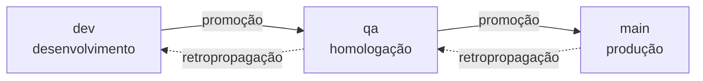

# Política de branches e versionamento

Esta página é a **fonte** da política. Os workflows que a aplicam saem daqui —
se um mecanismo divergir do que está escrito, o mecanismo está errado.

## Por que mecanizar

Política de branches combinada em reunião dura até a primeira sexta-feira à
noite. A pressa não é má-fé: é que a regra vive na cabeça das pessoas, e cabeça
sob pressão otimiza para o curto prazo.

Então a política aqui **não pede colaboração** — ela é aplicada por CI. Não por
desconfiança, mas porque regra que depende de disciplina individual não
sobrevive a incidente, e é exatamente durante o incidente que ela mais importa.

Duas consequências que assumimos de propósito:

- **O PR fica mais burocrático.** Nome de branch errado reprova. É o custo.
- **A mensagem de erro tem que ensinar.** Um check que só diz "inválido" treina
  as pessoas a contornar. Todo erro cita a regra, o que veio, e o exemplo
  certo.

## A escada

Três branches permanentes, **uma por ambiente**. Código sobe um degrau por vez.



| branch | ambiente | o que significa estar aqui |
|---|---|---|
| `dev` | desenvolvimento | integrado, testado por CI |
| `qa` | homologação | em validação funcional |
| `main` | produção | o que está no ar |

Havia um quarto degrau, `rc` (preprod), entre `qa` e `main`. Foi removido: com
um mantenedor e um ciclo curto, o degrau a mais custava uma promoção inteira e
um ambiente para separar "validado" de "quase pronto" — distinção que não
estava pagando o próprio custo. `qa` passa a ser o único portão antes de
produção.

**Não se pula degrau.** `dev → main` não existe, nem em emergência —
emergência tem caminho próprio (`hotfix`, abaixo), e ele também respeita a
escada, só que começando do topo.

## Taxonomia

Toda branch é `funcao/descritivo`, validada por
`^.{0,15}/\S{0,32}$` — até 15 caracteres de função, até 32 de descritivo, sem
espaço.

```
✅ feature/pr-police          ✅ bugfix/rate-limit-off-by-one
✅ hotfix/vaza-token          ✅ docs/politica-de-branches

❌ minha-branch               (sem função)
❌ ci/build-paralelo          (`ci` não está na lista; use `chore`)
❌ fix/algo                   (`fix` não está na lista; use `bugfix`)
```

O regex sozinho não basta: a função precisa estar na **lista fechada**.

### Quem nasce de onde

| função | nasce de | PR mira | para quê |
|---|---|---|---|
| `breaking` | `dev` | `dev` | mudança incompatível |
| `feature` | `dev` | `dev` | funcionalidade nova |
| `bugfix` | `dev` | `dev` | correção comum |
| `perf` | `dev` | `dev` | desempenho |
| `refactor` | `dev` | `dev` | reestruturação sem mudar comportamento |
| `chore` | `dev` | `dev` | manutenção, tooling, CI |
| `docs` | `dev` | `dev` | documentação |
| `test` | `dev` | `dev` | cobertura |
| `hotfix` | `main` | `main` | incidente em produção |

Correção achada em **homologação** não tem prefixo próprio: vira `bugfix/` a
partir de `dev` e sobe pela escada. Existia um `rcfix/` para a preprod, e ele
saiu junto com o degrau `rc` — prefixo sem branch de origem é armadilha.

A origem não é sugestão — é **verificada por merge-base**. Um `hotfix` que
nasceu de `dev` carrega junto tudo que está em `dev` e ainda não foi validado;
levar isso para produção com pressa de incidente é como o desastre acontece.

### Correção que nasce alta volta para baixo

`hotfix` entra direto no degrau em que o problema apareceu. Isso deixa os
degraus de baixo **desatualizados** — a correção existe em `main` e não em
`dev`.

Por isso toda correção alta gera **retropropagação**: `main → qa → dev`,
em cadeia e na ordem. Enquanto ela não completa, os degraus afetados ficam
travados. O mecanismo do gate está na sessão do item 7 desta fase.

## Famílias de PR

Todo PR recebe um rótulo de família, aplicado automaticamente:

| família | quando | exemplo |
|---|---|---|
| `trabalho` | função de trabalho → `dev` | `feature/pr-police` → `dev` |
| `correcao-alta` | `hotfix` → `main` | `hotfix/vaza-token` → `main` |
| `promocao` | degrau adjacente, subindo | `dev` → `qa` |
| `retropropagacao` | degrau adjacente, descendo | `main` → `qa` |

O rótulo não é decoração: ele é o que permite responder "quantos hotfixes
tivemos neste trimestre?" sem arqueologia de git.

## Push direto é bloqueado

Nenhuma das quatro permanentes aceita push direto. Toda mudança entra por PR.

Duas exceções, ambas de robô e ambas documentadas:

| exceção | quem | por quê |
|---|---|---|
| tags `v*` | bot de release | versão nasce de workflow, nunca da mão |
| `.release/gate.json` | bot do gate | o gate precisa se escrever ao travar |

A configuração exata está em [Rulesets](../reference/rulesets.md), e aplicá-la
é passo manual — o repositório versiona a fonte, o GitHub recebe a aplicação.

## Bots não passam pela régua

PRs abertos por `dependabot[bot]` e `github-actions[bot]` são **isentos** da
validação de nome, origem e destino.

O motivo é prático: o Dependabot nomeia branches como
`dependabot/npm_and_yarn/brace-expansion-5.0.8`, e não há como ensiná-lo a usar
a taxonomia. Reprovar significaria renomear branch à mão a cada alerta de
segurança — ou seja, atrito em cima justamente do fluxo que precisa ser rápido.

Mensagem pedagógica não ensina robô. A isenção é por **autor**, não por
prefixo, para que ninguém a use como brecha nomeando uma branch de
`dependabot/`.

## Quem aprova

A exigência de aprovação tem **dois modos**, escolhidos pela variável de
repositório `APPROVAL_MODE`. Os dois são implementados e testados; trocar de um
para o outro é **só mudar variáveis**, sem tocar em código.

### Modo `solo` — o que vale hoje

O projeto tem **um mantenedor**. A escada completa de aprovadores pressupõe
times que ainda não existem, e regra que não pode ser cumprida é regra que
ensina a burlar.

| situação | exigência |
|---|---|
| PR de terceiro | **1 aprovação do owner** |
| PR de autoria do próprio owner | passa no check **sem review** |

A segunda linha não é privilégio, é como o GitHub funciona: **ninguém aprova o
próprio PR pela interface**. Num projeto BDFL, o **merge manual do owner é a
aprovação** — é o ato deliberado dele, no momento em que ele escolhe apertar o
botão. Exigir um review que a plataforma não permite dar só produziria um check
eternamente vermelho.

A exigência de **pessoas distintas fica suspensa** neste modo, e está suspensa
de propósito: com um mantenedor, ela é aritmeticamente impossível.

### Modo `community` — quando houver gente

| destino | exigência |
|---|---|
| `dev` | 1 × devs |
| `qa` | 2 × devs |
| `main` | 1 × PO **+** 1 × gestão |

Em `main`, **pessoas distintas** — a exigência volta a valer. Em `dev` e `qa` a
distinção é automática: as vagas são do mesmo papel e cada pessoa tem um review
só.

Os papéis são **listas de handles** em variáveis de repositório, não times do
GitHub:

```
APROVADORES_DEVS    = ana,bruno,carla
APROVADORES_PO      = paula
APROVADORES_GESTAO  = gustavo
```

Times seriam o caminho óbvio e **não funcionam aqui**: eles só existem dentro de
uma organização, este repositório pertence a um usuário, e o `GITHUB_TOKEN` não
lê membership de time nem em org — precisaria de um PAT com `read:org`. Com
listas, o modo `community` é ativável hoje e a troca é mesmo só de variável.

O custo honesto: manter as listas é trabalho manual, e uma pessoa que sai do
projeto continua aprovando até alguém editar a variável. Se o projeto virar uma
org com times de verdade, trocar a fonte é mudar uma função — a escada e a
regra de pessoas distintas não mudam.

#### Por que "pessoas distintas" precisa de mais que contar

Em `main`, quem estiver **nas duas listas** (`po` e `gestao`) poderia satisfazer
as duas vagas sozinho, se o check apenas contasse aprovações por papel. O check
resolve isso como um problema de **atribuição**: existe uma distribuição de
aprovadores distintos que preencha todas as vagas?

Isso também evita o erro oposto. Se `paula` é a única de `po` mas também está em
`gestao`, dar a vaga de `gestao` a ela deixaria `po` descoberta — mesmo havendo
outra pessoa que serviria. A atribuição correta existe, e o check a encontra.

### Regras comuns aos dois modos

- Só contam reviews **`APPROVED` no último commit**. Aprovação em commit
  antigo não vale: o que foi aprovado não é mais o que vai ser mergeado.
- O resumo do check mostra **o modo ativo, quem aprovou e o que falta**. Um
  check que só diz "faltam aprovações" obriga a adivinhar.

### Migração para modo `community`

Pré-requisitos, antes de trocar qualquer variável:

1. **Cada papel com gente de verdade.** `main` exige PO **e** gestão; se as duas
   listas apontarem para a mesma pessoa, nenhum PR para `main` fecha — a regra
   de pessoas distintas não tem como ser satisfeita. `qa` exige **dois** devs
   distintos: uma lista com um nome só trava a promoção.
2. **Critério de quem entra em cada lista** definido e escrito — quem entra,
   quem sai, e com base em quê.

Passo a passo da troca:

```bash
gh variable set APROVADORES_DEVS   --body "ana,bruno,carla"
gh variable set APROVADORES_PO     --body "paula"
gh variable set APROVADORES_GESTAO --body "gustavo"

# por último: com as listas vazias, community reprova tudo
gh variable set APPROVAL_MODE --body community
```

A ordem importa. Com `APPROVAL_MODE=community` e as listas ainda vazias, todo
PR fica vermelho dizendo qual variável está faltando — correto, mas
desnecessariamente ruidoso. Preencha primeiro.

Para voltar: `gh variable set APPROVAL_MODE --body solo`.

**Nenhum deploy, nenhum merge, nenhuma alteração de código** — a troca é de
configuração, e há teste que roda a mesma entrada nos dois modos afirmando
vereditos diferentes.

> **TODO(humano):** o critério de quem entra em cada lista deveria estar
> alinhado a um `GOVERNANCE.md`, mas **ele não existe** — foi cortado do escopo
> da FASE DOC. Ou ele é escrito antes da migração, ou o critério mora aqui e
> esta seção passa a ser a fonte. As duas servem; a que não serve é o critério
> não existir em lugar nenhum quando o primeiro contribuidor externo aparecer.

## Promoção

Código sobe de degrau por **PR de promoção**, aberto pelo workflow `promote`
(`workflow_dispatch`, entrada: o par da esteira).

O workflow **não mergeia nada** — ele calcula e abre o PR. O merge continua
sendo ato manual, como toda entrada em permanente.

| passo | o quê |
|---|---|
| 1 | **quem dispara** — em `APPROVAL_MODE=solo`, só o `OWNER_HANDLE`. Outro ator falha nomeando quem pode |
| 2 | **par adjacente** — `dev→qa` e `qa→main`. `dev→main` é recusado com o caminho em etapas |
| 3 | **versão do ciclo** — calculada dos PRs mergeados desde a última tag final |
| 4 | **PR aberto** — corpo listando cada PR, sua função, seu impacto e a versão proposta |

### O check de promoção

Um PR de promoção passa por um check próprio, separado do `pr-police`. Aquele
valida a **forma** (nome, origem, destino); este valida o **estado**:

| conferência | por quê |
|---|---|
| **range limpo** | o head do PR é o tip da branch de origem. Se alguém empurrou algo depois de o PR abrir, o que seria promovido não é o que está lá |
| **degrau anterior carimbado** | o commit tem a tag do estágio de baixo. Promover sem ela é promover algo que nunca passou por lá |
| **merge commit possível** | promoção é `--no-ff`. Squash achataria os commits do degrau de baixo, e a tag do estágio passaria a apontar para um commit que não existe mais |

Verificação que **não pôde ser feita** conta como reprovada, nunca como
aprovada — uma ref que não resolve é ignorância, não permissão.

## Versionamento

Toda tag nasce de workflow, no formato `vX.Y.Z-dev.N` / `-qa.N` / final.

**A versão vive na TAG, não nos arquivos.** Ninguém pode commitar direto numa
permanente para bumpar `package.json`, então exigir que os quatro arquivos de
versão acompanhem obrigaria a um PR de bump por ciclo — cerimônia que o cálculo
automático existe para eliminar. O `release.yml` confere os arquivos como
**aviso** e só dispara em tag final.

### A versão do ciclo

Sai do **maior impacto** entre os PRs mergeados desde a última final:

| função da branch | impacto |
|---|---|
| `breaking/` | MAJOR |
| `feature/` | MINOR |
| todo o resto | PATCH |

Um `breaking` no meio de dez `docs` faz o ciclo inteiro ser MAJOR. E é a
**função da branch** que decide, não a label de família: `breaking/x` e
`docs/y` são ambos da família `trabalho`.

Ciclo **vazio** — nenhum PR desde a última final — falha com mensagem em vez de
gerar tag. Tag nova apontando para o mesmo commit da anterior faz o histórico
de versões mentir.

### O `N`

`N` é quantas tags daquela versão já existem naquele estágio, mais um.

Não há estado guardado em lugar nenhum: **as próprias tags são o contador**. É
o que faz "promoveu, reprovou, corrigiu, repromoveu" virar `-qa.2` sem ninguém
anotar a reprovação — e o número passa a dizer quantas voltas o ciclo deu antes
de passar.

### A âncora da tag final

A tag final **só nasce no commit da última `-qa.N`** daquela versão. Se o
commit de `main` for outro, o workflow falha ruidosamente em vez de publicar.

É a verificação que impede publicar algo diferente do que foi validado. Sem
ela, um commit que entrasse em `main` entre a validação e a publicação sairia
com o carimbo de aprovado.

### Não há deploy

Os workflows **terminam na tag**. Não há ambiente, não há GitHub Environments,
não há passo de deploy — nem desligado. A tag é o registro do que *estaria* em
cada estágio, e vale por si.

Um passo de deploy que nunca roda é um passo que apodrece: ninguém o testa,
ninguém percebe quando quebra, e no dia em que for ligado estará errado. Quando
houver ambiente, o deploy será um workflow próprio disparado **pela tag**.

Para olhar com os próprios olhos o que uma tag carimbou:

```bash
make deploy-local TAG=v0.2.0-qa.1
```

## O que a política não resolve

**Não impede código ruim.** Ela garante que o código passou pelos degraus, não
que é bom. Quem faz isso é revisão, teste e os gates de QA e SecOps.

**Não substitui julgamento em incidente.** Ela dá um caminho rápido e seguro
(`hotfix`) para que ninguém precise escolher entre "seguir a regra" e "resolver
agora". Se a política estiver atrapalhando durante um incidente, o problema é
a política — abra uma issue depois, não burle durante.

## Papéis

Enquanto `APPROVAL_MODE=solo`, os dois papéis abaixo são exercidos pelo
**owner**. Não é concentração por descuido — é o reconhecimento de que um
projeto de um mantenedor não tem a quem delegar, escrito em vez de subentendido.

| papel | quem | o que faz |
|---|---|---|
| **responsável de release** | owner | único autorizado a disparar o `promote` |
| **plantão de hotfix** | owner | aprova o merge em `main` durante incidente |

As duas atribuições **reabrem na migração para `community`**. Ali o plantão
volta a ser pergunta de verdade: a escada exigirá PO + gestor para `main`, e
alguém precisa poder agir às 3h da manhã quando os dois estão dormindo. Esse
fallback terá de ser **exceção documentada no mapa de exigências** — com quem
pode exercê-la e o que fica registrado depois —, nunca uma burla informal.

---

> **TODO(humano):** esta página foi reconstruída a partir do `CLAUDE.md`, não
> da apresentação original da política. Se a apresentação disser algo que aqui
> não está — SLA de retropropagação, papéis nomeados, política de branch
> obsoleta —, confira e complete.
