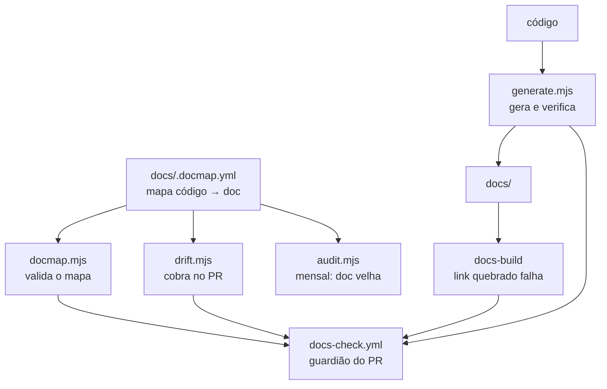

# Como a documentação se mantém viva

Documentação não morre por falta de escrita inicial. Morre por **drift**: o
código muda, a doc fica, e um dia alguém percebe que ela descreve um sistema
que não existe mais. A partir daí ninguém confia em nenhuma página, inclusive
nas que estão certas.

Esta página explica o mecanismo que existe para evitar isso. Leia se o CI
reclamou de você — e leia antes de desligar qualquer peça dele.

## O princípio: gerar > verificar > lembrar

Três níveis, em ordem decrescente de confiabilidade:

| nível | como funciona | quando usar |
|---|---|---|
| **Gerar** | a doc sai do código; drift é impossível | a lista É o conteúdo |
| **Verificar** | a doc é escrita à mão, o CI confere que está completa | a prosa vale mais que a lista |
| **Lembrar** | o CI avisa quem abriu o PR | quando julgamento humano é necessário |

O último nível é o mais fraco, e por isso é o último recurso. Um aviso que
ninguém lê não protege nada.

### Número em prosa é caso de *verificar*

Um número no meio de uma frase — "os 30 ADRs", "o próximo é `0031`" — não é
gerável: ele mora dentro do texto, e substituí-lo por um placeholder tornaria a
prosa ilegível na fonte. Mas é **verificável**, e é aí que ele deve morar.

Sem isso, ele envelhece calado. Foi o que aconteceu: o site publicado dizia
"28 deles" e "as 29 decisões" quando já eram 30, e "o próximo é 0030" com o
0030 pronto. Nada quebrou, nenhum check reclamou — só ficou errado.

O `generate.mjs` agora confere essas afirmações contra a realidade do
diretório. E **padrão que não casa também reprova**: um check cuja regex parou
de encontrar a frase é pior que check nenhum, porque fica verde para sempre
dizendo que conferiu algo que não olhou. Quando a frase mudar, o CI diz `CEGO`
e pede o ajuste do padrão.

Acrescentar uma afirmação nova à conferência é uma entrada na lista
`afericoes` de `verificarContagensDeAdr`: arquivo, padrão, valor esperado.

## As peças



### `docs/.docmap.yml` — o mapa

Liga caminhos de código aos documentos que dependem deles. É a única fonte que
diz "quem mexer aqui precisa revisar aquilo".

Duas severidades: `block` reprova o PR, `warn` só comenta. E um atributo
`generated: true`, que marca os documentos que saem do gerador.

### `docmap.mjs` — valida o mapa

Roda antes de tudo, porque um mapa quebrado faz o resto mentir. Ele reprova se:

- **um glob não casa com nenhum arquivo** — regra morta. Nunca dispara, e passa
  a impressão de cobertura que não existe. Este é o defeito mais silencioso que
  um docmap pode ter, e foi encontrado em 8 globs quando o validador entrou.
- um documento apontado pelo mapa não existe
- há id duplicado ou `severity` inválida

### `generate.mjs` — gera e verifica

Dois modos de saída:

**Arquivo inteiro** — `docs/reference/scripts.md`. Não há prosa a preservar: a
lista de comandos é o conteúdo. Sai do `package.json` de cada pacote e dos
alvos anotados do `Makefile`.

**Bloco marcado** — o trecho entre `<!-- BEGIN:GENERATED:<id> -->` e
`<!-- END:GENERATED:<id> -->` dentro de um arquivo escrito à mão. É o caso de
`configuration.md` e `events.md`: ali a prosa ("o que quebra quando esta
variável está errada") vale muito mais que a lista, mas a **lista** precisa
estar completa. O bloco é o inventário; o texto em volta é a explicação.

O inventário marca com ⚠️ o que aparece no código e **não** tem descrição na
prosa. Foi assim que `tool.result` e `agent.response` — dois tipos de evento
reais — apareceram depois de terem ficado de fora na primeira escrita.

`--check` não escreve nada e falha se algo estaria diferente. É o modo do CI.

### `drift.mjs` — cobra no PR

Cruza `git diff --name-only <base>...HEAD` com o mapa. Para cada regra acionada
cujo documento não foi tocado: `block` reprova, `warn` comenta.

### `audit.mjs` — a auditoria mensal

O drift check pega doc que ficou **errada** num PR. A auditoria pega doc que
ficou **velha** sem ninguém encostar — que é mais difícil de notar. Ela reporta:

- página parada há meses cujo código correspondente mudou depois
- `TODO(humano)` pendentes
- referências `arquivo:linha` que não resolvem mais
- ADRs em `proposed` há mais de 60 dias

Sempre na **mesma** issue, atualizada. Issue nova todo mês vira spam, e spam é
desligado.

### O build do site

`onBrokenLinks`, `onBrokenAnchors` e `onBrokenMarkdownLinks` estão em `throw`.
Mover um arquivo sem corrigir quem aponta para ele derruba o CI em vez de virar
404 em produção. É o mecanismo mais barato do conjunto inteiro.

### Página nova precisa entrar no `sidebars.ts` à mão

O conteúdo do Markdown vive em `docs/`, mas o **roteamento** vive em
`website/sidebars.ts` — e as seções enumeram os itens uma a uma, em vez de varrer
diretório. Criar um arquivo em `docs/` e não acrescentá-lo lá produz uma página
que existe, é servida por URL direta, e **não aparece na navegação**.

O build **não** reprova nisso: página órfã não é link quebrado. É verificação
visual, e é o único passo do mecanismo que não tem rede de segurança — depois de
`pnpm docs:build`, abra a barra lateral e confirme que a página está lá.

### `api-render-check.mjs` — build verde não é página que renderiza

Esta peça existe por uma lição paga caro: **as 117 páginas de operação da
referência de API subiram mortas nas releases `v1.0.0` e `v1.0.1`**, e nenhum
check viu.

O config do Docusaurus não declarava `docItemComponent: '@theme/ApiItem'`, então
o Docusaurus usava o `@theme/DocItem` padrão. O `ApiItem` é o único lugar do
`docusaurus-theme-openapi-docs` que monta o `<Provider>` do redux, e o
`@theme/ApiExplorer/MethodEndpoint` que cada `.api.mdx` importa lê esse store com
`useSelector`. Sem o wrapper, contexto nulo — e o error boundary trocava a página
inteira por *"Esta página deu erro."*.

O modo de falha é o que interessa aqui, porque ele derrota todas as outras peças
deste mecanismo:

| etapa | resultado |
|---|---|
| MDX compila | ✅ os componentes de tema existem e resolvem |
| SSR renderiza | ✅ o HTML servido tem o conteúdo da rota |
| `pnpm docs:build` | ✅ **verde** |
| hidratação no navegador | ❌ a página é apagada |

Ou seja: **"o build passou" nunca foi prova de que a página funciona.** O
`api-render-check.mjs` roda depois do `docs:build` e afirma, em cada página de
operação, a marca estrutural que só o `ApiItem` produz
(`openapi-left-panel__container` / `openapi-right-panel__container`, conferidas na
fonte do tema, não escolhidas por palpite).

Ele pega **esta classe** de regressão, não toda falha de hidratação — pegar todas
exigiria navegador headless, e essa dependência não se paga para o risco que
sobra. Se outra escapar, é aí que essa conversa começa.

Do mesmo episódio saiu a regra `site-e-publicacao` do mapa: `website/**` não
aparecia em regra nenhuma, e mexer no config do site não cobrava documentação.

### A publicação, um site por degrau

Cada branch permanente publica no seu próprio lugar do mesmo GitHub Pages:

| degrau | URL | indexado por buscador |
|---|---|---|
| `main` | `https://daneiel.github.io/brabo/` | ✅ |
| `qa` | `https://daneiel.github.io/brabo/qa/` | ❌ |
| `dev` | `https://daneiel.github.io/brabo/dev/` | ❌ |

Isso fecha um vão da esteira: entre um merge em `dev` e a promoção final, ler a
documentação daquele estado exigia clonar o repositório. O `docs-check` constrói o
site em todo PR mas **descarta o build** — o veredito dele é "constrói sem link
quebrado", nunca "está em algum lugar onde eu possa abrir". E foi justamente essa
distância entre escrever e olhar que deixou a referência de API subir quebrada por
duas releases.

Três detalhes que não são óbvios e que já custaram um erro cada:

- **`baseUrl` vem de `DOCS_BASE_URL`**, com o valor de produção como default. Ele
  entra em toda URL de asset: um site em `/brabo/dev/` com `baseUrl: '/brabo/'`
  carrega o HTML e nada mais, e a página fica *quebrada sem erro*.
- **`noIndex` fora da `main` exige `forceIgnoreNoIndex` na busca.** O
  `@easyops-cn/docusaurus-search-local` descarta toda página com
  `<meta name="robots" content="noindex">`, então os dois recursos se anulavam: os
  degraus publicariam com a busca morta, índice de 666 bytes, *"No results"* para
  tudo. `noIndex` fala com buscador **externo**; `forceIgnoreNoIndex` fala com o
  índice **local**.
- **A `main` monta a árvore antes de publicar**, trazendo `/dev/` e `/qa/` de
  volta. `keep_files: true` seria mais simples e estaria errado: nunca removeria
  nada, e página apagada do repositório ficaria publicada para sempre.

### Publicar são DOIS workflows, e só um é nosso

Isto engana quem vai procurar o deploy na aba Actions:

| ordem | workflow | onde vive | o que faz |
|---|---|---|---|
| 1 | **`Documentação`** (`docs-deploy.yml`) | `.github/workflows/` | constrói o site e **commita na `gh-pages`** |
| 2 | **`pages build and deployment`** | `dynamic/pages/` — **gerado pelo GitHub** | lê a `gh-pages` e **serve** |

O segundo não está no repositório e não aparece na lista de workflows versionados;
o GitHub o cria sozinho quando a fonte do Pages é uma branch. Nosso workflow
termina no commit — ele **não** publica no Pages, apesar de o job dele ainda se
chamar "Publicar no GitHub Pages".

> **Consequência prática:** o site pode estar desatualizado com o `Documentação`
> verde. Se o `build_type` do Pages não for `legacy`/`gh-pages`, o commit acontece
> e ninguém serve — e nada no CI fica vermelho. A conferência é
> `gh api repos/daneiel/brabo/pages`, registrada em
> [Rulesets](../reference/rulesets.md).

O desenho inteiro, com as alternativas descartadas, está no
[ADR 0034](../adr/0034-documentacao-publicada-por-degrau.md).

## Rodando na sua máquina

```bash
pnpm docs:check      # valida o mapa + confere se os gerados estão em dia
pnpm docs:generate   # regenera
pnpm docs:drift      # simula o check do PR (origin/dev...HEAD)
pnpm docs:build      # o build que o CI roda
pnpm docs:start      # servidor local, com hot reload

# a referência de API renderiza? precisa do build acima, e não entra no
# docs:check porque aquele não constrói o site
node scripts/docs/api-render-check.mjs
```

Ou, se estiver no Claude Code, `/sync-docs` faz o ciclo completo e entrega um
relatório do que mudou, do que virou `TODO(humano)`, e do que foi
deliberadamente **não** mudado.

## Quando o check reclama injustamente

Ele vai reclamar injustamente às vezes. Um refactor que renomeia variáveis
internas dispara `dominio-e-regras` sem mudar nenhuma regra de negócio. Isso é
esperado: o mapa trabalha por caminho de arquivo, não por semântica.

Existem **duas** saídas, e as duas exigem um humano dizendo por quê:

```
label do PR:      docs-not-needed
ou no corpo:      docs-not-needed: refactor interno, nenhuma RN alterada
```

Use sem culpa quando for o caso. O escape hatch existe **de propósito**: sem
saída legítima, o hábito que se forma é burlar — um commit de enfeite na doc só
para o check passar. Aí o mecanismo passa a mentir, que é pior do que não
existir.

O que **não** vale é usar o escape hatch por pressa. Se você usou três vezes
na mesma semana pela mesma regra, o problema é a regra: ajuste o glob no
`docs/.docmap.yml`, ou baixe a severidade de `block` para `warn`.

## Quando o mecanismo está errado

| sintoma | conserto |
|---|---|
| regra dispara em mudança irrelevante | glob amplo demais — estreite o `watch` |
| regra nunca dispara | glob morto — `pnpm docs:check` acusa |
| gerado sempre fora de dia no CI | alguém editou à mão; conserte o gerador ou a fonte |
| build quebra em `{` ou HTML solto | `.md` é CommonMark; se precisa de componente React, renomeie para `.mdx` |
| auditoria reporta a si mesma | adicione o arquivo à lista `META` em `audit.mjs` |

## O que este mecanismo não faz

**Não verifica se o texto está correto.** Ele verifica se o texto foi
*revisado* quando o código mudou, e se as listas estão completas. Uma frase
factualmente errada que ninguém tocou passa em todos os checks — para isso
existe leitura humana, e o `/sync-docs`.

**Não escreve documentação.** Gera inventário e cobra revisão. O que uma
variável faz quando está errada, por que um teto existe, o que investigar num
incidente — isso continua sendo trabalho de escrever.

**Não cobra o `README.md` nem o que nenhuma regra vigia.** O docmap é piso, não
teto: em 2026-07-29 nenhuma regra olhava para o coração da observabilidade
(`tracing.ts`, `infrastructure/observability/**`, `telemetry/**`,
`lib/logger.ts`), e o `README.md` quase não é exigido por regra nenhuma. Entregar
só o que o CI cobra é como as duas frases sobre `OTEL_EXPORTER_OTLP_ENDPOINT`
ficaram erradas por meses. Ao mudar código, varra `docs/` procurando o que a
mudança tornou falso — inclusive o que ninguém pediu para você olhar.
