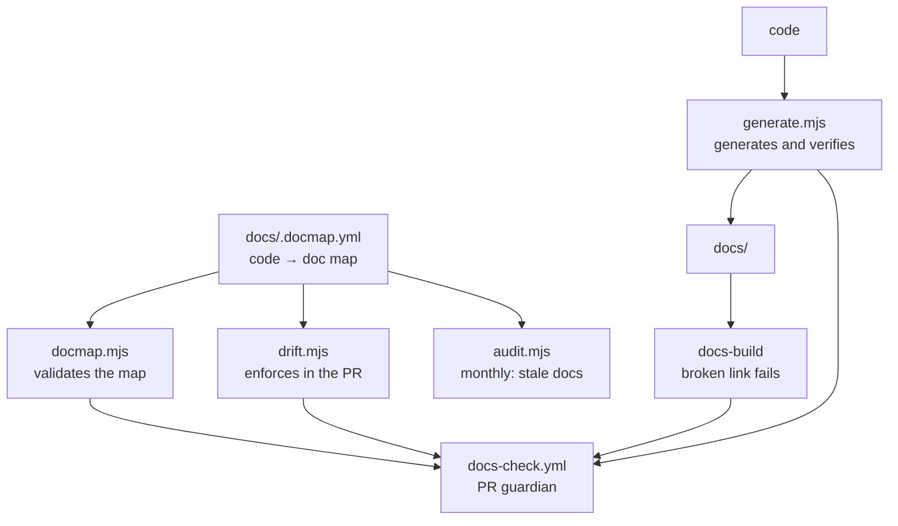

# How documentation stays alive

Documentation doesn't die from a lack of initial writing. It dies from
**drift**: the code changes, the doc stays, and one day someone
notices it describes a system that no longer exists. From that point
on nobody trusts any page, including the ones that are right.

This page explains the mechanism that exists to prevent that. Read it
if CI complained about you — and read it before turning off any part
of it.

## The principle: generate > verify > remember

Three levels, in decreasing order of reliability:

| level | how it works | when to use it |
|---|---|---|
| **Generate** | the doc comes out of the code; drift is impossible | the list IS the content |
| **Verify** | the doc is hand-written, CI checks that it's complete | the prose matters more than the list |
| **Remember** | CI warns whoever opened the PR | when human judgment is required |

The last level is the weakest, and that's why it's the last resort. A
warning nobody reads protects nothing.

### A number in prose is a *verify* case

A number in the middle of a sentence — "the 30 ADRs," "next is
`0031`" — isn't generatable: it lives inside the text, and replacing
it with a placeholder would make the source prose unreadable. But it's
**verifiable**, and that's where it should live.

Without that, it ages silently. That's what happened: the published
site said "28 of them" and "the 29 decisions" when there were already
30, and "next is 0030" with 0030 already done. Nothing broke, no check
complained — it just went wrong.

The most expensive case was the **version announced in prose**: the
README announced `v0.1.0` from Phase 5 all the way to v2.1.0 — seven
releases behind reality, in the first thing a newcomer reads. The
check compares the prose against the first `## vX.Y.Z` in the
CHANGELOG, which is written by the release workflow and comes back via
PR; a tag read from git wouldn't work, because the CI's shallow
checkout might not have any tag at all. The **badge**, on the other
hand, left the check and became generation: it reads the GitHub
release directly (`shields.io/github/v/release`) and updates itself —
you only verify what can't be generated.

And it happened **once per entry point**. `docs/intro.md` — the
published site's first page, which not everyone reaches through the
README — kept saying "Phases 1 to 5 complete, v0.1.0" while the
product was at Phase 26. Checking only the README never protected the
second door, so `verificarVersaoAnunciada` received both files in a
list, and `scripts/ci/readme-version.ts` started writing to both in
the same commit as the CHANGELOG. The two halves move together on
purpose: a check that demands what the generator doesn't write would
make every release be born red on a PR the bot opens and nobody can
fix.

The `intro.md` pattern requires the **whole** sentence — "Phases 1
through NN complete, version vX.Y.Z" — not just the version: the two
halves age together, and matching only half would leave the phase
count lying next to a correct version. The phase count isn't
generatable from here: the release knows the version, not the phase.

`generate.mjs` now checks these claims against the directory's
reality. And **a pattern that stops matching also fails**: a check
whose regex stopped finding the sentence is worse than no check at
all, because it stays green forever claiming to have checked something
it never looked at. When the sentence changes, CI says `CEGO` and
asks for the pattern to be adjusted.

Adding a new claim to the check is an entry in one of the `afericoes`
lists — `verificarContagensDeAdr` (file, pattern, expected value) when
the source of truth is the ADR directory, `verificarVersaoAnunciada`
when it's the CHANGELOG's latest release — or a function of its own
next to them, when it's neither.

## The pieces



### `docs/.docmap.yml` — the map

Links code paths to the documents that depend on them. It's the only
source that says "whoever touches this needs to review that."

Two severities: `block` fails the PR, `warn` only comments. And a
`generated: true` attribute, which marks the documents that come out
of the generator.

### `docmap.mjs` — validates the map

Runs before everything else, because a broken map makes the rest lie.
It fails if:

- **a glob matches no file** — a dead rule. It never fires, and gives
  the impression of coverage that doesn't exist. This is the most
  silent defect a docmap can have, and it was found in 8 globs when
  the validator was introduced.
- a document the map points to doesn't exist
- there's a duplicate id or an invalid `severity`

### `generate.mjs` — generates and verifies

Two output modes:

**Whole file** — `docs/reference/scripts.md`. There's no prose to
preserve: the list of commands is the content. It comes from each
package's `package.json` and the `Makefile`'s annotated targets.

**Marked block** — the stretch between `<!-- BEGIN:GENERATED:<id> -->`
and `<!-- END:GENERATED:<id> -->` inside a hand-written file. That's
the case for `configuration.md` and `events.md`: there, the prose
("what breaks when this variable is wrong") is worth much more than
the list, but the **list** needs to be complete. The block is the
inventory; the surrounding text is the explanation.

The inventory marks with ⚠️ whatever shows up in the code and has
**no** description in the prose. That's how `tool.result` and
`agent.response` — two real event types — showed up after being left
out of the first draft.

`--check` writes nothing and fails if anything would be different.
That's CI's mode.

### `drift.mjs` — enforces it in the PR

Cross-references `git diff --name-only <base>...HEAD` with the map.
For every triggered rule whose document wasn't touched: `block` fails
it, `warn` comments.

### `audit.mjs` — the monthly audit

The drift check catches a doc that went **wrong** in a PR. The audit
catches a doc that went **stale** with nobody touching it — which is
harder to notice. It reports:

- pages untouched for months whose corresponding code changed since
- pending `TODO(human)` items
- `file:line` references that no longer resolve
- ADRs in `proposed` status for more than 60 days

Always in the **same** issue, updated in place. A new issue every
month becomes spam, and spam gets turned off.

### The site build

`onBrokenLinks`, `onBrokenAnchors` and `onBrokenMarkdownLinks` are set
to `throw`. Moving a file without fixing whoever points to it breaks
CI instead of turning into a 404 in production. It's the cheapest
mechanism in the whole set.

### A new page needs to be added to `sidebars.ts` by hand

The Markdown content lives in `docs/`, but the **routing** lives in
`website/sidebars.ts` — and its sections enumerate items one by one,
instead of scanning the directory. Creating a file in `docs/` without
adding it there produces a page that exists, is served by direct URL,
and **doesn't show up in navigation**.

The build **doesn't** fail on this: an orphan page isn't a broken
link. It's a visual check, and it's the only step in the mechanism
with no safety net — after `pnpm docs:build`, open the sidebar and
confirm the page is there.

### `api-render-check.mjs` — a green build isn't a page that renders

This piece exists because of an expensive lesson: **the API
reference's 117 operation pages went live dead in releases `v1.0.0`
and `v1.0.1`**, and no check caught it.

The Docusaurus config didn't declare `docItemComponent:
'@theme/ApiItem'`, so Docusaurus used the default `@theme/DocItem`.
`ApiItem` is the only place in `docusaurus-theme-openapi-docs` that
mounts redux's `<Provider>`, and the `@theme/ApiExplorer/MethodEndpoint`
each `.api.mdx` imports reads that store with `useSelector`. Without
the wrapper, the context is null — and the error boundary swapped the
whole page for *"This page crashed."*

The failure mode is what matters here, because it defeats every other
piece of this mechanism:

| stage | result |
|---|---|
| MDX compiles | ✅ theme components exist and resolve |
| SSR renders | ✅ the served HTML has the route's content |
| `pnpm docs:build` | ✅ **green** |
| hydration in the browser | ❌ the page gets wiped |

In other words: **"the build passed" was never proof the page
works.** `api-render-check.mjs` runs after `docs:build` and asserts,
on every operation page, the structural marker only `ApiItem`
produces (`openapi-left-panel__container` /
`openapi-right-panel__container`, confirmed against the theme's
source, not guessed at).

It catches **this class** of regression, not every hydration failure —
catching all of them would require a headless browser, and that
dependency isn't worth the residual risk. If another one slips through,
that's where this conversation starts.

The same episode produced the map's `site-e-publicacao` rule:
`website/**` wasn't covered by any rule, and changing the site config
didn't demand documentation.

### Publishing, one site per rung

Each permanent branch publishes to its own spot on the same GitHub
Pages:

| branch | URL | indexed by search engines |
|---|---|---|
| — (index) | `https://daneiel.github.io/brabo/` | ❌ |
| `main` | `https://daneiel.github.io/brabo/prd/` | ✅ |
| `qa` | `https://daneiel.github.io/brabo/qa/` | ❌ |
| `dev` | `https://daneiel.github.io/brabo/dev/` | ❌ |

All three have been **symmetric** since
[ADR 0071](../adr/0071-publicacao-simetrica-por-degrau.md); the root
is a generated page listing all three with each one's stamped version,
and every site has a selector at the top for switching rungs. Before
that, `main` published at the root, and that special case forced the
workflow to preserve `/dev/` and `/qa/` on a path that only ran a
third of the time.

**The path isn't the branch name.**
[ADR 0073](../adr/0073-o-caminho-publicado-nomeia-o-ambiente.md)
separated the two: the address names the **environment** for readers,
and `main` is vocabulary for whoever commits. That's why `main`
publishes at `/prd/`; `qa` and `dev` match by coincidence, not by
rule. The branch→path map exists at one point per process — the
workflow's "which rung, and where it publishes" step, the `DEGRAUS`
table in `docusaurus.config.ts`, and the one in `landing.mjs` — and
everything else derives from it.

Two consequences worth remembering before touching this:

- **`/brabo/main/` used to be published, and no longer is.** Since the
  tree is assembled and pushed with `keep_files: false`, the directory
  disappears. What preserves saved links is the root's `404.html`,
  which **rewrites** the prefix (`/brabo/main/<something>` →
  `/brabo/prd/<something>`) as its own case, separate from the generic
  redirect — which would produce `/brabo/prd/main/<something>`. The
  loop guard only covers paths that exist (`prd|qa|dev`).
- **`/prd/` was seeded from `gh-pages:main`** during the transition,
  for the same reason ADR 0071 seeded `/main/` from the old root:
  without it, `/brabo/prd/` would respond 404 between `dev`'s first
  push and the next promotion to `main`. The seed is **rewritten** from
  `/brabo/main/` to `/brabo/prd/`, because `404.html` doesn't save
  sub-resources — CSS and JS requested at the old address would get
  HTML back with a 404 status, and the site would serve bare text.

This closes a gap in the pipeline: between a merge into `dev` and the
final promotion, reading the documentation for that state required
cloning the repository. `docs-check` builds the site on every PR but
**discards the build** — its verdict is "builds with no broken links,"
never "lives somewhere I can open." And it was exactly that gap
between writing and looking that let the API reference go live broken
for two releases.

Three details that aren't obvious and have each already cost a bug:

- **`baseUrl` comes from `DOCS_BASE_URL`**, defaulting to the
  production value. It goes into every asset URL: a site at
  `/brabo/dev/` with `baseUrl: '/brabo/'` loads the HTML and nothing
  else, and the page is *broken with no error*.
- **The rung is declared in `DOCS_BRANCH`, not deduced from
  `baseUrl`.** This used to be `BASE_URL === '/brabo/'`, and it worked
  while `main` was the only one at the root. With all three under a
  subdirectory, that comparison turns false for `main` too, and the
  effect would be `noIndex` on the REAL documentation — outside
  Google, silently, with CI green, because nothing in the build fails
  for under-indexing. ADR 0073 is exactly the scenario this separation
  was built for: the path changed to `/prd/` and `E_PRODUCAO` didn't
  need to know about it.
- **`noIndex` outside `main` requires `forceIgnoreNoIndex` in
  search.** `@easyops-cn/docusaurus-search-local` discards every page
  with `<meta name="robots" content="noindex">`, so the two safeguards
  would cancel each other: the rungs would publish with search dead, a
  666-byte index, *"No results"* for everything. `noIndex` talks to
  **external** search engines; `forceIgnoreNoIndex` talks to the
  **local** index.
- **`main` assembles the tree before publishing**, bringing `/dev/`
  and `/qa/` back. `keep_files: true` would be simpler and would be
  wrong: it would never remove anything, and a page deleted from the
  repository would stay published forever.

### Publishing is TWO workflows, and only one is ours

This trips up anyone looking for the deploy in the Actions tab:

| order | workflow | where it lives | what it does |
|---|---|---|---|
| 1 | **`Documentação`** (`docs-deploy.yml`) | `.github/workflows/` | builds the site and **commits to `gh-pages`** |
| 2 | **`pages build and deployment`** | `dynamic/pages/` — **generated by GitHub** | reads `gh-pages` and **serves it** |

The second one isn't in the repository and doesn't show up in the list
of versioned workflows; GitHub creates it on its own when the Pages
source is a branch. Our workflow ends at the commit — it does **not**
publish to Pages, even though its job is still called "Publish to
GitHub Pages."

> **Practical consequence:** the site can be stale even with
> `Documentação` green. If Pages' `build_type` isn't `legacy`/`gh-pages`,
> the commit happens and nobody serves it — and nothing in CI turns
> red. The check is `gh api repos/daneiel/brabo/pages`, recorded in
> [Rulesets](../reference/rulesets.md).

The whole design, with the discarded alternatives, is in
[ADR 0034](../adr/0034-documentacao-publicada-por-degrau.md).

## Running it on your machine

```bash
pnpm docs:check      # validates the map + checks generated content is up to date
pnpm docs:generate   # regenerates
pnpm docs:drift      # simulates the PR check (origin/dev...HEAD)
pnpm docs:build      # the build CI runs
pnpm docs:start      # local server, with hot reload

# does the API reference render? needs the build above, and isn't part
# of docs:check because that one doesn't build the site
node scripts/docs/api-render-check.mjs
```

Or, if you're in Claude Code, `/sync-docs` runs the whole cycle and
delivers a report of what changed, what became a `TODO(human)`, and
what was deliberately **left** unchanged.

## When the check complains unfairly

It will complain unfairly sometimes. A refactor that renames internal
variables triggers `dominio-e-regras` without changing any business
rule. That's expected: the map works by file path, not by semantics.

There are **two** ways out, and both require a human explaining why:

```
PR label:      docs-not-needed
or in the body: docs-not-needed: internal refactor, no RN changed
```

Use it without guilt when it applies. The escape hatch exists **on
purpose**: without a legitimate way out, the habit that forms is to
cheat — a cosmetic commit to the doc just to make the check pass. Then
the mechanism starts lying, which is worse than not existing.

What's **not** okay is using the escape hatch out of haste. If you
used it three times in the same week for the same rule, the rule is
the problem: adjust the glob in `docs/.docmap.yml`, or lower the
severity from `block` to `warn`.

## When the mechanism itself is wrong

| symptom | fix |
|---|---|
| rule fires on an irrelevant change | glob too broad — narrow the `watch` |
| rule never fires | dead glob — `pnpm docs:check` flags it |
| generated content is always stale in CI | someone hand-edited it; fix the generator or the source |
| build breaks on `{` or loose HTML | `.md` is CommonMark; if it needs a React component, rename to `.mdx` |
| the audit reports itself | add the file to the `META` list in `audit.mjs` |

## What this mechanism doesn't do

**It doesn't check whether the text is correct.** It checks whether
the text was *reviewed* when the code changed, and whether the lists
are complete. A factually wrong sentence nobody touched passes every
check — that's what human reading, and `/sync-docs`, are for.

**It doesn't write documentation.** It generates an inventory and
demands review. What a variable does when it's wrong, why a cap
exists, what to investigate during an incident — that's still work
that has to be written.

**It doesn't enforce `README.md`, nor anything no rule watches.** The
docmap is a floor, not a ceiling: as of 2026-07-29 no rule was watching
the heart of observability (`tracing.ts`,
`infrastructure/observability/**`, `telemetry/**`, `lib/logger.ts`),
and `README.md` is barely required by any rule at all. Delivering only
what CI demands is how the two sentences about
`OTEL_EXPORTER_OTLP_ENDPOINT` stayed wrong for months. When you change
code, sweep `docs/` looking for what the change made false — including
what nobody asked you to look at.
