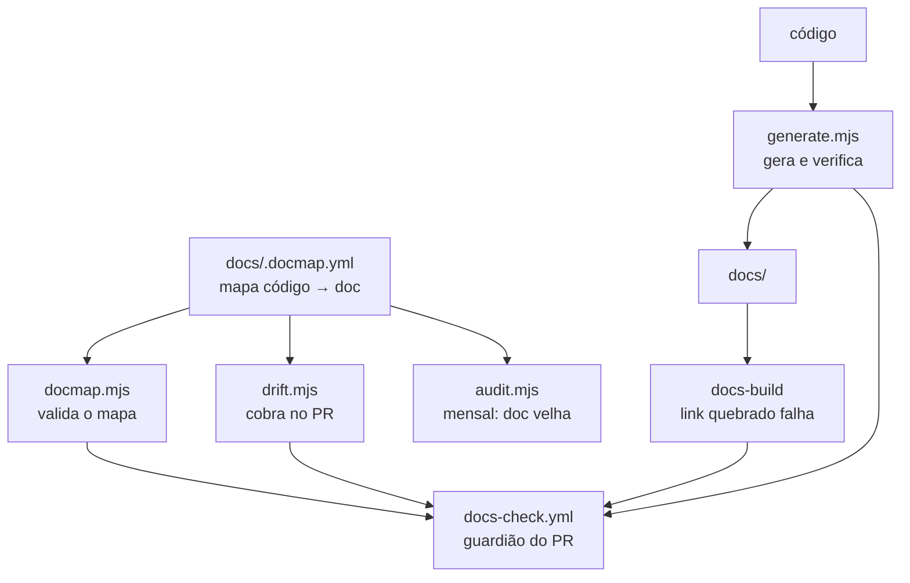

# Como a documentação se mantém viva

Documentação não morre por falta de escrita inicial. Morre por **drift**: o
código muda, a doc fica, e um dia alguém percebe que ela descreve um sistema
que não existe mais. A partir daí ninguém confia em nenhuma página, inclusive
nas que estão certas.

Esta página explica o mecanismo que existe para evitar isso. Leia se o CI
reclamou de você — e leia antes de desligar qualquer peça dele.

## O princípio: gerar > verificar > lembrar

Três níveis, em ordem decrescente de confiabilidade:

| nível | como funciona | quando usar |
|---|---|---|
| **Gerar** | a doc sai do código; drift é impossível | a lista É o conteúdo |
| **Verificar** | a doc é escrita à mão, o CI confere que está completa | a prosa vale mais que a lista |
| **Lembrar** | o CI avisa quem abriu o PR | quando julgamento humano é necessário |

O último nível é o mais fraco, e por isso é o último recurso. Um aviso que
ninguém lê não protege nada.

## As peças



### `docs/.docmap.yml` — o mapa

Liga caminhos de código aos documentos que dependem deles. É a única fonte que
diz "quem mexer aqui precisa revisar aquilo".

Duas severidades: `block` reprova o PR, `warn` só comenta. E um atributo
`generated: true`, que marca os documentos que saem do gerador.

### `docmap.mjs` — valida o mapa

Roda antes de tudo, porque um mapa quebrado faz o resto mentir. Ele reprova se:

- **um glob não casa com nenhum arquivo** — regra morta. Nunca dispara, e passa
  a impressão de cobertura que não existe. Este é o defeito mais silencioso que
  um docmap pode ter, e foi encontrado em 8 globs quando o validador entrou.
- um documento apontado pelo mapa não existe
- há id duplicado ou `severity` inválida

### `generate.mjs` — gera e verifica

Dois modos de saída:

**Arquivo inteiro** — `docs/reference/scripts.md`. Não há prosa a preservar: a
lista de comandos é o conteúdo. Sai do `package.json` de cada pacote e dos
alvos anotados do `Makefile`.

**Bloco marcado** — o trecho entre `<!-- BEGIN:GENERATED:<id> -->` e
`<!-- END:GENERATED:<id> -->` dentro de um arquivo escrito à mão. É o caso de
`configuration.md` e `events.md`: ali a prosa ("o que quebra quando esta
variável está errada") vale muito mais que a lista, mas a **lista** precisa
estar completa. O bloco é o inventário; o texto em volta é a explicação.

O inventário marca com ⚠️ o que aparece no código e **não** tem descrição na
prosa. Foi assim que `tool.result` e `agent.response` — dois tipos de evento
reais — apareceram depois de terem ficado de fora na primeira escrita.

`--check` não escreve nada e falha se algo estaria diferente. É o modo do CI.

### `drift.mjs` — cobra no PR

Cruza `git diff --name-only <base>...HEAD` com o mapa. Para cada regra acionada
cujo documento não foi tocado: `block` reprova, `warn` comenta.

### `audit.mjs` — a auditoria mensal

O drift check pega doc que ficou **errada** num PR. A auditoria pega doc que
ficou **velha** sem ninguém encostar — que é mais difícil de notar. Ela reporta:

- página parada há meses cujo código correspondente mudou depois
- `TODO(humano)` pendentes
- referências `arquivo:linha` que não resolvem mais
- ADRs em `proposed` há mais de 60 dias

Sempre na **mesma** issue, atualizada. Issue nova todo mês vira spam, e spam é
desligado.

### O build do site

`onBrokenLinks`, `onBrokenAnchors` e `onBrokenMarkdownLinks` estão em `throw`.
Mover um arquivo sem corrigir quem aponta para ele derruba o CI em vez de virar
404 em produção. É o mecanismo mais barato do conjunto inteiro.

## Rodando na sua máquina

```bash
pnpm docs:check      # valida o mapa + confere se os gerados estão em dia
pnpm docs:generate   # regenera
pnpm docs:drift      # simula o check do PR (origin/dev...HEAD)
pnpm docs:build      # o build que o CI roda
pnpm docs:start      # servidor local, com hot reload
```

Ou, se estiver no Claude Code, `/sync-docs` faz o ciclo completo e entrega um
relatório do que mudou, do que virou `TODO(humano)`, e do que foi
deliberadamente **não** mudado.

## Quando o check reclama injustamente

Ele vai reclamar injustamente às vezes. Um refactor que renomeia variáveis
internas dispara `dominio-e-regras` sem mudar nenhuma regra de negócio. Isso é
esperado: o mapa trabalha por caminho de arquivo, não por semântica.

Existem **duas** saídas, e as duas exigem um humano dizendo por quê:

```
label do PR:      docs-not-needed
ou no corpo:      docs-not-needed: refactor interno, nenhuma RN alterada
```

Use sem culpa quando for o caso. O escape hatch existe **de propósito**: sem
saída legítima, o hábito que se forma é burlar — um commit de enfeite na doc só
para o check passar. Aí o mecanismo passa a mentir, que é pior do que não
existir.

O que **não** vale é usar o escape hatch por pressa. Se você usou três vezes
na mesma semana pela mesma regra, o problema é a regra: ajuste o glob no
`docs/.docmap.yml`, ou baixe a severidade de `block` para `warn`.

## Quando o mecanismo está errado

| sintoma | conserto |
|---|---|
| regra dispara em mudança irrelevante | glob amplo demais — estreite o `watch` |
| regra nunca dispara | glob morto — `pnpm docs:check` acusa |
| gerado sempre fora de dia no CI | alguém editou à mão; conserte o gerador ou a fonte |
| build quebra em `{` ou HTML solto | `.md` é CommonMark; se precisa de componente React, renomeie para `.mdx` |
| auditoria reporta a si mesma | adicione o arquivo à lista `META` em `audit.mjs` |

## O que este mecanismo não faz

**Não verifica se o texto está correto.** Ele verifica se o texto foi
*revisado* quando o código mudou, e se as listas estão completas. Uma frase
factualmente errada que ninguém tocou passa em todos os checks — para isso
existe leitura humana, e o `/sync-docs`.

**Não escreve documentação.** Gera inventário e cobra revisão. O que uma
variável faz quando está errada, por que um teto existe, o que investigar num
incidente — isso continua sendo trabalho de escrever.
