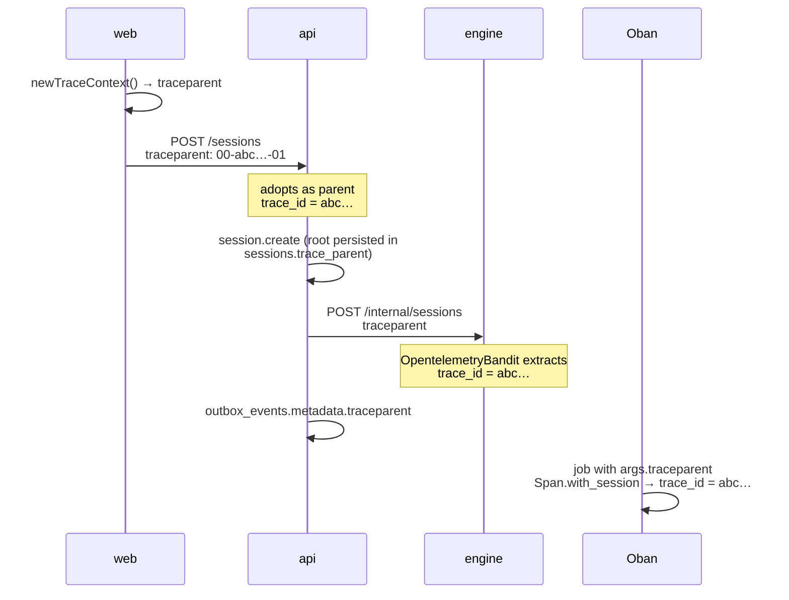

# How an action is followed through the system

A user action in Brabo crosses three processes and comes back: the click on
the web app calls the api, the api commands the engine over HTTP, the engine
responds over HTTP and fires async work via Oban, and the result travels back
through the api to the screen. When something goes wrong in the middle, the
question is always the same — **where did this go through, and where did it
stop?**

This page explains the mechanism that answers that. The decisions are in
[ADR 0026](../adr/0026-fase5-observabilidade-e-graceful-shutdown.md) (the
model) and [ADR 0035](../adr/0035-observabilidade-legivel-e-trace-sem-coletor.md)
(what changed afterward); the operational procedure is in the
[runbook](../runbook.md#observabilidade).

## The two things that don't get confused with each other

**Creating telemetry** and **delivering telemetry** are independent, and
that's the most important design choice here.

A span is always created — in production, in development and in the test
suite. What `OTEL_EXPORTER_OTLP_ENDPOINT` decides is whether it **leaves the
process**:

| environment | span created | `trace_id` in the log | span reaches Tempo |
|---|---|---|---|
| production (with Collector) | yes | yes | yes |
| `pnpm dev` | yes | yes | no |
| test suite | yes | yes | no |

This matters because **correlation doesn't depend on the collector**. The
`trace_id` that shows up in all three services' logs comes from the context,
not the exporter. In development you don't get the tree drawn in Grafana, but
you do get the thing used most day to day: the three services' log lines
tagged with the same id.

Before ADR 0035 the two things were tied together, and the consequence was
that development — the environment where logs get read the most — was the
only one with no correlation at all. If you find documentation, a comment, or
a runbook saying "without the variable there's no instrumentation," that's
text predating this correction.

## Where the `trace_id` is born

On the **web**, not the api. The browser generates a W3C `traceparent` per
request (`apps/web/src/lib/logger.ts`) and sends it in the header; the api
adopts it as the parent, and the engine adopts the api's. That's why the id
is the same across all three sides.



The web app **doesn't** load a browser SDK: that's ~90 kB, plus CORS on the
collector and an entry in the CSP's `connect-src`, to solve something 20
lines already solve. The accepted consequence is that the browser's log line
stays in the console — Alloy only reads pod stdout — and serves for a human
to match against the server span.

### The session is the root, and it's persisted

A session lasts minutes or hours, and a span only reaches the backend when it
closes. Keeping the root open that whole time would make the session
invisible exactly while it's happening. So `session.create` is short and its
`traceparent` is recorded in `sessions.trace_parent`; every later piece of
work uses it as a **remote parent**.

That's what makes a tool call happening right now show up in the same tree as
yesterday's `session.create`. The three injection points are deliberately
distinct — one funnel each:

| path | injection point |
|---|---|
| api → engine | `HttpApiToEngineClient.buildHeaders()` |
| engine → api | `EngineApiClient.headers/0` |
| outbox → Oban | `DrizzleOutboxRepository.append()` → `metadata` jsonb |

## The cross-layer path

The `trace_id` says *that* the action happened. The path says *where it went
through*.

In the api, each request carries a context in `AsyncLocalStorage`
(`infrastructure/observability/request-context.ts`) where boundaries register
themselves. The `@Traced('<layer>')` decorator is what registers, and the
HTTP boundary comes in for free via the interceptor. The result is one line
per request:

```
14:02:11.418 INFO  POST /projects/…/sessions — 34.1ms trace=4bf92f35
    trace_id: 4bf92f3577b34da6a3ce929d0e0e4736
    layers:
      interfaces        SessionsController.create         0ms
        ↳ application     CreateSessionUseCase.execute    31.2ms
          ↳ infrastructure  DrizzleUnitOfWork.runInTransaction  28.9ms
          ↳ infrastructure  DrizzleOutboxRepository.append       2.1ms
```

In production the same information comes out as the `path` field, in a JSON
line.

Three things worth knowing about this mechanism, because they explain what
you see:

- **The path doesn't depend on the span.** It comes from
  `AsyncLocalStorage`, which is why it works without a collector.
- **The guard runs before the interceptor.** Authentication, rate limiting,
  and RBAC happen before the context exists, so they don't show up in the
  path. They're ~1-3ms and already show up as `pg` spans in Tempo.
- **`@Traced` is on the critical paths, not on everything.** Sessions,
  actions, auth, and the api↔engine bridge. A method with no decorator
  simply doesn't show up in the line — its absence there doesn't mean it
  wasn't called.

### Why no controller has `@Traced`

Because it would be dangerous, not because it would be inconvenient. Nest
records route metadata (`@Public`, `@RequireRole`, `@ApiOperation`) **on the
method's function object**, and a legacy decorator that replaces
`descriptor.value` discards whatever came below it. On a controller that's
an authorization annotation that disappears while still compiling and
passing the suite.

The interceptor reads `getClass()` and `getHandler()` off the
`ExecutionContext` and gets the same class/method pair without touching any
controller file.

For the same technical reason, `@Traced` also doesn't go on anything that
returns an `Observable` or a generator: the "is it thenable?" heuristic
would classify them as synchronous and close the span before the stream
produces anything.

## Logging: readable for people, parseable for machines

The same event has two outputs, chosen by `NODE_ENV`:

- **development** — colored, indented, with the layer tree. In the api,
  `pino-pretty` runs in-process (not via `transport`, which blocks passing a
  function in `customPrettifiers`); in the engine, `PrettyLogFormatter`.
- **production** — **one line** of JSON per event. This isn't a preference:
  Alloy reads the pod's stdout line by line, and indented JSON would break
  the parser.

### `trace_id` is a contract

With an underscore, across all three services. The name is read by three
things that don't see each other:

1. Alloy's `stage.json`, which promotes it to structured metadata;
2. Loki's datasource `derivedFields`, which turns the line into a clickable
   link to Tempo;
3. this runbook's queries.

Renaming it to `traceId` compiles, passes the whole suite, and destroys the
clickable correlation. There's a test in each of the three services
protecting specifically the **name**, not the formatting.

### Secrets never enter the log

The api has a deliberately conservative `redact` list — one extra redacted
field costs nothing, one missing field is a permanent leak in Loki. It
covers `Authorization`, cookies, LLM API keys, access and refresh tokens,
passwords, the api↔engine service token, and the envelope-encryption DEK
material.

## Where to look when something doesn't show up

The first cut is always the same, and the log answers on its own:

- **`trace_id` in the log but no trace in Grafana** → it's export. In
  development this is expected; in a cluster, see
  [the runbook](../runbook.md#quando-nao-ha-trace-no-tempo).
- **no `trace_id` in the log** → it's context, and it's rare. In the api,
  `startTracing()` has to be the very first thing in the process
  (`src/tracing-boot.ts`); in the engine, `Engine.Telemetry.Otel.setup/0`
  runs before the supervision tree.
- **there's a trace but the path has only one step** → the method doesn't
  have `@Traced`, or it's under `interfaces/http/`, where it can't have one.
