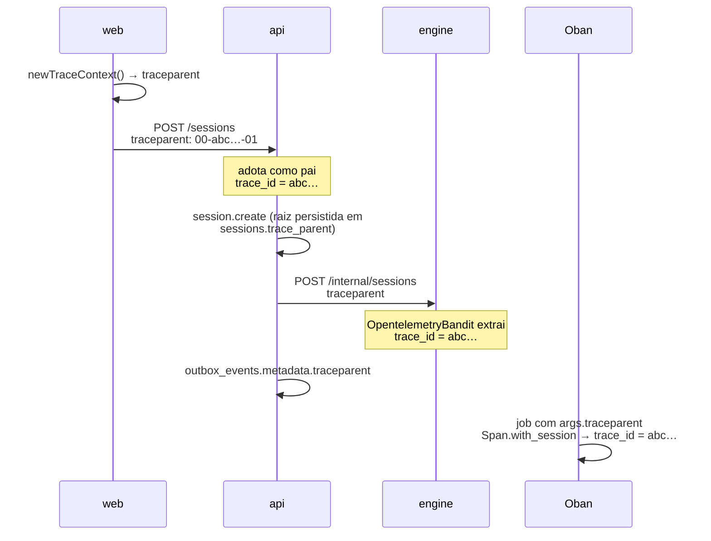

# Como se segue uma ação pelo sistema

Uma ação do usuário no Brabo atravessa três processos e volta: o clique na web
chama a api, a api comanda o engine por HTTP, o engine responde por HTTP e
dispara trabalho assíncrono por Oban, e o resultado volta pela api até a tela.
Quando algo dá errado no meio, a pergunta é sempre a mesma — **por onde isso
passou, e onde parou?**

Esta página explica o mecanismo que responde isso. As decisões estão no
[ADR 0026](../adr/0026-fase5-observabilidade-e-graceful-shutdown.md) (o modelo) e
no [ADR 0035](../adr/0035-observabilidade-legivel-e-trace-sem-coletor.md) (o que
mudou depois); o procedimento operacional está no
[runbook](../runbook.md#observabilidade).

## As duas coisas que não se confundem

**Criar telemetria** e **entregar telemetria** são independentes, e essa é a
escolha de desenho mais importante aqui.

Span é sempre criada — em produção, em desenvolvimento e na suite. O que
`OTEL_EXPORTER_OTLP_ENDPOINT` decide é se ela **sai do processo**:

| ambiente | span criada | `trace_id` no log | span vai ao Tempo |
|---|---|---|---|
| produção (com Collector) | sim | sim | sim |
| `pnpm dev` | sim | sim | não |
| suite de testes | sim | sim | não |

Isso importa porque **a correlação não depende do coletor**. O `trace_id` que
aparece no log dos três serviços vem do contexto, não do exportador. Em
desenvolvimento você não tem o desenho da árvore no Grafana, mas tem a coisa mais
usada no dia a dia: as linhas dos três serviços marcadas com o mesmo id.

Antes do ADR 0035 as duas coisas estavam atadas, e a consequência era que
desenvolvimento — o ambiente onde mais se lê log — era o único sem correlação
nenhuma. Se você encontrar documentação, comentário ou runbook dizendo que "sem a
variável não há instrumentação", é texto anterior a essa correção.

## Onde o `trace_id` nasce

Na **web**, e não na api. O browser gera um `traceparent` W3C por requisição
(`apps/web/src/lib/logger.ts`) e o manda no header; a api o adota como pai, o
engine adota o da api. Por isso o id é o mesmo dos três lados.



A web **não** carrega SDK de browser: são ~90 kB, mais CORS no coletor e uma
entrada no `connect-src` do CSP, para resolver algo que 20 linhas resolvem. A
consequência aceita é que a linha de log do browser fica no console — o Alloy só
lê stdout de pod — e serve para um humano casar com o span de servidor.

### A sessão é a raiz, e ela é persistida

Uma sessão dura minutos ou horas, e uma span só chega ao backend quando fecha.
Manter a raiz aberta esse tempo todo tornaria a sessão invisível justamente
enquanto acontece. Então `session.create` é curta e o `traceparent` dela é gravado
em `sessions.trace_parent`; todo trabalho posterior o usa como **pai remoto**.

É isso que faz um tool call de agora aparecer na mesma árvore do `session.create`
de ontem. Os três pontos de injeção são únicos de propósito — um funil cada:

| caminho | ponto |
|---|---|
| api → engine | `HttpApiToEngineClient.buildHeaders()` |
| engine → api | `EngineApiClient.headers/0` |
| outbox → Oban | `DrizzleOutboxRepository.append()` → `metadata` jsonb |

## O caminho entre camadas

O `trace_id` diz *que* a ação existiu. O caminho diz *por onde ela passou*.

Na api, cada requisição carrega um contexto em `AsyncLocalStorage`
(`infrastructure/observability/request-context.ts`) no qual as fronteiras se
registram. Quem registra é o decorator `@Traced('<camada>')`, e a fronteira HTTP
entra de graça pelo interceptor. O resultado é uma linha por requisição:

```
14:02:11.418 INFO  POST /projects/…/sessions — 34.1ms trace=4bf92f35
    trace_id: 4bf92f3577b34da6a3ce929d0e0e4736
    layers:
      interfaces        SessionsController.create         0ms
        ↳ application     CreateSessionUseCase.execute    31.2ms
          ↳ infrastructure  DrizzleUnitOfWork.runInTransaction  28.9ms
          ↳ infrastructure  DrizzleOutboxRepository.append       2.1ms
```

Em produção a mesma informação sai como o campo `path`, numa linha de JSON.

Três coisas valem saber sobre esse mecanismo, porque explicam o que você vê:

- **O caminho não depende de span.** Ele vem do `AsyncLocalStorage`, e é por isso
  que funciona sem coletor.
- **Guard roda antes de interceptor.** Autenticação, rate limit e RBAC acontecem
  antes de o contexto existir, então não aparecem no caminho. São ~1-3ms e já
  aparecem como spans `pg` no Tempo.
- **`@Traced` está nos caminhos críticos, não em tudo.** Sessões, ações, auth e a
  ponte api↔engine. Um método sem decorator simplesmente não aparece na linha —
  ausência ali não significa que não foi chamado.

### Por que nenhum controller tem `@Traced`

Porque seria perigoso, não porque seria inconveniente. O Nest grava metadata de
rota (`@Public`, `@RequireRole`, `@ApiOperation`) **no objeto função** do método,
e um decorator legacy que substitui `descriptor.value` descarta o que veio abaixo.
Num controller isso é uma anotação de autorização que desaparece compilando e
passando na suite.

O interceptor lê `getClass()` e `getHandler()` do `ExecutionContext` e obtém o
mesmo par classe/método sem tocar em arquivo nenhum de controller.

Pela mesma razão técnica, `@Traced` também não vai em nada que devolva
`Observable` nem em gerador: a heurística "é thenable?" os classificaria como
síncronos e fecharia a span antes de o stream produzir.

## Log: legível para gente, parseável para máquina

O mesmo evento tem duas saídas, escolhidas por `NODE_ENV`:

- **desenvolvimento** — colorido, indentado, com a árvore de camadas. Na api o
  `pino-pretty` roda em processo (não via `transport`, que impede passar função em
  `customPrettifiers`); no engine, o `PrettyLogFormatter`.
- **produção** — **uma linha** de JSON por evento. Não é preferência: o Alloy lê o
  stdout do pod linha a linha, e JSON indentado quebraria o parser.

### `trace_id` é contrato

Com underscore, nos três serviços. O nome é lido por três coisas que não se
enxergam entre si:

1. o `stage.json` do Alloy, que o promove a metadado estruturado;
2. o `derivedFields` do datasource do Loki, que transforma a linha em link para o
   Tempo;
3. as consultas deste runbook.

Renomear para `traceId` compila, passa em toda a suite, e destrói a correlação
clicável. Há teste em cada um dos três serviços protegendo especificamente o
**nome**, não a formatação.

### Segredo nunca entra no log

A api tem lista de `redact` deliberadamente conservadora — um campo redigido a
mais custa nada, um a menos é vazamento permanente no Loki. Cobre `Authorization`,
cookie, chaves de API de LLM, tokens de acesso e refresh, senha, o token de
serviço api↔engine e o material de DEK da envelope encryption.

## Onde olhar quando algo não aparece

O primeiro corte é sempre o mesmo, e o log responde sozinho:

- **tem `trace_id` no log mas não tem trace no Grafana** → é exportação. Em
  desenvolvimento isso é o esperado; em cluster, veja
  [o runbook](../runbook.md#quando-nao-ha-trace-no-tempo).
- **não tem `trace_id` no log** → é contexto, e é raro. Na api, `startTracing()`
  tem que ser a primeira coisa do processo (`src/tracing-boot.ts`); no engine,
  `Engine.Telemetry.Otel.setup/0` roda antes da árvore de supervisão.
- **tem trace mas o caminho tem um passo só** → o método não tem `@Traced`, ou
  está sob `interfaces/http/`, onde não pode ter.
