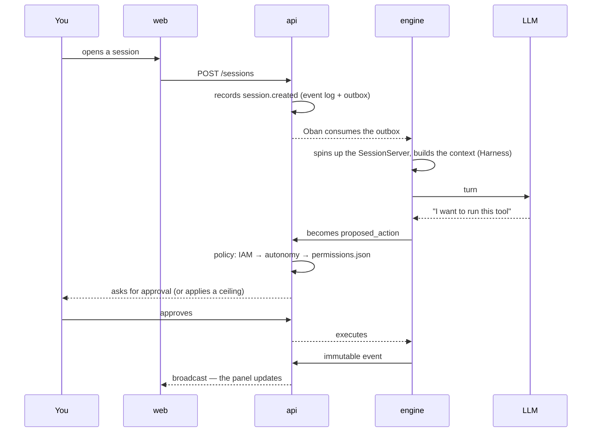

# What Brabo Is

Brabo runs the full lifecycle of an application — from brief to deploy — with
a team of AI agents working over a real git repository. Creative, PO,
Architect, devs per module, Infra, QA, SecOps, Psychologist and Anamnesis.

**Final authority is yours**, and that's not a slogan: it's a property of
the architecture.

## What sets it apart from a code assistant

**No action with external effect happens on its own.** Terminal command,
commit, push, PR, merge, token spend — everything is born as a
`proposed_action`, passes through the project's policy (where `deny` always
beats `allow`) and only then executes. Two cases even policy can't unlock:
**merge into a protected branch** and **changing an agent's instruction**.
Those are ceilings, not defaults.

**The agent is not trustworthy by construction, and the system assumes
that.** It's a language model: it can hallucinate, loop, or ask for
something destructive. The limits are structural — an iteration ceiling, a
ceiling on fixes per task, a budget that refuses the call, a closed catalog
of what Anamnesis is allowed to profile. A prompt is not a guarantee; code
is.

**Everything that happened is recorded and immutable.** The event log is
append-only, with dense numbering per session. That's what makes the
Psychologist's evidence traceable, cost auditable, and backups verifiable.

**The team improves on its own, with you in the loop.** The Psychologist
analyzes sessions and proposes hypotheses anchored in real events; Anamnesis
derives your proficiency profile and proposes versioned instruction patches.
Every patch needs your approval, and reverting creates a new version instead
of erasing history.

## One turn, start to finish

## Where to start

| you want | go to |
|---|---|
| to get up and running with the first agent | [Getting started](getting-started.md) |
| to understand how it's put together | [Architecture](architecture.md) |
| to know what the system guarantees, and where that lives in code | [Business rules](business-rules.md) |
| to operate: stand up, restore, rotate a key, put out fires | [Runbook](runbook.md) |
| to decode a term | [Glossary](glossary.md) |
| to know **why** something was decided that way | [ADRs](adr/index.md) |
| to configure | [Configuration](reference/configuration.md) |
| to tune the approval policy | [Permissions](reference/permissions.md) |
| to understand the api ↔ engine contract | [Internal API](reference/internal-api.md) |

## Status

**Phases 1 through 26 complete**, version **v3.1.0**. What exists:

- IAM/RBAC, sessions with an immutable event log, LLM router, metering and
  budget, an approval pipeline with `permissions.json`
- GitProvider for Local, GitHub, GitLab, Bitbucket, and generic under a
  single contract, with capability declared only when proven; idempotent
  Gitflow bootstrap and adoption of an existing repository with the plan as
  a gate
- Full Harness and an agent hierarchy by area — lead as external contact,
  private internal delegation, consolidated verdict; conversational
  Creative, PO, Architect and Dev Lead, devs per module in isolated
  worktrees, QA and SecOps as PR gates, proactive Infra, Psychologist and
  Anamnesis with a closed loop
- First-party auth (argon2id, Ed25519 access, refresh rotation with family
  revocation) — Keycloak is gone entirely; OpenAPI locked by type across
  controllers, with the [reference](reference/api/brabo-api.info.mdx)
  generated
- Nine LLM providers over a single OpenAI-compatible base, catalog with
  manual curation and price frozen at metering time
- Non-root production images, Kustomize deploy with HPA per Oban queue,
  graceful shutdown, OpenTelemetry, backup with **tested** restore
- Mechanized release pipeline: version computed from the branch's function,
  approval-ladder, promote/tag-release and backmerge with automatic
  back-propagation
- The app: the eight design-handoff screens, a read-only Code tab (tree,
  file with its own syntax highlighting, search, PR diff, blame and PRs in
  the API), a Spend tab with two audiences, a tree-shaped timeline,
  per-project container decided by the Architect, and its C4 diagram in the
  Overview

What came after Phase 15 didn't come from a roadmap — it came from **using
the product**. Program 16–26 was born from the first real navigation of the
app, and every finding from live testing sessions became a rule with
`file:line` and a test. The whole chain was proven against a real GitHub —
repository adoption, story promotion, a dev agent writing code, a PR opened,
a gate judging and the verdict coming back.

What doesn't exist yet is stated where it matters, and is meant to be read:

- the [known technical debt](architecture.md#divida-tecnica) is a section,
  not an omission;
- the [real-execution findings](explanation/achados-execucao-real.md)
  record what remains open **by decision** — including the two cases where
  the conclusion was that the path to autonomy doesn't run through loosening
  policy;
- the per-project container lifecycle is a **declared cut** from Phase 25,
  not an oversight: until it goes live, the terminal policy in
  [ADR 0055](adr/0055-escopo-de-caminho-na-politica-de-terminal.md) keeps
  holding as-is.
