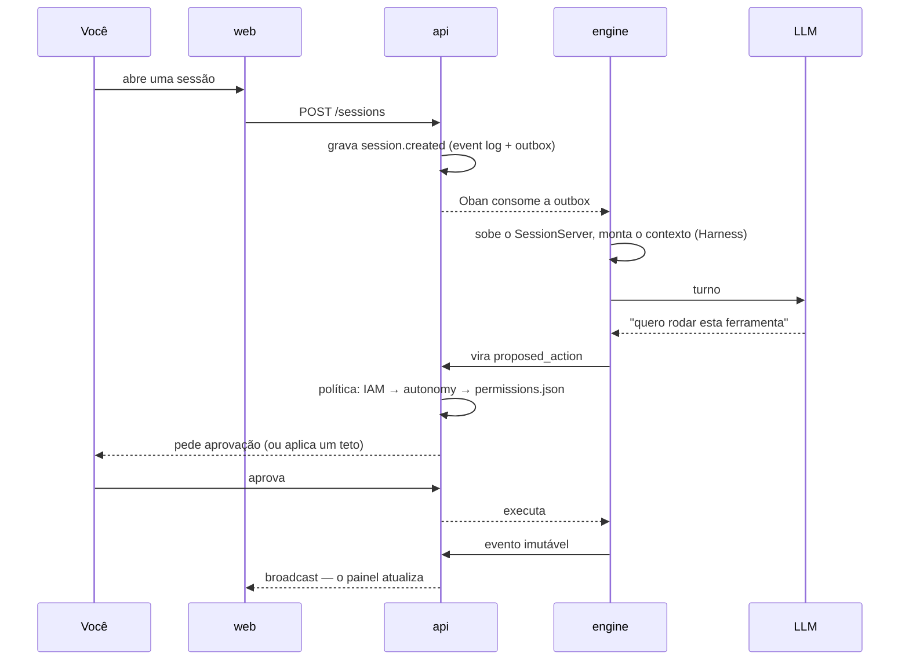

# O que é o Brabo

O Brabo conduz o ciclo completo de uma aplicação — do brief ao deploy — com um
time de agentes de IA trabalhando sobre um repositório git real. Criativo, PO,
Arquiteto, devs por módulo, Infra, QA, SecOps, Psicólogo e Anamnese.

A **autoridade final é sua**, e isso não é um slogan: é uma propriedade da
arquitetura.

## O que o separa de um assistente de código

**Nenhuma ação com efeito externo acontece sozinha.** Comando de terminal,
commit, push, PR, merge, gasto de token — tudo nasce como `proposed_action`,
passa pela política do projeto (onde `deny` sempre vence `allow`) e só então
executa. Dois casos nem a política consegue liberar: **merge em branch
protegida** e **mudança na instrução de um agente**. Esses são tetos, não
defaults.

**O agente não é confiável por construção, e o sistema assume isso.** Ele é um
modelo de linguagem: pode alucinar, entrar em laço, ou pedir algo destrutivo. Os
limites são estruturais — teto de iterações, teto de correções por task,
orçamento que recusa a chamada, catálogo fechado do que a Anamnese pode
perfilar. Prompt não é garantia; código é.

**Tudo que aconteceu está registrado e é imutável.** O event log é append-only,
com numeração densa por sessão. É o que torna a evidência do Psicólogo
rastreável, o custo auditável e o backup verificável.

**O time melhora sozinho, com você no circuito.** O Psicólogo analisa sessões e
propõe hipóteses ancoradas em eventos reais; a Anamnese deriva seu perfil de
proficiência e propõe patches de instrução versionados. Cada patch precisa do
seu aval, e reverter cria uma versão nova em vez de apagar histórico.

## Um turno, do começo ao fim

## Por onde começar

| você quer | vá para |
|---|---|
| subir e rodar o primeiro agente | [Primeiros passos](getting-started.md) |
| entender como está montado | [Arquitetura](architecture.md) |
| saber o que o sistema garante, e onde isso vive no código | [Regras de negócio](business-rules.md) |
| operar: subir, restaurar, rotacionar chave, apagar incêndio | [Runbook](runbook.md) |
| decifrar um termo | [Glossário](glossary.md) |
| saber **por que** algo foi decidido assim | [ADRs](adr/index.md) |
| configurar | [Configuração](reference/configuration.md) |
| ajustar a política de aprovação | [Permissões](reference/permissions.md) |
| entender o contrato api ↔ engine | [API interna](reference/internal-api.md) |

## Estado

**Fases 1 a 5 concluídas**, versão **v0.1.0**. O que existe:

- IAM/RBAC, sessões com event log imutável, roteador de LLM (Ollama e APIs),
  metering e orçamento, pipeline de aprovação
- GitProvider para Local, GitHub e GitLab sob contrato único; bootstrap de
  Gitflow idempotente
- Harness completo; Criativo, PO e Arquiteto com artefatos validados
- Devs dinâmicos em worktrees isolados, gates de QA e SecOps, trava de merge,
  Psicólogo e Anamnese com loop fechado
- Imagens de produção non-root, CI com scan, deploy Kustomize, graceful
  shutdown, OpenTelemetry, backup com restore **testado**

O que ainda não existe está dito onde importa — a
[dívida técnica conhecida](architecture.md#divida-tecnica) é uma
seção, não uma omissão.
