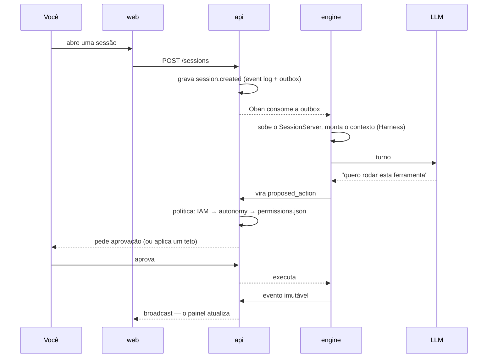

# O que é o Brabo

O Brabo conduz o ciclo completo de uma aplicação — do brief ao deploy — com um
time de agentes de IA trabalhando sobre um repositório git real. Criativo, PO,
Arquiteto, devs por módulo, Infra, QA, SecOps, Psicólogo e Anamnese.

A **autoridade final é sua**, e isso não é um slogan: é uma propriedade da
arquitetura.

## O que o separa de um assistente de código

**Nenhuma ação com efeito externo acontece sozinha.** Comando de terminal,
commit, push, PR, merge, gasto de token — tudo nasce como `proposed_action`,
passa pela política do projeto (onde `deny` sempre vence `allow`) e só então
executa. Dois casos nem a política consegue liberar: **merge em branch
protegida** e **mudança na instrução de um agente**. Esses são tetos, não
defaults.

**O agente não é confiável por construção, e o sistema assume isso.** Ele é um
modelo de linguagem: pode alucinar, entrar em laço, ou pedir algo destrutivo. Os
limites são estruturais — teto de iterações, teto de correções por task,
orçamento que recusa a chamada, catálogo fechado do que a Anamnese pode
perfilar. Prompt não é garantia; código é.

**Tudo que aconteceu está registrado e é imutável.** O event log é append-only,
com numeração densa por sessão. É o que torna a evidência do Psicólogo
rastreável, o custo auditável e o backup verificável.

**O time melhora sozinho, com você no circuito.** O Psicólogo analisa sessões e
propõe hipóteses ancoradas em eventos reais; a Anamnese deriva seu perfil de
proficiência e propõe patches de instrução versionados. Cada patch precisa do
seu aval, e reverter cria uma versão nova em vez de apagar histórico.

## Um turno, do começo ao fim

## Por onde começar

| você quer | vá para |
|---|---|
| subir e rodar o primeiro agente | [Primeiros passos](getting-started.md) |
| entender como está montado | [Arquitetura](architecture.md) |
| saber o que o sistema garante, e onde isso vive no código | [Regras de negócio](business-rules.md) |
| operar: subir, restaurar, rotacionar chave, apagar incêndio | [Runbook](runbook.md) |
| decifrar um termo | [Glossário](glossary.md) |
| saber **por que** algo foi decidido assim | [ADRs](adr/index.md) |
| configurar | [Configuração](reference/configuration.md) |
| ajustar a política de aprovação | [Permissões](reference/permissions.md) |
| entender o contrato api ↔ engine | [API interna](reference/internal-api.md) |

## Estado

**Fases 1 a 26 concluídas**, versão **v3.1.0**. O que existe:

- IAM/RBAC, sessões com event log imutável, roteador de LLM, metering e
  orçamento, pipeline de aprovação com `permissions.json`
- GitProvider para Local, GitHub, GitLab, Bitbucket e genérico sob contrato
  único, com capability declarada só quando provada; bootstrap de Gitflow
  idempotente e adoção de repositório existente com o plano como portão
- Harness completo e hierarquia de agentes por área — lead como contato
  externo, delegação interna privada, veredito consolidado; Criativo, PO,
  Arquiteto e Dev Lead conversacionais, devs por módulo em worktrees isolados,
  QA e SecOps como gates de PR, Infra propositivo, Psicólogo e Anamnese com
  loop fechado
- Auth first-party (argon2id, access Ed25519, rotação de refresh com revogação
  de família) — o Keycloak saiu inteiro; OpenAPI travada por tipo nos
  controllers, com a [referência](reference/api/brabo-api.info.mdx) gerada
- Nove providers de LLM sobre uma base OpenAI-compatível única, catálogo com
  curadoria manual e preço congelado no metering
- Imagens de produção non-root, deploy Kustomize com HPA por fila do Oban,
  graceful shutdown, OpenTelemetry, backup com restore **testado**
- Esteira de release mecanizada: versão calculada pela função da branch,
  approval-ladder, promote/tag-release e backmerge com retropropagação
- A app: as oito telas do handoff de design, aba Code só-leitura (árvore,
  arquivo com realce próprio, busca, diff de PR, blame e PRs na API), aba
  Gastos com duas audiências, linha do tempo em árvore, container por projeto
  decidido pelo Arquiteto e o diagrama C4 dele na Visão Geral

O que veio depois da Fase 15 não saiu de roteiro: saiu de **usar o produto**. O
programa 16–26 nasceu da primeira navegação real na app, e cada achado das
sessões de teste ao vivo virou regra com `arquivo:linha` e teste. A cadeia
inteira foi provada contra um GitHub real — adoção do repositório, promoção de
história, dev agent escrevendo código, PR aberta, gate julgando e o veredito
voltando.

O que ainda não existe está dito onde importa, e é para ser lido:

- a [dívida técnica conhecida](architecture.md#divida-tecnica) é uma seção, não
  uma omissão;
- os [achados da execução real](explanation/achados-execucao-real.md) registram
  o que segue aberto **por decisão** — incluindo os dois casos em que a
  conclusão foi que o caminho para autonomia não passa por afrouxar política;
- o ciclo de vida do container por projeto é **corte declarado** da Fase 25, não
  esquecimento: enquanto ele não sobe, a política de terminal do
  [ADR 0055](adr/0055-escopo-de-caminho-na-politica-de-terminal.md) segue
  valendo como está.
