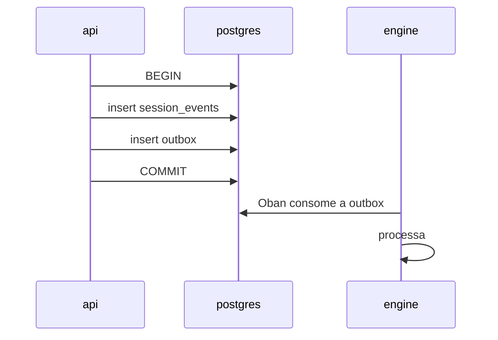

# Eventos

Três famílias de nome convivem no Brabo e são fáceis de confundir porque todas
usam `assunto.verbo`:

| família | onde vive | durabilidade |
|---|---|---|
| **Evento de domínio** | linha em `session_events` | **permanente e imutável** |
| **Broadcast** | canal Phoenix → browser | efêmero, não é persistido |
| **Span** | trace OpenTelemetry | retenção do Tempo (24 h no local) |

Só a primeira é contrato. As outras duas são transporte e observação.

## Evento de domínio

Uma linha em `session_events`, append-only, com `seq` densa por sessão
([RN-002](../business-rules.md#rn-002)). Colunas:

| coluna | o quê |
|---|---|
| `id` | uuid |
| `session_id` | a sessão dona |
| `seq` | ordem dentro da sessão, começando em 1, sem buraco |
| `type` | o identificador abaixo |
| `actor` | quem causou: `{kind, id}` — usuário, agente ou sistema |
| `payload` | jsonb, formato específico por tipo |
| `created_at` | — |

> **O `type` é `string` livre no código** — não existe union TypeScript nem
> enum no banco listando os tipos válidos. A lista abaixo foi extraída dos
> pontos de emissão, e é por isso que ela pode envelhecer sem quebrar nada. Ver
> a nota no fim desta página.

### Sessão

| tipo | quando |
|---|---|
| `session.created` | sessão nasce em `created` |
| `session.activated` | passou para `active` |
| `session.draining` | o nó que hospedava está drenando |
| `session.closed` | encerramento normal |
| `session.closed_abnormally` | encerramento com causa — `node_shutdown` é a mais comum |

### Chat e agentes

| tipo | quando |
|---|---|
| `chat.message` | mensagem no fio da sessão, do usuário ou do agente |
| `agent.activated` | um agente assumiu trabalho na sessão |
| `agent.response` | resposta completa do agente, já consolidada |
| `tool.result` | resultado de uma execução de ferramenta, gravado pelo hook `Engine.Harness.Hooks.EventLog` |
| `handoff.offered` | um agente ofereceu o trabalho a outro |
| `handoff.accepted` | o destinatário aceitou |

### Ações propostas

| tipo | quando |
|---|---|
| `proposed_action.created` | nasceu a ação — antes de qualquer execução |
| `proposed_action.approved` | decidida pelo usuário |
| `proposed_action.denied` | negada — estado terminal |
| `proposed_action.executed` | executou com sucesso |
| `action.failed` | executou e falhou |
| `permission.granted` | concessão registrada na política |

### Backlog

| tipo | quando |
|---|---|
| `backlog.epic_created` | — |
| `backlog.story_created` | — |
| `backlog.story_transitioned` | mudança de estado da história |
| `backlog.story_demoted` | módulo sumiu do `module_map`; a história voltou para `draft` ([RN-012](../business-rules.md#rn-012)) |
| `backlog.story_modules_assigned` | vínculo história ↔ módulo |
| `backlog.task_created` | — |
| `backlog.task_claimed` | um dev agent pegou a task |
| `backlog.task_status_changed` | — |
| `backlog.task_blocked` | teto de correções esgotado, ou impedimento registrado |
| `backlog.task_unblocked` | — |

### Execução e gates

| tipo | quando |
|---|---|
| `execution.activated` | a fase de execução começou |
| `execution.parallelization_suggested` | o sistema propôs paralelizar |
| `execution.parallelization_accepted` | aceita — o subagente herda o teto do agente base |
| `dev.started` | o dev agent começou o ciclo (ativação, paralelização — NÃO reidratação, que nunca redispara) |
| `dev.working` | reivindicou uma task e montou o worktree |
| `dev.idle` | fila do módulo vazia — sem task pegável agora |
| `dev.awaiting_gate` | PR aberta, esperando o gate (Fase 12b) — `task_id`/`worktree` continuam retidos |
| `dev.blocked` | a task devolvida com diagnóstico (limite de iterações, orçamento excedido, `report_blocked`, falha de worktree/contexto) |
| `dev.idle_tripped` | circuit breaker disparado (RN-047) — N tasks blocked seguidas param o agente |
| `dev.rearmed` | usuário rearmou um agente travado (Fase 12b) — `actor` é o USUÁRIO que clicou, não o agente |
| `pr.gate_changed` | o PR mudou de gate (`awaiting_qa` → `awaiting_secops` → `awaiting_user`) |
| `infra.gate_changed` | gate do Infra |
| `infra.artifact_blocked` | artefato do Infra reprovado |

### Delegação (Fase 8b, ADR 0038)

| tipo | quando |
|---|---|
| `delegation.completed` | a subespecialidade concluiu; `payload.parecerArtifactId` referencia o `artifact.qa_verdict` INTERNO dela — nunca o que chega ao gate |
| `delegation.failed` | a subespecialidade não concluiu; `payload.failureOrigin` é a ORIGEM (`infra`\|`modelo`\|`codigo`\|`politica`, nunca por eliminação — ADR 0020) |
| `delegation.dispensed` | o lead decidiu NÃO delegar; `payload.justification` explica por quê — dispensa nunca é silêncio |

Os três são emitidos pelo `QaLeadServer`, um por subespecialidade, SEPARADOS
da chamada a `record_gate_verdict` — o `pr.gate_changed` acima continua sendo
o único evento que descreve o gate em si; estes descrevem a área por trás
dele.

### Artefatos

| tipo | schema |
|---|---|
| `artifact.product_brief` | `title`, `summary`, `rules` |
| `artifact.business_rule` | `title`, `description`, `origin` |
| `artifact.module_map` | o mapa de módulos do Arquiteto |
| `artifact.insight` | — |

Os schemas são fechados: campo faltando reprova a emissão
(`Engine.Harness.ArtifactSchemas`).

### Arquitetura e prontidão

| tipo | quando |
|---|---|
| `architecture.readiness_confirmed` | — |
| `readiness.confirmed` | — |

### Git e bootstrap

| tipo | quando |
|---|---|
| `project.git_connected` | credencial de git vinculada ao projeto |
| `project.repository_provisioned` | repositório **criado** pelo Brabo |
| `project.repository_adopted` | repositório que **já existia** passou a ser o do projeto ([RN-046](../business-rules.md#rn-046)) |
| `bootstrap.repository_adopted` | o mesmo fato na sessão dedicada, com o `defaultBranch` observado no provider |
| `bootstrap.step_started` | um dos seis passos do Gitflow começou |
| `bootstrap.step_completed` | concluído |
| `bootstrap.step_skipped` | já estava feito — **é sucesso**, não erro ([RN-029](../business-rules.md#rn-029)) |
| `bootstrap.step_degraded` | concluiu sem uma capability do provider (ex.: proteção de branch no Local) |
| `bootstrap.step_failed` | falhou; o bootstrap é retomável deste ponto |
| `bootstrap.plan_approved` | o usuário aprovou o plano de adoção — **é só daqui que o bootstrap roda num repo adotado** ([RN-045](../business-rules.md#rn-045)) |
| `bootstrap.adopted_as_is` | o usuário dispensou o bootstrap; nenhum passo rodou, e o plano fica guardado como evidência do que não foi aplicado |

### Custo

| tipo | quando |
|---|---|
| `budget.threshold_crossed` | 70%, 90% ou 100% — **uma vez por limiar** ([RN-018](../business-rules.md#rn-018)) |

### Psicólogo

| tipo | quando |
|---|---|
| `psychologist.analysis_completed` | — |
| `psychologist.analysis_failed` | com causa classificada: `infra`, `modelo`, `código` ou `política` |
| `psychologist.hypothesis_proposed` | hipótese com `evidenceEventIds` válidos ([RN-021](../business-rules.md#rn-021)) |
| `psychologist.hypothesis_accepted` | — |
| `psychologist.hypothesis_dismissed` | — |
| `psychologist.hypothesis_accepted_for_anamnese` | aceita e encaminhada — é o elo que fecha o loop com a Anamnese |

### Anamnese e instruções

| tipo | quando |
|---|---|
| `anamnese.run_completed` | — |
| `anamnese.run_failed` | — |
| `anamnese.profile_updated` | o `proficiency_profile` mudou |
| `instruction.rolled_back` | reversão de versão de instrução — cria versão nova, não apaga ([RN-027](../business-rules.md#rn-027)) |

---

## Broadcast

Mensagens de canal Phoenix para o browser. **Não** são persistidas: quem
recarrega a página não as recupera — recupera o event log.

| broadcast | o quê |
|---|---|
| `agent.delta` | pedaço de texto do streaming do modelo |
| `agent.status` | mudança de estado visível do agente |
| `agent.done` | turno terminou |
| `agent.error` | turno falhou |
| `event.appended` | um evento novo entrou no log — é o gatilho de atualização do painel |

Um evento de domínio quase sempre gera um `event.appended`; o inverso não vale.

## Span

Nomes de span OpenTelemetry. Uma sessão é uma **trace raiz** atravessando api e
engine ([ADR 0026](../adr/0026-fase5-observabilidade-e-graceful-shutdown.md)).

### Nomes de domínio

Nomeados à mão, um por operação que interessa. São estes que se procura no Tempo:

| span | onde |
|---|---|
| `session.create` | api — a raiz |
| `agent.turn` | engine — uma volta do ToolLoop |
| `llm.turn` | engine — a chamada ao modelo |
| `tool.call` | engine — a execução de uma ferramenta |
| `gate.scanner` | engine — um scanner do SecOps, com o nome do scanner no atributo |
| `outbox.session_lifecycle` | engine — job do Oban, pendurado na trace da sessão |
| `outbox.psychologist` | engine — idem, a análise do Psicólogo |

### Nomes derivados de código

O decorator `@Traced` da api
([ADR 0035](../adr/0035-observabilidade-legivel-e-trace-sem-coletor.md)) nomeia a
span como **`Classe.metodo`** — por exemplo `TransitionSessionUseCase.execute`,
`DrizzleOutboxRepository.append`. Não são enumeráveis aqui: nascem e morrem com o
código, e a lista apodreceria na primeira renomeação.

A distinção importa na hora de consultar: nome de domínio é estável e pode ir
numa query salva ou num dashboard; nome derivado de código não.

Os atributos que essas spans carregam — `brabo.layer`, `code.namespace`,
`code.function` — servem para busca no Tempo e **não são contrato**, ao contrário
de `trace_id`. Podem ser renomeados sem quebrar nada fora do Tempo.

Como navegar de uma sessão até um `tool.call` está no
[runbook](../runbook.md#observabilidade); o modelo inteiro está em
[observabilidade](../explanation/observability.md).

---

## Como o evento chega ao engine

Não por fila externa. A api grava o evento e a intenção de publicá-lo **na
mesma transação** (transactional outbox); o Oban consome do próprio Postgres. É
o que impede "gravou o evento mas o engine não soube".

---

## Inventário completo

As seções acima dizem **quando** cada evento acontece. Esta é a varredura
mecânica dos pontos de emissão, refeita a cada `pnpm docs:generate` — é o que
faz um identificador novo aparecer aqui mesmo que ninguém tenha escrito a
respeito.

<!-- BEGIN:GENERATED:eventos-inventario -->

> ⚠️ Bloco gerado por `pnpm docs:generate`. Não edite à mão — o próximo build sobrescreve.

Extraído dos pontos de emissão: **73 identificadores**, todos descritos acima.

- `action.failed` (apps/api/src/application/use-cases/actions/execute-git-action.use-case.ts)
- `agent.activated` (apps/api/src/application/use-cases/agents/activate-agent.use-case.ts)
- `agent.delta` (apps/engine/lib/engine/agents/arquiteto_server.ex)
- `agent.done` (apps/engine/lib/engine/agents/arquiteto_server.ex)
- `agent.error` (apps/engine/lib/engine/agents/arquiteto_server.ex)
- `agent.response` (apps/api/src/application/use-cases/llm/send-chat-message.use-case.ts)
- `agent.status` (apps/engine/lib/engine/agents/arquiteto_server.ex)
- `agent.turn` (apps/engine/lib/engine/harness/tool_loop.ex)
- `anamnese.profile_updated` (apps/api/src/application/use-cases/anamnese/record-proficiency.use-case.ts)
- `anamnese.run_completed` (apps/api/src/application/use-cases/anamnese/record-proficiency.use-case.ts)
- `anamnese.run_failed` (apps/engine/lib/engine/workers/anamnese_worker.ex)
- `architecture.readiness_confirmed` (apps/api/src/application/use-cases/agents/offer-infra-handoff.use-case.ts)
- `artifact.business_rule` (apps/engine/lib/engine/agents/arquiteto_server.ex)
- `artifact.insight` (apps/engine/lib/engine/harness/tools/emit_insight.ex)
- `artifact.module_map` (apps/api/src/application/use-cases/architecture/create-module-map.use-case.ts)
- `artifact.product_brief` (apps/engine/lib/engine/agents/arquiteto_server.ex)
- `backlog.epic_created` (apps/api/src/application/use-cases/backlog/create-epic.use-case.ts)
- `backlog.story_created` (apps/api/src/application/use-cases/backlog/create-story.use-case.ts)
- `backlog.story_demoted` (apps/api/src/application/use-cases/architecture/create-module-map.use-case.ts)
- `backlog.story_modules_assigned` (apps/api/src/application/use-cases/architecture/assign-story-modules.use-case.ts)
- `backlog.story_transitioned` (apps/api/src/application/use-cases/backlog/transition-story.use-case.ts)
- `backlog.task_blocked` (apps/api/src/application/use-cases/execution/mark-task-blocked.use-case.ts)
- `backlog.task_claimed` (apps/api/src/application/use-cases/execution/claim-next-task.use-case.ts)
- `backlog.task_created` (apps/api/src/application/use-cases/backlog/create-task.use-case.ts)
- `backlog.task_status_changed` (apps/api/src/application/use-cases/execution/mark-task.use-case.ts)
- `backlog.task_unblocked` (apps/api/src/application/use-cases/execution/unblock-task.use-case.ts)
- `bootstrap.adopted_as_is` (apps/api/src/application/use-cases/git/decide-bootstrap-plan.use-case.ts)
- `bootstrap.plan_approved` (apps/api/src/application/use-cases/git/decide-bootstrap-plan.use-case.ts)
- `bootstrap.repository_adopted` (apps/api/src/application/use-cases/git/adopt-repository.use-case.ts)
- `bootstrap.step_completed` (apps/api/src/application/use-cases/git/bootstrap-runner.ts)
- `bootstrap.step_degraded` (apps/api/src/application/use-cases/git/bootstrap-runner.ts)
- `bootstrap.step_failed` (apps/api/src/application/use-cases/git/bootstrap-runner.ts)
- `bootstrap.step_skipped` (apps/api/src/application/use-cases/git/bootstrap-runner.ts)
- `bootstrap.step_started` (apps/api/src/application/use-cases/git/bootstrap-runner.ts)
- `budget.threshold_crossed` (apps/api/src/application/use-cases/llm/record-llm-usage.use-case.ts)
- `chat.message` (apps/api/src/application/use-cases/agents/send-agent-message.use-case.ts)
- `delegation.completed` (apps/api/src/application/use-cases/execution/record-delegation.use-case.ts)
- `delegation.dispensed` (apps/api/src/application/use-cases/execution/record-delegation.use-case.ts)
- `delegation.failed` (apps/api/src/application/use-cases/execution/record-delegation.use-case.ts)
- `event.appended` (apps/engine/lib/engine/sessions/live_broadcast.ex)
- `execution.activated` (apps/api/src/application/use-cases/execution/activate-execution.use-case.ts)
- `execution.parallelization_accepted` (apps/api/src/application/use-cases/execution/accept-parallelization.use-case.ts)
- `execution.parallelization_suggested` (apps/api/src/application/use-cases/execution/activate-execution.use-case.ts)
- `gate.scanner` (apps/engine/lib/engine/gates/scanner.ex)
- `handoff.accepted` (apps/api/src/application/use-cases/agents/accept-handoff.use-case.ts)
- `handoff.offered` (apps/api/src/application/use-cases/agents/create-handoff.use-case.ts)
- `infra.artifact_blocked` (apps/api/src/application/use-cases/execution/mark-infra-artifact-blocked.use-case.ts)
- `infra.gate_changed` (apps/api/src/application/use-cases/execution/record-infra-gate-verdict.use-case.ts)
- `instruction.rolled_back` (apps/api/src/application/use-cases/instructions/rollback-instruction.use-case.ts)
- `llm.turn` (apps/engine/lib/engine/sessions/engine_api_client.ex)
- `permission.granted` (apps/api/src/application/use-cases/actions/approve-always-action.use-case.ts)
- `pr.gate_changed` (apps/api/src/application/use-cases/execution/open-gate.use-case.ts)
- `project.git_connected` (apps/api/src/application/use-cases/git/handle-git-oauth-callback.use-case.ts)
- `project.repository_adopted` (apps/api/src/application/use-cases/git/adopt-repository.use-case.ts)
- `project.repository_provisioned` (apps/api/src/application/use-cases/git/provision-repository.use-case.ts)
- `proposed_action.approved` (apps/api/src/application/use-cases/actions/approve-action.use-case.ts)
- `proposed_action.created` (apps/api/src/application/use-cases/actions/propose-action.use-case.ts)
- `proposed_action.denied` (apps/api/src/application/use-cases/actions/deny-action.use-case.ts)
- `proposed_action.executed` (apps/api/src/application/use-cases/actions/execute-git-action.use-case.ts)
- `psychologist.analysis_completed` (apps/api/src/application/use-cases/execution/propose-hypotheses.use-case.ts)
- `psychologist.analysis_failed` (apps/engine/lib/engine/workers/psychologist_worker.ex)
- `psychologist.hypothesis_accepted` (apps/api/src/application/use-cases/execution/accept-hypothesis.use-case.ts)
- `psychologist.hypothesis_accepted_for_anamnese` (apps/api/src/application/use-cases/execution/accept-hypothesis.use-case.ts)
- `psychologist.hypothesis_dismissed` (apps/api/src/application/use-cases/execution/dismiss-hypothesis.use-case.ts)
- `psychologist.hypothesis_proposed` (apps/api/src/application/use-cases/execution/propose-hypotheses.use-case.ts)
- `readiness.confirmed` (apps/api/src/application/use-cases/agents/confirm-readiness.use-case.ts)
- `session.activated` (apps/api/src/db/seed.ts)
- `session.closed` (apps/engine/lib/engine/outbox/drain.ex)
- `session.closed_abnormally` (apps/engine/lib/engine/outbox/drain.ex)
- `session.created` (apps/api/src/application/use-cases/sessions/create-session.use-case.ts)
- `session.draining` (apps/engine/lib/engine/shutdown.ex)
- `tool.call` (apps/engine/lib/engine/agents/arquiteto_server.ex)
- `tool.result` (apps/engine/lib/engine/harness/hooks/event_log.ex)
<!-- END:GENERATED:eventos-inventario -->

---

> **TODO(humano):** `type` é `string` livre em
> `application/ports/session-event-repository.port.ts` — nada impede um typo de
> criar um tipo novo em silêncio, e nada garante que esta página cubra todos.
> Um union TypeScript exportado do `packages/shared` resolveria os dois
> problemas e permitiria **gerar** esta lista em vez de mantê-la. Enquanto isso
> não existe, a lista acima é uma extração datada dos pontos de emissão.
