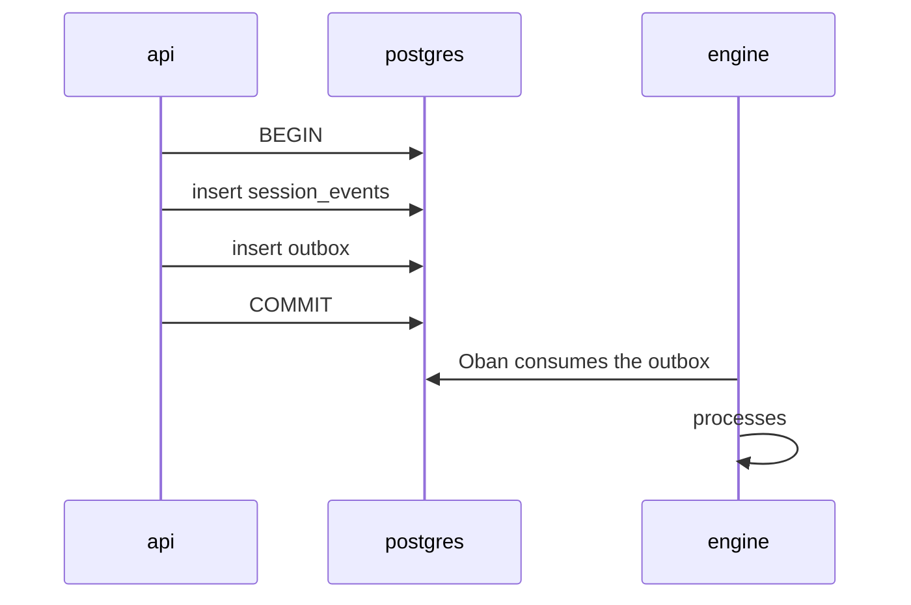

# Events

Three name families coexist in Brabo, and they're easy to confuse because all
of them use `subject.verb`:

| family | where it lives | durability |
|---|---|---|
| **Domain event** | row in `session_events` | **permanent and immutable** |
| **Broadcast** | Phoenix channel → browser | ephemeral, not persisted |
| **Span** | OpenTelemetry trace | Tempo retention (24 h locally) |

Only the first is a contract. The other two are transport and observation.

## Domain event

A row in `session_events`, append-only, with a `seq` that's dense per session
([RN-002](../business-rules.md#rn-002)). Columns:

| column | what |
|---|---|
| `id` | uuid |
| `session_id` | the owning session |
| `seq` | order within the session, starting at 1, no gaps |
| `type` | the identifier below |
| `actor` | who caused it: `{kind, id}` — user, agent or system |
| `payload` | jsonb, format specific to each type |
| `created_at` | — |

> **`type` is a free-form `string` in the code** — there's no TypeScript union
> or database enum listing the valid types. The list below was extracted from
> the emission points, which is why it can go stale without breaking
> anything. See the note at the end of this page.

### Session

| type | when |
|---|---|
| `session.created` | session is born in `created` |
| `session.activated` | moved to `active` |
| `session.draining` | the node hosting it is draining |
| `session.closed` | normal termination |
| `session.closed_abnormally` | termination with a cause — `node_shutdown` is the most common |

### Chat and agents

| type | when |
|---|---|
| `chat.message` | message in the session thread, from the user or the agent |
| `chat.structured_question` | the Creative agent asked for SEVERAL answers at once, via a form — `ask_structured_questions` tool (RN-162). Each question carries `id`, `label`, `type`, `options` and `allowOther` — the latter is the `select`'s free-text output, and defaults to `true` when the model declares nothing ([RN-171](../business-rules/autenticacao.md#rn-171)) |
| `chat.structured_question_answered` | the user answered the form; the answers also come back as `chat.message` for the agent to read |
| `agent.activated` | an agent took on work in the session |
| `agent.response` | the agent's complete, consolidated response. `modelName` says WHICH model generated it, across the three producers (the five conversational agents, the `ToolLoop` of every execution/gate agent, and the api chat with no active agent) — `null` when the turn failed before resolving the binding, and absent in events recorded before the rule existed ([RN-175](../business-rules/autenticacao.md#rn-175)) |
| `agent.error` | agent failure, with `origem` (`infra`/`modelo`/`codigo`/`politica`) and the `mensagem` it states in the thread ([RN-059](../business-rules/custo.md#rn-059)). Covers the whole turn as well as the failure of a SINGLE tool mid-loop, with `tool` and `retentativa` in the payload ([RN-163](../business-rules/autenticacao.md#rn-163)) |
| `tool.result` | result of a tool execution, recorded by the `Engine.Harness.Hooks.EventLog` hook |
| `handoff.offered` | one agent offered the work to another |
| `handoff.accepted` | the recipient accepted |

### Proposed actions

| type | when |
|---|---|
| `proposed_action.created` | the action was born — before any execution. `payload.status` says how it was born (`pending`, `auto_approved` or `denied`), and that's what distinguishes a human decision from policy ([RN-049](../business-rules/custo.md#rn-049)) |
| `proposed_action.approved` | decided by the user — `actor` is **whoever clicked**. Auto-approval does NOT go through here: it shows up in `created` with `status: auto_approved` and an agent actor |
| `proposed_action.denied` | denied — terminal state. `actor` is whoever refused it, and `payload.reason` is the reason |
| `proposed_action.executed` | executed successfully |
| `action.failed` | executed and failed |
| `permission.granted` | grant recorded in the policy |

### Backlog

| type | when |
|---|---|
| `backlog.epic_created` | — |
| `backlog.story_created` | — |
| `backlog.story_transitioned` | story state change. `actor` says who promoted it: `agent/po` in `auto` mode, `user` in `manual` mode ([RN-048](../business-rules/custo.md#rn-048)) |
| `backlog.story_promotion_proposed` | the PO finished a COMPLETE story in a project running `manual` mode: it stays `draft` awaiting the user's decision, and none of its tasks is claimable until then ([RN-048](../business-rules/custo.md#rn-048)) |
| `backlog.story_promotion_returned` | the user REFUSED to promote it and returned the story to the PO with a reason — which becomes a pinned message in its session, the same as a gate being returned to a dev ([RN-048](../business-rules/custo.md#rn-048)) |
| `backlog.story_demoted` | a module disappeared from `module_map`; the story went back to `draft` ([RN-012](../business-rules.md#rn-012)) |
| `backlog.story_overlap_warned` | the story was created, but ALL the rules it cites were already covered by another one — a warning, not a block: the user is the one who judges whether it's overlap ([RN-081](../business-rules/custo.md#rn-081)) |
| `backlog.story_modules_assigned` | story ↔ module link |
| `backlog.task_created` | — |
| `backlog.task_claimed` | a dev agent claimed the task |
| `backlog.task_status_changed` | — |
| `backlog.task_blocked` | fix-attempt cap exhausted, or an impediment was recorded |
| `backlog.task_unblocked` | — |
| `backlog.epic_without_story` | the PO ended a turn having created an epic and NO story for it. An epic doesn't generate a task — a story does —, so this is the state that stalls execution with no visible error. An explicit outcome in the [RN-059](../business-rules/custo.md#rn-059) pattern: a durable event with `origem`, `epicIds`/`epicTitles` and the message, plus the `agent.error` broadcast. Reported ONCE per occurrence, never in a loop ([RN-165](../business-rules/autenticacao.md#rn-165)) |

### Execution and gates

| type | when |
|---|---|
| `execution.plan_proposed` | **DISCONTINUED since ADR 0086** ([RN-284](../business-rules.md#rn-284)) — older sessions may still have this type in the log; new sessions use a `proposed_action` of type `propose_execution_plan` (see `docs/reference/permissions.md`), because the Dev Lead's plan became a real decision, approved or refused in Approvals, no longer a plain event |
| `execution.activated` | the execution phase began. **Only enters on a `criativa` session** — on a `consultiva` one the append responds 409 ([RN-097](../business-rules.md#rn-097)). It's still this event, not the `sessions.kind` column, that says whether a session IS executing |
| `execution.parallelization_suggested` | the system proposed parallelizing |
| `execution.parallelization_accepted` | accepted — the subagent inherits the base agent's cap |
| `dev.started` | the dev agent began the cycle (activation, parallelization — NOT rehydration, which never re-fires) |
| `dev.working` | claimed a task and set up the worktree |
| `dev.idle` | the module's queue is empty — no task claimable right now |
| `dev.blocked_by_container` | the agent did NOT claim, because the project has no container REGISTERED `running` ([RN-502](../business-rules.md#rn-502)). It stops in `:idle` like the two above — `idle` is the only state a wake still rescues — and this event is the only thing that tells "no container" apart from "empty queue" (`dev.idle`) and "the claim failed" (`dev.error`). The api never gets called: the guard runs BEFORE `claim_task/1`, so no task is ever left claimed without a live owner. It resolves on its own: `container.running` on the outbox wakes every `:idle` agent of the project |
| `dev.awaiting_approval` | the git actions became pending approval (Phase 12e): **the gate does NOT open** — with no PR there's nothing to judge — and the worktree stays held until `task.pr_settled` ([RN-050](../business-rules/custo.md#rn-050)) |
| `dev.awaiting_gate` | PR open, waiting on the gate (Phase 12b) — `task_id`/`worktree` remain held |
| `dev.blocked` | the task was returned with a diagnosis (iteration limit, budget exceeded, `report_blocked`, worktree/context failure) |
| `dev.idle_tripped` | circuit breaker tripped (RN-047) — N consecutive blocked tasks stop the agent |
| `dev.rearmed` | the user re-armed a stuck agent (Phase 12b) — `actor` is the USER who clicked, not the agent |
| `pr.gate_changed` | the PR moved to a new gate (`awaiting_qa` → `awaiting_secops` → `awaiting_user`) |
| `infra.gate_changed` | Infra's gate |
| `infra.artifact_blocked` | Infra's artifact was rejected |

### Delegation (Phase 8b, ADR 0038)

| type | when |
|---|---|
| `delegation.completed` | the subspecialty finished; `payload.parecerArtifactId` references its INTERNAL `artifact.qa_verdict` — never the one that reaches the gate |
| `delegation.failed` | the subspecialty didn't finish; `payload.failureOrigin` is the ORIGIN (`infra`\|`modelo`\|`codigo`\|`politica`, never by elimination — ADR 0020) |
| `delegation.dispensed` | the lead decided NOT to delegate; `payload.justification` explains why — dispensing is never silent |

All three are emitted by `QaLeadServer`, one per subspecialty, SEPARATE from
the call to `record_gate_verdict` — the `pr.gate_changed` event above remains
the only event that describes the gate itself; these describe the area
behind it.

### Tool loop

| type | when |
|---|---|
| `toolloop.limit_reached` | the loop hit its iteration cap. `payload` carries `iteration` and `max_iterations` — the cap is per agent TYPE ([RN-085](../business-rules/custo.md#rn-085)) |
| `toolloop.budget_exceeded` | that loop's token budget ran out before the work did; `payload` carries `tokens_spent_micros` and `token_budget_micros` |

Emitted by `Engine.Harness.ToolLoop` and — since
[RN-166](../business-rules/autenticacao.md#rn-166) — also by `PoServer`, which has its OWN
loop and, until then, exhausted its cap **silently**. Same type and same
payload on purpose: it's the same fact, and whoever reads the log shouldn't
have to learn a second name just because the conversational agent doesn't use
`ToolLoop`.

### Artifacts

| type | schema |
|---|---|
| `artifact.product_brief` | `title`, `summary`, `rules` |
| `artifact.business_rule` | `title`, `description`, `origin` |
| `artifact.module_map` | the Architect's module map |
| `artifact.module_routing` | the Architect's candidate image per module, one item per module of the current `module_map` — the Architect CANDIDATES, Infra ELECTS ([RN-487](../business-rules.md#rn-487), [ADR 0131](../adr/0131-roteamento-de-modulos-para-infra.md)) |
| `artifact.insight` | — |
| `artifact.prototipo_navegavel` | `personas`, `jornadas`, `prototipo` (`telas`, `anotacoes`), `resumo` — the UX Designer's prototype ([RN-286](../business-rules.md#rn-286), ADR 0087) |
| `artifact.rfc_staff` | — (validated in `Engine.Agents.StaffTools`, not by `ArtifactSchemas` — same case as `artifact.insight`): `problema`, `opcoes` (list of `descricao`/`tradeoffs`), `recomendacao`, `poc` (`escopo`, `descartavel: true` fixed). The Staff's RFC (ADR 0088), returned to the Architect via handoff in the same tool call |
| `artifact.plano_de_teste` | `storyId`, `planoDeTeste`, `criteriosExecutaveis`, `estrategiaDeAutomacao` — the QA-strategy deliverable (ADR 0090), PRE-DEV |
| `artifact.threat_model` | `storyId`, `threatModel`, `requisitosDeSeguranca` — SecOps' "second moment" over a story's DESIGN ([RN-360](../business-rules.md#rn-360), ADR 0090) |

The schemas are closed: a missing field rejects the emission
(`Engine.Harness.ArtifactSchemas`).

### Architecture and readiness

| type | when |
|---|---|
| `architecture.readiness_confirmed` | — |
| `readiness.confirmed` | — |
| `necessity.validated` | `necessidade-validada` gate (Creative → PO): the user confirms that the `product_brief` the Creative agent consolidated reflects the actual business need — a click separate from `readiness.confirmed`, never a model inference ([RN-406](../business-rules.md#rn-406), ADR 0095). `payload.productBriefId` references the validated `artifact.product_brief` |

### Git and bootstrap

| type | when |
|---|---|
| `project.git_connected` | git credential linked to the project |
| `project.repository_provisioned` | repository **created** by Brabo |
| `project.repository_adopted` | a repository that **already existed** became the project's ([RN-046](../business-rules/custo.md#rn-046)) |
| `bootstrap.repository_adopted` | the same fact in the dedicated session, with the `defaultBranch` observed from the provider |
| `bootstrap.step_started` | one of the six Gitflow steps began |
| `bootstrap.step_completed` | completed |
| `bootstrap.step_skipped` | it was already done — **that's a success**, not an error ([RN-029](../business-rules.md#rn-029)) |
| `bootstrap.step_degraded` | completed without one of the provider's capabilities (e.g. branch protection on Local) |
| `bootstrap.step_failed` | failed; the bootstrap is resumable from this point |
| `bootstrap.plan_approved` | the user approved the adoption plan — **only from here does bootstrap run on an adopted repo** ([RN-045](../business-rules/custo.md#rn-045)) |
| `bootstrap.adopted_as_is` | the user dismissed the bootstrap; no step ran, and the plan is kept as evidence of what wasn't applied |

### Cost

| type | when |
|---|---|
| `budget.threshold_crossed` | 70%, 90% or 100% — **once per threshold** ([RN-018](../business-rules/custo.md#rn-018)) |

### RAG telemetry (RN-479/480/481)

These two are **narration, never the source of the measurement**, and they only
exist when there is a session — that is, on the agent path. A search coming from
the RAG tab is a *project* search and has no session at all, and
`session_events.session_id` is `NOT NULL`, so measuring from the event log would
silently drop exactly the searches a human ran while looking at the scores. The
source of the measurement is the `rag_searches`/`rag_feedback` pair of tables
(read by `pnpm --filter api medir:rag`); the event only puts the same fact on the
session timeline.

| type | when |
|---|---|
| `rag.search` | an agent ran a hybrid search inside a session — payload carries the `searchId` of the telemetry row, the query, `topK`, how many hits passed the threshold, whether the search was `degraded`, and the chunk ids ([RN-479](../business-rules.md#rn-479), [RN-481](../business-rules.md#rn-481)) |
| `rag.feedback` | an agent judged one retrieved chunk as `util`/`irrelevante` — payload carries `searchId`, `chunkId`, the verdict and the **rank** that chunk held in that search ([RN-480](../business-rules.md#rn-480)) |

### Local runner (ADR 0103/0104)

| type | when |
|---|---|
| `project.workspace_verified` | `brabo-runner` connected and confirmed the path for a project with `execution_mode: runner` — the runner is the source of truth for the path, overwriting whatever was typed at creation ([RN-423](../business-rules.md#rn-423)) |

### Psychologist

| type | when |
|---|---|
| `psychologist.analysis_completed` | — |
| `psychologist.analysis_failed` | with a classified cause: `infra`, `modelo`, `código` or `política` |
| `psychologist.analysis_skipped` | the session had no ANALYZABLE event and the analysis didn't run — `payload.analisaveis` and `payload.eventCount` show the difference ([RN-079](../business-rules/custo.md#rn-079)) |
| `psychologist.hypothesis_proposed` | a hypothesis with valid `evidenceEventIds` ([RN-021](../business-rules.md#rn-021)) |
| `psychologist.hypothesis_accepted` | — |
| `psychologist.hypothesis_dismissed` | — |
| `psychologist.hypothesis_accepted_for_anamnese` | accepted and forwarded — the link that closes the loop with the Anamnesis |

### Anamnesis and instructions

| type | when |
|---|---|
| `anamnese.run_completed` | — |
| `anamnese.run_failed` | — |
| `anamnese.run_skipped` | the round ended WITHOUT a profile, on purpose — `payload.motivo` says why ([RN-063](../business-rules/custo.md#rn-063)) |
| `anamnese.profile_updated` | the `proficiency_profile` changed |
| `instruction.rolled_back` | rollback of an instruction version — creates a new version, doesn't delete ([RN-027](../business-rules.md#rn-027)) |

---

## Broadcast

Phoenix channel messages to the browser. They are **not** persisted: whoever
reloads the page doesn't get them back — they get the event log back instead.

| broadcast | what |
|---|---|
| `agent.delta` | chunk of text from the model's streaming |
| `agent.status` | visible agent state change |
| `agent.done` | turn ended |
| `agent.error` | turn failed |
| `event.appended` | a new event entered the log — the panel's refresh trigger |

A domain event almost always produces an `event.appended`; the reverse doesn't hold.

### Who can listen (RN-108)

Joining the `session:<id>` channel — and therefore receiving any of these
broadcasts — requires a single-use opaque ticket issued by
`POST /projects/:projectId/sessions/:sessionId/socket-ticket` (30s TTL).
Before RN-108, the Phoenix socket's `connect/3` checked nothing beyond the
`session_id` existing: anyone who discovered the UUID could join and listen
to everything. The ticket isn't persisted/read in the event log — it lives in
`session_socket_tickets`, verified and consumed by the engine itself — so it
doesn't show up in the domain-event inventory below. See
[RN-108](../business-rules/autenticacao.md#rn-108).

## Span

OpenTelemetry span names. A session is a **root trace** spanning both the api
and the engine ([ADR 0026](../adr/0026-fase5-observabilidade-e-graceful-shutdown.md)).

### Domain names

Named by hand, one per operation that matters. These are the ones you look up in Tempo:

| span | where |
|---|---|
| `session.create` | api — the root |
| `agent.turn` | engine — one pass of the ToolLoop |
| `llm.turn` | engine — the call to the model |
| `tool.call` | engine — a tool execution |
| `gate.scanner` | engine — a SecOps scanner, with the scanner name in an attribute |
| `outbox.session_lifecycle` | engine — Oban job, attached to the session's trace |
| `outbox.psychologist` | engine — same, the Psychologist's analysis |

### Code-derived names

The api's `@Traced` decorator
([ADR 0035](../adr/0035-observabilidade-legivel-e-trace-sem-coletor.md)) names
the span as **`Class.method`** — for example `TransitionSessionUseCase.execute`,
`DrizzleOutboxRepository.append`. They can't be enumerated here: they're born
and die with the code, and the list would go stale the first time something
gets renamed.

The distinction matters when querying: a domain name is stable and can go
into a saved query or a dashboard; a code-derived name can't.

The attributes these spans carry — `brabo.layer`, `code.namespace`,
`code.function` — are for searching in Tempo and **are not a contract**,
unlike `trace_id`. They can be renamed without breaking anything outside Tempo.

How to navigate from a session to a `tool.call` is documented in the
[runbook](../runbook.md#observabilidade); the whole model is documented in
[observability](../explanation/observability.md).

---

## How the event reaches the engine

Not through an external queue. The api writes the event and the intent to
publish it **in the same transaction** (transactional outbox); Oban consumes
straight from Postgres. That's what prevents "the event was written but the
engine never knew."

---

## Complete inventory

The sections above say **when** each event happens. This is the mechanical
scan of the emission points, redone on every `pnpm docs:generate` — it's what
makes a new identifier show up here even if nobody wrote about it.

<!-- BEGIN:GENERATED:eventos-inventario -->

> ⚠️ Block generated by `pnpm docs:generate`. Do not edit by hand — the next build overwrites it.

Extracted from the emission points: **90 identifiers**, of which **2** are not described above.

- `action.failed` (apps/api/src/application/use-cases/actions/execute-git-action.use-case.ts)
- `agent.activated` (apps/api/src/application/use-cases/agents/activate-agent.use-case.ts)
- `agent.delta` (apps/engine/lib/engine/agents/arquiteto_server.ex)
- `agent.done` (apps/engine/lib/engine/agents/turno_assincrono.ex)
- `agent.error` (apps/engine/lib/engine/agents/arquiteto_server.ex)
- `agent.response` (apps/api/src/application/use-cases/llm/send-chat-message.use-case.ts)
- `agent.status` (apps/engine/lib/engine/agents/turno_assincrono.ex)
- `agent.turn` (apps/engine/lib/engine/harness/tool_loop.ex)
- `anamnese.profile_updated` (apps/api/src/application/use-cases/anamnese/record-proficiency.use-case.ts)
- `anamnese.run_completed` (apps/api/src/application/use-cases/anamnese/record-proficiency.use-case.ts)
- `anamnese.run_failed` (apps/engine/lib/engine/workers/anamnese_worker.ex)
- `anamnese.run_skipped` (apps/engine/lib/engine/workers/anamnese_worker.ex)
- `architecture.module_map_created` — ⚠️ **not described above** (apps/engine/lib/engine/agents/dev_lead_server.ex)
- `architecture.readiness_confirmed` (apps/api/src/application/use-cases/agents/offer-infra-handoff.use-case.ts)
- `artifact.business_rule` (apps/engine/lib/engine/agents/arquiteto_server.ex)
- `artifact.insight` (apps/engine/lib/engine/harness/tools/emit_insight.ex)
- `artifact.module_map` (apps/api/src/application/use-cases/architecture/create-module-map.use-case.ts)
- `artifact.plano_de_teste` (apps/engine/lib/engine/agents/dev_lead_tools.ex)
- `artifact.product_brief` (apps/engine/lib/engine/agents/arquiteto_server.ex)
- `artifact.prototipo_navegavel` (apps/engine/lib/engine/agents/ux_designer_tools.ex)
- `artifact.rfc_staff` (apps/engine/lib/engine/agents/staff_tools.ex)
- `backlog.epic_created` (apps/api/src/application/use-cases/backlog/create-epic.use-case.ts)
- `backlog.epic_without_story` (apps/engine/lib/engine/agents/po_server.ex)
- `backlog.story_created` (apps/api/src/application/use-cases/backlog/create-story.use-case.ts)
- `backlog.story_demoted` (apps/api/src/application/use-cases/architecture/create-module-map.use-case.ts)
- `backlog.story_modules_assigned` (apps/api/src/application/use-cases/architecture/assign-story-modules.use-case.ts)
- `backlog.story_overlap_warned` (apps/api/src/application/use-cases/backlog/create-story.use-case.ts)
- `backlog.story_promotion_proposed` (apps/api/src/application/use-cases/backlog/create-story.use-case.ts)
- `backlog.story_promotion_returned` (apps/api/src/application/use-cases/backlog/return-story.use-case.ts)
- `backlog.story_transitioned` (apps/api/src/application/use-cases/backlog/transition-story.use-case.ts)
- `backlog.task_blocked` (apps/api/src/application/use-cases/execution/mark-task-blocked.use-case.ts)
- `backlog.task_claimed` (apps/api/src/application/use-cases/execution/claim-next-task.use-case.ts)
- `backlog.task_created` (apps/api/src/application/use-cases/backlog/create-task.use-case.ts)
- `backlog.task_status_changed` (apps/api/src/application/use-cases/execution/mark-task.use-case.ts)
- `backlog.task_unblocked` (apps/api/src/application/use-cases/execution/unblock-task.use-case.ts)
- `bootstrap.adopted_as_is` (apps/api/src/application/use-cases/git/decide-bootstrap-plan.use-case.ts)
- `bootstrap.plan_approved` (apps/api/src/application/use-cases/git/decide-bootstrap-plan.use-case.ts)
- `bootstrap.repository_adopted` (apps/api/src/application/use-cases/git/adopt-repository.use-case.ts)
- `bootstrap.step_acknowledged` — ⚠️ **not described above** (apps/api/src/application/use-cases/git/acknowledge-protection-failure.use-case.ts)
- `bootstrap.step_completed` (apps/api/src/application/use-cases/git/bootstrap-runner.ts)
- `bootstrap.step_degraded` (apps/api/src/application/use-cases/git/bootstrap-runner.ts)
- `bootstrap.step_failed` (apps/api/src/application/use-cases/git/bootstrap-runner.ts)
- `bootstrap.step_skipped` (apps/api/src/application/use-cases/git/bootstrap-runner.ts)
- `bootstrap.step_started` (apps/api/src/application/use-cases/git/bootstrap-runner.ts)
- `budget.threshold_crossed` (apps/api/src/application/use-cases/llm/record-llm-usage.use-case.ts)
- `chat.message` (apps/api/src/application/use-cases/agents/send-agent-message.use-case.ts)
- `chat.structured_question` (apps/engine/lib/engine/harness/tools/ask_structured_questions.ex)
- `chat.structured_question_answered` (apps/api/src/application/use-cases/agents/answer-structured-question.use-case.ts)
- `delegation.completed` (apps/api/src/application/use-cases/execution/record-delegation.use-case.ts)
- `delegation.dispensed` (apps/api/src/application/use-cases/execution/record-delegation.use-case.ts)
- `delegation.failed` (apps/api/src/application/use-cases/execution/record-delegation.use-case.ts)
- `event.appended` (apps/engine/lib/engine/sessions/live_broadcast.ex)
- `execution.activated` (apps/api/src/application/use-cases/execution/activate-execution.use-case.ts)
- `execution.parallelization_accepted` (apps/api/src/application/use-cases/execution/accept-parallelization.use-case.ts)
- `execution.parallelization_suggested` (apps/api/src/application/use-cases/execution/activate-execution.use-case.ts)
- `gate.scanner` (apps/engine/lib/engine/gates/scanner.ex)
- `handoff.accepted` (apps/api/src/application/use-cases/agents/accept-handoff.use-case.ts)
- `handoff.offered` (apps/api/src/application/use-cases/agents/create-handoff.use-case.ts)
- `infra.artifact_blocked` (apps/api/src/application/use-cases/execution/mark-infra-artifact-blocked.use-case.ts)
- `infra.gate_changed` (apps/api/src/application/use-cases/execution/record-infra-gate-verdict.use-case.ts)
- `instruction.rolled_back` (apps/api/src/application/use-cases/instructions/rollback-instruction.use-case.ts)
- `llm.turn` (apps/engine/lib/engine/sessions/engine_api_client.ex)
- `necessity.validated` (apps/api/src/application/use-cases/agents/validate-necessity.use-case.ts)
- `permission.granted` (apps/api/src/application/use-cases/actions/approve-always-action.use-case.ts)
- `pr.gate_changed` (apps/api/src/application/use-cases/execution/open-gate.use-case.ts)
- `project.git_connected` (apps/api/src/application/use-cases/git/handle-git-oauth-callback.use-case.ts)
- `project.repository_adopted` (apps/api/src/application/use-cases/git/adopt-repository.use-case.ts)
- `project.repository_provisioned` (apps/api/src/application/use-cases/git/provision-repository.use-case.ts)
- `project.workspace_verified` (apps/api/src/application/use-cases/iam/confirm-project-workspace.use-case.ts)
- `proposed_action.approved` (apps/api/src/application/use-cases/actions/approve-action.use-case.ts)
- `proposed_action.created` (apps/api/src/application/use-cases/actions/propose-action.use-case.ts)
- `proposed_action.denied` (apps/api/src/application/use-cases/actions/deny-action.use-case.ts)
- `proposed_action.executed` (apps/api/src/application/use-cases/actions/execute-git-action.use-case.ts)
- `psychologist.analysis_completed` (apps/api/src/application/use-cases/execution/propose-hypotheses.use-case.ts)
- `psychologist.analysis_failed` (apps/engine/lib/engine/workers/psychologist_worker.ex)
- `psychologist.analysis_skipped` (apps/engine/lib/engine/workers/psychologist_worker.ex)
- `psychologist.hypothesis_accepted` (apps/api/src/application/use-cases/execution/accept-hypothesis.use-case.ts)
- `psychologist.hypothesis_accepted_for_anamnese` (apps/api/src/application/use-cases/execution/accept-hypothesis.use-case.ts)
- `psychologist.hypothesis_dismissed` (apps/api/src/application/use-cases/execution/dismiss-hypothesis.use-case.ts)
- `psychologist.hypothesis_proposed` (apps/api/src/application/use-cases/execution/propose-hypotheses.use-case.ts)
- `rag.feedback` (apps/api/src/application/use-cases/rag/record-rag-feedback.use-case.ts)
- `rag.search` (apps/api/src/application/use-cases/rag/hybrid-search.use-case.ts)
- `readiness.confirmed` (apps/api/src/application/use-cases/agents/confirm-readiness.use-case.ts)
- `session.activated` (apps/api/src/db/seed.ts)
- `session.closed` (apps/engine/lib/engine/outbox/drain.ex)
- `session.closed_abnormally` (apps/engine/lib/engine/outbox/drain.ex)
- `session.created` (apps/api/src/application/use-cases/sessions/create-session.use-case.ts)
- `session.draining` (apps/engine/lib/engine/shutdown.ex)
- `tool.call` (apps/engine/lib/engine/agents/arquiteto_server.ex)
- `tool.result` (apps/engine/lib/engine/agents/criativo_server.ex)
<!-- END:GENERATED:eventos-inventario -->

---

> **TODO(human):** `type` is a free-form `string` in
> `application/ports/session-event-repository.port.ts` — nothing prevents a
> typo from silently creating a new type, and nothing guarantees this page
> covers all of them. A TypeScript union exported from `packages/shared`
> would solve both problems and would let this list be **generated** instead
> of maintained by hand. Until that exists, the list above is a dated
> extraction of the emission points.
