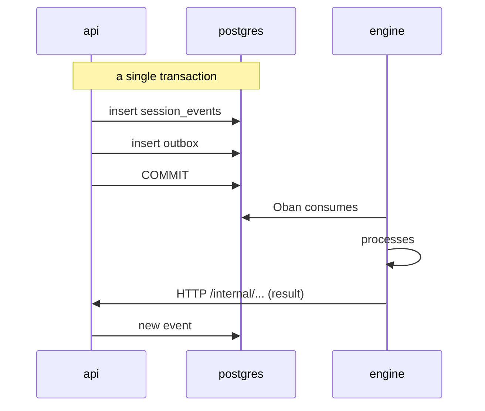

# Internal API (api ↔ engine)

The api and the engine talk in **two** ways, and the choice between them is not
stylistic:

| direction | mechanism | when |
|---|---|---|
| api → engine | **outbox + Oban** | events: something happened, the engine reacts when it can |
| api → engine | **HTTP** | synchronous commands: I need the response now |
| engine → api | **HTTP** (`/internal/*`) | the engine requests data or records a result |

The criterion: if the operation needs to be atomic with a database write, it goes
through the outbox — the api writes the event and the intent to publish it in the same
transaction, and there is no window where one exists without the other. If it needs an
immediate response, it goes through HTTP.

**Out of scope for this page**: HTTP routes authenticated by the user's normal JWT
(role-based RBAC, `@RequireRole`) — such as
`/projects/:projectId/agent-autonomy`, `/projects/:projectId/container/lifecycle`
([RN-267](../business-rules.md#rn-267)),
`.../agents/criativo/validate-necessity` (gate `necessidade-validada`,
[RN-406](../business-rules.md#rn-406), ADR 0095) or the CRUD of
`/projects/:projectId/personal-access-tokens` ([RN-426](../business-rules.md#rn-426),
ADR 0105) — including the two `maintainer` routes
(`GET .../personal-access-tokens/all`,
`DELETE .../personal-access-tokens/:tokenId/admin`,
[RN-427](../business-rules.md#rn-427)) — are not "internal" in the sense of this document, even when an
agent is who effectively calls through them. The same is true of the four
`HuggingFaceModelsController` routes under
`/workspaces/:workspaceId/huggingface/*`
([RN-462](../business-rules.md#rn-462), [RN-463](../business-rules.md#rn-463),
ADR 0115): `role:maintainer`, a human's own direct action from Project/Workspace
Settings, never called by the engine. The same goes for the two membership
routes, `POST`/`DELETE /projects/:projectId/members`
([RN-471](../business-rules.md#rn-471),
[RN-472](../business-rules.md#rn-472), ADR 0127) — and there the fact is
load-bearing rather than merely true: the two downgrade caps that route now
enforces (nobody downgrades a workspace `owner`, nobody downgrades themselves)
live INSIDE `AddProjectMemberUseCase`, so they would be bypassable by any
second door into `project_members`. There is none — no `/internal/*` route
writes that table, and the use case has exactly one caller, the RBAC route
itself. The
shared service token NEVER serves as credential on these routes, and the user's JWT
never works on `/internal/*` — the two mechanisms don't overlap
([RN-035](../business-rules/autenticacao.md#rn-035)).

**A third credential, neither service token nor user JWT**:
`POST /projects/:projectId/runner-ticket` is `role:developer` like any
RBAC route, but does not accept the normal session JWT — only one of TWO
device-scoped credentials, both handled by the same `PatAuthGuard`/
`@RequirePatAuth()`, scoped by construction to this single route: a
Personal Access Token (`brb_…`, [RN-424](../business-rules.md#rn-424), ADR
0105), or a short-lived (≤60s), self-signed EdDSA JWT proving possession of
a browser-generated Ed25519 device key registered via
`/projects/:projectId/runner-device-keys`
([RN-465](../business-rules.md#rn-465), ADR 0118) — additive to the PAT,
never a replacement. Worth noting here because it's the distinction this
page exists to explain: "it's not `/internal/*`" doesn't mean "so it's a
user JWT" — both device credentials are a third mechanism, with no overlap
with the other two.

Also out of scope: the
`@Public()` routes that are the actual ENTRY POINT before any session
exists — `POST /auth/login`, `POST /auth/register`,
`GET /auth/oauth/:provider/start`/`callback` (social login, ADR 0084) and the
rest of `auth.controller.ts`. None of them use the service token or the user's
JWT (it's what THEY issue, not what they require), so the
service-token-vs-JWT distinction this page exists to explain doesn't apply —
they simply have no credential at all on entry. The exposure classification of
every HTTP route, internal or not, is in
[docs/security-surface.md](../security-surface.md).

## Authentication

No end trusts the private network. All of them present the **same
service token** — a secret shared via env, rotatable, in the
`X-Brabo-Service-Token` header:

| caller | verified by | comparison |
|---|---|---|
| engine → api | `EngineServiceGuard` | `comparaEmTempoConstante` |
| api → engine | `EngineWeb.Plugs.VerifyServiceToken` | `Plug.Crypto.secure_compare/2` |
| broker → api | `EngineServiceGuard` | `comparaEmTempoConstante` |
| api → broker | `tokenConfere` (`apps/broker/src/config.ts`) | `timingSafeEqual` |

The broker ([ADR 0130](../adr/0130-broker-de-container.md)) joined this table
without changing it: same header, same secret, same rotation. It answers `401`
where the api answers `403`, matching the engine — what is missing is
authentication of the caller, and the api's `403` is a documented compatibility
constraint rather than a disagreement.

> **This traffic does not go through the JWT.** The `/internal/*` routes are annotated with
> `@ServiceRoute()`, which takes them out of the `JwtAuthGuard` and exempts them from the
> `RateLimitGuard` (which runs before the controller guard, so the exemption
> needs to come from the metadata). A user access token, even from an `owner`,
> does not open any of them; and the service token does not open any other route. See
> [RN-035](../business-rules/autenticacao.md#rn-035).

> **Rotation without downtime.** `BRABO_SERVICE_TOKEN` is the value sent;
> `BRABO_SERVICE_TOKEN_PREVIOUS` is accepted **only during verification**. Since both
> sides send the current one and accept both, rotation is the same three-step dance
> as `AUTH_JWT_SECRET`, described in the
> [runbook](../runbook.md#rotacao-das-chaves-do-auth).

## Correlation

Every call between the two services also carries the `traceparent` header (W3C),
and this holds in **both directions and all methods** — GET, POST and the LLM turn
SSE stream. Each side has a single funnel that assembles the headers:

| caller | funnel |
|---|---|
| api → engine | `HttpApiToEngineClient.buildHeaders()` |
| engine → api | `EngineApiClient.headers/0` |

Until [ADR 0035](../adr/0035-observabilidade-legivel-e-trace-sem-coletor.md) the
engine side's `traceparent` was injected only into POSTs, so reads
(`list_events`, the agent's context) and `llm_turn_stream` arrived at the api without
correlation — they showed up in Tempo as orphan traces. If you add a
new call to this contract, use the funnel: it's what guarantees it won't be born orphaned.

> The rejection of a service token is logged on both sides, with route and origin
> — and **without** the token presented. A 401 here is indistinguishable, without logs,
> from "engine is down", which was exactly the symptom before.

> The `/internal/*` routes **are not internal by naming convention.** The prefix is
> for readability; what protects them is the guard verifying the service token. The
> full classification is at
> [`docs/security-surface.md`](../security-surface.md), and a table test
> fails a new route without a classification.

## engine → api

Twenty-eight routes, all under `/internal/sessions/:sessionId/` unless noted otherwise.
Grouped by what they do.

One route in this family has a caller that is **not** the engine — see
[broker → api](#broker--api), below. The classification names the mechanism, not
the sender.

### Event log and actions

| method | path |
|---|---|
| GET · POST | `/events` |
| POST | `/actions` |
| POST | `/termination` |
| POST | `/handoffs` |

The engine never writes directly to the events table — it **asks** the api, which
controls the `seq` and the atomicity with the outbox.

And that's why the session-type guard lives in the append use case, and not
in `ActivateExecutionUseCase`: `POST /events` here and the user's route fall into the
same funnel. Since FASE 20, `execution.activated` in a `consultiva` session
returns **409** through this path too — the type is creation intent and the
event does not promote it ([RN-097](../business-rules.md#rn-097)). No other
contract change: the other event types remain identical, and the rejection
happens **before** `incrementSeq`, so a rejected attempt does not open a gap
in `seq`.

`ActivateExecutionUseCase` gained a second side effect that does **not** go
through any route in this document ([RN-135](../business-rules/custo.md#rn-135)): at the
end of activation, if the user's route provides `originSessionId` (the CHAT
session the click came from), it closes that session via
`TransitionSessionUseCase` — the same path that `POST /termination` on this
page uses for the engine to report termination, but triggered by the api, with no trip
at all to the engine. No new route, no change to the existing `engine → api`
contract.

`GET /projects/:projectId/execution/session` ([RN-139](../business-rules/autenticacao.md#rn-139))
is the same story in reverse: it exposes via external HTTP a read
(`findActiveExecutionSession`) that previously existed only inside
`ActivateExecutionUseCase`. No new `engine → api` path, no side
effect — it's a `SELECT`, and the criterion (an `active` session with `execution.activated`
recorded) doesn't change anything about what the engine already did.

### LLM

| method | path |
|---|---|
| POST | `/llm-turn` |
| POST | `/llm-turn-stream` |

Every model call goes through the api. It's not gratuitous indirection: it's where
metering happens and where the budget can **reject** the call. An engine that
talked directly to the provider would make the spending cap unenforceable.

**Both** paths use the same time cap, `LLM_TURN_TIMEOUT_MS` (default
300,000 ms). An LLM turn is not an ordinary API call: with a local model the
first turn still loads several GB of weights before the first token, and with an
API provider a large context takes a while. In `/llm-turn-stream` the value applies
PER CHUNK received — i.e. it's the INACTIVITY cap that
[ADR 0041](../adr/0041-base-openai-compativel-e-contrato-de-llm-providers.md)
calls for — not the
whole response.

The cap needs to be explicit on both: without passing it, `Req` uses its
default, 15 seconds. While only the non-streamed path passed it, the four
conversational agents — which use only the streamed one — would fail at 15s with
`%Req.TransportError{reason: :timeout}`, classified as origin `infra`. With
a local model the turn fit within 15s and the defect didn't show up.

#### The final frame carries the model name ([RN-146](../business-rules/autenticacao.md#rn-146))

`RunLlmTurnResult` and the `final` frame of `LlmTurnStreamEvent` gain
`modelName: string | null` — the name of the model the api resolved
(`resolveModelBinding` → `models.findById`) before calling the provider.
`null` only when the turn failed BEFORE resolving any model at all (no
binding, or a binding to a model that no longer exists); in all other cases —
including budget exceeded — the binding had already resolved and the name travels
even in the error frame. The four engine conversational agents
extract the field from the frame and include it in the `agent.response` payload
(`modelName`), which is what `SessionPage.tsx` reads to show the model next
to the agent's name.

#### Spend reports do NOT go through here

Metering is written on **this** path: each `/llm-turn` writes a row to
`token_usage` before the response returns to the engine. READING that data — the
owner's invoice (`/workspaces/:id/credential-spend` and
`/workspaces/:id/spend-report`) and the member's consumption
(`/projects/:id/spend/me`) — is an **external** surface, authenticated by JWT and
classified in [security-surface.md](../security-surface.md).

This is not an organizational detail: these three routes branch by **person's
role** — `owner` for the invoice, `viewer` for one's own consumption
([RN-101](../business-rules/custo.md#rn-101)). The `X-Brabo-Service-Token` doesn't carry
a person at all, so an internal counterpart would have to choose between not
distinguishing the audiences or receiving the actor's id as a parameter — which is
exactly what [ADR 0063](../adr/0063-duas-audiencias-para-o-mesmo-gasto.md)
rejects. The engine writes the spend; people are the ones who read it.

[ADR 0076](../adr/0076-provider-volta-a-ser-dimensao-de-gasto.md) revised
0063 and reopened the breakdown by **provider**, which is a breakdown by CREDENTIAL. Neither the
route nor the role changed — both remain classified as above —
but what the owner's route RETURNS did change, and that's why the boundary is worth stating
here: `porProvider` exists only in the workspace report (`owner`), and the member's
consumption remains without provider and without credential. What really changed is the
guarantee mechanism: the dimension requested with an actor scope **does not compile**
([RN-187](../business-rules/custo.md#rn-187)), instead of relying on the route not
offering the parameter. The argument in the paragraph above still stands — it's what
explains why this read never comes down here.

### Session lifecycle

| method | path |
|---|---|
| GET | `/internal/sessions/:id/pending-work` (**not** session-scoped in the sense of the others: it's about the session, not within it) |

The `SessionServer` asks before closing on heartbeat. The timeout measures
TAB inactivity — 30 seconds — and closing a session is about WORK having
finished, not about who's still watching. In a real execution this held on to
an `offered` handoff for the Architect inside a closed session
([RN-064](../business-rules/custo.md#rn-064)).

Response: `{ pending, motivo }`. `motivo` goes to the engine log — a session that
refuses to close without saying why is undiagnosable. And the api being down
does **not** prevent closing: trading an orphan session for an immortal session would be
trading one defect for another.

### Gate registry

| method | path |
|---|---|
| GET | `/internal/gates` (**not** session-scoped) |

Read of the declarative registry in `docs/gates.yml`
([ADR 0054](../adr/0054-gates-como-registro-declarativo.md)). It's not
session-scoped for the same reason as the model catalog: the registry is global —
which gates exist is a fact about the product, the same for every project.

Read-only, and with no write route **on purpose**: the registry changes via a PR
review, not at runtime. A write route would turn an engineering decision into
production configuration, which is what the ADR rejected by choosing
YAML instead of a table.

The file travels inside the image (`COPY docs/gates.yml` in
`docker/api/Dockerfile.prod`), like the migrations: the loader climbs from
`__dirname` until it finds it, and in production finds it at `/app/docs/gates.yml`. The
loading is lazy — an unreadable file returns an error on this route, instead of
preventing the api from starting.

The whole mechanism is documented in
[docs/explanation/gates.md](../explanation/gates.md).

**There is a second route for the same registry, and it is NOT internal.** The team
panel (FASE 15b) reads `GET /gates`, authenticated by user JWT like any
product route. It's not duplication by oversight: `/internal/*` is authenticated by
**service token**, which the browser doesn't have and can't have — handing it to the front end
would give it the entire internal surface, not just the gates. The two also differ
in what they return: the internal one delivers the registry as it is in the YAML, the
public one returns **only the `active` gates**, because a `planned` gate is
engineering planning and has no reason to appear on the screen of someone waiting for
a PR. The classification of both is in
[docs/security-surface.md](../security-surface.md).

### Model catalog

| method | path |
|---|---|
| POST | `/internal/models/sync` (**not** session-scoped) |

One of the two `engine → api` routes outside `/internal/sessions/:sessionId/` (the
other is the [project working remote](#project-working-remote)), because the
catalog sync doesn't belong to any session or workspace: the catalog is
GLOBAL — name, price, window and capabilities are a fact about the provider, the same for
everyone. Since [ADR 0051](../adr/0051-facetas-de-capability-e-curadoria-por-uso.md)
this includes the modality facets (reads image, generates image, thinking), which the
same call reconciles from the remote catalog — modality the
provider doesn't declare is preserved, not zeroed out. What is per-workspace is the **curation**, and the sync doesn't reach it
([ADR 0049](../adr/0049-curadoria-de-modelo-por-workspace.md)). The one who
**schedules** is the engine (`ModelSyncSchedulerWorker`, Oban, with the same self-rescheduling
worker idiom as `AnamneseSchedulerWorker`); the one with the credentials and
the provider registry is the api. Duplicating the registry in Elixir would mean maintaining two
catalogs — see [ADR 0042](../adr/0042-catalogo-vivo-ciclo-de-vida-do-modelo-e-preco-auditavel.md).

It responds with **200** with a report per provider (`porProvider[]`), never 5xx because of
one provider: each row carries `descobertos`, `reencontrados`,
`indisponibilizados` and — when the provider was not synced — `pulado`
(`sem_capability` | `sem_credencial` | `falha`) with `origemDaFalha`
(`infra` | `modelo`) and `detalhe`. A skipped provider **does not deactivate anything**:
"I don't know what's there" is not "there's nothing there"
([RN-043](../business-rules/custo.md#rn-043)). The full body is in the
[generated OpenAPI](api/brabo-api) under the `internal` tag.

Two things this route does **not** do, and that used to be different:

- **It does not turn a model on or off in any workspace.** `descobertos` counts
  new rows in `models`; none of them gain curation. A discovered model
  has no row in `workspace_models`, and the absence of a row is the off state
  ([RN-052](../business-rules/custo.md#rn-052)).
- **It does not change price silently.** A price marked `manual_pricing` is preserved
  as is, and every change the sync makes writes a row to
  `model_price_changes` with origin `sync` — within the same transaction as the write
  ([RN-044](../business-rules/custo.md#rn-044), [RN-051](../business-rules/custo.md#rn-051)).

### Project working remote

| method | path |
|---|---|
| GET | `/internal/projects/:projectId/git-remote` (**not** session-scoped) |

The second `engine → api` route outside `/internal/sessions/:sessionId/` to
exist — the two PO reads, in the following section, came later — and the
**only one in the product that returns a decrypted secret**
([ADR 0056](../adr/0056-o-engine-trabalha-em-repositorio-remoto.md)).

It exists for the same split as the catalog sync, applied to another resource:
the one who works on the file system is the engine, the one with the master key is the
api. Without it, a project on a remote provider did the conversational half and stopped
at the construction one — `get_local_repo_path/1` rejected anything that wasn't `local`,
and worktree, terminal, gate diff and context stopped along with it.

It responds with the **clean** origin (`origin`), the default branch and, for a
remote provider, `token` and `username` separately. The separation is not cosmetic:

> **The `origin` never carries a credential.** This is the value stored in
> the workspace's `.git/config`, **inside the folder where the dev agent has
> auto-approved read access** ([RN-075](../business-rules/custo.md#rn-075)). A URL like
> `https://x-access-token:TOKEN@…` there would be a `cat .git/config` away
> from becoming LLM context.

Whoever consumes it has the symmetric obligation: inject the token **per invocation**, into
the environment of each git call's child process, and never in argv or in a
file ([RN-076](../business-rules/custo.md#rn-076), `Engine.Actions.GitAuth`).

The credential is the **workspace owner's**, via the same resolver as
[RN-058](../business-rules/custo.md#rn-058). The `local` provider **does not reach here**: it
is resolved directly from the database by the engine, has no token and does not depend on the api
being up — it's the path `pnpm dev` and the entire test suite exercise.

#### The Code tab does NOT go through here, and the asymmetry is the point

The FASE 26b code-reading surface (`/projects/:projectId/code/*`)
**has no internal counterpart**, and it's worth explaining why — the route above exists
for the opposite case, and the two together show the split.

The engine needs `git-remote` because it works on the **file system**:
clones, creates a worktree, runs a command. The Code tab doesn't work anywhere —
it asks the **provider** for the content of a ref, through the api, with the
credential the api already has. Nothing on this path needs a decrypted secret
crossing a process, and that's why nothing on this path opens an internal route.

The practical consequence is the one that matters: the only route in the product that returns
a decrypted secret remains just ONE. Reading code did not multiply it.

#### Chat RAG indexing (Wave 4/G2) also does not open an internal route

`docs`/`adr` are indexed via `ReadProjectCodeUseCase` — the SAME
surface as the Code tab, same owner credential, same container gate
(RN-105) — for the reason above: nothing on this path decrypts a
secret in a separate process. `session` reads `chat.message`/`agent.response`
directly from the event log, without leaving the api. The embedding (`RagEmbeddingService`)
never goes through the RN-058 credential resolver: it requests the
FIXED provider `ollama` directly from the `LLMProviderRegistry`, the same path that
RN-058 already describes as "the search is skipped" for that provider — there is no
user secret to decrypt here, and that's why there is also no
internal route to open ([RN-232](../business-rules.md#rn-232),
[ADR 0080](../adr/0080-busca-hibrida-pesos-limiar-e-citacao.md)).

### What the PO re-reads: business rules and backlog

| method | path |
|---|---|
| GET | `/internal/projects/:projectId/business-rules` (**not** session-scoped) |
| GET | `/internal/projects/:projectId/backlog` (**not** session-scoped) |

The other two routes outside `/internal/sessions/:sessionId/`, and by the
same criterion as the previous ones: the resource belongs to the **project**, and a
session segment here would be decorative — worse, it would be misleading, because it's
exactly the session scope that caused the defect these routes fix
([RN-164](../business-rules/autenticacao.md#rn-164)).

The PO had **four tools and all of them writes** (`create_epic`,
`create_story`, `create_task`, `offer_handoff`). Its context was assembled
once, at kickoff, from the last 200 events of the **current session** —
and after that it never re-read anything again. In a long session, or in a resumed
one, it didn't know which rules existed, which it had already covered, nor what it
had already created itself. The symptom that appeared in real use was a backlog with
an epic and **no stories at all**: without a story there's no task, and without a task
execution stalls with no error at all.

`/business-rules` returns every `artifact.business_rule` from the project's sessions
— with the full `description`, which stories already cite each rule
(`coveredByStoryIds`) and the `uncoveredCount`. It's not `GetCoverageUseCase`
again: that one answers "how much of the product has already become a story" for the
SCREEN and so only carries the title; this one answers "what I need to turn into
a story" for the MODEL, and without the description the PO would have the rule's statement and
not its content. The CALCULATION of coverage is the same (`computeCoverage`,
pure) — two calculations of the same fact would diverge on the first tweak.

`/backlog` returns the SAME epic → story → task tree as the Backlog tab,
via the same `ListBacklogUseCase` (three reads per project, never N+1).

Neither of the two returns a secret, and **neither of the two accepts a parameter beyond
the project id**: no search term, no pagination, no filter. It's
deliberate, and it's what keeps them on the right side of
[ADR 0060](../adr/0060-superficie-de-leitura-de-codigo.md): reading is not
an external effect and doesn't become a `proposed_action`, but an agent's read needs to be
CONTAINED — and a route without a parameter has nowhere for the model to write whatever it
wants. The cost per call is constant, and the text delivered to the model has a
line cap, always declaring the real total when it truncates.

### What the PO re-reads: product metrics

| method | path |
|---|---|
| GET | `/internal/projects/:projectId/product-metrics` (**not** session-scoped) |

The THIRD PO read route, same design as the two above
([RN-407](../business-rules.md#rn-407)) — closes the last pending item from the
`fluxo.yml` × code audit
([item B4](../explanation/auditoria-fluxo-vs-codigo.md#b-gaps-in-active-roles-already-implementable-work)):
`docs/fluxo.yml` (role `po`, entry `metricas-de-produto`) declared
`status: lacuna` since ADR 0089 — the DATA already existed (the
`analise:funil` script measures the session → commit → PR → merge funnel, real lead time
and real deployment frequency), only the reading MECHANISM within the
turn was missing.

The report is assembled by the SAME pure functions and the SAME query as the script —
`calcularFunil`/`calcularLeadTimes`/`leadTimeMedioMs`/
`deploymentFrequencyPorDia`/`buscarAcoesGitDoFunil`, extracted to
`apps/api/src/application/services/funil-metrics.ts` (`scripts/` can't
import `src/` in the reverse direction, and a use case can't import from
`scripts/`), so that the PO's read and the human report never diverge from
the same fact. `apps/api/scripts/analise-funil.ts` now REEXPORTS from there
instead of defining locally — with no change in signature or behavior.

The JSON body has no field at all for the three permanent absences the
script declares ("Not measured, on purpose": full product funnel
ideation → commit, evidence of adoption per feature, MTTR/change failure
rate) — the PO's tool (`listar_metricas_de_produto`) names the three
by name in the TEXT it returns to the model, never letting it conclude by
omission that there is no gap.

### Where the project's workspace lives — and why READING still isn't a route

The project's `execution_mode` ([ADR 0072](../adr/0072-projeto-local-ou-container.md)/
[ADR 0104](../adr/0104-execution-mode-tres-valores-e-workspace-verificado-pelo-runner.md),
[RN-169](../business-rules/autenticacao.md#rn-169)/[RN-421](../business-rules.md#rn-421))
follows the same split. From it a project can be `container` (the
managed folder in `PROJECT_WORKSPACES_ROOT`, the default), `mounted` (an
absolute path of the user's, mounted via bind-mount) or `runner` (an absolute
path of the user's, WITHOUT bind-mount, confirmed by a connected `brabo-runner`) — and the
engine needs to know which one, because it's the one that creates the worktree and runs commands
inside it.

**READING remains without an internal route.** The engine resolves the locator by reading
the SAME columns of the SAME database (`projects.execution_mode` and
`projects.workspace_path`), as it already did with `workspace_dir_name` since
[ADR 0066](../adr/0066-nome-de-pasta-legivel-do-workspace.md). It's the same
argument as always: the two derivations — api and engine — need to agree, and
agreeing by reading the same row is cheaper and harder to diverge from
than agreeing via an HTTP contract. There is no secret involved, so there's no reason
for a read route.

The engine distinguishes `container` from the other two by the **leading slash** of
the locator: folder name in `container`, absolute path in
`mounted`/`runner` — the two share the SAME root derivation; what
changes between them is WHEN/WHO confirms that the path actually exists (see the
next section).

**The projects base changes where `mounted` folders live, and deliberately
changes nothing here** ([ADR 0141](../adr/0141-base-unica-dos-projetos-montados.md),
[RN-500](../business-rules.md#rn-500)). Since that ADR, `mounted` projects live
under a single operator-configured base — `BRABO_PROJECTS_BASE` — instead of
each one needing a hand-written bind-mount line in both services. The base is
mounted by **identity** (`$X:$X`) into `api` and `engine`, and that is exactly
why this contract is untouched: the absolute path stored in
`projects.workspace_path` means the same thing in both containers and on the
host, so the leading-slash discriminator above keeps working, `projectScopeRoot`
(api) and `Engine.Actions.Workspace.workspace_dir/2` (engine) keep agreeing, and
**no route was added in either direction**. A fixed mountpoint would have
forced a translation into this contract; identity is what buys its absence.

**Nor does deferring the disk check change anything here**
([ADR 0142](../adr/0142-validacao-de-workspace-montado-adiada.md),
[RN-501](../business-rules.md#rn-501)). Creating a `mounted` project stopped
requiring the folder to exist — creation validates the lexical form plus the
base, and the folder is created when Infra starts the container — so between
those two moments the engine can read a `workspace_path` pointing at a folder
that isn't there yet. That is not a contract change and needs no route: the
engine already had to survive it, because `runner` has had the same window
since ADR 0104 (the path is written at creation and only confirmed later), and
`Engine.Actions.Workspace.ensure!/4` already creates what it needs. What the
window costs is stated in the ADR and belongs to the SCREEN, not to this
contract: a project in that state has `workspace_verified_at = null`, and the
UI has to say the folder isn't there yet rather than show a path as if it were.

### Workspace confirmation by the runner — the WRITE, which is a new route ([RN-423](../business-rules.md#rn-423))

| method | path |
|---|---|
| POST | `/internal/projects/:projectId/workspace-verification` (**not** session-scoped) |

The exception to the previous section's rule: WRITING the path for a
`runner` project cannot be a direct column read, because the one with authority
over the path is neither the api nor the engine — it's the `brabo-runner`, running on
the real HOST. The `terminal:<projectId>` channel receives `workspace_confirm`
from the runner right after the `join`; the engine forwards it to this route
(`Engine.Sessions.EngineApiClient.confirm_workspace/4`), which:

1. Rejects with `400` if the project is not in `execution_mode: "runner"`;
2. Revalidates the path with the SAME lexical predicate as creation
   (`caminhoDeWorkspaceLocalValido`) — system root and overlap with the
   Brabo checkout remain forbidden even coming from the runner;
3. **Overwrites** `workspacePath` and writes `workspaceVerifiedAt = now()` — the
   runner is the source of truth, without requiring equality with what was typed
   in the wizard;
4. Is idempotent: reconnecting with the SAME path rewrites nothing
   (`changed: false`);
5. Attempts to write `project.workspace_verified` to the event log of the project's
   most recent session — without a session yet, the `UPDATE` happens the same way
   and only the event is skipped, the same degradation `pty_open`/`pty_close`
   already accept.

`Engine.Actions.TerminalExecutor.decisao_de_execucao/1` is the one that CONSUMES the
result: routes to the runner only with `workspaceVerifiedAt` non-null **and**
a runner connected right now; missing either of the two, it rejects
explicitly — never falling back to `mounted`'s `System.cmd`/bind-mount, which does not
exist for a `runner` project.

### Terminal command execution inside the real container — a new route ([RN-492](../business-rules.md#rn-492), [ADR 0134](../adr/0134-dev-agents-executam-dentro-do-container.md))

| method | path |
|---|---|
| POST | `/internal/projects/:projectId/container-exec` |

The fifth outcome of `decisao_de_execucao/1`, `:executar_no_container`: when
the project is `execution_mode: container` AND has a container REGISTERED
`running` in `project_containers` (read directly,
`Engine.Containers.ProjectContainerLifecycle.running?/1` — same pattern as
the workspace-locator read above, no route needed for that check either),
the command no longer runs via `System.cmd` inside the engine process. It
crosses this route (`Engine.Sessions.EngineApiClient.executar_comando_no_container/4`),
which proxies to `ContainerBrokerPort.exec` (`ExecutarComandoNoContainerUseCase`)
and runs it inside the real container via `docker exec`.

This route lives in `InternalProjectsController`, not
`InternalContainersController` (the one the BROKER reads to compose a
spec) — the direction is the opposite: here it's the ENGINE calling the
api, and the call doesn't write `project_containers` at all, so it doesn't
fall under that controller's "no `@Post` here" rule (that rule is about who
has authority to WRITE the lifecycle state, which this route never
touches).

`cwd`, when present, arrives ALREADY translated from the HOST path (inside
`PROJECT_WORKSPACES_ROOT`) to inside `/work` — the engine does that
translation (`cwd_para_container/2`) before calling this route; the api
never sees a host path here.

The response body never throws for a broker refusal or a dead/removed
container (`RN-486`: registered and observed never merge — a `running`
row doesn't guarantee the container is up right now). `{ sucesso: false,
motivo }` is the NORMAL shape for that; the engine turns it into an
ordinary `failed_result`, same as any other failed command — never a
crash, never a silent fallback back to `System.cmd` outside the container.

### Per-agent context

| method | path |
|---|---|
| GET | `/dev-context` |
| GET | `/infra-context` |
| GET | `/psychologist-context` |
| GET | `/anamnese-context` |
| GET | `/infra-artifacts/:prActionId/files` |

One endpoint per agent, instead of a generic one: each one assembles exactly what
that role needs, and the Harness doesn't end up filtering in the engine what
the api could have simply not sent.

`/infra-context` gained `gitProvider` in FASE 8c (`null` with no repository
provisioned) — it's how the Workflows subagent decides `.github/workflows/
ci.yml` vs `.gitlab-ci.yml`, with no new route (same "one GET per
agent" pattern — see [RN-037](../business-rules.md#rn-037)). It is **not**
`capabilities` of the `GitProvider`: GitHub and GitLab have the SAME capabilities
(`{protectBranch: true, pullRequests: true}`) — only `provider.name` distinguishes them.

`/infra-context` also gained `moduleRouting` (ADR 0131/0133, [RN-491](../business-rules.md#rn-491))
— the Architect's routed candidates (`artifact.module_routing`,
`GetModuleRoutingUseCase`'s first HTTP consumer), `{status, roteamento,
version, eventId, createdAt}`, `SEM_ROTEAMENTO` when the Architect hasn't
run `route_modules_to_infra` yet. It's what `InfraLeadServer.build_kickoff/1`
lists so the model can elect one candidate via `propose_container_start`
instead of inventing an image outside it.

### Backlog and architecture

| method | path |
|---|---|
| POST | `/epics` · `/stories` · `/tasks` |
| POST | `/story-modules` |
| POST | `/module-map` |
| POST | `/c4-diagram` |
| POST | `/module-routing` |
| POST | `/project-image` |
| POST | `/tasks/claim` |
| POST | `/tasks/:taskId/status` |
| POST | `/tasks/:taskId/block` |

`tasks/claim` is atomic on the api side — it's what prevents two dev agents from
claiming the same task.

`/project-image` is the Architect's `choose_project_image` tool (FASE 25a,
[ADR 0065](../adr/0065-container-por-projeto-a-fronteira-deixa-de-ser-politica.md)):
fixes the project's container image. Same caliber as `/module-map` — the
artifact IS the `artifact.project_image` event, with no table of its own, versioned
(the current one is the one with the highest `version`). An image with no explicit tag
(`latest` rejected), a short `rationale`, or a resource above the cap return `400`, with
the full reason in the body — that's what lets the model correct itself via the
tool-result instead of re-emitting the same thing ([RN-061](../business-rules/custo.md#rn-061)).
While no version exists, `GET /projects/:projectId/container` (public route,
`role:viewer`) returns `status: "sem_decisao"`, and it's the same state that
makes the Code tab return `409` ([RN-105](../business-rules/autenticacao.md#rn-105)).

`/c4-diagram` is the Architect's `create_c4_diagram` tool
([RN-149](../business-rules/autenticacao.md#rn-149),
[ADR 0068](../adr/0068-diagrama-c4-do-arquiteto.md)): generates the Mermaid
syntax for the Context and Container levels of the C4 diagram (Simon
Brown's model). Same caliber as `/module-map`/`/project-image` — the artifact IS the
`artifact.c4_diagram` event, with no table, versioned (the current one is the
highest `version`; revising means generating again). The body carries only
`system_name`/`system_description`/`actors` — the Container level's modules
do NOT come in the body: the use case fetches the project's CURRENT `module_map`
and derives it from there, never from what the model rewrites. With no current
module_map, `400` (there is no Container level without modules). `GET
/projects/:projectId/architecture` (public route, `role:viewer`) returns the
current diagram in `c4Diagram`, in the same object that already carries `moduleMap`
and `adrs`.

`/module-routing` is the Architect's `route_modules_to_infra` tool
([RN-487](../business-rules.md#rn-487),
[ADR 0131](../adr/0131-roteamento-de-modulos-para-infra.md)): one candidate
image per module of the CURRENT `module_map`, each with a `porque`. Same
caliber as `/module-map`/`/c4-diagram`/`/project-image` — the artifact IS the
`artifact.module_routing` event, with no table, versioned. The body carries
`roteamento: [{modulo, imagemCandidata, porque}, ...]`; each item's image is
validated by the SAME rule `/project-image` uses (explicit tag/digest,
`latest` rejected, non-trivial `rationale`), and `modulo` must name a module
that exists in the current `module_map` — an unknown name, an empty list, or
a repeated module all return `400` naming what's wrong. The Architect only
CANDIDATES: electing among the candidates (or refusing all of them) is a
later step, owned by Infra.

**With no claimable task, the response is `201` with an EMPTY body**, not `null` in the
body: the use case returns `null` and NestJS serializes that as `content-length: 0`.
Whoever consumes it needs to treat an empty body as "nothing to claim" — and that's
exactly what `EngineApiClient.claim_task/4` does, normalizing to `nil`
before delivering it to `AgentIo`.

Worth writing down because the opposite assumption was costly: the client assumed
decoded `null`, received `""`, and the dev agent treated the empty string as if
it were a task — dying at the most common moment there is, the module's queue
emptying out (finding W, in
[achados-execucao-real.md](../explanation/achados-execucao-real.md)).

### Gates

| method | path |
|---|---|
| POST | `/tasks/:taskId/gate/open` |
| POST | `/gates/verdict` |
| POST | `/infra-gates/verdict` |
| POST | `/delegations` |

The **gate state machine lives in the api**, not in the engine. The engine reports the
verdict; who decides whether the transition is legal — and rejects QA trying to jump to
`awaiting_user` — is the domain ([RN-014](../business-rules.md#rn-014)).

`/delegations` is DIFFERENT from the other three: it doesn't move the gate's
state machine — it only records the outcome of an area delegate (QA, FASE 8b; Infra,
FASE 8c — [ADR 0038](../adr/0038-hierarquia-de-agentes.md)). The area lead
calls this route once per delegate (`completed`/`failed`/`dispensed`),
SEPARATE from the call the area uses to report the consolidated result to the
outside (`/gates/verdict` for QA, `open_infra_pr` for Infra) — see
[RN-036](../business-rules.md#rn-036)/[RN-037](../business-rules.md#rn-037).
Session-scoped, not task-scoped: `taskId` goes in the BODY, optional — QA always
sends it, Infra never sends it (the delegation is about the session, with no backlog task
behind an infra PR).

### Psychologist and Anamnese

| method | path |
|---|---|
| POST | `/hypotheses` |
| POST | `/proficiency` |
| POST | `/instruction-patches` |
| POST | `/max-parallel-proposals` |

Evidence validation ([RN-021](../business-rules.md#rn-021)) and the closed
catalog of competencies ([RN-024](../business-rules.md#rn-024)) are enforced
**here**, in the api. The engine cannot write a hypothesis without valid
evidence nor profile a competency outside the catalog, even if the model asks for it.

`/max-parallel-proposals` (FASE 14d) follows the same split: the Anamnese proposes
raising an area's parallelism cap, and it's the **api** that rejects a proposal
that doesn't raise anything — the Anamnese runs periodically, and without this
rejection it would re-propose the same thing on every round. The action born from this
is **never auto-approvable** ([RN-086](../business-rules/custo.md#rn-086)): automating the adjustment
would be the product raising its own spending limit.

This route **responded with `400` on every project** until FASE 18, and nothing in the contract
gave it away: the validation `área "<key>" não existe neste projeto` is the
first thing it does, and `agent_areas` was never written — the repository's `upsert`
had no caller at all. Now the area is created with the project
([RN-094](../business-rules/custo.md#rn-094)) and the rejection once again means what it
says: nonexistent area key. Projects predating the fix are covered
by the backfill migration.

### Knowledge graph and RAG ([ADR 0099](../adr/0099-neo4j-grafo-de-conhecimento-e-templates.md)/[0100](../adr/0100-rag-search-e-modelos-garantidos-no-boot.md)/[0101](../adr/0101-memoria-relacional-como-projecao-do-event-log.md))

| method | path |
|---|---|
| GET | `/internal/graph/prompt-templates/:name` |
| POST | `/internal/graph/prompt-templates` |
| POST | `/internal/rag/search` |
| POST | `/internal/rag/feedback` |

The two template routes write/read prompt versions in Neo4j, idempotent
by hash — `Engine.Harness.InstructionFiles` (source `:graph`) and the
Psychologist/Anamnese workers resolve kickoff/identity through here, always with a fallback
to inline text on any failure ([RN-413](../business-rules.md#rn-413)/[RN-417](../business-rules.md#rn-417)).
`scripts/dev/seed-prompts.ts` populates the graph from `prompts/*.md`.
`/internal/rag/search` is a thin PROJECTION over `HybridSearchUseCase` (the
same vector+lexical hybrid search the "Chat RAG" tab already uses) — service
token instead of user JWT, same response format with explicit `degraded`
when embedding was not available
([RN-414](../business-rules.md#rn-414)). Since [RN-479](../business-rules.md#rn-479)
its body also carries the OPTIONAL `sessionId`/`agent`: the api cannot deduce
either, and they are what let it record the telemetry actor and — only when
there is a session — narrate `rag.search` on the timeline. Its response gained
`searchId` plus a `chunkId` per hit, which together form the reference the
agent's vote needs.

`/internal/rag/feedback` is that vote ([RN-480](../business-rules.md#rn-480)),
the tool `rag_feedback` on the engine side. It reuses the SAME use case as the
human route — there is no second judgement path — and an unknown
`searchId`/`chunkId` comes back as a **400 that the tool turns into an error
tool-result** for the model to correct ([RN-061](../business-rules/custo.md#rn-061)),
never a crash. **None of the four is the relational
memory's WRITE path** — handoff, hypothesis, profile and session close
reach the graph via `GraphProjector`, on the api side, draining a
second line of the transactional outbox; the engine never writes to the graph directly
([RN-416](../business-rules.md#rn-416)).

## broker → api

Since [ADR 0130](../adr/0130-broker-de-container.md) there is a THIRD service,
and it speaks the same internal protocol: the container **broker**
(`apps/broker`), the only process in the product with access to a Docker daemon
on the server.

| method | path |
|---|---|
| GET | `/internal/projects/:projectId/container-spec` (**not** session-scoped) |

Same authentication as everything above (`X-Brabo-Service-Token`, constant-time
comparison, `BRABO_SERVICE_TOKEN_PREVIOUS` accepted during rotation) and the
same shared secret. A second secret was considered and refused: the three
services run in the same cluster and read the same Secret, so it would give the
impression of compartmentalising without compartmentalising anything, at the
cost of doubling what has to be rotated in lockstep — the full reasoning lives
in `apps/api/src/infrastructure/security/service-token.ts`.

**The direction of this call is the whole point** ([RN-485](../business-rules.md#rn-485)).
The broker does not RECEIVE a container spec — it receives a `projectId` plus one
of five operations and comes here to read:

1. project identity (`projectId`, `projectSlug`, `workspaceId`) and
   `workspaceDirName`, the folder name frozen at creation ([RN-109](../business-rules/autenticacao.md#rn-109));
2. `executionMode`. The broker serves `container` **and** `mounted`, and refuses
   `runner` with `409` — a runner project's folder is on the user's machine and
   this host cannot see it ([RN-503](../business-rules.md#rn-503));
3. `localizacao`, the discriminated locator of the project folder — see below;
4. the Architect's current image decision, or `null` while there is none
   ([RN-105](../business-rules/autenticacao.md#rn-105)), in which case only `start` is refused
   and the other four operations still work.

From that the broker COMPOSES image, network, resources and the single mount, and
revalidates all of it before handing anything to the daemon. There is no field in
which a caller writes `privileged`, `cap_add`, `network: host` or a free `-v`,
because there is no field.

**Two things this route deliberately does not return.** `rationale`, which exists
so a human can review the decision and has no consumer in a `docker run`; and
**any absolute path at all** — the bind source is resolved by the daemon against
the HOST filesystem, so `/data/project-workspaces/<x>` (a path inside the api
container) would make the daemon create and mount an EMPTY folder.

**`localizacao`: which root, plus the piece that root does not cover**
([RN-503](../business-rules.md#rn-503),
[ADR 0144](../adr/0144-a-segunda-raiz-do-broker.md)). The broker has TWO roots
of its own, and the spec says which one a segment belongs to instead of the
broker guessing:

| `localizacao.tipo` | `segmento` | root it resolves against |
|---|---|---|
| `gerenciada` | `workspaceDirName` ([RN-109](../business-rules/autenticacao.md#rn-109)) | `PROJECT_WORKSPACES_HOST_ROOT` |
| `montada` | the RELATIVE path under the base (may contain `/`) | `BRABO_PROJECTS_HOST_BASE` |
| `indisponivel` | absent — there is a `motivo` instead | none |

`BRABO_PROJECTS_HOST_BASE` is derived in the composes from
`BRABO_PROJECTS_BASE` ([ADR 0141](../adr/0141-base-unica-dos-projetos-montados.md)),
and the broker refuses `start` NAMING whichever of the two is missing, without
touching a container. It never falls back to the other one: the managed root is
named by `workspace_dir_name` and the base is named by the user, so the same
name points at different folders and the container would come up with someone
else's code inside it.

**Three variants, not two.** `indisponivel` is not a disguised `null`: it is
"no root on this server reaches that folder", and it has two different fixes —
a `runner` project (fix: the runner, on the other side) and a LEGACY `mounted`
project created outside the base (fix: move the folder). Collapsing them would
send whoever operates to the wrong place half the time. A folder that IS the
base itself lands here too rather than becoming an empty segment: `<root>/`
would mount the whole base — every mounted project — inside one project's
container.

There is no write route in this direction. Whoever WRITES the container lifecycle
is still `RegistrarTransicaoDeContainerUseCase`, through the route that already
exists; giving the broker authority over the state it produces would move the
authority out of the api.

### api → broker

The other direction is not `/internal/*` on this side — it is the broker's own
surface, five operations plus `/health`, reachable only from the api (an
`internal: true` Compose network, no published port). The api's port is
`ContainerBrokerPort`, and today all **five** have callers. `inspect` is the
only read: `GET /projects/:projectId/container/lifecycle` uses it to return the
OBSERVED state beside the RECORDED one ([RN-486](../business-rules.md#rn-486)).
The other four are external effect and do not happen without a
`proposed_action` — `start`/`stop`/`remove` behind the three lifecycle action
types ([ADR 0133](../adr/0133-infra-elege-imagem-do-roteamento.md),
[ADR 0136](../adr/0136-pagina-global-de-containers.md)) and `exec` behind a
dev agent's terminal command inside a running container
([ADR 0134](../adr/0134-dev-agents-executam-dentro-do-container.md)). Since
[RN-503](../business-rules.md#rn-503) those callers reach the broker for
`container` **and** `mounted` projects; only `runner` goes to the runner
instead.

## api → engine

Nineteen command routes, plus the health ones. Under `/internal` with `VerifyServiceToken`:

| method | path | what it triggers |
|---|---|---|
| POST | `/sessions` | starts the `SessionServer` |
| POST | `/sessions/:id/agent/start` | starts an agent turn |
| POST | `/sessions/:id/agent/message` | user message in the thread |
| POST | `/sessions/:id/agent/cancel` | cancels the active agent's ongoing turn ([RN-122](../business-rules.md#rn-122)) — kills the Task holding the LLM call (`Task.shutdown/2`, `:brutal_kill`); idempotent, NO-OP with no turn in progress |
| POST | `/sessions/:id/agent/readiness` | readiness confirmation |
| POST | `/sessions/:id/agent/revise` | returns to the PO a story the user declined to promote (FASE 12c — RN-048); **404 if the PO is not up**, and that is not an error for the api |
| POST | `/sessions/:id/agent/offer-infra-handoff` | handoff offer to Infra |
| POST | `/sessions/:id/agent/offer-dev-handoff` | handoff offer to the **Dev Lead** (FASE 14d — [RN-087](../business-rules/custo.md#rn-087)) |
| POST | `/sessions/:id/execution/start` | activates the execution phase |
| POST | `/sessions/:id/execution/parallelize` | creates subagents — **executes, does not decide** (see below) |
| POST | `/sessions/:id/dev-agents/:agentId/rearm` | rearms a stuck dev agent (FASE 12b — RN-047); 404 if it doesn't exist, **409 if it isn't `idle_tripped`** |
| POST | `/sessions/:id/psychologist/reanalyze` | on-demand reanalysis |
| GET | `/psychologist/status` | reads the global `PSYCHOLOGIST_ENABLED` flag ([RN-454](../business-rules.md#rn-454)) — no side effect, global (not scoped to a session) |
| POST | `/projects/:id/anamnese/run` | Anamnese run |
| POST | `/projects/:id/agents/:agent/instructions/invalidate` | invalidates the instruction cache |
| POST | `/actions/execute` · `/actions/execute-git` | executes an **already approved** action |
| POST | `/projects/:id/containers/start` · `/containers/stop` · `/containers/remove` | asks the RUNNER connected to the project to start/stop/remove its container ([RN-497](../business-rules.md#rn-497), [ADR 0137](../adr/0137-o-runner-sobe-o-container-do-projeto.md)) — only for `mounted`/`runner` projects; `container` still goes through the broker, never here |

**The three `containers/*` routes are the mirror of `container-exec` below, in
the opposite direction.** `container-exec` is the ENGINE asking the api to run
a command inside the SERVER's container (via the broker); `containers/*` is
the API asking the ENGINE to run an operation on the container that lives on
the USER's machine (via the runner, over the `terminal:<projectId>` channel).
The response is always `200`, `{ sucesso: false, motivoCodigo, motivo }` for
"no runner connected"/"timeout", `{ sucesso: false, motivo }` for "the runner
tried and refused" — never an HTTP error status for either, same discipline
as `container-exec`.

The two handoff offers come from the **same** confirmation of architecture
ready, and they are separate routes on purpose: Infra and Dev are areas with independent
outcomes, and a single call would make one's failure bring down the other. The order
matters — Infra first, because the event log is immutable and a handoff already
offered would have no way to be retracted.

`/actions/execute` deserves attention: it executes, it doesn't decide. The decision has
already happened in the api. If the engine could decide, the approval pipeline would have
a back door.

**`execution/parallelize` is the same case, and since FASE 14d this is visible.**
The PUBLIC route with the same name (`POST /projects/:projectId/sessions/:sessionId/execution/parallelize`)
first goes through the area cap ([RN-083](../business-rules/custo.md#rn-083)): within
it the agent comes up right away; above it the api creates a `proposed_action` and does **not
call the engine**. By the time the engine receives this command, the decision has already been made
— by cap or by you.

Worth noting that the name repeated on both sides hides the asymmetry: the public
route is the GATE, the internal one is the EXECUTOR. It's the same split as
`/actions/execute`, and the reason it exists is identical.

**The Criativo's structured questions (RN-162) do not open a new internal route.** The
public route `POST /projects/:projectId/sessions/:sessionId/agents/:agent/structured-question/:questionSetId/answer`
(`AnswerStructuredQuestionUseCase`) writes `chat.structured_question_answered`
and then calls this SAME `/sessions/:id/agent/message` above — the form's answers
become a concatenated message ("1. {label}: {resposta}"), as if
the user had typed it in the thread. On the engine side there is no separate channel
for "read structured answer": the Criativo reads the next `chat.message`
normally, in the following turn.

### Health and metrics

| path | responds |
|---|---|
| `/health` | Postgres connection |
| `/live` | **without touching the database** — a liveness check tied to Postgres would restart all replicas at once on a slow database |
| `/ready` | only opens traffic after session rehydration has finished; becomes 503 during drain |
| `/metrics` | Prometheus, including `oban_queue_depth{queue,state}` |

Three probes because the questions are different
([ADR 0025](../adr/0025-fase5-deploy-kubernetes-kustomize.md)).

## The event's path

There is no broker. The queue is Postgres, via Oban — and that's why its
depth is a database metric, queryable via SQL, and serves as a signal for the HPA.

The diagram above is the path for `aggregate_type = "session"` — every domain
event writes a `session_events` row within the same outbox transaction. FASE 12b
added `aggregate_type = "task"` (`task.gate_resolved`,
`task.became_claimable`, the dev agent's rescheduling): with no corresponding
`session_events`, only the outbox row — the Drain routes it to the
`Engine.Workers.DevAgentWakeWorker`, which delivers via PubSub to ONE
specific agent or to all `idle` agents in a module. See
[ADR 0045](../adr/0045-reagendamento-por-evento-do-dev-agent.md).

## Where the contract lives

Since FASE 7b there is **OpenAPI** for the engine → api direction: the 32 routes
below are in the [generated reference](api/brabo-api), under the `internal` tag, with
request body, response body and error codes. The document is generated
from the code by `pnpm docs:generate` and `docs:check` fails when it
goes out of date.

| side | source |
|---|---|
| api routes | the [generated OpenAPI](api/brabo-api) (contract) and [`security-surface.md`](../security-surface.md) (exposure) |
| engine routes | `apps/engine/lib/engine_web/router.ex` |
| shared types | `packages/shared/src/index.ts` (api ↔ web only) |
| engine client | `apps/engine/lib/engine/sessions/engine_api_client.ex` |

> **TODO(human):** the generated reference gives both ends the same source to
> check against, but it **does not close the gap**: there still isn't automatic
> checking that `engine_api_client.ex` matches the api's routes. It's the
> file most frequently changed in the engine, and a signature change still only shows up
> in runtime. What would truly close it is generating the Elixir client from the
> `openapi.json`, or a contract test between the two ends.
