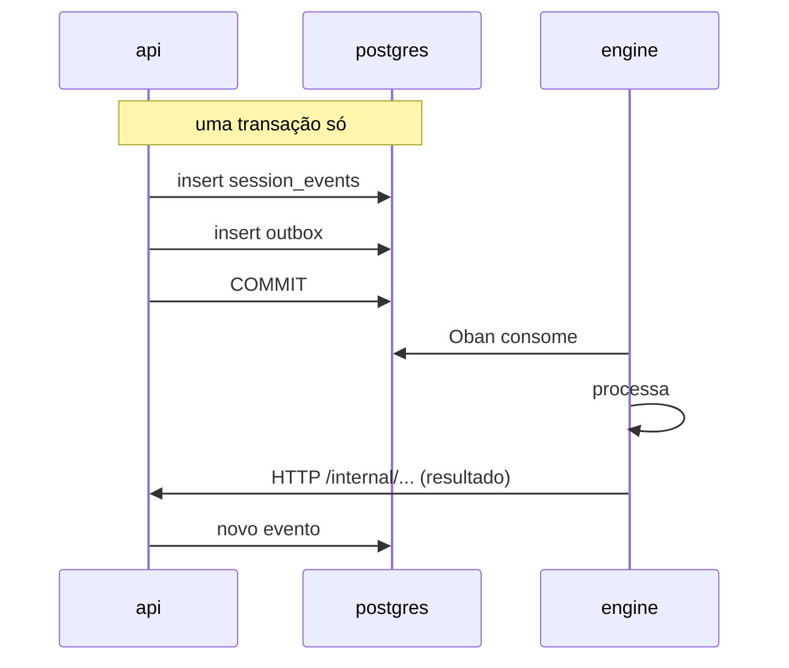

# API interna (api ↔ engine)

A api e o engine conversam de **duas** formas, e a escolha entre elas não é
estilística:

| sentido | mecanismo | quando |
|---|---|---|
| api → engine | **outbox + Oban** | eventos: algo aconteceu, o engine reage quando puder |
| api → engine | **HTTP** | comandos síncronos: preciso da resposta agora |
| engine → api | **HTTP** (`/internal/*`) | o engine pede dado ou registra resultado |

O critério: se a operação precisa ser atômica com uma escrita no banco, vai
pelo outbox — a api grava o evento e a intenção de publicá-lo na mesma
transação, e não existe janela em que uma exista sem a outra. Se ela precisa de
resposta imediata, vai por HTTP.

## Autenticação

Nenhuma das duas pontas confia em rede privada. Ambas apresentam o **mesmo
service token** — um segredo compartilhado por env, rotacionável, no cabeçalho
`X-Brabo-Service-Token`:

| chamador | verificado por | comparação |
|---|---|---|
| engine → api | `EngineServiceGuard` | `comparaEmTempoConstante` |
| api → engine | `EngineWeb.Plugs.VerifyServiceToken` | `Plug.Crypto.secure_compare/2` |

> **Este tráfego não passa pelo JWT.** As rotas `/internal/*` são anotadas com
> `@ServiceRoute()`, o que as tira do `JwtAuthGuard` e as isenta do
> `RateLimitGuard` (que roda antes do guard de controller, então a isenção
> precisa vir do metadado). Um access token de usuário, mesmo de um `owner`,
> não abre nenhuma delas; e o service token não abre nenhuma outra rota. Ver
> [RN-035](../business-rules.md#rn-035).

> **Rotação sem downtime.** `BRABO_SERVICE_TOKEN` é o valor enviado;
> `BRABO_SERVICE_TOKEN_PREVIOUS` é aceito **só na verificação**. Como os dois
> lados enviam o atual e aceitam ambos, a rotação é a mesma dança em três
> etapas do `AUTH_JWT_SECRET`, descrita no
> [runbook](../runbook.md#rotacao-das-chaves-do-auth).

## Correlação

Toda chamada entre os dois serviços leva também o cabeçalho `traceparent` (W3C),
e isso vale nos **dois sentidos e em todos os métodos** — GET, POST e o stream de
SSE do turno de LLM. Cada lado tem um funil único que monta os cabeçalhos:

| chamador | funil |
|---|---|
| api → engine | `HttpApiToEngineClient.buildHeaders()` |
| engine → api | `EngineApiClient.headers/0` |

Até o [ADR 0035](../adr/0035-observabilidade-legivel-e-trace-sem-coletor.md) o
`traceparent` do lado do engine era injetado apenas nos POSTs, então as leituras
(`list_events`, o contexto do agente) e o `llm_turn_stream` chegavam à api sem
correlação — apareciam no Tempo como traces órfãs. Se você acrescentar uma chamada
nova neste contrato, use o funil: é o que garante que ela não nasça órfã.

> A recusa de service token é registrada em log dos dois lados, com rota e origem
> — e **sem** o token apresentado. Um 401 aqui é indistinguível, sem log, de
> "engine fora do ar", que era exatamente o sintoma antes.

> As rotas `/internal/*` **não são internas por convenção de nome.** O prefixo é
> legibilidade; o que as protege é o guard verificando o service token. A
> classificação
> completa está em
> [`docs/security-surface.md`](../security-surface.md), e um teste de tabela
> reprova rota nova sem classificação.

## engine → api

Vinte e sete rotas, todas sob `/internal/sessions/:sessionId/` salvo indicação.
Agrupadas pelo que fazem:

### Event log e ações

| método | caminho |
|---|---|
| GET · POST | `/events` |
| POST | `/actions` |
| POST | `/termination` |
| POST | `/handoffs` |

O engine nunca escreve na tabela de eventos direto — ele **pede** à api, que é
quem controla a `seq` e a atomicidade com o outbox.

### LLM

| método | caminho |
|---|---|
| POST | `/llm-turn` |
| POST | `/llm-turn-stream` |

Toda chamada de modelo passa pela api. Não é indireção gratuita: é onde o
metering acontece e onde o orçamento pode **recusar** a chamada. Um engine que
falasse direto com o provedor tornaria o teto de gasto inaplicável.

### Catálogo de modelos

| método | caminho |
|---|---|
| POST | `/internal/models/sync` (**não** é session-scoped) |

A única rota `engine → api` fora de `/internal/sessions/:sessionId/`, porque o
sync de catálogo não pertence a sessão nenhuma: é do workspace inteiro. Quem
**agenda** é o engine (`ModelSyncSchedulerWorker`, Oban, com o mesmo idioma de
worker que se reagenda do `AnamneseSchedulerWorker`); quem tem as credenciais e
o registry de providers é a api. Duplicar o registry no Elixir seria manter dois
catálogos — ver [ADR 0042](../adr/0042-catalogo-vivo-ciclo-de-vida-do-modelo-e-preco-auditavel.md).

Responde **200** com um relatório por provider (`porProvider[]`), nunca 5xx por
causa de um provider: cada linha traz `descobertos`, `reencontrados`,
`indisponibilizados` e — quando o provider não foi sincronizado — `pulado`
(`sem_capability` | `sem_credencial` | `falha`) com `origemDaFalha`
(`infra` | `modelo`) e `detalhe`. Provider pulado **não indisponibiliza nada**:
"não sei o que tem lá" não é "não tem nada lá"
([RN-043](../business-rules.md#rn-043)). O corpo completo está no
[OpenAPI gerado](api/brabo-api) sob a tag `internal`.

### Contexto por agente

| método | caminho |
|---|---|
| GET | `/dev-context` |
| GET | `/infra-context` |
| GET | `/psychologist-context` |
| GET | `/anamnese-context` |
| GET | `/infra-artifacts/:prActionId/files` |

Um endpoint por agente, em vez de um genérico: cada um monta exatamente o que
aquele papel precisa, e o Harness não fica filtrando no engine o que a api
poderia não ter enviado.

`/infra-context` ganhou `gitProvider` na Fase 8c (`null` sem repositório
provisionado) — é como o subagente Workflows decide `.github/workflows/
ci.yml` vs `.gitlab-ci.yml`, sem rota nova (mesmo padrão de "um GET por
agente" — ver [RN-037](../business-rules.md#rn-037)). **Não** é
`capabilities` do `GitProvider`: GitHub e GitLab têm as MESMAS capabilities
(`{protectBranch: true, pullRequests: true}`) — só `provider.name` distingue.

### Backlog e arquitetura

| método | caminho |
|---|---|
| POST | `/epics` · `/stories` · `/tasks` |
| POST | `/story-modules` |
| POST | `/module-map` |
| POST | `/tasks/claim` |
| POST | `/tasks/:taskId/status` |
| POST | `/tasks/:taskId/block` |

`tasks/claim` é atômico do lado da api — é o que impede dois dev agents de
pegarem a mesma task.

### Gates

| método | caminho |
|---|---|
| POST | `/tasks/:taskId/gate/open` |
| POST | `/gates/verdict` |
| POST | `/infra-gates/verdict` |
| POST | `/delegations` |

A **máquina de estados de gate vive na api**, não no engine. O engine reporta o
parecer; quem decide se a transição é legal — e recusa QA tentando pular para
`awaiting_user` — é o domínio ([RN-014](../business-rules.md#rn-014)).

`/delegations` é DIFERENTE dos outros três: não move a máquina de estados do
gate — só registra o desfecho de um delegado de área (QA, Fase 8b; Infra,
Fase 8c — [ADR 0038](../adr/0038-hierarquia-de-agentes.md)). O lead da área
chama esta rota uma vez por delegado (`completed`/`failed`/`dispensed`),
SEPARADO da chamada que a área usa pra reportar o resultado consolidado pra
fora (`/gates/verdict` pro QA, `open_infra_pr` pro Infra) — ver
[RN-036](../business-rules.md#rn-036)/[RN-037](../business-rules.md#rn-037).
Session-scoped, não task-scoped: `taskId` vai no CORPO, opcional — QA sempre
manda, Infra nunca manda (a delegação é sobre a sessão, sem task de backlog
por trás de uma PR de infra).

### Psicólogo e Anamnese

| método | caminho |
|---|---|
| POST | `/hypotheses` |
| POST | `/proficiency` |
| POST | `/instruction-patches` |

A validação de evidência ([RN-021](../business-rules.md#rn-021)) e o catálogo
fechado de competências ([RN-024](../business-rules.md#rn-024)) são aplicados
**aqui**, na api. O engine não consegue gravar uma hipótese sem evidência
válida nem perfilar uma competência fora do catálogo, ainda que o modelo peça.

## api → engine

Doze rotas de comando, mais as de saúde. Sob `/internal` com `VerifyServiceToken`:

| método | caminho | o que dispara |
|---|---|---|
| POST | `/sessions` | sobe o `SessionServer` |
| POST | `/sessions/:id/agent/start` | inicia um turno de agente |
| POST | `/sessions/:id/agent/message` | mensagem do usuário no fio |
| POST | `/sessions/:id/agent/readiness` | confirmação de prontidão |
| POST | `/sessions/:id/agent/offer-infra-handoff` | oferta de handoff ao Infra |
| POST | `/sessions/:id/execution/start` | ativa a fase de execução |
| POST | `/sessions/:id/execution/parallelize` | cria subagentes |
| POST | `/sessions/:id/dev-agents/:agentId/rearm` | rearma um dev agent travado (Fase 12b — RN-047); 404 se não existe, **409 se não está `idle_tripped`** |
| POST | `/sessions/:id/psychologist/reanalyze` | reanálise sob demanda |
| POST | `/projects/:id/anamnese/run` | execução da Anamnese |
| POST | `/projects/:id/agents/:agent/instructions/invalidate` | invalida o cache de instrução |
| POST | `/actions/execute` · `/actions/execute-git` | executa uma ação **já aprovada** |

`/actions/execute` merece atenção: ele executa, não decide. A decisão já
aconteceu na api. Se o engine pudesse decidir, o pipeline de aprovação teria
uma porta dos fundos.

### Saúde e métricas

| caminho | responde |
|---|---|
| `/health` | conexão com o Postgres |
| `/live` | **sem tocar o banco** — um liveness ligado ao Postgres reiniciaria todas as réplicas de uma vez num banco lento |
| `/ready` | só libera tráfego depois que a reidratação de sessões terminou; vira 503 durante o drain |
| `/metrics` | Prometheus, incluindo `oban_queue_depth{queue,state}` |

Três probes porque as perguntas são diferentes
([ADR 0025](../adr/0025-fase5-deploy-kubernetes-kustomize.md)).

## O caminho do evento

Não há broker. A fila é o Postgres, via Oban — e é por isso que a profundidade
dela é uma métrica de banco, consultável por SQL, e serve de sinal para o HPA.

O diagrama acima é o caminho de `aggregate_type = "session"` — todo evento de
domínio grava um `session_events` na mesma transação do outbox. A Fase 12b
acrescentou `aggregate_type = "task"` (`task.gate_resolved`,
`task.became_claimable`, o reagendamento do dev agent): sem `session_events`
correspondente, só a linha de outbox — o Drain roteia pro
`Engine.Workers.DevAgentWakeWorker`, que entrega por PubSub a UM agente
específico ou a todos os `idle` de um módulo. Ver
[ADR 0045](../adr/0045-reagendamento-por-evento-do-dev-agent.md).

## Onde o contrato vive

Desde a Fase 7b existe **OpenAPI** para o sentido engine → api: as 26 rotas
abaixo estão na [referência gerada](api/brabo-api), sob a tag `internal`, com
corpo de request, corpo de response e códigos de erro. O documento sai do
código por `pnpm docs:generate` e o `docs:check` reprova quando ele
desatualiza.

| lado | fonte |
|---|---|
| rotas da api | o [OpenAPI gerado](api/brabo-api) (contrato) e [`security-surface.md`](../security-surface.md) (exposição) |
| rotas do engine | `apps/engine/lib/engine_web/router.ex` |
| tipos compartilhados | `packages/shared/src/index.ts` (só api ↔ web) |
| cliente do engine | `apps/engine/lib/engine/sessions/engine_api_client.ex` |

> **TODO(humano):** a referência gerada dá às duas pontas a mesma fonte para
> conferir, mas **não fecha a lacuna**: continua não havendo checagem
> automática de que o `engine_api_client.ex` bate com as rotas da api. Ele é o
> arquivo mais alterado do engine, e uma mudança de assinatura ainda só aparece
> em runtime. O que fecharia de verdade é gerar o cliente Elixir a partir do
> `openapi.json`, ou um teste de contrato entre as duas pontas.
