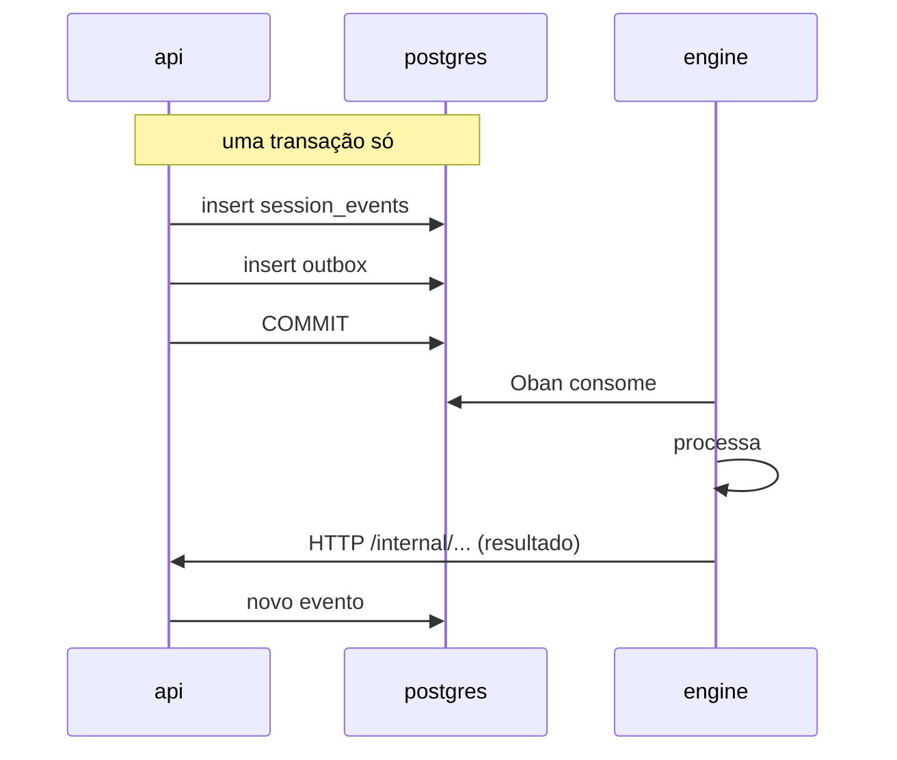

# API interna (api ↔ engine)

A api e o engine conversam de **duas** formas, e a escolha entre elas não é
estilística:

| sentido | mecanismo | quando |
|---|---|---|
| api → engine | **outbox + Oban** | eventos: algo aconteceu, o engine reage quando puder |
| api → engine | **HTTP** | comandos síncronos: preciso da resposta agora |
| engine → api | **HTTP** (`/internal/*`) | o engine pede dado ou registra resultado |

O critério: se a operação precisa ser atômica com uma escrita no banco, vai
pelo outbox — a api grava o evento e a intenção de publicá-lo na mesma
transação, e não existe janela em que uma exista sem a outra. Se ela precisa de
resposta imediata, vai por HTTP.

## Autenticação

Nenhuma das duas pontas confia em rede privada. Ambas apresentam o **mesmo
service token** — um segredo compartilhado por env, rotacionável, no cabeçalho
`X-Brabo-Service-Token`:

| chamador | verificado por | comparação |
|---|---|---|
| engine → api | `EngineServiceGuard` | `comparaEmTempoConstante` |
| api → engine | `EngineWeb.Plugs.VerifyServiceToken` | `Plug.Crypto.secure_compare/2` |

> **Este tráfego não passa pelo JWT.** As rotas `/internal/*` são anotadas com
> `@ServiceRoute()`, o que as tira do `JwtAuthGuard` e as isenta do
> `RateLimitGuard` (que roda antes do guard de controller, então a isenção
> precisa vir do metadado). Um access token de usuário, mesmo de um `owner`,
> não abre nenhuma delas; e o service token não abre nenhuma outra rota. Ver
> [RN-035](../business-rules.md#rn-035).

> **Rotação sem downtime.** `BRABO_SERVICE_TOKEN` é o valor enviado;
> `BRABO_SERVICE_TOKEN_PREVIOUS` é aceito **só na verificação**. Como os dois
> lados enviam o atual e aceitam ambos, a rotação é a mesma dança em três
> etapas do `AUTH_JWT_SECRET`, descrita no
> [runbook](../runbook.md#rotacao-das-chaves-do-auth).

> As rotas `/internal/*` **não são internas por convenção de nome.** O prefixo é
> legibilidade; o que as protege é o guard verificando o service token. A
> classificação
> completa está em
> [`docs/security-surface.md`](../security-surface.md), e um teste de tabela
> reprova rota nova sem classificação.

## engine → api

Vinte e seis rotas, todas sob `/internal/sessions/:sessionId/` salvo indicação.
Agrupadas pelo que fazem:

### Event log e ações

| método | caminho |
|---|---|
| GET · POST | `/events` |
| POST | `/actions` |
| POST | `/termination` |
| POST | `/handoffs` |

O engine nunca escreve na tabela de eventos direto — ele **pede** à api, que é
quem controla a `seq` e a atomicidade com o outbox.

### LLM

| método | caminho |
|---|---|
| POST | `/llm-turn` |
| POST | `/llm-turn-stream` |

Toda chamada de modelo passa pela api. Não é indireção gratuita: é onde o
metering acontece e onde o orçamento pode **recusar** a chamada. Um engine que
falasse direto com o provedor tornaria o teto de gasto inaplicável.

### Contexto por agente

| método | caminho |
|---|---|
| GET | `/dev-context` |
| GET | `/infra-context` |
| GET | `/psychologist-context` |
| GET | `/anamnese-context` |
| GET | `/infra-artifacts/:prActionId/files` |

Um endpoint por agente, em vez de um genérico: cada um monta exatamente o que
aquele papel precisa, e o Harness não fica filtrando no engine o que a api
poderia não ter enviado.

### Backlog e arquitetura

| método | caminho |
|---|---|
| POST | `/epics` · `/stories` · `/tasks` |
| POST | `/story-modules` |
| POST | `/module-map` |
| POST | `/tasks/claim` |
| POST | `/tasks/:taskId/status` |
| POST | `/tasks/:taskId/block` |

`tasks/claim` é atômico do lado da api — é o que impede dois dev agents de
pegarem a mesma task.

### Gates

| método | caminho |
|---|---|
| POST | `/tasks/:taskId/gate/open` |
| POST | `/gates/verdict` |
| POST | `/infra-gates/verdict` |

A **máquina de estados de gate vive na api**, não no engine. O engine reporta o
parecer; quem decide se a transição é legal — e recusa QA tentando pular para
`awaiting_user` — é o domínio ([RN-014](../business-rules.md#rn-014)).

### Psicólogo e Anamnese

| método | caminho |
|---|---|
| POST | `/hypotheses` |
| POST | `/proficiency` |
| POST | `/instruction-patches` |

A validação de evidência ([RN-021](../business-rules.md#rn-021)) e o catálogo
fechado de competências ([RN-024](../business-rules.md#rn-024)) são aplicados
**aqui**, na api. O engine não consegue gravar uma hipótese sem evidência
válida nem perfilar uma competência fora do catálogo, ainda que o modelo peça.

## api → engine

Onze rotas de comando, mais as de saúde. Sob `/internal` com `VerifyApiToken`:

| método | caminho | o que dispara |
|---|---|---|
| POST | `/sessions` | sobe o `SessionServer` |
| POST | `/sessions/:id/agent/start` | inicia um turno de agente |
| POST | `/sessions/:id/agent/message` | mensagem do usuário no fio |
| POST | `/sessions/:id/agent/readiness` | confirmação de prontidão |
| POST | `/sessions/:id/agent/offer-infra-handoff` | oferta de handoff ao Infra |
| POST | `/sessions/:id/execution/start` | ativa a fase de execução |
| POST | `/sessions/:id/execution/parallelize` | cria subagentes |
| POST | `/sessions/:id/psychologist/reanalyze` | reanálise sob demanda |
| POST | `/projects/:id/anamnese/run` | execução da Anamnese |
| POST | `/projects/:id/agents/:agent/instructions/invalidate` | invalida o cache de instrução |
| POST | `/actions/execute` · `/actions/execute-git` | executa uma ação **já aprovada** |

`/actions/execute` merece atenção: ele executa, não decide. A decisão já
aconteceu na api. Se o engine pudesse decidir, o pipeline de aprovação teria
uma porta dos fundos.

### Saúde e métricas

| caminho | responde |
|---|---|
| `/health` | conexão com o Postgres |
| `/live` | **sem tocar o banco** — um liveness ligado ao Postgres reiniciaria todas as réplicas de uma vez num banco lento |
| `/ready` | só libera tráfego depois que a reidratação de sessões terminou; vira 503 durante o drain |
| `/metrics` | Prometheus, incluindo `oban_queue_depth{queue,state}` |

Três probes porque as perguntas são diferentes
([ADR 0025](../adr/0025-fase5-deploy-kubernetes-kustomize.md)).

## O caminho do evento

Não há broker. A fila é o Postgres, via Oban — e é por isso que a profundidade
dela é uma métrica de banco, consultável por SQL, e serve de sinal para o HPA.

## Onde o contrato vive

Não há OpenAPI nem Protobuf. O contrato é:

| lado | fonte |
|---|---|
| rotas da api | `apps/api/src/interfaces/http/**`, classificadas em [`security-surface.md`](../security-surface.md) |
| rotas do engine | `apps/engine/lib/engine_web/router.ex` |
| tipos compartilhados | `packages/shared/src/index.ts` (só api ↔ web) |
| cliente do engine | `apps/engine/lib/engine/sessions/engine_api_client.ex` |

> **TODO(humano):** o `engine_api_client.ex` é o arquivo mais alterado do
> engine (15 mudanças) e é onde o contrato realmente se materializa — sem
> nenhuma checagem automática de que ele bate com as rotas da api. Uma mudança
> de assinatura só aparece em runtime. Gerar tipos a partir das rotas, ou ao
> menos um teste de contrato entre as duas pontas, fecharia essa lacuna.
