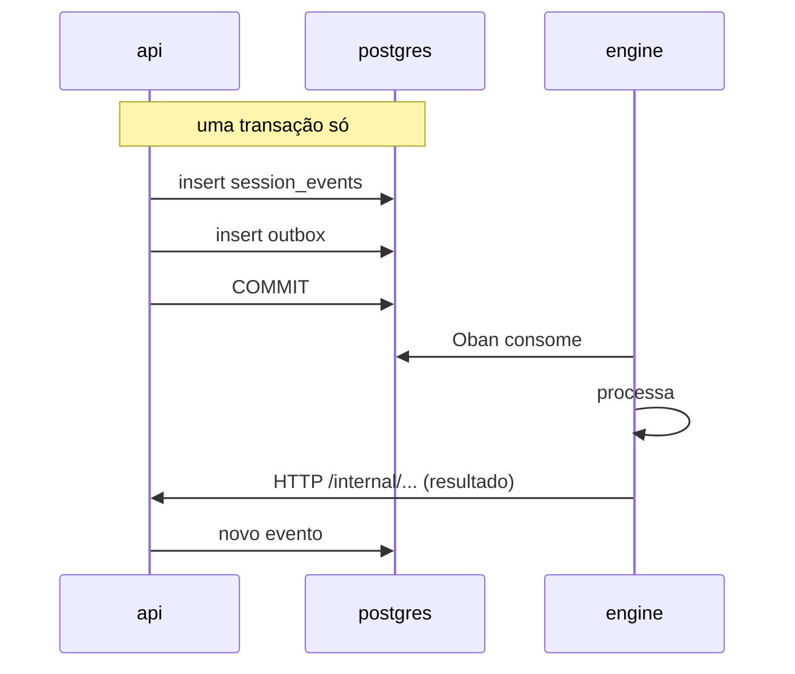

# API interna (api ↔ engine)

A api e o engine conversam de **duas** formas, e a escolha entre elas não é
estilística:

| sentido | mecanismo | quando |
|---|---|---|
| api → engine | **outbox + Oban** | eventos: algo aconteceu, o engine reage quando puder |
| api → engine | **HTTP** | comandos síncronos: preciso da resposta agora |
| engine → api | **HTTP** (`/internal/*`) | o engine pede dado ou registra resultado |

O critério: se a operação precisa ser atômica com uma escrita no banco, vai
pelo outbox — a api grava o evento e a intenção de publicá-lo na mesma
transação, e não existe janela em que uma exista sem a outra. Se ela precisa de
resposta imediata, vai por HTTP.

**Fora do escopo desta página**: rotas HTTP autenticadas pelo JWT normal do
usuário (RBAC por papel, `@RequireRole`) — como
`/projects/:projectId/agent-autonomy` — não são "internas" no sentido deste
documento, mesmo quando um agente é quem efetivamente chama através delas. O
service token compartilhado NUNCA serve como credencial nessas rotas, e o JWT
de usuário nunca serve em `/internal/*` — os dois mecanismos não se sobrepõem
([RN-035](../business-rules.md#rn-035)). A classificação de exposição de toda
rota HTTP, interna ou não, está em [docs/security-surface.md](../security-surface.md).

## Autenticação

Nenhuma das duas pontas confia em rede privada. Ambas apresentam o **mesmo
service token** — um segredo compartilhado por env, rotacionável, no cabeçalho
`X-Brabo-Service-Token`:

| chamador | verificado por | comparação |
|---|---|---|
| engine → api | `EngineServiceGuard` | `comparaEmTempoConstante` |
| api → engine | `EngineWeb.Plugs.VerifyServiceToken` | `Plug.Crypto.secure_compare/2` |

> **Este tráfego não passa pelo JWT.** As rotas `/internal/*` são anotadas com
> `@ServiceRoute()`, o que as tira do `JwtAuthGuard` e as isenta do
> `RateLimitGuard` (que roda antes do guard de controller, então a isenção
> precisa vir do metadado). Um access token de usuário, mesmo de um `owner`,
> não abre nenhuma delas; e o service token não abre nenhuma outra rota. Ver
> [RN-035](../business-rules.md#rn-035).

> **Rotação sem downtime.** `BRABO_SERVICE_TOKEN` é o valor enviado;
> `BRABO_SERVICE_TOKEN_PREVIOUS` é aceito **só na verificação**. Como os dois
> lados enviam o atual e aceitam ambos, a rotação é a mesma dança em três
> etapas do `AUTH_JWT_SECRET`, descrita no
> [runbook](../runbook.md#rotacao-das-chaves-do-auth).

## Correlação

Toda chamada entre os dois serviços leva também o cabeçalho `traceparent` (W3C),
e isso vale nos **dois sentidos e em todos os métodos** — GET, POST e o stream de
SSE do turno de LLM. Cada lado tem um funil único que monta os cabeçalhos:

| chamador | funil |
|---|---|
| api → engine | `HttpApiToEngineClient.buildHeaders()` |
| engine → api | `EngineApiClient.headers/0` |

Até o [ADR 0035](../adr/0035-observabilidade-legivel-e-trace-sem-coletor.md) o
`traceparent` do lado do engine era injetado apenas nos POSTs, então as leituras
(`list_events`, o contexto do agente) e o `llm_turn_stream` chegavam à api sem
correlação — apareciam no Tempo como traces órfãs. Se você acrescentar uma chamada
nova neste contrato, use o funil: é o que garante que ela não nasça órfã.

> A recusa de service token é registrada em log dos dois lados, com rota e origem
> — e **sem** o token apresentado. Um 401 aqui é indistinguível, sem log, de
> "engine fora do ar", que era exatamente o sintoma antes.

> As rotas `/internal/*` **não são internas por convenção de nome.** O prefixo é
> legibilidade; o que as protege é o guard verificando o service token. A
> classificação
> completa está em
> [`docs/security-surface.md`](../security-surface.md), e um teste de tabela
> reprova rota nova sem classificação.

## engine → api

Vinte e oito rotas, todas sob `/internal/sessions/:sessionId/` salvo indicação.
Agrupadas pelo que fazem:

### Event log e ações

| método | caminho |
|---|---|
| GET · POST | `/events` |
| POST | `/actions` |
| POST | `/termination` |
| POST | `/handoffs` |

O engine nunca escreve na tabela de eventos direto — ele **pede** à api, que é
quem controla a `seq` e a atomicidade com o outbox.

E é por isso que a trava do tipo de sessão mora no caso de uso do append, e não
no `ActivateExecutionUseCase`: `POST /events` daqui e a rota do usuário caem no
mesmo funil. Desde a FASE 20, `execution.activated` numa sessão `consultiva`
responde **409** por este caminho também — o tipo é intenção de criação e o
evento não o promove ([RN-097](../business-rules.md#rn-097)). Nenhuma outra
mudança de contrato: os demais tipos de evento seguem idênticos, e a recusa
acontece **antes** do `incrementSeq`, então tentativa recusada não abre buraco
na `seq`.

`ActivateExecutionUseCase` ganhou um segundo efeito colateral que **não** passa
por nenhuma rota deste documento ([RN-135](../business-rules.md#rn-135)): ao
final da ativação, se a rota do usuário informar `originSessionId` (a sessão de
CHAT de onde partiu o clique), ele fecha essa sessão via
`TransitionSessionUseCase` — o mesmo caminho que o `POST /termination` desta
página usa para o engine reportar término, mas disparado pela api, sem viagem
nenhuma ao engine. Nenhuma rota nova, nenhuma mudança no contrato `engine → api`
existente.

`GET /projects/:projectId/execution/session` ([RN-139](../business-rules.md#rn-139))
é a mesma história ao contrário: expõe por HTTP externo uma leitura
(`findActiveExecutionSession`) que já existia só dentro de
`ActivateExecutionUseCase`. Nenhum caminho novo `engine → api`, nenhum efeito
colateral — é `SELECT`, e o critério (sessão `active` com `execution.activated`
gravado) não muda em nada o que o engine já fazia.

### LLM

| método | caminho |
|---|---|
| POST | `/llm-turn` |
| POST | `/llm-turn-stream` |

Toda chamada de modelo passa pela api. Não é indireção gratuita: é onde o
metering acontece e onde o orçamento pode **recusar** a chamada. Um engine que
falasse direto com o provedor tornaria o teto de gasto inaplicável.

Os **dois** caminhos usam o mesmo teto de tempo, `LLM_TURN_TIMEOUT_MS` (default
300 000 ms). Um turno de LLM não é uma chamada de API comum: com modelo local o
primeiro turno ainda carrega vários GB de pesos antes do primeiro token, e com
provider de API o contexto grande demora. Em `/llm-turn-stream` o valor vale por
CHUNK recebido, ou seja, é o teto de INATIVIDADE que o
[ADR 0041](../adr/0041-base-openai-compativel-e-contrato-de-llm-providers.md)
pede — não o da
resposta inteira.

O teto precisa ser explícito nos dois: sem passá-lo, o `Req` usa o default dele,
de 15 segundos. Enquanto só o caminho não-streamado o passava, os quatro agentes
conversacionais — que usam apenas o streamado — falhavam a 15s com
`%Req.TransportError{reason: :timeout}`, classificado como origem `infra`. Com
modelo local o turno cabia nos 15s e o defeito não aparecia.

#### O frame final carrega o nome do modelo ([RN-146](../business-rules.md#rn-146))

`RunLlmTurnResult` e o quadro `final` de `LlmTurnStreamEvent` ganham
`modelName: string | null` — o nome do modelo que a api resolveu
(`resolveModelBinding` → `models.findById`) antes de chamar o provider.
`null` só quando o turno falhou ANTES de resolver um modelo nenhum (sem
binding, ou binding para modelo que não existe mais); nos demais casos —
inclusive orçamento excedido — o binding já tinha resolvido e o nome viaja
mesmo no frame de erro. Os quatro agentes conversacionais do engine
extraem o campo do frame e o incluem no payload de `agent.response`
(`modelName`), que é o que `SessionPage.tsx` lê para mostrar o modelo ao
lado do nome do agente.

#### Os relatórios de gasto NÃO passam por aqui

O metering é escrito **neste** caminho: cada `/llm-turn` grava uma linha em
`token_usage` antes de a resposta voltar ao engine. A LEITURA desse dado — a
fatura do owner (`/workspaces/:id/credential-spend` e
`/workspaces/:id/spend-report`) e o consumo do membro
(`/projects/:id/spend/me`) — é superfície **externa**, autenticada por JWT e
classificada em [security-surface.md](../security-surface.md).

Não é detalhe de organização: essas três rotas ramificam por **papel de
pessoa** — `owner` para a fatura, `viewer` para o próprio consumo
([RN-101](../business-rules.md#rn-101)). O `X-Brabo-Service-Token` não carrega
pessoa nenhuma, então uma contraparte interna teria de escolher entre não
distinguir as audiências ou receber o id do ator como parâmetro — que é
exatamente o que o [ADR 0063](../adr/0063-duas-audiencias-para-o-mesmo-gasto.md)
recusa. O engine escreve o gasto; quem o lê é gente.

### Ciclo de vida da sessão

| método | caminho |
|---|---|
| GET | `/internal/sessions/:id/pending-work` (**não** é session-scoped no sentido dos demais: é sobre a sessão, não dentro dela) |

O `SessionServer` pergunta antes de encerrar por heartbeat. O timeout mede
inatividade da ABA — 30 segundos —, e fechar sessão é sobre o TRABALHO ter
acabado, não sobre quem está olhando. Numa execução real isso prendeu um
handoff `offered` para o Arquiteto dentro de uma sessão fechada
([RN-064](../business-rules.md#rn-064)).

Resposta: `{ pending, motivo }`. `motivo` vai para o log do engine — sessão que
se recusa a fechar sem dizer por quê é indiagnosticável. E api fora do ar
**não** impede o encerramento: trocar sessão órfã por sessão imortal seria
trocar um defeito por outro.

### Registro de gates

| método | caminho |
|---|---|
| GET | `/internal/gates` (**não** é session-scoped) |

Leitura do registro declarativo de `docs/gates.yml`
([ADR 0054](../adr/0054-gates-como-registro-declarativo.md)). Não é
session-scoped pelo mesmo motivo do catálogo de modelos: o registro é global —
quais gates existem é fato do produto, igual para todo projeto.

Read-only, e sem rota de escrita **de propósito**: o registro muda por PR
revisado, não em runtime. Uma rota de escrita transformaria uma decisão de
engenharia em configuração de produção, que é o que o ADR recusou ao escolher
YAML em vez de tabela.

O arquivo viaja dentro da imagem (`COPY docs/gates.yml` em
`docker/api/Dockerfile.prod`), como as migrations: o loader sobe de
`__dirname` até achá-lo, e em produção o encontra em `/app/docs/gates.yml`. A
carga é preguiçosa — arquivo ilegível responde erro nesta rota, em vez de
impedir a api de subir.

O mecanismo inteiro está em
[docs/explanation/gates.md](../explanation/gates.md).

**Há uma segunda rota para o mesmo registro, e ela NÃO é interna.** O painel do
time (FASE 15b) lê `GET /gates`, autenticada por JWT de usuário como qualquer
rota de produto. Não é duplicação por descuido: `/internal/*` é autenticada por
**service token**, que o navegador não tem e não pode ter — entregá-lo ao front
daria a ele a superfície interna inteira, não só os gates. As duas diferem
também no que devolvem: a interna entrega o registro como está no YAML, a
pública devolve **só os gates `active`**, porque um gate `planned` é
planejamento de engenharia e não tem por que aparecer na tela de quem espera
uma PR. A classificação das duas está em
[docs/security-surface.md](../security-surface.md).

### Catálogo de modelos

| método | caminho |
|---|---|
| POST | `/internal/models/sync` (**não** é session-scoped) |

Uma das duas rotas `engine → api` fora de `/internal/sessions/:sessionId/` (a
outra é o [remoto de trabalho](#remoto-de-trabalho-do-projeto)), porque o
sync de catálogo não pertence a sessão nem a workspace nenhum: o catálogo é
GLOBAL — nome, preço, janela e capabilities são fato do provider, iguais para
todo mundo. Desde o [ADR 0051](../adr/0051-facetas-de-capability-e-curadoria-por-uso.md)
isso inclui as facetas de modalidade (lê imagem, gera imagem, thinking), que a
mesma chamada reconcilia a partir do catálogo remoto — modalidade que o
provider não declara fica preservada, não zerada. O que é por workspace é a **curadoria**, e o sync não a alcança
([ADR 0049](../adr/0049-curadoria-de-modelo-por-workspace.md)). Quem
**agenda** é o engine (`ModelSyncSchedulerWorker`, Oban, com o mesmo idioma de
worker que se reagenda do `AnamneseSchedulerWorker`); quem tem as credenciais e
o registry de providers é a api. Duplicar o registry no Elixir seria manter dois
catálogos — ver [ADR 0042](../adr/0042-catalogo-vivo-ciclo-de-vida-do-modelo-e-preco-auditavel.md).

Responde **200** com um relatório por provider (`porProvider[]`), nunca 5xx por
causa de um provider: cada linha traz `descobertos`, `reencontrados`,
`indisponibilizados` e — quando o provider não foi sincronizado — `pulado`
(`sem_capability` | `sem_credencial` | `falha`) com `origemDaFalha`
(`infra` | `modelo`) e `detalhe`. Provider pulado **não indisponibiliza nada**:
"não sei o que tem lá" não é "não tem nada lá"
([RN-043](../business-rules.md#rn-043)). O corpo completo está no
[OpenAPI gerado](api/brabo-api) sob a tag `internal`.

Duas coisas que esta rota **não** faz, e que já foram diferentes:

- **Não liga nem desliga modelo em workspace nenhum.** `descobertos` conta
  linhas novas em `models`; nenhuma delas ganha curadoria. Modelo descoberto
  não tem linha em `workspace_models`, e ausência de linha é o desligado
  ([RN-052](../business-rules.md#rn-052)).
- **Não troca preço em silêncio.** Preço marcado `manual_pricing` é preservado
  como está, e toda troca que o sync faz grava uma linha em
  `model_price_changes` com origem `sync` — na mesma transação da escrita
  ([RN-044](../business-rules.md#rn-044), [RN-051](../business-rules.md#rn-051)).

### Remoto de trabalho do projeto

| método | caminho |
|---|---|
| GET | `/internal/projects/:projectId/git-remote` (**não** é session-scoped) |

A segunda rota `engine → api` fora de `/internal/sessions/:sessionId/`, e a
**única do produto que devolve um segredo decifrado**
([ADR 0056](../adr/0056-o-engine-trabalha-em-repositorio-remoto.md)).

Ela existe pela mesma divisão do sync de catálogo, aplicada a outro recurso:
quem trabalha no sistema de arquivos é o engine, quem tem a chave mestra é a
api. Sem ela, projeto em provider remoto fazia a metade conversacional e parava
na de construção — `get_local_repo_path/1` recusava tudo que não fosse `local`,
e worktree, terminal, diff de gate e contexto paravam junto.

Responde com a origem **limpa** (`origin`), a branch default e, para provider
remoto, `token` e `username` à parte. A separação não é estética:

> **O `origin` nunca carrega credencial.** É esse valor que fica gravado no
> `.git/config` do workspace, **dentro da pasta onde o dev agent tem leitura
> auto-aprovada** ([RN-075](../business-rules.md#rn-075)). Uma URL do tipo
> `https://x-access-token:TOKEN@…` ali seria um `cat .git/config` de distância
> de virar contexto de LLM.

Quem consome tem a obrigação simétrica: injetar o token **por invocação**, no
ambiente do processo filho de cada chamada do git, e nunca em argv nem em
arquivo ([RN-076](../business-rules.md#rn-076), `Engine.Actions.GitAuth`).

A credencial é a do **owner do workspace**, pelo mesmo resolvedor da
[RN-058](../business-rules.md#rn-058). Provider `local` **não chega aqui**: é
resolvido direto do banco pelo engine, não tem token e não depende de a api
estar no ar — é o caminho que o `pnpm dev` e a suite inteira exercitam.

#### A aba Code NÃO passa por aqui, e a assimetria é o ponto

A superfície de leitura de código da FASE 26b (`/projects/:projectId/code/*`)
**não tem contraparte interna**, e é útil dizer por quê — a rota acima existe
para o caso oposto, e as duas juntas mostram a divisão.

O engine precisa de `git-remote` porque ele trabalha no **sistema de arquivos**:
clona, cria worktree, roda comando. A aba Code não trabalha em lugar nenhum —
ela pergunta ao **provider** pelo conteúdo de uma ref, pela api, com a
credencial que a api já tem. Nada nesse caminho precisa de segredo decifrado
atravessando processo, e por isso nada nesse caminho abre rota interna.

A consequência prática é a que importa: a única rota do produto que devolve
segredo decifrado continua sendo UMA. Ler código não a multiplicou.

### Contexto por agente

| método | caminho |
|---|---|
| GET | `/dev-context` |
| GET | `/infra-context` |
| GET | `/psychologist-context` |
| GET | `/anamnese-context` |
| GET | `/infra-artifacts/:prActionId/files` |

Um endpoint por agente, em vez de um genérico: cada um monta exatamente o que
aquele papel precisa, e o Harness não fica filtrando no engine o que a api
poderia não ter enviado.

`/infra-context` ganhou `gitProvider` na Fase 8c (`null` sem repositório
provisionado) — é como o subagente Workflows decide `.github/workflows/
ci.yml` vs `.gitlab-ci.yml`, sem rota nova (mesmo padrão de "um GET por
agente" — ver [RN-037](../business-rules.md#rn-037)). **Não** é
`capabilities` do `GitProvider`: GitHub e GitLab têm as MESMAS capabilities
(`{protectBranch: true, pullRequests: true}`) — só `provider.name` distingue.

### Backlog e arquitetura

| método | caminho |
|---|---|
| POST | `/epics` · `/stories` · `/tasks` |
| POST | `/story-modules` |
| POST | `/module-map` |
| POST | `/c4-diagram` |
| POST | `/project-image` |
| POST | `/tasks/claim` |
| POST | `/tasks/:taskId/status` |
| POST | `/tasks/:taskId/block` |

`tasks/claim` é atômico do lado da api — é o que impede dois dev agents de
pegarem a mesma task.

`/project-image` é a ferramenta `choose_project_image` do Arquiteto (FASE 25a,
[ADR 0065](../adr/0065-container-por-projeto-a-fronteira-deixa-de-ser-politica.md)):
fixa a imagem de container do projeto. Do mesmo calibre de `/module-map` — o
artefato É o evento `artifact.project_image`, sem tabela própria, versionado
(o vigente é o de maior `version`). Imagem sem tag explícita (`latest`
recusado), `rationale` curto ou recurso acima do teto voltam `400`, com o
motivo inteiro no corpo — é isso que permite ao modelo corrigir pelo
tool-result em vez de reemitir igual ([RN-061](../business-rules.md#rn-061)).
Enquanto nenhuma versão existe, `GET /projects/:projectId/container` (rota
pública, `role:viewer`) devolve `status: "sem_decisao"`, e é o mesmo estado que
faz a aba Code responder `409` ([RN-105](../business-rules.md#rn-105)).

`/c4-diagram` é a ferramenta `create_c4_diagram` do Arquiteto
([RN-149](../business-rules.md#rn-149),
[ADR 0068](../adr/0068-diagrama-c4-do-arquiteto.md)): gera as sintaxes
Mermaid dos níveis Context e Container do diagrama C4 (modelo de Simon
Brown). Mesmo calibre de `/module-map`/`/project-image` — o artefato É o
evento `artifact.c4_diagram`, sem tabela, versionado (o vigente é o de
maior `version`, revisar é gerar de novo). O corpo carrega só
`system_name`/`system_description`/`actors` — os módulos do nível
Container NÃO vêm no corpo: o caso de uso busca o `module_map` VIGENTE do
projeto e o deriva de lá, nunca do que o modelo redigita. Sem module_map
vigente, `400` (não há Container level sem módulos). `GET
/projects/:projectId/architecture` (rota pública, `role:viewer`) devolve o
diagrama vigente em `c4Diagram`, no mesmo objeto que já traz `moduleMap` e
`adrs`.

**Sem task pegável, a resposta é `201` com corpo VAZIO**, não `null` no corpo: o
caso de uso devolve `null` e o NestJS serializa isso como `content-length: 0`.
Quem consome precisa tratar corpo vazio como "nada a reivindicar" — e é
justamente o que o `EngineApiClient.claim_task/4` faz, normalizando para `nil`
antes de entregar ao `AgentIo`.

Vale escrever porque a suposição contrária custou caro: o cliente assumia
`null` decodificado, recebia `""`, e o dev agent tratava a string vazia como se
fosse uma task — morrendo no momento mais comum que existe, o da fila do módulo
esvaziando (achado W, em
[achados-execucao-real.md](../explanation/achados-execucao-real.md)).

### Gates

| método | caminho |
|---|---|
| POST | `/tasks/:taskId/gate/open` |
| POST | `/gates/verdict` |
| POST | `/infra-gates/verdict` |
| POST | `/delegations` |

A **máquina de estados de gate vive na api**, não no engine. O engine reporta o
parecer; quem decide se a transição é legal — e recusa QA tentando pular para
`awaiting_user` — é o domínio ([RN-014](../business-rules.md#rn-014)).

`/delegations` é DIFERENTE dos outros três: não move a máquina de estados do
gate — só registra o desfecho de um delegado de área (QA, Fase 8b; Infra,
Fase 8c — [ADR 0038](../adr/0038-hierarquia-de-agentes.md)). O lead da área
chama esta rota uma vez por delegado (`completed`/`failed`/`dispensed`),
SEPARADO da chamada que a área usa pra reportar o resultado consolidado pra
fora (`/gates/verdict` pro QA, `open_infra_pr` pro Infra) — ver
[RN-036](../business-rules.md#rn-036)/[RN-037](../business-rules.md#rn-037).
Session-scoped, não task-scoped: `taskId` vai no CORPO, opcional — QA sempre
manda, Infra nunca manda (a delegação é sobre a sessão, sem task de backlog
por trás de uma PR de infra).

### Psicólogo e Anamnese

| método | caminho |
|---|---|
| POST | `/hypotheses` |
| POST | `/proficiency` |
| POST | `/instruction-patches` |
| POST | `/max-parallel-proposals` |

A validação de evidência ([RN-021](../business-rules.md#rn-021)) e o catálogo
fechado de competências ([RN-024](../business-rules.md#rn-024)) são aplicados
**aqui**, na api. O engine não consegue gravar uma hipótese sem evidência
válida nem perfilar uma competência fora do catálogo, ainda que o modelo peça.

`/max-parallel-proposals` (FASE 14d) segue a mesma divisão: a Anamnese propõe
subir o teto de paralelismo de uma área, e é a **api** que recusa uma proposta
que não sobe nada — a Anamnese roda periodicamente, e sem essa recusa
reproporia a mesma coisa a cada rodada. A ação que nasce daí **nunca é
auto-aprovável** ([RN-086](../business-rules.md#rn-086)): automatizar o ajuste
seria o produto elevando o próprio limite de gasto.

Esta rota **respondia `400` em todo projeto** até a FASE 18, e nada no contrato
denunciava isso: a validação `área "<key>" não existe neste projeto` é a
primeira coisa que ela faz, e `agent_areas` nunca era gravada — o `upsert` do
repositório não tinha chamador nenhum. Agora a área nasce com o projeto
([RN-094](../business-rules.md#rn-094)) e a recusa volta a significar o que
diz: chave de área inexistente. Projetos anteriores à correção são cobertos
pela migração de backfill.

## api → engine

Quinze rotas de comando, mais as de saúde. Sob `/internal` com `VerifyServiceToken`:

| método | caminho | o que dispara |
|---|---|---|
| POST | `/sessions` | sobe o `SessionServer` |
| POST | `/sessions/:id/agent/start` | inicia um turno de agente |
| POST | `/sessions/:id/agent/message` | mensagem do usuário no fio |
| POST | `/sessions/:id/agent/cancel` | cancela o turno em curso do agente ativo ([RN-122](../business-rules.md#rn-122)) — mata a Task que segura a chamada ao LLM (`Task.shutdown/2`, `:brutal_kill`); idempotente, NO-OP sem turno em curso |
| POST | `/sessions/:id/agent/readiness` | confirmação de prontidão |
| POST | `/sessions/:id/agent/revise` | devolve ao PO uma história que o usuário recusou promover (Fase 12c — RN-048); **404 se o PO não está de pé**, e isso não é erro para a api |
| POST | `/sessions/:id/agent/offer-infra-handoff` | oferta de handoff ao Infra |
| POST | `/sessions/:id/agent/offer-dev-handoff` | oferta de handoff ao **Dev Lead** (FASE 14d — [RN-087](../business-rules.md#rn-087)) |
| POST | `/sessions/:id/execution/start` | ativa a fase de execução |
| POST | `/sessions/:id/execution/parallelize` | cria subagentes — **executa, não decide** (ver abaixo) |
| POST | `/sessions/:id/dev-agents/:agentId/rearm` | rearma um dev agent travado (Fase 12b — RN-047); 404 se não existe, **409 se não está `idle_tripped`** |
| POST | `/sessions/:id/psychologist/reanalyze` | reanálise sob demanda |
| POST | `/projects/:id/anamnese/run` | execução da Anamnese |
| POST | `/projects/:id/agents/:agent/instructions/invalidate` | invalida o cache de instrução |
| POST | `/actions/execute` · `/actions/execute-git` | executa uma ação **já aprovada** |

As duas ofertas de handoff saem da **mesma** confirmação de arquitetura
pronta, e são rotas separadas de propósito: Infra e Dev são áreas com desfechos
independentes, e uma chamada só faria a falha de uma derrubar a outra. A ordem
importa — Infra primeiro, porque o event log é imutável e um handoff já
ofertado não teria como ser retratado.

`/actions/execute` merece atenção: ele executa, não decide. A decisão já
aconteceu na api. Se o engine pudesse decidir, o pipeline de aprovação teria
uma porta dos fundos.

**`execution/parallelize` é o mesmo caso, e desde a FASE 14d isso é visível.**
A rota PÚBLICA de mesmo nome (`POST /projects/:projectId/sessions/:sessionId/execution/parallelize`)
passa antes pelo teto da área ([RN-083](../business-rules.md#rn-083)): dentro
dele o agente sobe na hora; acima dele a api cria uma `proposed_action` e **não
chama o engine**. Quando o engine recebe este comando, a decisão já foi tomada
— por teto ou por você.

Vale reparar que o nome repetido nos dois lados esconde a assimetria: a rota
pública é o PORTÃO, a interna é o EXECUTOR. É a mesma divisão de
`/actions/execute`, e a razão de ela existir é idêntica.

### Saúde e métricas

| caminho | responde |
|---|---|
| `/health` | conexão com o Postgres |
| `/live` | **sem tocar o banco** — um liveness ligado ao Postgres reiniciaria todas as réplicas de uma vez num banco lento |
| `/ready` | só libera tráfego depois que a reidratação de sessões terminou; vira 503 durante o drain |
| `/metrics` | Prometheus, incluindo `oban_queue_depth{queue,state}` |

Três probes porque as perguntas são diferentes
([ADR 0025](../adr/0025-fase5-deploy-kubernetes-kustomize.md)).

## O caminho do evento

Não há broker. A fila é o Postgres, via Oban — e é por isso que a profundidade
dela é uma métrica de banco, consultável por SQL, e serve de sinal para o HPA.

O diagrama acima é o caminho de `aggregate_type = "session"` — todo evento de
domínio grava um `session_events` na mesma transação do outbox. A Fase 12b
acrescentou `aggregate_type = "task"` (`task.gate_resolved`,
`task.became_claimable`, o reagendamento do dev agent): sem `session_events`
correspondente, só a linha de outbox — o Drain roteia pro
`Engine.Workers.DevAgentWakeWorker`, que entrega por PubSub a UM agente
específico ou a todos os `idle` de um módulo. Ver
[ADR 0045](../adr/0045-reagendamento-por-evento-do-dev-agent.md).

## Onde o contrato vive

Desde a Fase 7b existe **OpenAPI** para o sentido engine → api: as 32 rotas
abaixo estão na [referência gerada](api/brabo-api), sob a tag `internal`, com
corpo de request, corpo de response e códigos de erro. O documento sai do
código por `pnpm docs:generate` e o `docs:check` reprova quando ele
desatualiza.

| lado | fonte |
|---|---|
| rotas da api | o [OpenAPI gerado](api/brabo-api) (contrato) e [`security-surface.md`](../security-surface.md) (exposição) |
| rotas do engine | `apps/engine/lib/engine_web/router.ex` |
| tipos compartilhados | `packages/shared/src/index.ts` (só api ↔ web) |
| cliente do engine | `apps/engine/lib/engine/sessions/engine_api_client.ex` |

> **TODO(humano):** a referência gerada dá às duas pontas a mesma fonte para
> conferir, mas **não fecha a lacuna**: continua não havendo checagem
> automática de que o `engine_api_client.ex` bate com as rotas da api. Ele é o
> arquivo mais alterado do engine, e uma mudança de assinatura ainda só aparece
> em runtime. O que fecharia de verdade é gerar o cliente Elixir a partir do
> `openapi.json`, ou um teste de contrato entre as duas pontas.
