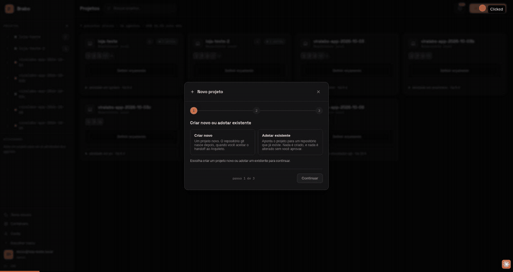
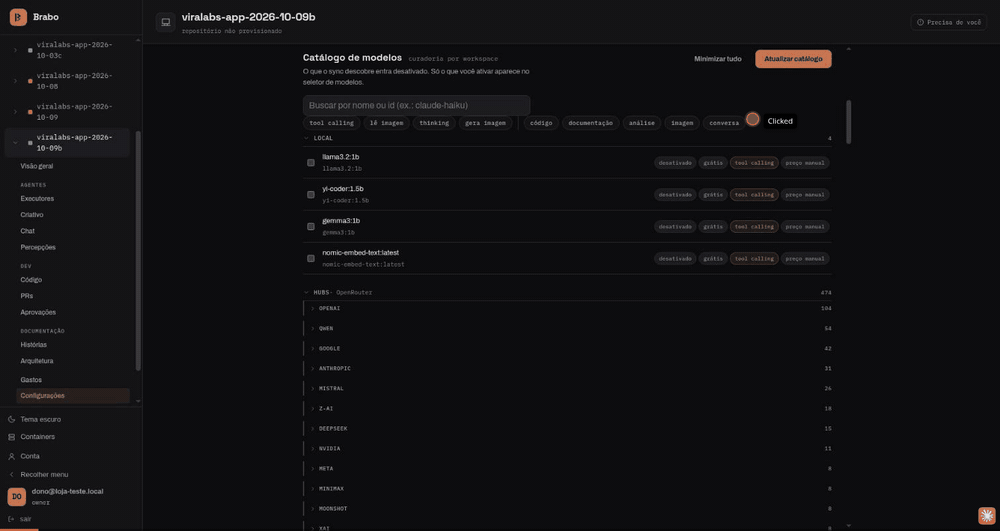
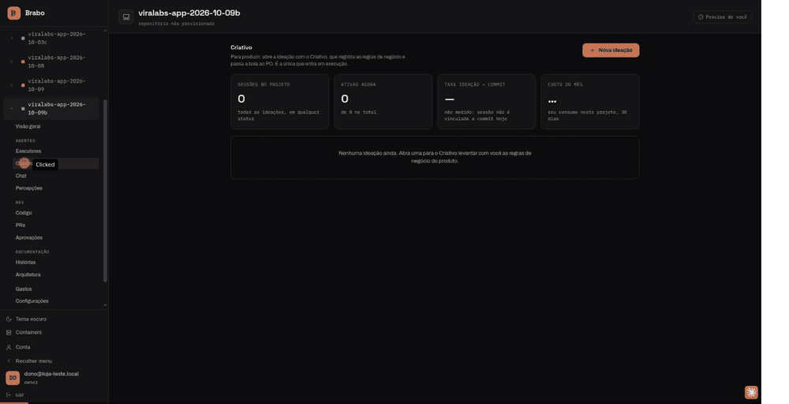
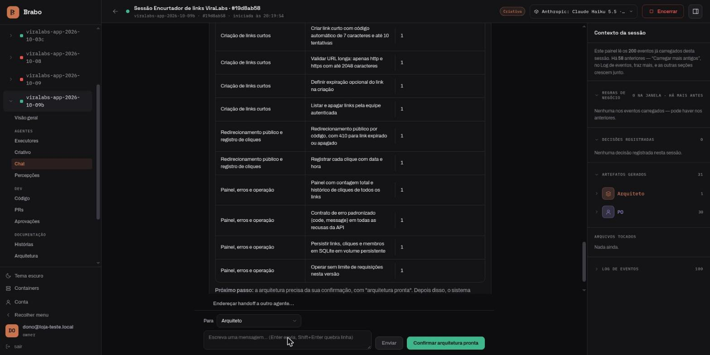
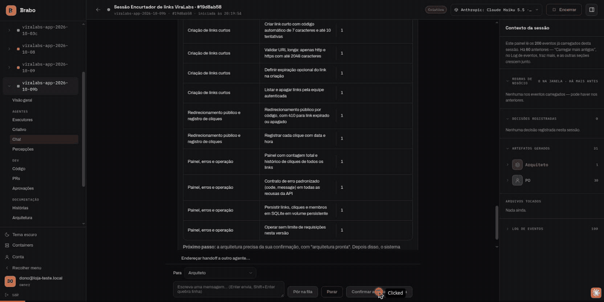
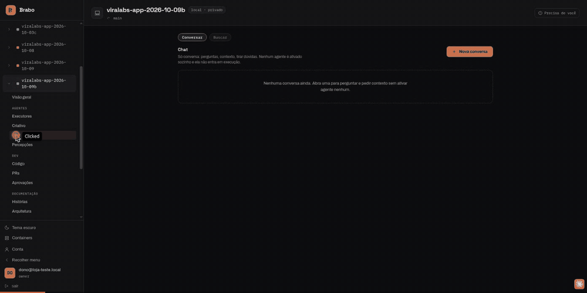
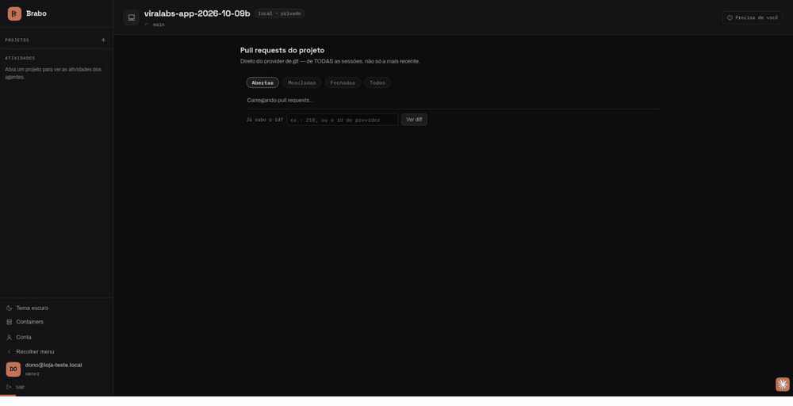

# From zero to a deliverable

This page follows one real project, recorded live on 2026-10-09, from an empty
workspace to working code. The project, `viralabs-app-2026-10-09b`, is a link
shortener (Node 22 + SQLite). The whole team ran on **Claude Haiku 5.5**, and
the run cost **US$ 0.71**.

What came out at the end: 13 stories, 12 of 13 tasks merged into the project's
`dev` branch, and a deliverable whose test suite passes **69/69**.

Each step below says what you do and what the agents hand back. The
recordings are the real screen of that run.

## 1. Create the project

You create the project in the wizard and choose where the code lives (here, a
mounted folder). Nothing is provisioned yet — the repository is born later,
when the Architect is brought in.

## 2. Give the team a model

In Settings you apply one model to every agent.
This run applied Claude Haiku 5.5 to the 17 agents in one action.

## 3. Creative, PO and Architect shape the work

You describe the product in the session chat. The **Creative** turns it into
business rules (12 rules and 1 decision, in about 40 s). The **PO** breaks
them into a backlog in one turn — 4 epics, 13 stories, 13 tasks, in about
2 minutes — and the handoff to the **Architect** is accepted automatically
once every rule is covered by a story.

You can ask the Architect about the state of the project at any time; it reads
the proposed ADRs and the backlog before answering.

## 4. ADR and infrastructure, then your merges

The Architect proposes an ADR as a pull request (`arquiteto[bot]`, PR #1) and
the Infra Lead opens the infrastructure pull request (`infra[bot]`, PR #2, in
about 25 s). Both target `dev`, and you merge them — merges into a protected
branch are always yours.

## 5. The Dev Lead proposes the plan

The Dev Lead reads the backlog and the module map and proposes the execution
plan (about 8 s). Approving the plan is what activates execution; the screen
also offers automatic mode for the whole team in one click.

## 6. Execution, gates and merges

Each task runs in a dev agent (40 s to 2.5 min per task) and goes through the
pipeline shown in the PRs tab: **Dev → QA → SecOps → You**. The pull request
title starts with the task. When the gates pass, you merge. In this run, 6
tasks passed on the first round and 6 on the second, and the execution took
about 47 minutes (PRs #3 to #14).

## The deliverable

The `dev` branch of the project repository, exported and run in
`node:22-bookworm-slim` with `npm ci` and `npm test`, passed **69/69** tests.
Running the API, the rules were checked over HTTP: requests without a session
get 401, links get a 7-character code, invalid URLs get 422, the public
redirect is a 302 that counts every click, missing/expired/deleted links get
404/410, and the panel lists the total and the click history.
