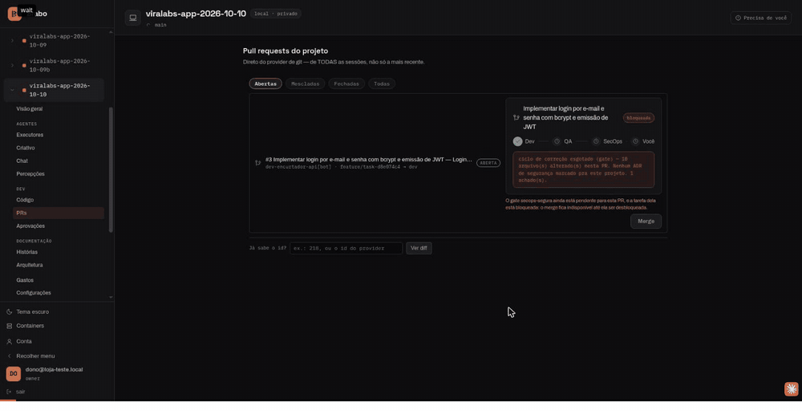

# From zero to a deliverable

This page follows one real project, recorded live on 2026-10-10, from an empty
workspace to working code. The project, `viralabs-app-2026-10-10`, is a link
shortener (Node 22 + SQLite). The whole team ran on **Claude Haiku 5.5**, and
the run cost **US$ 0.37**, taking **29 minutes** from the idea to the last merge.

What came out at the end: **8 of 8 tasks** merged into the project's `dev`
branch, and a deliverable whose test suite passes **72/72**, with an
installation README. (The previous recorded run, on 2026-10-09, merged 12 of
13 tasks.)

Each step below says what you do and what the agents hand back. The
recordings are the real screen of Brabo; steps 1 to 5 come from the
2026-10-09 run, and step 6 from the 2026-10-10 run.

## 1. Create the project

You create the project in the wizard and choose where the code lives (here, a
mounted folder). Nothing is provisioned yet — the repository is born later,
when the Architect is brought in.

## 2. Give the team a model

In Settings you apply one model to every agent.
This run applied Claude Haiku 5.5 to the 17 agents in one action.

## 3. Creative, PO and Architect shape the work

You describe the product in the session chat. The **Creative** turns it into
business rules (9 rules and 2 decisions, in about 25 s). The **PO** breaks
them into a backlog in one turn — 4 epics, 7 stories, 8 tasks, in about
1 minute — and the handoff to the **Architect** is accepted automatically
once every rule is covered by a story.

You can ask the Architect about the state of the project at any time; it reads
the proposed ADRs and the backlog before answering.

## 4. ADR and infrastructure, then your merges

The Architect proposes an ADR as a pull request (`arquiteto[bot]`, PR #1) and
the Infra Lead opens the infrastructure pull request (`infra[bot]`, PR #2, in
about 25 s). Both target `dev`, and you merge them — merges into a protected
branch are always yours.

## 5. The Dev Lead proposes the plan

The Dev Lead reads the backlog and the module map and proposes the execution
plan (about 8 s). Approving the plan is what activates execution; the screen
also offers automatic mode for the whole team in one click.

## 6. Execution, gates and merges

Each task runs in a dev agent (40 s to 2.5 min per task) and goes through the
pipeline shown in the PRs tab: **Dev → QA → SecOps → You**. The pull request
title starts with the task. When the gates pass, you merge. In this run each
task took 30 to 50 s, and the execution of the 8 tasks took about 22 minutes
(PRs #3 to #10). A task that a gate blocks shows "Unblock" on the Overview;
one click and the dev agent picks it up again in the same execution.

## The deliverable

The `dev` branch of the project repository, exported and run in
`node:22-bookworm-slim` with `npm ci` and `npm test`, passed **72/72** tests.
Running the API, all 12 rules were checked over HTTP and the CLI: users are
created with `npm run user:create` and a duplicate e-mail is refused, requests
without a session get 401, invalid URLs get 422, the public redirect is a 302
that counts every click, an expired link gets 410, the panel lists the total
and the click history, and the server refuses to start without `JWT_SECRET`.
The repository ships a README covering install, configuration, start-up and
first access.
