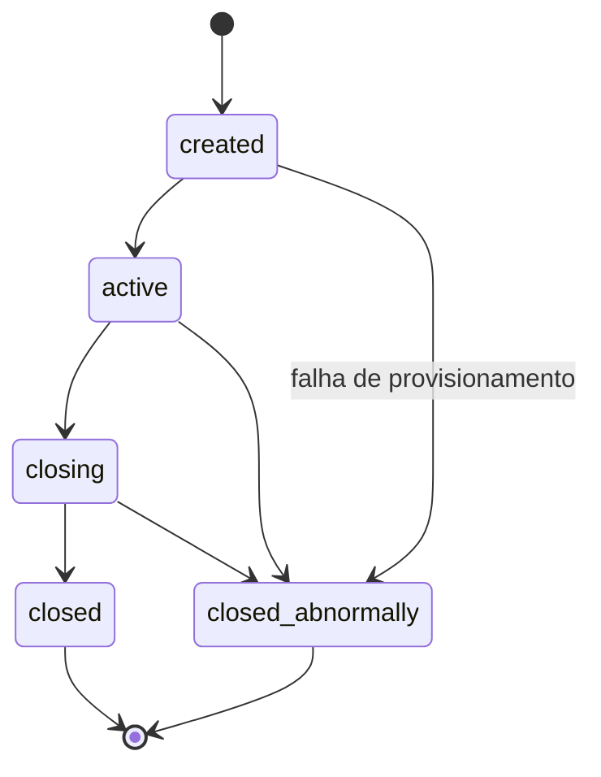
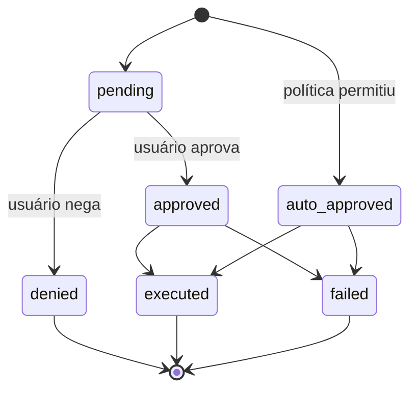
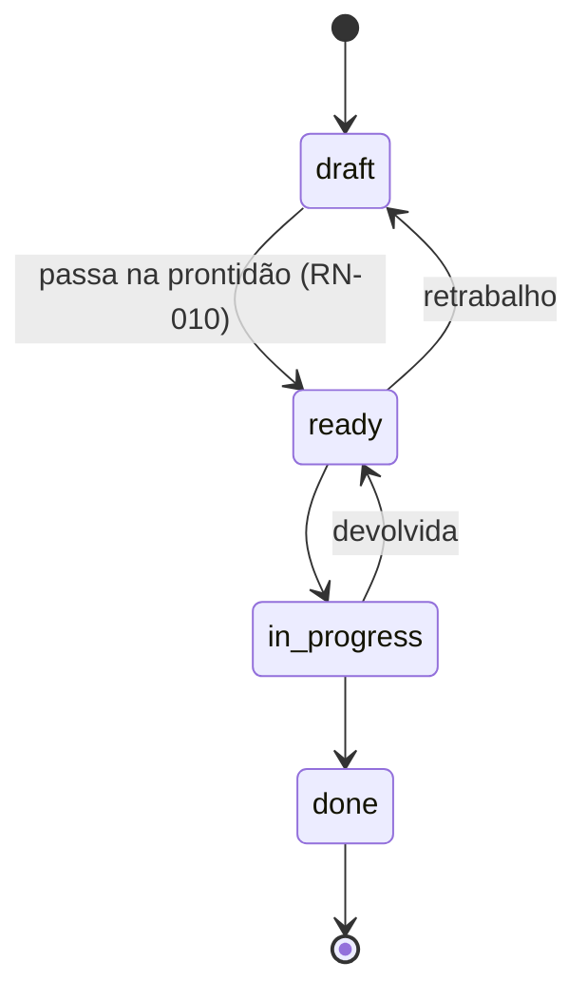
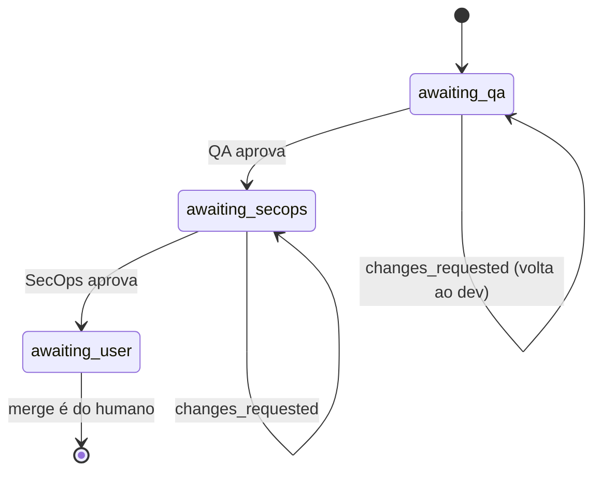

# Regras de negócio

Cada regra tem **enunciado**, **onde vive** (`arquivo:linha`) e **o teste que a
cobre**. Se você mudar uma regra, atualize a linha aqui na mesma mudança — é o
que o [`.docmap.yml`](https://github.com/daneiel/brabo/blob/dev/docs/.docmap.yml)
exige com severidade `block`.

Todas moram em `apps/api/src/domain/`, que é **puro**: sem IO, sem framework,
sem banco. É por isso que cada uma tem teste unitário rápido e determinístico.

## Contexto de negócio

O Brabo executa trabalho de engenharia através de agentes de IA. Duas forças
moldam praticamente toda regra aqui:

**O agente não é confiável por construção.** Ele é um modelo de linguagem: pode
alucinar, entrar em laço, ou pedir algo destrutivo. As regras existem para que
o dano possível seja limitado por estrutura, não por qualidade do prompt.

**O gasto é real e contínuo.** Cada turno consome token pago. Orçamento, teto e
metering não são recursos administrativos — são o que impede um laço de agente
de virar prejuízo.

### Atores

| ator | quem é | autoridade |
|---|---|---|
| **Usuário** | a pessoa. Papéis: `viewer`, `developer`, `maintainer`, `owner` | decisão final sobre toda ação com efeito externo; merge é exclusivamente dele |
| **Agente** | processo de longa duração com um papel (Criativo, PO, Arquiteto, Dev, Infra, QA, SecOps, Psicólogo, Anamnese) | propõe; nunca decide sozinho o que a política não permitir |
| **Sistema** | api e engine | aplica a política, registra o evento, mede o custo |

O vocabulário está no [glossário](glossary.md).

---

## Sessão

### RN-001 — A sessão tem cinco estados e transições fechadas {#rn-001}

`created → active → closing → closed`, com `closed_abnormally` alcançável de
qualquer estado não-terminal. **De `closing` nunca se volta para `active`**, e
estados terminais não têm saída.

- **Onde:** `apps/api/src/domain/sessions/session-state-machine.ts:29`
- **Teste:** `test/domain/sessions/session-state-machine.spec.ts`
- **Borda:** `closing` é estado de **passagem**. Sessão parada ali significa que
  o drain começou e não completou — há alerta para isso, ver o
  [runbook](runbook.md).

### RN-002 — Todo evento de sessão é imutável e a `seq` é densa {#rn-002}

Nunca há `UPDATE` em `session_events`. A `seq` é única por sessão
(`unique(session_id, seq)`) e não tem buraco: começa em 1 e é contínua.

- **Onde:** `apps/api/src/db/schema.ts` (tabela `session_events`)
- **Teste:** verificado no restore — `docker/backup/restore.sh` reprova se
  `count(*) ≠ max(seq) − min(seq) + 1` ou `min(seq) ≠ 1`
- **Por quê:** é o que torna a evidência do Psicólogo rastreável e o backup
  verificável. Estado que precisa mudar vive em tabela própria, ao lado.

### RN-097 — O tipo da sessão é intenção de criação; a execução continua sendo evento {#rn-097}

A sessão nasce `consultiva` ou `criativa`, escolhido por **quem a abre** e
gravado em `sessions.kind`. `consultiva` é só conversa; `criativa` é a que
produz — abre a ideação com o Criativo e é a **única** que entra em execução.
O tipo **não muda**: não existe rota que o troque.

O risco desta regra não é o campo, é a **segunda fonte de verdade**. O produto
já sabia dizer se uma sessão está executando, e sabia por outro caminho:
`findActiveExecutionSession` procura a sessão `active` que carrega o evento
`execution.activated` (é o que faz reativar cair na sessão onde os dev agents
já estão, achado #11 do primeiro dogfooding). As duas coexistem sob uma regra
que as impede de brigar:

- **`kind` classifica a INTENÇÃO de criação.** Uma sessão `criativa` que nunca
  ativou execução **não** é a sessão de execução vigente, e a derivação por
  evento continua sem olhar `kind` — se passasse a olhar, toda sessão criativa
  aberta viraria candidata a receber os dev agents.
- **O evento classifica o ESTADO de execução**, como sempre.
- **`execution.activated` numa sessão `consultiva` é ERRO** (409), nunca
  conversão silenciosa. É este ponto que decide qual das duas fontes manda:
  deixar o evento promover o tipo seria exatamente tê-las escrevendo uma sobre
  a outra.

A trava mora no **funil** — `AppendSessionEventUseCase` —, e não no
`ActivateExecutionUseCase`, porque os dois caminhos que gravam evento (a rota
do usuário e a `/internal/*` do engine) passam por ele. A leitura extra da
sessão é paga só quando o evento é o de execução. A recusa acontece **antes**
do `incrementSeq`: uma tentativa recusada não pode consumir `seq`, ou a
[RN-002](#rn-002) cairia.

O DEFAULT da coluna é `consultiva` — o tipo que pode **menos**: linha que
chegue por caminho que não passa pela rota (migração, SQL de manutenção) não
ganha o direito de executar. O **backfill** da migração faz o contrário e é
dirigido, pelo raciocínio da 0033: no instante em que ela roda, toda sessão é
anterior à distinção, e algumas são as sessões em que os dev agents estão
trabalhando — acordar `consultiva` faria a reativação de um projeto em
andamento falhar sem ninguém ter decidido nada.

- **Onde:** `apps/api/src/domain/sessions/session-kind.ts:50`
  (`podeAtivarExecucao`), `apps/api/src/db/schema.ts:392` (a coluna),
  `apps/api/src/application/use-cases/sessions/append-session-event.use-case.ts:53`
  (a trava)
- **Teste:** `apps/api/test/application/use-cases/sessions/session-kind-e-nome.spec.ts`
- **Origem:** [ADR 0061](adr/0061-tipo-da-sessao-na-criacao.md)

### RN-098 — O nome da sessão se soma à hashtag, nunca a substitui {#rn-098}

A sessão pode receber um nome amigável (`sessions.name`, opcional), na criação
ou depois, por `PATCH /projects/:projectId/sessions/:sessionId`. O rótulo na
tela é **composto**: `<nome> · #<8 primeiros caracteres do id>`. Sem nome,
degrada para a **hashtag sozinha**.

A hashtag nunca sai, e o motivo é operacional: é ela que se cola numa URL, num
comando ou numa conversa, e um nome escolhido por pessoa **não é único** — duas
sessões chamadas "Checkout" são normais. Nome em branco (ou só espaço) conta
como **ausência**, na criação e na renomeação: gravar `''` faria o rótulo virar
`" · #a1b2c3d4"`, pior que a hashtag sozinha. `null` no corpo do `PATCH` é o
caminho de **desfazer**.

Renomear **não** é evento de sessão. O event log é o que a sessão viveu, e o
nome é rótulo de navegação, trocado quantas vezes se quiser — N eventos de
renomeação empurrariam para fora da cauda de 200 exatamente o que interessa.

- **Onde:** `apps/web/src/lib/session-label.ts:50` (`rotuloDaSessao`),
  `apps/api/src/application/ports/session-repository.port.ts:52` (`rename`).
  Alcançável tanto de dentro da sessão
  (`apps/web/src/routes/SessionPage.tsx:445`, `handleRename`) quanto da lista
  do projeto, sem precisar abrir a sessão primeiro
  (`apps/web/src/routes/ProjectSessionsTab.tsx:101`, `handleRenomear`) — as
  duas telas chamam o mesmo `renameSession` e a mesma `rotuloDaSessao`.
- **Teste:** `apps/web/src/lib/session-label.test.ts`,
  `apps/api/test/application/use-cases/sessions/session-kind-e-nome.spec.ts`,
  `apps/web/src/routes/ProjectSessionsTab.test.tsx`
- **Origem:** [ADR 0061](adr/0061-tipo-da-sessao-na-criacao.md)

### RN-104 — A aba deriva do tipo gravado, e cria naquele tipo {#rn-104}

O projeto tem **duas** abas de sessão — **Criativo** e **Chat** —, e cada uma é
um `kind`: ela lista as sessões cujo `sessions.kind` é o dela e o CTA dela cria
naquele `kind`, **sem perguntar de novo**. Não existe terceira aba listando os
dois juntos.

O tipo já era imutável ([RN-097](#rn-097)), e é isso que o torna uma coordenada
de navegação legítima em vez de um filtro salvo: uma sessão nunca troca de aba.
A aba lê o campo **gravado** — não deriva o tipo de evento nenhum, pelo mesmo
motivo da RN-097: `execution.activated` classifica ESTADO de execução, e uma
aba que olhasse para ele mudaria de lugar sozinha.

Duas consequências que a regra fixa, e que não são detalhe de tela:

- **A escolha de tipo sai do formulário.** Ela existia num `fieldset` de
  rádios, e agora aconteceu quando a pessoa clicou na aba. Manter os dois
  ofereceria a chance de criar uma sessão que contradiz o lugar em que se está.
  O que sobrou no formulário é o **nome**, que segue opcional
  ([RN-098](#rn-098)).
- **Uma ação, um lugar de cada vez.** "Iniciar ideação" continua existindo —
  ele é o que traz o Criativo para a sessão, e a partir daí a chave do owner
  passa a ser gasta ([RN-058](business-rules/custo.md#rn-058)); ninguém entra sozinho. O que mudou é
  onde ele mora: **dentro do convite** enquanto o convite está na tela, e na
  topbar quando ele não está. O convite antes APONTAVA para a topbar ("use
  Iniciar ideação, no alto da tela"), que é a versão literal do problema que
  originou a [RN-097](#rn-097) — a ação num lugar e a explicação em outro. A
  topbar não pode simplesmente perder o botão: dá para digitar numa sessão
  criativa sem nunca ter chamado o Criativo, e aí o convite sai de cena.

As três telas respeitam os três estados da [RN-088](#rn-088), com **erro antes
de vazio**: a lista filtrada está vazia nos dois casos, e dizer "nenhuma
ideação ainda" depois de um 429 seria mentir sobre o que aconteceu.

A chave de deep-link do Chat continua sendo `sessions`, e não `chat`. É o que
faz um `?tab=sessions` guardado em link antigo abrir no Chat **com a aba
marcada na régua** — resolver a chave velha como alias só no painel deixaria a
régua sem seleção nenhuma, porque `Tabs` compara `active` com `key` e quem
escreve `active` recebe a chave crua do `validateSearch`.

- **Onde:** `apps/web/src/routes/project-tabs.ts:95` (as duas entradas),
  `apps/web/src/routes/ProjectSessionsTab.tsx:114` (o filtro pelo `kind`
  gravado) e `:98` (o CTA criando no `kind` da aba),
  `apps/web/src/routes/SessionPage.tsx:553` (`conviteVisivel`, a única pergunta
  que a topbar e o convite compartilham)
- **Teste:** `apps/web/src/routes/ProjectSessionsTab.test.tsx`,
  `apps/web/src/routes/project-tabs.test.tsx`,
  `apps/web/src/routes/SessionPage.sessao.test.tsx`
- **Borda:** projeto sem nenhuma sessão daquele tipo mostra o vazio DO TIPO,
  mesmo tendo sessões do outro — é informação, não erro.
- **Origem:** [ADR 0061](adr/0061-tipo-da-sessao-na-criacao.md)

### RN-123 — Sessão criativa sem o Criativo ativo: a primeira mensagem TAMBÉM o ativa {#rn-123}

Numa sessão `kind: 'criativa'` ([RN-097](#rn-097)) sem `agent.activated`
nenhum ainda, mandar a primeira mensagem pelo composer ativa o Criativo
primeiro (aguardando a ativação terminar) e só depois entrega essa mensagem a
ele pelo caminho real (`sendAgentMessage` — histórico, system prompt, tool
`emit_artifact`). Antes desta regra, quem escrevia sem clicar em "Iniciar
ideação" caía num chat SSE genérico sem histórico nem regras de negócio: NÃO
era o Criativo de verdade, e a conversa não registrava nada no domínio.

O clique em "Iniciar ideação" continua existindo ([RN-104](#rn-104)) — é ele
que segue disparando a ativação quando a pessoa prefere o gesto explícito, e é
dele que a chave do owner ([RN-058](business-rules/custo.md#rn-058)) passa a ser gasta em qualquer um
dos dois caminhos. O que mudou é que a PRIMEIRA MENSAGEM também conta como
esse gesto: ninguém deveria precisar de um clique separado antes de falar com
quem a tela já convidou a falar.

- **Onde:** `apps/web/src/routes/SessionPage.tsx:627` (`handleSend`)
- **Teste:** `apps/web/src/routes/SessionPage.ideacao-automatica.test.tsx`
- **Borda:** sessão `consultiva` não tem Criativo — a regra não se aplica, e o
  caminho SSE genérico continua sendo o certo pra ela.

### RN-119 — O agente ATIVO da sessão é o de `agent.activated` mais recente — nunca uma cadeia fixa {#rn-119}

`SessionPage` decide duas coisas a partir do MESMO agente: pra quem a
mensagem do composer vai, e de qual agente a topbar resolve o modelo exibido
(a cascata completa sessão→agente→área→projeto→workspace, a mesma que
`RunLlmTurnUseCase` usa pra rodar o turno de verdade). As duas perguntas
tinham respostas DIFERENTES antes desta regra: o roteamento usava uma cadeia
de precedência fixa (arquiteto > po > criativo, baseada em EXISTÊNCIA
histórica — "já ativou alguma vez", que nunca "desligava"), e o modelo
exibido nem sabia quem estava ativo — a rota de model-binding não recebia
agente nenhum e caía sempre no fallback fixo do Criativo
(`herdarModeloDeStart`), mesmo depois de um handoff pro PO, Arquiteto ou Dev
Lead.

A definição única: o agente ATIVO é o de `agent.activated` mais RECENTE (por
`seq`), entre os agentes conversacionais do fluxo de chat (Criativo, PO,
Arquiteto, Dev Lead). **Infra Lead fica de fora**: `agent_command_controller.ex`
(engine) só tem rota de `message` pra po/dev-lead/arquiteto (mais Criativo,
como fallback implícito da última cláusula) — Infra nunca teve `message`
wireada, só `start`. Mandar mensagem pra "infra" hoje cairia em silêncio no
Criativo; tratá-lo como agente ativo do composer reabriria essa armadilha em
vez de fechar uma.

- **Onde:** `apps/web/src/routes/SessionPage.tsx:273` (`activeAgent`),
  `apps/web/src/lib/api-client.ts:773` (`getSessionModelBinding`, o
  `agentId`), `apps/api/src/interfaces/http/llm/model-bindings.controller.ts:147`
  (`getSessionBinding`, `@Query('agentId')`)
- **Teste:** `apps/web/src/routes/SessionPage.agente-mais-recente.test.tsx`,
  `apps/web/src/routes/SessionPage.modelo-do-agente-ativo.test.tsx`,
  `apps/api/test/application/use-cases/llm/resolve-model-binding.use-case.spec.ts`
- **Borda:** Infra Lead não participa do roteamento do composer nem da
  definição de "agente ativo" — ele é propositivo (Fase 4), não
  conversacional pelo composer.

### RN-120 — O poll de eventos da sessão pausa durante um turno em andamento {#rn-120}

`useSessionEvents` buscava eventos a cada poucos segundos SEM nenhuma
consciência de turno em andamento. Se o poll caísse DURANTE um turno (comum —
turnos costumam durar mais que o intervalo), ele trazia `chat.message`/
`agent.response` já persistidos, que renderizavam AO LADO do estado
otimista/streaming ainda em tela: a mesma mensagem, duas vezes.

A correção pausa só o TIMER (`refetchInterval`) enquanto `streaming` é
`true` — a query continua `enabled`, então a invalidação explícita que já
dispara no fim do turno (`finalizarTurnoDoAgente`) continua buscando o dado
fresco na hora certa. `pausarPoll` é parâmetro OPCIONAL, default `false`: os
outros consumidores do hook (Overview, Code, Provisioning, AdoptionPlan) não
têm turno conversacional em andamento e continuam como estavam.

- **Onde:** `apps/web/src/lib/hooks.ts:135` (`useSessionEvents`),
  `apps/web/src/routes/SessionPage.tsx:208` (`eventsQuery`)
- **Teste:** `apps/web/src/lib/hooks.pausar-poll.test.tsx`
- **Borda:** pausar o timer não é desligar a query — a invalidação explícita
  continua funcionando, e é dela que a correção depende pra nunca perder
  dado.

### RN-122 — O botão "Parar" cancela o turno DE VERDADE, matando a task que segura a chamada ao LLM {#rn-122}

Até aqui não existia cancelamento em lugar nenhum. A raiz era estrutural:
`agent_command_controller.ex` atendia a mensagem do usuário com
`GenServer.call(pid, {:user_message, texto}, ...)` — SÍNCRONO — e o turno
inteiro (loop de ferramentas + chamada SSE ao LLM) rodava DENTRO do
`handle_call`. O processo do agente ficava bloqueado até o turno acabar e não
atendia NENHUMA outra mensagem nesse meio tempo — nem um futuro comando de
cancelar.

A correção: o `handle_call`/`handle_cast` de turno dos quatro agentes
conversacionais (Criativo, PO, Arquiteto, Dev Lead) sobe uma
`Task.Supervisor.async_nolink/2` (`Engine.Agents.TurnoAssincrono`, novo,
compartilhado pelos quatro) com o trabalho pesado e devolve `{:noreply,
state}` — a resposta ao `GenServer.call` original fica ADIADA até a task
terminar (`GenServer.reply/2`, disparado quando `{ref, resultado}` chega em
`handle_info`). Como o processo do agente PARA de ficar bloqueado, um novo
`handle_cast(:cancel, state)` chega e é atendido enquanto o turno roda:
`Task.shutdown/2` no modo `:brutal_kill` mata a task, o que derruba a conexão
HTTP (SSE) que ela segura com a api — é isso que faz o cancelamento economizar
token de verdade, e não só parar de renderizar no cliente. O `from` original
recebe `{:error, :cancelado}`, e um `agent.error` TERMINAL é gravado com
origem `"politica"` (a mesma origem de orçamento/credencial/binding — cancelar
é uma decisão do usuário de não gastar mais token, não um quinto valor do
vocabulário fechado do ADR 0020) — sem ele, `GetSessionPendingWorkUseCase`
veria `agent.activated` sem `agent.response`/`agent.error` posterior e a
sessão ficaria pendurada pro sinal de pendência.

Duas mensagens concorrentes pro mesmo agente (usuário manda de novo enquanto
um turno já roda) nunca sobem uma segunda task: `TurnoAssincrono.iniciar/3`
responde `{:error, :turno_em_andamento}` na hora.

- **Onde:** `apps/engine/lib/engine/agents/turno_assincrono.ex` (o
  mecanismo), `apps/engine/lib/engine/agents/{criativo,po,arquiteto,dev_lead}_server.ex`
  (os quatro `handle_call`/`handle_cast` de turno), `apps/engine/lib/engine_web/controllers/agent_command_controller.ex:170`
  (`cancel/2`), `apps/engine/lib/engine_web/router.ex` (`POST
  /internal/sessions/:sessionId/agent/cancel`),
  `apps/api/src/application/use-cases/agents/cancel-agent-turn.use-case.ts`,
  `apps/api/src/interfaces/http/agents/agents.controller.ts` (`POST
  /projects/:projectId/sessions/:sessionId/agents/:agent/cancel`),
  `apps/web/src/routes/SessionPage.tsx` (`handleCancel`, botão "Parar" no
  composer)
- **Teste:** `apps/engine/test/engine/agents/turno_assincrono_test.exs` (a
  task morre DE VERDADE — `Process.alive?/1` antes e depois — e não só
  "parou de importar o resultado"), `apps/api/test/application/use-cases/agents/cancel-agent-turn.use-case.spec.ts`
- **Borda:** cancelar sem turno em curso é NO-OP idempotente — não existe
  task para matar nem `from` pendente para responder. O cancelamento NÃO
  desfaz efeito colateral que já tenha rodado ANTES de a task morrer (ex.:
  uma ferramenta que já tinha sido despachada e gravado seu evento) — só
  interrompe o que ainda não aconteceu.
- **Origem:** investigação desta sessão; sem ADR próprio (mudança de padrão
  de concorrência DENTRO do harness, não de fronteira de camada/banco).

### RN-142 — Confirmar prontidão sem NENHUMA regra de negócio é recusado pelo engine, não só escondido na UI {#rn-142}

Antes, clicar "Estou pronto para produzir" — ou chamar a rota direto —
SEMPRE criava o `product_brief` e oferecia o handoff ao PO, mesmo numa
conversa em que zero regras de negócio tivessem sido capturadas.
`business_rule_refs(state)` já existia em `criativo_server.ex`, mas só para
POPULAR o campo `"rules"` do brief — nunca como condição de bloqueio. Na UI,
`SessionPage.tsx` desabilitava o botão apenas durante `streaming`, sem
checar a contagem de regras.

A garantia de verdade tinha que ficar no servidor, não na tela: quem chama a
rota direto (ou um cliente futuro que não seja este frontend) não pode
furar o guardrail só porque o botão está desenhado desabilitado.
`CriativoServer.handle_call(:confirm_readiness, ...)` agora checa
`business_rule_refs(state)` ANTES de subir a `Task` de
`Engine.Agents.TurnoAssincrono` ([RN-122](#rn-122)) — vazio, recusa ali
mesmo, sem rodar o turno de consolidação, sem `product_brief`, sem handoff.

A recusa não vira 4xx HTTP: `agent_command_controller.ex#readiness/2` IGNORA
o retorno deste `GenServer.call` e sempre responde 202, o mesmo padrão que
`message/2` já usa desde a RN-122 ("esta resposta é só o aceite" — o
desfecho de verdade vive no event log). Por isso a recusa é narrada como
`agent.error` DURÁVEL (RN-059), com origem `"politica"` — é decisão de
produto, não falha de infra/modelo/turno — e mensagem explicando por quê; o
fio da sessão já sabe renderizar esse tipo de evento (`lerFalhaDeTurno`,
mesmo balão vermelho de qualquer outra falha de turno).

A UX complementar, em `SessionPage.tsx`: o botão nasce `disabled` (com
`title` explicando o motivo) enquanto `events` não tem nenhum
`artifact.business_rule` — a MESMA fonte que já alimenta o painel "Regras de
negócio" (`ContextAside`), sem uma segunda leitura que pudesse divergir da
primeira.

- **Onde:** `apps/engine/lib/engine/agents/criativo_server.ex`
  (`handle_call(:confirm_readiness, ...)`, `emit_falha_sem_regra/1`),
  `apps/web/src/routes/SessionPage.tsx` (`hasBusinessRule`, o botão "Estou
  pronto para produzir")
- **Teste:**
  `apps/engine/test/engine/agents/criativo_server_test.exs` ("prontidão:
  recusa quando NENHUMA regra de negócio foi capturada" — nem turno, nem
  brief, nem handoff; a recusa narrada com origem `"politica"`),
  `apps/web/src/routes/SessionPage.readiness-exige-regra.test.tsx` (botão
  desabilitado sem regra, habilitado com 1+)
- **Borda:** a sessão já tinha `readiness.confirmed` gravado pela api
  ANTES de sinalizar o engine (`ConfirmReadinessUseCase`) — isso não muda:
  é o registro do CLIQUE do usuário, um fato que aconteceu independente do
  engine aceitar ou recusar em seguida.
- **Origem:** investigação de código confirmando um relato do usuário —
  nenhum ADR (guardrail novo sobre fluxo já existente, sem mudança de
  fronteira de camada/banco).

---

## Aprovação de ações

O coração do sistema. Toda ação com efeito externo nasce como
`proposed_action`.

### RN-003 — A ação tem seis estados, e negada é terminal {#rn-003}

- **Onde:** `apps/api/src/domain/actions/action-state-machine.ts:36`
- **Teste:** `test/domain/actions/action-state-machine.spec.ts`
- **Borda:** uma ação aprovada que executou vira `executed`, **não** continua
  `approved`. Contar aprovações por `status = 'approved'` dá número errado — o
  critério correto é `decided_by IS NOT NULL`.

### RN-004 — A decisão avalia em três estágios, e `deny` vence na hora {#rn-004}

Ordem: **(a) IAM → (b) `agent_autonomy` → (c) `permissions.json`**. Cada estágio
só pode **subir** a permissividade; estágio silencioso nunca rebaixa o anterior.
`deny` em qualquer um retorna imediatamente.

- **Onde:** `apps/api/src/domain/actions/decide.ts:116`
- **Teste:** `test/domain/actions/decide.spec.ts` (10 KB — o maior do domínio)

### RN-005 — Papel mínimo por tipo de ação {#rn-005}

Antes de qualquer política, o IAM: cada `ActionType` exige um papel efetivo
mínimo. Sem ele, `deny` com motivo explícito.

- **Onde:** `apps/api/src/domain/actions/decide.ts:37` (`MIN_ROLE_FOR_ACTION_TYPE`)
- **Teste:** `test/domain/actions/decide.spec.ts`

### RN-006 — Teto: merge em branch protegida nunca é auto-aprovável {#rn-006}

`dev`, `qa`, `rc` e `main` são protegidas. Um `git_merge` com destino numa
delas é rebaixado de `auto_approve` para `require_approval` **depois** de toda
a política ter rodado. Nem `agent_autonomy` nem `permissions.json` conseguem
promovê-lo.

`rc` continua na lista mesmo depois de o degrau sair da política
([ADR 0030](adr/0030-politica-de-branches-mecanizada.md)) e de o bootstrap
parar de criá-la ([RN-029](#rn-029)). Esta lista decide o que a trava
**recusa**, e repositórios bootstrapados por versões anteriores ainda têm a
branch: proteger uma que não existe não custa nada; desproteger uma que existe
custa caro.

- **Onde:** `apps/api/src/domain/actions/decide.ts:149` + `protected-branches.ts:4`
- **Teste:** `test/domain/actions/decide.spec.ts`
- **Origem:** [ADR 0011](adr/0011-infra-dev-agents-worktrees-merge-lock.md) §1
- **Nota:** a proteção equivalente **na plataforma** (GitHub/GitLab) diverge
  entre providers e não é o portão — ver
  [ADR 0028](adr/0028-protecao-de-branch-divergencia-entre-providers.md).

### RN-007 — Teto: patch de instrução nunca é auto-aprovável {#rn-007}

Mudar a instrução de um agente exige decisão humana, sempre. O valor da
funcionalidade está no humano ver o diff; auto-aprovar seria o agente
reescrevendo a si mesmo.

- **Onde:** `apps/api/src/domain/actions/decide.ts:166`
- **Teste:** `test/domain/actions/decide.spec.ts`
- **Origem:** [ADR 0016](adr/0016-anamnese-proficiencia-patches-instrucao.md) §8

### RN-008 — Casamento de comando é por padrão, não por substring {#rn-008}

O `permissions.json` casa comando de terminal por padrão estruturado, com o
comando devidamente tokenizado — não por `includes()`.

- **Onde:** `apps/api/src/domain/actions/command-matcher.ts`
- **Teste:** `test/domain/actions/command-matcher.spec.ts`

---

## Backlog

### RN-009 — A história tem quatro estados, e `done` é terminal {#rn-009}

`draft → ready → in_progress → done`. Retrabalho é permitido: `ready → draft` e
`in_progress → ready`.

- **Onde:** `apps/api/src/domain/backlog/story-state-machine.ts:27`
- **Teste:** `test/domain/backlog/story-state-machine.spec.ts`

### RN-010 — `draft → ready` exige quatro coisas, validadas no domínio {#rn-010}

Para uma história virar `ready` ela precisa, **todas**:

1. `dod` não vazio — Definition of Done
2. `dor` não vazio — Definition of Ready
3. ao menos 1 requisito funcional (`rf`)
4. ao menos 1 regra de negócio vinculada (`businessRuleIds`)

O erro nomeia **exatamente o que falta**, não um "inválido" genérico.

- **Onde:** `apps/api/src/domain/backlog/story-readiness.ts:39`
- **Teste:** `test/domain/backlog/story-readiness.spec.ts`
- **Origem:** [ADR 0009](adr/0009-agente-po-backlog-rastreabilidade.md) §3
- **Por quê:** é o que impede o PO de despejar história vaga na fila do dev.

### RN-011 — Regra de negócio sem história é descoberta, não erro {#rn-011}

A cobertura regra→história é calculada e o que não tem história aparece como
**pendência** — informação, não falha.

- **Onde:** `apps/api/src/domain/backlog/coverage.ts`
- **Teste:** `test/domain/backlog/coverage.spec.ts`

### RN-012 — Módulo removido do `module_map` rebaixa a história {#rn-012}

História vinculada a módulo que deixou de existir volta para `draft`, com
evento `backlog.story_demoted`.

- **Onde:** `apps/api/src/domain/architecture/module-resolution.ts`; o evento é
  emitido em `application/use-cases/architecture/create-module-map.use-case.ts:73`
- **Teste:** `test/domain/architecture/module-resolution.spec.ts`

### RN-013 — O grafo de módulos não pode ter ciclo {#rn-013}

- **Onde:** `apps/api/src/domain/architecture/module-graph.ts`
- **Teste:** `test/domain/architecture/module-graph.spec.ts`

---

## Gates de PR

### RN-014 — A ordem dos gates é imutável e `awaiting_user` é terminal {#rn-014}

`awaiting_qa → awaiting_secops → awaiting_user`. Aprovar o QA **nunca** pula
direto para o usuário. `changes_requested` devolve para o dev **na mesma
branch**, sem PR nova.

- **Onde:** `apps/api/src/domain/execution/pr-gate-state-machine.ts:24`
- **Teste:** `test/domain/execution/pr-gate-state-machine.spec.ts`
- **Origem:** [ADR 0013](adr/0013-gates-qa-secops-pr.md) §1
- **Borda:** `awaiting_user` é terminal **de propósito** — o sistema nunca
  mergeia (RN-006).

### RN-015 — Ciclo K: o teto de correções é finito e herdado {#rn-015}

Cada devolução de gate consome uma volta. Esgotado o teto, a task é
**bloqueada** com motivo, em vez de girar para sempre. O subagente criado por
paralelização **herda** o teto do agente base.

Desde a Fase 8b o teto também vale para a ÁREA de QA, sem mudança de código:
o `QaLeadServer` é o único chamador de `record_gate_verdict`, então uma
rodada de gate — não importa quantas subespecialidades ele consultou por
baixo — ainda consome exatamente UMA volta. Ver
[RN-036](#rn-036).

- **Onde:** `DEFAULT_MAX_GATE_CORRECTIONS = 3` em
  `apps/api/src/application/use-cases/execution/record-gate-verdict.use-case.ts:21`;
  aplicado em `activate-execution.use-case.ts:85` e, no engine, em
  `qa_lead_server.ex:268` e `secops_agent_server.ex:142`
- **Teste:** `apps/engine/test/engine/gates/qa_automacao_agent_test.exs` (a
  subespecialidade devolve `{:blocked, ...}` sem chamar a api) e
  `qa_lead_server_test.exs` (o Lead NUNCA chama `record_gate_verdict` nesse
  caso — é o que impede a correção de ser queimada)
- **Origem:** [ADR 0017](adr/0017-lock-de-workspace-e-monitor-de-dev-agents.md) §4

### RN-016 — O parecer do gate prevalece sobre o enunciado da task {#rn-016}

Se a descrição da task mandar uma coisa e o parecer do gate apontar outra, o
parecer vence.

Desde a Fase 8b, "o parecer" pode vir de duas subespecialidades — a regra não
muda: cada uma prevalece sobre a task DENTRO do que avalia (Automação sobre
cobertura de teste; Performance/Segurança sobre RNF de performance e achado
de código). O `QaLead.consolidar/1` não arbitra entre elas e a task: qualquer
`changes_requested de qualquer uma` já reprova o todo (ver
[RN-036](#rn-036)).

- **Onde:** prompt de cada subespecialidade em
  `apps/engine/lib/engine/gates/qa_automacao_agent.ex` e
  `qa_performance_seguranca_agent.ex`
- **Origem:** [ADR 0020](adr/0020-destravar-gates-qa-secops.md) §9

### RN-036 — QA vira área: o Lead consolida sem mudar o contrato do gate {#rn-036}

A subespecialidade de Automação (o `QAAgent` da Fase 4a) sempre delega;
Performance/Segurança só quando a story tem RNF de performance pertinente
(`Engine.Gates.QaLead.rnf_de_performance?/1` — heurística por palavra-chave,
não NLP). A decisão de NÃO delegar é sempre registrada — uma delegação
`dispensed` com justificativa, nunca silêncio.

Consolidação: `approved` só se TODAS as delegações que rodaram tiverem
aprovado; qualquer `changes_requested` reprova o todo, com `itens` da(s)
subespecialidade(s) que pediu(ram) mudança, cada item prefixado com o rótulo
de quem o levantou (`"[QA de Automação] ..."`) — é assim que se rastreia a
origem SEM mudar `itens` de `string[]` pra outra forma. Falha de delegação
(qualquer origem — `infra`, `modelo`, `codigo`, `politica`) NUNCA vira
`changes_requested`: o Lead bloqueia a task com a origem real (RN-015).

O `qa_verdict` que chega à api é o MESMO artefato e passa pela MESMA rota de
sempre (`RecordGateVerdictUseCase`, `nextGateStatus`) — nenhum dos dois
mudou. O que a api aprende sobre a área fica só nos eventos
`delegation.completed`/`delegation.failed`/`delegation.dispensed`, que a
subespecialidade e o Lead gravam à parte.

- **Onde:** `apps/engine/lib/engine/gates/qa_lead.ex` (`consolidar/1`,
  `rnf_de_performance?/1`), `qa_lead_server.ex` (a fiação);
  `apps/api/src/application/use-cases/execution/record-delegation.use-case.ts`;
  `apps/api/src/db/schema.ts` (tabela `delegations`, enum `failure_origin`)
- **Teste:** `apps/engine/test/engine/gates/qa_lead_test.exs` (a árvore de
  decisão pura), `qa_lead_server_test.exs` (a fiação: decisão → delegação →
  registro → consolidação → a MESMA chamada de sempre), e — a prova de que o
  contrato não mudou — `record-gate-verdict.use-case.spec.ts`,
  `pr-gate-state-machine.spec.ts` e `record-infra-gate-verdict.use-case.spec.ts`
  passam **sem nenhuma alteração**
- **Origem:** [ADR 0038](adr/0038-hierarquia-de-agentes.md)

Do lado da `apps/web` (Fase 8d): o painel do time agrupa `qa`/
`qa-automacao`/`qa-performance-seguranca` como lead + subespecialidades
recolhíveis, a timeline de PR expande o parecer consolidado nos internos
(`ProjectApprovalsTab.tsx`, `PrGateTimeline.tsx`), e o feed narra
`delegation.*` — ver `apps/web/src/lib/agents.ts` (`AREAS`/`areaFor`).

---

### RN-054 — Handoff externo endereça lead de área ou agente sem área — nunca subagente {#rn-054}

Quem fala com uma área **de fora** fala com o lead. Um handoff endereçado a
subagente (`qa-automacao`, `qa-performance-seguranca`, `infra-workflows`) é
recusado com erro tipado que **nomeia o lead** a quem o chamador devia se
dirigir — recusar sem dizer o caminho certo só troca o furo de hierarquia por
um agente travado.

A recusa acontece **antes** do INSERT. Recusar depois deixaria um handoff
fantasma na tabela e um `handoff.offered` — evento imutável — afirmando uma
oferta que a política não permite.

Delegação interna (lead → subagente) **não** passa por aqui: é privada da área,
tem tabela própria (`delegations`) e caminho próprio
(`RecordDelegationUseCase`). A regra é sobre o contorno externo da área, não
sobre o que acontece dentro dela.

O ADR 0038 pediu esta validação nomeando o lugar — `CreateHandoffUseCase` é o
único do sistema que grava `toAgent` — e ela nunca tinha sido implementada
(achado #12 do primeiro dogfooding). A `offer_handoff` do engine repassa
`to_agent` como string livre, então até aqui nada impedia um agente de furar a
hierarquia.

**Área, lead e membros têm UMA fonte** desde a FASE 18:
`apps/api/src/domain/agents/agent-areas.ts`. A lista estava escrita à mão em
três lugares (api, web, engine) e o teste comparava só api contra web — o
engine divergia calado. Agora `apps/web/src/lib/agent-areas.generated.ts` e
`apps/engine/lib/engine/agents/areas.ex` saem de
`pnpm --filter api gerar:areas`, e o teste reprova o que estiver velho em
disco. A lista continua sendo o CATÁLOGO; `agent_areas` é o ESTADO por projeto
(RN-094), e as duas respondem perguntas diferentes.

- **Onde:** `apps/api/src/domain/agents/agent-areas.ts`
  (`assertHandoffTargetAllowed`, `HandoffToSubagentError`),
  `apps/api/src/application/use-cases/agents/create-handoff.use-case.ts`
- **Teste:** `test/domain/agents/agent-areas.spec.ts` (a regra + a checagem de
  que as cópias derivadas não divergem da fonte),
  `test/application/use-cases/agents/create-handoff.use-case.spec.ts`
  (recusa sem linha e sem evento)
- **Origem:** [ADR 0038](adr/0038-hierarquia-de-agentes.md), fechado a partir
  do achado #12 do [primeiro dogfooding](explanation/primeiro-dogfooding.md)

---

### RN-037 — Infra vira área: Workflows gera CI conforme o provider, Lead consolida numa PR só {#rn-037}

Segunda instância do modelo do ADR 0038, depois da área de QA (RN-036) — com
uma diferença estrutural: as duas delegações da área de Infra SEMPRE rodam
(Dockerfiles/compose pelo próprio Lead — "delega pra si"; pipeline de CI pelo
subagente Workflows), nunca uma é dispensada. `Workflows` decide o formato do
pipeline pelo `gitProvider` do contexto (`GetInfraContextUseCase`, lido de
`project_repositories.provider` — **não** por `capabilities` do
`GitProvider`, que são as MESMAS pra GitHub e GitLab): `"gitlab"` gera
`.gitlab-ci.yml`; qualquer outro valor (`"github"`, `"local"`, ou
desconhecido) gera `.github/workflows/ci.yml`. Cada arquivo passa por
`validate_infra_file` antes de terminar — hadolint pra Dockerfile,
`actionlint` pra workflow do GitHub Actions ([ADR 0039](adr/0039-actionlint-e-validacao-do-pipeline-de-ci-gerado.md);
`.gitlab-ci.yml` fica sem validação local, gap documentado, não meia-solução).

Consolidação: os arquivos dos dois delegados se juntam por `path` (o do
Workflows vence em colisão) numa PR SÓ — o mecanismo de propor a PR
(`propose_infra_pr`) muda de "a tool chama a api direto" pra "a tool sinaliza
pro Lead, que consolida e chama uma vez" — o `open_infra_pr` que a api recebe
é o MESMO de sempre, byte a byte (`ExecuteInfraPrUseCase` intocado). Falha de
qualquer delegado (origem `infra`/`modelo`/`codigo`/`politica`) NUNCA abre PR
parcial — mesma regra do RN-036, um nível acima de novo.

Cada delegado (mesmo o Lead, sobre si mesmo) é rastreado como uma linha de
`delegations` — reaproveitada tal como o RN-036 deixou, com UMA correção: a
coluna `task_id` virou NULLABLE (a área de Infra delega sobre a SESSÃO, sem
task de backlog por trás de uma PR de infra), e a rota
`POST /internal/sessions/:sessionId/delegations` deixou de ser aninhada sob
`/tasks/:taskId` — `taskId` agora vai no corpo, opcional. Ciclo K e orçamento
não têm coluna própria na área de Infra (o InfraAgent original nunca teve
orçamento por task, e este trabalho não introduziu um).

- **Onde:** `apps/engine/lib/engine/infra/infra_lead.ex` (`consolidar/2`),
  `infra_lead_server.ex` (a fiação), `workflows_agent.ex`,
  `tools/validate_infra_file.ex` (dispatch por extensão),
  `apps/api/src/application/use-cases/execution/get-infra-context.use-case.ts`
  (`gitProvider`), `record-delegation.use-case.ts` (`taskId` opcional)
- **Teste:** `apps/engine/test/engine/infra/infra_lead_test.exs` (a mescla e
  o bloqueio, puros), `infra_lead_server_test.exs` (a fiação: PR única com
  os dois conjuntos de arquivo, duas delegações, `gitProvider: "gitlab"` →
  `.gitlab-ci.yml`, falha do Workflows → sem PR), `workflows_agent_test.exs`
  — e a prova de que o contrato de `ExecuteInfraPrUseCase`/`InfraGateRunner`
  não mudou: `execute-infra-pr.use-case.spec.ts` e
  `infra_gate_runner_test.exs` passam **sem nenhuma alteração**
- **Origem:** [ADR 0038](adr/0038-hierarquia-de-agentes.md), [ADR 0039](adr/0039-actionlint-e-validacao-do-pipeline-de-ci-gerado.md)

Do lado da `apps/web` (Fase 8d): o painel do time agrupa `infra`/
`infra-workflows` do mesmo jeito que QA (RN-036), e o feed narra as
delegações da área — mesmo registro `AREAS`/`areaFor` de
`apps/web/src/lib/agents.ts`, sem código específico de Infra na UI.

---

### RN-140 — Um ciclo de gate morto no meio é retomado sozinho, sem intervenção manual {#rn-140}

`QaLeadServer`/`SecOpsAgentServer` são `restart: :temporary`, e as
transições intermediárias do gate (`DevAgentServer.correct/3`,
`Dispatcher.run_secops/2`) são chamada direta em memória — feitas DEPOIS de
`record_gate_verdict` já ter avançado o `gate_status` de forma durável na
api. Um crash entre as duas prendia a PR pra sempre em `awaiting_qa`/
`awaiting_secops`: nada sabia que aquele passo tinha ficado pendente, e
nenhum restart do engine consertava — o próprio [ADR 0057](adr/0057-o-gate-espera-a-aprovacao.md)
já declarava a suspensão em `{:awaiting, ...}` como limite conhecido, e
investigar de novo achou que a janela entre veredito gravado e dispatch
chamado é, na prática, mais fácil de acontecer.

`gate_states` (schema `engine`, chave `{project_id, task_id, gate}`) grava
o ciclo em voo nos MESMOS pontos onde as transições já aconteciam —
`"in_progress"` antes de qualquer subagente/scanner rodar,
`"dispatch_pending"` logo depois de `record_gate_verdict` voltar
`correct`/`run_secops` e antes da chamada em processo. `Engine.Gates.GateRescuer`
varre linhas paradas há mais de 15 minutos (configurável,
`GATE_RESCUE_STALE_AFTER_SECONDS`) — generoso de propósito, porque o
ToolLoop de um subagente de QA roda legitimamente até
`TOOL_LOOP_MAX_ITERATIONS_GATE` (60) iterações, e um limiar curto
resgataria (e duplicaria) um ciclo só lento — e retoma: `"in_progress"`
reinicia a área inteira (sem retomada cirúrgica do `ctx`, que não sobrevive
a um restart, mesma escolha do dev agent); `"dispatch_pending"` reenvia
exatamente a chamada perdida. Chamado no boot e por tick Oban
auto-reagendado a cada 5 minutos (`GATE_RESCUE_INTERVAL_SECONDS`),
`Engine.Workers.GateRescueSchedulerWorker` — mesmo idioma do
`ModelSyncSchedulerWorker`/`AnamneseSchedulerWorker`.

Duas guardas contra duplicar trabalho: um processo vivo NO MESMO nó
(`Registry.lookup`) nunca é perturbado, e o limiar de staleness cobre o que
a guarda local não alcança (réplica remota — `Registry` é local ao nó,
mesma ressalva do `Engine.Dev.Wake` desde o [ADR 0045](adr/0045-reagendamento-por-evento-do-dev-agent.md)).
O pior desfecho de uma corrida residual é trabalho duplicado e barato — a
api rejeita um segundo `record_gate_verdict` pro gate que já não é mais
dono do `gate_status` (`nextGateStatus`), e `DevAgentServer.correct/3` já é
idempotente por guarda de estado desde o ADR 0052 — nunca dado
inconsistente.

- **Onde:** `apps/engine/lib/engine/gates/gate_state.ex`,
  `gate_rescuer.ex`, os pontos de escrita em `qa_lead_server.ex`
  (`run_area/3`, `apply_gate_result/6`) e `secops_agent_server.ex`
  (`run_secops/3`, `apply_verdict/6`), e
  `apps/engine/lib/engine/workers/gate_rescue_scheduler_worker.ex`
- **Teste:** `apps/engine/test/engine/gates/gate_rescuer_test.exs` — mata um
  `QaLeadServer` real com o ciclo em voo (`DynamicSupervisor.terminate_child/2`,
  linha durável sobrevivendo ao processo) e prova que `GateRescuer.run/0`
  religa a área sozinho até um desfecho real; o cenário do enunciado
  (`run_secops` perdido) e a devolução `correct` perdida, os dois com
  processo e dispatch REAIS, sem `FakeGateDispatcher`; e as duas guardas
  (processo vivo local não é perturbado; linha recente não é tocada)
- **Origem:** [ADR 0067](adr/0067-o-gate-sobrevive-ao-restart.md), que
  estende o [ADR 0057](adr/0057-o-gate-espera-a-aprovacao.md)

---

## Custo

As RNs de orçamento, metering e teto de custo moram em
**[Regras de negócio — Custo](business-rules/custo.md)**.

Mesmo motivo da seção de Autenticação abaixo: tamanho, não assunto.
Âncoras `#rn-NNN` inalteradas.

## Painel de projetos

### RN-039 — Dot de status do projeto: risco sempre vence inatividade {#rn-039}

A sidebar do dashboard mostra um dot de saúde por projeto, derivado de três
sinais independentes: orçamento (mesmos limiares 70%/90% do RN-018), task
bloqueada (`tasks.blocked`) e atividade recente (7 dias). Cores: verde =
saudável e ativo; âmbar = orçamento ≥70%; vermelho = orçamento ≥90% **ou**
task bloqueada; cinza = sem atividade nos últimos 7 dias. Quando um sinal
de risco (âmbar/vermelho) e o de inatividade (cinza) se aplicam ao mesmo
tempo, o de risco vence — um projeto estourado e parado ainda é algo a
olhar, não algo a esconder atrás de "sem atividade".

- **Onde:** `apps/web/src/lib/project-status.ts` (`deriveProjectStatus`)
- **Teste:** `apps/web/src/lib/project-status.test.ts`
- **Origem:** fidelidade do dashboard de projetos ao design aprovado

### RN-088 — Falha de carregamento é dita na tela; 429 não se retenta {#rn-088}

Toda tela que carrega dado da api distingue três estados, e nunca dois:
**carregando** (esqueleto), **erro** (a mensagem que a api mandou, com o
`trace_id` e um botão de tentar de novo) e **vazio** (o texto de lista vazia).
`if (!dado) return null` colapsa os três, e o desfecho observado foi o pior
possível: com a api limitando por `429`, a área principal de `/projects/:id`
ficava **completamente em branco** — sem mensagem, sem erro, sem esqueleto — e
o motivo existia só no console. No dashboard era pior que branco: `!projects`
também era verdadeiro no erro, então a tela convidava a criar o **primeiro**
projeto de um workspace que podia ter vinte.

É a [RN-059](business-rules/custo.md#rn-059) do outro lado do fio: falha nunca vira resposta vazia.
Quem falha, diz.

A frase é a **da api**, extraída por `mensagemDaApi` — a mesma função que o
caminho de mutação já usava nos toasts. Um texto genérico nosso não sabe a
diferença entre "limite de requisições excedido, tente em instantes" (espere) e
"acesso negado" (não adianta esperar).

O outro lado da mesma regra é não responder ao limite com mais tráfego. **4xx
não se retenta**: `429` é literalmente o servidor mandando parar, e `401` já
foi renovado uma vez dentro de `request()`. E **poll para quando a query erra**
— volta no foco da janela, na remontagem ou no botão. Antes eram três
retentativas por falha somadas a ~25 polls de 3 a 5 segundos que não sabiam
parar: uma sessão real acumulou **1128 erros 429** contra um limite de 300
requisições por minuto por usuário (`RateLimitGuard`), e o laço impedia a
janela deslizante de se refazer. 5xx e falha de rede continuam com as três
tentativas, onde repetir é a reação certa.

- **Onde:** `apps/web/src/lib/query-policy.ts` (`deveRetentar`,
  `pollQueParaNoErro`), `apps/web/src/components/ErroDeCarregamento.tsx`,
  `apps/web/src/routes/ProjectPage.tsx`, `apps/web/src/routes/Dashboard.tsx`,
  `apps/web/src/routes/Shell.tsx`, `apps/web/src/main.tsx`
- **Teste:** `apps/web/src/lib/query-policy.test.ts`;
  `apps/web/src/routes/ProjectPage.test.tsx` (429 vira mensagem com a frase da
  api; 403 mostra o motivo do 403; carregando não é erro);
  `apps/web/src/routes/Dashboard.test.tsx` (erro na lista não vira "nenhum
  projeto ainda"); `apps/web/src/routes/Shell.test.tsx` (a sidebar diz em vez
  de ficar vazia)
- **Origem:** navegação real em `/projects/:id` com 1128 erros 429 no console

### RN-089 — Projeto de nome repetido se desempata na barra lateral {#rn-089}

Nome de projeto **não é único** — nada no domínio impede. Quando dois ou mais
projetos da lista têm o mesmo nome, cada um deles mostra na sidebar o id
abreviado e a data de criação (`#a1b2c3d4 · 07/08 14:32`), os dois já presentes
no payload do projeto. Quem tem nome único não mostra nada: a legenda em toda
linha seria ruído no lugar com menos espaço da tela.

Origem concreta: uma execução de validação criou vinte projetos chamados
`validacao-real`, e as vinte linhas da sidebar eram visualmente idênticas.

- **Onde:** `apps/web/src/lib/project-label.ts` (`nomesRepetidos`,
  `desempateDoProjeto`), `apps/web/src/routes/Shell.tsx`
- **Teste:** `apps/web/src/routes/Shell.test.tsx` (nome repetido ganha
  desempate, nome único não)
- **Origem:** navegação real com a sidebar cheia de projetos de validação

### RN-090 — O dashboard lê o workspace, não um projeto de cada vez {#rn-090}

A grade de cards e os dots da barra lateral se alimentam de **uma** requisição
por ciclo — `GET /workspaces/:workspaceId/projects-summary` —, e o número de
requisições **não cresce com a quantidade de projetos**.

O card mostra provedor de git, status de provisionamento, orçamento, chips de
agentes e última atividade; a sidebar mostra o dot de status e o contador de
não lidos. Tudo isso vinha de sete consultas em POLL por projeto, o que fazia
23 projetos custarem 3.824 requisições por minuto contra um limite de 300
(`RateLimitGuard`) — a tela derrubava a si mesma em 429 antes de terminar de
carregar. A [RN-088](#rn-088) fez a app parar de insistir quando isso acontece;
esta reduz o pedido.

Duas fronteiras que a regra fixa, e que não são detalhe de implementação:

- **A api responde fatos, não roster.** `roster` traz o que aconteceu no event
  log (execução ativada, módulos, gate já aberto, subagentes delegados, infra
  aceita). Quem é lead de área, que ícone cada agente tem e como os membros
  viram um chip continua sendo do web — e a regra de PRESENÇA é uma só
  (`rosterFromFacts`), compartilhada com o painel do time, para que um agente
  novo não apareça num lugar e falte no outro.
- **A gaveta do sino só busca quando aberta.** Ela era, até a
  [RN-091](#rn-091), a única leitura que continuava sendo uma requisição por
  projeto — o corte de "onde parei de ler" é `seq` guardado no navegador
  (`read-state`), que o servidor não conhece. Hoje o navegador **manda** esse
  corte, e a gaveta também é uma requisição só.

Efeito colateral aceito e desejado: `gatesEverOpened` e `delegatedSubagents`
passam a cobrir a sessão INTEIRA. O cliente derivava dos últimos 200 eventos e
perdia chips em sessão longa (ver
[ADR 0021](adr/0021-fechamento-4a-infra-e-painel.md)) — o texto de
`deriveAgentRoster` sempre disse "já abriu alguma vez".

- **Onde:**
  `apps/api/src/application/ports/projects-summary-repository.port.ts`,
  `apps/api/src/infrastructure/persistence/drizzle/projects-summary.repository.ts`,
  `apps/api/src/interfaces/http/iam/workspaces.controller.ts`
  (`getProjectsSummary`), `apps/web/src/lib/hooks.ts` (`useProjectsSummary`),
  `apps/web/src/lib/agent-status.ts` (`rosterFromFacts`),
  `apps/web/src/routes/Dashboard.tsx`, `apps/web/src/routes/Shell.tsx`
- **Teste:** `apps/web/src/routes/Dashboard.fanout.test.tsx` (30 projetos
  custam o mesmo que 3; nenhum endpoint por projeto é chamado);
  `apps/api/test/infrastructure/persistence/drizzle/projects-summary.repository.spec.ts`
  (o número de consultas ao banco não cresce com N);
  `apps/web/src/lib/agent-status.test.ts` (os fatos da api produzem os mesmos
  chips que o event log)
- **Origem:** dashboard de 23 projetos medido no navegador — 3.824 req/min
  antes, 12 depois

### RN-091 — O navegador manda onde parou de ler; o sino é uma requisição {#rn-091}

Com a gaveta de notificações **aberta**, o conteúdo dela sai de **uma**
requisição por ciclo — `POST /workspaces/:workspaceId/unread-events` — e o
número de requisições **não cresce com a quantidade de projetos**.

É a metade que faltava da [RN-090](#rn-090). Aquela derrubou o dashboard de
3.824 para 12 req/min, mas o sino continuou buscando um projeto de cada vez:
23 projetos com a gaveta aberta mediam **286 req/min** contra o limite de 300
(`RateLimitGuard`). Passava, e sumia com um projeto a mais.

**O obstáculo, e por que a saída é esta.** Não existe "marcar como lido" no
servidor, de propósito: o corte é um `seq` por projeto guardado no
`localStorage` de cada navegador (`read-state`). Havia duas saídas, e a
diferença entre elas é de PRODUTO:

- parar de repolar enquanto a gaveta está aberta muda a atualidade do que o
  usuário vê — **recusada**, ninguém pediu essa troca;
- o navegador **mandar** o mapa `projeto → afterSeq` devolve exatamente os
  mesmos dados na mesma cadência. **É batelamento puro: nada muda para quem
  olha a tela**, nem a frescura nem o conteúdo.

**É `POST` sem mutar nada**, e a api responde `200` (nunca `201`) para dizer
isso. O verbo foi escolhido por ser o único com CORPO: são dezenas de pares, e
em query string isso vira URL longa — que proxy trunca — além de pôr id de
projeto do usuário em log de acesso, contra a regra de não passar dado pessoal
por query string.

Três garantias de semântica que a rota fixa, porque batelar leituras com cortes
diferentes é onde o erro fácil mora:

- **mapa vazio devolve vazio**, e sem tocar no banco. "Não perguntei nada" não
  é "me dê tudo";
- **cada projeto respeita o SEU corte** — `seq` estritamente maior que o dele;
- **o teto de 50 eventos é por projeto**, o mesmo que `GET .../events` aplica
  sem `limit`. Um limite na resposta inteira deixaria o projeto barulhento
  comer a cota dos calados.

Cursor apontando para projeto de outro workspace é **ignorado**, não recusado:
ele vem do armazenamento local de quem chama e pode ser sobra de um workspace
antigo.

- **Onde:**
  `apps/api/src/application/ports/projects-summary-repository.port.ts`
  (`unreadEventsForWorkspace`),
  `apps/api/src/infrastructure/persistence/drizzle/projects-summary.repository.ts`,
  `apps/api/src/interfaces/http/iam/workspaces.controller.ts`
  (`getUnreadEvents`), `apps/api/src/interfaces/http/iam/dto/unread-events.dto.ts`,
  `apps/web/src/lib/notifications.ts` (`useNotificationGroups`),
  `apps/web/src/lib/api-client.ts` (`getUnreadEvents`)
- **Teste:** `apps/web/src/routes/Dashboard.fanout.test.tsx` (com a gaveta
  ABERTA: uma requisição, e 30 projetos custam o mesmo que 3);
  `apps/api/test/infrastructure/persistence/drizzle/projects-summary.repository.spec.ts`
  (o número de consultas ao banco não cresce com N; mapa vazio, corte por
  projeto, teto por projeto e isolamento de workspace)
- **Origem:** residual medido da [RN-090](#rn-090) — 286 req/min com a gaveta
  aberta num workspace de 23 projetos

### RN-099 — Atividades pagina o passado sem repolar o que não muda {#rn-099}

A coluna de **Atividade** da Visão geral mostra uma **janela** de 100 eventos
ancorada na **cauda** da sessão, e desce no passado de página em página. Cada
página usa o `afterSeq`/`nextCursor` que
`GET /projects/:p/sessions/:s/events` **já** devolve: nenhuma rota nova,
nenhum parâmetro novo.

**Duas perguntas, duas queries.** `useSessionEvents` responde "como está
agora" — os últimos 200 em poll — e alimenta o painel do time, a linha do
tempo em árvore, a seção de execução e a aba de Aprovações. Nenhuma delas
pagina. A de Atividades responde "o que aconteceu", e era a única que fazia
essa pergunta com a resposta da outra: 200 itens de uma vez, sem começo nem
fim, e ainda assim sem alcançar o início de uma sessão longa.

**A âncora é a cauda, não o começo da sessão.** O endpoint pagina para
FRENTE, e não existe `beforeSeq` — inventar um seria contrato novo. Mas abrir
o feed no evento nº 1 de uma sessão de milhares entrega a tela errada: quem
abre Atividades quer o que acabou de acontecer. Então a primeira página é a
mesma leitura `latest` que a tela já faz, com a **mesma `queryKey`** (o React
Query serve as duas com UMA busca), e cada clique desce uma janela fixa com
`afterSeq`.

**O que a paginação não pode custar.** Uma requisição por ciclo de poll — a
mesma de antes, e a economia da [RN-090](#rn-090)/[RN-091](#rn-091) não
regride. Três peças garantem isso:

- a cauda é a query que a tela já tinha, compartilhada por `queryKey`;
- o primeiro clique **não** vira requisição: a leitura `latest` traz 200 e a
  janela mostra 100, então revelar o que já se pagou vem antes de pedir de
  novo;
- página antiga é uma janela **fechada** de `seq` sobre eventos **imutáveis**
  (nunca há UPDATE em tabela de evento): `staleTime: Infinity` e
  **nenhum** `refetchInterval`. Um poll ali seria pagar N requisições para
  receber N respostas idênticas.

**A contagem é honesta sobre o que ela sabe.** Os filtros por agente e por
tipo rodam sobre a **página carregada**, não sobre a sessão — então a UI diz
`N de M carregados`, e não "N resultados". Levar o filtro ao servidor daria o
total verdadeiro e mexeria no repositório de eventos; não é desta fase, e
dizer o total errado seria pior que dizer menos.

Os três estados da [RN-088](#rn-088) valem aqui: **erro antes de vazio** — a
coluna dizia "nenhuma atividade" quando a api tinha recusado.

- **Onde:** `apps/web/src/lib/hooks.ts` (`useSessionEventHistory`,
  `EVENTOS_POR_PAGINA`), `apps/web/src/components/ActivityFeed.tsx`,
  `apps/web/src/routes/ProjectOverviewTab.tsx`,
  `apps/api/src/infrastructure/persistence/drizzle/session-event.repository.ts`
  (`listPaginated`, já existente)
- **Teste:** `apps/web/src/lib/session-history.test.tsx` (abre na cauda; o
  primeiro clique não custa requisição; o seguinte pagina com `afterSeq`
  contíguo; o laço termina no começo da sessão; montado junto com o estado
  atual a cauda é UMA busca; página antiga não repolla);
  `apps/web/src/components/ActivityFeed.test.tsx` (o "N de M carregados"
  acompanha o filtro; sem as props de paginação nada muda)
- **Origem:** pedido do usuário na primeira navegação real — "Atividades na
  aba Visão Geral deve ser paginada, para não ficar infinita"

### RN-100 — A ordem do sino é do SQL, não do front {#rn-100}

A gaveta de notificações mostra os eventos **do mais recente para o mais
antigo**, e quando um projeto tem mais não lidos que o teto de 50 os que
aparecem são os **mais NOVOS**.

**A ordenação é do banco por necessidade, não por gosto.** A consulta corta em
50 **por projeto** com uma função de janela
(`row_number() OVER (PARTITION BY session_id ORDER BY seq DESC)`), e é ela que
decide **quais** 50 eventos sobrevivem — não só em que ordem eles saem. Com
`ASC` sobreviviam os 50 mais **antigos**, e um `.sort()` no cliente ordenaria
por recência justamente a janela que a consulta já tinha escolhido errado:
num projeto com 300 não lidos, o 251º evento apareceria como "o mais recente".
É por isso que não há ordenação nenhuma no caminho do front, e o comentário no
componente diz que não pode haver.

**A consequência, e por que o corte de leitura não mudou.** O corte é um `seq`
por projeto no `localStorage`, e **não existe endpoint de marcar lido**, por
decisão registrada na [RN-091](#rn-091). Um corte por `seq` marca um
**prefixo**; a gaveta agora mostra um **sufixo**. Marcar como lidas "as 50
exibidas" é inexprimível sem um conjunto de lidos **por evento** — tabela nova,
fora de escopo. Os dois únicos cortes expressáveis continuam sendo "nada" e
"tudo até agora".

A saída não foi mudar a semântica (ela continua avançando para o último `seq`,
exatamente como antes), foi **parar de esconder o que esse avanço engole**:

- cada projeto mostra o **total** de não lidos, não o tamanho da janela, e
  declara quantos ficaram de fora (`+ N mais antigos`);
- o botão passa a dizer o que faz — `marcar as N como lidas` — quando há algo
  fora da janela;
- o número que falta sai de **subtração**, não de requisição: `latestSeq`
  menos o corte já vem no resumo do workspace ([RN-090](#rn-090)).

Como a semântica do corte não mudou, **não há ADR** nesta regra: o que mudou
foi qual janela a consulta escolhe e o que a gaveta declara sobre ela.

- **Onde:**
  `apps/api/src/infrastructure/persistence/drizzle/projects-summary.repository.ts`
  (`unreadEventsForWorkspace`),
  `apps/api/src/application/ports/projects-summary-repository.port.ts`,
  `apps/api/src/interfaces/http/iam/dto/iam.response.dto.ts`
  (`ProjectUnreadEventsResponseDto`),
  `apps/web/src/lib/notifications.ts` (`useNotificationGroups`),
  `apps/web/src/components/NotificationBell.tsx`
- **Teste:**
  `apps/api/test/infrastructure/persistence/drizzle/projects-summary.repository.spec.ts`
  ("com mais não lidos que o teto, voltam os MAIS RECENTES, do novo para o
  velho" — afirma o CONJUNTO antes da ordem);
  `apps/web/src/components/NotificationBell.test.tsx` (renderiza na ordem
  recebida, sem reordenar; o contador é o total; o botão diz quantas marca);
  `apps/web/src/lib/notifications.test.tsx` (o que ficou fora da janela sai
  por subtração, sem segunda requisição);
  `apps/web/src/routes/Dashboard.fanout.test.tsx` (a gaveta continua sendo
  UMA requisição)
- **Origem:** pedido do usuário na primeira navegação real — "Sino e
  notificações devem sempre ordenar para última data modificada em descendente
  para a mais antiga"

---

### RN-118 — A árvore do time expõe detalhe de execução por marco, e abre os "5 últimos" {#rn-118}

`AgentTimelineTree`/`timeline-tree.ts` (FASE 14b) já agrupava o event log por
agente, mas com três lacunas: o critério de abrir um ramo era só
ativo/parado (sem relação com quantos agentes existiam), o contador do
cabeçalho era o TOTAL de marcos (nunca "o que é novo"), e `tool.call`/
`tool.result`/`agent.response` viravam marco mostrando só o nome da
ferramenta — `args`, `result` e `iteration`, que o event log já grava,
nunca chegavam na tela.

**Abertura padrão** passa a ser "os 5 agentes de atividade mais recente
(maior `seq` do último marco)", com ativo mantendo prioridade sobre
recência — não se soma: como `montarArvore` já ordena ativos primeiro e,
dentro de cada grupo, do mais recente pro mais antigo, os dois critérios
colapsam numa fatia só (`ramosAbertosPorPadrao`, os primeiros
`max(nº de ativos, 5)` ramos). Mais de 5 ativos: todos abrem, sem corte.

**Contador de novidade** por agente usa o MESMO mecanismo do sino
(`read-state.ts`, `localStorage`), granular por `projectId:agentId` em vez
de só `projectId` — não existia "último visto" nessa granularidade antes.
Ramo colapsado com marco de `seq` maior que o último visto daquele agente
mostra a contagem de NOVIDADE no lugar do total; abrir o ramo (automático
ou manual) marca como visto até o `seq` mais recente.

**Detalhe expansível** é por MARCO, não por ramo — só `tool.call`,
`tool.result` e `agent.response` (`EVENTOS_EXPANSIVEIS`) viram botão
individual, porque só eles carregam payload que vale expandir. O
agrupamento visual por ITERAÇÃO usa `iteration` do payload de
`agent.response` quando existe (ToolLoop — `tool.call`/`tool.result`
herdam a iteração da resposta que os despachou, porque no ToolLoop eles
são emitidos DEPOIS dela); agentes fora do ToolLoop (PO, Criativo, sem
`iteration` no payload) ganham um contador PRÓPRIO por agente, incrementado
a cada resposta — inferência por proximidade de `seq`, não um campo novo no
event log.

- **Onde:** `apps/web/src/lib/timeline-tree.ts` (`Marco.iteracao`,
  `Marco.eventType`, `Marco.payload`, `ramosAbertosPorPadrao`,
  `marcoExpansivel`), `apps/web/src/components/AgentTimelineTree.tsx`,
  `apps/web/src/lib/read-state.ts` (`getAgentLastSeenSeq`/
  `setAgentLastSeenSeq`)
- **Teste:** `apps/web/src/lib/timeline-tree.test.ts` (agrupamento por
  iteração real e inferida, `ramosAbertosPorPadrao` com ativo/recência/sem
  corte), `apps/web/src/components/AgentTimelineTree.test.tsx` (abertura
  padrão, contador de novidade aparecendo/sumindo, marco expandindo com
  args/resultado/iteração)
- **Origem:** pedido do usuário — lacunas confirmadas por investigação no
  componente existente da FASE 14b; sem ADR, mesma semântica de "não visto"
  do sino, só granularidade nova

---

### RN-096 — Toda decisão diz em português o que acontece; o payload cru nasce colapsado {#rn-096}

Todo tipo de `proposed_action` tem uma **frase em português** que descreve o
efeito de aprovar, e ela é a primeira coisa visível no card — antes de qualquer
detalhe, nas três telas onde uma decisão é pedida (a fila de Aprovações, o card
dentro do chat da sessão e a aba Insights). O payload cru continua acessível,
**dentro de um colapso que nasce fechado**, e nunca é despejado na tela.

**O que existia era um despejo.** Todo tipo sem corpo visual próprio caía num
`Object.entries(payload).map(([k, v]) => k + ': ' + JSON.stringify(v))`, sempre
aberto. Quem abria a fila lia `worktree: /workspaces/dev-api`,
`coAuthor: Brabo User <user@brabo.dev>` e `proposto: 4` — e tinha de deduzir o
que ia acontecer se clicasse em Aprovar. Aprovação que exige dedução é
aprovação que se dá no automático, e o produto inteiro se apoia em o usuário
ser a autoridade final.

**A frase degrada, e é isso que a torna confiável.** Nenhuma delas assume que
uma chave do payload existe: com payload vazio a frase continua sendo uma frase
verdadeira, só menos específica ("Registra um commit no repositório do
projeto."). O payload vem do engine e de dez casos de uso diferentes, e nenhum
deles promete um formato — frase que só funciona com a fixture certa é frase
que quebra na primeira aprovação real.

**Tipo que o web ainda não conhece não é caso teórico.** A união `ActionType`
do web já ficou defasada duas vezes: primeiro com os três tipos do bootstrap de
Gitflow, e de novo com `parallelize`/`raise_max_parallel`, que entraram na FASE
14d. O compilador não pega: a lista canônica está em `apps/api`, que o web não
importa. Por isso duas coisas ao mesmo tempo — o card **degrada** (verbo neutro
+ "ver detalhes", com o payload colapsado, em vez do `undefined` no mapa de
ícones que derrubava a árvore inteira do React), e o **teste lê o `decide.ts`
do backend** e reprova quando um tipo entra sem frase.

**O default de aberto/fechado é derivado, não configurado.** A regra é uma só —
abre o que ainda espera decisão de quem está olhando: no chat, ação `pending`;
na fila, nunca (são N cards, e N detalhes abertos são a mesma parede de texto);
em Insights, hipótese `proposed`. E o payload CRU não abre em variante nenhuma.
A consequência de projeto é que `ApprovalCard` **não ganhou prop nova
obrigatória**: o default sai de `variant` e `status`, que já existiam.

**Verbo e frase saem de um módulo só**, consumido pelas três telas. A hipótese
do Psicólogo usa literalmente o verbo do `instruction_patch` em vez de um
vocabulário paralelo — e a frase dela diz o que o accept faz de verdade
(enfileira para a Anamnese, que **pode** propor o ajuste, que ainda vem para
aprovação), nunca "a instrução será alterada".

**`write_file` tinha frase, mas não corpo.** Ele nasceu de fora de
`COM_CORPO_PROPRIO`: a frase mostrava só o `path`, e o detalhe caía no mesmo
despejo de JSON cru colapsado que esta RN existe para evitar — então um write
que genuinamente pedia aprovação (fora do prefixo `dev-`, ou caminho fora do
escopo do agente) exigia um clique a mais para ver o `content`. Entrou em
`COM_CORPO_PROPRIO` com corpo próprio: `path` e um preview do `content` (até
25 linhas/4.000 caracteres, com aviso de truncamento — nunca o arquivo
inteiro, mesma regra do payload cru), aberto por padrão no chat enquanto
pendente, igual `terminal`.

**Payload vazio não é payload ausente.** `command` (terminal) ou
`path`/`content` (write_file) chegando como string vazia — tool-call
malformada do modelo, não bug de renderização — degradava para um prompt
`$ ` ou um preview em branco, que o usuário lia como defeito da tela. Os dois
corpos agora distinguem os dois casos e mostram "o modelo não produziu um
X válido para esta ação" em vez de um branco.

- **Onde:** `apps/web/src/lib/aprovacoes.ts` (`VERBO_DA_ACAO`, `fraseDaAcao`,
  `descreverAcao`, `descreverHipotese`), consumido por
  `apps/web/src/components/ApprovalCard.tsx` (Aprovações + chat da sessão,
  `COM_CORPO_PROPRIO`, `previewConteudo` para o `content` de `write_file`) e
  `apps/web/src/components/HypothesisCard.tsx` (Insights); colapso pelo
  `Disclosure` de `apps/web/src/components/ui/Disclosure.tsx`
- **Teste:** `apps/web/src/lib/aprovacoes.test.ts` (lê `ACTION_TYPES` de
  `apps/api/src/domain/actions/decide.ts` e exige verbo + frase para cada tipo,
  com payload vazio); `apps/web/src/components/ApprovalCard.test.tsx`
  (`frase e colapso` — payload colapsado nas duas variantes, JSON legível ao
  abrir, tipo desconhecido não derruba a tela, `write_file` com corpo próprio
  aberto por padrão e truncamento do preview, `command`/`path`/`content`
  vazios mostrando a mensagem de fallback);
  `apps/web/src/components/HypothesisCard.test.tsx` (`frase e colapso`)
- **Origem:** FASE 19 do programa 16–26, do pedido "hoje está muito difícil a
  leitura" na primeira navegação real depois do reset do banco

---

### RN-121 — Dev agent e QA são "executores": aba própria, fora do "Time de agentes" {#rn-121}

O grid "Time de agentes" e a "Linha do tempo do time" da Visão geral
misturavam Criativo/PO/Arquiteto/Infra com dev-`<módulo>` e QA (lead +
`qa-automacao`/`qa-performance-seguranca`) — sete, oito agentes na mesma
grade, sem distinguir quem CRIA/DECIDE de quem IMPLEMENTA/VERIFICA. A aba
**Executores** isola os dois últimos, com a MESMA renderização da Visão
geral (`AgentCard`, o grid de área — extraído para `AgentTeamGrid.tsx` — e
`AgentTimelineTree`), nunca um card reinventado.

**A regra de separação é uma função só**, `isExecutorGroup`/
`isExecutorAgentId` (`lib/agent-status.ts`): `dev-lead`/`dev-<qualquer
módulo>` e a área `qa` inteira (lead + subespecialidades) são executor;
o resto não é. As DUAS telas filtram o MESMO `groupRosterByArea` com essa
função — a Visão geral com `!isExecutorGroup`, Executores com
`isExecutorGroup` — então um agente não pode aparecer nos dois nem sumir
dos dois: é sempre exatamente um lado.

**A árvore não duplica**: cada aba filtra os EVENTOS antes de passar para
`AgentTimelineTree` (por `actor.id` pertencer ou não ao conjunto de
executores), então o ramo de um dev agent aparece só em Executores, nunca
também na Visão geral. A coluna de Atividade (`ActivityFeed`, RN-099/100)
NÃO foi filtrada — ela responde "o que aconteceu" na sessão inteira,
dev/QA inclusive, e o filtro por agente do próprio componente já lista
todo mundo que falou; só o grid e a árvore de "quem está fazendo o quê"
mudam de lugar.

- **Onde:** `apps/web/src/lib/agent-status.ts` (`isExecutorGroup`,
  `isExecutorAgentId`, `autonomyActionTypeFor` — movido de
  `ProjectOverviewTab.tsx`), `apps/web/src/components/AgentTeamGrid.tsx`
  (extraído do grid que já existia), `apps/web/src/routes/
  ProjectExecutorsTab.tsx`, `apps/web/src/routes/ProjectOverviewTab.tsx`,
  `apps/web/src/routes/project-tabs.ts` (`key: 'executores'`, `ordem: 12`
  — logo depois da Visão geral, antes de Criativo/Chat/Code)
- **Teste:** `apps/web/src/lib/agent-status.test.ts` (`isExecutorAgentId`/
  `isExecutorGroup` — dev-`<módulo>`, `dev-lead`, área `qa` inteira são
  executor; criativo/po/arquiteto/infra/secops não são);
  `apps/web/src/routes/ProjectExecutorsTab.test.tsx` (mostra só dev/QA,
  estado vazio sem os dois, contagem do cabeçalho);
  `apps/web/src/routes/ProjectOverviewTab.test.tsx` (dev-backend/QA somem
  do grid, o resto do time continua); `apps/web/src/routes/
  project-tabs.test.tsx` (a aba nova entra na varredura genérica do
  registro — régua, painel, deep-link, ordem única)
- **Borda:** SecOps NÃO é executor — ele entra na roster pelo MESMO
  `pr.gate_changed` que traz QA (Fase 4a, `rosterFactsFromEvents`), mas
  fica na Visão geral. `dev-lead` está na lista de executores por
  completude (RN-087 o descreve como conversacional), embora hoje nenhum
  caminho o instancie na roster da sessão (a delegação Dev Lead →
  `dev-<módulo>` segue fora de escopo, ADR 0053 item 5).
- **Origem:** pedido do usuário — "Executores" própria pra dev agent e QA,
  fora do grid misturado da Visão geral.

---

### RN-125 — O aceite de handoff é INLINE no fio, com CTA pro Dev Lead apontando pra Executores {#rn-125}

O divisor "X passou o bastão ao Y" que já existia na timeline (`handoff.offered`)
vira um **card acionável** — com o botão de aceitar embutido — sempre que
representa a oferta pendente **atual** (a mesma que `offeredHandoff` já
resolvia para o botão da topbar). O botão da topbar **saiu**: com o aceite
morando dentro do fio, no lugar exato onde a passagem aconteceu, manter os
dois puxaria dois botões com o texto IDÊNTICO visíveis ao mesmo tempo — o
mesmo problema que `ApprovalCard` já evita ao nunca duplicar a ação fora do
fio (RN-096).

**Qual evento vira o card é decidido por PAR, não por id.** O payload de
`handoff.offered` carrega só `toAgent`; o `fromAgent` é o `actor` do evento
(RN-054 já usava essa leitura para o texto do divisor). Sem o id do handoff
no evento, "esta é a oferta atual" é respondido achando o `handoff.offered`
mais RECENTE (maior `seq`) com o MESMO par `fromAgent`/`toAgent` de
`offeredHandoff` — o que impede reabrir um convite de aceite que uma oferta
mais antiga pro mesmo par já tenha resolvido (aceita, recusada ou superada
por uma oferta nova).

**O card pro Dev Lead ganha um segundo link**, "Acompanhe a execução em
Executores", pra aba que já existe (RN-121) — é o início da EXECUÇÃO, e quem
aceita precisa saber onde olhar depois. As outras ofertas (PO, Arquiteto…)
não ganham o link: a sessão delas segue sendo o próprio lugar de acompanhar,
não há "onde mais olhar".

- **Onde:** `apps/web/src/routes/SessionPage.tsx` (`timeline` — bloco
  `handoff.offered`, `offeredHandoffEventSeq`; `isActive` subiu para antes do
  `useMemo`), `apps/web/src/routes/SessionPage.module.css` (`.handoffCard`,
  `.timelineLink`)
- **Teste:** `apps/web/src/routes/SessionPage.handoff-inline-e-links.test.tsx`
  (card acionável só na oferta atual, oferta antiga do mesmo par fica muda,
  handoff já aceito não mostra botão nenhum, link de Executores só no
  `dev-lead`); `apps/web/src/routes/SessionPage.pista-e-status.test.tsx`
  atualizado para o botão inline (não mais na topbar)
- **Verificado por execução real:** aceitar um handoff pro PO numa sessão
  criativa contra um build isolado (stack Docker próprio, projeto/sessão
  reais) — o card vira divisor mudo e o log de eventos avança assim que o
  clique volta da api; o CTA pro Dev Lead navega pra `?tab=executores` de
  verdade.
- **Origem:** pedido do usuário — aceite de handoff também inline no fio,
  não só na topbar.

### RN-124 — O PO narra épico/história criados no fio, com link direto pro Backlog {#rn-124}

`backlog.epic_created`/`backlog.story_created` — que o PO já gravava no
event log (`CreateEpicUseCase`/`CreateStoryUseCase`) — não tinham
tratamento nenhum na timeline da sessão: criar história não deixava rastro
NENHUM no fio, só na aba Backlog, pra quem já soubesse ir olhar lá. Os dois
tipos ganham entrada na timeline, no MESMO corpo visual das outras
mensagens do agente (`.message`/`.bubble`) — nenhuma classe nova pro chip
em si, só o link.

O link ("Ver no Backlog") reusa o deep-link genérico da aba (`?tab=backlog`,
o mesmo mecanismo do CTA "Definir orçamento" do card do dashboard) — não
tenta realçar a história recém-criada dentro da aba, que é fora de escopo.

- **Onde:** `apps/web/src/routes/SessionPage.tsx` (`timeline` — bloco
  `backlog.epic_created`/`backlog.story_created`)
- **Teste:** `apps/web/src/routes/SessionPage.handoff-inline-e-links.test.tsx`
  (`item 2`)
- **Verificado por execução real:** épico e história inseridos no event log
  de uma sessão real aparecem como "Épico criado"/"História criada" com o
  título, e o link navega pra `?tab=backlog` de verdade.
- **Origem:** pedido do usuário — link do PO pras histórias criadas, direto
  pro Backlog.

### RN-126 — Promoção de história é decidível INLINE no fio, com o mesmo mecanismo da aba Backlog {#rn-126}

`backlog.story_promotion_proposed` (RN-048) ganha o mesmo tratamento que
RN-125 deu ao handoff: o evento vira **card acionável** na timeline da
sessão, com os botões "Promover" e "Devolver" chamando os MESMOS
`promoteStories`/`returnStory` que `PromotionQueue`
(`ProjectBacklogTab.tsx`) já usa — nenhum endpoint novo, nenhuma segunda
fonte de verdade. A decisão continua acontecendo em UM lugar (o backend), só
o gatilho ganhou um segundo caminho.

**Resolução por evento posterior, não por status derivado à parte.** O card
some sozinho (vira divisor mudo, sem botões) assim que um evento de seq
MAIOR decidir o destino da MESMA história —
`backlog.story_transitioned{storyId}` (promovida, emitido por
`PromoteStoriesUseCase` via `TransitionStoryUseCase`) ou
`backlog.story_promotion_returned{storyId}` (devolvida). Sem essa checagem,
promover ou devolver deixaria os mesmos dois botões plantados no fio,
oferecendo de novo uma decisão já tomada.

`backlog.story_promotion_returned` ganha narração simétrica no fio (motivo
incluído), reusando a mesma frase que `apps/web/src/lib/activity.ts` já
usava só no log colapsado da sidebar.

- **Onde:** `apps/web/src/routes/SessionPage.tsx` (`timeline` — blocos
  `backlog.story_promotion_proposed`/`backlog.story_promotion_returned`,
  `handlePromoteStory`/`handleReturnStory`, modal de motivo reusando
  `Modal`/`Textarea`)
- **Teste:** `apps/web/src/routes/SessionPage.promocao-inline-e-volta.test.tsx`
  (card com os botões, promover chama `promoteStories` com o `storyId` do
  payload, devolver exige motivo e chama `returnStory`, história resolvida
  por `story_transitioned` posterior vira divisor mudo, `story_promotion_returned`
  narra com o motivo)
- **Origem:** pedido do usuário — promoção de história inline no fio, opção
  barata reusando RN-048 em vez de gatear a criação da história.

### RN-131 — Três corridas confirmadas AO VIVO no fio da sessão: convite por cima do histórico, indicador ansioso e turno preso em `handleReadiness` {#rn-131}

Três defeitos achados navegando `SessionPage.tsx` de verdade no Chrome, não
por teste — e os três eram condição de corrida ou critério incompleto
disfarçado de decisão de produto.

**1. `conversaComecou` virou "existe QUALQUER evento", não "existe
`chat.message`/`agent.response`".** O critério anterior (achado G) nasceu
pra não confundir os cards do bootstrap do git com conversa, mas tinha o
efeito contrário: uma sessão criada pelo `git-bootstrap` (ações de
commit/branch já aprovadas, zero `chat.message`) mostrava o convite por
cima delas, e o mesmo acontecia — de forma bem mais grave — na sessão que a
ativação de execução usa, com dezenas de eventos reais (`tool.call`,
`tool.result`, eventos de task) e nenhum `chat.message`/`agent.response`: o
convite cobria o histórico de execução **inteiro**. Sessão nova é a única
sem nenhum evento — essa é a pergunta certa.

**2. `conviteVisivel` espera `useSessionEvents` terminar de carregar.** Em
cache frio (reload de página), `session` podia chegar enquanto `events`
ainda era `[]` — o default de `data?.items`, indistinguível de "sessão
vazia de verdade" até o primeiro fetch resolver. Sem o gate
`!eventsQuery.isPending`, o convite piscava por cima de sessões com
histórico grande.

**3. O indicador de "pensando" (bolha com os 3 pontinhos) só liga depois de
5s sem nenhum texto chegar.** Antes ele ligava no instante em que
`streaming`/`statusAgent` virava truthy — ruído visual na maioria dos
turnos, que respondem em menos de um segundo. Um `useEffect` arma um
`setTimeout(…, 5000)` quando o turno começa sem texto ainda, e o desarma (via
cleanup) assim que o primeiro delta chega ou o turno termina antes do prazo.
Texto de verdade (`streamingText`) continua aparecendo **na hora**, nunca
espera o timer — só o indicador vazio é que ganhou paciência.

**4. `handleReadiness` ganhou a mesma rede de segurança que `handleSend` já
tinha.** `confirmReadiness` é, como `sendAgentMessage`, um `GenServer.call`
síncrono no engine (até 120s) — e o canal Phoenix pode não ter terminado de
conectar (ticket + join, RN-108) quando o turno acaba, perdendo o broadcast
de `agent.done` pra sempre. `handleSend` já chamava
`finalizarTurnoDoAgente()` assim que a chamada síncrona resolvia,
independente do canal ter entregue o evento; `handleReadiness` tinha ficado
de fora dessa correção, e sem ela a bolha do agente ficava presa vazia
(`streaming: true`, sem texto) até a página recarregar.

- **Onde:** `apps/web/src/routes/SessionPage.tsx` (`conversaComecou`,
  `conviteVisivel`, o `useEffect` de `pensandoVisivel` logo abaixo de
  `agenteExibido`, e o bloco de sucesso de `handleReadiness`)
- **Teste:**
  `apps/web/src/routes/SessionPage.convite-so-em-sessao-vazia.test.tsx`
  (sessão vazia mostra o convite; sessão com eventos de git-bootstrap ou com
  dezenas de `tool.call`/`tool.result` esconde; `eventsQuery.isPending`
  segura o convite até o primeiro fetch resolver),
  `apps/web/src/routes/SessionPage.pista-e-status.test.tsx` (achado B —
  indicador não aparece antes de 5s, aparece depois, some no primeiro delta
  e nunca aparece quando o turno termina antes do prazo), e
  `apps/web/src/routes/SessionPage.readiness-turno-preso.test.tsx`
  (`confirmReadiness` resolvendo sem `onAgentDone` reconcilia o estado do
  mesmo jeito que `SessionPage.turno-preso.test.tsx` já prova pra
  `handleSend`)
- **Origem:** investigação AO VIVO do produto no Chrome — os três reproduzidos
  manualmente antes da correção.

### RN-136 — O card acionável de handoff no chat só considera quem CONVERSA nesta tela {#rn-136}

`OfferInfraHandoffUseCase` oferece o handoff pro Infra e, na MESMA
confirmação, oferece pro Dev Lead logo em seguida (FASE 14d) — duas chamadas
separadas, a de Infra primeiro. `handoffs` (o que `SessionPage.tsx` lê de
`useHandoffs`) vem ordenado por `createdAt` ASC
(`DrizzleHandoffRepository#findBySession`), e o `offeredHandoff` que decide
qual card vira "acionável" resolvia com um `.find()` puro — sempre o
`offered` mais **antigo**. Como o Infra Lead não é conversacional (não está
em `AGENTES_DE_CHAT`, e nunca é aceito por esta tela), o card do Dev Lead só
ficaria acionável depois de alguém aceitar o de Infra num lugar que esta
tela não mostra — na prática, nunca: o usuário só via "aceitar handoff de
Infra" e o convite pro Dev Lead ficava invisível atrás dele.

O filtro restringe `offeredHandoff` a handoffs endereçados a um agente de
`AGENTES_DE_CHAT`. O handoff pro Infra continua **narrado** no fio — o
`handoff.offered` dele vira divisor mudo, como qualquer oferta que não é "a
atual" — só o card com botão é que passa a ignorá-lo: Infra nunca teve (nem
precisa ter) um jeito de ser aceito por aqui.

- **Onde:** `apps/web/src/routes/SessionPage.tsx` (`offeredHandoff`)
- **Teste:**
  `apps/web/src/routes/SessionPage.handoff-devlead-e-colapso.test.tsx`,
  describe "problema 1" — Infra mais antigo + Dev Lead mais novo resolve pro
  card do Dev Lead, nunca pro de Infra; só Infra `offered` não mostra card
  nenhum
- **Origem:** investigação de código + teste ao vivo no Chrome — o handoff
  pro Dev Lead nunca ficava acionável depois da FASE 14d

### RN-137 — "Ativar execução" tem atalho inline no card do Dev Lead, sem baixar a exigência de papel {#rn-137}

O card de aceite do handoff pro Dev Lead ganhou um botão "Ativar execução"
ao lado do link "Acompanhe a execução em Executores" — atalho pra quem já
sabe o que quer, sem passar pela conversa. Chama a MESMA
`activateExecution` que a Visão Geral usa, agora com `sessionId` (a sessão
de chat aberta) como `originSessionId` — sem isto a sessão que trouxe o
Dev Lead ficava `active` para sempre, mesmo com a execução (numa sessão
SEPARADA) já tendo decolado por este atalho ([RN-135](business-rules/custo.md#rn-135)).

**A rota continua exigindo `maintainer`** — DELIBERADAMENTE não alinhada ao
`developer` que já basta pra aceitar o handoff no mesmo card. Quem ativa
vira `session.createdBy` da sessão de execução, e é esse papel que
`ProposeActionUseCase` resolve (`ResolveEffectiveRoleUseCase.forProject`)
como o EFETIVO de todo `git_commit`/`git_push`/`pr_open` que os dev agents
propuserem dali em diante — é o mesmo motivo que já justificava o
`maintainer` do botão da Visão Geral
(`ExecutionController#activate`). Baixar a exigência aqui inverteria essa
resolução em silêncio: toda PR que a execução abrisse passaria de
`auto_approve` para `require_approval` sempre que quem clicou fosse
`developer`, sem ninguém ter decidido isso. Quem não é `maintainer` recebe
a frase real da api ("Papel insuficiente para esta ação", via
`mensagemDaApi`) em vez de um erro genérico.

Sem gate de `module_map` client-side: quando este card existe, o Arquiteto
já o definiu — é o artefato que precede a oferta do handoff pro Dev Lead —,
então replicar o `disabled={!hasModuleMap}` da Visão Geral travaria o botão
à toa. O caso raro (sessão inconsistente) cai no mesmo catch que trata
403/outros erros.

- **Onde:** `apps/web/src/routes/SessionPage.tsx`
  (`handleActivateExecution`), `apps/web/src/lib/api-client.ts`
  (`activateExecution` ganhou `originSessionId`)
- **Teste:**
  `apps/web/src/routes/SessionPage.handoff-devlead-e-colapso.test.tsx`,
  describe "problema 2" — clique chama `activateExecution` com
  `sessionId`; 403 mostra a frase real da api; o botão convive com o de
  aceitar o handoff e com o link de Executores
- **Origem:** investigação de código + teste ao vivo no Chrome — pedido de
  atalho, com a divergência de papel confirmada e mantida por decisão
  (não corrigida por alinhamento automático)

### RN-138 — Mensagens de um agente colapsam depois que ele passa o bastão {#rn-138}

A timeline do chat mostrava tudo sempre expandido, sem agrupar por autor —
numa sessão longa com Criativo, PO e Arquiteto se revezando, o histórico de
quem já saiu de cena competia por espaço com quem está falando agora. Cada
entrada da timeline ganhou um `agentId` (o `actor.id` de quem a gerou,
quando é um agente — `agent.response`, `agent.error`, épico/história
criados pelo PO, card de aprovação); entradas de usuário e as que marcam
uma TRANSIÇÃO (handoff, promoção de história) ficam sem `agentId` de
propósito, porque são pontos de corte por natureza.

Uma sequência CONSECUTIVA do mesmo `agentId` vira cabeçalho colapsável
(`Disclosure` do design system, fechado por padrão — nome do agente +
contagem, reabre com um clique) quando as duas condições valem:

1. **o agente já passou o bastão** — existe um handoff dele (`fromAgent`)
   com `status: 'accepted'` (a mesma verdade que o `handoff.accepted` do
   event log grava, sem precisar reconstruir por junção de evento); e
2. **nenhuma ação dele está `pending`** — a checagem é por `actor.id` em
   TODAS as `actions` da sessão, não só nas da sequência corrente: uma
   corrida de aprovação em aberto não pode ficar escondida atrás de um
   clique em NENHUM ponto do fio.

Uma sequência de 1 entrada nunca colapsa — "Fulano · 1 mensagem" no lugar
da própria mensagem não ganha nada. Qualquer entrada sem `agentId`, ou de
um agente diferente, quebra a sequência corrente exatamente como uma troca
de agente quebra — só agrupa o que é realmente consecutivo.

- **Onde:** `apps/web/src/routes/SessionPage.tsx` (`TimelineEntry.agentId`,
  `timelineAgrupada`), `apps/web/src/routes/SessionPage.module.css`
  (`.agentGroup*`)
- **Teste:**
  `apps/web/src/routes/SessionPage.handoff-devlead-e-colapso.test.tsx`,
  describe "problema 3" — colapsa com bastão passado e sem ação pendente;
  não colapsa sem handoff aceito; não colapsa com ação pendente do mesmo
  agente; mensagem de outro autor no meio quebra o agrupamento
- **Origem:** investigação de código + teste ao vivo no Chrome — pedido de
  colapso, com `AgentTimelineTree`/`timeline-tree.ts` como referência de
  FORMA (agrupar por agente, nome + contagem, aberto/fechado), adaptada à
  timeline heterogênea intercalada do chat

---

## Psicólogo e Anamnese

### RN-021 — Hipótese sem evidência válida não é gravada {#rn-021}

Os `evidenceEventIds` precisam apontar para eventos **que existem e pertencem à
sessão analisada**. A validação é atômica por lote: um id inválido reprova o
lote inteiro.

- **Onde:** `apps/api/src/domain/psychologist/hypothesis-evidence.ts`
- **Teste:** `test/domain/psychologist/hypothesis-evidence.spec.ts`
- **Origem:** [ADR 0015](adr/0015-psicologo-real-toolloop-hipoteses-evidencia.md) §3

### RN-022 — O ciclo de vida da hipótese é compare-and-swap {#rn-022}

`proposed → accepted | dismissed`. Duas decisões concorrentes sobre a mesma
hipótese: uma vence, a outra recebe conflito — não 500, não silêncio.

- **Onde:** `apps/api/src/domain/psychologist/hypothesis-lifecycle.ts`
- **Teste:** `test/domain/psychologist/hypothesis-lifecycle.spec.ts`
- **Origem:** [ADR 0022](adr/0022-fechamento-4b-psicologo.md) §7

### RN-023 — A causa de término é classificação determinística {#rn-023}

Vem do **motivo** registrado, nunca de julgamento do LLM e nunca por
eliminação. Toda falha registra a origem: `infra | modelo | código | política`.

- **Onde:** `apps/engine/lib/engine/psychologist/termination_classifier.ex`
- **Origem:** [ADR 0022](adr/0022-fechamento-4b-psicologo.md) §5 e
  [ADR 0020](adr/0020-destravar-gates-qa-secops.md) §6

### RN-024 — A Anamnese só perfila competência do catálogo — guarda-corpo estrutural {#rn-024}

Competências de processo são **seis**, fechadas: `git`, `agile`, `arquitetura`,
`testes`, `seguranca`, `infra`. Mais as stacks técnicas derivadas do
`module_map`. Qualquer outra coisa — "ansiedade", "saúde mental" — **não tem
caminho de escrita**: é erro no domínio, não instrução de prompt.

- **Onde:** `apps/api/src/domain/anamnese/competency-catalog.ts:16`
- **Teste:** `test/domain/anamnese/competency-catalog.spec.ts`
- **Origem:** [ADR 0016](adr/0016-anamnese-proficiencia-patches-instrucao.md) §1
- **Por quê:** a Anamnese perfila **competência técnica**, não pessoa. O limite
  é estrutural porque uma instrução de prompt não é garantia.

### RN-025 — Apagar o perfil apaga de verdade, e o opt-out impede a re-derivação {#rn-025}

- **Onde:** `apps/api/src/domain/anamnese/proficiency-profile.entity.ts` +
  tabela `anamnese_opt_outs`
- **Origem:** [ADR 0016](adr/0016-anamnese-proficiencia-patches-instrucao.md) §2

### RN-026 — Patch de instrução negado não é reproposto {#rn-026}

A comparação é sobre o conteúdo **normalizado**, não sobre o texto literal:
reindentar o mesmo patch não o transforma em proposta nova. Não há tabela de
dedup — a fonte é o próprio histórico de `proposed_action` com `actionType =
instruction_patch` e `status = denied`.

- **Onde:** `apps/api/src/domain/instructions/patch-dedup.ts:22`
- **Teste:** `test/domain/instructions/patch-dedup.spec.ts`

### RN-027 — Rollback de instrução é operação **para frente** {#rn-027}

Reverter cria uma versão nova com o conteúdo antigo; não apaga histórico. A
tabela de versões é append-only.

- **Onde:** `apps/api/src/domain/instructions/`
- **Origem:** [ADR 0016](adr/0016-anamnese-proficiencia-patches-instrucao.md) §4

---

## Git

### RN-028 — Capability decide, não o nome do provider {#rn-028}

Operação não suportada (proteção de branch no provider local) é declarada em
`capabilities` e rejeitada com `GitNotSupportedError` — nunca falha silenciosa.

São **quatro** capabilities: `protectBranch` e `pullRequests` desde a Fase 2, e
`listTree` e `pullRequestDiff` desde a FASE 26 (aba Code, só leitura). A regra
não mudou com elas — mudou o alcance. E o critério de declarar continua sendo
prova: capability só é `true` quando a suite a exercita naquele provider; sem
prova, declara-se `false` e degrada (mesmo critério dos ADRs 0041/0042).

- **Onde:** `packages/shared/src/index.ts` (`GitProviderCapabilities`); os
  tetos das duas operações de leitura em
  `apps/api/src/domain/git/git-read-limits.ts`, fora do shared porque ele é
  100% tipo
- **Teste:** suite de contrato única, `test/contract/git-provider.contract.ts`,
  rodada contra os três providers
- **Origem:** [ADR 0001](adr/0001-git-provider-contract-shape.md)

### RN-029 — O bootstrap de Gitflow é idempotente e retomável {#rn-029}

Cinco passos; cada um verifica antes de agir e pode ser retomado do ponto que
falhou. `skip` é sucesso, não erro.

Eram seis. O sexto criava a branch `rc`, degrau que o
[ADR 0030](adr/0030-politica-de-branches-mecanizada.md) removeu da política —
o bootstrap continuou criando, protegendo e **documentando no repositório do
usuário** uma escada que o produto já tinha abandonado (achado #3 do primeiro
dogfooding). O valor `create_rc_branch` continua no enum `bootstrap_step`:
linhas antigas o referenciam, e passo que aconteceu de verdade não se apaga do
histórico.

- **Onde:** `apps/api/src/application/use-cases/git/bootstrap-steps.ts` +
  `domain/git/repo-bootstrap.entity.ts` (`RETIRED_BOOTSTRAP_STEPS`)
- **Teste:** `test/domain/git/repo-bootstrap-status.spec.ts`
- **Origem:** [ADR 0005](adr/0005-repo-bootstrap-idempotent-steps.md)

---

## Credenciais

Chave de LLM e token de git do usuário vivem na mesma tabela
(`user_credentials`), sob o mesmo envelope encryption. Esta seção vale para as
duas.

### RN-055 — Credencial é sempre cifrada e gravada; verificar é ação à parte, com três respostas {#rn-055}

O cadastro **não julga a credencial**: cifra e grava, mesmo que o provider
fosse recusá-la. Verificar é uma ação explícita sobre a credencial **já
gravada** — a api decifra, chama o provider e devolve só o veredito. O texto
plano nunca volta em resposta nenhuma, nem em pedaço, nem no motivo da recusa.

Era o contrário: o cadastro testava antes de persistir e recusava a gravação
([ADR 0004](adr/0004-git-credential-registration.md), estendido às chaves de
LLM na Fase 11a). O modo de falha real foi o oposto do previsto — como o campo
é write-only e a tela nunca reexibe o que foi digitado, uma recusa deixava o
usuário **sem credencial e sem o texto para corrigir**.

O veredito tem **três** valores, e o terceiro é obrigatório:

| | quando |
|---|---|
| `ok` | o provider aceitou |
| `recusado` | o provider rejeitou — carrega o motivo **dele** |
| `nao_suportado` | não há endpoint de teste verificado (`ollama`, `anthropic`, `openai`) |

Sem `nao_suportado`, um provider cujo tester é NO-OP voltaria `ok` e a tela
afirmaria uma verificação que nunca aconteceu. É a regra de capability do
[ADR 0041](adr/0041-base-openai-compativel-e-contrato-de-llm-providers.md)
aplicada aqui: só se declara o que foi provado. Por isso o port declara
`supports()` — o silêncio de `test()` sozinho é ambíguo.

Chave ruim **não é exceção HTTP**: o caso de uso captura
`LLMCredentialConnectionTestFailedError`/`GitCredentialConnectionTestFailedError`
e devolve resultado, com 200. A única exceção é não existir credencial para
(usuário, provider) — 404, porque aí não há o que testar.

- **Onde:**
  `apps/api/src/application/use-cases/credentials/test-stored-credential.use-case.ts`,
  `apps/api/src/application/use-cases/llm/upsert-user-credential.use-case.ts`,
  `apps/api/src/application/use-cases/git/register-git-credential.use-case.ts`,
  `apps/api/src/application/ports/llm-credential-connection-tester.port.ts`
  (`supports`)
- **Teste:**
  `test/application/use-cases/credentials/test-stored-credential.use-case.spec.ts`
  (os três resultados, o despacho git×LLM, o 404 e a ausência do segredo na
  resposta); `test/application/use-cases/llm/upsert-user-credential.use-case.spec.ts`
  e `test/application/use-cases/git/register-git-credential.use-case.spec.ts`
  (a gravação incondicional, que é a inversão)
- **Origem:** [ADR 0050](adr/0050-credencial-sempre-cifrada-verificacao-explicita.md)

---

## Autenticação

As RNs do auth first-party moram em
**[Regras de negócio — Autenticação](business-rules/autenticacao.md)**.

Saíram daqui por TAMANHO, não por assunto: junto com Custo elas eram
metade de uma página de 640 KB. O conteúdo não mudou, e as âncoras
`#rn-NNN` são as mesmas — o que mudou foi o arquivo que as hospeda.

## PROGRAMA 28 — Onda 4, frente G2: pipeline de indexação e busca híbrida do Chat RAG (RN-231..238, ADR 0080)

### RN-231 — `ChunkRepository` ganha DELETE e as duas metades da busca híbrida {#rn-231}

O port da Onda 3 (RN-226) só cobria escrita/leitura básica. A Onda 4
acrescentou `deleteByScope`/`deleteBySession` (para reindexação idempotente
por full rebuild — apagar e recriar, nunca UPDATE) e
`searchByVector`/`searchByLexicalQuery` (as duas metades da busca híbrida,
cada uma uma consulta independente, aproveitando o índice feito para ela —
HNSW ou GIN). `deleteByScope` é tipado `Exclude<ChunkScope, 'session'>`:
apagar `session` por projeto inteiro apagaria sessões que não estão sendo
reindexadas agora, então sessão só apaga por `deleteBySession`.

- **Onde:** `apps/api/src/application/ports/chunk-repository.port.ts`
  (linhas 105-146), `apps/api/src/infrastructure/persistence/drizzle/chunk.repository.ts`
- **Teste:** `apps/api/test/infrastructure/persistence/chunk.repository.spec.ts`
  — describes "Onda 4 (G2)" (delete por escopo/sessão, busca por
  vetor/léxico, caso feliz e vazio de cada um)
- **ADR:** [0080](adr/0080-busca-hibrida-pesos-limiar-e-citacao.md)

### RN-232 — Origem do texto indexado: `docs`/`adr` do repositório do PRÓPRIO projeto, `session` só de `chat.message`/`agent.response` {#rn-232}

`docs`/`adr` são indexados via `ReadProjectCodeUseCase` — a mesma superfície
da aba Code, com a mesma credencial do owner, o mesmo portão de container
(RN-105) e a mesma checagem de caminho (RN-095) — nunca a documentação do
Brabo enquanto produto. `session` indexa só dois tipos de evento
(`chat.message`, `agent.response`); o resto do event log (`tool.call`,
`agent.status`, `agent.error`...) é mecanismo/falha, não conhecimento
citável.

- **Onde:** `apps/api/src/application/use-cases/rag/index-project-docs.use-case.ts`
  (linhas 16-17, 64), `apps/api/src/application/use-cases/rag/index-session.use-case.ts`
  (linha 29, 45)
- **Teste:** `apps/api/test/application/use-cases/rag/index-project-docs.use-case.spec.ts`,
  `apps/api/test/application/use-cases/rag/index-session.use-case.spec.ts`
  (casos felizes + "projeto sem docs/" + "evento sem payload.text é
  ignorado")
- **ADR:** [0080](adr/0080-busca-hibrida-pesos-limiar-e-citacao.md)

### RN-233 — Provider de embedding indisponível: grava sem vetor e declara a lacuna, nunca finge indexação completa {#rn-233}

Quando `ollama`/`nomic-embed-text` não responde, `RagEmbeddingService.embedMany`
não lança — devolve `available: false` e `null` por entrada pedida. O
pipeline grava os chunks mesmo assim (`embedding: null`; `search_vector` é
`GENERATED ALWAYS AS` e não depende de provider nenhum), e o relatório de
indexação declara a lacuna (`embedding: { available, embedded, skipped,
reason }`). A mesma degradação vale na busca: `HybridSearchUseCase` roda só
com o sinal léxico e `vectorAvailable: false` avisa.

- **Onde:** `apps/api/src/application/use-cases/rag/rag-embedding.service.ts`
  (linhas 53-58)
- **Teste:** `apps/api/test/application/use-cases/rag/rag-embedding.service.spec.ts`
  — "CASO DE FALHA: provider sem a capability..." e "CASO DE FALHA: provider
  que lança no meio do lote..."; `index-project-docs.use-case.spec.ts`/
  `index-session.use-case.spec.ts` — "CASO DE FALHA: provider de embedding
  indisponível grava os chunks SEM vetor..."; `hybrid-search.use-case.spec.ts`
  — "quando o embedding está indisponível, degrada para busca só léxica"
- **ADR:** [0080](adr/0080-busca-hibrida-pesos-limiar-e-citacao.md)

### RN-234 — Busca híbrida: duas consultas independentes, fusão por peso (0.6/0.4), limiar 0.2, e o contrato de citação {#rn-234}

`searchByVector`/`searchByLexicalQuery` são consultas SEPARADAS (nunca um
JOIN), fundidas em `HybridSearchUseCase` por soma ponderada
(`RAG_SEARCH_WEIGHT_VECTOR = 0.6`, `RAG_SEARCH_WEIGHT_LEXICAL = 0.4` — as
escalas de cosseno e `ts_rank` normalizado não são comparáveis por
natureza) e cortadas em `RAG_SEARCH_SCORE_THRESHOLD = 0.2`. Nenhum dos
quatro números vem de calibração com dado real — são ponto de partida
documentado. A citação (`HybridSearchHit`) expõe
`chunkId`/`content`/scores separados (`null`, não zero, quando o sinal não
achou o chunk)/`origin` como união discriminada por `kind` (`file` com
`sourcePath`/`headingPath`, `session` com `sessionId`/`eventId`).

- **Onde:** `apps/api/src/application/use-cases/rag/hybrid-search.use-case.ts`
  (linhas 44-113), `apps/api/src/domain/rag/rag-search-limits.ts`
  (linhas 60-93), `apps/api/src/domain/rag/rag-citation.ts` (linhas 12-71)
- **Teste:** `apps/api/test/application/use-cases/rag/hybrid-search.use-case.spec.ts`
  (fusão/ordenação/limiar, query fora da faixa, degradação léxico-only,
  origin de sessão) e `apps/api/test/infrastructure/persistence/chunk.repository.spec.ts`
  (as consultas SQL de fato, contra pgvector/tsvector real)
- **ADR:** [0080](adr/0080-busca-hibrida-pesos-limiar-e-citacao.md)

### RN-235 — Chunking: 1200 caracteres, 150 de sobreposição, por parágrafo/heading {#rn-235}

`CHUNK_TARGET_CHARS = 1200` (~300 tokens em português),
`CHUNK_OVERLAP_CHARS = 150` (12,5%), com corte preferindo quebra de
parágrafo, depois de palavra, dentro de uma janela de 200 caracteres.
Markdown (`docs`/`adr`) é dividido por HEADING antes de ser recortado por
tamanho, preservando `headingPath`. Números documentados como ponto de
partida ajustável, não calibrados contra dado real de qualidade de
recuperação (não existe, ainda, um corpo de perguntas reais rodado contra
este índice).

- **Onde:** `apps/api/src/domain/rag/chunking.ts` (linhas 30-31, 53 em
  diante)
- **Teste:** `apps/api/test/domain/rag/chunking.spec.ts` (texto que
  cabe/não cabe, texto vazio, sobreposição real, texto patológico sem
  espaço, headings aninhados, markdown sem heading)
- **ADR:** [0080](adr/0080-busca-hibrida-pesos-limiar-e-citacao.md)

### RN-236 — Reindexação é sempre MANUAL, full rebuild idempotente {#rn-236}

Não há watcher por push nem por fechamento de sessão. `ReindexProjectUseCase`
roda `docs`/`adr` uma vez e uma `IndexSessionUseCase` por sessão do projeto,
cada indexação apagando o escopo/sessão antes de recriar — rodar duas vezes
seguidas não duplica. Disparado por `POST /projects/:projectId/rag/reindex`,
`role:maintainer`.

- **Onde:** `apps/api/src/application/use-cases/rag/reindex-project.use-case.ts`
  (linha 36)
- **Teste:** `apps/api/test/application/use-cases/rag/reindex-project.use-case.spec.ts`
  (agrega docs+sessões, embeddingAvailable falso quando qualquer rodada
  falha, projeto inexistente)
- **ADR:** [0080](adr/0080-busca-hibrida-pesos-limiar-e-citacao.md)

### RN-237 — Cobertura do índice é contagem REAL, nunca "há N minutos" inventado {#rn-237}

`GetRagCoverageUseCase` conta arquivos `.md` reais no repositório do
projeto contra quantos têm chunk, e sessões do projeto contra quantas têm
chunk. Não existe coluna de timestamp de indexação por escopo, e a
resposta não inclui nenhum "reindexado há Xmin" — um número chutado
mentiria (mesma régua do ADR 0042 para nota de modelo).

- **Onde:** `apps/api/src/application/use-cases/rag/get-rag-coverage.use-case.ts`
  (linha 47)
- **Teste:** `apps/api/test/application/use-cases/rag/get-rag-coverage.use-case.spec.ts`
- **ADR:** [0080](adr/0080-busca-hibrida-pesos-limiar-e-citacao.md)

### RN-238 — As três rotas HTTP do RAG dividem papel por quem MUDA o que o produto gasta {#rn-238}

`POST .../rag/search` e `GET .../rag/coverage` são `role:viewer` (leitura
pura); `POST .../rag/reindex` é `role:maintainer`, porque dispara N
chamadas ao repositório do projeto e ao provider de embedding — mesma
régua "muda o que o produto gasta sem perguntar" do teto de paralelismo de
área (RN-083).

- **Onde:** `apps/api/src/interfaces/http/rag/rag.controller.ts` (linhas
  50, 57, 81, 98), `docs/security-surface.md`
- **Teste:** `apps/api/test/interfaces/route-surface.spec.ts`
  (classificação de papel, tags fechadas, metadados OpenAPI das três
  rotas)
- **ADR:** [0080](adr/0080-busca-hibrida-pesos-limiar-e-citacao.md)

## PROGRAMA 28 — Onda 4, frente E2: virtualização de linha e minimapa na aba Code (RN-239..242)

### RN-239 — Virtualização de linha: só a janela visível vira nó de DOM {#rn-239}

`CodeEditor.tsx` renderiza só as linhas dentro da janela visível (mais
`OVERSCAN = 20` de margem) como `[data-line-row]`; o resto vira dois
espaçadores que reservam a altura sem existir como nó. A decisão de NÃO
usar `react-window`/`react-virtual`: a altura de linha é FIXA
(`ALTURA_LINHA = 21`, monoespaçado), o que reduz "qual linha está visível"
a uma divisão inteira sobre `scrollTop` — o problema que essas libs
resolvem de verdade é altura VARIÁVEL por item, que não é o caso da aba
Code.

- **Onde:** `apps/web/src/routes/code/CodeEditor.tsx` (linhas 38-96, 45,
  48)
- **Teste:** `apps/web/src/routes/code/CodeEditor.test.tsx` — describe
  "CodeEditor — virtualização", "caminho feliz: arquivo de 5.000 linhas
  renderiza uma janela pequena de nós, não o arquivo inteiro" (`< 150` nós
  `[data-line-row]`) e "rolar para o meio do arquivo troca a janela —
  linha 1 some, linhas do meio aparecem"

### RN-240 — Sem medição de altura, degrada para janela padrão generosa, nunca renderiza tudo {#rn-240}

Quando `containerHeight` ainda não foi medido (1º render, ou jsdom sem
`ResizeObserver` em teste), a janela cai para `LINHAS_SEM_MEDICAO = 40` —
generosa o bastante para não truncar os arquivos pequenos que os testes
usam, pequena o bastante para nunca virar "renderiza tudo" num arquivo
grande de verdade.

- **Onde:** `apps/web/src/routes/code/CodeEditor.tsx` (linha 57)
- **Teste:** `apps/web/src/routes/code/CodeEditor.test.tsx` — "falha/borda:
  sem medição de altura (jsdom sem ResizeObserver, clientHeight 0),
  degrada para uma janela padrão em vez de não renderizar nada"

### RN-241 — Minimapa reusa a MESMA tokenização da virtualização — zero segundo passe sobre o arquivo {#rn-241}

`minimap.ts` não tokeniza nada: ele resume a saída que `highlight.ts` já
produziu (`HighlightToken[][]` de `highlightFile`, chamada uma vez só) —
a MESMA que a virtualização usa para colorir as linhas visíveis.
Tokenizar de novo só para o minimapa pagaria o custo de leitura do
arquivo pela segunda vez, e por isso o minimapa só entra depois de a
virtualização estar de pé, nunca antes.

- **Onde:** `apps/web/src/routes/code/minimap.ts` (linhas 1-18, 39)
- **Teste:** `apps/web/src/routes/code/minimap.test.ts`

### RN-242 — Minimapa é CANVAS, um nó de DOM só, nunca um `
` por linha {#rn-242}

O desenho é em `<canvas>` (`desenharMinimapa`), não em elemento por
linha: um minimapa com um nó por linha dobraria de novo a contagem que a
virtualização (RN-239) acabou de cortar. Sem contexto de canvas 2D
disponível (jsdom sem o pacote `canvas`), o overlay clicável continua
funcionando — só o desenho é pulado, nunca a interação.

- **Onde:** `apps/web/src/routes/code/minimap.ts` (linhas 14-16, 91)
- **Teste:** `apps/web/src/routes/code/CodeEditor.test.tsx` — describe
  "CodeEditor — minimapa", "caminho feliz: clicar no minimapa rola o
  editor e troca a janela renderizada" e "falha: sem contexto de canvas
  2D (jsdom sem o pacote `canvas`), o overlay continua clicável e nada
  quebra"

### RN-243 — O ciclo de vida do container é TABELA, e nenhuma linha dela chama Docker {#rn-243}

`project_containers` (migração `0046`) grava o ESTADO mutável do container
de um projeto — distinto de `artifact.project_image` no event log (ADR
0065), que é a DECISÃO imutável do Arquiteto. Nem
`RegistrarTransicaoDeContainerUseCase` nem
`ObterCicloDeVidaDoContainerUseCase` chamam um daemon Docker: nenhum
serviço do produto monta `/var/run/docker.sock` nem roda `privileged`
hoje, e conceder isso é decisão de segurança fora do escopo desta regra.
Um orquestrador real, quando existir, CONSOME esta tabela depois de agir
de verdade — nunca o contrário.

- **Onde:** `apps/api/src/domain/containers/container-lifecycle.ts`,
  `apps/api/src/application/use-cases/containers/registrar-transicao-de-container.use-case.ts`
- **Teste:** `apps/api/test/application/use-cases/containers/ciclo-de-vida-do-container.use-case.spec.ts`
- **ADR:** [0081](adr/0081-ciclo-de-vida-do-container-tabela-sem-orquestrador.md)

### RN-244 — A máquina de estados do container: só `removed` sai reprovisionando {#rn-244}

`provisioning → running ⇄ stopped`, com `failed` alcançável de
`provisioning`/`running`/`stopped`, e `removed → provisioning` como a
ÚNICA saída de `removed` — nenhum estado é terminal de verdade, porque um
projeto pode reprovisionar com uma imagem revisada pelo Arquiteto.
Transição fora da tabela lança `InvalidContainerTransitionError`, que o
caso de uso traduz para 409 — mesmo formato de `session-state-machine.ts`
e `pr-gate-state-machine.ts`.

- **Onde:** `apps/api/src/domain/containers/container-lifecycle.ts`
  (`ALLOWED_TRANSITIONS`)
- **Teste:** `apps/api/test/domain/containers/container-lifecycle.spec.ts`
- **ADR:** [0081](adr/0081-ciclo-de-vida-do-container-tabela-sem-orquestrador.md)

### RN-245 — A primeira transição exige a imagem já decidida, e CONGELA versão e recursos {#rn-245}

Não existe linha até a primeira chamada com `to: 'provisioning'`, e ela só
é aceita se o Arquiteto já tiver decidido a imagem do projeto (RN-105) —
o mesmo portão que já protege a aba Code, aplicado na origem em vez de
duplicado. A versão de `artifact.project_image` e os recursos declarados
naquele instante são CONGELADOS na linha nova (`image_version`, `cpus`,
`memory_mb`, `pids_limit`): uma revisão posterior do artefato não muda
retroativamente o que uma instância já provisionada promete.

- **Onde:** `apps/api/src/application/use-cases/containers/registrar-transicao-de-container.use-case.ts`
- **Teste:** `apps/api/test/application/use-cases/containers/ciclo-de-vida-do-container.use-case.spec.ts`
  — "a primeira transição (provisioning) cria a linha…" e "sem decisão de
  imagem do Arquiteto, não há o que provisionar"
- **ADR:** [0081](adr/0081-ciclo-de-vida-do-container-tabela-sem-orquestrador.md)

### RN-246 — Projeto em modo `local` não tem ciclo de vida de container {#rn-246}

Um projeto com `workspace_mode: 'local'` (ADR 0072, RN-169) roda no
container do AGENTE de sempre — não sobe container próprio. Pedir
qualquer transição para um projeto `local` é recusado com 400 ANTES de
tocar a tabela, na origem, não filtrado depois na UI.

- **Onde:** `apps/api/src/application/use-cases/containers/registrar-transicao-de-container.use-case.ts`
- **Teste:** `apps/api/test/application/use-cases/containers/ciclo-de-vida-do-container.use-case.spec.ts`
  — "projeto em modo `local` não tem ciclo de vida de container (ADR 0072)"
- **ADR:** [0081](adr/0081-ciclo-de-vida-do-container-tabela-sem-orquestrador.md)

### RN-247 — Uma linha por projeto: `project_id` é único {#rn-247}

Só existe UM container vigente por projeto de cada vez — o mesmo desenho
de `dev_agent_states` no engine (ADR 0045). A constraint única mora no
BANCO (`project_containers_project_id_unique`), não só no caso de uso:
`create` chamado duas vezes para o mesmo projeto falha na escrita, nunca
produz uma segunda linha silenciosa.

- **Onde:** `apps/api/src/db/migrations/0046_chilly_forgotten_one.sql`
- **Teste:** `apps/api/test/infrastructure/persistence/drizzle/container.repository.spec.ts`
  — "só uma linha por projeto — create duplicado viola a constraint única"
- **ADR:** [0081](adr/0081-ciclo-de-vida-do-container-tabela-sem-orquestrador.md)

### RN-248 — Teto de recursos DECLARADO, não aplicado — o campo existe para quando houver orquestrador {#rn-248}

`cpus`/`memory_mb`/`pids_limit` gravam o que o artefato do Arquiteto
prometia no momento do provisionamento, mas nenhum processo hoje faz o
kernel respeitar esse teto — não há orquestrador chamando `docker run
--cpus … --memory … --pids-limit …`. O campo nasce mesmo assim porque
adiar a coluna para quando o orquestrador existir obrigaria uma migration
de correção no dia em que ele chegasse; declarar sem aplicar é honesto
enquanto a tabela não mentir sobre APLICAR (nenhuma tela ou resposta de
API hoje afirma "o container está limitado a X" — só "a intenção
registrada era X").

- **Onde:** `apps/api/src/db/schema.ts` (`projectContainers`)
- **Teste:** `apps/api/test/infrastructure/persistence/drizzle/container.repository.spec.ts`
  — "create nasce em `provisioning`, com a versão e os recursos passados"
- **ADR:** [0081](adr/0081-ciclo-de-vida-do-container-tabela-sem-orquestrador.md)

## PROGRAMA 28 — Onda 4, frente H4: os colapsos ad-hoc restantes migram para o `Disclosure` (RN-249..251)

### RN-249 — Alvo de clique do marco com detalhe sobe de 20px para o piso de 24px do `Disclosure` {#rn-249}

O marco COM detalhe de `AgentTimelineTree` tinha `min-height: 20px` no
cabeçalho clicável — abaixo do WCAG 2.2 AA 2.5.8 (Target Size, mínimo
24px) que um comentário anterior já prometia sem cumprir. A migração
para o `Disclosure` compartilhado corrige isso de graça: o componente
genérico já nasce em 24px, e não é preciso lembrar de setar a régua em
cada novo consumidor.

- **Onde:** `apps/web/src/components/AgentTimelineTree.module.css`
  (linhas 135-155, `.marcoLinha`)
- **Teste:** `apps/web/src/components/AgentTimelineTree.test.tsx`
- **ADR:** nenhum — correção pontual de a11y, mesmo padrão do ADR 0036

### RN-250 — Faixa de arquivo do diff em `ApprovalCard` NÃO migra para o `Disclosure` — a animação própria é a razão {#rn-250}

A faixa de arquivo do diff em `ApprovalCard` gira o chevron por
`transform: rotate(90deg)` com transição própria
(`.chevron.open`/`ApprovalCard.module.css`); o `Disclosure` genérico
TROCA o ícone (seta direita → seta baixo) sem animação nenhuma. Forçar a
migração apagaria a micro-interação sem ganho — a exclusividade (só um
arquivo aberto por vez) já vem de fora (`expandedFile`), o mesmo que o
`Disclosure` controlado faria. O que faltava, e não era peculiaridade —
é o mesmo defeito que o `Disclosure` existe para fechar —, era
`aria-controls` apontando para uma região nomeada: corrigido diretamente,
sem trocar de componente.

- **Onde:** `apps/web/src/components/ApprovalCard.tsx` (linhas 511-539)
- **Teste:** `apps/web/src/components/ApprovalCard.test.tsx`

### RN-251 — Cinco call sites migram para o `Disclosure` compartilhado; o componente ganha `testId` como único hook novo {#rn-251}

`ModelCatalogSection` (a referência original que gerou o componente na
FASE 16), `AgentTimelineTree` (ramo + marco), `code/CodeExplorer.tsx`
(pasta da árvore) e `code/CodeShell.tsx` (painel inferior) passam a usar
o `Disclosure` compartilhado — nenhuma das seis implementações ad-hoc que
sobreviveram à FASE 16 fica de fora, exceto a exceção declarada da
RN-250. `testId` é o único prop novo que um consumidor precisou (`data-
testid` no cabeçalho, para os testes existentes continuarem
selecionando o botão certo sem reescrever a suíte inteira). A região
controlada existe no DOM mesmo fechada — só `hidden` e sem os filhos
montados —, porque `aria-controls` apontando para um id que não resolve
é pior que não ter o atributo (leitor de tela anunciaria controle de
algo inexistente); é essa mesma propriedade que permite colapsar listas
caras (o catálogo do OpenRouter tem 338 modelos) sem montar o que
ninguém está vendo.

- **Onde:** `apps/web/src/components/ui/Disclosure.tsx` (linhas 33-71),
  `apps/web/src/components/ModelCatalogSection.tsx`,
  `apps/web/src/components/AgentTimelineTree.tsx`,
  `apps/web/src/routes/code/CodeExplorer.tsx`,
  `apps/web/src/routes/code/CodeShell.tsx`
- **Teste:** `apps/web/src/components/ui/Disclosure.test.tsx`,
  `apps/web/src/routes/code/CodeExplorer.test.tsx`,
  `apps/web/src/routes/code/CodeShell.test.tsx`

## PROGRAMA 28 — Onda 5, frente G3: a tela do Chat RAG (RN-252..254, ADR 0082)

### RN-252 — A tela do Chat RAG mostra as duas degradações honestas que o backend já declara, nunca as esconde {#rn-252}

`HybridSearchUseCase` já devolve `vectorAvailable: false` quando o provider
de embedding não respondeu (RN-233) e `GetRagCoverageUseCase` já nunca
inclui timestamp de indexação (RN-237) — mas um contrato honesto no
backend não garante uma tela honesta se ela decidir não ler os dois
campos. `ProjectRagTab` mostra um aviso acima dos resultados quando
`vectorAvailable` é `false` (com `vectorUnavailableReason`, quando
existe), e `RagCoveragePanel` só renderiza contagem REAL (`filesIndexed`/
`filesInRepo`, `sessionsIndexed`/`sessionsInProject`) — nenhum texto do
tipo "reindexado há Xmin" nasce nesta tela, porque a resposta não carrega
esse dado e inventá-lo mentiria (mesma régua do ADR 0042 para nota de
modelo).

- **Onde:** `apps/web/src/routes/ProjectRagTab.tsx` (linhas 27-31, 176-182),
  `apps/web/src/components/rag/RagCoveragePanel.tsx` (linhas 27-34)
- **Teste:** `apps/web/src/routes/ProjectRagTab.test.tsx` — "CASO DE FALHA
  (degradação honesta): vectorAvailable false avisa..."; `apps/web/src/components/rag/RagCoveragePanel.test.tsx`
  — "CASO DE FALHA (degradação honesta): nunca escreve..."
- **ADR:** [0082](adr/0082-chat-rag-aba-de-busca-hibrida.md)

### RN-253 — Citação de origem `session` navega até o EVENTO exato, reusando o mecanismo do Psicólogo {#rn-253}

`RagCitationCard` não inventa um segundo caminho de navegação: origem
`{ kind: 'session', sessionId, eventId }` chama `useNavigate` para
`/projects/:projectId/sessions/:sessionId` com `search: { highlightEvent:
eventId }` — a MESMA rota e o MESMO parâmetro que os chips de evidência
do Psicólogo já usam (`HypothesisCard.tsx`, Fase 4b) para rolar o fio até
o evento e destacá-lo. Origem `{ kind: 'file' }` mostra caminho e
`headingPath` como texto, sem link: a aba Código não tem hoje deep-link
por caminho, e construir essa navegação está fora do escopo desta
frente.

- **Onde:** `apps/web/src/components/rag/RagCitationCard.tsx` (linhas
  32-38, 49-56)
- **Teste:** `apps/web/src/components/rag/RagCitationCard.test.tsx` —
  "caminho feliz: origem de sessão navega até o evento exato ao clicar"
- **ADR:** [0082](adr/0082-chat-rag-aba-de-busca-hibrida.md)

### RN-254 — O botão de reindexar é maintainer/owner na TELA, espelhando a régua da rota {#rn-254}

`POST .../rag/reindex` já exige `role:maintainer` (RN-238) — quem
garante é a api. `ProjectRagTab` espelha a régua no CLIENTE pelo mesmo
padrão que `ProjectSettingsTab`/`ProjectApprovalsTab` já usam para outros
gates de `maintainer` (`useCurrentWorkspaceWithRole`, já que não existe
hoje um papel de PROJETO no cliente, só o de workspace que a listagem
devolve): o botão "Reindexar agora" nem aparece para quem não é
`owner`/`maintainer`, em vez de aparecer desabilitado — reindexar dispara
N chamadas ao repositório do projeto e ao provider de embedding (mesma
régua "muda o que o produto gasta sem perguntar" do teto de paralelismo,
RN-083), e um botão visível mas sempre recusado só ensinaria a
ignorar o 403.

- **Onde:** `apps/web/src/routes/ProjectRagTab.tsx` (linhas 43-44, 109)
- **Teste:** `apps/web/src/routes/ProjectRagTab.test.tsx` — "botão de
  reindexar só aparece para maintainer/owner..."; "maintainer vê e pode
  disparar a reindexação"
- **ADR:** [0082](adr/0082-chat-rag-aba-de-busca-hibrida.md)

### RN-267 — `GET /projects/:projectId/container/lifecycle` é a primeira exposição HTTP do ciclo de vida do container {#rn-267}

O ADR 0081 criou `ObterCicloDeVidaDoContainerUseCase` sem rota, de propósito
("expor uma seria adivinhar contrato" antes de existir um consumidor real).
A Onda 5/F2 é esse consumidor (RN-268), e a rota nasce como espelho fiel do
caso de uso: `null` quando o projeto nunca foi provisionado — o resultado
esperado hoje, porque nenhum orquestrador real transiciona
`project_containers` em produção (`RegistrarTransicaoDeContainerUseCase` não
tem chamador nenhum fora de teste) — ou o estado registrado
(`status`/`imageVersion`/`resources`/`failureReason`/`statusChangedAt`), NUNCA
confirmado contra um daemon Docker, porque não existe cliente Docker no
produto (RN-243). Mesma permissão da rota irmã (`GET
/projects/:projectId/container`): `viewer`, GET, sem `@Post` — quem
transicionaria o ciclo de vida é um orquestrador que ainda não existe.

- **Onde:** `apps/api/src/interfaces/http/containers/containers.controller.ts`
  (`cicloDeVida`), `apps/api/src/interfaces/http/containers/dto/containers.response.dto.ts`
  (`CicloDeVidaDoContainerResponseDto`)
- **Teste:** `apps/api/test/interfaces/http/containers/containers.controller.spec.ts`
- **Borda:** `id`/`projectId`/`containerId` da linha interna NÃO vazam na
  resposta — o contrato HTTP não é a mesma forma que a linha do banco.
- **ADR:** [0083](adr/0083-terminal-mostra-estado-real-do-container.md)
  (revisa o [0081](adr/0081-ciclo-de-vida-do-container-tabela-sem-orquestrador.md))

### RN-268 — A aba Terminal mostra o estado REAL do container, nunca finge um terminal que não existe {#rn-268}

O plano original desta frente era o terminal interativo completo, mas a
investigação confirmou que a FASE 25b continua cortada: nenhum serviço monta
`/var/run/docker.sock`, e mesmo depois do ADR 0081 (Onda 4) nada transiciona
`project_containers` em produção. Implementar um terminal que finge executar
comandos — ou que roda no mesmo container do monorepo do Brabo, a dívida que
o ADR 0055 já descreve como política e não isolamento — seria inventar
capacidade, o mesmo erro que os ADRs 0041/0042 já recusam para provider de
LLM e modelo de catálogo.

O que a aba GANHA é honesto: sob o texto explicativo que já existia (FASE
26b), `CodeBottomPanel` busca `GET .../container/lifecycle` (RN-267) só
enquanto a aba Terminal está aberta (`enabled: aba === 'terminal'` — sem
polling em segundo plano, a mesma disciplina de tráfego da RN-107) e mostra
o status com um `Badge` (`provisioning`/`running`/`stopped`/`failed`/
`removed`, em pt-BR), há quanto tempo, e o `failureReason` quando o estado é
`failed`. Projeto nunca provisionado — o caso comum hoje — mostra a frase
"ainda não foi provisionado", nunca um badge inventado.

- **Onde:** `apps/web/src/routes/code/CodeBottomPanel.tsx`,
  `apps/web/src/routes/code/CodeBottomPanel.module.css`,
  `apps/web/src/lib/api-client.ts` (`getContainerLifecycle`),
  `apps/web/src/lib/api-types.ts` (`CicloDeVidaDoContainer`)
- **Teste:** `apps/web/src/routes/code/CodeBottomPanel.test.tsx`
  (describe "Terminal — o estado REAL do ciclo de vida do container")
- **Borda:** o terminal interativo em si NÃO nasce aqui — é FASE 25b, que
  segue cortada e depende da parede física do container (o worktree do
  agente vivendo lá dentro), não desta rota de leitura.
- **ADR:** [0083](adr/0083-terminal-mostra-estado-real-do-container.md)

### RN-272 — O callback do login social decide em ORDEM: identidade conhecida, depois vínculo por e-mail, depois conta nova {#rn-272}

`SocialLoginCallbackUseCase` resolve a identidade do provider em três
passos, nesta ordem, e nunca fora dela: `(provider, providerUserId)`
já vinculada → login direto; sem vínculo mas o e-mail bate com uma conta
existente → decide por [RN-274](#rn-274)/[RN-275](#rn-275); nenhuma das
duas → provisiona conta nova ([RN-278](#rn-278)). A chave de busca do
primeiro passo é sempre `providerUserId`, nunca e-mail — evita que trocar
o e-mail no provider "perca" o vínculo.

- **Onde:** `apps/api/src/application/use-cases/auth/social-login-callback.use-case.ts`
- **Teste:** `apps/api/test/application/use-cases/auth/social-login-callback.use-case.spec.ts`
  — os sete casos de `SocialLoginCallbackUseCase`
- **ADR:** [0084](adr/0084-login-social-github-e-gitlab.md)

### RN-273 — O `state` do login social tem propósito PRÓPRIO, mesmo assinado pela mesma chave do fluxo de conexão de git {#rn-273}

`domain/auth/social-oauth-state.ts` assina com `GIT_OAUTH_STATE_SECRET` —
a MESMA chave HMAC do `state` de "conectar git ao projeto X"
(`domain/git/oauth-state.ts`) — mas o payload carrega
`purpose: 'social_login'`, checado ANTES de qualquer outro campo. Um
`state` do fluxo de conexão de git, mesmo com assinatura válida, é
recusado aqui: sem o discriminante, aceitá-lo equivaleria a logar como o
`userId` de quem iniciou aquela conexão — escalação de privilégio.

- **Onde:** `apps/api/src/domain/auth/social-oauth-state.ts`
- **Teste:** `apps/api/test/domain/auth/social-oauth-state.spec.ts`
  — "RN-273: rejeita um state do fluxo de CONEXÃO de git, mesma chave"
- **ADR:** [0084](adr/0084-login-social-github-e-gitlab.md)

### RN-274 — Vincular identidade social a conta existente exige e-mail VERIFICADO pelo provider {#rn-274}

Quando o e-mail devolvido pelo provider bate com uma conta já cadastrada,
o vínculo só acontece se o provider marca aquele e-mail como verificado
(`emailVerified: true`) — GitHub via `GET /user/emails`, GitLab via
`confirmed_at`. Um e-mail digitado mas não verificado não é prova de
identidade: qualquer um pode registrar um e-mail alheio num provider
OAuth. Aceitar o vínculo sem essa checagem abriria account takeover —
quem já tem `alguem@empresa.com` na Brabo não pediu para um GitHub
alheio, com aquele endereço só DIGITADO, herdar a conta. A recusa é
`403`, e nenhum vínculo é gravado.

- **Onde:** `apps/api/src/application/use-cases/auth/social-login-callback.use-case.ts`
  (`vincularAContaExistente`)
- **Teste:** `apps/api/test/application/use-cases/auth/social-login-callback.use-case.spec.ts`
  — "RECUSA vincular quando o e-mail bate mas NÃO está verificado pelo provider"
- **ADR:** [0084](adr/0084-login-social-github-e-gitlab.md)

### RN-275 — Provisionar conta NOVA não exige e-mail verificado — só vincular a uma existente exige {#rn-275}

A verificação de e-mail da RN-274 protege uma conta que já existe; quando
não há conta correspondente, não há nada a proteger, só uma conta nova a
nascer. Exigir e-mail verificado nesse caso encareceria o caminho comum
(a maioria dos usuários de GitHub tem e-mail verificado, mas nem todos, e
recusar o login por isso seria atrito sem ganho de segurança
correspondente) sem reduzir risco nenhum — o pior caso é uma conta nova
com um e-mail não comprovado, o mesmo risco que o registro por senha já
aceita implicitamente até o clique no link de verificação.

- **Onde:** `apps/api/src/application/use-cases/auth/social-login-callback.use-case.ts`
  (`provisionarContaNova`)
- **Teste:** `apps/api/test/application/use-cases/auth/social-login-callback.use-case.spec.ts`
  — "provisiona conta nova mesmo com e-mail NÃO verificado"
- **ADR:** [0084](adr/0084-login-social-github-e-gitlab.md)

### RN-276 — `providerUserId`, nunca e-mail ou login, é a chave de identidade social {#rn-276}

`social_identities` tem índice único em `(provider, provider_user_id)` —
o id NUMÉRICO e estável do provider. E-mail e login (username) podem
mudar de dono ou de valor no provider sem aviso; usá-los como chave
faria uma troca de e-mail no GitHub "perder" o vínculo de quem já tinha
conta, ou pior, herdar silenciosamente o vínculo de outra pessoa que
reusou aquele endereço depois.

- **Onde:** `apps/api/src/db/migrations/0047_complete_hannibal_king.sql`,
  `apps/api/src/application/ports/social-identity-repository.port.ts`
- **Teste:** `apps/api/test/application/use-cases/auth/social-login-callback.use-case.spec.ts`
  — "identidade já conhecida: login direto, sem criar segunda linha"
- **ADR:** [0084](adr/0084-login-social-github-e-gitlab.md)

### RN-277 — Login social pede escopo MÍNIMO, nunca o de conexão de repositório {#rn-277}

`buildLoginAuthorizeUrl` pede `read:user user:email` (GitHub) e
`read_user` (GitLab) — nunca o `repo`/`api` que o fluxo de CONEXÃO de git
pede. Entrar na conta não deveria conceder acesso a repositório nenhum;
os dois fluxos reusam o MESMO app OAuth (RN-281) mas pedem autorizações
diferentes, decididas na hora da autorização, não na configuração do app.

- **Onde:** `apps/api/src/infrastructure/git/github-oauth-client.ts`,
  `apps/api/src/infrastructure/git/gitlab-oauth-client.ts`
  (`buildLoginAuthorizeUrl`)
- **Teste:** `apps/api/test/application/use-cases/auth/social-login-callback.use-case.spec.ts`
  — "StartSocialLoginUseCase › caminho feliz"
- **ADR:** [0084](adr/0084-login-social-github-e-gitlab.md)

### RN-278 — Conta provisionada por login social nasce SEM senha — mesmo estado "pendente" da migração do Keycloak {#rn-278}

Provisionar por login social grava uma linha em `users` e NENHUMA em
`auth_credentials` — o mesmo par que a migração do Keycloak já deixava
para "conta sem senha ainda" (ver RN-032 e `migracao-keycloak.spec.ts`).
`LoginUseCase` e `ResetPasswordUseCase` já tratam esse estado; não foi
necessário um segundo mecanismo de "senha pendente" para o login social.

- **Onde:** `apps/api/src/application/ports/auth-credential-repository.port.ts`
  (`criarUsuarioSemCredencial`),
  `apps/api/src/infrastructure/persistence/drizzle/auth-credential.repository.ts`
- **Teste:** `apps/api/test/application/use-cases/auth/social-login-callback.use-case.spec.ts`
  — "caminho feliz: provisiona um usuário NOVO, sem senha (RN-278)"
- **ADR:** [0084](adr/0084-login-social-github-e-gitlab.md)

### RN-279 — Vincular por e-mail verificado também verifica o e-mail da conta existente {#rn-279}

Quando uma conta registrada por senha (e nunca verificada) é vinculada a
uma identidade social cujo e-mail o provider marca como verificado, a
conta ganha `emailVerifiedAt` preenchido como efeito colateral. O
provider acabou de provar, por um caminho independente, exatamente o que
o clique no link de verificação provaria — não faz sentido a conta
continuar bloqueada do login por senha (RN-032) depois de provar posse
do e-mail por outro caminho igualmente forte.

- **Onde:** `apps/api/src/application/use-cases/auth/social-login-callback.use-case.ts`
  (`vincularAContaExistente`)
- **Teste:** `apps/api/test/application/use-cases/auth/social-login-callback.use-case.spec.ts`
  — "vincula a conta existente (…) e marca o e-mail dela como verificado (RN-274/279)"
- **ADR:** [0084](adr/0084-login-social-github-e-gitlab.md)

### RN-280 — Login social recusa conta DESABILITADA, mesma régua do login por senha {#rn-280}

Identidade social vinculada a uma conta com `auth_credentials.disabled_at`
preenchido é recusada com `403`, tanto no login direto (identidade já
conhecida) quanto na tentativa de vincular. Desabilitar uma conta não
pode ser contornado trocando de método de entrada.

- **Onde:** `apps/api/src/application/use-cases/auth/social-login-callback.use-case.ts`
  (`entrarComIdentidadeConhecida`, `vincularAContaExistente`)
- **Teste:** `apps/api/test/application/use-cases/auth/social-login-callback.use-case.spec.ts`
  — "recusa login de identidade vinculada a conta DESABILITADA"
- **ADR:** [0084](adr/0084-login-social-github-e-gitlab.md)

### RN-281 — O login social reusa o MESMO app OAuth da conexão de git — sem variável de ambiente nova {#rn-281}

`GITHUB_OAUTH_CLIENT_ID`/`_SECRET` e `GITLAB_OAUTH_CLIENT_ID`/`_SECRET`
continuam sendo os únicos client id/secret cadastrados. O que muda por
fluxo é o `redirect_uri` (`/auth/oauth/<provider>/callback` contra
`/git/oauth/<provider>/callback`) e o `scope` (RN-277) — os dois
decididos em tempo de requisição. Ação do OPERADOR continua necessária
(cadastrar o segundo callback URL no app de cada provider), documentada
em `.env.example` — é essa exigência, não uma env var nova, que justifica
o branch nascer `breaking/`.

- **Onde:** `.env.example`,
  `apps/api/src/application/use-cases/auth/start-social-login.use-case.ts`
- **Teste:** manual (cadastro no app OAuth) — não há como testar
  automaticamente uma configuração externa ao produto
- **ADR:** [0084](adr/0084-login-social-github-e-gitlab.md)

### RN-282 — O access token do login social nunca viaja na URL nem no corpo do callback {#rn-282}

`GET /auth/oauth/:provider/callback` grava os cookies de sessão
(`definirCookiesDeSessao`, a MESMA função do login por senha) e
redireciona para `WEB_ORIGIN/`. O boot da web (`restaurarSessao()`,
chamado em toda carga de página) troca o refresh recém-gravado por um
access token — nenhum código novo do lado do cliente além dos botões e o
alias de rota de erro.

- **Onde:** `apps/api/src/interfaces/http/auth/auth.controller.ts`
  (`oauthCallback`)
- **Teste:** `apps/api/test/interfaces/route-surface.spec.ts` — cobre a
  classificação pública e os metadados OpenAPI da rota; o fluxo completo
  de cookie→boot é E2E, fora do escopo de teste de unidade
- **ADR:** [0084](adr/0084-login-social-github-e-gitlab.md)

### RN-283 — Falha do callback de login social não vaza o motivo na URL {#rn-283}

Qualquer falha (`state` inválido, code rejeitado pelo provider, conta
desabilitada, e-mail não verificado) redireciona para
`WEB_ORIGIN/login?oauth_error=1` — um único sinal genérico, nunca o
motivo real. Mesmo padrão do callback de conexão de git
(`WEB_ORIGIN/git-error`).

- **Onde:** `apps/api/src/interfaces/http/auth/auth.controller.ts`
  (`oauthCallback`, bloco `catch`)
- **Teste:** `apps/api/test/application/use-cases/auth/social-login-callback.use-case.spec.ts`
  — cobre os desfechos de falha que o controller mapeia para o mesmo
  redirect genérico
- **ADR:** [0084](adr/0084-login-social-github-e-gitlab.md)

---

## Auditoria fluxo.yml × código — o plano do Dev Lead vira aprovação de verdade (RN-284, ADR 0086)

Não é fase planejada: é a correção de uma divergência que a auditoria de
`docs/fluxo.yml` × código encontrou (`docs/explanation/auditoria-fluxo-vs-codigo.md`,
achado A2) — o fluxo já declarava a saída `plano-de-paralelismo` do `dev-lead`
como `via: proposed_action`, e o código nunca foi ajustado para bater.

### RN-284 — O turno do agente conversacional pode SUSPENDER esperando aprovação humana {#rn-284}

Primeira vez que um agente conversacional (Criativo, PO, Arquiteto, Dev Lead —
todos rodam turno síncrono via `GenServer.call` de até 180s, mediado por
`Engine.Agents.TurnoAssincrono`) suspende esperando uma decisão humana. O
padrão já existia para o dev agent ([RN-073](business-rules/custo.md#rn-073), ADR 0052) e os gates de
QA/Infra (ADR 0057), mas os dois são disparados por `cast` e nunca esperavam
resposta síncrona — é exatamente esse ponto que este mecanismo resolve, e o
teto de paralelismo que fez o Dev Lead existir ([RN-083](business-rules/custo.md#rn-083)) é a razão
de a primeira aprovação suspensa ser a dele.

**O mecanismo, em quatro peças:**

1. `Engine.Agents.DevLeadTools.run/2`
   (`apps/engine/lib/engine/agents/dev_lead_tools.ex:81-107`) chama
   `EngineApiClient.propose_action/5` em vez de `append_event/3`, e devolve
   `{:ok, texto}` (status `executed`/`auto_approved`/`approved` — os três
   contam como sucesso, porque `propose_execution_plan` não tem execute-*
   pipeline própria e a aprovação manual fica em `"approved"` para sempre),
   `{:pending, action_id}` ou `{:error, texto}`.
2. `Engine.Agents.DevLeadServer.run_turn/2`
   (`apps/engine/lib/engine/agents/dev_lead_server.ex`, bloco de despacho de
   `tool_calls`) usa `Enum.reduce_while` para PARAR no primeiro `:pending`,
   sem processar as chamadas seguintes nem recursar — e devolve o `state` com
   a chave `:aguardando_aprovacao` setada
   (`%{action_id:, tool_call_id:, tool_name:, remaining:}`, o `remaining`
   já descontando a iteração suspensa contra o teto). A mensagem `role:
   "tool"` NÃO entra em `state.messages` nesse momento — gravar "pending" ali
   mentiria pro modelo que o comando já respondeu isso (mesmo raciocínio do
   dev agent, `Engine.Harness.Hooks.ActionPipeline`).
3. `Engine.Agents.TurnoAssincrono.tratar_resultado/2`
   (`apps/engine/lib/engine/agents/turno_assincrono.ex`) responde ao `from`
   do mesmo jeito e na mesma hora de sempre — é o que rompe o bloqueio
   síncrono no momento certo —, mas em vez de `finalizar/1` (que emite
   `agent.done` e `agent.status: idle`) chama `suspender/1`: só
   `agent.status: awaiting_approval`, sem `agent.done`, porque o turno não
   terminou. A checagem é pelo VALOR da chave (`Map.get/2`, truthy), nunca
   pela presença dela — o Dev Lead carrega `aguardando_aprovacao: nil` desde
   o `init/1`, então a chave em si está sempre presente.
4. `Engine.Sessions.LiveBroadcast.agent_status/4`
   (`apps/engine/lib/engine/sessions/live_broadcast.ex:38-39`) ampliou a
   guarda de `["working", "idle"]` para incluir `"awaiting_approval"` — sem
   isto o `agent.status` do passo 3 nem seria persistido.

**A retomada.** `Engine.Agents.DevLeadServer` assina
`Engine.Dev.Wake.subscribe(project_id, "dev-lead")` no `init/1` — o MESMO
módulo que `Engine.Gates.QaLeadServer` já reusa para os subagentes de QA,
apesar do nome ser "dev": a entrega de `{:action_settled, ...}` é por AGENTE,
roteada pelo `agentId` do payload (`apps/engine/lib/engine/workers/dev_agent_wake_worker.ex`),
não por tipo de agente. Quando a decisão chega, um `handle_info` monta a
mensagem `role: "tool"` com o resultado REAL (`texto_do_desfecho/1`, mesmo
vocabulário do dev agent e do `QaLeadServer`), zera `aguardando_aprovacao` e
retoma com `TurnoAssincrono.iniciar(state, nil, fn -> run_turn(state,
pendente.remaining) end)`.

**Enquanto suspenso, uma segunda `user_message` não inicia turno novo** — um
guard em `handle_call({:user_message, _text}, _from, %{aguardando_aprovacao:
%{}})`, testado ANTES da cláusula genérica, emite `agent.error` (origem
`politica`) explicando que há uma decisão pendente em Aprovações, sem subir
task nenhuma.

**Lacuna aceita, declarada — restart durante a espera.** Ao contrário do dev
agent (que reidrata `laco_pendente` via `handle_continue` no `init/1`, ADR
0052), o Dev Lead NÃO reidrata `aguardando_aprovacao` — é só em memória. Se o
engine reiniciar enquanto ele está suspenso, a decisão continua registrada e
visível em Aprovações (é durável na api), mas o Dev Lead não narra o desfecho
automaticamente: o processo que assinou o `Wake` morreu, e o próximo restart
sobe um Dev Lead novo, sem inscrição para aquela ação. Fechar isto exigiria o
mesmo mecanismo do ADR 0052 — fora do escopo desta mudança, que só faz o
comportamento bater com o que `docs/fluxo.yml` já declarava.

- **Onde:** `apps/engine/lib/engine/agents/dev_lead_tools.ex`,
  `dev_lead_server.ex`; `apps/engine/lib/engine/agents/turno_assincrono.ex`
  (compartilhado pelos quatro conversacionais); `apps/engine/lib/engine/sessions/live_broadcast.ex`;
  `apps/api/src/domain/actions/decide.ts` (`propose_execution_plan`)
- **Teste:** `apps/engine/test/engine/agents/dev_lead_tools_test.exs`,
  `dev_lead_server_test.exs` (describe "suspensão em aprovação"),
  `turno_assincrono_test.exs` (describe "resultado com :aguardando_aprovacao"),
  `live_broadcast_test.exs`, `wake_do_outbox_ao_dev_lead_test.exs` (a
  corrente INTEIRA — outbox → drain → worker → `Engine.Dev.Wake` → o
  processo do Dev Lead, mesmo padrão de `Engine.Dev.WakeDoOutboxAoAgenteTest`),
  `apps/api/test/domain/actions/decide.spec.ts` (describe "plano de
  execução do Dev Lead")
- **ADR:** [0086](adr/0086-dev-lead-plano-suspende-para-aprovacao.md)
  (revisa parte do [ADR 0053](adr/0053-dev-lead-e-paralelismo-autorizado.md);
  precedente direto: [ADR 0052](adr/0052-dev-agent-espera-aprovacao-no-meio-do-laco.md)
  e [ADR 0057](adr/0057-o-gate-espera-a-aprovacao.md))

---

## UX Designer — o quinto agente conversacional (RN-285..287, ADR 0087)

Não é gatilho de separação disparado (`docs/fluxo.yml` sempre declarou "quando
o projeto GERENCIADO tiver interface própria a desenhar" como critério) — é
decisão consciente do dono do produto de antecipar o papel. `teste-de-
usabilidade` (exige usuário humano real) fica fora de alcance; `metricas-de-
uso` segue lacuna, porque depende do papel `analytics`, que continua
`proposto`.

### RN-285 — O UX Designer é conversacional SOLO, sem área {#rn-285}

`Engine.Agents.UxDesignerServer` (`apps/engine/lib/engine/agents/ux_designer_server.ex:40`)
espelha `Engine.Agents.ArquitetoServer`/`DevLeadServer`: GenServer por sessão,
laço bounded de tool use próprio com teto 14 (mesmo calibre de Arquiteto/Dev
Lead — agente de raciocínio, não conversação leve como Criativo/PO). Ativado
por handoff `accepted` endereçado a "ux-designer" — mecanismo GENÉRICO já
existente (`ActivateAgentUseCase`/`canActivateAgent` na api não ganharam
linha nenhuma: qualquer agente com handoff aceito já é ativável).

O kickoff (`build_kickoff/1`, `ux_designer_server.ex:222`) lê a
`artifact.product_brief` mais recente da sessão — a MESMA "necessidade de
negócio" que o Criativo produz, sem artefato novo. O sistema de design
(`design/tokens.css`, `design/COMPONENTS.md`) é DESCRITO na identidade
(`Engine.Harness.Agents`, entrada `"ux-designer"`), texto estático, porque os
agentes conversacionais não têm ferramenta de leitura de arquivo do repo — é
a única camada do prompt presente em TODO turno, não só no kickoff.

Sem área, sem subagentes: `docs/fluxo.yml` já classificava o papel como
`camada_produto`, ao lado de Criativo e PO, nenhum dos quais tem área.

### RN-286 — `propose_prototype` grava artefato sem tabela e sem caso de uso dedicado, e oferece DOIS handoffs sobre o MESMO artefato {#rn-286}

`artifact.prototipo_navegavel` segue o desenho sem tabela de
`artifact.project_image`/`artifact.c4_diagram` ([RN-149](business-rules/autenticacao.md#rn-149)) — o event
log é o registro —, mas por um caminho DIFERENTE do que os dois usam.
`choose_project_image`/`create_c4_diagram` precisam de caso de uso NA API
(`DecidirImagemDoProjetoUseCase`/`CreateC4DiagramUseCase`) porque têm
conteúdo DERIVADO de outro artefato (o Container level vem do `module_map`
vigente) ou recusa de domínio compartilhada por mais de um consumidor (teto
de recursos da imagem). `propose_prototype`
(`Engine.Agents.UxDesignerTools.run/2`,
`apps/engine/lib/engine/agents/ux_designer_tools.ex:122`) não tem nenhum dos
dois motivos — é conteúdo AUTOCONTIDO que só o próprio UX Designer escreve e
só ele lê de volta —, então a validação de FORMA mora no engine
(`Engine.Harness.ArtifactSchemas`, tipo `"prototipo_navegavel"`,
`artifact_schemas.ex:49/135` — personas e jornadas não-vazias, ao menos uma
tela) e a gravação usa o caminho GENÉRICO que a api já expõe para qualquer
tipo de evento (`EngineApiClient.append_event_returning/3`), o mesmo
mecanismo do `artifact.product_brief` do Criativo. Nenhuma rota nova na api.

Depois de gravar, `gravar_e_ofertar_handoffs/2` (`ux_designer_tools.ex:149`)
oferece DOIS handoffs sobre o MESMO artefato — `create_handoff` para "po" e
para "dev-lead", os dois com o `artifactId` do protótipo. Nunca um segundo
artefato para "spec-visual" (`docs/fluxo.yml`): o PO lê `resumo`/`prototipo`
para desenhar o backlog, o Dev Lead lê as MESMAS `telas`/`anotacoes` como
referência visual de implementação — duplicar o conteúdo arriscaria as duas
cópias divergirem na revisão seguinte, o mesmo argumento por trás do C4 não
redigitar o `module_map`.

Falha ao ofertar UM dos dois handoffs não desfaz o artefato já gravado nem o
outro handoff (RN-116) — o motivo volta como texto do tool-result, entrada do
laço e não fim de linha (RN-163): o modelo lê e pode reportar ao usuário na
resposta seguinte.

Um `propose_prototype` BEM-SUCEDIDO encerra o turno
(`ux_designer_server.ex:120`, mesma guarda de `propose_execution_plan` no Dev
Lead) — sem isso o laço voltaria ao modelo, que poderia propor de novo e
produzir dois protótipos com o mesmo total. Só existe UMA ferramenta aqui
(não há um segundo tool call a encadear como no Arquiteto), então "para no
primeiro sucesso" não perde nada.

### RN-287 — `uxDesignerActive` no roster, nas DUAS fontes (RN-090) {#rn-287}

Mesmo critério de `infraActive`: handoff `accepted` endereçado a
"ux-designer" na sessão. `apps/web/src/lib/agent-status.ts`
(`rosterFactsFromEvents`/`rosterFromFacts`) ganhou o fato e o empurra
condicionalmente no roster como agente SOLO — sem `pushAreaMembers`
correspondente, porque ele não é área.

A RN-090 exige as DUAS fontes em sincronia (painel do time via event log; o
card do dashboard via `ProjectCardSummary.roster`, computado na api) para que
um agente novo não apareça num lugar e falte no outro. O fato entrou nas
duas: `apps/api/src/infrastructure/persistence/drizzle/projects-summary.repository.ts`
amplia a MESMA consulta de `infraActive` (um `inArray(handoffs.toAgent,
['infra', 'ux-designer'])` no lugar do `eq` único, partido em dois `Set` por
`toAgent`) — nenhuma consulta nova, a contagem de doze consultas constantes
que `projects-summary.repository.spec.ts` prova não cresce.

- **Onde:** `apps/engine/lib/engine/agents/ux_designer_server.ex`,
  `ux_designer_tools.ex`, `ux_designer_supervisor.ex`;
  `apps/engine/lib/engine/harness/agents.ex` (identidade),
  `artifact_schemas.ex` (tipo `prototipo_navegavel`);
  `apps/engine/lib/engine/application.ex`;
  `apps/engine/lib/engine_web/controllers/agent_command_controller.ex`;
  `apps/web/src/lib/agents.ts`, `agent-status.ts`;
  `apps/api/src/application/ports/projects-summary-repository.port.ts`,
  `apps/api/src/infrastructure/persistence/drizzle/projects-summary.repository.ts`
- **Teste:** `apps/engine/test/engine/agents/ux_designer_server_test.exs`,
  `ux_designer_tools_test.exs`; `apps/web/src/lib/agent-status.test.ts`;
  `apps/api/test/infrastructure/persistence/drizzle/projects-summary.repository.spec.ts`
  (describe com os dois `toAgent` na mesma sessão)
- **ADR:** [0087](adr/0087-ux-designer-agente.md)

---

## Staff: código pronto, dormente para disparo automático (RN-305/RN-306, ADR 0088)
Não é fase planejada: `docs/fluxo.yml` declara o Staff/Principal Engineer como
`status: planned` desde o ADR 0085 ("contrato pronto, ativação decidida,
aguarda gatilho"). O dono do produto decidiu antecipar o CÓDIGO mesmo sabendo
que o gatilho automático (a Anamnese notando um problema sistêmico
RECORRENTE) não vai disparar — a Anamnese está pausada
(`ANAMNESE_ENABLED=false`, decisão de produto de 2026-08-10). Ver a
pendência já documentada em RN-086: o mesmo sinal que faria a Anamnese
propor subir o teto de paralelismo é o que faria ela propor um handoff ao
Staff, e nenhum dos dois dispara enquanto ela estiver pausada.

### RN-305 — O Staff ativa pelo caminho GENÉRICO de handoff, sem `USER_STARTED_AGENTS`, e sem `kickoff/1`

`USER_STARTED_AGENTS` (`apps/api/src/domain/sessions/agent-activation.ts`) é
a exceção do Criativo (inicia SEM handoff, por comando do usuário) — o Staff
NÃO entra nela. Investigação confirmou que `canActivateAgent` já ativa
qualquer agente com handoff `accepted` endereçado a ele, o mesmo caminho que
já vale para `dev-lead`/`arquiteto`/`infra`; e `assertHandoffTargetAllowed`
(`apps/api/src/domain/agents/agent-areas.ts`) só recusa handoff endereçado a
SUBAGENTE de área — o Staff não tem área, então nenhuma mudança de domínio
na api foi necessária. "Acionável manualmente" significa que a MECÂNICA de
domínio permite (qualquer agente pode chamar
`EngineApiClient.create_handoff(..., "staff", ...)`, e um humano aceita pela
rota já existente), não que existe hoje uma tela dedicada para escolher
"endereçar handoff ao Staff" — a UI genérica de handoff a agente à escolha
segue no backlog (`docs/explanation/backlog.md`), como já estava antes desta
mudança.

`Engine.Agents.StaffServer` (`apps/engine/lib/engine/agents/staff_server.ex`)
é o quinto agente conversacional solo (junto de Criativo, PO, Arquiteto, Dev
Lead), espelhando o Arquiteto — `GenServer` por sessão, rehydration do event
log, laço bounded de tool use com teto 14 (`staff_server.ex:49`) — mas **sem
`kickoff/1`**: os outros leads sintetizam uma instrução de abertura a partir
de um artefato anterior no event log da sessão (product_brief, module_map,
backlog); o Staff não tem essa fonte, porque o problema sistêmico nasce de
fora da sessão. `StaffSupervisor.start_agent/2` sobe o processo (rehidrata o
histórico) e ele fica ocioso até a primeira `user_message`
(`staff_server.ex:60`) — que é como quem endereçou o handoff explica o
problema. `apps/engine/lib/engine_web/controllers/agent_command_controller.ex:60`
(cláusula `start/2` de `"staff"`) nunca chama `kickoff` (a função nem
existe), ao contrário de po/arquiteto/dev-lead/infra.

- **Onde:** `apps/api/src/domain/sessions/agent-activation.ts`
  (`canActivateAgent`, `USER_STARTED_AGENTS` — intocado),
  `apps/api/src/domain/agents/agent-areas.ts`
  (`assertHandoffTargetAllowed` — intocado),
  `apps/engine/lib/engine/agents/staff_server.ex`,
  `staff_supervisor.ex`,
  `apps/engine/lib/engine_web/controllers/agent_command_controller.ex`
  (cláusulas `start/2`/`message/2`/`via_for/2` de `"staff"`),
  `apps/engine/lib/engine/application.ex` (`Engine.Agents.StaffSupervisor`
  na árvore de supervisão)
- **Teste:** `apps/engine/test/engine/agents/staff_server_test.exs`
  (rehydration, ausência de kickoff automático — o turno só roda por
  `user_message`)
- **ADR:** [0088](adr/0088-staff-agente-dormente-para-disparo-automatico.md)

### RN-306 — `propose_rfc` grava o artefato DIRETO e devolve o handoff no MESMO tool call, sem `proposed_action`

`Engine.Agents.StaffTools.propose_rfc`
(`apps/engine/lib/engine/agents/staff_tools.ex:41`) é a única ferramenta do
Staff: problema, opções com trade-offs, recomendação e o escopo de uma PoC
DESCARTÁVEL (`descartavel: true` é FIXO — nunca escrito pelo modelo). `run/2`
(`staff_tools.ex:89`) grava `artifact.rfc_staff` via
`EngineApiClient.append_event_returning/3` — mesmo padrão SEM tabela e SEM
caso de uso dedicado de `Engine.Harness.Tools.EmitInsight` (o `emit_insight`
do Arquiteto), e não o de `artifact.c4_diagram` (ADR 0068), que tem caso de
uso próprio na api porque DERIVA o nível Container do `module_map` vigente —
o RFC não deriva nada do lado de lá, todo o payload vem do tool call.

Depois de gravar, o MESMO `run/2` chama
`EngineApiClient.create_handoff(..., "staff", "arquiteto", artifact_id)` —
sem confirmação humana no meio, mesmo padrão de
`CriativoServer.executar_confirm_readiness/1` emitindo o product_brief e
oferecendo o handoff ao PO na mesma resposta. `propose_rfc` NÃO é
`proposed_action`: registrar um documento de arquitetura não é efeito
externo (não é git, terminal, nem gasto de agente) — a decisão real
(adotar, adaptar, recusar a recomendação) é do Arquiteto, no handoff que a
ferramenta já devolve. Falha ao criar o handoff NÃO derruba o processo nem
perde o RFC já gravado (RN-116) — o motivo entra no tool-result, e o modelo
sabe que precisa tentar de novo só o handoff, não reescrever o RFC.

- **Onde:** `apps/engine/lib/engine/agents/staff_tools.ex`
- **Teste:** `apps/engine/test/engine/agents/staff_server_test.exs`
  ("propõe o RFC, grava o artefato e devolve o handoff ao arquiteto";
  "propose_rfc com opções vazias vira tool-result de erro"; "falha ao
  devolver o handoff ao arquiteto NÃO derruba o processo")
- **ADR:** [0088](adr/0088-staff-agente-dormente-para-disparo-automatico.md)

**Declarado, não escondido**: a roster do painel do time
(`apps/web/src/lib/agent-status.ts`, `staffActive`) e o card do dashboard
(`ProjectCardSummary.roster`, `apps/api/.../projects-summary.repository.ts`)
mostram o Staff quando ativo, mesmo critério de `infraActive` — evitando a
divergência que o comentário de `RosterFacts` já alertava. `SessionPage.tsx`
NÃO foi tocado: `staff` fica fora de `AGENTES_DE_CHAT`, o mesmo padrão já
aceito para `infra` (um lead REAL e ATIVO também fora dessa lista — o
handoff para ele "nunca é aceito por AQUI", conforme o comentário do próprio
arquivo). O caminho ponta a ponta de uso hoje é a rota interna
(`POST .../agent/message`, `agent: "staff"`), não a tela de Sessão.

---

## O gate `implementavel` ativa — QA-estratégia como segundo momento do qa-lead (RN-340/341, ADR 0090)

### RN-340 — O gate `implementavel` decide a story ANTES do dev agent escrever código {#rn-340}

`docs/gates.yml` declarava o gate `implementavel` (dono `dev-lead`) desde a
FASE 14d com `status: planned` — nunca ativado. O [ADR 0090](adr/0090-qa-estrategia-e-appsec-segundo-momento.md)
ativa: a ferramenta `assess_implementability` do Dev Lead propõe o **parecer
de implementabilidade** de uma story (`implementavel`/`inviavel` +
justificativa) como `proposed_action`, MESMO padrão de
`propose_execution_plan` ([RN-284](#rn-284)) — três desfechos
(`{:ok, texto} | {:pending, action_id} | {:error, texto}`), papel mínimo
`maintainer` em `decide.ts`, e DELIBERADAMENTE fora do bloco de tetos
absolutos (é decisão inicial, não ultrapassagem de teto).

**O parecer depende do plano de teste, que é um PRÉ-REQUISITO, não um
argumento.** `run_assessment/2` lê o `artifact.plano_de_teste` mais recente
da story no HISTÓRICO da própria sessão do Dev Lead (emitido pela
QA-estratégia, [RN-341](#rn-341)):

1. **Sem plano ainda** — dispara `Engine.Gates.Dispatcher.run_qa_estrategia/3`
   (mesma indireção trocável em teste que `run_qa/2`/`run_secops/2` já usam)
   e devolve `{:error, texto}` pedindo para tentar de novo em instantes. Erro
   de ferramenta é ENTRADA do laço, não fim de linha ([RN-163](business-rules/autenticacao.md#rn-163)): o
   Dev Lead tem teto de 14 iterações para tentar de novo. A janela de espera
   é aceita e declarada — a QA-estratégia roda em processo separado
   (`qa-lead`), e um `run/2` síncrono não pode bloquear esperando o
   resultado sem acoplar os dois processos.
2. **Com plano** — monta o parecer com o plano de teste EMBUTIDO no payload
   (síntese e critérios executáveis), para o usuário decidir sem precisar
   abrir dois eventos, e propõe a ação.

- **Onde:** `apps/engine/lib/engine/agents/dev_lead_tools.ex`
  (`run_assessment/2`, `spec_assess_implementability/0`),
  `dev_lead_server.ex` (`run_tool/3`); `apps/engine/lib/engine/gates/dispatcher.ex`
  (`run_qa_estrategia/3`); `apps/api/src/domain/actions/decide.ts`
  (`assess_implementability`); `docs/gates.yml` (`implementavel`,
  `status: active`)
- **Teste:** `apps/engine/test/engine/agents/dev_lead_tools_test.exs`
  (describe "assess_implementability"), `dev_lead_server_test.exs`
  (describe "suspensão em aprovação" — os dois testes novos),
  `apps/api/test/domain/actions/decide.spec.ts` (describe "parecer de
  implementabilidade do Dev Lead")
- **Origem:** [ADR 0090](adr/0090-qa-estrategia-e-appsec-segundo-momento.md)

### RN-341 — A QA-estratégia é o segundo MOMENTO do qa-lead, e nunca suspende {#rn-341}

`docs/fluxo.yml` declarava o papel `qa-estrategia` como `proposto`, com o
critério de separação escrito no próprio registro: "pode ser o próprio
qa-lead em segundo MOMENTO, não necessariamente agente novo — a separação é
de entregável". O [ADR 0090](adr/0090-qa-estrategia-e-appsec-segundo-momento.md)
constrói exatamente isso: `Engine.Gates.QaEstrategiaAgent` é módulo SEM
ESTADO (não é `GenServer`), acionado por `Engine.Gates.QaLeadServer.run_design/3`
— um ponto de entrada NOVO e ADITIVO no MESMO processo `qa-lead`, sem tocar
`run/2` (o caminho de sempre, revisão de PR, amarrado a
`DevAgentState.find_by_task_id`).

**O contexto é LEVE, e é aí que a separação de entregável aparece.**
`Engine.Gates.QaEstrategiaContext.fetch/3` busca SÓ story (de
`EngineApiClient.list_backlog/1`, a árvore que o PO já lê — [RN-164](business-rules/autenticacao.md#rn-164))
e `module_map` vigente (de `EngineApiClient.get_infra_context/2`, o MESMO
`GetInfraContextUseCase` que o Infra Lead consome, aqui só pelo campo
`moduleMap`) — SEM `dev_state`, SEM `worktree_path`: o gate `implementavel`
roda PRE-DEV, antes de existir dev agent, worktree ou `task_id`. Nenhuma
rota nova na api — as duas funções já existiam.

**Nunca suspende.** O registro de ferramentas (`ReadFile`, `SearchWorkspace`,
`EmitPlanoDeTeste`) não inclui `terminal` nem `write_file` — as DUAS únicas
tools que `Engine.Harness.Hooks.ActionPipeline` intercepta para criar
`proposed_action`. Sem chamada nenhuma passando pelo pipeline de ações, o
`ToolLoop` deste agente nunca produz `:pending`, e `run_design/3` roda
SÍNCRONO dentro do próprio `handle_cast` — sem mecanismo de
suspensão/retomada, ao contrário do resto da área de QA.

**O teto de iterações fica em 8 (conversacional), não 60 (gate) — de
propósito, não lacuna.** Este agente roda SEM `token_budget_micros` — não há
task nem budget de task ainda. O critério da [RN-085](business-rules/custo.md#rn-085) não é "quem
trabalha muito": é "o que segura o gasto além do teto de iterações". Sem
budget por baixo, subir o teto multiplicaria o pior caso sem nada para
conter — a MESMA razão pela qual `infra-workflows` fica em 8 mesmo usando
ferramenta. `"qa-estrategia"` NÃO ganhou cláusula própria em
`Engine.Harness.Iteracoes.tipo/1`: cair no default é a decisão certa.

O entregável — `emit_plano_de_teste` (síntese, critérios executáveis
verificáveis, estratégia de automação GENÉRICA e sem framework — decisão de
escopo desta frente, na `spec/0` que o modelo lê, não uma validação em
código) — vira o artefato `artifact.plano_de_teste`
(`ArtifactEmitter.emit/5`, schema validado, `criteriosExecutaveis` não pode
ser vazio), no event log da MESMA sessão que chamou `run_design/3` — é lá
que `assess_implementability` ([RN-340](#rn-340)) o lê depois. Falha
(limite de iterações, orçamento, modelo que para sem emitir) NUNCA é
silenciosa: `agent.error` durável com origem, mesma régua da
[RN-059](business-rules/custo.md#rn-059).

- **Onde:** `apps/engine/lib/engine/gates/qa_estrategia_agent.ex`,
  `qa_estrategia_context.ex`, `qa_lead_server.ex` (`run_design/3`),
  `tools/emit_plano_de_teste.ex`, `hooks/termination_plano_de_teste.ex`;
  `apps/engine/lib/engine/harness/artifact_schemas.ex` (`plano_de_teste`);
  `apps/engine/lib/engine/harness/iteracoes.ex` (SEM cláusula nova, ver
  acima); `docs/fluxo.yml` (`qa-estrategia`, `status: active`)
- **Teste:** `apps/engine/test/engine/gates/qa_estrategia_agent_test.exs`,
  `qa_estrategia_context_test.exs`, `qa_lead_server_test.exs` (describe
  "run_design"), `apps/engine/test/engine/harness/artifact_schemas_test.exs`
  (describe "plano_de_teste"), `iteracoes_test.exs` ("qa-estrategia é
  conversacional DE PROPÓSITO")
- **Origem:** [ADR 0090](adr/0090-qa-estrategia-e-appsec-segundo-momento.md)

---

## O appsec ganha o segundo momento do secops (RN-360/361, ADR 0090)

`docs/fluxo.yml` já declarava o `id: appsec` como `proposto`, com o critério
de separação escrito por antecipação: "mesmo padrão do QA: dois MOMENTOS, não
dois agentes por ora". Esta mudança constrói esse segundo momento — threat
model de DESIGN, ANTES de existir código/PR — decisão consciente do dono do
produto de antecipar a ativação, sem esperar o gate `implementavel` que o
próprio registro citava como gatilho.

### RN-360 — O threat model de DESIGN roda sobre story + module_map, sem worktree/task_id, no MESMO processo do secops {#rn-360}

Quem roda o appsec é o MESMO `Engine.Gates.SecOpsAgentServer` que já existe
para o veredito determinístico de PR — não um processo novo. `run_design/2`
(`apps/engine/lib/engine/gates/secops_agent_server.ex:76`) é um `GenServer.cast`
para a mesma chave de `Registry` (`{project_id, "secops"}`) que `run/2` já
usa; o `handle_cast({:run_design, story_id}, state)`
(`secops_agent_server.ex:93`) busca o contexto por
`Engine.Gates.AppSecContextBuilder.fetch/2`
(`apps/engine/lib/engine/gates/appsec_context_builder.ex:31`) — a story no
backlog do projeto (`EngineApiClient.list_backlog/1`, a MESMA leitura que a
RN-164 deu ao PO) e o `module_map` vigente da sessão que criou a story
(`EngineApiClient.get_infra_context/2`, a MESMA leitura sem task/story que a
área de Infra já faz) — e então chama `Engine.Gates.AppSecAgent.run/3`
(`apps/engine/lib/engine/gates/appsec_agent.ex:47`).

`AppSecAgent` é módulo SEM ESTADO (não é GenServer, mesma forma de
`QaPerformanceSegurancaAgent`), com registro de ferramentas SEM `Terminal` —
`[ReadFile, SearchWorkspace, EmitThreatModel]` — rodando um checklist
STRIDE-lite (Spoofing/Tampering/Repudiation/Information disclosure/Denial of
service/Elevation of privilege) via `Engine.Harness.ToolLoop.run/1`. A
diferença estrutural do "segundo momento sem Terminal, sem task_id" para o
padrão de gate anterior: nenhum `dev_state`/`worktree_path` entra no `ctx` —
`ReadFile`/`SearchWorkspace` degradam para o fallback de
`Engine.Actions.Workspace.workspace_dir/1` (o checkout COMPARTILHADO do
projeto, não um worktree de agente), e `session_id` vem de
`story["sessionId"]`, nunca de um `dev_state`. `EmitThreatModel`
(`apps/engine/lib/engine/gates/tools/emit_threat_model.ex`) não tem veredito
`approved`/`changes_requested` — o appsec sempre TERMINA registrando o
threat model, nunca aprovando/reprovando nada —, e por isso não reaproveita
`Engine.Gates.Hooks.Termination` (a forma extraída é outra): tem hook
PRÓPRIO, `Engine.Gates.Hooks.AppSecTermination`.

Terminado com sucesso, `run_appsec_design/3`
(`secops_agent_server.ex:234`) emite `artifact.threat_model`
(`storyId`/`threatModel`/`requisitosDeSeguranca`/`riscos`, schema em
`apps/engine/lib/engine/harness/artifact_schemas.ex:51` — `riscos` fica de
fora das chaves obrigatórias porque lista vazia é resposta válida). Falha
(teto de iterações, orçamento, ou o modelo parando sem chamar
`emit_threat_model`) vira `agent.error` durável com origem
(`modelo`/`politica`/`infra`), mesma régua da RN-059 — nunca resposta vazia
nem silêncio só em broadcast.

**Lacuna declarada, não bug**: `run_design/2` é ACIONÁVEL, mas nada aciona
sozinho ainda. O ponto de disparo natural é `assess_implementability` do Dev
Lead (frente `qa-estrategia`, gate `implementavel`, mesmo ADR 0090) — fora do
escopo desta entrega, que foi mantida autocontida (nenhum arquivo de outra
frente tocado: `decide.ts`, `docs/gates.yml` e `dev_lead_tools.ex`
intocados).

- **Onde:** `apps/engine/lib/engine/gates/secops_agent_server.ex` (`run_design/2`,
  `handle_cast/2`, `run_appsec_design/3`, `emit_threat_model/3`,
  `emit_bloqueio_appsec/3`); `apps/engine/lib/engine/gates/appsec_agent.ex`;
  `apps/engine/lib/engine/gates/appsec_context_builder.ex`;
  `apps/engine/lib/engine/gates/tools/emit_threat_model.ex`;
  `apps/engine/lib/engine/gates/hooks/appsec_termination.ex`;
  `apps/engine/lib/engine/harness/artifact_schemas.ex` (schema `threat_model`)
- **Teste:** `apps/engine/test/engine/gates/appsec_agent_test.exs`,
  `apps/engine/test/engine/gates/appsec_context_builder_test.exs`,
  `apps/engine/test/engine/gates/secops_agent_server_test.exs` (os três
  testes de `run_design`)
- **Origem:** [ADR 0090](adr/0090-qa-estrategia-e-appsec-segundo-momento.md)

### RN-361 — O threat model concluído cria TRÊS handoffs, sempre endereçando o LEAD {#rn-361}

`criar_handoffs_appsec/3` (`secops_agent_server.ex:266`) cria um handoff por
alvo declarado em `docs/fluxo.yml` (`saidas` do `appsec`): arquiteto,
dev-lead e infra — mesmo padrão de
`OfferInfraHandoffUseCase`/`ArquitetoServer.executar_offer_infra_handoff/1`
(chamadas SEPARADAS, uma por alvo, para uma falha de handoff não desfazer os
outros dois já criados). O id do fluxo é `area-infra`, mas o AGENTE
endereçável é `"infra"` (`apps/api/src/domain/agents/agent-areas.ts` —
`lead: 'infra'`), nunca `area-infra`: handoff externo endereça só o LEAD de
área (ADR 0038), e `CreateHandoffUseCase.assertHandoffTargetAllowed`
recusaria um `toAgent` que não resolve a um lead/agente-sem-área. Falha de UM
alvo vira `agent.error` narrado por alvo (RN-116) — os outros dois handoffs
já criados não são desfeitos.

- **Onde:** `apps/engine/lib/engine/gates/secops_agent_server.ex:55`
  (`@appsec_handoff_targets`), `:266` (`criar_handoffs_appsec/3`)
- **Teste:** `apps/engine/test/engine/gates/secops_agent_server_test.exs`
  ("run_design: threat model concluído emite artifact.threat_model e cria
  os TRÊS handoffs")
- **Origem:** [ADR 0090](adr/0090-qa-estrategia-e-appsec-segundo-momento.md)

---

## Analytics e delivery-metricas: os dois papéis viram RELATÓRIO (RN-320..322, ADR 0089)

Decisão consciente do dono do produto de ANTECIPAR a construção dos papéis
`analytics` e `delivery-metricas` (`docs/fluxo.yml`, `status: proposto`) sem
esperar o gatilho orgânico que cada um já declarava. Os dois viram um SCRIPT
só — `apps/api/scripts/analise-funil.ts` — no mesmo formato de
`medir-execucao.ts` (Fase 13b): `NestFactory.createApplicationContext`,
`--projeto <uuid>` obrigatório, leitura pura via Drizzle, sem escrita
nenhuma. A forma é a que o próprio fluxo já prescrevia: `analytics` é
"absorvido por `medicao`" e `delivery-metricas` "nunca vira agente" —
nenhum GenServer, nenhum agente de LLM.

### RN-320 — `analise-funil.ts` é script, nunca agente — mesmo esqueleto de `medir-execucao.ts` {#rn-320}

O comando é `pnpm --filter api analise:funil -- --projeto <uuid> [--json]`.
Só lê `proposed_actions` (filtrado por `actionType IN (git_commit, pr_open,
git_merge)`) e `projects`, nunca escreve. A guarda
`if (process.argv[1]?.endsWith('analise-funil.ts')) void main();` no fim do
arquivo é a mesma de `medir-execucao.ts`: sem ela, importar o módulo no
teste subiria o Nest inteiro e derrubaria o processo no `process.exit` do
parser de argumentos.

- **Onde:** `apps/api/scripts/analise-funil.ts:64-73` (`lerOpcoes`),
  `:256-319` (`main`), `:390` (guarda de execução)
- **Teste:** `apps/api/test/scripts/analise-funil.spec.ts` (só as funções
  puras — a parte que fala com o banco é exercitada por execução real,
  mesmo padrão de `medir-execucao.spec.ts`)
- **ADR:** [0089](adr/0089-analytics-e-delivery-metricas-como-relatorio.md)

### RN-321 — O funil conta SESSÃO por etapa, só ação `executed`, e o lead time usa `updated_at` da execução {#rn-321}

`calcularFunil` conta quantas sessões produziram pelo menos um `git_commit`,
`pr_open` e `git_merge` com `status: 'executed'` — uma sessão com três
commits entra uma vez só em cada etapa que alcançou, nunca três. A taxa de
conversão de uma etapa é `sessões-da-etapa / sessões-da-etapa-anterior`, e é
`null` (não `0`, não `Infinity`) quando o denominador é zero — não há
"conversão de" nada para medir. `calcularLeadTimes` usa `updated_at` da
linha de `proposed_actions`, não `created_at`: é o instante em que
`ExecuteGitActionUseCase#record` gravou o `execution_result` de verdade
(`updateExecutionResult` bumba `updatedAt`), não quando a ação foi
PROPOSTA — a mesma distinção que `token_usage`/preço congelado já fazem em
outro contexto (RN-042). Merge cujo `updated_at` precede o do commit (duas
levas na mesma sessão, ou dado incoerente) é descartado, nunca vira lead
time negativo.

- **Onde:** `apps/api/scripts/analise-funil.ts:115-160` (`calcularFunil`),
  `:170-193` (`calcularLeadTimes`)
- **Teste:** `apps/api/test/scripts/analise-funil.spec.ts` (describe
  "calcularFunil", "calcularLeadTimes")
- **ADR:** [0089](adr/0089-analytics-e-delivery-metricas-como-relatorio.md)

### RN-322 — Deployment frequency real filtra merge em branch PROTEGIDA; três métricas ficam DECLARADAS ausentes, nunca aproximadas {#rn-322}

`deploymentFrequencyPorDia` só conta `git_merge` `executed` cujo
`executionResult.targetBranch` está em `PROTECTED_BRANCHES`
(`apps/api/src/domain/actions/protected-branches.ts`) — merge numa branch de
feature não é deploy. Cruza por REFERÊNCIA com o gate `backmerge`
(`docs/gates.yml`): a evidência dele é CI, em `.release/gate.json`, fora do
alcance de um script que só lê o banco, então não há junção de dado, só o
mesmo recorte de branch que o gate observa.

Três métricas saem do relatório com uma seção "Não medido, de propósito" em
vez de um número aproximado:

1. **Funil de produto completo (ideação → commit).** `sessions` não tem
   `storyId` — [RN-230](business-rules/autenticacao.md#rn-230) já declara a lacuna na aba Criativo.
   Fechá-la exige schema novo, fora do escopo desta frente (nenhuma
   migration).
2. **Evidência de adoção por feature.** Não é dado que falta coletar: o
   Brabo não instrumenta os projetos que ele CONSTRÓI, e não há caminho
   nenhum para essa telemetria existir hoje.
3. **MTTR e change failure rate.** Exigem sinal de INCIDENTE de produção
   real — a mesma dependência que `docs/fluxo.yml` já registra para
   `secops-runtime`/`platform` (`status: proposto`/`planned`, ativação
   sincronizada com `DEPLOY_ENABLED`).

- **Onde:** `apps/api/scripts/analise-funil.ts:220-247`
  (`deploymentFrequencyPorDia`), `:372-386` (seção "Não medido" impressa)
- **Teste:** `apps/api/test/scripts/analise-funil.spec.ts` (describe
  "deploymentFrequencyPorDia")
- **ADR:** [0089](adr/0089-analytics-e-delivery-metricas-como-relatorio.md)

---

## `secops-runtime` — relatório de abuso sobre `rate_limit_hits` (RN-375..377, ADR 0091)

Decisão consciente do dono do produto de antecipar o papel `secops-runtime`
(`docs/fluxo.yml`, `camada_seguranca`), que nasceu `proposto` com o critério
de separação "produção com tráfego real (pós `DEPLOY_ENABLED` + `platform`
ativo)". Esse gatilho não disparou — não há tráfego de produção. O que existe
hoje é `rate_limit_hits` (`RateLimitGuard`, ADR 0027): uma linha por request
contado, gravada mesmo sob tráfego de dev/CI. `secops-runtime` entra como
SCRIPT (`pnpm --filter api relatorio:seguranca-runtime`), não agente LLM nem
`GenServer` — não há decisão a tomar, só dado a agregar.

### RN-375 — O relatório declara a janela, nunca finge um histórico maior {#rn-375}

`DomainGaugesCollector.pruneRateLimit`
(`apps/api/src/infrastructure/observability/domain-gauges.collector.ts:177-186`)
apaga hits mais velhos que `2 × RATE_LIMIT_WINDOW_MS` (240s com o default de
60s), a cada `METRICS_GAUGE_INTERVAL_MS` (15s por padrão) — a tabela nunca
guarda mais que uns poucos minutos. `relatorio-seguranca-runtime.ts` imprime
DUAS janelas, nunca uma só: a CONFIGURADA (o teto teórico da poda) e a
OBSERVADA (o que os dados efetivamente cobrem, do primeiro ao último
`occurred_at` lido). Quando as duas coincidem, o relatório diz explicitamente
que é sinal de poda — hits mais antigos podem ter existido e já foram
apagados — nunca "não houve mais hits que isso".

### RN-376 — O ranking trabalha só com o que `bucket_key` guarda: balde e quando {#rn-376}

`RateLimitGuard.registrarEContar`
(`apps/api/src/interfaces/http/shared/rate-limit.guard.ts:150-170`) grava só
`bucket_key` (`user:<uuid>` ou `ip:<endereço>`) e `occurred_at` — NÃO há
rota, método HTTP nem motivo do bloqueio. `rankingDeBaldes` e
`interpretarBalde` (`apps/api/scripts/relatorio-seguranca-runtime.ts`)
classificam por esses dois campos e só eles; um `bucket_key` fora do formato
`user:`/`ip:` cai em `desconhecido` em vez de estourar, para o script não
quebrar se um `RateLimitGuard` futuro gravar outro formato. Pedir "ranking de
IP por rota" seria inventar dimensão que a tabela nunca guardou.

### RN-377 — A seção "não medido" é permanente, e cita as três lacunas por nome {#rn-377}

`montarRelatorio` sempre inclui `naoMedido`: detecção automática de
incidente, resposta a incidente e postmortem de segurança. As três dependem
do mesmo gatilho que `docs/fluxo.yml` já declarava para `secops-runtime` —
tráfego de produção real — e nenhuma delas é simulada com incidente de
exemplo nem número inventado (mesmo princípio dos ADRs 0041/0042/0077: sem o
dado real, a lacuna fica visível em vez de fingida). A seção só sai da lista
quando o produto tiver tráfego real para medir contra ela — não é um TODO a
apagar na próxima limpeza.

- **Onde:** `apps/api/scripts/relatorio-seguranca-runtime.ts`,
  `apps/api/package.json` (`relatorio:seguranca-runtime`)
- **Teste:** `apps/api/test/scripts/relatorio-seguranca-runtime.spec.ts`
- **ADR:** [0091](adr/0091-secops-runtime-relatorio-de-abuso.md)

---

## `platform` ganha uma primeira entrega: relatório de telemetria sob demanda (RN-385/386, ADR 0092)

### RN-385 — O papel `platform` nasce como SCRIPT de leitura pontual, sobre as mesmas fontes do `DomainGaugesCollector` {#rn-385}

`docs/fluxo.yml` descreve `platform` (`camada_plataforma`) como "SRE / Platform
— dono do loop de retorno", `status: planned`, com ativação sincronizada a
`DEPLOY_ENABLED` — que não existe. O dono do produto decidiu antecipar a
metade que já tem dado real por trás: `pnpm --filter api relatorio:telemetria
[--projeto <uuid>] [--json]` lê, sob demanda, as MESMAS perguntas que o
`DomainGaugesCollector` já responde a cada `METRICS_GAUGE_INTERVAL_MS` para o
scrape do Prometheus — sessões ativas/closing por projeto, tasks bloqueadas
por projeto, estado do último backup (idade, status, tamanho, sempre GLOBAL,
nunca por projeto, porque o produto tem um backup só). Não é agente LLM nem
`GenServer`: é leitura avulsa, sem estado, que termina depois de imprimir.

As consultas SQL são REPLICADAS, não importadas do coletor — os métodos dele
(`collectSessions`/`collectBlockedTasks`/`collectBackup`) são privados e
terminam escrevendo num gauge Prometheus (`this.metrics.*.set(...)`); não há
uma metade pura de "só a query" para reusar sem acoplar um script avulso ao
ciclo de vida de um `@Injectable` do NestJS. O script também NÃO é um segundo
coletor: não registra métrica nenhuma, não roda em `setInterval`.

A saída sempre traz "onde ver mais" (os três dashboards versionados em
`deploy/k8s/observability/dashboards/*.json`, os alertas em
`deploy/k8s/observability/alerts/brabo-alerts.yaml`, `docs/runbook.md
#observabilidade` e `pnpm dev:obs` para observabilidade local) — o script
LINKA para o que já existe, nunca duplica.

- **Onde:** `apps/api/scripts/relatorio-telemetria.ts`; espelha
  `apps/api/src/infrastructure/observability/domain-gauges.collector.ts`
- **Teste:** `apps/api/test/scripts/relatorio-telemetria.spec.ts` (funções
  puras — `parseArgs`, `formatarIdade`, `formatarBytes` — mesmo recorte de
  `medir-execucao.spec.ts`: a parte que fala com o banco é exercitada rodando
  o script contra um banco real)
- **ADR:** [0092](adr/0092-platform-relatorio-de-telemetria-sob-demanda.md)

### RN-386 — O relatório de telemetria declara, sem inventar, o que NÃO mede {#rn-386}

O gatilho real do papel `platform` (`DEPLOY_ENABLED`) não existe: não há
ambiente de produção com tráfego real, não há SLO numérico definido em lugar
nenhum do produto, e não há postmortem possível sem incidente de verdade.
`relatorio-telemetria.ts` diz isso na PRÓPRIA saída, numa seção "não medido",
em vez de fingir cobertura que não tem — a mesma disciplina do ADR 0042 para
nota de modelo e do ADR 0077 para qualidade de código: sem o dado real, o
produto DECLARA a lacuna, nunca inventa o número.

Três lacunas, todas explícitas: **SLO numérico formal** (nenhum está
definido); **postmortem** (depende de incidente real que não aconteceu); e
**telemetria de volta ao produto em loop fechado** (o script é leitura
pontual sob demanda — observar, decidir e agir sozinho é o que tornaria
`platform` `active` em `docs/fluxo.yml`, e por isso o `gate_saida: { id:
operavel, status: planned }` do papel permanece `planned`, intocado por esta
mudança).

- **Onde:** `apps/api/scripts/relatorio-telemetria.ts` (função `imprimir`,
  seção "Não medido"); `docs/fluxo.yml` (`camada_plataforma › platform ›
  saidas_alvo`, artefato `telemetria-consolidada`, campo `nota`)
- **Teste:** cobertura indireta — a seção é texto fixo verificado por leitura
  do arquivo; não há verdade condicional a testar aqui (nada a errar entre
  "medido" e "não medido" além do texto em si)
- **ADR:** [0092](adr/0092-platform-relatorio-de-telemetria-sob-demanda.md)

---

## O papel `dbre` vira dois scripts mecânicos (RN-400..403, ADR 0093)

### RN-400 — O parecer de migração é análise ESTÁTICA de SQL, e ignora o padrão de risco quando ele só aparece em comentário {#rn-400}

`lintarConteudo` (o núcleo puro de `lint-migracao.ts`) varre cada `.sql` de
`apps/api/src/db/migrations/` linha a linha, sem depender de `--projeto`
nem de banco — o risco que ele acha é de SCHEMA, não de carga, e por isso
não depende de volume real de dados nenhum (o critério de separação que
`docs/fluxo.yml` já declarava para o papel). Cinco padrões, cada um com a
razão anexada ao achado: `DROP TABLE`/`TRUNCATE` (perda total,
irreversível), `DROP COLUMN` (perda da coluna, irreversível),
`ALTER COLUMN ... TYPE`/`SET DATA TYPE` (pode reescrever a tabela inteira)
e `ADD COLUMN ... NOT NULL` sem `DEFAULT` (falha contra tabela não-vazia —
o padrão que `0042_tough_captain_midlands.sql` evitou conscientemente,
com nullable-primeiro-depois-backfill-depois-`SET NOT NULL`).

Linha que começa com `--` (comentário) é ignorada de propósito: este
repositório explica em prosa, no próprio SQL, por que um padrão foi
EVITADO — analisar o texto do comentário acharia o padrão exatamente na
frase que descreve por que ele não foi usado.

- **Onde:** `apps/api/scripts/lint-migracao.ts` (`REGRAS`, linha 75;
  `lintarConteudo`, linha 126)
- **Teste:** `apps/api/test/scripts/lint-migracao.spec.ts` — cada padrão
  individualmente, combinação de vários na mesma migration, e "ignora o
  padrão de risco quando ele aparece só em COMENTÁRIO"
- **ADR:** [0093](adr/0093-dbre-linter-de-migracao-e-relatorio-de-backup.md)

### RN-401 — O linter não é gate de CI: varre o repositório inteiro, não o diff da PR {#rn-401}

Rodar `pnpm --filter api lint:migracao` contra as migrations reais do
repositório ACHA três ocorrências em migrations já mergeadas e aceitas
(`0006_whole_princess_powerful.sql:22` e `0034_quick_saracen.sql:33` —
`DROP COLUMN`; `0007_groovy_bullseye.sql:2` — `ALTER COLUMN ... SET DATA
TYPE`). Isso não é defeito a corrigir de passagem (mesma regra do
CLAUDE.md que protege os achados Z/AD/AE): são migrations já aceitas, e
apagá-las apagaria a evidência de por que a decisão foi tomada. É também
por isso que o script sai `!= 0` mas **não** está wireado em
`.github/workflows/ci.yml` — um gate que reprova o repositório inteiro
reprovaria toda PR para sempre, por um achado que não é dela. Virar gate
de bloqueio de verdade exige escopar ao DIFF contra a base do PR (a mesma
técnica de `scripts/ci/pr-police.ts`), deixado para quando `dbre` precisar
BLOQUEAR merge — hoje ele é parecer manual, não veredito automático.

- **Onde:** `apps/api/scripts/lint-migracao.ts` (`principal`, exit code no
  fim do arquivo); decisão documentada no cabeçalho do arquivo e no ADR
- **Teste:** não aplicável a CI (não há step); a execução manual contra o
  repositório real está registrada no ADR 0093, seção Consequências
- **ADR:** [0093](adr/0093-dbre-linter-de-migracao-e-relatorio-de-backup.md)

### RN-402 — O relatório de backup relê exatamente a lógica de `collectBackup()`, nunca uma segunda forma de calcular {#rn-402}

`relatorio-backup.ts` não é um gauge Prometheus novo — é a MESMA leitura
de `backup_runs` que `DomainGaugesCollector.collectBackup()` já faz
(último SUCESSO, para idade e tamanho; a ÚLTIMA execução, para pegar o
caso de estar falhando há dias com um backup bom mais antigo), sob
demanda. `avaliarBackup` é pura — recebe as duas linhas e o instante
atual, devolve `status`
(`ok`|`atrasado`|`nunca_houve`|`falha_recente_com_sucesso_antigo`). O
limiar de "atrasado" (26h = `BACKUP_AGE_ATRASADO_SEGUNDOS`) é o MESMO do
alerta `brabo-backup-atrasado`
(`deploy/k8s/observability/alerts/brabo-alerts.yaml`), duplicado (não
importado — o YAML do Grafana não é lido pelo processo Node) e sujeito a
divergir se um lado mudar sem o outro.

- **Onde:** `apps/api/scripts/relatorio-backup.ts` (`avaliarBackup`, linha
  82; `BACKUP_AGE_ATRASADO_SEGUNDOS`, linha 54)
- **Teste:** `apps/api/test/scripts/relatorio-backup.spec.ts` — nunca
  houve backup, backup ok, atrasado, exatamente no limiar (não conta como
  atrasado), falha recente com sucesso antigo, atrasado tem prioridade
  sobre falha recente, idade nunca negativa
- **ADR:** [0093](adr/0093-dbre-linter-de-migracao-e-relatorio-de-backup.md)

### RN-403 — O relatório de backup NÃO reexecuta o restore; ele aponta para o procedimento já testado {#rn-403}

O procedimento de restaurar de verdade (`make test-restore` /
`deploy/k8s/test-restore.sh`) já foi executado e está documentado em
`docs/runbook.md#restore`, com RTO real (~40s contra um banco de ~108 KB)
registrado na seção "Última execução verificada" daquele documento.
`relatorio-backup.ts` responde uma pergunta mais estreita e mais
frequente — "o backup que esse restore usaria está saudável agora?" — e
cita o runbook para quem precisa de fato restaurar, em vez de duplicar o
procedimento ou reexecutá-lo.

- **Onde:** `apps/api/scripts/relatorio-backup.ts` (mensagem final de
  `imprimir`, citando `docs/runbook.md#restore`)
- **Teste:** não aplicável (é texto estático apontando para o runbook,
  não lógica); a existência do procedimento testado é RN de
  `docs/runbook.md#restore` em si
- **ADR:** [0093](adr/0093-dbre-linter-de-migracao-e-relatorio-de-backup.md)

---

## Auditoria fluxo.yml × código — Onda 2: RN-160 no backend e delegação Dev Lead → dev (RN-404/405, ADR 0094)

Fecha os dois últimos achados da auditoria (seção D,
`docs/explanation/auditoria-fluxo-vs-codigo.md`): B6 (RN-160 garantida só no
cliente) e B1 (a delegação Dev Lead → `dev-<modulo>` declarada pelo ADR 0053
item 5 e nunca implementada).

### RN-404 — "Confirmar arquitetura pronta" (RN-160) é revalidada no BACKEND, não só desabilitada na UI {#rn-404}

[RN-160](business-rules/autenticacao.md#rn-160) garantia a regra ("pelo menos 1 história promovida antes do
handoff duplo Arquiteto→Dev Lead/Infra") só desabilitando o botão em
`SessionPage.tsx` — uma chamada HTTP direta a
`POST /agents/arquiteto/handoff-infra`, sem passar pela UI, ignorava a regra
por completo. `OfferInfraHandoffUseCase.execute` agora consulta
`StoryRepository.findByProject(projectId)` e recusa com `BadRequestException`
quando NENHUMA história do projeto tem `status !== 'draft'` — a checagem vem
ANTES de gravar `architecture.readiness_confirmed` e ANTES de qualquer
chamada ao engine (`offerInfraHandoff`/`offerDevHandoff`): uma recusa não
pode deixar rastro de handoff meio-ofertado no event log, que é imutável.
`StoryRepository` foi escolhido (e não `ListBacklogUseCase`) por ser mais
leve — não precisa montar a árvore épico→história→tarefa para responder
"existe alguma não-draft?".

- **Onde:** `apps/api/src/application/use-cases/agents/offer-infra-handoff.use-case.ts`
  (linhas 27-34, a checagem; injeção de `StoryRepository` no construtor)
- **Teste:** `apps/api/test/application/use-cases/agents/offer-infra-handoff.use-case.spec.ts`
  — zero história promovida recusa com ZERO chamada ao engine e ZERO evento
  gravado; com ao menos uma `ready`/`in_progress`/`done`, segue o fluxo normal
- **ADR:** [0094](adr/0094-delegacao-dev-lead-vira-dado.md)

### RN-405 — A delegação Dev Lead → dev vira dado em `delegations`, com `parecerArtifactId` redefinido para "o que justificou a decisão" {#rn-405}

O ADR 0053 (FASE 14d) já previa a delegação Dev Lead → `dev-<modulo>` como
"o mesmo caminho de QA e Infra" (`delegations`, `area = 'dev'`), mas
declarou isso fora de escopo. `dev_lead_server.ex` nunca gravava a tabela —
só QA (`qa_lead_server.ex`) e Infra (`infra_lead_server.ex`) gravavam, e os
dois do lado ENGINE, porque é lá que o subagente produz um PARECER (veredito
de rodada única) que justifica `parecerArtifactId`.

O Dev Lead não tem esse padrão: a ativação de um `dev-<modulo>` acontece do
lado API, em `AcceptParallelizationUseCase.execute` — chamada tanto pelo
caminho direto (`RequestParallelizationUseCase`, abaixo do teto de sessão da
[RN-083](business-rules/custo.md#rn-083)) quanto pelo aprovado (`ExecuteParallelizationUseCase`,
depois que o usuário aprova a `proposed_action` tipo `parallelize`). A
gravação entrou DENTRO desse método — cobre os dois caminhos de graça,
porque os dois já convergem ali —, com `status: 'completed'` REDEFINIDO para
esta área: significa "a delegação foi EFETIVADA" (o agente subiu), não "o
subagente terminou e emitiu parecer" como em QA/Infra (decisão registrada no
[ADR 0094](adr/0094-delegacao-dev-lead-vira-dado.md)).

`parecerArtifactId` aponta para o `id` do evento `artifact.module_map` mais
recente e vigente do projeto — obtido de
`SessionEventRepository.listByTypeForProject(projectId, 'artifact.module_map')`
(método genérico já existente, usado por `computeCoverage` para
`artifact.business_rule`; nenhuma consulta nova foi escrita, só uma chamada a
mais dele — o último item da lista é o mais recente, porque a função ordena
por `createdAt` ASC) — o artefato que justificou a decisão de delegar.
`area: 'dev'`, `leadAgent: 'dev-lead'`, `subagent` é o id exato do agente
ativado (`extraDevAgentId(module)`, a MESMA função que constrói o id em todo
o resto do use case — nenhum formato novo). Sem `artifact.module_map` no
projeto (não deveria acontecer — é entrada obrigatória do Dev Lead em
`docs/fluxo.yml`), a delegação NÃO é gravada com um id inventado: só loga o
estado inesperado, pela mesma lição da RN-059 (nunca falha silenciosa, mas
também nunca finge uma justificativa que não existe). E falha de
`RecordDelegationUseCase.execute` (ex.: banco fora do ar) é capturada e
logada, nunca propagada — a ativação do dev agent já é sucesso quando a
tentativa de gravar a delegação acontece, e não pode ser derrubada por uma
gravação auxiliar.

- **Onde:** `apps/api/src/application/use-cases/execution/accept-parallelization.use-case.ts`
  (`recordDevDelegation`, chamado ao fim de `execute`)
- **Teste:** `apps/api/test/application/use-cases/execution/accept-parallelization.use-case.spec.ts`,
  describe "delegação Dev Lead → dev (área dev, ADR 0094)" — grava com
  `area: 'dev'` apontando pro module_map mais recente; sem module_map não
  grava (e não lança); `RecordDelegationUseCase` falhando não derruba a
  ativação
- **ADR:** [0094](adr/0094-delegacao-dev-lead-vira-dado.md)

---

## Auditoria fluxo.yml × código — Onda 6 (última): o gate `necessidade-validada` (RN-406, ADR 0095)

Fecha o último achado do plano da auditoria (seção D,
`docs/explanation/auditoria-fluxo-vs-codigo.md`) — B2. As outras cinco
ondas já tinham fechado (a 3, 4 e 5 antecipadas fora de ordem pelos ADRs
0089/0090; a 1 e a 2 nos PRs anteriores). `docs/fluxo.yml` (papel
`criativo`) declarava `gate_saida: { id: necessidade-validada, status:
proposto }` desde o ADR 0085 sem mecanismo nenhum atrás — e
`modelo-de-time.md` já registrava por que: o Criativo (o modelo) decidir
sozinho que a necessidade que ele mesmo produziu está validada seria
autovalidação, não gate de verdade.

### RN-406 — O gate `necessidade-validada` se fecha com um clique SEPARADO do usuário, nunca com o Criativo se autovalidando {#rn-406}

`SessionPage.tsx` ganha um terceiro botão de confirmação, no MESMO padrão
interacional de "Estou pronto para produzir" (RN-142) e "Confirmar
arquitetura pronta" ([RN-160](business-rules/autenticacao.md#rn-160)): "Confirmar necessidade validada"
(`handleValidateNecessity`) chama `POST
.../agents/criativo/validate-necessity`, que grava `necessity.validated`
com `payload.productBriefId` apontando para o `artifact.product_brief`
mais recente da sessão.

O botão só habilita DEPOIS que `confirm_readiness` já consolidou o
`product_brief` (`hasProductBrief`, `events.some(e => e.type ===
'artifact.product_brief')`) — não faz sentido "validar" um resumo
executivo que ainda não foi produzido, e é essa a leitura mais
consistente com `docs/fluxo.yml`: `necessidade-validada` é gate de SAÍDA
do Criativo, o momento em que o trabalho dele já entregou um artefato
concreto. `ValidateNecessityUseCase` revalida a mesma pré-condição no
BACKEND (`SessionEventRepository.listByTypeInSession(sessionId,
'artifact.product_brief')`, pega o último por `seq`) — a UI desabilitada
sozinha não bastaria, mesma lição da [RN-404](#rn-404).

Diferente de `OfferInfraHandoffUseCase` (RN-160), esta confirmação NÃO
sinaliza o engine: o handoff Criativo→PO já aconteceu dentro do próprio
`confirm_readiness`
(`CriativoServer.executar_confirm_readiness/1`), então não há agente
nenhum esperando por este evento — ele é só o registro de que um humano
validou o MÉRITO do que já foi entregue. `ValidateNecessityUseCase` não
recebe `ApiToEngineClient` no construtor.

`docs/gates.yml` ganha o gate `necessidade-validada`: `status: active`,
`aprovacao_humana: true` (é literalmente um clique humano),
`verificacao: script`, mas `severidade: warn` — nada no produto hoje
CONSULTA a passagem deste gate antes de deixar o PO seguir (diferente de
`story-promovida`/`plano-de-adocao`, que são `block` porque uma trava
real de código os impede de serem pulados). `docs/fluxo.yml` (papel
`criativo`) passa `status: proposto` → `status: ativo`.

- **Onde:** `apps/api/src/application/use-cases/agents/validate-necessity.use-case.ts`;
  `apps/api/src/interfaces/http/agents/agents.controller.ts`
  (`validateNecessityHandoff`); `apps/web/src/routes/SessionPage.tsx`
  (`hasProductBrief`, `necessidadeJaValidada`, `handleValidateNecessity`)
- **Teste:** `apps/api/test/application/use-cases/agents/validate-necessity.use-case.spec.ts`
  — sem `product_brief`, recusa ANTES de gravar qualquer evento; com um ou
  mais, grava referenciando o MAIS RECENTE;
  `apps/web/src/routes/SessionPage.validar-necessidade.test.tsx` — botão
  desabilitado sem `product_brief`, habilitado com ele, some depois de
  `necessity.validated`
- **ADR:** [0095](adr/0095-gate-necessidade-validada.md)

---

### RN-407 — O PO lê o funil de entrega e DORA parcial, terceira leitura escopada ao projeto {#rn-407}

O PO ganhou uma TERCEIRA ferramenta de leitura — `listar_metricas_de_produto`
(`:direct`, sem parâmetro nenhum) — servida por
`GET /internal/projects/:projectId/product-metrics`, mesmo desenho das duas
irmãs da [RN-164](business-rules/autenticacao.md#rn-164): escopo fechado no projeto, sem termo de busca,
sem paginação.

`docs/fluxo.yml` (papel `po`, entrada `metricas-de-produto`) declarava
`status: lacuna` desde o [ADR 0089](adr/0089-analytics-e-delivery-metricas-como-relatorio.md),
que já tinha entregue o DADO — o script `pnpm --filter api analise:funil`
mede o funil real sessão → commit → PR → merge, o lead time real e a
deployment frequency real a partir de `proposed_actions`. O que faltava era
só o MECANISMO: o PO nunca tinha como reler esse relatório dentro do turno.
Fecha o item B4 da auditoria `fluxo.yml` × código
([docs/explanation/auditoria-fluxo-vs-codigo.md](explanation/auditoria-fluxo-vs-codigo.md)) —
a ÚLTIMA pendência da tabela "Backlog do modelo de time"
(docs/explanation/backlog.md), que fica vazia depois desta.

O CÁLCULO é o MESMO do script, nunca duplicado: as funções puras
(`calcularFunil`/`calcularLeadTimes`/`leadTimeMedioMs`/
`deploymentFrequencyPorDia`) e a query que monta `AcaoGit[]`
(`buscarAcoesGitDoFunil`) foram extraídas de `apps/api/scripts/analise-funil.ts`
para `apps/api/src/application/services/funil-metrics.ts` — um caso de uso em
`src/` não pode importar de `scripts/`, e o script passou a REEXPORTAR dali
em vez de definir localmente, sem mudar assinatura nem comportamento (o
teste de regressão do script continua verde sem ser tocado).

O corpo JSON que a rota devolve **não tem campo nenhum** para as três
ausências permanentes que o script já declarava em texto ("Não medido, de
propósito": funil de produto completo ideação → commit, evidência de adoção
por feature, MTTR/change failure rate) — o shape do relatório nunca reservou
espaço para elas. A ferramenta do PO cita as três pelo NOME no TEXTO que
devolve ao modelo, sempre, e não só quando o número dá zero: sem essa
seção o PO leria só os números do funil e concluiria por omissão que não há
lacuna nenhuma.

- **Onde:** `apps/api/src/application/services/funil-metrics.ts`;
  `apps/api/scripts/analise-funil.ts` (reexporta);
  `apps/api/src/application/use-cases/backlog/list-product-metrics.use-case.ts`;
  `apps/api/src/interfaces/http/internal/internal-projects.controller.ts`;
  `apps/api/src/interfaces/http/internal/dto/product-metrics.response.dto.ts`;
  `apps/engine/lib/engine/harness/tools/listar_metricas_de_produto.ex`;
  `apps/engine/lib/engine/agents/po_server.ex`;
  `apps/engine/lib/engine/sessions/engine_api_client.ex`
- **Teste:** `apps/api/test/application/use-cases/backlog/list-product-metrics.use-case.spec.ts`;
  `apps/api/test/scripts/analise-funil.spec.ts` (regressão — continua
  importando de `scripts/analise-funil.ts`, sem alteração);
  `apps/engine/test/engine/harness/tools/listar_metricas_de_produto_test.exs`;
  `apps/engine/test/engine/agents/po_server_test.exs`
- **Origem:** mesmo padrão da [RN-164](business-rules/autenticacao.md#rn-164) (leitura de agente escopada
  ao projeto, sem efeito externo, sem `proposed_action`); o dado é do
  [ADR 0089](adr/0089-analytics-e-delivery-metricas-como-relatorio.md) — esta RN só
  fecha o mecanismo de leitura que faltava.

### RN-408 — `MAIL_TRANSPORT=smtp` deriva o boot pelo padrão da RN-114, sem o default público {#rn-408}

Fecha o item de backlog "SMTP real no MailSender" ([ADR 0096](adr/0096-smtp-real-no-mailsender.md)).
`resolverConfigSmtp()` valida `SMTP_HOST`/`SMTP_USER`/`SMTP_PASSWORD`/
`SMTP_FROM` no MESMO formato da [RN-114](business-rules/custo.md#rn-114) — em produção
(`NODE_ENV === 'production'`), cada um derruba o boot se estiver ausente, só
com espaços, ou (no caso de `SMTP_HOST`) igual ao literal de exemplo
publicado (comentado) em `.env.example`. `SMTP_FROM` tem uma checagem a
mais: precisa casar `"Nome <email@dominio>"` ou só `email@dominio`.
`SMTP_PORT` inválida (não numérica ou fora de 1–65535) também derruba o boot
em produção.

A diferença para a RN-114 original é estrutural, não de rigor: os quatro
segredos da RN-114 (`AUTH_JWT_SECRET` e companhia) TÊM um default de
desenvolvimento público, e é a existência desse default que torna "não
vazia" uma checagem insuficiente. Aqui não há default nenhum — `SMTP_HOST`
fica em branco se ninguém setar —, então a régua inteira só é aplicada
quando `NODE_ENV=production` E `MAIL_TRANSPORT=smtp`. Fora de produção, ou
com o transporte em `log` (o default, inclusive em produção), nenhuma das
cinco variáveis é exigida: enviar e-mail de verdade é opt-in do operador, e
sem esse opt-in explícito o comportamento continua sendo o log-only de
sempre — inclusive em produção, para quem já roda o produto hoje não
quebrar ao atualizar.

A validação roda dentro do construtor de `SmtpMailSender`, exercitado pelo
`useFactory` de `AuthUseCasesModule` na montagem do grafo de providers do
Nest (`NestFactory.create()`) — não por uma chamada eager em `main.ts`, como
os quatro segredos da RN-114 original. A diferença é deliberada: aqueles
quatro protegem caminho que QUALQUER requisição pode exercitar a qualquer
momento, então falhar antes de subir importa. `SmtpMailSender` só é
instanciado quando o operador optou por `smtp`, e `AuthUseCasesModule` é
importado incondicionalmente (via `AuthHttpModule`), então a validação
ainda acontece no boot — mesmo desenho que `CREDENTIALS_MASTER_KEY` já usa
(validada no construtor de `EnvelopeEncryptionService`, exercitado pela
mesma montagem de grafo).

- **Onde:** `apps/api/src/infrastructure/mail/smtp-config.ts`
  (`resolverConfigSmtp`, `resolverModoDeTransporte`),
  `apps/api/src/infrastructure/mail/smtp-mail-sender.ts` (`SmtpMailSender`,
  chama `resolverConfigSmtp()` no construtor),
  `apps/api/src/application/use-cases/auth/auth-use-cases.module.ts`
  (`useFactory` do `MailSender`)
- **Teste:** `apps/api/test/infrastructure/mail/smtp-config.spec.ts`
  (mesmo padrão de `auth-key-material.spec.ts`/`service-token.spec.ts`),
  `apps/api/test/infrastructure/mail/smtp-mail-sender.spec.ts`
- **Origem:** [ADR 0096](adr/0096-smtp-real-no-mailsender.md), estendendo o
  padrão da [RN-114](business-rules/custo.md#rn-114) (que por sua vez estende o
  [ADR 0059](adr/0059-segredo-do-state-de-oauth-sem-default.md))

---

## "N agentes online" no dashboard — status AO VIVO, nunca presença histórica (RN-409, ADR 0097)

Item do backlog anterior. Investigação prévia (`docs/explanation/backlog.md`)
confirmou que não existia agregado de liveness nenhum — nem por projeto, nem
por workspace: o que existia era só presença HISTÓRICA
(`RosterFacts` — "já apareceu na sessão alguma vez") e status ao vivo de
VERDADE só no cliente, derivado do event log, e só quando um projeto está
ABERTO (`deriveAgentRoster`). O card do dashboard hoje forçava
`() => 'ocioso'` porque não desenhava status nenhum — este é o hardcode que
a RN substitui.

### RN-409 — "N online" soma dois mecanismos pela MESMA régua: não ocioso, não travado {#rn-409}

`ProjectCardSummary.onlineAgentCount` (`GET /workspaces/:workspaceId/
projects-summary`) é a contagem de agentes ONLINE agora — trabalhando ou com
uma pendência esperando decisão —, nunca tamanho de equipe. Chamar de
"online" um número que na verdade é "já apareceu alguma vez" seria enganoso
(mesmo princípio dos [ADR 0041](adr/0041-base-openai-compativel-e-contrato-de-llm-providers.md)/
[0042](adr/0042-catalogo-vivo-ciclo-de-vida-do-modelo-e-preco-auditavel.md)/
[0077](adr/0077-ranking-de-modelos-por-capacidade-sem-nota-inventada.md) contra dado
fingido).

Duas FONTES, uma régua:

- **Dev agents** — `engine.dev_agent_states.status`, agregado em lote por
  `project_id` (`status NOT IN ('idle', 'idle_tripped')`). `working`,
  `awaiting_gate` e `awaiting_approval` contam (RN-047/ADR 0052 — os cinco
  estados da máquina do dev); `idle`/`idle_tripped` não. `dev-<modulo>` e
  `dev-<modulo>-2` são chaves DISTINTAS (`agent_id` na tabela), então contam
  separado sem esforço nenhum — é a própria chave primária que já separa.
- **Agentes conversacionais** (criativo/po/arquiteto/dev-lead/ux-designer/
  staff/infra) — último evento `agent.status` de cada `actor_id`, na sessão
  MAIS RECENTE do projeto (mesmo escopo de sessão que o resto de `RosterFacts`
  usa, RN-090). `agent.status` só tem três valores possíveis
  (`Engine.Sessions.LiveBroadcast.agent_status/4` recusa qualquer outro):
  `working`/`awaiting_approval` contam, `idle` não.

**QA/SecOps NUNCA contam** — não é filtro, é AUSÊNCIA de dado: nenhum dos
dois emite `agent.status` (rodam veredito único por invocação, sem noção de
"ocioso" entre chamadas — o status deles vem de `pr.gate_changed`/
`infra.gate_changed`, um mecanismo à parte que `deriveAgentRoster` já trata
separado). Não precisou de exclusão explícita: a consulta só soma o que tem
o tipo de evento certo.

A régua é a MESMA que `deriveAgentRoster` já aplicaria se o projeto estivesse
aberto (`'trabalhando'`/`'aguardando'` no cliente ≅ `working`/
`awaiting_gate`/`awaiting_approval` no backend) — os DOIS caminhos calculam
"online" a partir do mesmo eventual estado (event log/tabela de estado
persistida), só que por MECANISMOS diferentes (agregação SQL no backend,
dobra sobre eventos já buscados no cliente), no mesmo espírito de
`infraActive`/`uxDesignerActive`/`staffActive` (RN-090/RN-287: duas fontes,
uma régua). Não há função compartilhada entre `apps/api` e `apps/web` para
isto — os dois já divergem de linguagem/runtime para o resto de `RosterFacts`
também, e introduzir um pacote compartilhado só para uma contagem seria
peso maior que o problema.

**Consulta nova contra schema que a api não migra.** `engine.dev_agent_states`
é tabela do ENGINE (Ecto, schema Postgres `"engine"`), mesmo banco físico,
mesma conexão — não uma segunda fonte de dados, um segundo NAMESPACE no
mesmo Postgres. O precedente já existia: `apps/api/scripts/medir-execucao.ts`
já lê `engine.oban_peers` pelo mesmo caminho (raw SQL via Drizzle), só que
como SCRIPT manual, nunca testado. Esta RN eleva o padrão para código de
PRODUÇÃO testado — ver o [ADR 0097](adr/0097-leitura-direta-do-schema-do-engine-para-online-agent-count.md)
para a decisão de NÃO expor isto como rota HTTP interna no engine.

**Custo medido, não fingido grátis.** As duas consultas novas levam o total
do read model de DOZE para CATORZE (RN-090 continua valendo — catorze é
CONSTANTE, provado por `projects-summary.repository.spec.ts` contando idas
ao banco com 2 e com 20 projetos). Nenhuma tem `WHERE` por tempo — a de
`agent.status` escaneia os mesmos `session_events` das sessões mais recentes
que `lastEvents`/`marcos` já escaneiam ao lado dela, então o custo marginal é
o de mais um filtro de `type` sobre um plano de consulta que já ia acontecer,
não uma tabela nova sendo varrida do zero. Lacuna DECLARADA: não há execução
real recente (dogfooding) com volume de produção para medir `ms` de verdade
contra a régua da Fase 22 (525 mil linhas, `EXPLAIN ANALYZE`) — as duas
consultas novas ficam sem número medido, só o argumento estrutural acima.

- **Onde:** `apps/api/src/application/ports/projects-summary-repository.port.ts`,
  `apps/api/src/infrastructure/persistence/drizzle/projects-summary.repository.ts`,
  `apps/api/src/interfaces/http/iam/dto/iam.response.dto.ts`,
  `apps/web/src/lib/api-types.ts`, `apps/web/src/components/ProjectCard.tsx`,
  `apps/web/src/routes/Dashboard.tsx`
- **Teste:** `apps/api/test/infrastructure/persistence/drizzle/projects-summary.repository.spec.ts`
  (`describe('onlineAgentCount (RN-409)')` — dev agent working/idle/
  idle_tripped, awaiting_gate/awaiting_approval, duas instâncias do mesmo
  agente-base, agente conversacional working/idle/awaiting_approval, só o
  ÚLTIMO `agent.status` conta, QA/SecOps nunca contam, soma entre as duas
  fontes, isolamento entre projetos);
  `apps/api/test/support/global-setup.ts` (`ensureEngineFixture` — a tabela
  do engine criada como fixture MÍNIMA e declarada, só para o teste acima
  poder existir);
  `apps/web/src/components/ProjectCard.test.tsx` (badge "N online" some com
  `0`/`undefined`, aparece com `onlineAgentCount > 0`)
- **Origem:** `docs/explanation/backlog.md` (item herdado da FASE 13c/
  colheita do dogfooding); decisão de produto de que o número tinha de ser
  liveness de verdade, não presença histórica, registrada no prompt que
  encomendou esta correção

---

### RN-411 — O quarto sinal de trabalho pendente: dev agents falam `dev.*`, não `agent.status` {#rn-411}

Achado por USO real, não por teste: numa sessão de execução, cinco dev
agents subiram, ficaram `idle_tripped` (o circuit breaker da
[RN-047](business-rules/custo.md#rn-047), travados esperando o usuário desbloquear uma task
manualmente), e o heartbeat de 30 segundos
(`Engine.Sessions.SessionServer.handle_info(:heartbeat_timeout, state)`)
fechou a sessão por baixo enquanto o trabalho — e a espera por decisão
humana — continuava.

`GetSessionPendingWorkUseCase` já tinha um terceiro sinal
([RN-064](business-rules/custo.md#rn-064)) para o mesmo problema: agente ativado, sem `idle`
posterior, segura a sessão. Mas esse sinal só lê `agent.status`, o
vocabulário dos agentes CONVERSACIONAIS (Criativo/PO/Arquiteto/Dev
Lead/UX Designer/Staff/Infra). `Engine.Dev.DevAgentServer` (via
`Engine.Dev.AgentIo`) nunca emite `agent.status` — usa vocabulário
PRÓPRIO no event log da sessão: `dev.started`, `dev.working`,
`dev.awaiting_gate`, `dev.awaiting_approval`, `dev.idle`,
`dev.idle_tripped`, `dev.blocked`, `dev.error`. Uma sessão de execução
com dev agent trabalhando OU travado sempre devolvia `pending: false`
pelo terceiro sinal, porque nenhum `agent.status` existe para ele.

O QUARTO sinal busca o ÚLTIMO evento `dev.*` de cada `actor.id`
(`dev-<modulo>`/`dev-<modulo>-2`, a mesma chave da
[RN-195](business-rules/autenticacao.md#rn-195)) que já apareceu na sessão — igual ao terceiro sinal,
mas sobre múltiplos tipos de evento em vez de um só, porque o estado do
dev agent não é UM tipo com um `payload.status` variável, são tipos DE
evento distintos por transição. A régua: `pending: true` quando o
último for `dev.working`, `dev.blocked` ou `dev.idle_tripped` — os três
significam "tem trabalho rolando ou um humano precisa agir", e travado
esperando desbloqueio É trabalho pendente (é literalmente o que o
usuário estava fazendo quando a sessão fechou na execução real). Só
`dev.idle` (sem tarefa nenhuma pra pegar, drenado de verdade) não
conta.

`dev.awaiting_gate` e `dev.awaiting_approval`, como último evento, NÃO
disparavam este sinal originalmente — ficaram de fora da régua tal como
decidida à época. `awaiting_gate` era uma lacuna residual CONHECIDA; a
[RN-412](#rn-412) a fechou, junto com `awaiting_approval` (por um
argumento novo, não o original — ver RN-412).

- **Onde:** `apps/api/src/application/use-cases/sessions/get-session-pending-work.use-case.ts`
- **Teste:** `apps/api/test/application/use-cases/sessions/get-session-pending-work.use-case.spec.ts`
  (dev agent `dev.working`/`dev.blocked`/`dev.idle_tripped` como último
  evento → `pending: true`; `dev.idle` → `pending: false`; sessão sem
  evento `dev.*` preserva o comportamento anterior; só o ÚLTIMO evento de
  cada agente importa; `dev-<modulo>-2` também segura; isolamento entre
  sessões)
- **Origem:** achado por uso real — sessão de execução real com cinco dev
  agents em `idle_tripped` fechada pelo heartbeat enquanto o usuário
  ainda desbloqueava tarefas manualmente

---

### RN-412 — `dev.awaiting_gate`/`dev.awaiting_approval` seguram a sessão; a janela efetiva de compactação é coerente com o transporte {#rn-412}

Achado por USO real ("nas PRs sempre está estourando entity too
large"), com dois defeitos que se encadeiam. O gate de QA/SecOps
morria com `413 request entity too large` → o dev agent que esperava o
veredito ficava preso em `dev.awaiting_gate` indefinidamente → esse
estado NÃO era um dos três que a [RN-411](#rn-411) segurava → o
heartbeat de 30s fechava a sessão por baixo → a aba Executores exigia
sessão ativa (`findActiveExecutionSession`) e apagava o roster inteiro,
mesmo com trabalho real pendurado.

**A causa do 413 era da própria api do Brabo, nunca do provider de
LLM** — ver [ADR 0098](adr/0098-limites-de-transporte-e-janela-efetiva-de-compactacao.md).
Duas correções, as duas necessárias (uma sem a outra só adia o
estouro):

1. `apps/api/src/main.ts` nunca configurou limite de body do Express —
   valia o default de 100 KB, o gargalo mais estreito no sentido
   engine→api (o Phoenix aceita até 8 MB). `POST
   /internal/sessions/:sessionId/llm-turn` reenvia o histórico INTEIRO
   da conversa a cada iteração do `ToolLoop`, e 3-4 tool results de
   32 KiB (teto individual da RN-150) já somavam mais que 100 KB.
   `API_JSON_BODY_LIMIT` (default `10mb`) fecha essa ponta.
2. `Engine.Harness.ContextManager.Default` tinha dois defeitos que
   deixavam a compactação inalcançável antes do corpo estourar:
   `estimate/1` contava só `content`, então mensagens de `assistant`
   com `toolCalls` pesados custavam ~zero tokens na estimativa; e a
   janela de compactação usava só `context_window` (128.000 tokens nos
   agentes de gate — `qa_automacao_agent.ex`, `qa_performance_seguranca_agent.ex`,
   `qa_estrategia_agent.ex`, `appsec_agent.ex`, `dev_agent_server.ex`),
   dando ~350 KB antes de compactar (`threshold` 0.7 × janela). A
   janela EFETIVA agora é `min(context_window, teto_de_transporte)`
   (`transport_max_body_bytes`, config única, default 8 MiB), e o corte
   sempre acontece em FRONTEIRA DE ITERAÇÃO do `ToolLoop`
   (`group_by_iteration/1`) — nunca separando uma mensagem `assistant`
   com `toolCalls` dos `role: "tool"` que a respondem, que quebraria o
   protocolo de tool-use do provider.

**A régua de trabalho pendente** (`DEV_PENDING_TYPES`,
`get-session-pending-work.use-case.ts`) ganhou dois tipos:
`dev.awaiting_gate` (o argumento original — o gate agora não deveria
mais morrer, mas travar a sessão por causa dele nunca foi correto, é
defesa em profundidade) e `dev.awaiting_approval`, por um argumento
DIFERENTE do que a RN-411 tinha descartado: a decisão de
aprovação/negação grava `proposed_actions.status` de forma SÍNCRONA na
transação do `ApproveActionUseCase` (o segundo sinal já não vê mais
`pending` ali), mas a retomada do dev agent é ASSÍNCRONA — só depois de
`avisarQuemEsperava()` gravar `task.action_settled`/`task.pr_settled`
na outbox é que `Engine.Outbox.Drain` enfileira o job do Oban que
acorda `DevAgentServer`. Nessa janela, nada segurava a sessão: o mesmo
defeito da RN-411, um nível mais fundo.

**A aba Executores/Visão Geral** tinham o defeito irmão do lado web:
`executionActivated` era derivado de `events.some((e) => e.type ===
'execution.activated')` sobre a janela de só 200 eventos de
`useSessionEvents` (`{ limit: 200, latest: true }`) — `execution.activated`
é dos PRIMEIROS eventos de uma sessão de execução e saía da janela em
qualquer sessão real. O valor correto já existia, agregado sobre TODOS
os eventos (`bool_or(...)`, [RN-090](#rn-090)), no resumo do workspace
(`ProjectCardSummary.roster.executionActivated`) — `ProjectExecutorsTab.tsx`
e `ProjectOverviewTab.tsx` passaram a consumi-lo em vez de derivar da
janela. `gatesEverOpened` sofre da MESMA classe de defeito e ficou
DECLARADO como limitação conhecida, não corrigido aqui — corrigi-lo
exigiria mudar a assinatura de `deriveAgentRoster`/`rosterFactsFromEvents`,
fora do escopo desta correção.

- **Onde:** `apps/api/src/main.ts`, `apps/engine/lib/engine/harness/context_manager.ex`,
  `apps/engine/lib/engine/harness/tokenizer.ex`,
  `apps/api/src/application/use-cases/sessions/get-session-pending-work.use-case.ts`,
  `apps/web/src/routes/ProjectExecutorsTab.tsx`, `apps/web/src/routes/ProjectOverviewTab.tsx`
- **Teste:** `apps/api/test/main.spec.ts` (body de 1 MB aceito; acima do
  limite → 413); `apps/engine/test/engine/harness/context_manager_test.exs`
  (toolCalls pesados disparam compactação; `:pinned` sobrevive; teto de
  transporte força compactação mesmo com janela de modelo grande);
  `get-session-pending-work.use-case.spec.ts` (último evento
  `dev.awaiting_gate`/`dev.awaiting_approval` → `pending: true`);
  `ProjectExecutorsTab.test.tsx`/`ProjectOverviewTab.test.tsx` (sessão
  com >200 eventos ainda mostra o roster via resumo agregado)
- **Origem:** achado por uso real — "nas PRs sempre está estourando
  entity too large", investigado em conjunto com o dono do produto

---

### RN-413 — Templates de prompt vivem fora do código, versionados no grafo {#rn-413}

Todo prompt de agente era heredoc Elixir inline até esta entrega —
identidades (`Engine.Harness.Agents`), kickoffs de PO/Arquiteto/Dev
Lead/UX/Infra, o prompt de sumarização do `ContextManager`. Um template
de prompt agora pode viver como `(:PromptTemplate {name})-[:HAS_VERSION]->
(:PromptVersion {version, body, hash, active})` no Neo4j, gravado via
`POST /internal/graph/prompt-templates` e lido via `GET
/internal/graph/prompt-templates/:name`. Upsert é idempotente por hash —
gravar o MESMO conteúdo duas vezes não cria versão nova, só a versão com
hash igual já existente é devolvida.

Primeira leva extraída para `prompts/*.md` (front-matter `name`/`version`,
placeholders documentados numa seção "Variáveis" para trechos que no
`.ex` original eram interpolação): `ux-designer-identity`,
`psychologist-kickoff`, `anamnese-kickoff`, `context-manager-summarize`.
`scripts/dev/seed-prompts.ts` lê `prompts/*.md`, calcula hash sha256 do
corpo e envia ao endpoint acima. **Nenhum `.ex` foi editado nesta
entrega** — os quatro GenServers continuam com o texto inline; consumir
os templates do grafo (fonte `:graph` do `InstructionFiles`, precedência
`db > graph > dir > root`) é a Onda seguinte, declarada fora daqui.

- **Onde:** `apps/api/src/application/use-cases/graph/upsert-prompt-template.use-case.ts`,
  `get-prompt-template.use-case.ts`; `apps/api/src/interfaces/http/internal/internal-graph.controller.ts`;
  `prompts/*.md`, `prompts/README.md`; `scripts/dev/seed-prompts.ts`
- **Teste:** casos de uso com `GraphStore` mockado (upsert com mesmo hash
  não duplica) + teste de integração contra Neo4j real, pulando
  graciosamente quando indisponível; `scripts/dev/seed-prompts.spec.ts`
  (parsing de front-matter, hash determinístico, template malformado
  reprova com mensagem clara)
- **Origem:** decisão do dono do produto, inspirada no repositório
  [ErickWendel/neo4j-ai-experiments](https://github.com/ErickWendel/neo4j-ai-experiments)
  (ver [ADR 0099](adr/0099-neo4j-grafo-de-conhecimento-e-templates.md))

---

### RN-414 — `rag_search`: agentes ganham a ferramenta que o produto nunca tinha exposto {#rn-414}

`grep -rn "rag" apps/engine/lib` dava ZERO ocorrências antes desta
entrega — o RAG completo (pgvector, busca híbrida) só era consumido pela
aba web "Chat RAG". A tool nova `rag_search`
(`apps/engine/lib/engine/harness/tools/rag_search.ex`, categoria
`:direct`, leitura não é efeito externo) chama `POST /internal/rag/search`
— rota nova que REUSA `HybridSearchUseCase` sem duplicar a lógica de
busca — e devolve hits formatados com citação (`path` + trecho), sempre
com `degraded: true` visível no INÍCIO do texto quando o embedding não
estava disponível (nunca escondido pelo corte de teto).

Tetos próprios, no espírito da RN-150: `top_k` clampado a 10 dentro da
própria tool (não confia no que a api aceitaria), teto de 16 KiB no texto
formatado (menor que os 32 KiB de `search_workspace`/`read_file` — cada
hit de RAG já é chunk+excerpt inteiro). Falha de rede vira erro legível
ao modelo, nunca crash do `ToolLoop` (RN-163).

Registrada em `Engine.Harness.Tools` (PO/Arquiteto/conversacionais) e
`Engine.Dev.Tools` (dev agent); estendida também aos gates de leitura que
já citam ADR/convenção indexada (QA-automação, QA-estratégia, AppSec,
QA-performance/segurança) — não a `Infra.WorkflowsAgent` nem
Psicólogo/Anamnese, que raciocinam sobre event log, não sobre docs/código
do projeto.

- **Onde:** `apps/engine/lib/engine/harness/tools/rag_search.ex`;
  `apps/engine/lib/engine/sessions/engine_api_client.ex` (`rag_search/4`);
  `apps/api/src/interfaces/http/internal/internal-rag.controller.ts`
- **Teste:** `rag_search_test.exs` (hits formatados com citação;
  degradação visível; falha de rede sem crash; teto de bytes truncando
  com marca clara; clamp de `top_k`); `engine_api_client_rag_test.exs`
- **Origem:** ver [ADR 0100](adr/0100-rag-search-e-modelos-garantidos-no-boot.md)

---

### RN-415 — Modelos Ollama garantidos no boot, degradação do RAG declarada {#rn-415}

`nomic-embed-text` (`RAG_EMBEDDING_MODEL`) nunca era puxado
automaticamente — bug real, não só desta feature: o entrypoint do
serviço `ollama` só puxava `llama3.2:1b`, e o RAG degradava para
léxico-only em SILÊNCIO em qualquer ambiente limpo, sem nenhum sinal de
que isso estava acontecendo. Serviço novo `ollama-model-loader` (one-shot,
`docker-compose.yml` dev e prod), lendo `OLLAMA_REQUIRED_MODELS`
(default `gemma:1b,yi-coder:1.5b,nomic-embed-text`), aditivo ao serviço
`ollama` existente — o entrypoint dele continua intocado.

A degradação deixou de ser silenciosa: `rag_search` (RN-414) e a busca
híbrida da api já devolviam `degraded: true` quando o embedding falhava
— o que faltava era um CONSUMIDOR que tornasse essa flag visível. Agora
que a tool existe, o próprio modelo vê o aviso no texto formatado, e o
model-loader reduz a chance de a degradação acontecer em primeiro lugar.

- **Onde:** `docker/docker-compose.yml`, `docker/docker-compose.prod.yml`,
  `docker/ollama/pull-models.sh`; `deploy/k8s/base/neo4j/`,
  `deploy/k8s/base/ollama/job-model-loader.yaml` (template, NÃO wireado
  em nenhuma kustomization — `deploy/k8s/` ainda não tem Service `ollama`
  pra apontar, ligar isso hoje faria CrashLoopBackOff em todo deploy real)
- **Teste:** `scripts/dev/verificar-modelos-ollama.sh`, executado de
  ponta a ponta com um modelo pequeno real (`all-minilm`) para não pagar
  o custo de vários GB da lista de produção numa máquina compartilhada
- **Origem:** achado durante a fundação do grafo de conhecimento — ver
  [ADR 0100](adr/0100-rag-search-e-modelos-garantidos-no-boot.md)

---

### RN-416 — O grafo é memória DERIVADA, reconstruível por projeção da outbox {#rn-416}

A alternativa de o engine escrever no Neo4j direto foi RECUSADA — abriria
um segundo caminho de escrita além do event log, quebrando a garantia de
fonte única de verdade. `GraphProjector` (api) drena uma SEGUNDA linha de
outbox, mesma transação de sempre, `aggregateType: 'graph_projection'`
— valor que o `Engine.Outbox.Drain` do lado engine nunca casa (o filtro
dele é `aggregate_type IN ('session', 'task')`), evitando a corrida que
existiria se reusasse `'session'` (o engine já drena e marca esse tipo em
~2s). Mesmo padrão de `deny-action.use-case.ts`, que já grava em dois
`aggregateType` na mesma transação.

Instrumentado em dois pontos: `AppendSessionEventUseCase` (para
`handoff.offered`, `psychologist.hypothesis_proposed`,
`anamnese.profile_updated` — payload só `{eventId}`, o projector RELÊ o
envelope completo do event log na hora de projetar, nunca confia numa
cópia potencialmente velha) e `TransitionSessionUseCase` (para
`session.closed`/`session.closed_abnormally`, que não passam por
`session_events`). `GraphProjector` é um poller (~2s, mesmo formato do
`DomainGaugesCollector`) que chama os casos de uso de gravação já
existentes da fundação anterior — a idempotência mora NELES (chave
natural por tipo: `Hipotese.id`, `Handoff(sessionId,seq)`,
`PerfilAnamnese(userId,dimensao)`, `Interacao.sessionId` com extensão de
faixa). `GraphUnavailableError` no meio de um lote PARA o ciclo inteiro
(o resto falharia pelo mesmo motivo) — a linha fica não-processada e
tenta de novo sozinha no próximo ciclo, sem intervenção.

- **Onde:** `apps/api/src/application/graph-projection/graph-projector.ts`;
  `apps/api/src/domain/graph/graph-projection-events.ts`;
  `apps/api/src/application/use-cases/sessions/append-session-event.use-case.ts`,
  `transition-session.use-case.ts`
- **Teste:** `graph-projector.spec.ts` (caminho feliz dos quatro tipos;
  resolução evidência→seq de hipótese; `GraphUnavailableError` deixa a
  linha sem marcar e para o ciclo; ciclo seguinte reprocessa com
  sucesso; reprocessar a MESMA linha duas vezes não duplica no grafo);
  testes novos em `append-session-event.use-case.spec.ts`/
  `transition-session.use-case.spec.ts` (tipo projetável grava a segunda
  linha; tipo não-projetável não grava nada extra)
- **Origem:** ver [ADR 0101](adr/0101-memoria-relacional-como-projecao-do-event-log.md)

---

### RN-417 — Psicólogo e Anamnese consultam por relevância, com degradação declarada para recência {#rn-417}

`Psychologist.ContextBuilder`/`Anamnese.ContextBuilder` continuam lendo o
que sempre leram (eventos recentes / janela temporal), e ganham uma
SEGUNDA fonte, `EngineApiClient.rag_search/4`, com uma query derivada do
GATILHO da análise — a causa de término já classificada, no Psicólogo;
competências do catálogo ainda sem `current_profile`, na Anamnese
(NUNCA texto livre de hipótese/racional, pela proibição já estabelecida
de a Anamnese jamais inferir saúde/personalidade/idade/gênero — a query
só contém nomes de competência/membro/projeto). Os hits entram no
orçamento EXISTENTE de `Triage` (`max_prompt_events`/`max_payload_chars`)
— descontam vagas da janela de recentes, nunca somam por fora dela.

A chamada ao RAG é estritamente ADITIVA: sem hit (RAG indisponível, erro,
ou simplesmente sem resultado), o comportamento é IDÊNTICO ao de antes
desta RN — nenhum teste pré-existente precisou mudar. `degraded: true`
(RAG caiu pra léxico-only por falta de embedding) aparece EXPLICITAMENTE
no contexto final, nos dois agentes — nunca escondido pelo corte de
teto.

Os kickoffs de Psicólogo (`psychologist-kickoff`) e Anamnese
(`anamnese-kickoff`) passam a resolver como TEMPLATE do grafo
(`EngineApiClient.get_prompt_template/2`) quando `graph_templates_enabled?`
está ligada (`GRAPH_TEMPLATES_ENABLED`, default `false`) — com fallback
obrigatório pro texto inline em qualquer falha (api fora, template não
semeado, flag desligada). `:pinned => true` continua igual nos dois
caminhos.

**Consumo do restante do grafo (`query_user_context` — hipóteses com
evidência e perfis lidos DIRETO do Neo4j) fica DECLARADO fora desta
entrega**: ainda sem rota HTTP exposta do lado api; Psicólogo/Anamnese
hoje só consultam o RAG (pgvector) via `rag_search`, não o grafo de
relações em si.

- **Onde:** `apps/engine/lib/engine/psychologist/context_builder.ex`,
  `apps/engine/lib/engine/workers/psychologist_worker.ex`;
  `apps/engine/lib/engine/anamnese/context_builder.ex`,
  `apps/engine/lib/engine/workers/anamnese_worker.ex`
- **Teste:** `context_builder_test.exs` dos dois agentes (hits presentes;
  falha do RAG degrada sem erro; `degraded: true` visível; clamp de
  `top_k`; query derivada do gatilho); `psychologist_worker_test.exs`/
  `anamnese_worker_test.exs` (template com sucesso e com fallback;
  `:pinned` idêntico nos dois caminhos; flag desligada nunca chama a api)
- **Origem:** ver [ADR 0101](adr/0101-memoria-relacional-como-projecao-do-event-log.md)

---

### RN-418 — Efeito externo git e comando privilegiado (sudo/doas) viram teto absoluto, nunca `deny` {#rn-418}

Revisa a [RN-106](business-rules/autenticacao.md#rn-106) por decisão GLOBAL e explícita do dono do
produto: `git push`, abertura de PR, deploy (a mesma detecção por
prefixo que a RN-106 já tinha) e `sudo`/`doas` (novo — casados por VERBO
em `comandoPrivilegiadoNoComando`, varrendo todos os segmentos do
comando) deixam de ser `deny` incondicional e viram TETO ABSOLUTO —
`require_approval` incondicional, no MESMO bloco final e MESMO padrão de
código dos outros tetos (merge protegida, `instruction_patch`,
`parallelize`/`raise_max_parallel`, escopo de caminho):
`current.policy === 'auto_approve'` → sobrescrito. Nunca auto-aprovável
por `agent_autonomy` (inclusive o curinga `"*"` do modo automático) nem
por `permissions.json`.

A condição que torna isto seguro — sem a qual o teto seria decorativo —
é a metade que fecha "sempre permitir" NA FONTE:
`ApproveAlwaysActionUseCase`/`patternForAction` recusam gravar padrão em
`allow` pra ação de terminal com efeito externo git ou comando
privilegiado. A instância específica ainda pode ser aprovada pelo fluxo
normal (`ApproveActionUseCase`); só o clique que gravaria um padrão pra
sempre é recusado, com mensagem clara. É o mesmo argumento que a RN-106
original usava pra justificar `deny` — resolvido na origem, não mais
bloqueando o sintoma.

Um aviso automático de segurança sinalizou esta mudança durante a
implementação (reescrever uma regra que o produto documentava como
`deny` absoluto merece escrutínio) — o dono do produto confirmou
explicitamente, depois de revisar, que a decisão era essa.

- **Onde:** `apps/api/src/domain/actions/decide.ts` (bloco de tetos
  absolutos), `apps/api/src/domain/actions/external-effect.ts`
  (`comandoPrivilegiadoNoComando`, `mensagemDeComandoPrivilegiado`),
  `apps/api/src/application/use-cases/actions/approve-always-action.use-case.ts`
- **Teste:** `decide.spec.ts` (`git push` com auto mode `"*"` E com
  `allow` casando no `permissions.json` resolvem pra `require_approval`;
  `sudo` idem; os tetos anteriores continuam intactos — regressão
  completa); `approve-always-action.use-case.spec.ts` ("sempre permitir"
  sobre git com efeito externo/sudo não grava padrão; comando comum
  continua gravando normalmente — regressão); `external-effect.spec.ts`
- **Origem:** ver [ADR 0102](adr/0102-revisao-do-adr-0065-teto-absoluto-substitui-deny.md)

---

### RN-419 — O runner local se autentica por ticket de uso único, escopado a projeto e papel {#rn-419}

O canal `terminal:<projectId>` (socket Phoenix novo, `/runner`) recebe
dois papéis distintos — `:runner` (o CLI na máquina do usuário, no
máximo UM por projeto, exclusividade garantida por
`:global.register_name/3`) e `:web` (a aba Terminal, múltiplos
simultâneos) — e os dois entram autenticados por TICKET DE USO ÚNICO,
mesmo padrão de segurança da RN-108 (ticket de socket de sessão), com uma
inversão de propriedade: o ticket é EMITIDO PELO ENGINE
(`runner_socket_tickets`, schema `"engine"`, migration Ecto própria — não
uma extensão da tabela de ticket de sessão, que é da api), e a API o pede
via rota HTTP interna nova (`POST /internal/projects/:projectId/runner-tickets`)
— o inverso do fluxo de ticket de sessão, onde a api grava direto na
própria tabela.

`POST /projects/:projectId/runner-ticket` (role `developer`+, recusa se
`workspaceMode !== 'local'`) e `POST /projects/:projectId/terminal-ticket`
(role `viewer`+, qualquer modo) são as duas rotas públicas que emitem o
ticket pro cliente certo — o runner pede a primeira, a web pede a
segunda. Ticket consumido (validação + `UPDATE` condicional de uso
único) no `join` do canal; ticket de OUTRO projeto ou reusado nunca abre
o tópico.

- **Onde:** `apps/engine/lib/engine/runners/socket_ticket.ex`,
  `apps/engine/lib/engine/runners/registry.ex`,
  `apps/engine/lib/engine_web/channels/{runner_socket,terminal_channel}.ex`;
  `apps/api/src/interfaces/http/runner/runner-tickets.controller.ts`,
  `apps/api/src/application/use-cases/runner/request-runner-ticket.use-case.ts`
- **Teste:** `runner_socket_test.exs`/`terminal_channel_test.exs` (join
  com ticket válido sucede; ticket reusado recusa; ticket de outro
  projeto não abre o tópico errado; segundo `:runner` no mesmo projeto é
  recusado; um segundo runner consegue conectar depois que o primeiro
  cai); `request-runner-ticket.use-case.spec.ts`/
  `runner-tickets.controller.spec.ts` (recusa pra projeto não-`local` no
  ticket de runner; ticket de terminal funciona pra qualquer modo)
- **Origem:** ver [ADR 0103](adr/0103-runner-local-execucao-na-maquina-do-usuario.md)

---

### RN-420 — Comando de agente roteado ao runner passa pelo MESMO pipeline de aprovação; PTY é ação do usuário, auditada {#rn-420}

`Engine.Actions.TerminalExecutor` decide rotear um comando pro runner (em
vez do `System.cmd` de sempre, dentro do container) **DEPOIS** que o
pipeline normal (`decide()`/`proposed_action`) já aprovou — o roteamento
é só uma escolha de DESTINO pro mesmo comando já autorizado, nunca um
segundo caminho de execução que escapa da política (que continua com os
tetos absolutos da RN-418 valendo igual, sudo/git incluídos). Condição
pra rotear: `workspace_mode == "local"` E runner conectado
(`Engine.Runners.Registry.connected?/1`) — sem qualquer uma das duas, o
comportamento de sempre continua (`System.cmd` no container via
bind-mount, ADR 0072 vira FALLBACK, nunca removido).

PTY interativo é DIFERENTE: é ação do USUÁRIO autenticado digitando no
terminal da própria máquina, não do agente — por isso NÃO passa por
`proposed_action`. Mas precisa deixar rastro: `pty_open`/`pty_close`
vindos da web emitem `terminal.session.started`/`terminal.session.ended`
no event log (endereçados à sessão mais recente do projeto,
`ProjectSession.latest_id/1`, mesmo mecanismo que a Anamnese já usa pra
narrar algo project-scoped). Achado real na consolidação: sem runner
conectado, a web precisa de um `pty_error` EXPLÍCITO de volta — descartar
o pedido só com um log no servidor deixaria a aba presa em "carregando"
pra sempre, nunca alcançando o estado "sem runner" que a tela já sabia
mostrar.

- **Onde:** `apps/engine/lib/engine/actions/terminal_executor.ex`,
  `apps/engine/lib/engine/runners/runner_router.ex`,
  `apps/engine/lib/engine_web/channels/terminal_channel.ex`
- **Teste:** `terminal_executor_test.exs` (roteia pro runner com modo
  `local` + runner conectado; `cwd` passa adiante; cai no caminho atual
  sem runner conectado; nunca roteia em modo `container`);
  `terminal_channel_test.exs` (`pty_open` sem runner conectado devolve
  `pty_error` pra web, nunca fica sem resposta)
- **Origem:** ver [ADR 0103](adr/0103-runner-local-execucao-na-maquina-do-usuario.md)

## Workspace pessoal automático no cadastro (RN-410)

Achado navegando o produto depois de um reset de banco: o botão "Novo
projeto"/"+" do dashboard não fazia NADA, sem erro nenhum. A causa raiz
estava em duas camadas. A visível: `Dashboard.tsx` só abre o
`NewProjectWizard` quando `useCurrentWorkspace()` acha um workspace
(`list[0]?.workspace` de `GET /workspaces`); sem nenhum, o clique não tem
onde ir. A funda: `RegisterUseCase` criava usuário e credencial mas NUNCA
um workspace, e o mesmo valia para `SocialLoginCallbackUseCase` no ramo
que provisiona conta nova — TODO cadastro novo, por senha ou por login
social, caía nessa parede. Só não tinha aparecido antes porque
`db/seed.ts` sempre cria um workspace junto dos dados de demonstração, e
nenhuma tela do produto chama `createWorkspace` (a rota, o caso de uso e
o client HTTP existem — só não têm chamador nenhum na UI).

### RN-410 — Toda conta NOVA nasce com um workspace pessoal, na MESMA transação da conta {#rn-410}

`RegisterUseCase` (registro por e-mail/senha) e `SocialLoginCallbackUseCase`
(provisionamento de conta nova via login social) criam o workspace e
adicionam o usuário como `owner` — mesmo par `create`/`addMember` que
`CreateWorkspaceUseCase` já usa — dentro da MESMA transação que já cria
usuário e credencial. Não é uma segunda chamada ao use case: ele abre a
PRÓPRIA transação, e o ponto é nunca existir usuário sem workspace se algo
falhar no meio.

Nome e slug saem de UMA função pura,
`nomeESlugDoWorkspacePessoal(nome, email, userId)`
(`apps/api/src/domain/auth/personal-workspace.ts`), reusada pelos dois
pontos de criação — para a regra não divergir em dois arquivos, o mesmo
motivo por trás de `normalizarEmail`/`exigirSenhaValida` morarem no
domínio. O nome usa o `nome` informado (login social usa o login do
provider), com o local-part do e-mail como fallback quando não há nome —
nunca inventa nenhum dos dois. O slug é kebab-case do mesmo texto, SEMPRE
sufixado com `userId.slice(0, 8)` (mesmo padrão de
`extraDevAgentId`/`workspaceDirName`/rótulo de sessão): `workspaces.slug`
é `UNIQUE` no banco e nada no produto faz retry-on-conflict, então dois
cadastros com nome ou local-part iguais colidiriam sem o sufixo. Nome ou
e-mail sem NENHUM caractere alfanumérico degradam para o literal
`workspace-<8 chars>`, nunca para uma string vazia.

- **Onde:** `apps/api/src/domain/auth/personal-workspace.ts`
  (`nomeESlugDoWorkspacePessoal`),
  `apps/api/src/application/use-cases/auth/register.use-case.ts`,
  `apps/api/src/application/use-cases/auth/social-login-callback.use-case.ts`
  (método `provisionarContaNova`)
- **Teste:** `apps/api/test/domain/auth/personal-workspace.spec.ts` (nome
  com/sem `nome`, fallback para o local-part do e-mail, acento/maiúscula
  virando kebab-case ASCII, fallback `workspace-<id>` sem caractere
  alfanumérico nenhum, slug sempre único por conta do sufixo);
  `apps/api/test/application/use-cases/auth/register.use-case.spec.ts`
  (conta nova ganha workspace com o usuário como `owner`, e-mail duplicado
  não cria um segundo); `apps/api/test/application/use-cases/auth/
  social-login-callback.use-case.spec.ts` (mesma prova no ramo que
  provisiona conta nova via login social)
- **ADR:** nenhum — correção de um caminho que devia ter feito isso desde
  o início, não decisão estrutural nova
- **Origem:** achado por uso real, navegando o produto — não item de
  backlog planejado

---

### RN-421 — Carrossel de promoção de histórias sobrevive à janela de eventos {#rn-421}

`promocoesPendentes`/o carrossel de promoção do PO (RN-148) não depende mais
de scan sobre a janela dos últimos 200 eventos de `useSessionEvents`. A fonte
de conteúdo/contagem é `useBacklog` (`Story.proposedReady`, por sessão,
completa e sem janela) — numa sessão longa, `backlog.story_promotion_proposed`
sai da janela enquanto a história continua pendente de verdade, e antes disso
o carrossel encolhia (ou sumia) silenciosamente. Mesma classe de bug que a
RN-180 já corrigiu para `ContextAside`.

Quando a story não está no backlog carregado (query ainda não respondeu),
degrada story a story para o scan de janela de sempre. O ancoramento na
timeline continua vindo do evento dentro da janela quando ele existir; se o
evento que abriu a leva já saiu da janela, o carrossel ancora no TOPO do
trecho visível em vez de sumir — nunca esconder um estado real por causa de
corte de leitura.

- **Onde:** `apps/web/src/routes/SessionPage.tsx` (`useMemo` `timeline`)
- **Teste:** `apps/web/src/routes/SessionPage.carrossel-janela-estourada.test.tsx`
- **ADR:** nenhum — correção de bug, mesma classe já corrigida pela RN-180
- **Origem:** achado por uso real ("o chat falhou em mostrar o carrossel do PO")

---

### RN-422 — Navegação de pasta local é relay puro pelo Runner, nunca a api enumerando o container {#rn-422}

O canal `terminal:<projectId>` ganha dois eventos, no MESMO desenho de relay
do PTY: `fs_list_dir`/`fs_home_dir` (`:web` pede, engine faz relay DIRETO
pro pid do runner registrado, erro imediato quando não há runner conectado
— nunca fica esperando uma resposta que não vem) e
`fs_list_dir_reply`/`fs_home_dir_reply` (`:runner` responde, broadcast
filtrado só pra `:web`, correlacionado por `ref` gerado pelo cliente). A api
NÃO ganha rota nova nenhuma — ela continua sem enumerar filesystem, o
argumento que a ADR 0072 já tinha fixado contra um seletor de pasta continua
de pé. `apps/runner/src/guard.ts` (que restringe `cwd` de comando já
aprovado à raiz do projeto) de propósito NÃO se aplica à navegação — listar
diretório é leitura livre pela máquina do usuário, com os privilégios que
ele já tem, e uma entrada sem permissão é pulada, não aborta a listagem
inteira.

Gap declarado: o ticket do canal é emitido POR PROJETO já existente — na
tela de criação de projeto (`NewProjectWizard.tsx`), o projeto só nasce na
confirmação, então `FolderBrowserModal` recebe `projectId: null` ali e
mostra o estado declarado em vez de tentar uma conexão impossível; o campo
de texto livre continua sendo o caminho manual, como antes.

- **Onde:** `apps/engine/lib/engine_web/channels/terminal_channel.ex`;
  `apps/runner/src/fs-browser.ts`, `apps/runner/src/channel.ts`,
  `apps/runner/src/index.ts`; `apps/web/src/lib/fs-browser-channel.ts`,
  `apps/web/src/components/FolderBrowserModal.tsx`,
  `apps/web/src/components/RunnerOnboardingPanel.tsx`,
  `apps/web/src/routes/NewProjectWizard.tsx`,
  `apps/web/src/routes/code/TerminalPanel.tsx`
- **Teste:** `terminal_channel_test.exs` (relay puro web↔runner, erro
  imediato sem runner, papel errado ignorado); `fs-browser.spec.ts`
  (ordenação, pasta vazia/inexistente/arquivo, permissão por entrada);
  `FolderBrowserModal.test.tsx` (projectId nulo, navegação, seleção, sem
  runner); `NewProjectWizard.test.tsx` (botão "Procurar pasta...")
- **ADR:** [0104](adr/0104-navegacao-de-pasta-local-via-o-runner.md), revisa
  a [0072](adr/0072-projeto-local-ou-container.md) sem editá-la
- **Origem:** pedido do dono do produto — "não consegui linkar com uma
  pasta do usuário"

---

### RN-423 — PRs são project-wide; a decisão usa o sessionId da própria ação, nunca a mais recente {#rn-423}

A aba `prs` resolve o defeito de `ProjectApprovalsTab.tsx`, que escopava a
seção "PRs em revisão" a `usePendingActions(projectId, latestSession?.id)`
— a revisão pendente de uma sessão anterior desaparecia assim que uma
sessão nova nascia. A listagem vem direto do provider (`GET
/projects/:id/code/pull-requests`, já project-wide por desenho); o
cruzamento com a `proposed_action` correspondente (ex.: `git_merge`) usa
`ProposedActionRepository.findPendingByProject(projectId, actionType?)`,
novo, ao lado do já existente escopado por sessão. A decisão
(aprovar/negar/sempre permitir) usa o `sessionId` que a própria
`ProposedAction` carrega, nunca `latestSession` — a ação pode ter nascido
numa sessão diferente da atual.

A aba PRs é a primeira produtora real de `git_merge` pela UI (`actor.kind:
'user'`); a trava de branch protegida em `decide.ts` (RN-154) segue
absoluta independente de quem propõe. `git_merge` ganhou corpo próprio no
card de aprovação em vez do despejo de JSON cru (mesmo defeito que a
RN-096 já corrigiu para outros tipos).

- **Onde:** `apps/api/src/application/ports/proposed-action-repository.port.ts`,
  `apps/api/src/infrastructure/persistence/drizzle/proposed-action.repository.ts`,
  `apps/api/src/application/use-cases/actions/list-project-pending-actions.use-case.ts`,
  `apps/api/src/interfaces/http/actions/project-actions.controller.ts`
  (`GET /projects/:projectId/actions?status=pending&actionType=`),
  `apps/web/src/routes/ProjectPrsTab.tsx`, `apps/web/src/components/ApprovalCard.tsx`
- **Teste:** `list-project-pending-actions.use-case.spec.ts` (ação pendente
  de sessão antiga encontrada project-wide; filtro por actionType; nunca
  devolve ação decidida); `propose-action.use-case.spec.ts` (git_merge com
  payload real da aba PRs segue pending mesmo com `GitMerge()` em allow, e
  com agent_autonomy curinga ligado); `ProjectPrsTab.test.tsx` (PRs de
  múltiplas sessões aparecem juntas; decisão usa o sessionId da ação, não o
  da sessão mais recente); `ApprovalCard.test.tsx` (corpo próprio de
  `git_merge`)
- **ADR:** nenhum — extensão de um caminho de leitura já existente, sem
  mudar o pipeline de decisão
- **Origem:** pedido do dono do produto — "não há maneiras de gerir PRs"

---

### RN-424 — O selo da aba Arquitetura conta pendência de validação, nunca "diagrama não gerado" {#rn-424}

`contagens.arquiteturaPendente` (régua de abas) vem de
`architecture.pendencies.length` (divergência de validação cruzada
história↔módulo), não de `c4Diagram.status === 'sem_diagrama'`. As outras
três contagens da régua (`promocoesPendentes`, `aprovacoesPendentes`,
`hipotesesPendentes`) significam todas "algo espera SUA decisão" — gerar o
diagrama é trabalho do Arquiteto, não fila de decisão do usuário, e
badigar por isso seria ruído.

- **Onde:** `apps/web/src/routes/ProjectPage.tsx`
- **Teste:** `ProjectPage.test.tsx`
- **ADR:** nenhum
- **Origem:** decisão de design tomada ao extrair a aba Arquitetura da
  Visão Geral

---

## Quando dá errado

| situação | o que o sistema faz |
|---|---|
| Transição de estado inválida | erro tipado (`InvalidSessionTransitionError` etc.), traduzido para 4xx — nunca grava estado inconsistente |
| Agente estoura o teto de iterações ou tokens | encerra e registra artefato de bloqueio com a origem da falha |
| Task esgota o ciclo K | bloqueada com motivo, não gira para sempre (RN-015) |
| Provider de LLM cai no meio | registrado como falha de **infra**, nunca "o modelo parou" (RN-023) |
| Duas decisões concorrentes na mesma hipótese | conflito explícito (RN-022) |
| Réplica do engine cai | sessão é adotada por outra ou encerra como `closed_abnormally / node_shutdown` — nunca fica órfã |
| `QaLeadServer`/`SecOpsAgentServer` cai no meio de um ciclo de gate | `Engine.Gates.GateRescuer` retoma sozinho — reinicia a área (nenhum veredito gravado) ou reenvia a chamada perdida (veredito já gravado) — sem intervenção manual (RN-140) |
| Rate limit indisponível | a requisição **passa**: o guard protege contra abuso, não contra acesso indevido |
| Rate limit **estourado** (429) | a tela diz o que a api respondeu e o poll para; a app nunca responde ao limite com mais tráfego (RN-088) |
| Credencial errada, conta inexistente ou conta bloqueada | **a mesma** resposta 401, com o mesmo custo de argon2 (RN-032) |
| Refresh já usado reapresentado | família revogada e evento de segurança; o usuário legítimo também é deslogado (RN-030) |
| Tráfego interno sem o segredo de serviço | 403 na api, 401 no engine — nunca alcança o controller (RN-035) |
| Provider recusa a chave durante o sync de catálogo | provider **pulado** com a origem da falha; nenhum modelo é marcado como sumido (RN-041) |
| Modelo do binding some do provider | a cascata cai para o nível de baixo e AVISA qual escopo pulou — nunca troca o modelo em silêncio (RN-041) |
| Preço do modelo muda | vale daqui em diante; o custo gravado e o preço que o produziu ficam intocados (RN-042) |
| Criar o handoff falha (Criativo→PO, Arquiteto→Infra/Dev Lead) | `agent.error` durável, o processo do agente CONTINUA vivo; o que já foi gravado antes (product_brief, regras) não se perde (RN-116) |
| Caminho de projeto **Local** não montado no container | a criação é **recusada** (400) com a linha de compose a acrescentar — o projeto não nasce para travar depois (RN-170) |
| Login social: e-mail do provider bate com conta existente mas NÃO verificado | recusado com 403, nenhum vínculo gravado — e-mail não verificado não é prova de identidade (RN-274) |
| Login social: `state` inválido/expirado, ou de outro PROPÓSITO (fluxo de conexão de git) | recusado, nenhuma chamada ao provider nem escrita no banco (RN-273) |
| Validar a necessidade sem `product_brief` nenhum na sessão | recusado (400) ANTES de gravar qualquer evento — não há o que validar ainda (RN-406) |

> **TODO(humano):** as RNs acima foram extraídas do código e dos testes. Falta
> confirmar se existe regra de negócio **não implementada** que deveria estar
> aqui — algo combinado e ainda não codificado não aparece nesta varredura.
